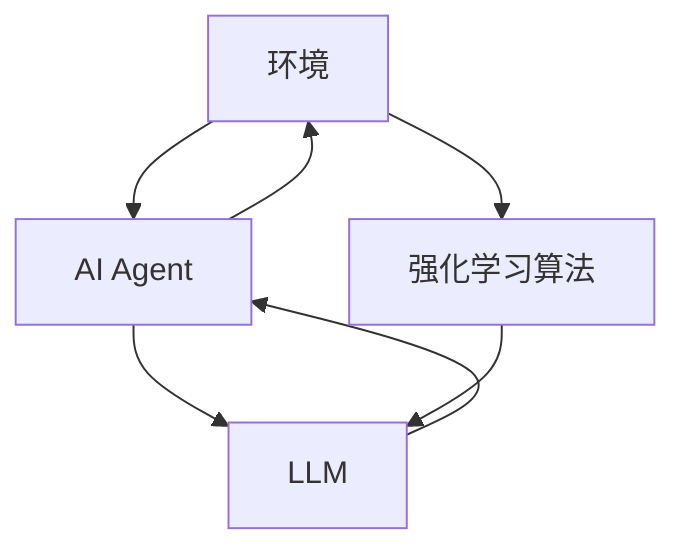

# 强化学习驱动的AI Agent：优化LLM的决策策略

> 关键词：强化学习、AI Agent、大语言模型（LLM）、决策策略、优化

> 摘要：本文围绕强化学习驱动的AI Agent在优化大语言模型（LLM）决策策略方面展开深入探讨。首先介绍了相关背景知识，包括目的范围、预期读者等。接着阐述了核心概念及联系，通过文本示意图和Mermaid流程图清晰展示其原理和架构。详细讲解了核心算法原理，并结合Python源代码进行具体操作步骤的说明。给出了相关数学模型和公式，并举例说明。通过项目实战，展示了开发环境搭建、源代码实现及解读。分析了实际应用场景，推荐了相关学习资源、开发工具框架和论文著作。最后总结了未来发展趋势与挑战，提供了常见问题解答和扩展阅读参考资料，旨在为读者全面呈现强化学习在优化LLM决策策略中的应用和价值。

## 1. 背景介绍 
### 1.1 目的和范围
随着人工智能技术的飞速发展，大语言模型（LLM）在自然语言处理等领域取得了显著成就。然而，LLM在决策能力方面仍存在一定的局限性，如在复杂任务中可能产生不准确或不合理的决策。本文章的目的在于深入探讨如何利用强化学习驱动的AI Agent来优化LLM的决策策略，提升其在各种任务中的表现。范围涵盖强化学习和LLM的基本概念、核心算法原理、数学模型、项目实战、实际应用场景以及相关工具和资源推荐等方面。

### 1.2 预期读者
本文预期读者包括对人工智能、强化学习、大语言模型等领域感兴趣的科研人员、开发者、学生以及相关技术爱好者。希望读者具备一定的编程基础和人工智能领域的基础知识，以便更好地理解文中的技术内容。

### 1.3 文档结构概述
本文共分为十个部分。第一部分为背景介绍，阐述目的范围、预期读者、文档结构概述和术语表；第二部分讲解核心概念与联系，包括原理和架构的文本示意图及Mermaid流程图；第三部分详细说明核心算法原理和具体操作步骤，结合Python源代码；第四部分介绍数学模型和公式，并举例说明；第五部分进行项目实战，包括开发环境搭建、源代码实现和解读；第六部分分析实际应用场景；第七部分推荐相关工具和资源，如学习资源、开发工具框架和论文著作；第八部分总结未来发展趋势与挑战；第九部分为附录，提供常见问题与解答；第十部分为扩展阅读和参考资料。

### 1.4 术语表
#### 1.4.1 核心术语定义
- **强化学习（Reinforcement Learning）**：一种机器学习范式，智能体（Agent）通过与环境进行交互，根据环境反馈的奖励信号来学习最优行为策略，以最大化长期累积奖励。
- **AI Agent（人工智能智能体）**：能够感知环境、做出决策并采取行动的人工智能实体。
- **大语言模型（Large Language Model，LLM）**：基于深度学习技术，具有大量参数和强大语言理解与生成能力的语言模型，如GPT系列、BERT等。
- **决策策略（Decision Policy）**：智能体在不同状态下选择行动的规则或方法。

#### 1.4.2 相关概念解释
- **状态（State）**：环境在某一时刻的特征描述，智能体根据当前状态来做出决策。
- **行动（Action）**：智能体在某一状态下可以采取的操作。
- **奖励（Reward）**：环境对智能体采取的行动的反馈信号，用于评估行动的好坏。
- **策略网络（Policy Network）**：在强化学习中，用于生成智能体行动策略的神经网络。

#### 1.4.3 缩略词列表
- **LLM**：Large Language Model（大语言模型）
- **DQN**：Deep Q-Network（深度Q网络）
- **PPO**：Proximal Policy Optimization（近端策略优化）

## 2. 核心概念与联系 
### 核心概念原理
强化学习驱动的AI Agent优化LLM决策策略的核心思想是将强化学习的方法应用于LLM，使LLM能够根据环境的反馈不断调整自己的决策策略，以实现更优的性能。

在这个过程中，AI Agent作为智能体与环境进行交互。环境可以是具体的任务场景，如文本生成、问答系统等。AI Agent根据当前的状态（如输入的文本、任务要求等）从LLM中获取可能的行动（如生成的文本内容、回答的答案等），并将这些行动应用到环境中。环境会根据行动的效果给出奖励信号，AI Agent根据奖励信号来评估行动的好坏，并通过强化学习算法更新LLM的决策策略，使得LLM在未来的决策中能够获得更高的奖励。

### 架构的文本示意图
```plaintext
+-----------------+
|     环境         |
+-----------------+
       ^
       |  状态
       v
+-----------------+
|   AI Agent      |
+-----------------+
       ^
       |  行动
       v
+-----------------+
|     LLM         |
+-----------------+
       ^
       |  奖励
       v
+-----------------+
| 强化学习算法    |
+-----------------+
       ^
       |  更新策略
       v
+-----------------+
|     LLM         |
+-----------------+
```

### Mermaid流程图


## 3. 核心算法原理 & 具体操作步骤 
### 核心算法原理
在强化学习中，有多种算法可以用于优化LLM的决策策略，这里以近端策略优化（PPO）算法为例进行讲解。

PPO算法是一种基于策略梯度的强化学习算法，其核心思想是通过限制策略更新的步长，避免在更新策略时出现过大的波动，从而提高算法的稳定性和收敛速度。

PPO算法的目标是最大化目标函数：
$$
J(\theta) = \hat{\mathbb{E}}_t \left[ \min \left( r_t(\theta) \hat{A}_t, \text{clip}\left(r_t(\theta), 1 - \epsilon, 1 + \epsilon\right) \hat{A}_t \right) \right]
$$
其中，$r_t(\theta) = \frac{\pi_{\theta}(a_t|s_t)}{\pi_{\theta_{old}}(a_t|s_t)}$ 是新旧策略的概率比，$\hat{A}_t$ 是优势估计，$\epsilon$ 是一个超参数，用于控制策略更新的步长。

### 具体操作步骤及Python源代码
以下是一个简化的使用PPO算法优化LLM决策策略的Python代码示例：

```python
import torch
import torch.nn as nn
import torch.optim as optim
import numpy as np

# 定义LLM模型（这里简单用一个全连接网络代替）
class LLM(nn.Module):
    def __init__(self, input_dim, output_dim):
        super(LLM, self).__init__()
        self.fc1 = nn.Linear(input_dim, 128)
        self.fc2 = nn.Linear(128, output_dim)

    def forward(self, x):
        x = torch.relu(self.fc1(x))
        x = self.fc2(x)
        return x

# 定义PPO算法类
class PPO:
    def __init__(self, model, lr=0.001, gamma=0.99, epsilon=0.2):
        self.model = model
        self.optimizer = optim.Adam(model.parameters(), lr=lr)
        self.gamma = gamma
        self.epsilon = epsilon

    def update(self, states, actions, rewards, old_log_probs):
        states = torch.FloatTensor(states)
        actions = torch.FloatTensor(actions)
        rewards = torch.FloatTensor(rewards)
        old_log_probs = torch.FloatTensor(old_log_probs)

        # 计算优势估计
        values = self.model(states)
        advantages = rewards - values.detach()

        # 计算新的动作概率
        logits = self.model(states)
        probs = torch.softmax(logits, dim=1)
        log_probs = torch.log(probs.gather(1, actions.unsqueeze(1)).squeeze(1))

        # 计算概率比
        ratio = torch.exp(log_probs - old_log_probs)

        # 计算目标函数
        surr1 = ratio * advantages
        surr2 = torch.clamp(ratio, 1 - self.epsilon, 1 + self.epsilon) * advantages
        loss = -torch.min(surr1, surr2).mean()

        # 更新模型参数
        self.optimizer.zero_grad()
        loss.backward()
        self.optimizer.step()

# 初始化LLM模型和PPO算法
input_dim = 10
output_dim = 5
llm = LLM(input_dim, output_dim)
ppo = PPO(llm)

# 模拟环境交互数据
num_episodes = 10
states = []
actions = []
rewards = []
old_log_probs = []

for episode in range(num_episodes):
    state = np.random.rand(input_dim)
    logits = llm(torch.FloatTensor(state).unsqueeze(0))
    probs = torch.softmax(logits, dim=1)
    action = torch.multinomial(probs, 1).item()
    log_prob = torch.log(probs[0, action])

    # 模拟奖励
    reward = np.random.rand()

    states.append(state)
    actions.append(action)
    rewards.append(reward)
    old_log_probs.append(log_prob.item())

# 更新LLM的决策策略
ppo.update(states, actions, rewards, old_log_probs)
```

## 4. 数学模型和公式 & 详细讲解 & 举例说明 
### 数学模型和公式
#### 马尔可夫决策过程（MDP）
强化学习通常可以用马尔可夫决策过程来建模，一个MDP可以用一个五元组 $(S, A, P, R, \gamma)$ 表示：
- $S$ 是状态空间，表示环境所有可能的状态。
- $A$ 是行动空间，表示智能体在每个状态下可以采取的行动。
- $P(s'|s, a)$ 是状态转移概率，表示在状态 $s$ 采取行动 $a$ 后转移到状态 $s'$ 的概率。
- $R(s, a)$ 是奖励函数，表示在状态 $s$ 采取行动 $a$ 后获得的即时奖励。
- $\gamma \in [0, 1]$ 是折扣因子，用于权衡即时奖励和未来奖励的重要性。

#### 价值函数
- **状态价值函数 $V^{\pi}(s)$**：表示在策略 $\pi$ 下，从状态 $s$ 开始的期望累积折扣奖励：
$$
V^{\pi}(s) = \mathbb{E}_{\pi} \left[ \sum_{t=0}^{\infty} \gamma^t R(s_t, a_t) | s_0 = s \right]
$$
- **动作价值函数 $Q^{\pi}(s, a)$**：表示在策略 $\pi$ 下，从状态 $s$ 采取行动 $a$ 后，后续的期望累积折扣奖励：
$$
Q^{\pi}(s, a) = \mathbb{E}_{\pi} \left[ \sum_{t=0}^{\infty} \gamma^t R(s_t, a_t) | s_0 = s, a_0 = a \right]
$$

#### 策略梯度
策略梯度算法的目标是最大化期望累积奖励：
$$
J(\theta) = \mathbb{E}_{\pi_{\theta}} \left[ \sum_{t=0}^{\infty} \gamma^t R(s_t, a_t) \right]
$$
策略梯度定理表明，策略梯度可以表示为：
$$
\nabla_{\theta} J(\theta) = \mathbb{E}_{\pi_{\theta}} \left[ \nabla_{\theta} \log \pi_{\theta}(a|s) Q^{\pi_{\theta}}(s, a) \right]
$$

### 详细讲解
马尔可夫决策过程是强化学习的基础模型，它描述了智能体与环境交互的动态过程。状态价值函数和动作价值函数用于评估在不同策略下状态和行动的价值，帮助智能体做出更优的决策。策略梯度算法通过计算策略的梯度来更新策略参数，使得策略朝着最大化期望累积奖励的方向优化。

### 举例说明
假设一个简单的机器人导航任务，状态空间 $S$ 表示机器人在地图上的位置，行动空间 $A$ 表示机器人可以采取的移动方向（上、下、左、右）。奖励函数 $R(s, a)$ 可以根据机器人是否到达目标位置或是否撞到障碍物来设置，例如到达目标位置获得正奖励，撞到障碍物获得负奖励。

在这个任务中，状态价值函数 $V^{\pi}(s)$ 可以表示机器人在位置 $s$ 时，按照策略 $\pi$ 行动最终获得的期望累积奖励。动作价值函数 $Q^{\pi}(s, a)$ 可以表示机器人在位置 $s$ 采取行动 $a$ 后，按照策略 $\pi$ 行动最终获得的期望累积奖励。策略梯度算法可以通过不断更新机器人的行动策略，使得机器人能够更快地找到目标位置。

## 5. 项目实战：代码实际案例和详细解释说明 
### 5.1  开发环境搭建
#### 操作系统
建议使用Linux或macOS系统，因为它们对深度学习框架的支持更好。Windows系统也可以使用，但可能会遇到一些兼容性问题。

#### 编程语言
使用Python 3.7及以上版本，Python是深度学习领域最常用的编程语言，具有丰富的库和工具。

#### 深度学习框架
使用PyTorch作为深度学习框架，PyTorch具有动态图的特点，易于调试和开发。可以使用以下命令安装PyTorch：
```bash
pip install torch torchvision
```

#### 其他依赖库
安装NumPy、Matplotlib等常用的科学计算和可视化库：
```bash
pip install numpy matplotlib
```

### 5.2  源代码详细实现和代码解读
以下是一个更完整的使用强化学习优化LLM在文本生成任务中决策策略的代码示例：

```python
import torch
import torch.nn as nn
import torch.optim as optim
import numpy as np
import random

# 定义LLM模型
class LLM(nn.Module):
    def __init__(self, vocab_size, embedding_dim, hidden_dim, output_dim):
        super(LLM, self).__init__()
        self.embedding = nn.Embedding(vocab_size, embedding_dim)
        self.lstm = nn.LSTM(embedding_dim, hidden_dim, batch_first=True)
        self.fc = nn.Linear(hidden_dim, output_dim)

    def forward(self, x):
        embedded = self.embedding(x)
        output, _ = self.lstm(embedded)
        output = self.fc(output[:, -1, :])
        return output

# 定义PPO算法类
class PPO:
    def __init__(self, model, lr=0.001, gamma=0.99, epsilon=0.2):
        self.model = model
        self.optimizer = optim.Adam(model.parameters(), lr=lr)
        self.gamma = gamma
        self.epsilon = epsilon

    def update(self, states, actions, rewards, old_log_probs):
        states = torch.LongTensor(states)
        actions = torch.LongTensor(actions)
        rewards = torch.FloatTensor(rewards)
        old_log_probs = torch.FloatTensor(old_log_probs)

        # 计算优势估计
        values = self.model(states)
        advantages = rewards - values.detach()

        # 计算新的动作概率
        logits = self.model(states)
        probs = torch.softmax(logits, dim=1)
        log_probs = torch.log(probs.gather(1, actions.unsqueeze(1)).squeeze(1))

        # 计算概率比
        ratio = torch.exp(log_probs - old_log_probs)

        # 计算目标函数
        surr1 = ratio * advantages
        surr2 = torch.clamp(ratio, 1 - self.epsilon, 1 + self.epsilon) * advantages
        loss = -torch.min(surr1, surr2).mean()

        # 更新模型参数
        self.optimizer.zero_grad()
        loss.backward()
        self.optimizer.step()

# 模拟文本生成环境
class TextGenerationEnv:
    def __init__(self, vocab_size, max_length):
        self.vocab_size = vocab_size
        self.max_length = max_length
        self.current_length = 0
        self.state = []

    def reset(self):
        self.current_length = 0
        self.state = []
        return self.state

    def step(self, action):
        self.state.append(action)
        self.current_length += 1
        done = self.current_length >= self.max_length

        # 简单的奖励函数：生成的文本越长奖励越高
        reward = len(self.state)

        return self.state, reward, done, {}

# 训练过程
vocab_size = 100
embedding_dim = 16
hidden_dim = 32
output_dim = vocab_size
max_length = 10

llm = LLM(vocab_size, embedding_dim, hidden_dim, output_dim)
ppo = PPO(llm)
env = TextGenerationEnv(vocab_size, max_length)

num_episodes = 100
for episode in range(num_episodes):
    state = env.reset()
    states = []
    actions = []
    rewards = []
    old_log_probs = []

    done = False
    while not done:
        state_tensor = torch.LongTensor([state])
        logits = llm(state_tensor)
        probs = torch.softmax(logits, dim=1)
        action = torch.multinomial(probs, 1).item()
        log_prob = torch.log(probs[0, action])

        next_state, reward, done, _ = env.step(action)

        states.append(state)
        actions.append(action)
        rewards.append(reward)
        old_log_probs.append(log_prob.item())

        state = next_state

    # 更新LLM的决策策略
    ppo.update(states, actions, rewards, old_log_probs)

    if episode % 10 == 0:
        print(f"Episode {episode}: Total reward = {sum(rewards)}")
```

### 5.3  代码解读与分析
#### LLM模型
`LLM` 类定义了一个简单的基于LSTM的语言模型，包括嵌入层、LSTM层和全连接层。嵌入层将输入的词索引转换为词向量，LSTM层处理序列信息，全连接层输出每个词的概率分布。

#### PPO算法类
`PPO` 类实现了近端策略优化算法，包括策略更新的具体步骤。通过计算优势估计、概率比和目标函数，使用梯度下降法更新模型参数。

#### 文本生成环境
`TextGenerationEnv` 类模拟了文本生成环境，包括重置环境、执行动作和返回奖励等功能。奖励函数简单地根据生成的文本长度来设置。

#### 训练过程
在训练过程中，智能体与环境进行交互，收集状态、动作、奖励和旧的动作概率信息。每个回合结束后，使用PPO算法更新LLM的决策策略。

## 6. 实际应用场景 
### 智能客服
在智能客服系统中，LLM可以作为核心的语言处理模块，用于理解用户的问题并生成回答。强化学习驱动的AI Agent可以根据用户的反馈（如满意度评分）来优化LLM的决策策略，使得智能客服能够提供更准确、更满意的回答。

### 智能写作助手
智能写作助手可以利用LLM生成文本内容。强化学习可以根据文章的质量评估（如可读性、逻辑性等）来调整LLM的决策策略，帮助用户生成更高质量的文章。

### 游戏AI
在游戏中，LLM可以用于生成游戏角色的对话和决策。强化学习驱动的AI Agent可以根据游戏的胜负结果、玩家的反馈等信息来优化LLM的决策策略，提高游戏AI的智能水平。

### 自动翻译
在自动翻译任务中，强化学习可以根据翻译的准确性、流畅性等指标来优化LLM的决策策略，使得翻译结果更加准确和自然。

## 7. 工具和资源推荐
### 7.1 学习资源推荐
#### 7.1.1 书籍推荐
- 《强化学习：原理与Python实现》：全面介绍了强化学习的基本原理和算法，并给出了Python实现代码，适合初学者入门。
- 《深度学习》：深度学习领域的经典著作，对神经网络、优化算法等方面进行了深入讲解，为理解强化学习和LLM提供了理论基础。
- 《动手学深度学习》：以实际代码为导向，详细介绍了深度学习的各种应用，包括自然语言处理和强化学习等。

#### 7.1.2 在线课程
- Coursera上的“Reinforcement Learning Specialization”：由顶尖学者授课，系统地介绍了强化学习的理论和实践。
- edX上的“Deep Learning Fundamentals”：涵盖了深度学习的基础知识，包括神经网络、优化算法等，为学习强化学习和LLM打下基础。
- 哔哩哔哩上的“李宏毅机器学习”：以生动有趣的方式讲解机器学习和深度学习的知识，包括强化学习的相关内容。

#### 7.1.3 技术博客和网站
- OpenAI Blog：OpenAI官方博客，发布了许多关于强化学习、大语言模型等领域的最新研究成果和技术文章。
- DeepMind Blog：DeepMind官方博客，分享了在人工智能领域的前沿研究和实践经验。
- arXiv：一个预印本论文库，包含了大量关于强化学习、大语言模型等领域的最新研究论文。

### 7.2 开发工具框架推荐
#### 7.2.1 IDE和编辑器
- PyCharm：一款专业的Python集成开发环境，具有强大的代码编辑、调试和自动补全功能，适合开发深度学习项目。
- Visual Studio Code：一款轻量级的代码编辑器，支持多种编程语言和插件，可通过安装相关插件来支持深度学习开发。

#### 7.2.2 调试和性能分析工具
- TensorBoard：TensorFlow的可视化工具，也可以与PyTorch结合使用，用于可视化训练过程中的损失函数、准确率等指标。
- PyTorch Profiler：PyTorch自带的性能分析工具，用于分析模型的性能瓶颈，帮助优化代码。

#### 7.2.3 相关框架和库
- Stable Baselines3：一个基于PyTorch的强化学习库，提供了多种强化学习算法的实现，方便快速开发和实验。
- Hugging Face Transformers：一个流行的自然语言处理库，提供了多种预训练的大语言模型，如GPT、BERT等，方便进行文本处理任务。

### 7.3 相关论文著作推荐
#### 7.3.1 经典论文
- “Playing Atari with Deep Reinforcement Learning”：介绍了深度Q网络（DQN）算法，开创了深度强化学习的先河。
- “Proximal Policy Optimization Algorithms”：提出了近端策略优化（PPO）算法，是目前应用广泛的强化学习算法之一。
- “Attention Is All You Need”：提出了Transformer架构，为大语言模型的发展奠定了基础。

#### 7.3.2 最新研究成果
- 关注arXiv上关于强化学习和大语言模型的最新论文，了解该领域的前沿研究动态。
- 参加相关的学术会议，如NeurIPS、ICML等，获取最新的研究成果和技术报告。

#### 7.3.3 应用案例分析
- 研究OpenAI、DeepMind等机构发布的应用案例，了解强化学习和大语言模型在实际场景中的应用和优化方法。
- 分析工业界的开源项目，学习如何将强化学习和大语言模型应用于实际产品中。

## 8. 总结：未来发展趋势与挑战
### 未来发展趋势
#### 融合多模态信息
未来的强化学习驱动的AI Agent将不仅仅依赖于文本信息，还会融合图像、语音等多模态信息，以提升LLM在更复杂场景下的决策能力。例如，在智能客服中结合用户的语音情感和图像表情来提供更个性化的服务。

#### 强化学习与元学习的结合
元学习可以帮助智能体快速适应新的任务和环境，将强化学习与元学习相结合，可以使LLM更快地学习新的决策策略，提高其泛化能力。

#### 大规模分布式训练
随着模型规模的不断增大，大规模分布式训练将成为必然趋势。通过分布式训练，可以充分利用多台计算设备的计算资源，加速模型的训练过程。

### 挑战
#### 计算资源需求
强化学习和大语言模型的训练需要大量的计算资源，包括GPU、TPU等。如何降低计算成本，提高计算效率是一个亟待解决的问题。

#### 数据隐私和安全
在使用强化学习优化LLM决策策略的过程中，需要处理大量的数据，包括用户的隐私信息。如何保证数据的隐私和安全，防止数据泄露和滥用是一个重要的挑战。

#### 可解释性问题
强化学习和大语言模型通常是黑盒模型，其决策过程难以解释。在一些关键领域，如医疗、金融等，模型的可解释性至关重要。如何提高模型的可解释性，让用户理解模型的决策依据是一个需要研究的问题。

## 9. 附录：常见问题与解答
### 1. 强化学习和监督学习有什么区别？
监督学习是通过给定的输入-输出对来训练模型，模型的目标是学习输入和输出之间的映射关系。而强化学习是通过智能体与环境的交互，根据环境反馈的奖励信号来学习最优行为策略。监督学习更侧重于预测，而强化学习更侧重于决策。

### 2. 如何选择合适的强化学习算法？
选择合适的强化学习算法需要考虑任务的特点、计算资源和模型的复杂度等因素。如果任务是离散动作空间，可以考虑使用DQN、PPO等算法；如果任务是连续动作空间，可以考虑使用DDPG、TD3等算法。同时，还需要根据计算资源和模型的复杂度来选择合适的算法，例如，如果计算资源有限，可以选择简单一些的算法。

### 3. 如何评估强化学习模型的性能？
可以使用多种指标来评估强化学习模型的性能，如平均累积奖励、成功率、收敛速度等。平均累积奖励是最常用的指标，它表示智能体在多个回合中获得的平均奖励值。成功率表示智能体在执行任务时成功的比例。收敛速度表示模型达到稳定性能所需的训练时间。

### 4. 如何处理强化学习中的探索与利用的平衡问题？
探索与利用的平衡是强化学习中的一个重要问题。可以使用多种方法来处理这个问题，如 $\epsilon$-贪心策略、玻尔兹曼探索等。$\epsilon$-贪心策略是在一定概率 $\epsilon$ 下随机选择一个动作进行探索，在 $1 - \epsilon$ 的概率下选择当前最优的动作进行利用。玻尔兹曼探索是根据动作的价值函数来计算动作的选择概率，价值函数越高的动作被选择的概率越大。

## 10. 扩展阅读 & 参考资料
### 扩展阅读
- Sutton, Richard S., and Andrew G. Barto. Reinforcement Learning: An Introduction. MIT press, 2018.
- Goodfellow, Ian, Yoshua Bengio, and Aaron Courville. Deep Learning. MIT press, 2016.

### 参考资料
- OpenAI官方网站：https://openai.com/
- DeepMind官方网站：https://deepmind.com/
- Hugging Face官方网站：https://huggingface.co/
- arXiv预印本论文库：https://arxiv.org/