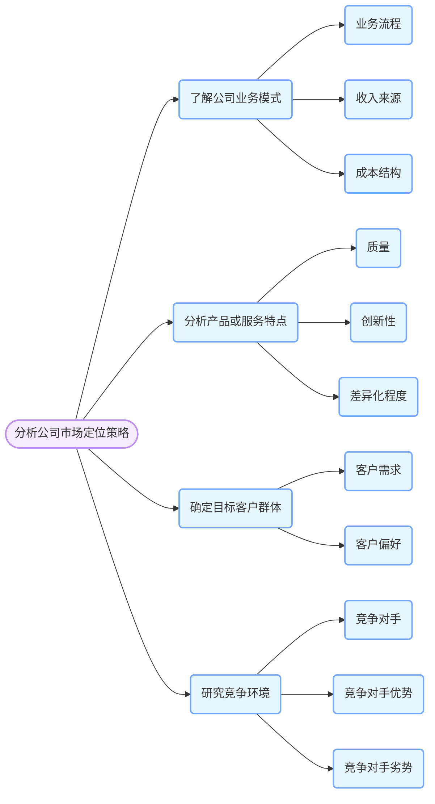

# 彼得林奇如何分析公司的市场定位策略

> 关键词：彼得林奇、市场定位策略、公司分析、投资、竞争优势

> 摘要：本文旨在深入探讨彼得林奇分析公司市场定位策略的方法。彼得林奇作为投资界的传奇人物，其独特的分析视角和方法对投资者和企业管理者都具有极高的参考价值。通过剖析彼得林奇的分析思路，我们能够更好地理解公司在市场中的地位、竞争优势以及未来发展潜力，从而为投资决策和企业战略制定提供有力支持。

## 1. 背景介绍 
### 1.1 目的和范围
本文的目的在于全面解读彼得林奇分析公司市场定位策略的方法和理念。我们将详细探讨他在评估公司时所关注的各个方面，包括公司的业务模式、产品特点、竞争环境等。范围涵盖了不同行业、不同规模的公司，旨在揭示彼得林奇分析方法的通用性和有效性。

### 1.2 预期读者
本文预期读者包括投资者、企业管理者、金融分析师以及对投资和企业战略感兴趣的人士。无论是希望在股票市场中寻找优质投资标的的投资者，还是想要优化企业市场定位的管理者，都能从本文中获得有价值的信息和启示。

### 1.3 文档结构概述
本文将按照以下结构展开：首先介绍相关的背景知识和术语；接着阐述彼得林奇分析公司市场定位策略所涉及的核心概念和它们之间的联系；然后详细讲解其核心算法原理和具体操作步骤，并通过数学模型和公式进行进一步说明；之后通过项目实战案例展示如何运用这些方法进行公司分析；再探讨公司市场定位策略的实际应用场景；推荐相关的学习资源、开发工具框架和论文著作；最后总结未来发展趋势与挑战，并提供常见问题解答和扩展阅读参考资料。

### 1.4 术语表
#### 1.4.1 核心术语定义
- **市场定位策略**：指企业根据自身的资源和能力，结合市场需求和竞争状况，确定其产品或服务在目标市场中的位置和特色，以吸引目标客户的一系列决策和行动。
- **竞争优势**：企业在市场竞争中相对于竞争对手所具有的优势，表现为成本领先、差异化、聚焦等方面。
- **利基市场**：指被市场中的统治者或有绝对优势的企业忽略的某些细分市场，企业可以凭借自身的优势在这些细分市场中获得竞争优势。

#### 1.4.2 相关概念解释
- **护城河**：这一概念由巴菲特提出，指企业抵御竞争对手的能力，类似于城堡周围的护城河保护城堡一样。彼得林奇在分析公司时也会关注公司是否具有类似的“护城河”，如品牌优势、技术专利、成本优势等。
- **成长股**：指那些具有良好发展前景、盈利增长速度较快的股票。彼得林奇善于挖掘成长股，而公司的市场定位策略是判断其是否为成长股的重要依据之一。

#### 1.4.3 缩略词列表
- **PE**：市盈率（Price Earnings Ratio），指股票价格除以每股收益的比率，用于衡量股票的估值水平。
- **ROE**：净资产收益率（Return on Equity），指净利润与平均股东权益的百分比，反映股东权益的收益水平。

## 2. 核心概念与联系 

### 核心概念原理
彼得林奇分析公司市场定位策略主要基于以下几个核心概念：

#### 公司业务模式
公司的业务模式决定了其如何创造价值和获取利润。彼得林奇会深入了解公司的业务流程、收入来源和成本结构。例如，一家制造企业的业务模式可能是通过采购原材料、生产产品并销售给客户来获取利润，而一家互联网企业可能通过提供免费服务吸引用户，然后通过广告、付费会员等方式实现盈利。

#### 产品或服务特点
产品或服务是公司与市场直接接触的载体。彼得林奇会关注产品或服务的质量、创新性、差异化程度等。具有独特特点的产品或服务能够吸引更多的客户，从而为公司带来竞争优势。例如，苹果公司的产品以其简洁的设计、强大的功能和良好的用户体验而闻名，这使得苹果在智能手机市场中占据了重要地位。

#### 目标客户群体
明确的目标客户群体是公司市场定位的关键。彼得林奇会分析公司的产品或服务主要面向哪些客户群体，以及这些客户群体的需求和偏好。不同的客户群体对产品或服务的要求不同，公司只有准确把握目标客户的需求，才能提供符合他们期望的产品或服务。例如，高端奢侈品品牌的目标客户群体通常是高收入人群，他们更注重产品的品质、品牌形象和独特性。

#### 竞争环境
公司所处的竞争环境对其市场定位策略有着重要影响。彼得林奇会研究公司的竞争对手是谁，以及竞争对手的优势和劣势。通过分析竞争环境，公司可以找到自己的差异化竞争点，从而在市场中脱颖而出。例如，在电商市场中，阿里巴巴和京东等巨头竞争激烈，一些小型电商企业则通过聚焦特定的细分市场，如母婴电商、宠物电商等，来避免与巨头直接竞争。

### 架构的文本示意图
```plaintext
公司市场定位策略
|-- 公司业务模式
|   |-- 业务流程
|   |-- 收入来源
|   |-- 成本结构
|-- 产品或服务特点
|   |-- 质量
|   |-- 创新性
|   |-- 差异化程度
|-- 目标客户群体
|   |-- 客户需求
|   |-- 客户偏好
|-- 竞争环境
|   |-- 竞争对手
|   |-- 竞争对手优势
|   |-- 竞争对手劣势
```

### Mermaid 流程图


## 3. 核心算法原理 & 具体操作步骤 

### 核心算法原理
彼得林奇分析公司市场定位策略的核心算法原理可以概括为：通过对公司业务模式、产品或服务特点、目标客户群体和竞争环境的深入分析，评估公司的竞争优势和市场地位，从而判断公司的投资价值。具体来说，他会综合考虑多个因素，采用定性和定量相结合的方法进行分析。

### 具体操作步骤

#### 步骤 1：收集公司信息
- 收集公司的财务报表、年报、招股说明书等公开资料，了解公司的基本情况、业务范围、财务状况等。
- 关注公司的新闻报道、行业研究报告等，获取关于公司的最新动态和行业发展趋势。

#### 步骤 2：分析公司业务模式
- 绘制公司的业务流程图，明确公司的业务流程和各个环节的价值创造点。
- 分析公司的收入来源，确定主要的收入渠道和收入占比。
- 研究公司的成本结构，找出成本控制的关键环节和潜在的成本降低空间。

#### 步骤 3：评估产品或服务特点
- 对公司的产品或服务进行实地考察或试用，了解其质量、性能、使用体验等。
- 研究公司的研发投入和创新能力，评估产品或服务的创新性和差异化程度。
- 收集客户对公司产品或服务的反馈和评价，了解客户的满意度和需求。

#### 步骤 4：确定目标客户群体
- 通过市场调研、数据分析等方法，确定公司的目标客户群体。
- 分析目标客户群体的需求、偏好、消费行为等特征，为公司的市场定位提供依据。

#### 步骤 5：研究竞争环境
- 识别公司的主要竞争对手，分析竞争对手的产品或服务特点、市场份额、竞争策略等。
- 比较公司与竞争对手的优势和劣势，找出公司的差异化竞争点。
- 关注行业的竞争格局和发展趋势，评估公司在未来竞争中的生存和发展能力。

#### 步骤 6：综合评估公司市场定位
- 根据以上分析结果，综合评估公司的市场定位是否准确、合理，是否具有竞争优势。
- 结合公司的财务状况、盈利能力、成长潜力等因素，判断公司的投资价值。

### Python 源代码示例
```python
# 示例：模拟收集公司信息并进行简单分析
import pandas as pd

# 假设我们有一个包含公司信息的 CSV 文件
def load_company_data(file_path):
    try:
        data = pd.read_csv(file_path)
        return data
    except FileNotFoundError:
        print(f"文件 {file_path} 未找到，请检查文件路径。")
        return None

# 分析公司业务模式：计算收入占比
def analyze_business_model(data):
    if data is not None:
        revenue_columns = [col for col in data.columns if 'revenue' in col.lower()]
        total_revenue = data[revenue_columns].sum(axis=1)
        for col in revenue_columns:
            data[f'{col}_ratio'] = data[col] / total_revenue
        return data
    else:
        return None

# 示例使用
file_path = 'company_data.csv'
company_data = load_company_data(file_path)
analyzed_data = analyze_business_model(company_data)
if analyzed_data is not None:
    print(analyzed_data)
```

## 4. 数学模型和公式 & 详细讲解 & 举例说明 

### 数学模型和公式
#### 市盈率（PE）
市盈率是衡量股票估值的常用指标，计算公式为：
$$PE = \frac{股票价格}{每股收益}$$
其中，股票价格是指股票在市场上的交易价格，每股收益是指公司净利润除以总股本。市盈率反映了投资者为获取公司每一元盈利所愿意支付的价格。一般来说，市盈率较低的股票可能被低估，具有投资价值；而市盈率较高的股票可能被高估，投资风险较大。

#### 净资产收益率（ROE）
净资产收益率是衡量公司盈利能力的重要指标，计算公式为：
$$ROE = \frac{净利润}{平均股东权益} \times 100\%$$
其中，净利润是指公司在一定时期内的盈利，平均股东权益是指期初股东权益和期末股东权益的平均值。净资产收益率反映了股东权益的收益水平，指标值越高，说明公司的盈利能力越强。

#### 市场份额
市场份额是指公司的产品或服务在市场中所占的比例，计算公式为：
$$市场份额 = \frac{公司销售额}{市场总销售额} \times 100\%$$
市场份额反映了公司在市场中的竞争地位，市场份额越高，说明公司在市场中的影响力越大。

### 详细讲解
- **市盈率（PE）**：市盈率是一个相对估值指标，不同行业的市盈率水平可能存在较大差异。例如，新兴行业（如科技行业）的市盈率通常较高，因为投资者对这些行业的未来发展前景抱有较高的期望；而传统行业（如制造业）的市盈率相对较低。在使用市盈率进行估值时，需要结合公司的盈利增长情况、行业平均市盈率等因素进行综合分析。
- **净资产收益率（ROE）**：净资产收益率是一个综合性指标，反映了公司的盈利能力、资产运营效率和财务杠杆水平。较高的净资产收益率可能意味着公司具有较强的盈利能力和较好的资产运营效率，但也可能是由于较高的财务杠杆带来的。因此，在分析净资产收益率时，需要关注公司的负债情况和现金流状况。
- **市场份额**：市场份额的变化可以反映公司在市场中的竞争态势。如果公司的市场份额不断上升，说明公司的产品或服务具有较强的竞争力，市场地位在不断巩固；反之，如果市场份额不断下降，可能意味着公司面临着激烈的竞争压力，需要及时调整市场定位策略。

### 举例说明
假设公司 A 的股票价格为 50 元，每股收益为 2 元，则其市盈率为：
$$PE = \frac{50}{2} = 25$$
假设公司 A 在年初的股东权益为 1000 万元，年末的股东权益为 1200 万元，净利润为 200 万元，则其净资产收益率为：
$$ROE = \frac{200}{\frac{1000 + 1200}{2}} \times 100\% = \frac{200}{1100} \times 100\% \approx 18.18\%$$
假设市场总销售额为 10000 万元，公司 A 的销售额为 1000 万元，则其市场份额为：
$$市场份额 = \frac{1000}{10000} \times 100\% = 10\%$$

## 5. 项目实战：代码实际案例和详细解释说明 

### 5.1  开发环境搭建
- **操作系统**：推荐使用 Windows、Linux 或 macOS 操作系统。
- **编程语言**：Python 3.x
- **开发工具**：推荐使用 PyCharm、Jupyter Notebook 等集成开发环境。
- **相关库**：安装 pandas、numpy、matplotlib 等常用数据分析和可视化库。可以使用以下命令进行安装：
```sh
pip install pandas numpy matplotlib
```

### 5.2  源代码详细实现和代码解读
```python
import pandas as pd
import numpy as np
import matplotlib.pyplot as plt

# 步骤 1：加载公司数据
def load_company_data(file_path):
    try:
        data = pd.read_csv(file_path)
        return data
    except FileNotFoundError:
        print(f"文件 {file_path} 未找到，请检查文件路径。")
        return None

# 步骤 2：分析公司业务模式
def analyze_business_model(data):
    if data is not None:
        # 计算总收入
        revenue_columns = [col for col in data.columns if 'revenue' in col.lower()]
        data['total_revenue'] = data[revenue_columns].sum(axis=1)
        
        # 计算各收入来源的占比
        for col in revenue_columns:
            data[f'{col}_ratio'] = data[col] / data['total_revenue']
        
        return data
    else:
        return None

# 步骤 3：评估产品或服务特点（假设根据客户满意度评分）
def evaluate_product_quality(data):
    if data is not None:
        # 假设客户满意度评分在 'customer_satisfaction' 列
        if 'customer_satisfaction' in data.columns:
            data['product_quality_rating'] = pd.cut(data['customer_satisfaction'], bins=[0, 2, 4, 5], labels=['low', 'medium', 'high'])
        else:
            print("数据中缺少客户满意度评分列，请检查数据。")
        return data
    else:
        return None

# 步骤 4：确定目标客户群体（假设根据年龄和收入划分）
def identify_target_customers(data):
    if data is not None:
        # 假设年龄在 'age' 列，收入在 'income' 列
        if 'age' in data.columns and 'income' in data.columns:
            data['age_group'] = pd.cut(data['age'], bins=[0, 30, 60, 100], labels=['young', 'middle-aged', 'old'])
            data['income_group'] = pd.cut(data['income'], bins=[0, 50000, 100000, np.inf], labels=['low', 'medium', 'high'])
            data['target_customer_group'] = data['age_group'] + '_' + data['income_group']
        else:
            print("数据中缺少年龄或收入列，请检查数据。")
        return data
    else:
        return None

# 步骤 5：研究竞争环境（假设根据市场份额）
def analyze_competition(data):
    if data is not None:
        # 假设市场份额在 'market_share' 列
        if 'market_share' in data.columns:
            data['competition_level'] = pd.cut(data['market_share'], bins=[0, 0.1, 0.3, 1], labels=['high', 'medium', 'low'])
        else:
            print("数据中缺少市场份额列，请检查数据。")
        return data
    else:
        return None

# 步骤 6：综合评估公司市场定位
def comprehensive_evaluation(data):
    if data is not None:
        # 假设根据各指标的权重进行综合评分
        weights = {
            'total_revenue': 0.3,
            'product_quality_rating': 0.2,
            'target_customer_group': 0.2,
            'competition_level': 0.3
        }
        
        # 将分类变量转换为数值变量
        rating_mapping = {
            'low': 1,
            'medium': 2,
            'high': 3
        }
        data['product_quality_score'] = data['product_quality_rating'].map(rating_mapping)
        data['competition_score'] = data['competition_level'].map(rating_mapping)
        
        # 计算综合评分
        data['comprehensive_score'] = (
            weights['total_revenue'] * data['total_revenue'] +
            weights['product_quality_rating'] * data['product_quality_score'] +
            weights['target_customer_group'] * data['income_group'].map(rating_mapping) +
            weights['competition_level'] * data['competition_score']
        )
        
        return data
    else:
        return None

# 示例使用
file_path = 'company_data.csv'
company_data = load_company_data(file_path)
company_data = analyze_business_model(company_data)
company_data = evaluate_product_quality(company_data)
company_data = identify_target_customers(company_data)
company_data = analyze_competition(company_data)
company_data = comprehensive_evaluation(company_data)

if company_data is not None:
    print(company_data)
    
    # 可视化分析结果
    plt.figure(figsize=(10, 6))
    plt.bar(company_data.index, company_data['comprehensive_score'])
    plt.xlabel('Company Index')
    plt.ylabel('Comprehensive Score')
    plt.title('Comprehensive Evaluation of Company Market Positioning')
    plt.show()
```

### 5.3  代码解读与分析
- **加载公司数据**：使用 `pandas` 库的 `read_csv` 函数加载包含公司信息的 CSV 文件。如果文件不存在，会输出错误信息。
- **分析公司业务模式**：计算公司的总收入和各收入来源的占比，帮助了解公司的收入结构。
- **评估产品或服务特点**：根据客户满意度评分将产品或服务质量分为低、中、高三个等级。
- **确定目标客户群体**：根据年龄和收入将客户划分为不同的群体，从而确定公司的目标客户群体。
- **研究竞争环境**：根据市场份额将竞争程度分为高、中、低三个等级。
- **综合评估公司市场定位**：根据各指标的权重计算综合评分，对公司的市场定位进行综合评估。最后使用 `matplotlib` 库将综合评分进行可视化展示。

## 6. 实际应用场景 
### 投资决策
投资者可以运用彼得林奇的方法分析公司的市场定位策略，从而筛选出具有投资价值的公司。通过深入了解公司的业务模式、产品特点、目标客户群体和竞争环境，投资者可以评估公司的竞争优势和成长潜力，判断公司的股票是否被低估或高估，进而做出合理的投资决策。

### 企业战略制定
企业管理者可以借鉴彼得林奇的分析方法，对自身企业的市场定位进行评估和优化。通过分析市场需求、竞争态势和自身优势，企业可以确定更加准确的目标客户群体，调整产品或服务策略，提高市场竞争力。例如，企业可以根据市场定位分析结果，决定是否进入新的市场领域、推出新的产品或服务，或者调整营销策略。

### 行业研究
行业分析师可以运用彼得林奇的方法对整个行业进行研究和分析。通过比较不同公司的市场定位策略，分析师可以了解行业的竞争格局和发展趋势，发现行业中的潜在机会和威胁。这有助于行业分析师为企业提供战略建议，也为投资者提供行业研究报告，帮助他们做出投资决策。

## 7. 工具和资源推荐
### 7.1 学习资源推荐
#### 7.1.1 书籍推荐
- 《彼得·林奇的成功投资》：彼得·林奇的经典著作，详细介绍了他的投资理念和方法，包括如何分析公司的市场定位策略。
- 《聪明的投资者》：本杰明·格雷厄姆的著作，被誉为投资界的圣经，对价值投资理念进行了深入阐述，为分析公司提供了重要的理论基础。
- 《怎样选择成长股》：菲利普·费雪的著作，强调了寻找成长股的重要性和方法，对分析公司的成长潜力具有重要参考价值。

#### 7.1.2 在线课程
- Coursera 上的“投资学原理”：由知名大学教授授课，系统介绍投资学的基本原理和方法，包括公司分析和估值。
- Udemy 上的“股票投资实战技巧”：结合实际案例，讲解股票投资的实战技巧和方法，对运用彼得林奇的方法进行公司分析有很大帮助。

#### 7.1.3 技术博客和网站
- 雪球网：国内知名的投资社区，汇聚了众多投资者和行业专家，提供丰富的公司分析和投资观点。
- Seeking Alpha：国外知名的金融网站，提供专业的公司分析报告和投资建议。

### 7.2 开发工具框架推荐
#### 7.2.1 IDE和编辑器
- PyCharm：功能强大的 Python 集成开发环境，提供代码编辑、调试、版本控制等功能，适合进行数据分析和算法实现。
- Jupyter Notebook：交互式的开发环境，支持代码、文本、图表等多种形式的展示，方便进行数据分析和可视化。

#### 7.2.2 调试和性能分析工具
- PDB：Python 自带的调试工具，用于调试 Python 代码，帮助定位和解决问题。
- cProfile：Python 标准库中的性能分析工具，用于分析 Python 代码的性能瓶颈。

#### 7.2.3 相关框架和库
- pandas：用于数据处理和分析的 Python 库，提供了高效的数据结构和数据操作方法。
- numpy：用于科学计算的 Python 库，提供了高性能的多维数组对象和数学函数。
- matplotlib：用于数据可视化的 Python 库，提供了丰富的绘图功能。

### 7.3 相关论文著作推荐
#### 7.3.1 经典论文
- “The Capital Asset Pricing Model: Theory and Evidence”：由 Eugene F. Fama 和 Kenneth R. French 撰写，对资本资产定价模型进行了深入研究和探讨，为投资分析提供了重要的理论基础。
- “Common Risk Factors in the Returns on Stocks and Bonds”：同样由 Eugene F. Fama 和 Kenneth R. French 撰写，提出了著名的 Fama - French 三因子模型，对股票和债券的收益进行了更全面的解释。

#### 7.3.2 最新研究成果
- 关注顶级金融学术期刊，如《Journal of Finance》、《Review of Financial Studies》等，了解投资领域的最新研究成果和发展趋势。
- 参加金融学术会议，与国内外的专家学者交流，获取最新的研究动态。

#### 7.3.3 应用案例分析
- 各大金融机构和咨询公司发布的研究报告，通常包含大量的公司分析和投资案例，对学习和应用彼得林奇的方法具有重要参考价值。
- 上市公司的年报和招股说明书，是了解公司实际情况和市场定位策略的重要资料。

## 8. 总结：未来发展趋势与挑战
### 未来发展趋势
- **数据驱动的分析方法**：随着大数据和人工智能技术的发展，未来的公司分析将更加依赖于数据驱动的方法。通过收集和分析大量的公司数据、市场数据和客户数据，投资者和企业管理者可以更准确地了解公司的市场定位和竞争态势。
- **跨学科的分析视角**：公司分析不再局限于财务和经济领域，而是需要综合考虑技术、社会、环境等多个因素。跨学科的分析视角将有助于更全面地评估公司的价值和发展潜力。
- **个性化的投资策略**：投资者越来越注重个性化的投资需求，未来的投资策略将更加多样化和个性化。基于公司市场定位分析的个性化投资策略将成为趋势。

### 挑战
- **数据质量和可靠性**：数据是公司分析的基础，但数据质量和可靠性可能存在问题。不准确或不完整的数据可能导致错误的分析结果和决策。
- **市场变化的不确定性**：市场环境是不断变化的，公司的市场定位策略也需要不断调整。准确预测市场变化和公司的适应性是一个挑战。
- **信息过载**：随着信息的爆炸式增长，投资者和企业管理者面临着信息过载的问题。如何从海量的信息中筛选出有价值的信息，是提高分析效率和准确性的关键。

## 9. 附录：常见问题与解答
### 问题 1：如何判断公司的业务模式是否具有可持续性？
答：可以从以下几个方面判断公司的业务模式是否具有可持续性：一是公司的收入来源是否多元化，单一收入来源的公司可能面临较大的风险；二是公司的成本结构是否合理，是否具有成本优势；三是公司的核心竞争力是否稳固，如品牌、技术、渠道等；四是公司是否能够适应市场变化和行业发展趋势，及时调整业务模式。

### 问题 2：如何评估公司产品或服务的创新性？
答：可以从以下几个方面评估公司产品或服务的创新性：一是产品或服务是否具有独特的功能或特点，能够满足客户的新需求；二是公司的研发投入和研发能力，包括研发团队的实力、研发资金的投入等；三是公司的专利和知识产权情况，专利数量和质量可以反映公司的创新能力；四是市场对公司产品或服务的反馈和评价，客户的认可和好评是产品或服务创新性的重要体现。

### 问题 3：如何确定公司的目标客户群体？
答：可以通过以下方法确定公司的目标客户群体：一是市场调研，通过问卷调查、访谈等方式了解潜在客户的需求、偏好、消费行为等特征；二是数据分析，分析公司现有的客户数据，找出客户的共性和特征；三是竞争对手分析，了解竞争对手的目标客户群体，寻找差异化的市场机会；四是公司的战略定位，根据公司的业务模式和产品特点，确定适合的目标客户群体。

### 问题 4：如何分析公司的竞争环境？
答：可以从以下几个方面分析公司的竞争环境：一是识别公司的主要竞争对手，了解竞争对手的产品或服务特点、市场份额、竞争策略等；二是分析行业的竞争格局，包括行业的集中度、进入壁垒、退出壁垒等；三是评估公司与竞争对手的优势和劣势，找出公司的差异化竞争点；四是关注行业的发展趋势和市场变化，预测未来的竞争态势。

## 10. 扩展阅读 & 参考资料
- 彼得·林奇. 《彼得·林奇的成功投资》. 机械工业出版社.
- 本杰明·格雷厄姆. 《聪明的投资者》. 人民邮电出版社.
- 菲利普·费雪. 《怎样选择成长股》. 地震出版社.
- Eugene F. Fama, Kenneth R. French. “The Capital Asset Pricing Model: Theory and Evidence”. The Journal of Economic Perspectives.
- Eugene F. Fama, Kenneth R. French. “Common Risk Factors in the Returns on Stocks and Bonds”. Journal of Financial Economics.
- 雪球网：https://xueqiu.com/
- Seeking Alpha：https://seekingalpha.com/
- Coursera：https://www.coursera.org/
- Udemy：https://www.udemy.com/ 