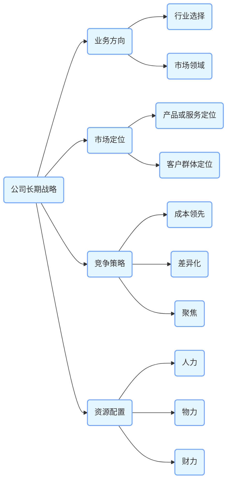

# 彼得林奇如何分析公司的长期战略

> 关键词：彼得林奇、公司长期战略、基本面分析、成长型公司、投资策略

> 摘要：彼得林奇作为投资界的传奇人物，其投资理念和分析公司长期战略的方法影响深远。本文旨在深入探讨彼得林奇分析公司长期战略的方法，从背景知识的介绍，到核心概念的阐述，再到具体的分析步骤和实际应用案例，为投资者和相关从业者提供全面而深入的理解。通过对彼得林奇方法的研究，能够帮助我们更好地评估公司的长期价值和发展潜力，从而做出更明智的投资决策。

## 1. 背景介绍 
### 1.1 目的和范围
本文的目的在于详细剖析彼得林奇分析公司长期战略的方法和思路。范围涵盖了彼得林奇在分析过程中所涉及的各个方面，包括公司基本面、行业趋势、竞争优势等。通过对这些内容的研究，我们可以系统地了解彼得林奇是如何评估一家公司的长期战略是否具有可持续性和竞争力，以及如何基于这些分析做出投资决策。

### 1.2 预期读者
本文预期读者包括对投资领域感兴趣的个人投资者、金融专业学生、投资机构从业者以及对公司战略分析有研究需求的企业管理人员等。无论您是初学者还是有一定经验的专业人士，都能从本文中获取有价值的信息和见解。

### 1.3 文档结构概述
本文首先介绍彼得林奇的背景以及相关的投资理念，为后续的分析奠定基础。接着阐述核心概念，包括公司长期战略的定义、分析的关键要素等，并通过示意图和流程图进行直观展示。然后详细讲解彼得林奇分析公司长期战略的核心算法原理和具体操作步骤，同时结合 Python 代码进行说明。之后介绍相关的数学模型和公式，并通过举例进行详细讲解。再通过项目实战，给出实际的代码案例和详细解释。随后探讨该方法的实际应用场景，推荐相关的工具和资源。最后总结未来发展趋势与挑战，提供常见问题解答和扩展阅读参考资料。

### 1.4 术语表
#### 1.4.1 核心术语定义
- **长期战略**：公司为实现长期目标而制定的一系列规划和决策，涉及公司的业务方向、市场定位、竞争策略等多个方面。
- **基本面分析**：通过对公司的财务状况、经营管理、行业环境等基本因素的分析，评估公司的内在价值和发展潜力。
- **成长型公司**：指那些具有较高的增长速度和发展潜力的公司，通常表现为销售收入、利润等指标的快速增长。
- **竞争优势**：公司在市场竞争中相对于竞争对手所具有的独特优势，如成本优势、技术优势、品牌优势等。

#### 1.4.2 相关概念解释
- **护城河理论**：由巴菲特提出，指公司拥有的一种可持续的竞争优势，就像城堡周围的护城河一样，能够保护公司免受竞争对手的攻击，确保公司长期稳定的发展。
- **PEG 指标**：市盈率相对盈利增长比率，是用公司的市盈率除以公司的盈利增长速度。该指标可以综合考虑公司的估值和盈利增长情况，用于评估公司的投资价值。

#### 1.4.3 缩略词列表
- **PE**：市盈率（Price Earnings Ratio），指股票价格除以每股收益的比率，用于衡量股票的估值水平。
- **EPS**：每股收益（Earnings Per Share），指公司净利润除以发行在外的普通股股数，反映了每股股票的盈利水平。

## 2. 核心概念与联系 

### 核心概念原理
彼得林奇分析公司长期战略主要基于基本面分析的理念。他认为，一家公司的长期价值取决于其基本面状况，包括财务状况、经营管理、行业地位等。通过对这些基本面因素的深入研究，可以了解公司的长期战略是否合理、可行，以及是否具有可持续性。

公司的长期战略通常包括以下几个关键要素：
- **业务方向**：公司选择进入的行业和市场领域，这决定了公司的发展空间和潜在机会。
- **市场定位**：公司在目标市场中的定位，包括产品或服务的定位、客户群体的定位等，这关系到公司能否满足市场需求并获得竞争优势。
- **竞争策略**：公司为了在市场竞争中取得优势而采取的策略，如成本领先、差异化、聚焦等。
- **资源配置**：公司如何分配资源，包括人力、物力、财力等，以支持长期战略的实施。

### 架构的文本示意图
```plaintext
公司长期战略
|-- 业务方向
|   |-- 行业选择
|   |-- 市场领域
|-- 市场定位
|   |-- 产品或服务定位
|   |-- 客户群体定位
|-- 竞争策略
|   |-- 成本领先
|   |-- 差异化
|   |-- 聚焦
|-- 资源配置
|   |-- 人力
|   |-- 物力
|   |-- 财力
```

### Mermaid 流程图


## 3. 核心算法原理 & 具体操作步骤 

### 核心算法原理
彼得林奇分析公司长期战略的核心算法原理可以概括为对公司基本面因素的综合评估。他通过收集和分析公司的财务报表、行业研究报告、管理层访谈等信息，对公司的业务方向、市场定位、竞争策略和资源配置等方面进行评估，从而判断公司的长期战略是否合理、可行。

具体来说，他会关注以下几个方面：
- **财务指标**：如市盈率、市净率、净利润增长率、ROE（净资产收益率）等，用于评估公司的估值水平和盈利能力。
- **行业趋势**：研究行业的发展趋势、市场规模、竞争格局等，判断公司所处行业的前景和潜力。
- **竞争优势**：分析公司的竞争优势，如品牌、技术、成本等，评估公司在市场竞争中的地位和可持续性。
- **管理层能力**：考察公司管理层的经验、决策能力、战略眼光等，判断管理层是否能够有效地执行公司的长期战略。

### 具体操作步骤
1. **收集信息**
    - 收集公司的财务报表，包括资产负债表、利润表、现金流量表等，了解公司的财务状况和经营成果。
    - 收集行业研究报告，了解行业的发展趋势、市场规模、竞争格局等信息。
    - 收集管理层访谈、新闻报道等资料，了解公司的战略规划、业务发展方向等信息。
2. **分析财务指标**
    - 计算公司的市盈率、市净率、净利润增长率、ROE 等财务指标，与同行业其他公司进行比较，评估公司的估值水平和盈利能力。
    - 分析公司的财务报表，关注公司的收入来源、成本结构、资产质量等方面，了解公司的经营状况和财务风险。
3. **研究行业趋势**
    - 分析行业的发展趋势，包括市场规模的增长趋势、技术创新的趋势、政策环境的变化等，判断公司所处行业的前景和潜力。
    - 研究行业的竞争格局，了解行业内主要竞争对手的情况，分析公司在行业中的地位和竞争优势。
4. **评估竞争优势**
    - 分析公司的竞争优势，如品牌、技术、成本等，判断公司在市场竞争中的地位和可持续性。
    - 研究公司的产品或服务，了解其独特性和竞争力，评估公司的市场定位是否准确。
5. **考察管理层能力**
    - 考察公司管理层的经验、决策能力、战略眼光等，判断管理层是否能够有效地执行公司的长期战略。
    - 关注管理层的激励机制和团队稳定性，了解管理层的积极性和团队的凝聚力。
6. **综合评估**
    - 根据以上分析结果，对公司的长期战略进行综合评估，判断公司的长期战略是否合理、可行。
    - 结合自己的投资目标和风险承受能力，决定是否投资该公司。

### Python 源代码实现
```python
import pandas as pd
import numpy as np

# 假设我们已经收集到了公司的财务数据和行业数据
# 财务数据示例
financial_data = {
    'year': [2018, 2019, 2020, 2021, 2022],
    'revenue': [100, 120, 150, 180, 200],
    'net_income': [10, 12, 15, 18, 20],
    'assets': [50, 60, 70, 80, 90],
    'equity': [30, 35, 40, 45, 50]
}

df_financial = pd.DataFrame(financial_data)

# 计算财务指标
df_financial['roe'] = df_financial['net_income'] / df_financial['equity']
df_financial['revenue_growth_rate'] = df_financial['revenue'].pct_change()
df_financial['net_income_growth_rate'] = df_financial['net_income'].pct_change()

# 行业数据示例
industry_data = {
    'year': [2018, 2019, 2020, 2021, 2022],
    'industry_revenue_growth_rate': [0.1, 0.12, 0.15, 0.18, 0.2]
}

df_industry = pd.DataFrame(industry_data)

# 合并数据
df = pd.merge(df_financial, df_industry, on='year')

# 评估公司在行业中的表现
df['relative_revenue_growth_rate'] = df['revenue_growth_rate'] - df['industry_revenue_growth_rate']

print(df)
```
这段代码首先创建了公司的财务数据和行业数据的 DataFrame，然后计算了一些关键的财务指标，如 ROE、收入增长率和净利润增长率。接着将公司数据和行业数据合并，计算了公司相对于行业的收入增长速度，从而可以评估公司在行业中的表现。

## 4. 数学模型和公式 & 详细讲解 & 举例说明 

### 财务指标公式
- **市盈率（PE）**：
$$PE = \frac{股价}{每股收益}$$
市盈率是衡量股票估值水平的常用指标。一般来说，市盈率越高，说明市场对公司的未来预期越高，但也可能意味着股票被高估。例如，某公司的股价为 50 元，每股收益为 5 元，则其市盈率为 $PE = \frac{50}{5} = 10$ 倍。

- **市净率（PB）**：
$$PB = \frac{股价}{每股净资产}$$
市净率反映了股票价格与每股净资产的关系。市净率较低的股票可能被低估，但也可能意味着公司存在一些问题。例如，某公司的股价为 20 元，每股净资产为 10 元，则其市净率为 $PB = \frac{20}{10} = 2$ 倍。

- **净资产收益率（ROE）**：
$$ROE = \frac{净利润}{净资产} \times 100\%$$
ROE 衡量了公司运用自有资本的效率。ROE 越高，说明公司的盈利能力越强。例如，某公司的净利润为 100 万元，净资产为 500 万元，则其 ROE 为 $ROE = \frac{100}{500} \times 100\% = 20\%$。

- **净利润增长率**：
$$净利润增长率 = \frac{本期净利润 - 上期净利润}{上期净利润} \times 100\%$$
净利润增长率反映了公司净利润的增长情况。例如，某公司上一年的净利润为 80 万元，今年的净利润为 100 万元，则其净利润增长率为 $净利润增长率 = \frac{100 - 80}{80} \times 100\% = 25\%$。

### 举例说明
假设我们要分析两家公司 A 和 B 的长期战略。以下是它们的财务数据：

| 公司 | 股价（元） | 每股收益（元） | 每股净资产（元） | 净利润（万元） | 净资产（万元） | 上一年净利润（万元） |
| ---- | ---- | ---- | ---- | ---- | ---- | ---- |
| A | 30 | 3 | 15 | 300 | 1500 | 250 |
| B | 40 | 4 | 20 | 400 | 2000 | 350 |

我们可以计算它们的财务指标：

- **公司 A**：
    - 市盈率：$PE_A = \frac{30}{3} = 10$ 倍
    - 市净率：$PB_A = \frac{30}{15} = 2$ 倍
    - 净资产收益率：$ROE_A = \frac{300}{1500} \times 100\% = 20\%$
    - 净利润增长率：$净利润增长率_A = \frac{300 - 250}{250} \times 100\% = 20\%$

- **公司 B**：
    - 市盈率：$PE_B = \frac{40}{4} = 10$ 倍
    - 市净率：$PB_B = \frac{40}{20} = 2$ 倍
    - 净资产收益率：$ROE_B = \frac{400}{2000} \times 100\% = 20\%$
    - 净利润增长率：$净利润增长率_B = \frac{400 - 350}{350} \times 100\% \approx 14.29\%$

从这些指标来看，两家公司的市盈率、市净率和 ROE 相同，但公司 A 的净利润增长率更高。这可能意味着公司 A 的发展速度更快，长期战略可能更具优势。当然，这只是一个简单的例子，实际分析中还需要考虑更多的因素。

## 5. 项目实战：代码实际案例和详细解释说明 

### 5.1  开发环境搭建
在进行项目实战之前，需要搭建相应的开发环境。以下是具体步骤：

1. **安装 Python**：可以从 Python 官方网站（https://www.python.org/downloads/）下载并安装最新版本的 Python。
2. **安装必要的库**：使用 pip 命令安装以下库：
    - `pandas`：用于数据处理和分析。
    - `numpy`：用于数值计算。
    - `matplotlib`：用于数据可视化。

```bash
pip install pandas numpy matplotlib
```

### 5.2  源代码详细实现和代码解读
以下是一个完整的项目实战代码示例，用于分析一家公司的长期战略：

```python
import pandas as pd
import numpy as np
import matplotlib.pyplot as plt

# 读取公司财务数据
financial_data = pd.read_csv('financial_data.csv')

# 计算财务指标
financial_data['roe'] = financial_data['net_income'] / financial_data['equity']
financial_data['revenue_growth_rate'] = financial_data['revenue'].pct_change()
financial_data['net_income_growth_rate'] = financial_data['net_income'].pct_change()

# 绘制收入和净利润增长趋势图
plt.figure(figsize=(10, 6))
plt.plot(financial_data['year'], financial_data['revenue_growth_rate'], label='Revenue Growth Rate')
plt.plot(financial_data['year'], financial_data['net_income_growth_rate'], label='Net Income Growth Rate')
plt.xlabel('Year')
plt.ylabel('Growth Rate')
plt.title('Revenue and Net Income Growth Trends')
plt.legend()
plt.grid(True)
plt.show()

# 计算平均 ROE
average_roe = financial_data['roe'].mean()
print(f'Average ROE: {average_roe * 100:.2f}%')

# 评估公司的增长情况
if financial_data['revenue_growth_rate'].iloc[-1] > 0 and financial_data['net_income_growth_rate'].iloc[-1] > 0:
    print('The company is experiencing growth.')
else:
    print('The company may be facing challenges.')
```

### 代码解读与分析
1. **数据读取**：使用 `pandas` 库的 `read_csv` 函数读取公司的财务数据，数据存储在 `financial_data.csv` 文件中。
2. **财务指标计算**：计算 ROE、收入增长率和净利润增长率等财务指标。
3. **数据可视化**：使用 `matplotlib` 库绘制收入和净利润的增长趋势图，直观地展示公司的发展情况。
4. **平均 ROE 计算**：计算公司的平均 ROE，用于评估公司的盈利能力。
5. **增长情况评估**：根据最新的收入增长率和净利润增长率判断公司是否处于增长状态。

## 6. 实际应用场景 
### 个人投资决策
个人投资者可以运用彼得林奇的方法分析公司的长期战略，从而做出更明智的投资决策。通过对公司基本面的深入研究，了解公司的长期发展潜力和竞争优势，选择具有投资价值的股票。例如，在选择成长型股票时，可以关注公司的业务方向是否符合行业发展趋势，市场定位是否准确，竞争策略是否有效等因素。

### 投资机构研究
投资机构可以将彼得林奇的方法作为研究公司的重要工具，为投资组合的构建和管理提供依据。投资分析师可以通过对大量公司的长期战略分析，筛选出具有潜力的投资标的，为机构投资者提供专业的投资建议。

### 企业战略评估
企业管理者可以借鉴彼得林奇的分析方法，对自身企业的长期战略进行评估和优化。通过分析公司的财务状况、市场地位、竞争优势等方面，发现企业存在的问题和潜在的机会，及时调整战略方向，提高企业的竞争力和可持续发展能力。

## 7. 工具和资源推荐
### 7.1 学习资源推荐
#### 7.1.1 书籍推荐
- 《彼得林奇的成功投资》：彼得林奇的经典著作，详细阐述了他的投资理念和方法，包括如何分析公司的长期战略。
- 《聪明的投资者》：本杰明·格雷厄姆的经典著作，是价值投资的奠基之作，对基本面分析有深入的讲解。
- 《财务报表分析与证券定价》：全面介绍了财务报表分析的方法和技巧，对于理解公司的财务状况和长期战略具有重要的参考价值。

#### 7.1.2 在线课程
- Coursera 上的“投资学原理”课程：由知名大学的教授授课，系统地介绍了投资学的基本原理和方法，包括公司分析和估值。
- 网易云课堂上的“财务报表分析实战”课程：通过实际案例讲解财务报表分析的方法和技巧，帮助学习者提高分析能力。

#### 7.1.3 技术博客和网站
- 雪球网：国内知名的投资社区，提供了丰富的公司研究报告和投资者的交流分享，对于学习公司分析和投资策略有很大的帮助。
- Seeking Alpha：国外知名的投资分析网站，汇聚了众多专业分析师的文章和观点，提供了全球范围内的公司分析和投资建议。

### 7.2 开发工具框架推荐
#### 7.2.1 IDE和编辑器
- PyCharm：一款专业的 Python 集成开发环境，具有强大的代码编辑、调试和分析功能，适合开发和调试 Python 代码。
- Jupyter Notebook：一个交互式的开发环境，支持多种编程语言，适合进行数据探索和分析。

#### 7.2.2 调试和性能分析工具
- pdb：Python 自带的调试器，可以帮助开发者定位代码中的问题。
- cProfile：Python 标准库中的性能分析工具，可以分析代码的执行时间和函数调用情况。

#### 7.2.3 相关框架和库
- pandas：用于数据处理和分析的 Python 库，提供了丰富的数据结构和数据操作方法。
- numpy：用于数值计算的 Python 库，提供了高效的数组操作和数学函数。
- matplotlib：用于数据可视化的 Python 库，支持多种图表类型的绘制。

### 7.3 相关论文著作推荐
#### 7.3.1 经典论文
- Eugene F. Fama 和 Kenneth R. French 的《Common Risk Factors in the Returns on Stocks and Bonds》：提出了著名的三因子模型，对于理解股票和债券的收益风险特征具有重要意义。
- Benjamin Graham 和 David Dodd 的《Security Analysis》：价值投资的经典论文，奠定了基本面分析的理论基础。

#### 7.3.2 最新研究成果
- 关注顶级金融学术期刊，如《Journal of Finance》、《Review of Financial Studies》等，了解最新的公司分析和投资策略研究成果。

#### 7.3.3 应用案例分析
- 一些知名投资机构的研究报告和案例分析，如巴菲特的伯克希尔·哈撒韦公司的年报，提供了实际的投资案例和分析思路。

## 8. 总结：未来发展趋势与挑战
### 未来发展趋势
- **数字化和智能化**：随着信息技术的不断发展，数字化和智能化将在公司长期战略分析中发挥越来越重要的作用。利用大数据、人工智能等技术，可以更快速、准确地收集和分析公司的相关信息，提高分析的效率和准确性。
- **跨学科融合**：公司长期战略分析将不再局限于财务和金融领域，而是与管理学、经济学、社会学等多个学科进行融合。通过综合运用不同学科的知识和方法，可以更全面地评估公司的长期战略。
- **可持续发展**：在全球关注可持续发展的背景下，公司的长期战略将越来越注重环境、社会和治理（ESG）因素。投资者和企业管理者将更加关注公司的社会责任和可持续发展能力，将 ESG 因素纳入长期战略分析的框架中。

### 挑战
- **信息过载**：随着信息的爆炸式增长，如何从海量的信息中筛选出有价值的信息，是分析公司长期战略面临的一大挑战。需要投资者和分析人员具备更强的信息处理能力和判断力。
- **不确定性增加**：全球经济、政治环境的不确定性增加，给公司的长期战略带来了更多的风险和挑战。如何准确预测和应对这些不确定性，是分析公司长期战略需要解决的重要问题。
- **数据质量和可靠性**：数据的质量和可靠性直接影响到分析结果的准确性。在收集和使用数据时，需要确保数据的来源可靠，避免数据误差和虚假信息的干扰。

## 9. 附录：常见问题与解答
### 问题 1：彼得林奇的方法适用于所有类型的公司吗？
答：彼得林奇的方法主要基于基本面分析，适用于大多数类型的公司。但对于一些新兴行业的公司，如科技初创企业，由于其财务数据可能不具有代表性，或者公司的发展模式较为独特，可能需要结合其他方法进行分析。

### 问题 2：如何判断公司的竞争优势是否可持续？
答：判断公司的竞争优势是否可持续需要综合考虑多个因素。可以从公司的品牌价值、技术创新能力、成本控制能力、客户忠诚度等方面进行分析。同时，还需要关注行业的发展趋势和竞争格局的变化，评估公司是否能够在未来的竞争中保持优势。

### 问题 3：在分析公司长期战略时，财务指标和非财务指标哪个更重要？
答：财务指标和非财务指标都很重要，它们相互补充，共同反映公司的长期战略和发展潜力。财务指标可以直观地反映公司的财务状况和经营成果，而非财务指标，如公司的创新能力、管理团队的素质、企业文化等，对于公司的长期发展也具有重要的影响。因此，在分析公司长期战略时，需要综合考虑财务指标和非财务指标。

## 10. 扩展阅读 & 参考资料
- 彼得林奇. 《彼得林奇的成功投资》. 机械工业出版社
- 本杰明·格雷厄姆. 《聪明的投资者》. 人民邮电出版社
- Stephen Penman. 《财务报表分析与证券定价》. 中国人民大学出版社
- 雪球网. https://xueqiu.com/
- Seeking Alpha. https://seekingalpha.com/
- 《Journal of Finance》. https://onlinelibrary.wiley.com/journal/15406261
- 《Review of Financial Studies》. https://academic.oup.com/rfs