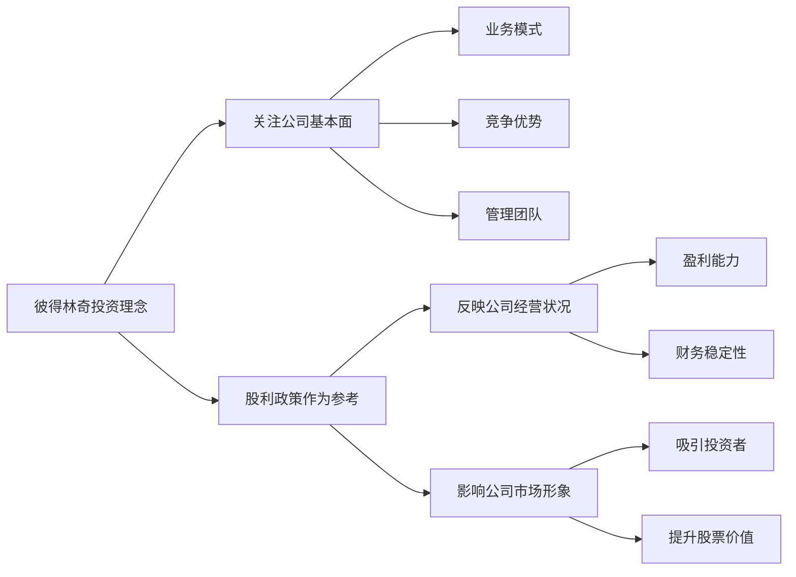

# 彼得林奇如何看待公司的股利政策

> 关键词：彼得林奇、股利政策、公司分析、投资策略、股息、盈利增长、股东回报

> 摘要：本文围绕彼得林奇对公司股利政策的看法展开探讨。彼得林奇作为投资界的传奇人物，其投资理念和方法备受关注。股利政策作为公司财务管理的重要部分，对股东回报、公司发展及投资者决策有着关键影响。通过深入分析彼得林奇对股利政策的观点，我们能更好地理解他的投资逻辑，为投资者在评估公司价值、制定投资策略时提供有价值的参考，助力投资者做出更明智的投资决策。

## 1. 背景介绍 
### 1.1 目的和范围
本文旨在全面剖析彼得林奇对于公司股利政策的看法。研究范围不仅涵盖彼得林奇在其著作、演讲及投资实践中对股利政策的直接论述，还包括基于他的整体投资理念对股利政策相关观点的深度挖掘。通过对这些内容的梳理和分析，揭示彼得林奇看待股利政策的独特视角以及其在投资决策中的应用，帮助投资者深入理解股利政策在公司投资价值评估中的重要性。

### 1.2 预期读者
本文预期读者主要包括对投资领域有浓厚兴趣的个人投资者，希望通过学习彼得林奇的投资智慧来提升自身投资能力和决策水平。同时，也适合金融专业的学生和研究人员，为他们在学习和研究公司财务、投资理论等方面提供实际案例和理论参考。此外，公司财务管理人员也可从彼得林奇对股利政策的看法中获取有益的启示，优化公司的股利决策。

### 1.3 文档结构概述
本文首先介绍彼得林奇的背景以及股利政策的基本概念，为后续的讨论奠定基础。接着详细阐述彼得林奇对股利政策的核心观点，包括股利政策与公司发展阶段、盈利增长、股东回报等方面的关系。然后通过具体的案例分析，展示彼得林奇如何在实际投资中运用这些观点进行公司评估和投资决策。之后探讨股利政策在不同市场环境下的变化以及彼得林奇的应对策略。最后总结彼得林奇对股利政策看法的启示，并对未来公司股利政策的发展趋势进行展望。

### 1.4 术语表
#### 1.4.1 核心术语定义
- **股利政策**：公司关于是否发放股利、发放多少股利以及何时发放股利等方面的方针和策略，是公司财务管理的重要内容之一。
- **股息**：股票的利息，是指股份公司从提取了公积金、公益金的税后利润中按照股息率派发给股东的收益。
- **股东回报**：公司给予股东的投资收益，包括股息收入和股票价格上涨带来的资本利得。
- **盈利增长**：公司在一定时期内净利润的增加幅度，反映了公司的经营业绩和发展潜力。

#### 1.4.2 相关概念解释
- **剩余股利政策**：公司在有良好的投资机会时，根据目标资本结构，测算出投资所需的权益资本额，先从盈余中留用，然后将剩余的盈余作为股利来分配。
- **固定股利支付率政策**：公司确定一个固定的股利支付率，长期按此比率支付股利给股东。
- **稳定增长股利政策**：公司将每年派发的股利额固定在某一特定水平上，然后在一段时间内不论公司的盈利情况和财务状况如何，派发的股利额均保持不变。

#### 1.4.3 缩略词列表
- **EPS**：Earnings Per Share，每股收益，是指税后利润与股本总数的比率。
- **P/E**：Price-to-Earnings Ratio，市盈率，是指股票价格除以每股收益的比率。

## 2. 核心概念与联系 

### 2.1 彼得林奇的投资理念概述
彼得林奇是一位极具传奇色彩的投资大师，他的投资理念强调通过深入研究公司基本面来寻找具有投资价值的股票。他认为投资者应该关注公司的业务模式、竞争优势、管理团队等因素，而不是仅仅依赖于宏观经济预测和市场趋势分析。彼得林奇主张投资者要具备独立思考的能力，不盲目跟风，通过实地调研和对公司财务报表的分析来挖掘潜在的投资机会。

### 2.2 股利政策的基本概念
股利政策是公司管理层在权衡公司发展需求和股东利益后制定的关于股利分配的策略。股利政策的核心问题包括是否分配股利、分配多少股利以及以何种方式分配股利（如现金股利、股票股利等）。不同的股利政策对公司的财务状况、股东权益和市场形象都会产生不同的影响。

### 2.3 彼得林奇眼中股利政策与公司价值的联系
在彼得林奇看来，股利政策是反映公司经营状况和发展前景的重要指标之一。一个合理的股利政策可以向市场传递公司稳定经营、盈利能力强的信号，从而提升公司的市场形象和股票价值。例如，一家能够持续稳定地支付较高股息的公司，通常被认为具有较强的盈利能力和财务稳定性，更容易受到投资者的青睐。相反，如果一家公司长期不支付股利或者股利政策频繁变动，可能会让投资者对公司的经营状况产生怀疑，从而影响公司的股价。

### 2.4 文本示意图
```plaintext
彼得林奇投资理念
|
|-- 关注公司基本面
|   |-- 业务模式
|   |-- 竞争优势
|   |-- 管理团队
|
|-- 股利政策作为参考
|   |-- 反映公司经营状况
|   |   |-- 盈利能力
|   |   |-- 财务稳定性
|   |-- 影响公司市场形象
|   |   |-- 吸引投资者
|   |   |-- 提升股票价值
```

### 2.5 Mermaid 流程图


## 3. 核心算法原理 & 具体操作步骤 

### 3.1 彼得林奇评估股利政策的基本思路
彼得林奇在评估公司的股利政策时，并不是简单地看股息率的高低，而是综合考虑公司的盈利增长、财务状况、发展阶段等因素。他认为，一个健康的公司应该在满足自身发展需求的前提下，合理地分配利润给股东。具体来说，他会关注以下几个方面：
- **盈利增长与股利分配的平衡**：公司的盈利增长是支撑股利分配的基础。如果公司的盈利增长强劲，那么即使股利支付率较低，股东也可能通过股票价格的上涨获得较高的回报。相反，如果公司的盈利增长乏力，却仍然维持较高的股利支付率，可能会影响公司的未来发展。
- **财务状况的稳定性**：公司的财务状况是决定股利政策的重要因素之一。彼得林奇会关注公司的资产负债表、现金流等指标，确保公司有足够的资金来支付股利，并且不会因为股利分配而影响公司的正常运营和投资计划。
- **公司发展阶段**：不同发展阶段的公司，其股利政策也会有所不同。例如，处于成长阶段的公司通常会将大部分利润用于再投资，以支持公司的快速发展，因此股利支付率较低；而处于成熟阶段的公司，由于业务已经相对稳定，可能会选择较高的股利支付率来回报股东。

### 3.2 具体操作步骤及 Python 代码示例
以下是一个简单的 Python 代码示例，用于模拟彼得林奇评估公司股利政策的过程。假设我们有一个包含公司财务数据的数据集，包括每股收益（EPS）、股息、净利润增长率等指标。

```python
import pandas as pd

# 定义一个函数来评估公司的股利政策
def evaluate_dividend_policy(data):
    # 计算股息支付率
    data['dividend_payout_ratio'] = data['dividend'] / data['eps']
    
    # 评估盈利增长与股利分配的平衡
    growth_threshold = 0.1  # 假设净利润增长率的阈值为 10%
    payout_threshold = 0.5  # 假设股息支付率的阈值为 50%
    data['growth_and_payout_balance'] = (data['net_income_growth_rate'] > growth_threshold) & (data['dividend_payout_ratio'] < payout_threshold)
    
    # 评估财务状况的稳定性
    debt_to_equity_threshold = 0.5  # 假设资产负债率的阈值为 50%
    data['financial_stability'] = data['debt_to_equity_ratio'] < debt_to_equity_threshold
    
    # 综合评估
    data['dividend_policy_score'] = data['growth_and_payout_balance'] + data['financial_stability']
    
    return data

# 示例数据
data = {
    'company_name': ['Company A', 'Company B', 'Company C'],
    'eps': [2.0, 1.5, 3.0],
    'dividend': [0.5, 0.8, 1.2],
    'net_income_growth_rate': [0.15, 0.05, 0.2],
    'debt_to_equity_ratio': [0.3, 0.6, 0.4]
}

df = pd.DataFrame(data)

# 调用评估函数
result = evaluate_dividend_policy(df)

print(result)
```

### 3.3 代码解读
- **股息支付率的计算**：通过将股息除以每股收益，计算出公司的股息支付率。股息支付率反映了公司将多少利润用于分配给股东。
- **盈利增长与股利分配的平衡评估**：设定净利润增长率和股息支付率的阈值，判断公司是否在盈利增长和股利分配之间取得了平衡。如果净利润增长率高于阈值且股息支付率低于阈值，则认为公司在这方面表现良好。
- **财务状况的稳定性评估**：通过比较资产负债率与阈值，判断公司的财务状况是否稳定。如果资产负债率低于阈值，则认为公司的财务状况较为稳定。
- **综合评估**：将盈利增长与股利分配的平衡评估结果和财务状况的稳定性评估结果相加，得到一个综合的股利政策得分。得分越高，说明公司的股利政策越合理。

## 4. 数学模型和公式 & 详细讲解 & 举例说明 

### 4.1 股息支付率公式
股息支付率（$DPR$）是衡量公司股利政策的重要指标之一，其计算公式为：
$$DPR = \frac{D}{EPS}$$
其中，$D$ 表示每股股息，$EPS$ 表示每股收益。

### 4.2 股息支付率的意义及应用
股息支付率反映了公司将多少净利润用于分配给股东。较高的股息支付率意味着公司将大部分利润分配给了股东，这可能表明公司的业务已经相对成熟，没有太多的再投资机会；较低的股息支付率则可能意味着公司将更多的利润用于再投资，以支持公司的未来发展。

例如，假设公司 A 的每股收益为 $2$ 元，每股股息为 $0.5$ 元，则其股息支付率为：
$$DPR_A = \frac{0.5}{2} = 0.25 = 25\%$$
这表明公司 A 将 $25\%$ 的净利润用于分配给股东，其余 $75\%$ 的净利润可能用于再投资或留存。

### 4.3 股利增长率模型
股利增长率模型是一种用于评估股票价值的模型，其基本公式为：
$$V = \frac{D_1}{r - g}$$
其中，$V$ 表示股票的内在价值，$D_1$ 表示下一期的每股股息，$r$ 表示投资者要求的必要收益率，$g$ 表示股利增长率。

### 4.4 股利增长率模型的应用及局限性
该模型假设股利以固定的增长率 $g$ 增长，适用于那些股利稳定增长的公司。通过该模型，投资者可以估算出股票的内在价值，并与当前的市场价格进行比较，从而判断股票是否被低估或高估。

例如，假设公司 B 的下一期每股股息为 $1$ 元，投资者要求的必要收益率为 $10\%$，股利增长率为 $5\%$，则该公司股票的内在价值为：
$$V_B = \frac{1}{0.1 - 0.05} = \frac{1}{0.05} = 20$$（元）
如果当前该公司股票的市场价格为 $18$ 元，则说明股票被低估，具有投资价值。

然而，股利增长率模型也存在一定的局限性。该模型假设股利增长率是固定的，而在实际中，公司的股利增长率可能会受到多种因素的影响，如市场竞争、经济环境、公司战略等，因此可能会导致估值结果与实际情况存在偏差。

## 5. 项目实战：代码实际案例和详细解释说明 

### 5.1  开发环境搭建
- **Python 安装**：确保你的系统中已经安装了 Python 3.x 版本。你可以从 Python 官方网站（https://www.python.org/downloads/） 下载并安装适合你操作系统的 Python 版本。
- **必要库的安装**：本项目需要使用 `pandas` 库来处理数据。你可以使用以下命令来安装 `pandas` 库：
```sh
pip install pandas
```

### 5.2  源代码详细实现和代码解读
以下是一个更完整的 Python 代码示例，用于对多个公司的股利政策进行评估，并根据评估结果进行排序。

```python
import pandas as pd

# 定义一个函数来评估公司的股利政策
def evaluate_dividend_policy(data):
    # 计算股息支付率
    data['dividend_payout_ratio'] = data['dividend'] / data['eps']
    
    # 评估盈利增长与股利分配的平衡
    growth_threshold = 0.1  # 假设净利润增长率的阈值为 10%
    payout_threshold = 0.5  # 假设股息支付率的阈值为 50%
    data['growth_and_payout_balance'] = (data['net_income_growth_rate'] > growth_threshold) & (data['dividend_payout_ratio'] < payout_threshold)
    
    # 评估财务状况的稳定性
    debt_to_equity_threshold = 0.5  # 假设资产负债率的阈值为 50%
    data['financial_stability'] = data['debt_to_equity_ratio'] < debt_to_equity_threshold
    
    # 综合评估
    data['dividend_policy_score'] = data['growth_and_payout_balance'].astype(int) + data['financial_stability'].astype(int)
    
    # 根据综合得分进行排序
    data = data.sort_values(by='dividend_policy_score', ascending=False)
    
    return data

# 示例数据
data = {
    'company_name': ['Company A', 'Company B', 'Company C', 'Company D', 'Company E'],
    'eps': [2.0, 1.5, 3.0, 1.2, 2.5],
    'dividend': [0.5, 0.8, 1.2, 0.3, 0.6],
    'net_income_growth_rate': [0.15, 0.05, 0.2, 0.08, 0.12],
    'debt_to_equity_ratio': [0.3, 0.6, 0.4, 0.55, 0.35]
}

df = pd.DataFrame(data)

# 调用评估函数
result = evaluate_dividend_policy(df)

print(result)
```

### 5.3  代码解读与分析
- **数据准备**：定义了一个包含多个公司财务数据的字典 `data`，并使用 `pandas` 的 `DataFrame` 函数将其转换为数据框 `df`。
- **股息支付率计算**：通过将股息除以每股收益，计算出每个公司的股息支付率，并将结果存储在新的列 `dividend_payout_ratio` 中。
- **盈利增长与股利分配的平衡评估**：设定净利润增长率和股息支付率的阈值，判断每个公司是否在盈利增长和股利分配之间取得了平衡，并将结果存储在新的列 `growth_and_payout_balance` 中。
- **财务状况的稳定性评估**：通过比较资产负债率与阈值，判断每个公司的财务状况是否稳定，并将结果存储在新的列 `financial_stability` 中。
- **综合评估**：将 `growth_and_payout_balance` 和 `financial_stability` 列的值转换为整数后相加，得到每个公司的综合股利政策得分，并将结果存储在新的列 `dividend_policy_score` 中。
- **排序**：根据综合得分对数据框进行降序排序，使得得分较高的公司排在前面。

通过这个代码示例，我们可以对多个公司的股利政策进行量化评估，并根据评估结果进行比较和排序，从而帮助投资者筛选出具有较好股利政策的公司。

## 6. 实际应用场景 

### 6.1 个人投资者的决策参考
对于个人投资者来说，了解彼得林奇对股利政策的看法可以帮助他们在选择股票时做出更明智的决策。例如，当投资者面对多个投资标的时，可以通过分析公司的股利政策，结合公司的盈利增长、财务状况等因素，评估公司的投资价值。如果一个公司具有稳定的盈利增长、良好的财务状况，并且能够合理地分配利润给股东，那么该公司可能是一个值得投资的对象。

### 6.2 机构投资者的资产配置
机构投资者在进行资产配置时，也会考虑公司的股利政策。例如，一些追求稳定收益的机构投资者，如养老基金、保险公司等，可能会更倾向于投资那些能够持续稳定地支付较高股息的公司。而对于一些成长型的机构投资者来说，他们可能会更关注公司的盈利增长潜力，对于股利政策的要求相对较低。

### 6.3 公司管理层的决策依据
公司管理层在制定股利政策时，可以借鉴彼得林奇的观点，综合考虑公司的发展阶段、盈利增长、财务状况等因素，制定出合理的股利政策。例如，对于处于成长阶段的公司，管理层可以适当降低股利支付率，将更多的利润用于再投资，以支持公司的快速发展；而对于处于成熟阶段的公司，管理层可以适当提高股利支付率，以回报股东，提升公司的市场形象。

### 6.4 市场监管的参考
市场监管部门在对上市公司进行监管时，也可以关注公司的股利政策。合理的股利政策可以促进公司的健康发展，保护股东的利益。如果发现上市公司存在不合理的股利政策，如长期不分配股利、过度分配股利等情况，监管部门可以采取相应的措施，引导公司制定合理的股利政策。

## 7. 工具和资源推荐
### 7.1 学习资源推荐
#### 7.1.1 书籍推荐
- 《彼得林奇的成功投资》：彼得林奇的经典著作，详细阐述了他的投资理念和方法，包括如何分析公司基本面、如何选择股票等内容，对于理解他对股利政策的看法具有重要的参考价值。
- 《聪明的投资者》：本杰明·格雷厄姆的经典著作，被誉为投资界的圣经。书中介绍了价值投资的基本原理和方法，对于投资者理解公司的价值评估和股利政策具有重要的指导意义。
- 《财务报表分析与证券定价》：该书系统地介绍了财务报表分析的方法和技巧，以及如何通过财务报表分析来评估公司的价值和投资风险，对于深入理解公司的股利政策与财务状况的关系具有重要的帮助。

#### 7.1.2 在线课程
- Coursera 上的“投资学原理”课程：该课程由知名大学的教授授课，全面介绍了投资学的基本原理和方法，包括股票投资、债券投资、资产配置等内容，对于初学者来说是一个很好的学习资源。
- edX 上的“公司财务”课程：该课程深入讲解了公司财务的基本概念和方法，包括资本预算、股利政策、资本结构等内容，对于想要深入了解公司股利政策的投资者和财务管理人员来说是一个不错的选择。

#### 7.1.3 技术博客和网站
- Seeking Alpha：一个知名的投资研究网站，提供了大量的股票分析报告和投资观点，包括对公司股利政策的分析和讨论。
- Motley Fool：该网站提供了丰富的投资资讯和分析工具，对于投资者了解公司的基本面和股利政策具有一定的帮助。

### 7.2 开发工具框架推荐
#### 7.2.1 IDE和编辑器
- PyCharm：一款专业的 Python 集成开发环境，提供了丰富的代码编辑、调试、版本控制等功能，适合用于开发和调试与股利政策分析相关的 Python 代码。
- Jupyter Notebook：一个交互式的开发环境，支持 Python、R 等多种编程语言，适合用于数据探索、分析和可视化，对于进行股利政策数据的分析和展示非常方便。

#### 7.2.2 调试和性能分析工具
- pdb：Python 自带的调试器，可以帮助开发者在代码运行过程中进行调试，查找和解决代码中的问题。
- cProfile：Python 自带的性能分析工具，可以帮助开发者分析代码的性能瓶颈，优化代码的执行效率。

#### 7.2.3 相关框架和库
- pandas：一个强大的数据处理和分析库，提供了丰富的数据结构和数据处理方法，适合用于处理和分析公司的财务数据。
- numpy：一个用于科学计算的 Python 库，提供了高效的数组操作和数学函数，对于进行财务数据的计算和分析非常有用。

### 7.3 相关论文著作推荐
#### 7.3.1 经典论文
- Miller, M. H., & Modigliani, F. (1961). Dividend policy, growth, and the valuation of shares. The Journal of Business, 34(4), 411-433. 该论文提出了著名的 MM 股利无关理论，对股利政策的研究产生了深远的影响。
- Lintner, J. (1956). Distribution of incomes of corporations among dividends, retained earnings, and taxes. The American Economic Review, 46(2), 97-113. 该论文是股利政策研究领域的经典文献之一，提出了股利政策的“部分调整模型”。

#### 7.3.2 最新研究成果
- Baker, H. K., & Wurgler, J. (2012). A catering theory of dividends. The Journal of Finance, 67(3), 1125-1165. 该论文提出了股利政策的“迎合理论”，为股利政策的研究提供了新的视角。
- DeAngelo, H., DeAngelo, L., & Skinner, D. J. (2004). Are dividends disappearing? Dividend concentration and the consolidation of earnings. The Journal of Financial Economics, 72(3), 425-456. 该论文对美国上市公司股利政策的变化趋势进行了研究，分析了股利集中化和盈利集中化的现象。

#### 7.3.3 应用案例分析
- 案例研究：苹果公司的股利政策。通过对苹果公司股利政策的分析，探讨了公司在不同发展阶段如何制定合理的股利政策，以及股利政策对公司市场价值的影响。
- 案例研究：可口可乐公司的股利政策。分析了可口可乐公司长期稳定的股利政策，以及该政策对公司股东回报和市场形象的积极影响。

## 8. 总结：未来发展趋势与挑战
### 8.1 未来公司股利政策的发展趋势
- **更加注重股东回报**：随着投资者对股东回报的关注度不断提高，未来公司可能会更加注重股利分配，提高股息支付率，以吸引投资者。
- **与公司战略的结合更加紧密**：公司的股利政策将更加紧密地与公司的战略目标相结合，根据公司的发展阶段和业务需求，灵活调整股利政策。例如，对于处于创新驱动发展阶段的公司，可能会减少股利分配，将更多的资金用于研发和创新；而对于处于成熟阶段的公司，可能会增加股利分配，以回报股东。
- **多元化的股利分配方式**：除了传统的现金股利和股票股利外，未来公司可能会采用更多元化的股利分配方式，如实物股利、债权股利等，以满足不同投资者的需求。

### 8.2 面临的挑战
- **市场不确定性**：宏观经济环境的不确定性、行业竞争的加剧等因素，可能会影响公司的盈利水平和财务状况，从而给公司制定合理的股利政策带来挑战。
- **投资者需求的多样化**：不同投资者对股利政策的需求存在差异，如何在满足大多数投资者需求的同时，兼顾公司的发展战略，是公司管理层面临的一个难题。
- **监管政策的变化**：监管政策的变化可能会对公司的股利政策产生影响，公司需要及时了解和适应监管政策的变化，确保股利政策的合规性。

### 8.3 对投资者的启示
投资者在面对未来公司股利政策的变化和挑战时，需要不断学习和更新自己的投资知识，提高自己的投资分析能力。在选择投资标的时，要综合考虑公司的股利政策、盈利增长、财务状况等因素，而不是仅仅关注股息率的高低。同时，投资者要保持理性和冷静，避免盲目跟风，根据自己的投资目标和风险承受能力，制定合理的投资策略。

## 9. 附录：常见问题与解答
### 9.1 股利政策是否是衡量公司投资价值的唯一标准？
不是。股利政策只是衡量公司投资价值的一个方面，投资者还需要综合考虑公司的盈利增长、财务状况、行业前景、管理团队等因素。一个公司即使股利政策较好，但如果盈利增长乏力、财务状况不佳，也可能不是一个好的投资标的。

### 9.2 高股息率的公司一定是好的投资对象吗？
不一定。高股息率可能是由于公司的盈利增长放缓，将大部分利润用于分配给股东；也可能是公司的股价下跌导致股息率被动上升。投资者需要深入分析公司的基本面，了解高股息率背后的原因，才能判断该公司是否具有投资价值。

### 9.3 公司不分配股利是否意味着公司没有投资价值？
不是。一些处于成长阶段的公司，为了支持公司的快速发展，可能会将大部分利润用于再投资，而不分配股利。这些公司虽然暂时不分配股利，但如果具有良好的盈利增长潜力，未来可能会给投资者带来更高的回报。因此，投资者需要根据公司的发展阶段和业务模式，综合判断公司的投资价值。

### 9.4 如何判断公司的股利政策是否合理？
判断公司的股利政策是否合理需要综合考虑多个因素，如公司的盈利增长、财务状况、发展阶段等。一般来说，一个合理的股利政策应该在满足公司发展需求的前提下，合理地分配利润给股东。投资者可以通过分析公司的财务报表、了解公司的战略规划等方式，来评估公司的股利政策是否合理。

## 10. 扩展阅读 & 参考资料
- 彼得林奇. 《彼得林奇的成功投资》. 机械工业出版社.
- 本杰明·格雷厄姆. 《聪明的投资者》. 人民邮电出版社.
- 斯蒂芬·佩因曼. 《财务报表分析与证券定价》. 中国财政经济出版社.
- Miller, M. H., & Modigliani, F. (1961). Dividend policy, growth, and the valuation of shares. The Journal of Business, 34(4), 411-433.
- Lintner, J. (1956). Distribution of incomes of corporations among dividends, retained earnings, and taxes. The American Economic Review, 46(2), 97-113.
- Baker, H. K., & Wurgler, J. (2012). A catering theory of dividends. The Journal of Finance, 67(3), 1125-1165.
- DeAngelo, H., DeAngelo, L., & Skinner, D. J. (2004). Are dividends disappearing? Dividend concentration and the consolidation of earnings. The Journal of Financial Economics, 72(3), 425-456.
- Seeking Alpha 网站：https://seekingalpha.com/
- Motley Fool 网站：https://www.fool.com/ 