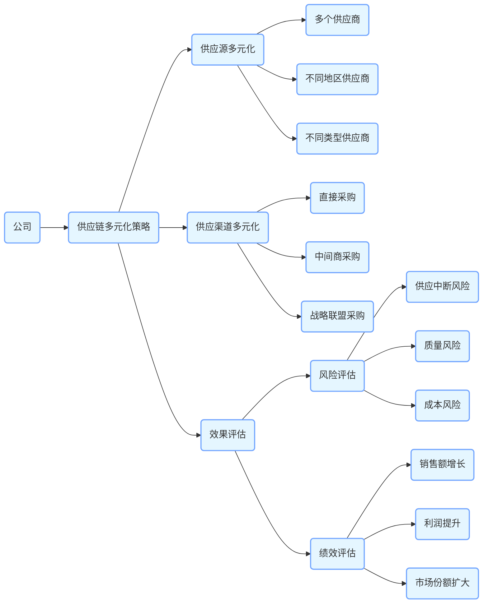

# 彼得林奇对公司供应链多元化策略的效果评估

> 关键词：彼得林奇、供应链多元化策略、效果评估、公司绩效、风险分散

> 摘要：本文深入探讨彼得林奇对公司供应链多元化策略的效果评估。首先介绍相关背景，包括目的、预期读者等内容。接着阐述核心概念及联系，分析供应链多元化策略的原理与架构。详细讲解核心算法原理和具体操作步骤，通过数学模型和公式进行深入剖析并举例说明。结合项目实战，展示代码实际案例并详细解释。探讨实际应用场景，推荐相关工具和资源。最后总结未来发展趋势与挑战，解答常见问题并提供扩展阅读与参考资料，旨在全面呈现彼得林奇评估方法的要点与价值，为企业决策和学术研究提供参考。

## 1. 背景介绍 
### 1.1 目的和范围
本研究的目的在于深入分析彼得林奇对公司供应链多元化策略的效果评估方法及其实际应用价值。彼得林奇作为投资领域的传奇人物，其投资理念和分析方法对众多投资者和企业管理者具有重要的借鉴意义。通过研究他对供应链多元化策略的评估，我们可以更好地理解这一策略对公司绩效和风险的影响，为企业制定合理的供应链策略提供参考。

本研究的范围涵盖了彼得林奇相关的投资理论和实践，以及公司供应链多元化策略的各个方面。包括对供应链多元化的定义、实施方式、效果评估指标等内容的探讨，同时结合实际案例进行分析，以验证评估方法的有效性。

### 1.2 预期读者
本文的预期读者包括企业管理者、投资者、供应链管理专业人士以及对投资和供应链管理感兴趣的学者和研究人员。企业管理者可以从本文中获取关于供应链多元化策略的决策依据，投资者可以了解如何通过评估供应链多元化策略来选择具有投资价值的公司，供应链管理专业人士可以借鉴相关的评估方法和实践经验，学者和研究人员可以在本文的基础上开展进一步的研究。

### 1.3 文档结构概述
本文共分为十个部分。第一部分为背景介绍，阐述研究的目的、范围、预期读者和文档结构概述，并给出术语表。第二部分介绍核心概念与联系，包括供应链多元化策略的原理和架构，并通过文本示意图和 Mermaid 流程图进行展示。第三部分讲解核心算法原理和具体操作步骤，使用 Python 源代码详细阐述。第四部分介绍数学模型和公式，进行详细讲解并举例说明。第五部分通过项目实战，展示代码实际案例并进行详细解释。第六部分探讨实际应用场景。第七部分推荐相关的工具和资源，包括学习资源、开发工具框架和相关论文著作。第八部分总结未来发展趋势与挑战。第九部分为附录，解答常见问题。第十部分提供扩展阅读与参考资料。

### 1.4 术语表
#### 1.4.1 核心术语定义
- **彼得林奇**：美国著名的投资家，曾任富达公司麦哲伦基金的基金经理，以其卓越的投资业绩和独特的投资理念而闻名。
- **供应链多元化策略**：指公司通过与多个供应商建立合作关系，或拓展不同的供应渠道，以降低对单一供应商或供应渠道的依赖，提高供应链的稳定性和灵活性。
- **效果评估**：对供应链多元化策略实施后所产生的效果进行评价和分析，包括对公司绩效、风险等方面的影响。

#### 1.4.2 相关概念解释
- **供应链风险**：指由于供应链中的各种不确定性因素导致的公司运营中断、成本增加、质量下降等风险。
- **公司绩效**：反映公司在一定时期内的经营成果和财务状况，通常通过销售额、利润、市场份额等指标来衡量。

#### 1.4.3 缩略词列表
- **SWOT**：Strengths（优势）、Weaknesses（劣势）、Opportunities（机会）、Threats（威胁）的缩写，是一种常用的战略分析工具。
- **ROI**：Return on Investment（投资回报率）的缩写，用于衡量投资的收益水平。

## 2. 核心概念与联系 
### 2.1 供应链多元化策略的原理
供应链多元化策略的核心原理在于通过分散供应源，降低公司对单一供应商或供应渠道的依赖，从而减少供应链风险。当某个供应商出现问题时，公司可以从其他供应商处获取所需的物资或服务，保证生产和运营的连续性。同时，多元化的供应链还可以促进供应商之间的竞争，提高产品质量和降低采购成本。

### 2.2 彼得林奇对供应链多元化策略的评估理念
彼得林奇认为，供应链多元化策略对公司的长期发展具有重要影响。他关注公司的供应链管理是否能够有效降低风险、提高效率，并将其作为评估公司投资价值的重要因素之一。他强调，一个具有良好供应链多元化策略的公司，通常具有更强的抗风险能力和市场竞争力。

### 2.3 核心概念架构的文本示意图
```plaintext
供应链多元化策略
├── 供应源多元化
│   ├── 多个供应商
│   ├── 不同地区供应商
│   └── 不同类型供应商
├── 供应渠道多元化
│   ├── 直接采购
│   ├── 中间商采购
│   └── 战略联盟采购
└── 效果评估
    ├── 风险评估
    │   ├── 供应中断风险
    │   ├── 质量风险
    │   └── 成本风险
    └── 绩效评估
        ├── 销售额增长
        ├── 利润提升
        └── 市场份额扩大
```

### 2.4 Mermaid 流程图


## 3. 核心算法原理 & 具体操作步骤 
### 3.1 核心算法原理
在评估供应链多元化策略的效果时，我们可以采用多指标综合评估的方法。首先，确定评估指标体系，包括风险指标和绩效指标。然后，为每个指标赋予相应的权重，通过加权平均的方法计算综合得分。

### 3.2 Python 源代码实现
```python
# 定义评估指标和权重
risk_metrics = {
    "供应中断风险": 0.3,
    "质量风险": 0.3,
    "成本风险": 0.4
}

performance_metrics = {
    "销售额增长": 0.4,
    "利润提升": 0.3,
    "市场份额扩大": 0.3
}

# 定义评估函数
def evaluate_supply_chain_diversification(risk_scores, performance_scores):
    # 计算风险得分
    risk_score = 0
    for metric, weight in risk_metrics.items():
        risk_score += risk_scores[metric] * weight
    
    # 计算绩效得分
    performance_score = 0
    for metric, weight in performance_metrics.items():
        performance_score += performance_scores[metric] * weight
    
    # 计算综合得分
    total_score = risk_score * 0.4 + performance_score * 0.6
    
    return total_score

# 示例数据
risk_scores = {
    "供应中断风险": 0.2,
    "质量风险": 0.3,
    "成本风险": 0.1
}

performance_scores = {
    "销售额增长": 0.8,
    "利润提升": 0.7,
    "市场份额扩大": 0.6
}

# 进行评估
result = evaluate_supply_chain_diversification(risk_scores, performance_scores)
print(f"供应链多元化策略的综合评估得分: {result}")
```

### 3.3 具体操作步骤
1. **确定评估指标体系**：根据公司的实际情况和战略目标，确定风险指标和绩效指标。风险指标可以包括供应中断风险、质量风险、成本风险等；绩效指标可以包括销售额增长、利润提升、市场份额扩大等。
2. **确定指标权重**：根据各指标的重要程度，为每个指标赋予相应的权重。权重的确定可以采用专家打分法、层次分析法等方法。
3. **收集数据**：收集与评估指标相关的数据，如供应商的历史数据、公司的财务报表等。
4. **计算指标得分**：根据收集到的数据，计算每个指标的得分。得分可以采用定量或定性的方法进行评估。
5. **计算综合得分**：根据指标权重和指标得分，通过加权平均的方法计算综合得分。
6. **分析评估结果**：根据综合得分，分析供应链多元化策略的效果。得分越高，说明策略的效果越好。

## 4. 数学模型和公式 & 详细讲解 & 举例说明 
### 4.1 数学模型
设风险指标集合为 $R = \{r_1, r_2, \cdots, r_m\}$，对应的权重集合为 $W_R = \{w_{r1}, w_{r2}, \cdots, w_{rm}\}$，其中 $\sum_{i=1}^{m} w_{ri} = 1$；绩效指标集合为 $P = \{p_1, p_2, \cdots, p_n\}$，对应的权重集合为 $W_P = \{w_{p1}, w_{p2}, \cdots, w_{pn}\}$，其中 $\sum_{j=1}^{n} w_{pj} = 1$。

风险得分 $S_R$ 的计算公式为：
$$S_R = \sum_{i=1}^{m} w_{ri} \times s_{ri}$$
其中 $s_{ri}$ 为第 $i$ 个风险指标的得分。

绩效得分 $S_P$ 的计算公式为：
$$S_P = \sum_{j=1}^{n} w_{pj} \times s_{pj}$$
其中 $s_{pj}$ 为第 $j$ 个绩效指标的得分。

综合得分 $S$ 的计算公式为：
$$S = \alpha \times S_R + (1 - \alpha) \times S_P$$
其中 $\alpha$ 为风险得分的权重，$0 \leq \alpha \leq 1$。

### 4.2 详细讲解
- **风险得分计算**：风险得分是通过对各个风险指标的得分进行加权平均得到的。权重反映了每个风险指标的重要程度，得分越高说明该风险指标的风险越大。
- **绩效得分计算**：绩效得分是通过对各个绩效指标的得分进行加权平均得到的。权重反映了每个绩效指标的重要程度，得分越高说明该绩效指标的表现越好。
- **综合得分计算**：综合得分是风险得分和绩效得分的加权和，权重 $\alpha$ 表示风险得分在综合得分中的占比。通过调整 $\alpha$ 的值，可以根据公司的风险偏好来平衡风险和绩效。

### 4.3 举例说明
假设某公司的风险指标和权重如下：
| 风险指标 | 权重 | 得分 |
| --- | --- | --- |
| 供应中断风险 | 0.3 | 0.2 |
| 质量风险 | 0.3 | 0.3 |
| 成本风险 | 0.4 | 0.1 |

绩效指标和权重如下：
| 绩效指标 | 权重 | 得分 |
| --- | --- | --- |
| 销售额增长 | 0.4 | 0.8 |
| 利润提升 | 0.3 | 0.7 |
| 市场份额扩大 | 0.3 | 0.6 |

风险得分 $S_R$ 为：
$$S_R = 0.3 \times 0.2 + 0.3 \times 0.3 + 0.4 \times 0.1 = 0.19$$

绩效得分 $S_P$ 为：
$$S_P = 0.4 \times 0.8 + 0.3 \times 0.7 + 0.3 \times 0.6 = 0.71$$

假设 $\alpha = 0.4$，则综合得分 $S$ 为：
$$S = 0.4 \times 0.19 + (1 - 0.4) \times 0.71 = 0.502$$

## 5. 项目实战：代码实际案例和详细解释说明 
### 5.1  开发环境搭建
本项目使用 Python 语言进行开发，需要安装以下库：
- **NumPy**：用于数值计算。
- **Pandas**：用于数据处理和分析。

可以使用以下命令进行安装：
```sh
pip install numpy pandas
```

### 5.2  源代码详细实现和代码解读
```python
import numpy as np
import pandas as pd

# 定义评估指标和权重
risk_metrics = {
    "供应中断风险": 0.3,
    "质量风险": 0.3,
    "成本风险": 0.4
}

performance_metrics = {
    "销售额增长": 0.4,
    "利润提升": 0.3,
    "市场份额扩大": 0.3
}

# 定义评估函数
def evaluate_supply_chain_diversification(risk_scores, performance_scores):
    # 计算风险得分
    risk_score = 0
    for metric, weight in risk_metrics.items():
        risk_score += risk_scores[metric] * weight
    
    # 计算绩效得分
    performance_score = 0
    for metric, weight in performance_metrics.items():
        performance_score += performance_scores[metric] * weight
    
    # 计算综合得分
    total_score = risk_score * 0.4 + performance_score * 0.6
    
    return total_score

# 读取数据
data = pd.read_csv("supply_chain_data.csv")

# 提取风险得分和绩效得分
risk_scores = data[list(risk_metrics.keys())].iloc[0].to_dict()
performance_scores = data[list(performance_metrics.keys())].iloc[0].to_dict()

# 进行评估
result = evaluate_supply_chain_diversification(risk_scores, performance_scores)
print(f"供应链多元化策略的综合评估得分: {result}")
```

### 5.3  代码解读与分析
1. **导入库**：导入 `numpy` 和 `pandas` 库，用于数值计算和数据处理。
2. **定义评估指标和权重**：定义风险指标和绩效指标及其对应的权重。
3. **定义评估函数**：`evaluate_supply_chain_diversification` 函数用于计算供应链多元化策略的综合评估得分。
4. **读取数据**：使用 `pandas` 库的 `read_csv` 函数读取存储在 `supply_chain_data.csv` 文件中的数据。
5. **提取风险得分和绩效得分**：从数据中提取风险得分和绩效得分，并将其转换为字典形式。
6. **进行评估**：调用 `evaluate_supply_chain_diversification` 函数进行评估，并输出综合评估得分。

## 6. 实际应用场景 
### 6.1 企业战略决策
企业在制定供应链战略时，可以使用彼得林奇的评估方法来评估供应链多元化策略的效果。通过对风险和绩效的综合评估，企业可以确定是否需要实施供应链多元化策略，以及如何优化供应链结构。

### 6.2 投资决策
投资者在选择投资对象时，可以将供应链多元化策略的效果作为评估公司投资价值的重要因素之一。一个具有良好供应链多元化策略的公司，通常具有更强的抗风险能力和市场竞争力，投资价值更高。

### 6.3 供应商管理
企业可以使用该评估方法来管理供应商。通过对供应商的风险和绩效进行评估，企业可以选择合适的供应商，并与供应商建立长期稳定的合作关系。

### 6.4 风险管理
企业可以利用该评估方法来识别和评估供应链中的风险。通过对风险指标的监测和分析，企业可以及时采取措施来降低风险，保证供应链的稳定性和连续性。

## 7. 工具和资源推荐
### 7.1 学习资源推荐
#### 7.1.1 书籍推荐
- 《彼得林奇的成功投资》：彼得林奇的经典著作，介绍了他的投资理念和方法。
- 《供应链管理：战略、规划与运营》：全面介绍了供应链管理的理论和实践，包括供应链多元化策略的相关内容。
- 《风险管理：概念、方法与应用》：详细介绍了风险管理的理论和方法，对理解供应链风险评估有很大帮助。

#### 7.1.2 在线课程
- Coursera 上的“供应链管理基础”课程：由知名教授授课，系统介绍了供应链管理的基本概念和方法。
- edX 上的“投资分析与组合管理”课程：讲解了投资分析的方法和技巧，包括如何评估公司的投资价值。

#### 7.1.3 技术博客和网站
- 供应链管理专业人士协会（CSCMP）官网：提供了丰富的供应链管理资源和最新资讯。
- Seeking Alpha：一个知名的投资博客网站，有很多关于公司分析和投资策略的文章。

### 7.2 开发工具框架推荐
#### 7.2.1 IDE和编辑器
- PyCharm：一款专业的 Python 集成开发环境，提供了丰富的代码编辑、调试和分析功能。
- Visual Studio Code：一款轻量级的代码编辑器，支持多种编程语言，具有丰富的插件生态系统。

#### 7.2.2 调试和性能分析工具
- Py-Spy：一个用于 Python 代码性能分析的工具，可以帮助开发者找出代码中的性能瓶颈。
- PDB：Python 自带的调试器，用于调试 Python 代码。

#### 7.2.3 相关框架和库
- NumPy：用于数值计算的 Python 库，提供了高效的数组操作和数学函数。
- Pandas：用于数据处理和分析的 Python 库，提供了强大的数据结构和数据操作功能。

### 7.3 相关论文著作推荐
#### 7.3.1 经典论文
- Fisher, M. L. (1997). What is the right supply chain for your product?. Harvard business review, 75(2), 105-116.
- Chopra, S., & Meindl, P. (2007). Supply chain management: Strategy, planning, and operation. Pearson Prentice Hall.

#### 7.3.2 最新研究成果
- Tang, C. S. (2018). Perspectives in supply chain risk management. International Journal of Production Economics, 203, 13-27.
- Kouvelis, P., Chambers, C., & Wang, Y. (2018). Supply chain management under risk: A review. European Journal of Operational Research, 265(1), 1-19.

#### 7.3.3 应用案例分析
- Lee, H. L. (2004). The triple-A supply chain. Harvard business review, 82(10), 102-112.
- Christopher, M., & Peck, H. (2004). Building the resilient supply chain. International Journal of Physical Distribution & Logistics Management, 34(5), 339-357.

## 8. 总结：未来发展趋势与挑战
### 8.1 未来发展趋势
- **数字化转型**：随着信息技术的不断发展，供应链管理将越来越数字化。企业将利用大数据、人工智能等技术来优化供应链结构，提高供应链的透明度和效率。
- **可持续发展**：消费者对环保和社会责任的关注度越来越高，企业将更加注重供应链的可持续发展。这包括选择环保型供应商、减少碳排放等。
- **全球化与本地化结合**：在全球化的背景下，企业将更加注重本地化供应链的建设。通过建立本地化的生产和供应基地，企业可以更好地应对市场变化和风险。

### 8.2 挑战
- **数据安全与隐私**：数字化转型带来了大量的数据，如何保障数据的安全和隐私是企业面临的重要挑战。
- **供应链复杂性增加**：随着供应链的全球化和多元化，供应链的复杂性不断增加。企业需要更好地管理供应链中的各种关系和风险。
- **人才短缺**：供应链管理需要具备多学科知识和技能的人才，目前市场上这类人才相对短缺。

## 9. 附录：常见问题与解答
### 9.1 如何确定评估指标的权重？
评估指标的权重可以采用专家打分法、层次分析法等方法来确定。专家打分法是邀请相关领域的专家对各个指标的重要程度进行打分，然后取平均值作为权重。层次分析法是一种系统的决策分析方法，通过构建层次结构模型，比较各个指标之间的相对重要性，从而确定权重。

### 9.2 如何收集评估所需的数据？
数据可以通过多种渠道收集，如公司的财务报表、供应商的历史数据、市场调研等。对于一些难以量化的指标，可以采用问卷调查、专家访谈等方法来收集数据。

### 9.3 评估结果的准确性如何保证？
为了保证评估结果的准确性，需要确保数据的真实性和可靠性。同时，评估指标的选择和权重的确定也需要科学合理。此外，可以采用多种评估方法进行对比分析，以提高评估结果的准确性。

## 10. 扩展阅读 & 参考资料
### 10.1 扩展阅读
- 《竞争战略》：迈克尔·波特的经典著作，介绍了企业竞争战略的相关理论和方法。
- 《创新者的窘境》：克莱顿·克里斯坦森的著作，探讨了企业如何应对创新和变革的挑战。

### 10.2 参考资料
- 彼得林奇的官方网站
- 各企业的年报和财务报表
- 相关学术期刊和研究报告