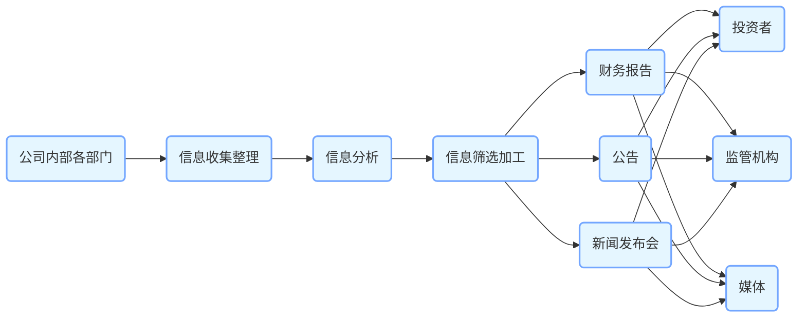

# 彼得林奇对公司治理透明度的要求

> 关键词：彼得林奇、公司治理、透明度、投资、财务报告、信息披露、股东权益

> 摘要：本文深入探讨了彼得林奇对公司治理透明度的要求。彼得林奇作为投资界的传奇人物，其投资理念和方法对众多投资者产生了深远影响。公司治理透明度在他的投资决策中占据着关键地位，因为这关系到投资者能否准确了解公司的真实状况。文章首先介绍了相关背景，包括研究目的、预期读者等。接着阐述了公司治理透明度的核心概念及与投资的联系。详细讲解了彼得林奇判断公司治理透明度的核心算法原理及操作步骤，运用数学模型和公式进行分析并举例说明。通过项目实战展示了如何在实际中评估公司治理透明度。还探讨了其在实际投资场景中的应用，推荐了相关学习资源、开发工具框架以及论文著作。最后总结了未来公司治理透明度的发展趋势与挑战，并对常见问题进行解答，提供扩展阅读和参考资料，旨在帮助读者全面理解彼得林奇对公司治理透明度的要求及其重要意义。

## 1. 背景介绍 
### 1.1 目的和范围
本文的目的在于全面剖析彼得林奇对公司治理透明度的要求，深入理解其背后的投资逻辑和意义。通过研究彼得林奇的相关理念和方法，为投资者和企业管理者提供有价值的参考，帮助投资者更好地筛选投资标的，帮助企业管理者认识到提升公司治理透明度的重要性。研究范围涵盖了彼得林奇的投资著作、言论中关于公司治理透明度的相关内容，以及相关的公司治理理论和实践。

### 1.2 预期读者
本文预期读者包括广大投资者，无论是专业的投资机构从业者还是普通的个人投资者，都可以从本文中获取关于公司治理透明度的重要信息，从而优化投资决策。企业管理者也可以从中了解到彼得林奇对公司治理的期望，有助于提升公司的治理水平。此外，对公司治理和投资理论感兴趣的学者和研究人员也能在本文中找到有价值的研究参考。

### 1.3 文档结构概述
本文首先介绍背景信息，让读者了解研究的目的、范围、预期读者和文档结构。接着阐述公司治理透明度的核心概念及其与投资的联系，通过文本示意图和 Mermaid 流程图进行清晰展示。然后详细讲解判断公司治理透明度的核心算法原理和具体操作步骤，结合 Python 源代码进行说明。运用数学模型和公式进一步分析并举例。通过项目实战展示在实际中如何评估公司治理透明度，包括开发环境搭建、源代码实现和代码解读。探讨其在实际投资场景中的应用，推荐相关的学习资源、开发工具框架和论文著作。最后总结未来发展趋势与挑战，解答常见问题，并提供扩展阅读和参考资料。

### 1.4 术语表
#### 1.4.1 核心术语定义
- **公司治理透明度**：指公司向投资者、监管机构和其他利益相关者公开披露公司信息的程度和质量，包括财务信息、经营信息、战略规划、治理结构等方面，确保信息的真实、准确、完整和及时。
- **投资决策**：投资者根据对各种投资标的的分析和评估，做出是否投资以及投资多少的决策过程。
- **股东权益**：股东对公司资产和利润的所有权，包括剩余索取权、投票权等。

#### 1.4.2 相关概念解释
- **信息披露**：公司按照法律法规和监管要求，将公司的重要信息向社会公众公开的行为，是公司治理透明度的重要体现。
- **财务报告**：公司定期编制的反映公司财务状况、经营成果和现金流量的文件，是投资者了解公司的重要依据。
- **内部控制**：公司为了保证经营活动的有效进行、保护资产的安全完整、防止和发现错误与舞弊、保证会计资料的真实、合法、完整而制定和实施的政策与程序，对公司治理透明度有重要影响。

#### 1.4.3 缩略词列表
- **CEO**：首席执行官（Chief Executive Officer）
- **CFO**：首席财务官（Chief Financial Officer）
- **GAAP**：公认会计原则（Generally Accepted Accounting Principles）

## 2. 核心概念与联系 

### 核心概念原理
公司治理透明度是公司治理的重要组成部分，其核心原理在于通过信息的公开披露，减少信息不对称，增强投资者对公司的信任。当公司能够及时、准确、完整地披露相关信息时，投资者可以更好地了解公司的经营状况、财务状况和发展前景，从而做出合理的投资决策。

从公司治理的角度来看，透明度有助于加强对管理层的监督和约束，防止管理层的机会主义行为，保护股东权益。例如，清晰的财务报告可以让股东了解公司的资金流向和盈利情况，监督管理层的经营决策。

### 架构的文本示意图
公司治理透明度的架构可以分为三个层次：信息生成层、信息披露层和信息接收层。

信息生成层包括公司内部的各个部门，如财务部门、运营部门、战略规划部门等，这些部门负责收集、整理和分析公司的各类信息。

信息披露层是将信息生成层产生的信息进行筛选、加工和发布的环节，主要通过财务报告、公告、新闻发布会等渠道向外界披露信息。

信息接收层则是投资者、监管机构、媒体等利益相关者接收和分析公司披露信息的过程，他们根据这些信息做出相应的决策和反应。

### Mermaid 流程图


## 3. 核心算法原理 & 具体操作步骤 

### 核心算法原理
彼得林奇判断公司治理透明度的核心算法原理基于对公司信息披露的多个维度进行评估。主要包括信息的完整性、准确性、及时性和相关性。

完整性指公司披露的信息涵盖了公司经营的各个方面，没有重大遗漏。准确性要求信息真实可靠，没有虚假陈述或误导性信息。及时性强调信息能够在规定的时间内及时披露，以便投资者及时做出决策。相关性则是指披露的信息与投资者的决策密切相关，能够帮助投资者了解公司的价值和风险。

### 具体操作步骤
1. **收集信息**：通过公司的官方网站、证券交易所网站、新闻媒体等渠道收集公司的财务报告、公告、年报等相关信息。
2. **评估完整性**：检查信息是否涵盖了公司的财务状况、经营成果、战略规划、重大事项等方面。可以制定一个信息清单，逐一核对公司披露的信息是否完整。
3. **评估准确性**：对公司披露的财务数据进行分析，与同行业其他公司进行比较，检查是否存在异常波动或不合理的情况。可以通过计算财务比率、分析财务报表附注等方式进行验证。
4. **评估及时性**：查看公司信息披露的时间是否符合法律法规和监管要求，是否存在延迟披露的情况。
5. **评估相关性**：分析公司披露的信息是否与投资者的决策相关，是否能够帮助投资者了解公司的核心竞争力、发展前景和风险因素。

### Python 源代码实现
```python
import requests
from bs4 import BeautifulSoup
import pandas as pd

# 收集公司信息
def collect_company_info(company_url):
    try:
        response = requests.get(company_url)
        soup = BeautifulSoup(response.text, 'html.parser')
        # 这里可以根据具体网页结构提取信息
        # 例如提取财务报告链接
        financial_report_links = soup.find_all('a', text='财务报告')
        return financial_report_links
    except Exception as e:
        print(f"收集信息时出错: {e}")
        return []

# 评估信息完整性
def evaluate_completeness(info_list):
    # 假设信息清单
    info_checklist = ['财务状况', '经营成果', '战略规划', '重大事项']
    complete_count = 0
    for item in info_checklist:
        for info in info_list:
            if item in info:
                complete_count += 1
                break
    completeness_score = complete_count / len(info_checklist)
    return completeness_score

# 评估信息准确性（简单示例，实际需更复杂分析）
def evaluate_accuracy(financial_data):
    # 假设分析财务比率
    if '净利润率' in financial_data and '毛利率' in financial_data:
        net_profit_margin = financial_data['净利润率']
        gross_profit_margin = financial_data['毛利率']
        if net_profit_margin > gross_profit_margin:
            return 0  # 异常情况，准确性低
        else:
            return 1  # 正常情况，准确性高
    else:
        return 0.5  # 数据不完整，准确性一般

# 主函数
def main():
    company_url = 'https://example.com'  # 替换为实际公司网址
    info_links = collect_company_info(company_url)
    completeness_score = evaluate_completeness(info_links)
    print(f"信息完整性得分: {completeness_score}")
    # 这里假设已经获取到财务数据
    financial_data = {'净利润率': 0.1, '毛利率': 0.2}
    accuracy_score = evaluate_accuracy(financial_data)
    print(f"信息准确性得分: {accuracy_score}")

if __name__ == "__main__":
    main()
```

## 4. 数学模型和公式 & 详细讲解 & 举例说明 

### 数学模型
可以建立一个综合评估公司治理透明度的数学模型，用一个综合得分来表示公司治理透明度的水平。

设 $S$ 为公司治理透明度综合得分，$S_{c}$ 为信息完整性得分，$S_{a}$ 为信息准确性得分，$S_{t}$ 为信息及时性得分，$S_{r}$ 为信息相关性得分。各得分的取值范围为 $[0, 1]$。

综合得分的计算公式为：

$$S = w_{c}S_{c} + w_{a}S_{a} + w_{t}S_{t} + w_{r}S_{r}$$

其中，$w_{c}$、$w_{a}$、$w_{t}$、$w_{r}$ 分别为信息完整性、准确性、及时性和相关性的权重，且 $w_{c} + w_{a} + w_{t} + w_{r} = 1$。

### 详细讲解
信息完整性得分 $S_{c}$ 反映了公司披露信息的全面程度，得分越高表示信息越完整。信息准确性得分 $S_{a}$ 体现了信息的真实可靠程度，得分越高说明信息越准确。信息及时性得分 $S_{t}$ 衡量了信息披露的及时程度，得分越高表示信息披露越及时。信息相关性得分 $S_{r}$ 表示信息与投资者决策的相关程度，得分越高说明信息越有价值。

权重的设置需要根据不同的情况进行调整。例如，对于投资者来说，信息准确性可能更为重要，因此可以适当提高 $w_{a}$ 的权重。

### 举例说明
假设某公司的信息完整性得分 $S_{c} = 0.8$，信息准确性得分 $S_{a} = 0.9$，信息及时性得分 $S_{t} = 0.7$，信息相关性得分 $S_{r} = 0.8$，且权重 $w_{c} = 0.2$，$w_{a} = 0.3$，$w_{t} = 0.2$，$w_{r} = 0.3$。

则该公司的治理透明度综合得分 $S$ 为：

$$
\begin{align*}
S &= 0.2\times0.8 + 0.3\times0.9 + 0.2\times0.7 + 0.3\times0.8\\
&= 0.16 + 0.27 + 0.14 + 0.24\\
&= 0.81
\end{align*}
$$

这表明该公司的治理透明度处于较高水平。

## 5. 项目实战：代码实际案例和详细解释说明 

### 5.1  开发环境搭建
1. **Python 安装**：从 Python 官方网站（https://www.python.org/downloads/）下载并安装 Python 3.x 版本。
2. **安装必要的库**：使用以下命令安装所需的库：
```sh
pip install requests beautifulsoup4 pandas
```

### 5.2  源代码详细实现和代码解读
```python
import requests
from bs4 import BeautifulSoup
import pandas as pd

# 收集公司信息
def collect_company_info(company_url):
    try:
        response = requests.get(company_url)
        soup = BeautifulSoup(response.text, 'html.parser')
        # 这里可以根据具体网页结构提取信息
        # 例如提取财务报告链接
        financial_report_links = soup.find_all('a', text='财务报告')
        return financial_report_links
    except Exception as e:
        print(f"收集信息时出错: {e}")
        return []

# 评估信息完整性
def evaluate_completeness(info_list):
    # 假设信息清单
    info_checklist = ['财务状况', '经营成果', '战略规划', '重大事项']
    complete_count = 0
    for item in info_checklist:
        for info in info_list:
            if item in info:
                complete_count += 1
                break
    completeness_score = complete_count / len(info_checklist)
    return completeness_score

# 评估信息准确性（简单示例，实际需更复杂分析）
def evaluate_accuracy(financial_data):
    # 假设分析财务比率
    if '净利润率' in financial_data and '毛利率' in financial_data:
        net_profit_margin = financial_data['净利润率']
        gross_profit_margin = financial_data['毛利率']
        if net_profit_margin > gross_profit_margin:
            return 0  # 异常情况，准确性低
        else:
            return 1  # 正常情况，准确性高
    else:
        return 0.5  # 数据不完整，准确性一般

# 主函数
def main():
    company_url = 'https://example.com'  # 替换为实际公司网址
    info_links = collect_company_info(company_url)
    completeness_score = evaluate_completeness(info_links)
    print(f"信息完整性得分: {completeness_score}")
    # 这里假设已经获取到财务数据
    financial_data = {'净利润率': 0.1, '毛利率': 0.2}
    accuracy_score = evaluate_accuracy(financial_data)
    print(f"信息准确性得分: {accuracy_score}")

if __name__ == "__main__":
    main()
```

**代码解读**：
- `collect_company_info` 函数：使用 `requests` 库发送 HTTP 请求获取公司网页内容，然后使用 `BeautifulSoup` 库解析网页，提取财务报告链接。如果请求过程中出现异常，会打印错误信息并返回空列表。
- `evaluate_completeness` 函数：通过定义一个信息清单，检查收集到的信息是否包含清单中的各项内容，计算完整信息的数量与清单总数量的比值，得到信息完整性得分。
- `evaluate_accuracy` 函数：简单地分析财务数据中的净利润率和毛利率，如果净利润率大于毛利率，则认为信息准确性低，返回 0；否则返回 1。如果数据不完整，则返回 0.5。
- `main` 函数：调用上述函数，收集公司信息，评估信息完整性和准确性，并打印得分。

### 5.3  代码解读与分析
这段代码实现了一个简单的公司治理透明度评估的雏形。通过收集公司信息并对其完整性和准确性进行评估，可以初步判断公司治理透明度的水平。

然而，代码还存在一些局限性。例如，信息收集部分只是简单地提取财务报告链接，可能无法全面获取公司的信息。信息准确性评估也只是基于简单的财务比率比较，实际情况中需要更复杂的分析，如对财务报表进行审计、与同行业数据进行详细对比等。

在实际应用中，可以进一步扩展代码，增加对信息及时性和相关性的评估，完善综合得分的计算，提高评估的准确性和可靠性。

## 6. 实际应用场景 
### 投资者决策
对于投资者来说，公司治理透明度是选择投资标的的重要参考因素。彼得林奇认为，只有了解公司的真实状况，投资者才能做出明智的投资决策。当公司治理透明度高时，投资者可以更准确地评估公司的价值和风险，从而选择具有潜力的投资对象。例如，在选择股票时，投资者可以通过分析公司的财务报告、公告等信息，判断公司的治理透明度，进而决定是否投资该公司的股票。

### 企业融资
在企业融资过程中，良好的公司治理透明度可以增加投资者的信心，提高融资的成功率。银行、投资者等在决定是否向企业提供资金时，会关注企业的治理透明度。如果企业能够及时、准确地披露信息，展示良好的经营状况和发展前景，就更容易获得融资。例如，一家准备上市的公司，通过提高公司治理透明度，能够吸引更多的投资者认购其股票，顺利完成上市融资。

### 监管机构监督
监管机构可以通过评估公司治理透明度，加强对企业的监督管理。透明度高的公司更符合监管要求，能够减少违规行为的发生。监管机构可以要求公司定期披露信息，对信息披露不规范的公司进行处罚，促使公司提高治理透明度。例如，证券监管机构可以对上市公司的信息披露进行检查，对存在虚假陈述、延迟披露等问题的公司进行处罚，维护市场秩序。

### 企业自身发展
对于企业自身来说，提高公司治理透明度有助于提升企业形象，增强内部管理效率。透明的信息披露可以让员工了解公司的战略规划和经营状况，增强员工的归属感和责任感。同时，良好的公司治理透明度也可以吸引优秀的人才加入企业，促进企业的长期发展。例如，一家注重公司治理透明度的企业，更容易吸引高素质的管理人才和专业技术人才，推动企业不断创新和发展。

## 7. 工具和资源推荐
### 7.1 学习资源推荐
#### 7.1.1 书籍推荐
- 《彼得林奇的成功投资》：彼得林奇的经典著作，详细阐述了他的投资理念和方法，包括对公司基本面的分析和对公司治理透明度的关注。
- 《公司治理》：全面介绍了公司治理的理论和实践，包括公司治理的结构、机制和透明度等方面的内容。
- 《财务报表分析》：帮助读者学习如何分析公司的财务报表，从而了解公司的财务状况和经营成果，这对于评估公司治理透明度非常重要。

#### 7.1.2 在线课程
- Coursera 平台上的“公司治理与企业社会责任”课程：由知名学者授课，系统讲解公司治理的相关知识，包括公司治理透明度的重要性和评估方法。
- edX 平台上的“投资分析与组合管理”课程：涵盖了投资决策的各个方面，其中包括对公司基本面的分析和对公司治理透明度的评估。

#### 7.1.3 技术博客和网站
- 雪球网：一个投资者交流社区，有很多关于公司分析和投资经验分享的文章，其中不乏对公司治理透明度的讨论。
- 巨潮资讯网：中国证监会指定的上市公司信息披露网站，可以获取上市公司的最新信息，有助于了解公司的治理透明度。

### 7.2 开发工具框架推荐
#### 7.2.1 IDE和编辑器
- PyCharm：一款专业的 Python 集成开发环境，具有代码编辑、调试、自动补全等功能，适合开发与公司治理透明度评估相关的 Python 程序。
- Visual Studio Code：一款轻量级的代码编辑器，支持多种编程语言，通过安装相关插件可以方便地进行 Python 开发。

#### 7.2.2 调试和性能分析工具
- pdb：Python 自带的调试工具，可以帮助开发者在代码中设置断点，逐步执行代码，查找问题。
- cProfile：Python 的性能分析工具，可以分析代码的运行时间和函数调用情况，帮助优化代码性能。

#### 7.2.3 相关框架和库
- requests：用于发送 HTTP 请求，获取网页内容，方便收集公司信息。
- BeautifulSoup：用于解析 HTML 和 XML 文档，提取所需的信息。
- pandas：用于数据处理和分析，可以对收集到的公司信息进行整理和分析。

### 7.3 相关论文著作推荐
#### 7.3.1 经典论文
- “The Separation of Ownership and Control”（《所有权与控制权的分离》）：探讨了公司治理中所有权和控制权分离的问题，对理解公司治理透明度的重要性有很大帮助。
- “Corporate Governance and Transparency”（《公司治理与透明度》）：系统研究了公司治理透明度的理论和实践，为相关研究提供了重要的参考。

#### 7.3.2 最新研究成果
可以通过学术数据库，如知网、万方、Web of Science 等，搜索关于公司治理透明度的最新研究论文，了解该领域的前沿动态和研究成果。

#### 7.3.3 应用案例分析
一些专业的财经媒体和研究机构会发布关于公司治理透明度的应用案例分析，如对某些上市公司的治理透明度进行评估和分析，从中可以学习到实际应用中的经验和方法。

## 8. 总结：未来发展趋势与挑战
### 未来发展趋势
1. **更高的透明度要求**：随着投资者对信息需求的增加和监管力度的加强，未来公司治理透明度的要求将越来越高。公司需要更加全面、准确、及时地披露信息，以满足投资者和监管机构的需求。
2. **数字化和智能化的应用**：信息技术的发展将为公司治理透明度的提升提供新的手段。例如，利用区块链技术可以实现信息的不可篡改和可追溯，提高信息的可信度；利用人工智能技术可以对大量的公司信息进行分析和挖掘，帮助投资者更好地理解公司的状况。
3. **国际标准的统一**：在全球化的背景下，国际间的投资和合作日益频繁，公司治理透明度的国际标准将逐渐统一。这有助于提高全球投资者对公司的信任度，促进资本的跨国流动。

### 挑战
1. **信息安全问题**：在提高公司治理透明度的过程中，需要披露大量的公司信息，这可能会带来信息安全问题。公司需要采取有效的措施保护敏感信息，防止信息泄露。
2. **合规成本增加**：更高的透明度要求意味着公司需要投入更多的资源来收集、整理和披露信息，这将增加公司的合规成本。对于一些小型企业来说，可能面临较大的压力。
3. **信息过载问题**：随着信息披露的增加，投资者可能会面临信息过载的问题。如何从海量的信息中筛选出有价值的信息，成为投资者面临的挑战。

## 9. 附录：常见问题与解答
### 问题 1：如何判断公司披露的信息是否准确？
答：可以通过多种方式判断公司披露信息的准确性。首先，可以对财务数据进行分析，计算财务比率，与同行业其他公司进行比较，检查是否存在异常波动。其次，可以查看公司的审计报告，审计机构的意见可以作为参考。此外，还可以关注公司的历史信息披露情况，是否存在虚假陈述等问题。

### 问题 2：公司治理透明度对公司股价有什么影响？
答：一般来说，公司治理透明度高的公司更容易获得投资者的信任，从而吸引更多的投资者购买其股票，推动股价上涨。相反，公司治理透明度低的公司可能会被投资者视为风险较高，导致股价下跌。但股价的影响因素是复杂的，公司治理透明度只是其中之一，还受到市场环境、行业发展等多种因素的影响。

### 问题 3：如何提高公司的治理透明度？
答：公司可以从以下几个方面提高治理透明度。一是建立健全信息披露制度，明确信息披露的内容、时间和方式。二是加强内部控制，保证信息的真实、准确、完整。三是加强与投资者的沟通，及时回应投资者的关切。四是积极接受监管机构的监督，遵守相关法律法规。

## 10. 扩展阅读 & 参考资料
### 扩展阅读
- 《聪明的投资者》：本杰明·格雷厄姆的经典著作，深入探讨了价值投资的理念和方法，对理解公司治理透明度在投资中的作用有很大帮助。
- 《竞争战略》：迈克尔·波特的著作，介绍了企业竞争战略的相关理论，有助于从战略层面理解公司治理透明度对企业竞争力的影响。

### 参考资料
- 彼得林奇的相关著作和访谈记录。
- 相关的法律法规和监管政策，如《上市公司信息披露管理办法》等。
- 学术期刊上发表的关于公司治理透明度的研究论文。