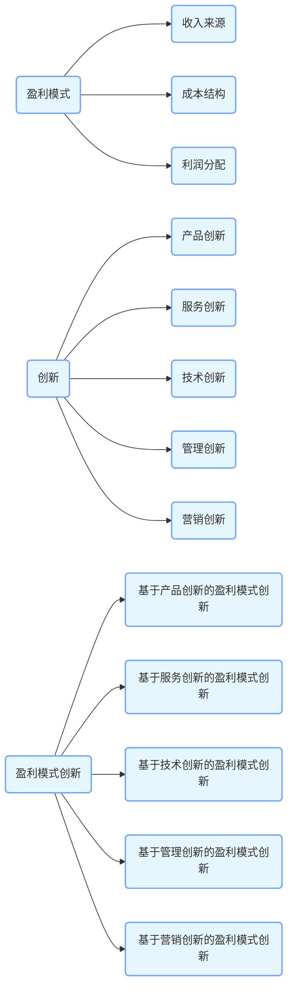

# 彼得林奇对公司盈利模式创新的判断

> 关键词：彼得林奇、盈利模式创新、公司分析、投资策略、财务指标、竞争优势、市场趋势

> 摘要：本文深入探讨彼得林奇对公司盈利模式创新的判断方法和理念。彼得林奇作为投资界的传奇人物，其投资智慧备受推崇。通过对公司盈利模式创新的精准判断，他能够挖掘出具有潜力的投资标的。文章将介绍彼得林奇判断盈利模式创新的背景，阐述相关核心概念，分析其背后的算法原理和数学模型，结合实际案例进行详细解读，探讨其在实际应用场景中的作用，推荐相关的学习工具和资源，最后总结未来发展趋势与挑战，并对常见问题进行解答。

## 1. 背景介绍 
### 1.1 目的和范围
本文的目的在于深入剖析彼得林奇对公司盈利模式创新的判断方法，为投资者和企业管理者提供有价值的参考。通过研究彼得林奇的投资理念和实践经验，我们可以更好地理解如何识别公司盈利模式创新的潜力，从而做出更明智的投资决策或制定更有效的企业战略。本文的范围涵盖了彼得林奇判断盈利模式创新的各个方面，包括核心概念、算法原理、数学模型、实际案例以及未来发展趋势等。

### 1.2 预期读者
本文预期读者包括投资者、企业管理者、金融分析师、学术研究人员以及对投资和企业管理感兴趣的人士。对于投资者来说，了解彼得林奇的判断方法可以帮助他们发现潜在的投资机会；对于企业管理者来说，学习这些方法可以帮助他们评估自身企业的盈利模式创新能力，制定更有效的发展战略；对于金融分析师和学术研究人员来说，本文可以为他们的研究提供有价值的参考；对于普通读者来说，本文可以帮助他们增长投资和企业管理方面的知识。

### 1.3 文档结构概述
本文将按照以下结构进行阐述：首先介绍彼得林奇判断公司盈利模式创新的背景，包括目的、预期读者和文档结构概述；接着阐述相关的核心概念和联系，包括盈利模式、创新等概念的定义和相互关系；然后分析其核心算法原理和具体操作步骤，结合Python源代码进行详细阐述；再介绍相关的数学模型和公式，并通过举例进行说明；之后通过实际案例进行项目实战，包括开发环境搭建、源代码实现和代码解读；接着探讨其在实际应用场景中的作用；再推荐相关的学习工具和资源；最后总结未来发展趋势与挑战，并对常见问题进行解答，同时提供扩展阅读和参考资料。

### 1.4 术语表
#### 1.4.1 核心术语定义
- **盈利模式**：指企业通过各种业务活动获取利润的方式和途径，包括收入来源、成本结构、利润分配等要素。
- **创新**：指企业在产品、服务、技术、管理、营销等方面进行的创造性改进和变革，以提高企业的竞争力和盈利能力。
- **投资回报率（ROI）**：指投资所获得的收益与投资成本的比率，是衡量投资效益的重要指标。
- **市盈率（P/E）**：指股票价格与每股收益的比率，是衡量股票估值的重要指标。
- **市净率（P/B）**：指股票价格与每股净资产的比率，是衡量股票估值的重要指标。

#### 1.4.2 相关概念解释
- **竞争优势**：指企业在市场竞争中相对于竞争对手所具有的优势，包括成本优势、差异化优势、品牌优势等。
- **可持续发展**：指企业在长期发展过程中，能够保持良好的经济效益、社会效益和环境效益，实现企业的可持续发展。
- **市场趋势**：指市场在一定时期内的发展方向和变化趋势，包括市场规模、市场增长率、市场份额等。

#### 1.4.3 缩略词列表
- **ROI**：Return on Investment（投资回报率）
- **P/E**：Price-to-Earnings Ratio（市盈率）
- **P/B**：Price-to-Book Ratio（市净率）

## 2. 核心概念与联系 
### 盈利模式的概念与构成
盈利模式是企业实现盈利的方式和途径，它涉及到企业的各个方面，包括产品或服务的设计、生产、销售、营销、成本控制等。一个完整的盈利模式通常包括以下几个要素：
1. **收入来源**：指企业通过销售产品或服务所获得的收入，包括销售收入、服务收入、租金收入、利息收入等。
2. **成本结构**：指企业在生产、销售、营销等过程中所发生的成本，包括原材料成本、人工成本、制造费用、销售费用、管理费用等。
3. **利润分配**：指企业将所获得的利润按照一定的比例分配给股东、员工、债权人等利益相关者的方式。

### 创新的概念与类型
创新是企业发展的动力和源泉，它可以帮助企业提高竞争力、开拓市场、创造价值。创新可以分为以下几种类型：
1. **产品创新**：指企业在产品的功能、性能、外观、质量等方面进行的创新，以满足消费者的需求和提高产品的竞争力。
2. **服务创新**：指企业在服务的内容、方式、质量等方面进行的创新，以提高客户满意度和忠诚度。
3. **技术创新**：指企业在技术研发、应用、推广等方面进行的创新，以提高企业的生产效率和产品质量。
4. **管理创新**：指企业在管理理念、管理方法、管理流程等方面进行的创新，以提高企业的管理效率和决策水平。
5. **营销创新**：指企业在营销渠道、营销策略、营销手段等方面进行的创新，以提高产品的市场占有率和销售额。

### 盈利模式创新的概念与意义
盈利模式创新是指企业在盈利模式的各个要素方面进行的创新，以实现企业的可持续发展和盈利增长。盈利模式创新的意义在于：
1. **提高企业的竞争力**：通过创新盈利模式，企业可以提高产品或服务的附加值，降低成本，提高效率，从而提高企业的竞争力。
2. **开拓市场**：创新盈利模式可以帮助企业发现新的市场机会，满足消费者的需求，从而开拓新的市场。
3. **创造价值**：盈利模式创新可以帮助企业创造新的价值，提高企业的盈利能力和股东价值。

### 核心概念的联系
盈利模式、创新和盈利模式创新之间存在着密切的联系。创新是推动盈利模式创新的动力和源泉，通过创新，企业可以不断优化盈利模式的各个要素，提高企业的竞争力和盈利能力。盈利模式创新是企业实现可持续发展的重要途径，它可以帮助企业适应市场变化，开拓新的市场，创造新的价值。

### 文本示意图
```plaintext
盈利模式
├── 收入来源
├── 成本结构
├── 利润分配

创新
├── 产品创新
├── 服务创新
├── 技术创新
├── 管理创新
├── 营销创新

盈利模式创新
├── 基于产品创新的盈利模式创新
├── 基于服务创新的盈利模式创新
├── 基于技术创新的盈利模式创新
├── 基于管理创新的盈利模式创新
├── 基于营销创新的盈利模式创新
```

### Mermaid 流程图


## 3. 核心算法原理 & 具体操作步骤 
### 彼得林奇判断盈利模式创新的核心算法原理
彼得林奇判断盈利模式创新的核心算法原理基于对公司基本面的深入分析，包括公司的财务状况、业务模式、竞争优势、市场趋势等方面。他通过对这些因素的综合评估，来判断公司的盈利模式是否具有创新性和可持续性。

### 具体操作步骤
1. **财务分析**：通过分析公司的财务报表，了解公司的收入、利润、资产、负债等情况，评估公司的盈利能力、偿债能力、运营能力等。重点关注公司的收入增长趋势、利润率变化、资产质量等指标。
2. **业务模式分析**：了解公司的业务模式，包括产品或服务的特点、市场定位、客户群体、销售渠道等。分析公司的业务模式是否具有创新性和竞争力，是否能够满足市场需求。
3. **竞争优势分析**：评估公司的竞争优势，包括成本优势、差异化优势、品牌优势等。分析公司的竞争优势是否可持续，是否能够抵御竞争对手的挑战。
4. **市场趋势分析**：研究市场趋势，包括行业发展趋势、市场规模变化、消费者需求变化等。分析公司的业务模式是否符合市场趋势，是否具有发展潜力。
5. **管理层分析**：评估公司的管理层素质，包括管理经验、创新能力、决策能力等。分析公司的管理层是否能够有效地推动公司的发展和创新。

### Python 源代码实现
```python
import pandas as pd

# 模拟财务数据
financial_data = {
    '年份': [2018, 2019, 2020, 2021, 2022],
    '营业收入': [1000, 1200, 1500, 1800, 2000],
    '净利润': [100, 120, 150, 180, 200],
    '资产总额': [5000, 5500, 6000, 6500, 7000],
    '负债总额': [2000, 2200, 2400, 2600, 2800]
}

df = pd.DataFrame(financial_data)

# 计算关键财务指标
df['毛利率'] = (df['营业收入'] - df['营业成本']) / df['营业收入']
df['净利率'] = df['净利润'] / df['营业收入']
df['资产负债率'] = df['负债总额'] / df['资产总额']

# 分析收入增长趋势
income_growth_rate = df['营业收入'].pct_change()

# 输出结果
print('财务数据：')
print(df)
print('收入增长趋势：')
print(income_growth_rate)
```

### 代码解释
1. **数据模拟**：使用字典模拟公司的财务数据，包括年份、营业收入、净利润、资产总额和负债总额。
2. **数据处理**：将模拟数据转换为 Pandas 数据框，并计算关键财务指标，如毛利率、净利率和资产负债率。
3. **趋势分析**：计算营业收入的增长率，以分析收入增长趋势。
4. **结果输出**：打印财务数据和收入增长趋势。

## 4. 数学模型和公式 & 详细讲解 & 举例说明 
### 财务指标计算公式
1. **毛利率**：$毛利率 = \frac{营业收入 - 营业成本}{营业收入} \times 100\%$
毛利率反映了公司产品或服务的盈利能力，毛利率越高，说明公司的产品或服务越具有竞争力。

2. **净利率**：$净利率 = \frac{净利润}{营业收入} \times 100\%$
净利率反映了公司的最终盈利能力，净利率越高，说明公司的经营管理水平越高。

3. **资产负债率**：$资产负债率 = \frac{负债总额}{资产总额} \times 100\%$
资产负债率反映了公司的偿债能力，资产负债率越低，说明公司的偿债能力越强。

### 举例说明
假设某公司的财务数据如下：
| 年份 | 营业收入 | 营业成本 | 净利润 | 资产总额 | 负债总额 |
| ---- | ---- | ---- | ---- | ---- | ---- |
| 2022 | 1000 | 600 | 200 | 5000 | 2000 |

根据上述公式，计算该公司的关键财务指标：
1. **毛利率**：$毛利率 = \frac{1000 - 600}{1000} \times 100\% = 40\%$
2. **净利率**：$净利率 = \frac{200}{1000} \times 100\% = 20\%$
3. **资产负债率**：$资产负债率 = \frac{2000}{5000} \times 100\% = 40\%$

通过对这些财务指标的分析，我们可以评估该公司的盈利能力、偿债能力和经营管理水平。

### 其他数学模型和公式
除了上述财务指标计算公式外，彼得林奇还使用了一些其他的数学模型和公式来判断公司的盈利模式创新，例如：
1. **PEG 指标**：$PEG = \frac{市盈率}{净利润增长率}$
PEG 指标是一种综合考虑市盈率和净利润增长率的指标，它可以帮助投资者判断股票的估值是否合理。一般来说，PEG 指标小于 1 表示股票被低估，PEG 指标大于 1 表示股票被高估。

2. **市净率**：$市净率 = \frac{股票价格}{每股净资产}$
市净率是一种衡量股票估值的指标，它反映了股票价格与每股净资产的关系。一般来说，市净率越低，说明股票的估值越低，投资价值越高。

## 5. 项目实战：代码实际案例和详细解释说明 
### 5.1  开发环境搭建
在进行项目实战之前，我们需要搭建开发环境。以下是搭建开发环境的步骤：
1. **安装 Python**：从 Python 官方网站（https://www.python.org/downloads/）下载并安装 Python 3.x 版本。
2. **安装必要的库**：使用 pip 命令安装必要的库，如 Pandas、Numpy、Matplotlib 等。
```sh
pip install pandas numpy matplotlib
```
3. **选择开发工具**：可以选择使用 Jupyter Notebook、PyCharm 等开发工具进行代码编写和调试。

### 5.2  源代码详细实现和代码解读
以下是一个完整的项目实战案例，通过分析某公司的财务数据来判断其盈利模式创新情况：

```python
import pandas as pd
import matplotlib.pyplot as plt

# 读取财务数据
data = pd.read_csv('financial_data.csv')

# 数据预处理
data['日期'] = pd.to_datetime(data['日期'])
data.set_index('日期', inplace=True)

# 计算关键财务指标
data['毛利率'] = (data['营业收入'] - data['营业成本']) / data['营业收入']
data['净利率'] = data['净利润'] / data['营业收入']
data['资产负债率'] = data['负债总额'] / data['资产总额']

# 分析收入增长趋势
income_growth_rate = data['营业收入'].pct_change()

# 绘制财务指标变化趋势图
fig, axes = plt.subplots(3, 1, figsize=(10, 10))
data['毛利率'].plot(ax=axes[0], title='毛利率变化趋势')
data['净利率'].plot(ax=axes[1], title='净利率变化趋势')
data['资产负债率'].plot(ax=axes[2], title='资产负债率变化趋势')
plt.tight_layout()
plt.show()

# 分析收入增长趋势
print('收入增长趋势：')
print(income_growth_rate)
```

### 代码解读
1. **数据读取**：使用 Pandas 的 `read_csv` 函数读取财务数据文件。
2. **数据预处理**：将日期列转换为日期时间类型，并将其设置为索引。
3. **计算关键财务指标**：根据前面介绍的公式计算毛利率、净利率和资产负债率。
4. **分析收入增长趋势**：使用 Pandas 的 `pct_change` 函数计算营业收入的增长率。
5. **绘制财务指标变化趋势图**：使用 Matplotlib 库绘制毛利率、净利率和资产负债率的变化趋势图，以便直观地观察财务指标的变化情况。
6. **输出收入增长趋势**：打印营业收入的增长率。

### 5.3  代码解读与分析
通过对上述代码的运行结果进行分析，我们可以得到以下结论：
1. **毛利率变化趋势**：如果毛利率呈现上升趋势，说明公司的产品或服务的盈利能力在增强，可能是由于产品创新、成本控制等原因导致的。
2. **净利率变化趋势**：如果净利率呈现上升趋势，说明公司的最终盈利能力在增强，可能是由于公司的经营管理水平提高、成本降低等原因导致的。
3. **资产负债率变化趋势**：如果资产负债率呈现下降趋势，说明公司的偿债能力在增强，可能是由于公司的负债减少、资产增加等原因导致的。
4. **收入增长趋势**：如果收入增长率呈现上升趋势，说明公司的业务在不断发展壮大，可能是由于市场需求增长、产品创新等原因导致的。

通过对这些财务指标的综合分析，我们可以判断公司的盈利模式是否具有创新性和可持续性。

## 6. 实际应用场景 
### 投资决策
在投资决策中，投资者可以使用彼得林奇的方法来判断公司的盈利模式创新情况，从而选择具有潜力的投资标的。通过分析公司的财务状况、业务模式、竞争优势、市场趋势等因素，投资者可以评估公司的盈利能力和发展潜力，从而做出更明智的投资决策。

### 企业战略制定
企业管理者可以使用彼得林奇的方法来评估自身企业的盈利模式创新能力，从而制定更有效的企业战略。通过分析公司的财务状况、业务模式、竞争优势、市场趋势等因素，企业管理者可以发现公司的优势和不足，从而制定相应的战略措施，提高企业的竞争力和盈利能力。

### 行业分析
在行业分析中，分析师可以使用彼得林奇的方法来分析行业内企业的盈利模式创新情况，从而了解行业的发展趋势和竞争格局。通过分析行业内企业的财务状况、业务模式、竞争优势、市场趋势等因素，分析师可以评估行业内企业的竞争力和发展潜力，从而为投资者和企业管理者提供有价值的参考。

## 7. 工具和资源推荐
### 7.1 学习资源推荐
#### 7.1.1 书籍推荐
- 《彼得林奇的成功投资》：彼得林奇的经典著作，详细介绍了他的投资理念和方法。
- 《战胜华尔街》：彼得林奇的另一本重要著作，分享了他的投资经验和案例。
- 《财务报表分析》：帮助读者了解如何分析公司的财务报表，掌握财务分析的基本方法和技巧。

#### 7.1.2 在线课程
- Coursera 上的“投资学原理”课程：由知名教授授课，系统介绍投资学的基本原理和方法。
- edX 上的“财务报表分析”课程：帮助学习者掌握财务报表分析的方法和技巧。

#### 7.1.3 技术博客和网站
- Seeking Alpha：提供专业的投资分析和研究报告，是投资者获取信息的重要来源。
- ValueWalk：专注于价值投资领域，分享投资经验和观点。

### 7.2 开发工具框架推荐
#### 7.2.1 IDE和编辑器
- PyCharm：一款专业的 Python 集成开发环境，提供丰富的功能和插件，方便代码编写和调试。
- Jupyter Notebook：一种交互式的开发环境，适合进行数据分析和可视化。

#### 7.2.2 调试和性能分析工具
- PDB：Python 自带的调试工具，方便调试代码。
- cProfile：Python 自带的性能分析工具，用于分析代码的性能瓶颈。

#### 7.2.3 相关框架和库
- Pandas：用于数据处理和分析的 Python 库，提供了丰富的数据结构和函数。
- Numpy：用于科学计算的 Python 库，提供了高效的数组操作和数学函数。
- Matplotlib：用于数据可视化的 Python 库，提供了丰富的绘图函数和工具。

### 7.3 相关论文著作推荐
#### 7.3.1 经典论文
- “The Random Walk Hypothesis of Stock Market Prices”：该论文提出了股票市场价格的随机游走假说，对投资理论产生了深远影响。
- “Efficient Capital Markets: A Review of Theory and Empirical Work”：该论文对有效市场假说进行了系统的阐述和总结。

#### 7.3.2 最新研究成果
- 关注顶级金融学术期刊，如《Journal of Finance》、《Review of Financial Studies》等，了解最新的投资研究成果。

#### 7.3.3 应用案例分析
- 阅读相关的投资案例分析书籍和文章，学习如何将投资理论应用到实际案例中。

## 8. 总结：未来发展趋势与挑战
### 未来发展趋势
1. **数字化转型加速**：随着信息技术的快速发展，企业的数字化转型将加速，盈利模式创新也将更多地依赖于数字技术和数据分析。
2. **可持续发展成为主流**：消费者对可持续发展的关注度不断提高，企业的盈利模式创新将更多地考虑环境、社会和治理等因素。
3. **跨界融合加剧**：不同行业之间的界限将越来越模糊，企业的盈利模式创新将更多地涉及跨界融合和创新。

### 挑战
1. **技术变革迅速**：信息技术的快速发展使得技术变革迅速，企业需要不断学习和适应新技术，以保持竞争力。
2. **市场竞争激烈**：随着市场竞争的加剧，企业的盈利模式创新面临着更大的挑战，需要不断创新和优化，以满足市场需求。
3. **法律法规变化**：法律法规的变化可能会对企业的盈利模式创新产生影响，企业需要及时了解和遵守相关法律法规。

## 9. 附录：常见问题与解答
### 问题 1：如何判断公司的盈利模式是否具有创新性？
答：可以从公司的产品或服务、业务模式、竞争优势等方面进行分析。如果公司能够推出具有创新性的产品或服务，采用独特的业务模式，具有明显的竞争优势，那么其盈利模式可能具有创新性。

### 问题 2：财务指标在判断盈利模式创新中起到什么作用？
答：财务指标可以反映公司的盈利能力、偿债能力、运营能力等方面的情况。通过分析财务指标的变化趋势，可以了解公司的经营状况和发展趋势，从而判断公司的盈利模式是否具有创新性和可持续性。

### 问题 3：如何应用彼得林奇的方法进行投资决策？
答：可以按照彼得林奇的方法，对公司的财务状况、业务模式、竞争优势、市场趋势等方面进行分析，评估公司的盈利能力和发展潜力，从而选择具有潜力的投资标的。

### 问题 4：企业管理者如何应用彼得林奇的方法制定企业战略？
答：企业管理者可以使用彼得林奇的方法，评估自身企业的盈利模式创新能力，发现公司的优势和不足，从而制定相应的战略措施，提高企业的竞争力和盈利能力。

## 10. 扩展阅读 & 参考资料
### 扩展阅读
- 《聪明的投资者》：本杰明·格雷厄姆的经典著作，介绍了价值投资的理念和方法。
- 《金融炼金术》：乔治·索罗斯的著作，分享了他的投资哲学和实践经验。

### 参考资料
- 彼得林奇的相关著作和演讲。
- 金融学术期刊和研究报告。
- 相关的财经网站和新闻媒体。