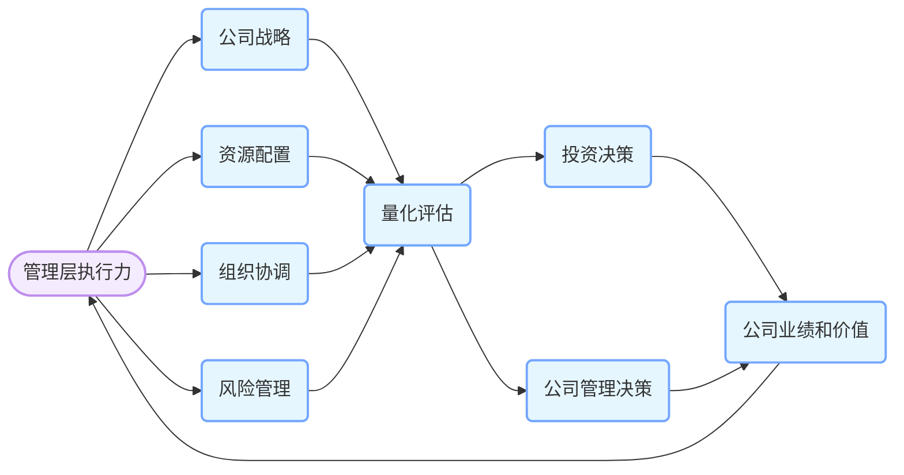

# 彼得林奇对公司管理层执行力的量化评估

> 关键词：彼得林奇、公司管理层、执行力、量化评估、财务指标、非财务指标

> 摘要：本文围绕彼得林奇对公司管理层执行力的量化评估展开。深入探讨了在投资领域中评估管理层执行力的重要性，详细分析了彼得林奇所采用的量化评估方法，包括基于财务指标和非财务指标的评估体系。通过实际案例展示了这些评估方法的应用，并阐述了其在投资决策中的作用。同时，对未来在该领域的发展趋势与挑战进行了总结，旨在为投资者和企业管理者提供有价值的参考和借鉴。

## 1. 背景介绍 
### 1.1 目的和范围
在投资领域，准确评估公司的价值和发展潜力是做出明智投资决策的关键。而公司管理层的执行力在很大程度上决定了公司的运营效率和发展前景。彼得林奇作为投资界的传奇人物，他的投资理念和方法备受关注。本文的目的在于深入研究彼得林奇对公司管理层执行力的量化评估方法，揭示其评估体系的原理和应用。范围涵盖了彼得林奇所涉及的各种评估指标和方法，以及这些方法在不同类型公司中的应用。

### 1.2 预期读者
本文预期读者包括投资者、企业管理者、金融分析师、经济学者以及对公司管理和投资领域感兴趣的人士。对于投资者来说，了解彼得林奇的评估方法有助于他们在选择投资标的时更加全面地评估公司的价值；企业管理者可以从中获取提升管理层执行力的启示；金融分析师和经济学者可以将其作为研究公司管理和投资理论的参考；而对该领域感兴趣的人士则可以通过本文了解到投资和公司管理的相关知识。

### 1.3 文档结构概述
本文首先介绍研究的背景和目的，包括对预期读者和文档结构的说明。接着阐述核心概念，解释管理层执行力的内涵以及与其他相关概念的联系，并给出相应的示意图和流程图。然后详细讲解彼得林奇所采用的核心算法原理和具体操作步骤，通过 Python 源代码进行阐述。之后介绍相关的数学模型和公式，并举例说明。再通过项目实战，展示代码实际案例并进行详细解释。随后探讨该评估方法的实际应用场景。接着推荐相关的工具和资源，包括学习资源、开发工具框架和相关论文著作。最后总结未来发展趋势与挑战，提供常见问题与解答以及扩展阅读和参考资料。

### 1.4 术语表
#### 1.4.1 核心术语定义
- **管理层执行力**：指公司管理层将战略目标转化为实际行动并取得预期成果的能力，包括决策能力、组织协调能力、资源配置能力、团队领导能力等多个方面。
- **量化评估**：运用数学模型和统计方法，将管理层执行力等难以直接衡量的指标转化为具体的数值，以便进行比较和分析。
- **财务指标**：反映公司财务状况和经营成果的一系列数据，如营业收入、净利润、资产负债率等。
- **非财务指标**：除财务指标以外的其他能够反映公司运营情况和发展潜力的指标，如市场份额、客户满意度、创新能力等。

#### 1.4.2 相关概念解释
- **投资决策**：投资者在众多投资机会中选择合适的投资标的，并确定投资金额和投资时间的过程。评估公司管理层执行力是投资决策中的重要环节，因为优秀的管理层执行力有助于提高公司的业绩和价值，从而为投资者带来更高的回报。
- **公司治理**：通过一系列制度和机制，协调公司各利益相关者之间的关系，保证公司决策的科学性和公正性，提高公司的运营效率和竞争力。管理层执行力是公司治理的重要组成部分，良好的公司治理有助于提升管理层执行力。

#### 1.4.3 缩略词列表
- **ROE**：净资产收益率（Return on Equity），反映股东权益的收益水平。
- **EPS**：每股收益（Earnings Per Share），表示普通股股东每持有一股所能享有的企业净利润或需承担的企业净亏损。

## 2. 核心概念与联系 
### 管理层执行力的内涵
管理层执行力是一个综合性的概念，它涉及到公司运营的各个方面。从战略层面来看，管理层需要制定明确的战略目标，并将其分解为具体的行动计划。在执行过程中，管理层要合理配置资源，组织协调各部门的工作，确保计划的顺利实施。同时，管理层还需要具备应对各种风险和挑战的能力，及时调整战略和行动计划，以适应市场环境的变化。

### 量化评估的意义
量化评估管理层执行力具有重要意义。首先，它可以使评估结果更加客观和准确。通过将管理层执行力转化为具体的数值，可以避免主观因素的干扰，使不同公司之间的管理层执行力具有可比性。其次，量化评估有助于投资者和企业管理者更好地理解公司的优势和劣势，从而制定更加合理的投资策略和管理决策。最后，量化评估可以为公司管理层提供明确的目标和方向，促使他们不断提升自身的执行力。

### 核心概念的联系
管理层执行力与公司的业绩和价值密切相关。优秀的管理层执行力可以提高公司的运营效率，降低成本，增加收入，从而提升公司的业绩和价值。而量化评估则是连接管理层执行力和投资决策的桥梁。通过量化评估，投资者可以更加准确地评估公司的管理层执行力，进而做出更加明智的投资决策。

### 文本示意图
管理层执行力处于中心位置，它与公司战略、资源配置、组织协调、风险管理等方面相互关联。量化评估则是对管理层执行力进行评估的手段，其结果影响投资决策和公司管理决策。公司的业绩和价值是管理层执行力的最终体现，同时又反过来影响管理层的决策和行为。

### Mermaid 流程图


## 3. 核心算法原理 & 具体操作步骤 
### 基于财务指标的评估方法
彼得林奇认为，财务指标是评估公司管理层执行力的重要依据。以下是一些常用的财务指标及其评估方法：

#### 净资产收益率（ROE）
ROE 反映了股东权益的收益水平，计算公式为：
$$ROE = \frac{净利润}{净资产} \times 100\%$$
ROE 越高，说明公司管理层利用自有资本获取收益的能力越强，执行力也就越好。

#### 每股收益（EPS）
EPS 表示普通股股东每持有一股所能享有的企业净利润或需承担的企业净亏损，计算公式为：
$$EPS = \frac{净利润}{发行在外普通股股数}$$
EPS 的增长趋势可以反映公司管理层的经营业绩和执行力。如果 EPS 持续增长，说明公司管理层能够有效地提高公司的盈利能力。

#### 销售毛利率
销售毛利率反映了公司产品或服务的盈利能力，计算公式为：
$$销售毛利率 = \frac{营业收入 - 营业成本}{营业收入} \times 100\%$$
较高的销售毛利率说明公司管理层能够有效地控制成本，提高产品或服务的附加值，执行力较强。

### 基于非财务指标的评估方法
除了财务指标，彼得林奇还注重非财务指标的评估。以下是一些常用的非财务指标及其评估方法：

#### 市场份额
市场份额反映了公司在市场中的竞争地位，计算公式为：
$$市场份额 = \frac{公司的销售额}{市场总销售额} \times 100\%$$
市场份额的增长说明公司管理层能够有效地拓展市场，提高公司的竞争力，执行力较强。

#### 客户满意度
客户满意度反映了公司产品或服务满足客户需求的程度。可以通过问卷调查、客户反馈等方式收集数据，计算客户满意度得分。较高的客户满意度说明公司管理层能够关注客户需求，提供优质的产品或服务，执行力较强。

#### 创新能力
创新能力反映了公司在技术、产品、管理等方面的创新水平。可以通过专利数量、新产品研发投入等指标来评估公司的创新能力。较强的创新能力说明公司管理层能够积极推动创新，提高公司的核心竞争力，执行力较强。

### Python 源代码实现
```python
# 计算净资产收益率（ROE）
def calculate_roe(net_profit, net_assets):
    if net_assets == 0:
        return 0
    return (net_profit / net_assets) * 100

# 计算每股收益（EPS）
def calculate_eps(net_profit, shares_outstanding):
    if shares_outstanding == 0:
        return 0
    return net_profit / shares_outstanding

# 计算销售毛利率
def calculate_gross_margin(revenue, cost_of_goods_sold):
    if revenue == 0:
        return 0
    return ((revenue - cost_of_goods_sold) / revenue) * 100

# 计算市场份额
def calculate_market_share(company_sales, total_market_sales):
    if total_market_sales == 0:
        return 0
    return (company_sales / total_market_sales) * 100

# 示例数据
net_profit = 1000000
net_assets = 5000000
shares_outstanding = 1000000
revenue = 2000000
cost_of_goods_sold = 1200000
company_sales = 500000
total_market_sales = 2000000

# 计算各项指标
roe = calculate_roe(net_profit, net_assets)
eps = calculate_eps(net_profit, shares_outstanding)
gross_margin = calculate_gross_margin(revenue, cost_of_goods_sold)
market_share = calculate_market_share(company_sales, total_market_sales)

print(f"净资产收益率（ROE）: {roe}%")
print(f"每股收益（EPS）: {eps}")
print(f"销售毛利率: {gross_margin}%")
print(f"市场份额: {market_share}%")
```

### 具体操作步骤
1. **数据收集**：收集公司的财务报表、市场调研报告、客户反馈等相关数据。
2. **指标计算**：根据上述公式和 Python 代码，计算各项财务指标和非财务指标。
3. **指标分析**：将计算得到的指标与同行业其他公司进行比较，分析公司管理层执行力的优势和劣势。
4. **综合评估**：结合各项指标的分析结果，对公司管理层的执行力进行综合评估，给出评估结论和建议。

## 4. 数学模型和公式 & 详细讲解 & 举例说明 
### 财务指标相关公式
#### 净资产收益率（ROE）
$$ROE = \frac{净利润}{净资产} \times 100\%$$
详细讲解：ROE 衡量了公司运用自有资本的效率。净利润是公司在一定时期内的盈利，净资产是公司的所有者权益。ROE 越高，说明公司利用自有资本创造利润的能力越强。

举例说明：假设公司 A 的净利润为 500 万元，净资产为 2000 万元，则其 ROE 为：
$$ROE_A = \frac{500}{2000} \times 100\% = 25\%$$
假设公司 B 的净利润为 300 万元，净资产为 1500 万元，则其 ROE 为：
$$ROE_B = \frac{300}{1500} \times 100\% = 20\%$$
比较可知，公司 A 的 ROE 高于公司 B，说明公司 A 的管理层在利用自有资本获取收益方面的能力更强。

#### 每股收益（EPS）
$$EPS = \frac{净利润}{发行在外普通股股数}$$
详细讲解：EPS 反映了每股普通股所享有的净利润。发行在外普通股股数是指公司向社会公众发行的普通股数量。EPS 越高，说明公司的盈利能力越强，股东的收益也就越高。

举例说明：假设公司 C 的净利润为 800 万元，发行在外普通股股数为 400 万股，则其 EPS 为：
$$EPS_C = \frac{800}{400} = 2$$
假设公司 D 的净利润为 600 万元，发行在外普通股股数为 300 万股，则其 EPS 为：
$$EPS_D = \frac{600}{300} = 2$$
虽然公司 C 和公司 D 的 EPS 相同，但如果考虑到公司的发展前景和其他因素，还需要进一步分析。

#### 销售毛利率
$$销售毛利率 = \frac{营业收入 - 营业成本}{营业收入} \times 100\%$$
详细讲解：销售毛利率反映了公司产品或服务的盈利能力。营业收入是公司销售产品或提供服务所获得的收入，营业成本是公司生产产品或提供服务所发生的成本。销售毛利率越高，说明公司的产品或服务在扣除成本后能够获得更高的利润。

举例说明：假设公司 E 的营业收入为 1000 万元，营业成本为 600 万元，则其销售毛利率为：
$$销售毛利率_E = \frac{1000 - 600}{1000} \times 100\% = 40\%$$
假设公司 F 的营业收入为 800 万元，营业成本为 500 万元，则其销售毛利率为：
$$销售毛利率_F = \frac{800 - 500}{800} \times 100\% = 37.5\%$$
公司 E 的销售毛利率高于公司 F，说明公司 E 的产品或服务在盈利能力方面更具优势。

### 非财务指标相关公式
#### 市场份额
$$市场份额 = \frac{公司的销售额}{市场总销售额} \times 100\%$$
详细讲解：市场份额反映了公司在市场中的竞争地位。公司的销售额是指公司在一定时期内销售产品或提供服务所获得的收入，市场总销售额是指整个市场在同一时期内的销售总额。市场份额越高，说明公司在市场中的竞争力越强。

举例说明：假设在某一市场中，市场总销售额为 5000 万元，公司 G 的销售额为 1000 万元，则其市场份额为：
$$市场份额_G = \frac{1000}{5000} \times 100\% = 20\%$$
假设公司 H 的销售额为 800 万元，则其市场份额为：
$$市场份额_H = \frac{800}{5000} \times 100\% = 16\%$$
公司 G 的市场份额高于公司 H，说明公司 G 在该市场中的竞争力更强。

## 5. 项目实战：代码实际案例和详细解释说明 
### 5.1  开发环境搭建
#### 安装 Python
首先，需要安装 Python 开发环境。可以从 Python 官方网站（https://www.python.org/downloads/）下载适合自己操作系统的 Python 安装包，然后按照安装向导进行安装。

#### 安装必要的库
在进行数据分析和计算时，可能需要使用一些第三方库，如 Pandas、Numpy 等。可以使用以下命令进行安装：
```sh
pip install pandas numpy
```

### 5.2  源代码详细实现和代码解读
```python
import pandas as pd

# 模拟公司数据
data = {
    '公司名称': ['公司 A', '公司 B', '公司 C', '公司 D'],
    '净利润': [5000000, 3000000, 8000000, 6000000],
    '净资产': [20000000, 15000000, 40000000, 30000000],
    '发行在外普通股股数': [2000000, 1500000, 4000000, 3000000],
    '营业收入': [10000000, 8000000, 15000000, 12000000],
    '营业成本': [6000000, 5000000, 9000000, 7000000],
    '公司销售额': [2000000, 1500000, 3000000, 2500000],
    '市场总销售额': [10000000, 10000000, 10000000, 10000000]
}

# 创建 DataFrame
df = pd.DataFrame(data)

# 定义计算函数
def calculate_roe(net_profit, net_assets):
    if net_assets == 0:
        return 0
    return (net_profit / net_assets) * 100

def calculate_eps(net_profit, shares_outstanding):
    if shares_outstanding == 0:
        return 0
    return net_profit / shares_outstanding

def calculate_gross_margin(revenue, cost_of_goods_sold):
    if revenue == 0:
        return 0
    return ((revenue - cost_of_goods_sold) / revenue) * 100

def calculate_market_share(company_sales, total_market_sales):
    if total_market_sales == 0:
        return 0
    return (company_sales / total_market_sales) * 100

# 计算各项指标
df['ROE'] = df.apply(lambda row: calculate_roe(row['净利润'], row['净资产']), axis=1)
df['EPS'] = df.apply(lambda row: calculate_eps(row['净利润'], row['发行在外普通股股数']), axis=1)
df['销售毛利率'] = df.apply(lambda row: calculate_gross_margin(row['营业收入'], row['营业成本']), axis=1)
df['市场份额'] = df.apply(lambda row: calculate_market_share(row['公司销售额'], row['市场总销售额']), axis=1)

# 输出结果
print(df[['公司名称', 'ROE', 'EPS', '销售毛利率', '市场份额']])
```

### 5.3  代码解读与分析
1. **数据模拟**：使用字典 `data` 模拟了四家公司的相关数据，包括净利润、净资产、发行在外普通股股数等。
2. **创建 DataFrame**：使用 Pandas 的 `DataFrame` 函数将模拟数据转换为数据框，方便进行数据处理和计算。
3. **定义计算函数**：定义了计算 ROE、EPS、销售毛利率和市场份额的函数，这些函数的实现与前面介绍的公式一致。
4. **计算各项指标**：使用 Pandas 的 `apply` 函数将计算函数应用到每一行数据上，计算出每家公司的 ROE、EPS、销售毛利率和市场份额。
5. **输出结果**：打印出包含公司名称和各项指标的结果数据框，方便进行比较和分析。

通过这个实际案例，可以看到如何使用 Python 和 Pandas 库来计算和分析公司的财务指标和非财务指标，从而评估公司管理层的执行力。

## 6. 实际应用场景 
### 投资决策
在投资决策中，评估公司管理层的执行力是非常重要的。投资者可以通过分析公司的财务指标和非财务指标，了解公司管理层的决策能力、运营能力和创新能力等。如果一家公司的管理层执行力较强，其业绩和价值可能会有较好的表现，投资者可以考虑将其作为投资标的。例如，彼得林奇在选择股票时，会关注公司的 ROE、EPS 等财务指标，以及市场份额、创新能力等非财务指标，以评估公司管理层的执行力，从而做出投资决策。

### 企业并购
在企业并购过程中，评估目标公司管理层的执行力对于并购的成功至关重要。如果目标公司的管理层执行力较强，并购后可以更好地整合资源，实现协同效应，提高企业的竞争力。相反，如果目标公司的管理层执行力较弱，可能会导致并购后出现各种问题，影响企业的发展。因此，在企业并购前，需要对目标公司管理层的执行力进行量化评估，以便做出明智的决策。

### 企业内部管理
企业内部管理中，评估管理层的执行力可以帮助企业发现问题，及时调整管理策略。通过对财务指标和非财务指标的分析，企业可以了解管理层在战略制定、资源配置、组织协调等方面的表现，找出存在的问题并加以改进。同时，量化评估结果还可以作为管理层绩效考核的重要依据，激励管理层提高执行力。

## 7. 工具和资源推荐
### 7.1 学习资源推荐
#### 7.1.1 书籍推荐
- 《彼得林奇的成功投资》：彼得林奇的经典著作，详细介绍了他的投资理念和方法，包括如何评估公司的价值和管理层的执行力。
- 《财务报表分析》：全面介绍了财务报表分析的方法和技巧，有助于读者深入理解财务指标的含义和应用。
- 《公司战略与风险管理》：讲解了公司战略的制定和实施，以及风险管理的方法和策略，对于理解管理层的决策和执行力有很大帮助。

#### 7.1.2 在线课程
- Coursera 上的《投资学原理》：由知名教授授课，系统介绍了投资学的基本原理和方法，包括公司估值和投资决策。
- edX 上的《财务报表分析与估值》：通过实际案例讲解财务报表分析和公司估值的方法，提高学习者的分析能力。
- 中国大学 MOOC 上的《企业战略管理》：介绍了企业战略管理的理论和实践，帮助学习者了解管理层的战略决策过程。

#### 7.1.3 技术博客和网站
- 雪球网：一个投资交流社区，有很多投资者分享自己的投资经验和对公司的分析，包括对管理层执行力的评估。
- 东方财富网：提供丰富的金融信息和数据，包括公司的财务报表和市场数据，方便读者进行分析和研究。
- Seeking Alpha：一个全球知名的投资研究网站，有很多专业的分析师发布对公司的研究报告，其中包含对管理层执行力的评估。

### 7.2 开发工具框架推荐
#### 7.2.1 IDE和编辑器
- PyCharm：一款专业的 Python 集成开发环境，提供丰富的代码编辑、调试和分析功能，适合进行数据分析和开发。
- Jupyter Notebook：一个交互式的开发环境，支持 Python 等多种编程语言，方便进行数据探索和分析。
- Visual Studio Code：一款轻量级的代码编辑器，支持多种编程语言和插件，具有良好的扩展性。

#### 7.2.2 调试和性能分析工具
- PDB：Python 自带的调试器，可以帮助开发者调试代码，查找问题。
- cProfile：Python 标准库中的性能分析工具，可以分析代码的执行时间和性能瓶颈。
- Py-Spy：一个跨平台的性能分析工具，可以实时分析 Python 程序的性能。

#### 7.2.3 相关框架和库
- Pandas：一个强大的数据分析库，提供了数据结构和数据处理功能，方便进行数据清洗、分析和可视化。
- Numpy：一个基础的科学计算库，提供了高效的数组操作和数学函数，是很多数据分析和机器学习库的基础。
- Matplotlib：一个常用的绘图库，可以绘制各种类型的图表，帮助用户直观地展示数据。

### 7.3 相关论文著作推荐
#### 7.3.1 经典论文
- 《The Theory of the Firm: Managerial Behavior, Agency Costs and Ownership Structure》：该论文探讨了公司治理中的代理问题和所有权结构对管理层行为的影响。
- 《Financial Ratios and the Probabilistic Prediction of Bankruptcy》：提出了使用财务比率预测公司破产概率的方法，对于理解财务指标的应用有重要意义。
- 《Market Share and Rate of Return》：研究了市场份额与公司收益率之间的关系，为评估公司的市场竞争力提供了理论依据。

#### 7.3.2 最新研究成果
- 近年来，有很多关于公司管理层执行力评估的研究成果，涉及到新的评估指标和方法。可以通过学术数据库，如知网、万方、Web of Science 等，查找相关的最新研究论文。
- 一些知名的商学院和研究机构也会发布关于公司管理和投资的研究报告，关注这些报告可以了解到最新的研究动态和趋势。

#### 7.3.3 应用案例分析
- 一些专业的金融媒体和研究机构会发布公司管理层执行力评估的应用案例分析，通过实际案例可以更好地理解评估方法的应用和效果。例如，《哈佛商业评论》经常会发表一些关于企业管理和投资的案例分析文章。

## 8. 总结：未来发展趋势与挑战
### 未来发展趋势
#### 多维度评估
未来对公司管理层执行力的评估将更加注重多维度的综合评估。除了财务指标和非财务指标外，还将考虑更多的因素，如企业文化、社会责任、数字化转型能力等。通过多维度的评估，可以更全面地了解公司管理层的执行力。

#### 大数据和人工智能的应用
随着大数据和人工智能技术的发展，未来将可以利用更多的数据和更先进的算法来评估公司管理层的执行力。例如，通过分析社交媒体数据、客户评价数据等非结构化数据，挖掘更多有价值的信息。同时，利用人工智能算法可以更准确地预测公司的业绩和发展趋势，为评估管理层执行力提供更有力的支持。

#### 动态评估
传统的评估方法往往是基于历史数据进行静态评估，而未来将更加注重动态评估。通过实时监测公司的运营数据和市场变化，及时调整评估指标和方法，以反映公司管理层执行力的动态变化。

### 挑战
#### 数据质量和可靠性
在进行量化评估时，数据质量和可靠性是关键。然而，由于数据来源的多样性和复杂性，数据可能存在不准确、不完整等问题。如何确保数据的质量和可靠性，是未来需要解决的重要挑战。

#### 指标的选择和权重确定
选择合适的评估指标和确定合理的指标权重是量化评估的核心问题。不同的行业和公司可能需要不同的评估指标和权重，如何根据具体情况进行选择和确定，需要深入的研究和实践。

#### 非财务指标的量化难度
非财务指标往往比较难以量化，如企业文化、创新能力等。如何将这些非财务指标转化为具体的数值，是未来需要解决的技术难题。

## 9. 附录：常见问题与解答
### 问题 1：量化评估管理层执行力是否准确可靠？
解答：量化评估可以在一定程度上提高评估的准确性和可靠性，但也存在一定的局限性。量化评估主要基于历史数据和一些可量化的指标，而公司的发展是动态的，受到多种因素的影响。因此，量化评估结果只能作为参考，还需要结合定性分析和其他信息进行综合判断。

### 问题 2：如何选择合适的评估指标？
解答：选择评估指标需要考虑公司的行业特点、发展阶段、战略目标等因素。一般来说，可以选择一些具有代表性的财务指标和非财务指标，如 ROE、EPS、市场份额、客户满意度等。同时，还可以根据具体情况添加一些个性化的指标。

### 问题 3：如何确定指标的权重？
解答：确定指标权重的方法有很多种，如专家打分法、层次分析法、主成分分析法等。不同的方法有不同的优缺点，需要根据具体情况选择合适的方法。一般来说，可以结合多种方法进行综合确定，以提高权重的合理性。

### 问题 4：量化评估结果如何应用？
解答：量化评估结果可以应用于投资决策、企业并购、企业内部管理等多个方面。在投资决策中，可以根据评估结果选择投资标的；在企业并购中，可以评估目标公司的价值和风险；在企业内部管理中，可以发现问题，调整管理策略，激励管理层提高执行力。

## 10. 扩展阅读 & 参考资料
### 扩展阅读
- 《聪明的投资者》：本杰明·格雷厄姆的经典著作，介绍了价值投资的理念和方法，对于理解投资决策和公司估值有很大帮助。
- 《从优秀到卓越》：吉姆·柯林斯的著作，研究了优秀公司如何实现向卓越公司的跨越，其中涉及到公司管理层的作用和执行力。
- 《基业长青》：同样是吉姆·柯林斯的著作，探讨了那些能够长期保持卓越的公司的成功秘诀，对于理解公司的可持续发展和管理层的战略决策有重要启示。

### 参考资料
- 彼得林奇的相关著作和演讲资料。
- 各公司的财务报表和年报。
- 金融媒体和研究机构发布的研究报告和分析文章。
- 学术数据库中的相关研究论文。