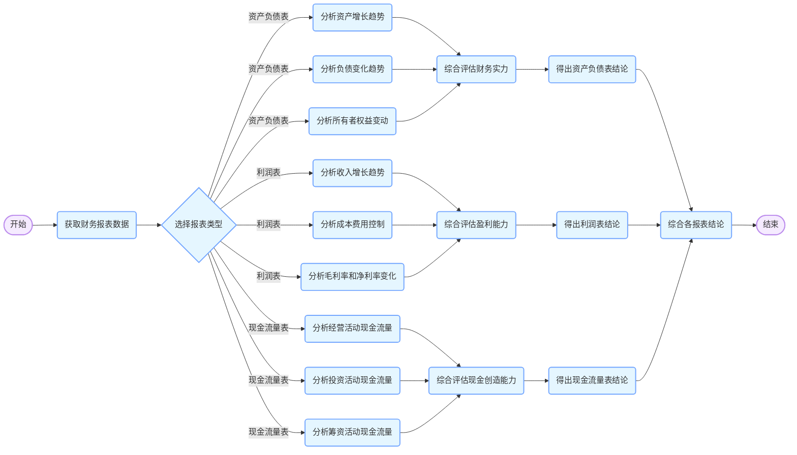

# 彼得林奇对公司财务报表趋势的解读

> 关键词：彼得林奇、公司财务报表、趋势解读、财务分析、投资策略

> 摘要：本文深入探讨了彼得林奇对公司财务报表趋势的解读方法。彼得林奇作为投资界的传奇人物，其独特的财务报表分析方式对于投资者准确评估公司价值、把握投资机会具有重要指导意义。文章首先介绍背景知识，包括目的、预期读者等，接着阐述核心概念，分析核心算法原理，讲解数学模型与公式，通过项目实战案例进行详细说明，探讨实际应用场景，推荐相关工具和资源，最后总结未来发展趋势与挑战，解答常见问题并提供参考资料，旨在帮助读者全面理解彼得林奇的财务报表解读方法及其在投资决策中的应用。

## 1. 背景介绍 
### 1.1 目的和范围
本文的目的在于深入剖析彼得林奇对公司财务报表趋势的解读方法，使读者能够学习和掌握这些实用的财务分析技巧，应用于投资决策过程中。范围涵盖了彼得林奇所关注的财务报表的各个关键部分，包括资产负债表、利润表和现金流量表，以及如何通过对这些报表数据的趋势分析来评估公司的财务健康状况和发展潜力。

### 1.2 预期读者
预期读者包括对投资领域感兴趣的初学者，希望通过学习专业的财务分析方法来提升投资能力；也包括有一定投资经验的投资者，期望借鉴彼得林奇的独特视角，进一步优化自己的投资策略；同时还适用于财务专业的学生和从业者，帮助他们加深对财务报表分析在投资决策中应用的理解。

### 1.3 文档结构概述
本文将按照以下结构展开：首先介绍相关背景知识，包括目的、读者和术语表；接着阐述核心概念及其联系，通过文本示意图和 Mermaid 流程图进行直观展示；然后详细讲解核心算法原理和具体操作步骤，结合 Python 源代码进行说明；再介绍数学模型和公式，并举例说明；通过项目实战案例，包括开发环境搭建、源代码实现和代码解读，深入分析实际应用；探讨实际应用场景；推荐相关的学习资源、开发工具框架和论文著作；总结未来发展趋势与挑战；解答常见问题；最后提供扩展阅读和参考资料。

### 1.4 术语表
#### 1.4.1 核心术语定义
- **财务报表**：企业向外界展示其财务状况和经营成果的书面文件，主要包括资产负债表、利润表和现金流量表。
- **资产负债表**：反映企业在某一特定日期财务状况的报表，展示了企业的资产、负债和所有者权益。
- **利润表**：反映企业在一定会计期间经营成果的报表，体现了企业的收入、成本、费用和利润情况。
- **现金流量表**：反映企业在一定会计期间现金和现金等价物流入和流出的报表，展示了企业的现金来源和使用情况。
- **趋势分析**：通过对财务报表中各项数据在多个期间的变化情况进行分析，以了解企业的发展趋势和经营状况的变化。

#### 1.4.2 相关概念解释
- **财务比率**：通过对财务报表中的数据进行计算得出的比率，用于评估企业的财务状况和经营绩效，如毛利率、净利率、资产负债率等。
- **同比分析**：将本期数据与上年同期数据进行比较，以了解企业在相同时间段内的发展变化情况。
- **环比分析**：将本期数据与上一期数据进行比较，以了解企业在相邻期间的发展变化情况。

#### 1.4.3 缩略词列表
- **EPS**：Earnings Per Share，每股收益。
- **ROE**：Return on Equity，净资产收益率。
- **ROA**：Return on Assets，总资产收益率。

## 2. 核心概念与联系 

### 核心概念原理
彼得林奇对公司财务报表趋势的解读基于一个核心观点：财务报表是企业经营状况的数字化反映，通过对财务报表中各项数据的趋势分析，可以洞察企业的发展动态和潜在价值。

资产负债表反映了企业的财务实力和偿债能力。资产的增长趋势可以反映企业的扩张情况，负债的变化则关系到企业的财务风险。例如，如果企业的固定资产持续增加，可能意味着企业正在进行大规模的投资和扩张；而负债的快速增长可能增加企业的财务压力。

利润表体现了企业的盈利能力。收入的增长趋势是衡量企业市场竞争力和发展潜力的重要指标，成本和费用的控制情况则直接影响企业的利润水平。毛利率的变化可以反映企业产品或服务的盈利能力，净利率则综合考虑了所有成本和费用后的盈利情况。

现金流量表反映了企业的现金创造能力和资金运作效率。经营活动现金流量的持续流入是企业生存和发展的基础，投资活动现金流量的变化反映了企业的投资决策和资产配置情况，筹资活动现金流量则与企业的融资策略有关。

### 架构的文本示意图
```plaintext
公司财务报表趋势解读
|-- 资产负债表趋势分析
|   |-- 资产增长趋势
|   |-- 负债变化趋势
|   |-- 所有者权益变动
|-- 利润表趋势分析
|   |-- 收入增长趋势
|   |-- 成本费用控制
|   |-- 毛利率和净利率变化
|-- 现金流量表趋势分析
|   |-- 经营活动现金流量
|   |-- 投资活动现金流量
|   |-- 筹资活动现金流量
```

### Mermaid 流程图


## 3. 核心算法原理 & 具体操作步骤 

### 核心算法原理
彼得林奇的财务报表趋势分析主要基于比较分析法和比率分析法。比较分析法是将不同期间的财务数据进行对比，观察数据的变化趋势；比率分析法是通过计算各种财务比率，评估企业的财务状况和经营绩效。

### 具体操作步骤
1. **数据收集**：收集企业多个期间的财务报表数据，包括资产负债表、利润表和现金流量表。
2. **数据整理**：将收集到的数据进行整理，确保数据的准确性和一致性。
3. **趋势分析**：
    - 对于资产负债表，计算资产、负债和所有者权益的增长率，观察其变化趋势。
    - 对于利润表，计算收入、成本、费用、毛利率和净利率等指标的增长率，分析其变化趋势。
    - 对于现金流量表，计算经营活动、投资活动和筹资活动现金流量的增长率，了解其变化趋势。
4. **比率分析**：计算各种财务比率，如资产负债率、ROE、ROA 等，评估企业的财务状况和经营绩效。
5. **综合评估**：根据趋势分析和比率分析的结果，综合评估企业的财务健康状况和发展潜力。

### Python 源代码实现
```python
import pandas as pd

# 示例数据：假设我们有一个包含多个期间财务数据的 DataFrame
data = {
    'Year': [2018, 2019, 2020, 2021, 2022],
    'Assets': [1000, 1200, 1300, 1500, 1600],
    'Liabilities': [500, 600, 650, 700, 750],
    'Revenue': [800, 900, 950, 1000, 1050],
    'Cost': [600, 650, 700, 750, 800],
    'OperatingCashFlow': [200, 220, 230, 250, 260]
}

df = pd.DataFrame(data)

# 计算资产增长率
df['AssetsGrowthRate'] = df['Assets'].pct_change()

# 计算负债增长率
df['LiabilitiesGrowthRate'] = df['Liabilities'].pct_change()

# 计算收入增长率
df['RevenueGrowthRate'] = df['Revenue'].pct_change()

# 计算成本增长率
df['CostGrowthRate'] = df['Cost'].pct_change()

# 计算经营活动现金流量增长率
df['OperatingCashFlowGrowthRate'] = df['OperatingCashFlow'].pct_change()

# 计算资产负债率
df['DebtToAssetRatio'] = df['Liabilities'] / df['Assets']

print(df)
```

### 代码解释
1. **数据导入**：使用 Pandas 库创建一个包含多个期间财务数据的 DataFrame。
2. **增长率计算**：使用 `pct_change()` 方法计算各项数据的增长率。
3. **比率计算**：计算资产负债率，即负债与资产的比值。
4. **结果输出**：打印包含增长率和比率的 DataFrame。

## 4. 数学模型和公式 & 详细讲解 & 举例说明 

### 增长率计算公式
增长率是衡量数据变化幅度的重要指标，计算公式如下：
$$增长率 = \frac{本期数据 - 上期数据}{上期数据} \times 100\%$$

### 财务比率计算公式
- **资产负债率**：反映企业的负债水平和偿债能力，计算公式为：
$$资产负债率 = \frac{负债总额}{资产总额} \times 100\%$$
- **ROE（净资产收益率）**：衡量股东权益的收益水平，计算公式为：
$$ROE = \frac{净利润}{股东权益} \times 100\%$$
- **ROA（总资产收益率）**：反映企业运用全部资产的总体获利能力，计算公式为：
$$ROA = \frac{净利润}{资产总额} \times 100\%$$

### 详细讲解
- **增长率**：增长率为正表示数据呈增长趋势，增长率为负表示数据呈下降趋势。增长率的大小反映了数据变化的幅度。例如，如果收入增长率较高，说明企业的市场份额在扩大，盈利能力在增强。
- **资产负债率**：资产负债率越高，说明企业的负债水平越高，财务风险越大；资产负债率越低，说明企业的负债水平越低，财务状况越稳健。一般来说，资产负债率在 40% - 60% 之间较为合理。
- **ROE**：ROE 越高，说明股东权益的收益水平越高，企业的盈利能力越强。ROE 是投资者关注的重要指标之一，它反映了企业为股东创造价值的能力。
- **ROA**：ROA 越高，说明企业运用全部资产的总体获利能力越强。ROA 可以帮助投资者评估企业的资产运营效率。

### 举例说明
假设某企业在 2021 年的资产总额为 1000 万元，负债总额为 400 万元，净利润为 100 万元，股东权益为 600 万元。则该企业的资产负债率、ROE 和 ROA 计算如下：
- **资产负债率**：
$$资产负债率 = \frac{400}{1000} \times 100\% = 40\%$$
- **ROE**：
$$ROE = \frac{100}{600} \times 100\% \approx 16.67\%$$
- **ROA**：
$$ROA = \frac{100}{1000} \times 100\% = 10\%$$

从计算结果可以看出，该企业的资产负债率处于合理范围内，ROE 和 ROA 也表明企业具有一定的盈利能力和资产运营效率。

## 5. 项目实战：代码实际案例和详细解释说明 

### 5.1  开发环境搭建
1. **安装 Python**：从 Python 官方网站（https://www.python.org/downloads/）下载并安装 Python 3.x 版本。
2. **安装必要的库**：使用以下命令安装 Pandas 库：
```sh
pip install pandas
```

### 5.2  源代码详细实现和代码解读
```python
import pandas as pd

# 读取财务报表数据文件（假设为 CSV 文件）
df = pd.read_csv('financial_statements.csv')

# 计算各项数据的增长率
df['AssetsGrowthRate'] = df['Assets'].pct_change()
df['LiabilitiesGrowthRate'] = df['Liabilities'].pct_change()
df['RevenueGrowthRate'] = df['Revenue'].pct_change()
df['CostGrowthRate'] = df['Cost'].pct_change()
df['OperatingCashFlowGrowthRate'] = df['OperatingCashFlow'].pct_change()

# 计算财务比率
df['DebtToAssetRatio'] = df['Liabilities'] / df['Assets']
df['ROE'] = df['NetIncome'] / df['ShareholdersEquity']
df['ROA'] = df['NetIncome'] / df['Assets']

# 保存结果到新的 CSV 文件
df.to_csv('financial_analysis_results.csv', index=False)

print('财务分析完成，结果已保存到 financial_analysis_results.csv 文件中。')
```

### 代码解读与分析
1. **数据读取**：使用 `pd.read_csv()` 函数读取包含财务报表数据的 CSV 文件。
2. **增长率计算**：使用 `pct_change()` 方法计算各项数据的增长率。
3. **财务比率计算**：计算资产负债率、ROE 和 ROA 等财务比率。
4. **结果保存**：使用 `to_csv()` 方法将包含增长率和比率的 DataFrame 保存到新的 CSV 文件中。

通过这个项目实战，我们可以将彼得林奇的财务报表趋势分析方法应用到实际数据中，帮助我们更好地理解企业的财务状况和发展趋势。

## 6. 实际应用场景 
### 投资决策
投资者可以通过对公司财务报表趋势的分析，评估公司的财务健康状况和发展潜力，从而做出合理的投资决策。例如，如果一家公司的收入和利润持续增长，资产负债率合理，经营活动现金流量充足，那么该公司可能具有较高的投资价值。

### 风险管理
企业管理者可以通过对财务报表趋势的分析，及时发现企业面临的财务风险，采取相应的措施进行防范和控制。例如，如果企业的负债增长过快，可能会增加财务风险，管理者可以考虑调整融资策略，降低负债水平。

### 战略规划
企业可以根据财务报表趋势分析的结果，制定合理的战略规划。例如，如果企业的市场份额在下降，收入增长缓慢，那么企业可以考虑加大研发投入，推出新产品，拓展市场渠道，以提高市场竞争力。

### 绩效评估
投资者和企业管理者可以通过对财务报表趋势的分析，评估企业的经营绩效。例如，通过比较不同期间的 ROE 和 ROA 等指标，可以了解企业的盈利能力和资产运营效率是否有所提高。

## 7. 工具和资源推荐
### 7.1 学习资源推荐
#### 7.1.1 书籍推荐
- 《彼得林奇的成功投资》：彼得林奇的经典著作，详细介绍了他的投资理念和方法，包括对公司财务报表的分析技巧。
- 《财务报表分析与证券定价》：一本系统介绍财务报表分析方法及其在证券定价中的应用的书籍，对于深入理解财务报表分析有很大帮助。
- 《聪明的投资者》：本杰明·格雷厄姆的经典著作，阐述了价值投资的理念和方法，对财务报表分析也有重要的指导意义。

#### 7.1.2 在线课程
- Coursera 上的 “Financial Markets” 课程：由耶鲁大学教授罗伯特·席勒讲授，涵盖了金融市场的各个方面，包括财务报表分析。
- edX 上的 “Financial Accounting” 课程：由宾夕法尼亚大学沃顿商学院教授讲授，系统介绍了财务会计的基本原理和财务报表分析方法。
- 中国大学 MOOC 上的 “财务报表分析” 课程：由国内知名高校教授讲授，结合中国企业的实际案例，讲解财务报表分析的方法和技巧。

#### 7.1.3 技术博客和网站
- Seeking Alpha：一个提供金融市场分析和投资建议的网站，有很多关于公司财务报表分析的文章。
- Investopedia：一个提供金融知识和投资教育的网站，有丰富的财务报表分析教程和案例。
- 雪球网：国内知名的投资社区，有很多投资者分享的财务报表分析经验和投资心得。

### 7.2 开发工具框架推荐
#### 7.2.1 IDE和编辑器
- PyCharm：一款功能强大的 Python 集成开发环境，适合进行数据分析和财务报表处理。
- Jupyter Notebook：一个交互式的编程环境，方便进行数据探索和分析，对于财务报表分析非常有用。
- Visual Studio Code：一款轻量级的代码编辑器，支持多种编程语言，有丰富的插件可以扩展功能。

#### 7.2.2 调试和性能分析工具
- Pandas Profiling：一个用于生成数据报告的库，可以快速了解财务报表数据的基本情况，包括数据分布、缺失值等。
- Matplotlib 和 Seaborn：用于数据可视化的库，可以将财务报表数据以图表的形式展示出来，方便分析和理解。
- Scikit-learn：一个机器学习库，可以用于对财务数据进行建模和预测，帮助分析企业的发展趋势。

#### 7.2.3 相关框架和库
- Pandas：用于数据处理和分析的库，提供了丰富的数据结构和函数，方便对财务报表数据进行操作。
- NumPy：用于数值计算的库，是 Pandas 的基础库，提供了高效的数组操作和数学函数。
- Statsmodels：用于统计建模和分析的库，可以对财务数据进行回归分析、时间序列分析等。

### 7.3 相关论文著作推荐
#### 7.3.1 经典论文
- “The Capital Asset Pricing Model: Theory and Evidence”：由 Eugene F. Fama 和 Kenneth R. French 撰写，探讨了资本资产定价模型的理论和实证研究，对财务报表分析和投资决策有重要的理论指导意义。
- “Financial Ratios and the Probabilistic Prediction of Bankruptcy”：由 Edward I. Altman 撰写，提出了著名的 Z-Score 模型，用于预测企业破产的概率，是财务风险分析的经典论文。

#### 7.3.2 最新研究成果
- 关注顶级金融学术期刊，如 the Journal of Finance、the Review of Financial Studies 等，这些期刊会发表关于财务报表分析和投资决策的最新研究成果。
- 参加金融学术会议，如 American Finance Association Annual Meeting、Western Finance Association Annual Meeting 等，了解最新的研究动态和前沿观点。

#### 7.3.3 应用案例分析
- 阅读知名投资机构的研究报告，如摩根大通、高盛等，这些报告通常会包含对公司财务报表的详细分析和投资建议。
- 分析上市公司的年报和招股说明书，了解企业的财务状况和发展战略，学习如何进行财务报表分析和投资决策。

## 8. 总结：未来发展趋势与挑战
### 未来发展趋势
- **数字化和智能化**：随着信息技术的不断发展，财务报表分析将越来越数字化和智能化。人工智能和机器学习技术将被广泛应用于财务数据的处理和分析，提高分析效率和准确性。
- **大数据和可视化**：大数据技术的发展将使财务报表分析能够获取更多、更全面的数据，从而更准确地评估企业的财务状况和发展趋势。同时，可视化技术的应用将使分析结果更加直观、易懂，方便决策者做出决策。
- **跨学科融合**：财务报表分析将与其他学科，如经济学、管理学、统计学等进行更深入的融合，形成更加综合的分析方法和理论体系。

### 挑战
- **数据质量和安全**：随着数据量的不断增加，数据质量和安全问题将成为财务报表分析面临的重要挑战。如何确保数据的准确性、完整性和安全性，是需要解决的关键问题。
- **技术更新换代**：信息技术的快速发展使得财务报表分析技术不断更新换代，分析师需要不断学习和掌握新的技术和方法，以适应市场的变化。
- **复杂经济环境**：全球经济环境的复杂性和不确定性增加，给财务报表分析带来了更大的挑战。如何在复杂的经济环境中准确评估企业的财务状况和发展趋势，是分析师需要面对的难题。

## 9. 附录：常见问题与解答
### 问题 1：如何获取准确的财务报表数据？
答：可以通过以下途径获取准确的财务报表数据：
- 上市公司的官方网站：上市公司会定期披露财务报表，投资者可以在其官方网站上下载。
- 证券交易所网站：证券交易所会发布上市公司的财务报表和相关公告，投资者可以在证券交易所网站上查询。
- 金融数据提供商：如 Wind、东方财富等金融数据提供商，提供了丰富的财务报表数据和分析工具。

### 问题 2：财务比率分析有哪些局限性？
答：财务比率分析虽然是一种重要的财务分析方法，但也存在一定的局限性：
- 会计政策差异：不同企业可能采用不同的会计政策，导致财务比率的计算结果缺乏可比性。
- 行业差异：不同行业的企业具有不同的经营特点和财务特征，不能简单地用相同的财务比率标准进行比较。
- 短期波动：财务比率可能受到短期因素的影响，不能完全反映企业的长期发展趋势。

### 问题 3：如何判断财务报表是否存在造假？
答：可以从以下几个方面判断财务报表是否存在造假：
- 异常的财务指标：如收入和利润增长过快、毛利率过高、资产负债率过低等异常情况，可能存在造假嫌疑。
- 不合理的会计政策变更：企业频繁变更会计政策，可能是为了操纵财务报表数据。
- 关联交易异常：企业与关联方之间存在大量不合理的关联交易，可能存在利益输送和财务造假问题。

## 10. 扩展阅读 & 参考资料
### 扩展阅读
- 《漫步华尔街》：作者 Burton G. Malkiel 探讨了股票市场的有效性和投资策略，对财务报表分析和投资决策有一定的启示。
- 《金融炼金术》：乔治·索罗斯的著作，介绍了他的投资哲学和方法，包括对金融市场的分析和预测。
- 《财务诡计》：作者 Howard M. Schilit 详细介绍了企业财务造假的常见手段和识别方法，对于防范财务风险有重要意义。

### 参考资料
- 彼得林奇的官方网站和相关采访记录。
- 各上市公司的年报、招股说明书和公告。
- 金融学术期刊和研究报告。
- 相关的财务分析书籍和教材。