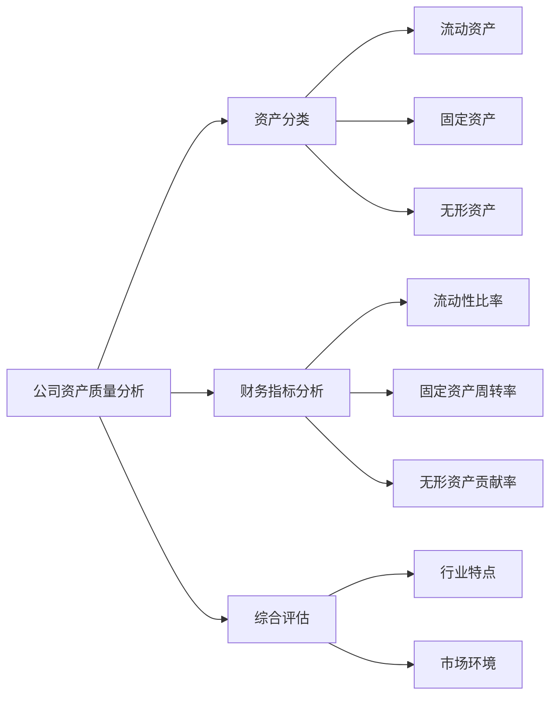

# 彼得林奇对公司资产质量的深度分析

> 关键词：彼得林奇、公司资产质量、财务分析、投资策略、价值评估

> 摘要：本文深入探讨彼得林奇对公司资产质量的分析方法。彼得林奇作为投资界的传奇人物，其独特的投资理念和对公司资产质量的精准把握为投资者带来了丰厚回报。文章将从背景介绍入手，阐述相关核心概念，剖析其分析公司资产质量的核心算法原理与操作步骤，借助数学模型和公式进行详细讲解，通过项目实战展示代码案例及解读，探讨实际应用场景，推荐相关工具和资源，最后总结未来发展趋势与挑战，并解答常见问题，提供扩展阅读和参考资料，旨在帮助投资者更好地理解和运用彼得林奇的分析方法，提升对公司资产质量的评估能力。

## 1. 背景介绍 
### 1.1 目的和范围
本文的目的在于全面解析彼得林奇对公司资产质量的深度分析方法，帮助投资者理解如何从资产质量的角度评估一家公司的投资价值。范围涵盖彼得林奇所关注的各类资产，包括流动资产、固定资产、无形资产等，以及与之相关的财务指标和分析逻辑。通过深入研究这些内容，投资者可以更好地筛选出具有投资潜力的公司。

### 1.2 预期读者
本文预期读者主要包括对投资领域感兴趣的个人投资者、金融专业学生、投资分析师以及从事相关金融研究的人员。对于希望学习和运用彼得林奇投资理念的人群，本文将提供有价值的参考和指导。

### 1.3 文档结构概述
本文首先介绍背景信息，包括目的、预期读者和文档结构。接着阐述核心概念与联系，明确相关术语和概念。然后详细讲解核心算法原理和具体操作步骤，通过Python代码进行说明。随后介绍数学模型和公式，并举例说明。再通过项目实战展示代码案例和详细解释。之后探讨实际应用场景，推荐相关工具和资源。最后总结未来发展趋势与挑战，解答常见问题并提供扩展阅读和参考资料。

### 1.4 术语表
#### 1.4.1 核心术语定义
- **资产质量**：指资产的优劣程度，反映资产在实现其预期经济利益过程中所表现出的品质和效能。优质资产通常具有较高的流动性、盈利能力和安全性。
- **流动资产**：企业在一年或一个营业周期内能够变现或运用的资产，包括现金、应收账款、存货等。
- **固定资产**：企业为生产商品、提供劳务、出租或经营管理而持有的，使用寿命超过一个会计年度的有形资产，如房屋、机器设备等。
- **无形资产**：企业拥有或者控制的没有实物形态的可辨认非货币性资产，如专利权、商标权、商誉等。

#### 1.4.2 相关概念解释
- **账面价值**：指账户的账面余额减去相关备抵项目后的净额，即固定资产、无形资产的账面余额与其累计折旧、累计摊销的差额。
- **市场价值**：指一项资产在市场上的交易价格，它反映了市场对该资产未来收益的预期。
- **资产负债率**：是企业负债总额与资产总额的比率，反映了企业的长期偿债能力。

#### 1.4.3 缩略词列表
- **ROE**：净资产收益率（Return on Equity），反映股东权益的收益水平。
- **EPS**：每股收益（Earnings Per Share），指税后利润与股本总数的比率。

## 2. 核心概念与联系 

### 核心概念原理
彼得林奇认为，公司的资产质量是评估其投资价值的重要因素。资产质量的好坏直接影响公司的盈利能力、偿债能力和发展潜力。优质的资产能够为公司带来稳定的现金流和利润，增强公司的抗风险能力。

流动资产的质量对于公司的短期运营至关重要。现金是最具流动性的资产，充足的现金储备可以保证公司在面临突发情况时能够及时应对。应收账款的回收速度和质量反映了公司的销售信用政策和客户质量。存货的管理水平则影响公司的资金周转效率和成本控制。

固定资产的质量与公司的生产能力和技术水平密切相关。先进的生产设备可以提高生产效率，降低生产成本，增强公司的市场竞争力。无形资产如品牌、专利等则是公司的核心竞争力之一，能够为公司带来超额利润。

### 架构的文本示意图
公司资产质量分析架构可以分为以下几个层次：
1. **资产分类**：包括流动资产、固定资产、无形资产等。
2. **财务指标分析**：通过各项财务指标评估资产质量，如流动性比率、固定资产周转率、无形资产贡献率等。
3. **综合评估**：结合公司的行业特点、市场环境等因素，对公司的资产质量进行综合评估。

### Mermaid 流程图


## 3. 核心算法原理 & 具体操作步骤 

### 核心算法原理
彼得林奇对公司资产质量的分析主要基于财务指标和比率分析。通过计算和比较各项财务指标，评估公司资产的流动性、盈利能力和安全性。以下是一些常用的财务指标和算法：

- **流动比率**：计算公式为 $流动比率 = \frac{流动资产}{流动负债}$。流动比率反映了公司短期偿债能力，一般认为流动比率在 2 左右较为合适。
- **速动比率**：计算公式为 $速动比率 = \frac{流动资产 - 存货}{流动负债}$。速动比率剔除了存货的影响，更能准确反映公司的短期偿债能力，一般认为速动比率在 1 左右较为合适。
- **固定资产周转率**：计算公式为 $固定资产周转率 = \frac{营业收入}{固定资产平均净值}$。固定资产周转率反映了公司固定资产的利用效率，周转率越高，说明固定资产的利用效率越高。
- **净资产收益率（ROE）**：计算公式为 $ROE = \frac{净利润}{净资产}$。ROE 反映了股东权益的收益水平，是评估公司盈利能力的重要指标。

### 具体操作步骤
以下是使用 Python 代码实现上述财务指标计算的示例：

```python
# 定义财务数据
current_assets = 1000000  # 流动资产
current_liabilities = 500000  # 流动负债
inventory = 200000  # 存货
operating_income = 2000000  # 营业收入
fixed_assets_avg_net_value = 800000  # 固定资产平均净值
net_income = 300000  # 净利润
net_assets = 1500000  # 净资产

# 计算流动比率
current_ratio = current_assets / current_liabilities
print(f"流动比率: {current_ratio}")

# 计算速动比率
quick_ratio = (current_assets - inventory) / current_liabilities
print(f"速动比率: {quick_ratio}")

# 计算固定资产周转率
fixed_asset_turnover = operating_income / fixed_assets_avg_net_value
print(f"固定资产周转率: {fixed_asset_turnover}")

# 计算净资产收益率
roe = net_income / net_assets
print(f"净资产收益率: {roe}")
```

### 代码解释
1. 首先定义了各项财务数据，包括流动资产、流动负债、存货、营业收入、固定资产平均净值、净利润和净资产。
2. 然后根据上述财务指标的计算公式，使用 Python 代码进行计算。
3. 最后打印出各项财务指标的计算结果。

## 4. 数学模型和公式 & 详细讲解 & 举例说明 

### 流动比率
#### 数学公式
$流动比率 = \frac{流动资产}{流动负债}$

#### 详细讲解
流动比率是衡量公司短期偿债能力的重要指标。它反映了公司流动资产在短期债务到期时能够变现用于偿还流动负债的能力。一般来说，流动比率越高，说明公司的短期偿债能力越强。但流动比率过高也可能意味着公司的资产闲置，资金利用效率低下。

#### 举例说明
假设公司 A 的流动资产为 100 万元，流动负债为 50 万元，则其流动比率为：
$$流动比率 = \frac{100}{50} = 2$$
这表明公司 A 每 1 元的流动负债有 2 元的流动资产作为保障，短期偿债能力较强。

### 速动比率
#### 数学公式
$速动比率 = \frac{流动资产 - 存货}{流动负债}$

#### 详细讲解
速动比率是在流动比率的基础上，剔除了存货的影响。存货的变现能力相对较弱，可能存在积压、贬值等风险。因此，速动比率更能准确反映公司的短期偿债能力。一般认为速动比率在 1 左右较为合适。

#### 举例说明
假设公司 B 的流动资产为 120 万元，存货为 30 万元，流动负债为 60 万元，则其速动比率为：
$$速动比率 = \frac{120 - 30}{60} = 1.5$$
这表明公司 B 每 1 元的流动负债有 1.5 元的速动资产作为保障，短期偿债能力较强。

### 固定资产周转率
#### 数学公式
$固定资产周转率 = \frac{营业收入}{固定资产平均净值}$

#### 详细讲解
固定资产周转率反映了公司固定资产的利用效率。它表示公司每 1 元的固定资产能够创造多少营业收入。周转率越高，说明固定资产的利用效率越高，公司的生产经营能力越强。

#### 举例说明
假设公司 C 的营业收入为 500 万元，固定资产平均净值为 200 万元，则其固定资产周转率为：
$$固定资产周转率 = \frac{500}{200} = 2.5$$
这表明公司 C 每 1 元的固定资产能够创造 2.5 元的营业收入，固定资产利用效率较高。

### 净资产收益率（ROE）
#### 数学公式
$ROE = \frac{净利润}{净资产}$

#### 详细讲解
ROE 反映了股东权益的收益水平。它表示公司每 1 元的净资产能够创造多少净利润。ROE 越高，说明公司的盈利能力越强，股东的投资回报越高。

#### 举例说明
假设公司 D 的净利润为 80 万元，净资产为 400 万元，则其 ROE 为：
$$ROE = \frac{80}{400} = 0.2 = 20\%$$
这表明公司 D 的股东每投入 1 元的净资产，能够获得 0.2 元的净利润，投资回报率为 20%。

## 5. 项目实战：代码实际案例和详细解释说明 

### 5.1  开发环境搭建
在进行项目实战之前，需要搭建相应的开发环境。以下是具体步骤：

1. **安装 Python**：从 Python 官方网站（https://www.python.org/downloads/）下载并安装 Python 3.x 版本。
2. **安装必要的库**：使用 pip 命令安装所需的库，如 pandas、numpy 等。
```sh
pip install pandas numpy
```

### 5.2  源代码详细实现和代码解读
以下是一个使用 Python 分析公司资产质量的实际案例：

```python
import pandas as pd

# 读取财务数据文件
data = pd.read_csv('financial_data.csv')

# 计算各项财务指标
data['流动比率'] = data['流动资产'] / data['流动负债']
data['速动比率'] = (data['流动资产'] - data['存货']) / data['流动负债']
data['固定资产周转率'] = data['营业收入'] / data['固定资产平均净值']
data['净资产收益率'] = data['净利润'] / data['净资产']

# 筛选出资产质量较好的公司
good_quality_companies = data[(data['流动比率'] > 2) & (data['速动比率'] > 1) & (data['固定资产周转率'] > 1) & (data['净资产收益率'] > 0.1)]

# 打印筛选结果
print(good_quality_companies)
```

### 代码解读
1. **读取财务数据文件**：使用 pandas 库的 `read_csv` 函数读取存储财务数据的 CSV 文件。
2. **计算各项财务指标**：根据前面介绍的计算公式，使用 pandas 库的列运算功能计算流动比率、速动比率、固定资产周转率和净资产收益率。
3. **筛选出资产质量较好的公司**：使用布尔索引筛选出满足流动比率大于 2、速动比率大于 1、固定资产周转率大于 1 和净资产收益率大于 0.1 的公司。
4. **打印筛选结果**：将筛选出的公司信息打印输出。

### 5.3  代码解读与分析
通过上述代码，我们可以对大量公司的财务数据进行快速分析，筛选出资产质量较好的公司。这种方法可以帮助投资者节省时间和精力，提高投资决策的效率。同时，我们可以根据实际情况调整筛选条件，以适应不同的投资需求。

## 6. 实际应用场景 
### 股票投资
在股票投资中，彼得林奇对公司资产质量的分析方法可以帮助投资者筛选出具有投资价值的股票。通过评估公司的资产质量，投资者可以了解公司的财务状况和经营能力，判断公司的投资潜力。例如，资产质量较好的公司通常具有较强的盈利能力和偿债能力，其股票价格可能更具上涨潜力。

### 企业并购
在企业并购过程中，对目标公司资产质量的分析至关重要。收购方需要了解目标公司的资产状况，包括资产的质量、数量和价值，以确定合理的收购价格。通过分析目标公司的流动资产、固定资产和无形资产，收购方可以评估目标公司的核心竞争力和发展潜力，从而做出明智的并购决策。

### 信贷决策
银行等金融机构在进行信贷决策时，需要评估借款人的资产质量。通过分析借款人的资产负债表、利润表等财务报表，金融机构可以了解借款人的偿债能力和信用风险。例如，借款人的流动比率和速动比率较高，说明其短期偿债能力较强，金融机构可以更放心地为其提供贷款。

## 7. 工具和资源推荐
### 7.1 学习资源推荐
#### 7.1.1 书籍推荐
- 《彼得林奇的成功投资》：彼得林奇的经典著作，详细介绍了他的投资理念和方法，包括对公司资产质量的分析。
- 《财务报表分析与股票估值》：深入讲解了财务报表分析的方法和技巧，以及如何通过财务报表评估公司的投资价值。
- 《聪明的投资者》：本杰明·格雷厄姆的经典著作，阐述了价值投资的基本原理和方法，对投资者具有重要的指导意义。

#### 7.1.2 在线课程
- Coursera 上的“Financial Markets”：由耶鲁大学教授罗伯特·席勒讲授，介绍了金融市场的基本原理和投资策略。
- edX 上的“Accounting for Decision Making”：帮助学习者掌握会计基础知识，了解如何通过财务报表进行决策。
- 网易云课堂上的“财务报表分析实战”：通过实际案例讲解财务报表分析的方法和技巧。

#### 7.1.3 技术博客和网站
- Seeking Alpha：提供专业的金融分析和投资建议，有很多关于公司资产质量分析的文章。
- Investing.com：提供全球金融市场的实时行情和分析，包括公司财务数据和评级。
- 雪球网：国内知名的投资社区，有很多投资者分享的公司分析和投资经验。

### 7.2 开发工具框架推荐
#### 7.2.1 IDE和编辑器
- PyCharm：一款专业的 Python 集成开发环境，具有强大的代码编辑、调试和分析功能。
- Jupyter Notebook：一个交互式的编程环境，适合进行数据探索和分析。
- Visual Studio Code：一款轻量级的代码编辑器，支持多种编程语言，具有丰富的插件扩展功能。

#### 7.2.2 调试和性能分析工具
- pdb：Python 内置的调试器，可用于调试 Python 代码。
- cProfile：Python 内置的性能分析工具，可用于分析代码的性能瓶颈。
- Py-Spy：一个简单易用的 Python 性能分析工具，可实时监控 Python 程序的性能。

#### 7.2.3 相关框架和库
- pandas：一个强大的数据处理和分析库，可用于读取、处理和分析财务数据。
- numpy：一个用于科学计算的库，提供了高效的数组操作和数学函数。
- matplotlib：一个用于数据可视化的库，可用于绘制各种图表，展示财务数据和分析结果。

### 7.3 相关论文著作推荐
#### 7.3.1 经典论文
- “The Capital Asset Pricing Model: Theory and Evidence”：由 Eugene F. Fama 和 Kenneth R. French 撰写，对资本资产定价模型进行了深入研究。
- “Financial Ratios and the Probabilistic Prediction of Bankruptcy”：由 Edward I. Altman 撰写，提出了著名的 Z-Score 模型，用于预测企业破产的概率。
- “The Cross - Section of Expected Stock Returns”：由 Eugene F. Fama 和 Kenneth R. French 撰写，提出了三因子模型，解释了股票收益率的横截面差异。

#### 7.3.2 最新研究成果
- 关注《Journal of Financial Economics》、《The Review of Financial Studies》等金融领域顶级学术期刊，了解最新的研究成果和趋势。
- 参加金融领域的学术会议，如 American Finance Association（AFA）年会、Western Finance Association（WFA）年会等，获取最新的研究动态。

#### 7.3.3 应用案例分析
- 研究一些知名投资机构的投资案例，了解他们如何运用财务分析和资产质量评估方法进行投资决策。
- 分析一些成功企业的财务报表和发展历程，总结其资产质量提升的经验和策略。

## 8. 总结：未来发展趋势与挑战
### 未来发展趋势
- **数据驱动的分析方法**：随着大数据和人工智能技术的发展，未来对公司资产质量的分析将更加依赖于数据驱动的方法。通过收集和分析大量的财务数据、市场数据和行业数据，投资者可以更准确地评估公司的资产质量和投资价值。
- **跨学科融合**：资产质量分析将不再局限于财务领域，而是与管理学、经济学、统计学等多学科进行融合。跨学科的分析方法可以从更全面的角度评估公司的资产质量，为投资者提供更有价值的决策依据。
- **可持续发展因素的纳入**：未来投资者将更加关注公司的可持续发展能力，包括环境、社会和治理（ESG）因素。这些因素将被纳入资产质量分析的范畴，成为评估公司长期投资价值的重要指标。

### 挑战
- **数据质量和可靠性**：获取准确、可靠的财务数据是进行资产质量分析的基础。然而，由于财务报表造假、数据披露不规范等问题，数据质量和可靠性面临挑战。投资者需要具备辨别数据真伪的能力，采用多种方法验证数据的准确性。
- **市场变化的不确定性**：市场环境是不断变化的，公司的资产质量也会受到市场因素的影响。例如，宏观经济形势的变化、行业竞争的加剧等都可能导致公司资产质量的波动。投资者需要及时关注市场变化，调整投资策略。
- **复杂的财务报表分析**：随着企业业务的多元化和复杂化，财务报表也变得越来越复杂。投资者需要具备较高的财务分析能力，才能准确解读财务报表，评估公司的资产质量。

## 9. 附录：常见问题与解答
### 问题 1：流动比率和速动比率越高越好吗？
答：流动比率和速动比率并不是越高越好。虽然较高的流动比率和速动比率表明公司的短期偿债能力较强，但过高的比率也可能意味着公司的资产闲置，资金利用效率低下。投资者需要结合公司的行业特点和经营情况，综合判断流动比率和速动比率的合理性。

### 问题 2：如何判断固定资产的质量？
答：可以从以下几个方面判断固定资产的质量：
1. **技术先进性**：先进的生产设备可以提高生产效率，降低生产成本。
2. **使用年限和折旧情况**：合理的使用年限和折旧政策可以反映固定资产的实际价值。
3. **维护和更新情况**：良好的维护和及时的更新可以保证固定资产的正常运行和性能提升。

### 问题 3：无形资产的价值如何评估？
答：无形资产的价值评估是一个复杂的过程，常用的方法包括：
1. **成本法**：根据无形资产的开发成本或购置成本进行评估。
2. **收益法**：根据无形资产未来可能带来的收益进行评估。
3. **市场法**：参考类似无形资产的市场交易价格进行评估。

## 10. 扩展阅读 & 参考资料
### 扩展阅读
- 《投资最重要的事》：霍华德·马克斯的著作，阐述了投资中的重要原则和理念。
- 《穷查理宝典》：收录了查理·芒格的演讲和文章，展示了他的多元思维模型和投资智慧。
- 《金融炼金术》：乔治·索罗斯的著作，介绍了他的反身性理论和投资实践。

### 参考资料
- 彼得林奇相关书籍和访谈资料。
- 上市公司的财务报表和年报。
- 金融领域的学术期刊和研究报告。