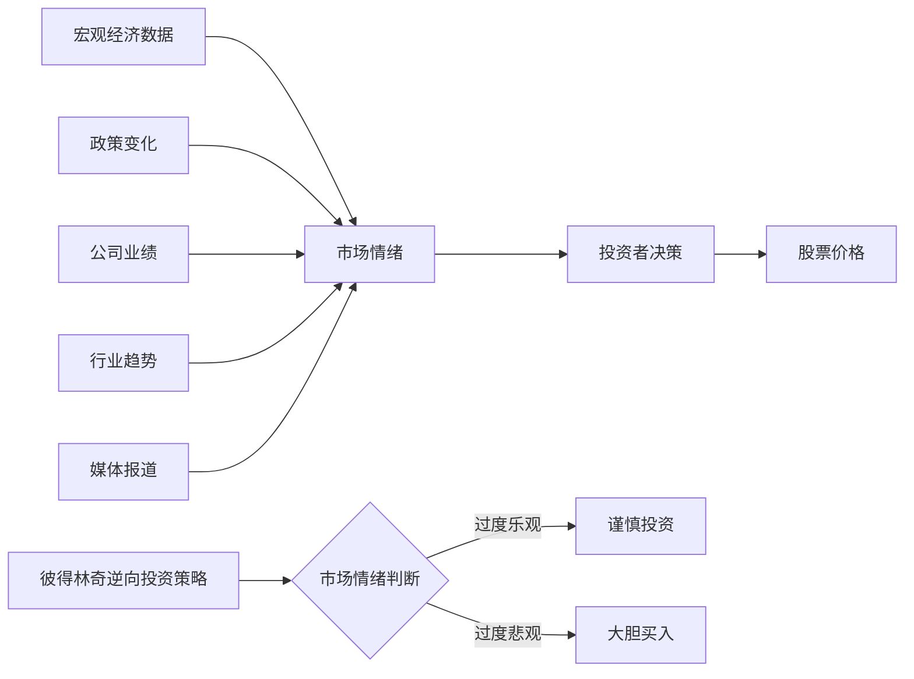

# 彼得林奇的"市场情绪"利用技巧

> 关键词：彼得林奇、市场情绪、投资技巧、股票市场、情绪分析、逆向投资、价值发现

> 摘要：本文深入探讨了彼得林奇利用市场情绪的投资技巧。彼得林奇作为投资界的传奇人物，其对市场情绪的把握和运用堪称一绝。通过对市场情绪的分析和判断，他能够发现被市场错误定价的股票，从而获得丰厚的投资回报。文章详细介绍了市场情绪的相关概念、彼得林奇利用市场情绪的具体方法和策略，结合数学模型和实际案例进行深入剖析，同时探讨了其在不同实际应用场景中的表现，还推荐了相关的学习资源、开发工具以及论文著作等。最后对利用市场情绪进行投资的未来发展趋势与挑战进行总结，并给出常见问题的解答和参考资料，旨在为投资者提供全面且深入的投资思路和方法。

## 1. 背景介绍 
### 1.1 目的和范围
本文的目的在于全面解析彼得林奇利用市场情绪的投资技巧，深入探究其背后的原理和策略，为投资者提供可借鉴的投资方法。范围涵盖市场情绪的基本概念、彼得林奇的投资策略、相关数学模型、实际应用案例以及未来发展趋势等多个方面，旨在为读者呈现一个系统、完整的关于利用市场情绪进行投资的知识体系。

### 1.2 预期读者
本文预期读者主要包括股票投资者、金融从业者、对投资理论和实践感兴趣的学者以及希望学习投资技巧的普通大众。无论您是初涉投资领域的新手，还是经验丰富的专业投资者，都能从本文中获得有价值的信息和启示。

### 1.3 文档结构概述
本文将按照以下结构展开：首先介绍市场情绪的核心概念及其与投资的联系；接着阐述彼得林奇利用市场情绪的核心算法原理和具体操作步骤；然后给出相关的数学模型和公式，并进行详细讲解和举例说明；再通过项目实战展示代码实际案例并进行详细解释；之后探讨实际应用场景；推荐相关的工具和资源；总结未来发展趋势与挑战；最后提供常见问题解答和参考资料。

### 1.4 术语表
#### 1.4.1 核心术语定义
- **市场情绪**：指投资者对市场的整体心理状态和预期，包括乐观、悲观、恐惧、贪婪等情绪，这些情绪会影响投资者的决策和市场的走势。
- **逆向投资**：与市场主流趋势相反的投资策略，当市场情绪过度乐观或悲观时，逆向投资者会采取相反的操作，以寻找被低估或高估的投资机会。
- **价值发现**：通过对公司基本面、行业趋势等因素的分析，发现被市场低估的股票的内在价值。

#### 1.4.2 相关概念解释
- **羊群效应**：在投资市场中，投资者往往会受到群体行为的影响，跟随大多数人的决策进行投资，导致市场情绪的过度波动。
- **有效市场假说**：认为市场价格已经反映了所有可用的信息，投资者无法通过分析市场情绪等因素获得超额收益。然而，彼得林奇的投资实践表明，市场并非完全有效，情绪因素会导致市场定价的偏差。

#### 1.4.3 缩略词列表
- **PE**：市盈率（Price - Earnings Ratio），指股票价格与每股收益的比率，用于衡量股票的估值水平。
- **PB**：市净率（Price - Book Ratio），指股票价格与每股净资产的比率，反映了股票的相对估值。

## 2. 核心概念与联系 
### 市场情绪的本质
市场情绪是投资者对市场未来走势的一种主观判断和心理预期，它受到多种因素的影响，包括宏观经济数据、政策变化、公司业绩、行业趋势以及媒体报道等。市场情绪可以分为乐观情绪和悲观情绪，当投资者普遍乐观时，市场往往上涨；当投资者普遍悲观时，市场往往下跌。

### 市场情绪与投资决策的联系
市场情绪对投资决策有着重要的影响。在乐观情绪下，投资者往往会高估股票的价值，愿意以较高的价格买入股票；而在悲观情绪下，投资者则会低估股票的价值，甚至恐慌性抛售股票。彼得林奇认为，市场情绪的过度波动会导致股票价格偏离其内在价值，从而为投资者提供了投资机会。

### 彼得林奇的逆向投资策略与市场情绪
彼得林奇是逆向投资的倡导者之一。他认为，当市场情绪过度乐观时，股票价格往往被高估，此时应该谨慎投资；而当市场情绪过度悲观时，股票价格往往被低估，此时应该大胆买入。通过逆向投资，彼得林奇能够在市场情绪的波动中发现被低估的股票，从而获得超额收益。

### 文本示意图
市场情绪受到多种因素的影响，包括宏观经济、政策、公司业绩等。这些因素通过投资者的心理和行为传导到市场，形成市场的整体情绪。市场情绪又会影响投资者的决策，进而影响股票价格。彼得林奇的逆向投资策略就是在市场情绪过度波动时，寻找被低估或高估的股票，进行反向操作。

### Mermaid 流程图


## 3. 核心算法原理 & 具体操作步骤 
### 市场情绪分析的核心算法原理
市场情绪分析的核心在于通过对各种市场数据和信息的分析，判断投资者的心理状态和预期。一种常见的方法是通过分析投资者的交易行为、资金流向、媒体报道等数据，构建市场情绪指标。以下是一个简单的市场情绪指标计算的 Python 示例：

```python
import pandas as pd
import numpy as np

# 假设我们有每日的股票成交量和收盘价数据
# 读取数据
data = pd.read_csv('stock_data.csv')

# 计算成交量的变化率
data['volume_change'] = data['volume'].pct_change()

# 计算收盘价的变化率
data['price_change'] = data['close'].pct_change()

# 定义市场情绪指标
# 当成交量增加且价格上涨时，市场情绪为乐观；当成交量减少且价格下跌时，市场情绪为悲观
data['sentiment'] = np.where((data['volume_change'] > 0) & (data['price_change'] > 0), 1,
                             np.where((data['volume_change'] < 0) & (data['price_change'] < 0), -1, 0))

print(data)
```

### 具体操作步骤
1. **数据收集**：收集与市场情绪相关的数据，包括股票价格、成交量、资金流向、媒体报道等。
2. **数据预处理**：对收集到的数据进行清洗、整理和转换，以便后续分析。
3. **指标计算**：根据市场情绪分析的算法，计算市场情绪指标。
4. **情绪判断**：根据市场情绪指标的数值，判断市场情绪是乐观、悲观还是中性。
5. **投资决策**：根据市场情绪的判断结果，结合彼得林奇的逆向投资策略，做出投资决策。

## 4. 数学模型和公式 & 详细讲解 & 举例说明 
### 市场情绪指标的数学模型
假设我们用 $V_t$ 表示第 $t$ 日的成交量，$P_t$ 表示第 $t$ 日的收盘价，则成交量的变化率 $r_{V_t}$ 和收盘价的变化率 $r_{P_t}$ 可以表示为：

$$r_{V_t}=\frac{V_t - V_{t - 1}}{V_{t - 1}}$$

$$r_{P_t}=\frac{P_t - P_{t - 1}}{P_{t - 1}}$$

市场情绪指标 $S_t$ 可以定义为：

$$S_t=\begin{cases}
1, & r_{V_t}>0 \text{ 且 } r_{P_t}>0 \\
-1, & r_{V_t}<0 \text{ 且 } r_{P_t}<0 \\
0, & \text{其他情况}
\end{cases}$$

### 详细讲解
上述数学模型通过成交量和收盘价的变化率来判断市场情绪。当成交量和收盘价同时上涨时，市场情绪为乐观，指标值为 1；当成交量和收盘价同时下跌时，市场情绪为悲观，指标值为 -1；其他情况市场情绪为中性，指标值为 0。

### 举例说明
假设某股票前一日的成交量为 1000 万股，收盘价为 10 元；当日的成交量为 1200 万股，收盘价为 11 元。则成交量的变化率为：

$$r_{V_t}=\frac{1200 - 1000}{1000}=0.2$$

收盘价的变化率为：

$$r_{P_t}=\frac{11 - 10}{10}=0.1$$

由于 $r_{V_t}>0$ 且 $r_{P_t}>0$，所以市场情绪指标 $S_t = 1$，表示市场情绪为乐观。

## 5. 项目实战：代码实际案例和详细解释说明 
### 5.1  开发环境搭建
- **Python 环境**：安装 Python 3.x 版本，可以从 Python 官方网站（https://www.python.org/downloads/）下载安装包进行安装。
- **开发工具**：推荐使用 PyCharm 作为开发工具，它是一款功能强大的 Python 集成开发环境（IDE），可以从 JetBrains 官方网站（https://www.jetbrains.com/pycharm/）下载安装。
- **必要的库**：安装 pandas、numpy 等库，可以使用 pip 命令进行安装：
```sh
pip install pandas numpy
```

### 5.2  源代码详细实现和代码解读
```python
import pandas as pd
import numpy as np

# 读取股票数据
def read_stock_data(file_path):
    data = pd.read_csv(file_path)
    return data

# 计算市场情绪指标
def calculate_sentiment(data):
    data['volume_change'] = data['volume'].pct_change()
    data['price_change'] = data['close'].pct_change()
    data['sentiment'] = np.where((data['volume_change'] > 0) & (data['price_change'] > 0), 1,
                                 np.where((data['volume_change'] < 0) & (data['price_change'] < 0), -1, 0))
    return data

# 主函数
def main():
    file_path = 'stock_data.csv'
    data = read_stock_data(file_path)
    data_with_sentiment = calculate_sentiment(data)
    print(data_with_sentiment)

if __name__ == '__main__':
    main()
```

### 代码解读与分析
1. **read_stock_data 函数**：该函数用于读取股票数据文件，使用 pandas 的 `read_csv` 函数将 CSV 文件中的数据读取到 DataFrame 中。
2. **calculate_sentiment 函数**：该函数用于计算市场情绪指标。首先计算成交量和收盘价的变化率，然后根据变化率的情况使用 `np.where` 函数计算市场情绪指标。
3. **main 函数**：主函数调用 `read_stock_data` 和 `calculate_sentiment` 函数，读取数据并计算市场情绪指标，最后打印结果。

## 6. 实际应用场景 
### 股票投资
在股票投资中，投资者可以利用市场情绪指标来判断市场的整体情绪，从而做出投资决策。当市场情绪过度悲观时，股票价格往往被低估，此时可以寻找被低估的优质股票进行买入；当市场情绪过度乐观时，股票价格往往被高估，此时可以考虑卖出股票或减少持仓。

### 基金投资
基金投资者也可以参考市场情绪指标来选择投资时机。当市场情绪悲观时，可以选择一些优质的基金进行定投；当市场情绪乐观时，可以适当减少基金投资的比例。

### 风险管理
市场情绪指标还可以用于风险管理。当市场情绪波动较大时，投资者可以适当降低仓位，以减少市场波动带来的风险。

## 7. 工具和资源推荐
### 7.1 学习资源推荐
#### 7.1.1 书籍推荐
- 《彼得林奇的成功投资》：彼得林奇的经典著作，详细介绍了他的投资理念和方法，包括如何利用市场情绪进行投资。
- 《聪明的投资者》：本杰明·格雷厄姆的著作，是价值投资的经典之作，对市场情绪和投资决策的关系有深入的探讨。
- 《金融炼金术》：乔治·索罗斯的著作，介绍了他的反身性理论，对理解市场情绪和市场波动有很大的帮助。

#### 7.1.2 在线课程
- Coursera 上的《投资学原理》：该课程由知名高校的教授授课，系统地介绍了投资学的基本原理和方法，包括市场情绪分析。
- edX 上的《金融市场与投资》：课程内容涵盖金融市场的各个方面，对市场情绪对投资的影响有详细的讲解。

#### 7.1.3 技术博客和网站
- 雪球网：国内知名的投资交流社区，有很多投资者分享自己的投资经验和对市场情绪的分析。
- 金融界网站：提供丰富的金融资讯和市场分析，对市场情绪的动态有及时的报道。

### 7.2 开发工具框架推荐
#### 7.2.1 IDE和编辑器
- PyCharm：功能强大的 Python 集成开发环境，适合开发和调试与市场情绪分析相关的 Python 代码。
- Jupyter Notebook：交互式的开发环境，适合进行数据探索和分析，方便展示市场情绪分析的过程和结果。

#### 7.2.2 调试和性能分析工具
- PDB：Python 自带的调试工具，可以帮助开发者定位代码中的问题。
- cProfile：Python 的性能分析工具，可以分析代码的运行时间和资源占用情况，优化市场情绪分析代码的性能。

#### 7.2.3 相关框架和库
- pandas：用于数据处理和分析的 Python 库，在市场情绪分析中可以用于读取、清洗和处理股票数据。
- numpy：提供高效的数值计算功能，在计算市场情绪指标时可以提高计算效率。
- scikit - learn：机器学习库，可以用于构建更复杂的市场情绪分析模型。

### 7.3 相关论文著作推荐
#### 7.3.1 经典论文
- De Long, J. B., Shleifer, A., Summers, L. H., & Waldmann, R. J. (1990). Noise trader risk in financial markets. The Journal of Political Economy, 98(4), 703 - 738. 该论文探讨了噪声交易者对金融市场的影响，与市场情绪的研究密切相关。
- Barberis, N., Shleifer, A., & Vishny, R. (1998). A model of investor sentiment. Journal of Financial Economics, 49(3), 307 - 343. 提出了投资者情绪的模型，对理解市场情绪的形成和影响有重要意义。

#### 7.3.2 最新研究成果
可以关注《Journal of Financial Economics》《The Review of Financial Studies》等金融领域的顶级期刊，了解关于市场情绪和投资的最新研究成果。

#### 7.3.3 应用案例分析
一些金融研究机构和咨询公司会发布关于市场情绪分析和投资应用的案例报告，可以通过相关机构的官方网站或专业数据库获取。

## 8. 总结：未来发展趋势与挑战
### 未来发展趋势
- **智能化分析**：随着人工智能和机器学习技术的不断发展，未来市场情绪分析将更加智能化。可以利用深度学习算法对大量的文本数据（如新闻报道、社交媒体评论等）进行分析，更准确地判断市场情绪。
- **多维度融合**：市场情绪分析将不仅仅局限于股票市场，还会与宏观经济数据、行业数据等多维度信息进行融合，提供更全面的投资决策依据。
- **个性化服务**：根据投资者的风险偏好、投资目标等个性化信息，提供定制化的市场情绪分析和投资建议。

### 挑战
- **数据质量和准确性**：市场情绪分析依赖于大量的数据，数据的质量和准确性直接影响分析结果的可靠性。如何获取高质量、准确的数据是一个挑战。
- **情绪的复杂性**：市场情绪是复杂多变的，受到多种因素的影响，很难用简单的模型和指标来准确描述和预测。
- **监管和合规**：在利用市场情绪进行投资时，需要遵守相关的法律法规和监管要求，如何在合规的前提下进行有效的市场情绪分析和投资是一个需要解决的问题。

## 9. 附录：常见问题与解答
### 问题 1：市场情绪指标一定准确吗？
解答：市场情绪指标是基于一定的算法和数据计算出来的，虽然可以在一定程度上反映市场情绪，但并不是绝对准确的。市场情绪受到多种因素的影响，而且情绪本身是复杂多变的，所以市场情绪指标只能作为投资决策的参考，不能完全依赖。

### 问题 2：如何判断市场情绪是过度乐观还是过度悲观？
解答：可以通过与历史数据进行对比，观察市场情绪指标的数值是否偏离正常范围。此外，还可以结合宏观经济数据、公司业绩等基本面信息进行综合判断。

### 问题 3：逆向投资策略一定能成功吗？
解答：逆向投资策略并不是一定能成功的。逆向投资需要投资者有深入的研究和分析能力，能够准确判断股票的内在价值。如果判断失误，逆向投资可能会导致损失。

## 10. 扩展阅读 & 参考资料
### 扩展阅读
- 《投资最重要的事》：霍华德·马克斯的著作，对投资中的风险、市场情绪等问题有深刻的见解。
- 《非理性繁荣》：罗伯特·席勒的著作，探讨了金融市场中的非理性行为和市场泡沫的形成。

### 参考资料
- 彼得林奇相关的官方网站和采访资料。
- 金融市场的历史数据和研究报告。
- 相关的学术期刊和会议论文。