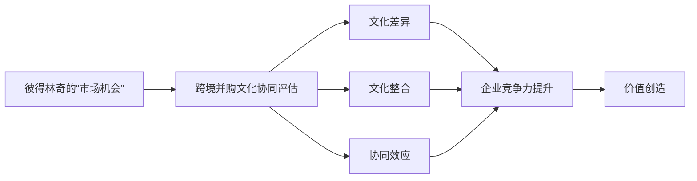

# 彼得林奇的"市场机会"在跨境并购中的文化协同评估模型

> 关键词：彼得林奇；市场机会；跨境并购；文化协同；评估模型

> 摘要：本文旨在探讨彼得林奇的“市场机会”理念在跨境并购文化协同评估中的应用。通过对相关理论和概念的阐述，构建出基于此理念的文化协同评估模型。详细分析模型的核心算法原理、数学模型及公式，并结合实际项目案例进行深入解读。同时探讨该模型在实际应用场景中的作用，推荐相关的学习资源、开发工具框架以及论文著作。最后总结其未来发展趋势与挑战，解答常见问题并提供扩展阅读与参考资料，以期为跨境并购中的文化协同评估提供新的思路和方法。

## 1. 背景介绍 
### 1.1 目的和范围
跨境并购作为企业实现国际化战略的重要手段，近年来呈现出日益增长的趋势。然而，跨境并购过程中面临着诸多挑战，其中文化差异带来的文化冲突是导致并购失败的重要原因之一。因此，准确评估跨境并购中的文化协同程度对于并购的成功至关重要。本文的目的在于引入彼得林奇的“市场机会”理念，构建一种新的跨境并购文化协同评估模型，为企业在跨境并购决策和实施过程中提供科学的评估方法和决策依据。本文的范围涵盖了跨境并购文化协同评估的理论基础、模型构建、算法原理、实际应用等多个方面。

### 1.2 预期读者
本文预期读者包括企业战略规划人员、并购决策人员、投资银行家、管理咨询顾问、学术研究人员以及对跨境并购和文化协同评估感兴趣的相关人士。

### 1.3 文档结构概述
本文首先介绍背景信息，包括目的、预期读者和文档结构概述等内容。接着阐述核心概念与联系，包括彼得林奇的“市场机会”理念、跨境并购、文化协同等概念及其相互关系，并通过文本示意图和 Mermaid 流程图进行展示。然后详细讲解核心算法原理和具体操作步骤，使用 Python 源代码进行阐述。之后介绍数学模型和公式，并结合举例说明。再通过项目实战，包括开发环境搭建、源代码详细实现和代码解读等内容，深入分析该模型的实际应用。随后探讨实际应用场景，推荐相关的工具和资源。最后总结未来发展趋势与挑战，解答常见问题并提供扩展阅读与参考资料。

### 1.4 术语表
#### 1.4.1 核心术语定义
- **彼得林奇的“市场机会”**：彼得林奇是著名的投资大师，他认为市场中存在着各种未被发现的机会，投资者需要通过深入研究和分析来识别这些机会。在本文中，“市场机会”被引申为跨境并购中文化协同所带来的潜在价值和发展机遇。
- **跨境并购**：指一个国家的企业通过购买另一个国家企业的股权或资产，从而获得对该企业的控制权或参与其经营管理的行为。
- **文化协同**：指在跨境并购中，并购双方的文化相互融合、相互促进，实现文化资源的优化配置，从而提升企业的整体竞争力和绩效。
- **评估模型**：是一种用于评估特定对象或现象的工具和方法，通过建立一系列的指标和算法，对评估对象进行量化分析和综合评价。

#### 1.4.2 相关概念解释
- **文化差异**：指不同国家、地区、民族之间在价值观、信仰、习俗、行为方式等方面存在的差异。文化差异是跨境并购中文化冲突的根源。
- **文化整合**：是指在跨境并购后，通过采取一系列措施，促进并购双方文化的相互理解、相互尊重和相互融合，形成一种新的、具有凝聚力的企业文化的过程。
- **协同效应**：指企业通过并购实现资源共享、优势互补，从而产生的大于单个企业效益之和的经济效益和社会效益。文化协同是协同效应的重要组成部分。

#### 1.4.3 缩略词列表
- **M&A**：Merger & Acquisition，并购
- **CIA**：Cross - Cultural Integration Assessment，跨文化整合评估

## 2. 核心概念与联系 

### 核心概念原理
彼得林奇的“市场机会”理念强调对市场中潜在机会的敏锐洞察力和深入挖掘。在跨境并购的背景下，文化协同所蕴含的市场机会在于通过整合不同文化背景下的企业资源，实现创新和价值创造。

跨境并购是企业跨越国界进行资源配置和扩张的战略行为。文化差异在跨境并购中既可能成为障碍，也可能成为创造价值的源泉。如果能够实现文化协同，就可以充分发挥不同文化的优势，提高企业的竞争力。

文化协同的原理在于通过识别和整合并购双方文化的差异，促进文化的交流与融合，形成一种新的、适应企业发展的文化氛围。这种文化协同可以体现在企业的战略、组织、管理、员工行为等多个层面。

### 文本示意图
```plaintext
彼得林奇的“市场机会”
        |
        |  延伸应用
        V
跨境并购文化协同评估
        |
        |  包含要素
        V
文化差异、文化整合、协同效应
        |
        |  相互作用
        V
企业竞争力提升、价值创造
```

### Mermaid 流程图


## 3. 核心算法原理 & 具体操作步骤 

### 核心算法原理
我们的文化协同评估模型基于多指标综合评价的思想。首先，确定影响文化协同的多个指标，然后为每个指标赋予相应的权重，最后通过加权求和的方式计算出文化协同的综合得分。

以下是使用 Python 实现的核心算法代码：
```python
import numpy as np

# 定义指标列表
indicators = ["价值观一致性", "管理风格兼容性", "员工行为协调性", "组织架构适应性"]

# 定义每个指标的权重
weights = np.array([0.3, 0.25, 0.2, 0.25])

# 假设有两个企业 A 和 B，对每个指标进行打分（0 - 10 分）
scores_A_B = np.array([[7, 6, 8, 7], [6, 7, 7, 8]])

def calculate_cultural_synergy_score(scores, weights):
    """
    计算文化协同得分
    :param scores: 指标得分矩阵，每一行代表一个企业的得分
    :param weights: 指标权重向量
    :return: 文化协同得分
    """
    # 计算每个企业的加权得分
    weighted_scores = scores * weights
    # 计算综合得分
    synergy_scores = np.sum(weighted_scores, axis=1)
    return synergy_scores

# 计算文化协同得分
synergy_scores = calculate_cultural_synergy_score(scores_A_B, weights)
print("企业 A 和 B 的文化协同得分分别为:", synergy_scores)
```

### 具体操作步骤
1. **指标确定**：通过文献研究、专家访谈和案例分析等方法，确定影响文化协同的关键指标。这些指标可以包括价值观、管理风格、员工行为、组织架构等方面。
2. **权重赋值**：根据指标的重要性程度，为每个指标赋予相应的权重。权重的确定可以采用层次分析法（AHP）、德尔菲法等方法。
3. **数据收集**：通过问卷调查、访谈、实地观察等方式，收集并购双方在各个指标上的得分数据。
4. **得分计算**：使用上述 Python 代码中的算法，计算并购双方的文化协同得分。
5. **结果分析**：根据计算得到的文化协同得分，对并购双方的文化协同程度进行评估和分析。得分越高，说明文化协同程度越好。

## 4. 数学模型和公式 & 详细讲解 & 举例说明 

### 数学模型和公式
设共有 $n$ 个影响文化协同的指标，分别为 $x_1, x_2, \cdots, x_n$，对应的权重为 $w_1, w_2, \cdots, w_n$，且 $\sum_{i = 1}^{n} w_i = 1$。对于并购双方中的一方，其在第 $i$ 个指标上的得分记为 $s_i$。则该方的文化协同得分 $S$ 可以通过以下公式计算：

$$S=\sum_{i = 1}^{n} w_i s_i$$

### 详细讲解
这个公式的原理是将每个指标的得分乘以其对应的权重，然后将所有乘积相加，得到综合得分。权重的作用是体现每个指标在文化协同评估中的重要性程度。例如，如果某个指标的权重较大，那么该指标的得分对综合得分的影响就较大。

### 举例说明
假设我们有三个指标：价值观一致性（权重 $w_1 = 0.4$）、管理风格兼容性（权重 $w_2 = 0.3$）、员工行为协调性（权重 $w_3 = 0.3$）。企业 A 在这三个指标上的得分分别为 $s_1 = 8$，$s_2 = 7$，$s_3 = 6$。则企业 A 的文化协同得分 $S$ 为：

$$S=w_1 s_1 + w_2 s_2 + w_3 s_3=0.4\times8 + 0.3\times7 + 0.3\times6$$
$$S = 3.2+2.1 + 1.8=7.1$$

这表明企业 A 的文化协同程度相对较好。

## 5. 项目实战：代码实际案例和详细解释说明 

### 5.1  开发环境搭建
1. **安装 Python**：从 Python 官方网站（https://www.python.org/downloads/）下载并安装最新版本的 Python。建议安装 Python 3.7 及以上版本。
2. **安装必要的库**：本项目主要使用了 `numpy` 库，用于数值计算。可以使用以下命令安装：
```sh
pip install numpy
```
3. **选择开发工具**：可以选择 PyCharm、VS Code 等集成开发环境（IDE）或文本编辑器进行代码开发。

### 5.2  源代码详细实现和代码解读
以下是一个完整的项目实战代码示例，包含数据输入、得分计算和结果输出等功能：
```python
import numpy as np

# 定义指标列表
indicators = ["价值观一致性", "管理风格兼容性", "员工行为协调性", "组织架构适应性"]

# 定义每个指标的权重
weights = np.array([0.3, 0.25, 0.2, 0.25])

def input_scores():
    """
    输入并购双方在各个指标上的得分
    :return: 得分矩阵
    """
    num_enterprises = 2
    num_indicators = len(indicators)
    scores = np.zeros((num_enterprises, num_indicators))

    for i in range(num_enterprises):
        print(f"请输入企业 {i + 1} 的得分：")
        for j in range(num_indicators):
            while True:
                try:
                    score = float(input(f"{indicators[j]} 得分（0 - 10 分）："))
                    if 0 <= score <= 10:
                        scores[i, j] = score
                        break
                    else:
                        print("得分必须在 0 - 10 分之间，请重新输入。")
                except ValueError:
                    print("输入无效，请输入一个有效的数字。")
    return scores

def calculate_cultural_synergy_score(scores, weights):
    """
    计算文化协同得分
    :param scores: 指标得分矩阵，每一行代表一个企业的得分
    :param weights: 指标权重向量
    :return: 文化协同得分
    """
    # 计算每个企业的加权得分
    weighted_scores = scores * weights
    # 计算综合得分
    synergy_scores = np.sum(weighted_scores, axis=1)
    return synergy_scores

def main():
    # 输入得分
    scores = input_scores()
    # 计算文化协同得分
    synergy_scores = calculate_cultural_synergy_score(scores, weights)
    # 输出结果
    for i in range(len(synergy_scores)):
        print(f"企业 {i + 1} 的文化协同得分：{synergy_scores[i]}")

if __name__ == "__main__":
    main()
```

### 代码解读与分析
1. **`input_scores` 函数**：该函数用于获取用户输入的并购双方在各个指标上的得分。通过循环和条件判断，确保用户输入的得分在 0 - 10 分之间。
2. **`calculate_cultural_synergy_score` 函数**：该函数实现了文化协同得分的计算算法，通过将得分矩阵与权重向量相乘并求和，得到每个企业的文化协同得分。
3. **`main` 函数**：该函数是程序的入口点，调用 `input_scores` 函数获取得分，调用 `calculate_cultural_synergy_score` 函数计算得分，并输出结果。

## 6. 实际应用场景 
### 并购决策阶段
在跨境并购决策阶段，企业可以使用该评估模型对潜在的并购目标进行文化协同评估。通过比较不同并购目标的文化协同得分，企业可以选择文化协同程度较高的目标，降低并购后的文化冲突风险，提高并购成功的概率。

### 并购整合阶段
在并购整合阶段，该评估模型可以帮助企业及时发现文化协同方面存在的问题。根据评估结果，企业可以制定针对性的文化整合策略，促进并购双方文化的融合，实现文化协同效应。

### 企业战略规划阶段
企业在制定国际化战略规划时，可以利用该评估模型评估自身与不同国家、地区企业的文化协同潜力。这有助于企业选择合适的国际化路径和合作伙伴，提高企业的国际竞争力。

## 7. 工具和资源推荐
### 7.1 学习资源推荐
#### 7.1.1 书籍推荐
- 《彼得林奇的成功投资》：彼得林奇的经典著作，详细介绍了他的投资理念和方法，对于理解“市场机会”的概念有很大帮助。
- 《跨国公司文化管理》：系统阐述了跨国公司在文化管理方面的理论和实践，对于跨境并购中的文化协同问题有深入的探讨。
- 《文化与组织：心理软件的力量》：从文化心理学的角度分析了不同文化背景下的组织行为和管理模式，为文化协同评估提供了理论基础。

#### 7.1.2 在线课程
- Coursera 上的“Global Business Management”：该课程涵盖了全球商务管理的各个方面，包括跨境并购和文化管理等内容。
- edX 上的“Cross - Cultural Management”：专门介绍跨文化管理的理论和实践，有助于提高对文化差异和文化协同的认识。

#### 7.1.3 技术博客和网站
- Harvard Business Review（哈佛商业评论）：提供了大量关于企业战略、并购、文化管理等方面的前沿研究和实践案例。
- McKinsey & Company（麦肯锡公司）官网：发布了许多关于全球商业趋势和企业管理的研究报告，对于跨境并购和文化协同有深入的分析。

### 7.2 开发工具框架推荐
#### 7.2.1 IDE和编辑器
- PyCharm：功能强大的 Python 集成开发环境，提供了代码编辑、调试、版本控制等一系列功能，适合开发复杂的 Python 项目。
- VS Code：轻量级的代码编辑器，支持多种编程语言和插件扩展，对于快速开发和调试 Python 代码非常方便。

#### 7.2.2 调试和性能分析工具
- pdb：Python 内置的调试器，可以帮助开发者逐行调试代码，查找和解决程序中的错误。
- cProfile：Python 标准库中的性能分析工具，可以分析程序的运行时间和函数调用情况，帮助开发者优化代码性能。

#### 7.2.3 相关框架和库
- numpy：用于科学计算的 Python 库，提供了高效的数组操作和数学函数，在文化协同评估模型的开发中可以用于数据处理和计算。
- pandas：用于数据处理和分析的 Python 库，提供了灵活的数据结构和数据操作方法，有助于对文化协同评估数据进行整理和分析。

### 7.3 相关论文著作推荐
#### 7.3.1 经典论文
- Barkema, H. G., & Vermeulen, F. (1998). International expansion through start - up or acquisition: A learning perspective. Academy of Management Journal, 41(1), 7–26. 该论文从学习的角度探讨了企业国际化扩张中选择新建或并购的决策因素，对于理解跨境并购有重要的参考价值。
- Hofstede, G. (1980). Culture's consequences: International differences in work - related values. Sage publications. 霍夫斯泰德的经典著作，提出了文化维度理论，为跨文化研究提供了重要的理论框架。

#### 7.3.2 最新研究成果
- Shenkar, O., Luo, Y., & Yeheskel, O. (2020). The handbook of global strategic management. Cambridge University Press. 该手册涵盖了全球战略管理的最新研究成果，包括跨境并购、文化协同等方面的内容。
- Stahl, G. K., & Voigt, A. (2008). Cultural differences in mergers and acquisitions: A review of the literature. Journal of International Management, 14(4), 306–326. 对跨境并购中文化差异的相关研究进行了综述，有助于了解该领域的最新研究动态。

#### 7.3.3 应用案例分析
- 联想并购 IBM PC 业务案例：详细分析了联想在并购 IBM PC 业务过程中面临的文化差异和文化整合问题，以及采取的文化协同策略和取得的成效。
- 吉利并购沃尔沃案例：探讨了吉利在并购沃尔沃过程中如何实现文化协同，提升企业的国际竞争力。

## 8. 总结：未来发展趋势与挑战
### 未来发展趋势
1. **智能化评估**：随着人工智能和大数据技术的发展，跨境并购文化协同评估模型将越来越智能化。通过利用自然语言处理、机器学习等技术，可以实现对文化数据的自动收集、分析和评估，提高评估的准确性和效率。
2. **跨学科融合**：文化协同评估将不再局限于管理学和心理学领域，而是与社会学、人类学、经济学等多个学科进行深度融合。通过跨学科的研究和方法，可以更全面、深入地理解文化差异和文化协同的本质。
3. **全球化视角**：随着全球经济一体化的不断推进，跨境并购的规模和范围将不断扩大。文化协同评估模型将更加注重全球化视角，考虑不同国家、地区和文化背景下的差异和共性，为企业的跨国经营提供更具针对性的建议。

### 挑战
1. **文化数据的获取和分析**：文化数据具有主观性、复杂性和多样性的特点，如何准确地获取和分析文化数据是文化协同评估面临的一大挑战。需要开发更加科学、有效的数据收集和分析方法。
2. **文化差异的动态变化**：文化是不断发展和变化的，跨境并购过程中双方的文化也会随着时间的推移而发生变化。如何及时、准确地捕捉文化差异的动态变化，并调整文化协同策略，是需要解决的问题。
3. **模型的通用性和适应性**：不同行业、不同企业的文化特点和并购需求各不相同，如何开发出具有通用性和适应性的文化协同评估模型，满足不同企业的需求，是一个挑战。

## 9. 附录：常见问题与解答
### 1. 如何确定指标的权重？
指标权重的确定可以采用多种方法，如层次分析法（AHP）、德尔菲法等。层次分析法通过构建判断矩阵，比较指标之间的相对重要性，从而确定权重。德尔菲法通过专家咨询和多轮反馈，综合专家意见确定权重。

### 2. 文化协同得分的范围是多少？
文化协同得分的范围取决于指标得分的范围和权重的设置。在本模型中，指标得分范围为 0 - 10 分，文化协同得分理论上也在 0 - 10 分之间。得分越高，说明文化协同程度越好。

### 3. 该评估模型适用于所有跨境并购案例吗？
该评估模型具有一定的通用性，但不同行业、不同企业的文化特点和并购需求各不相同。在实际应用中，需要根据具体情况对指标和权重进行调整和优化，以提高模型的适应性和准确性。

### 4. 如何根据文化协同评估结果制定文化整合策略？
如果文化协同得分较高，说明并购双方的文化差异较小，可以采取较为温和的文化整合策略，如文化融合、文化创新等。如果文化协同得分较低，说明文化差异较大，需要采取更加激进的文化整合策略，如文化同化、文化隔离等。同时，还需要根据企业的战略目标、组织架构、员工特点等因素综合考虑。

## 10. 扩展阅读 & 参考资料
### 扩展阅读
- 关于文化人类学的相关书籍，如《文化模式》《菊与刀》等，可以深入了解不同文化的特点和差异。
- 关于企业战略管理的前沿研究论文，了解企业在全球化背景下的战略选择和文化协同的最新趋势。

### 参考资料
- 本文中引用的所有书籍、论文、网站等资料均作为参考资料，具体信息在文中相应位置已注明。同时，还可以查阅相关的学术数据库、行业报告等获取更多的参考资料。