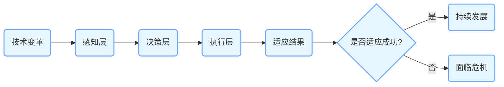

# 彼得林奇的"行业领导者"在技术变革中的适应能力评估

> 关键词：彼得林奇、行业领导者、技术变革、适应能力评估、企业竞争力

> 摘要：本文旨在深入探讨彼得林奇所定义的“行业领导者”在技术变革浪潮中的适应能力。通过对相关概念的阐述、核心算法与数学模型的分析、项目实战案例的研究，以及实际应用场景的探讨等多个方面，全面评估行业领导者在技术变革中面临的挑战与机遇，为企业在快速变化的技术环境中提升适应能力提供理论依据和实践指导。同时，文章还推荐了相关的学习资源、开发工具和论文著作，最后对行业领导者未来的发展趋势与挑战进行总结，并解答常见问题，为读者提供丰富且有价值的参考内容。

## 1. 背景介绍 
### 1.1 目的和范围
在当今快速发展的时代，技术变革的速度不断加快，对各个行业都产生了深远的影响。彼得林奇作为投资领域的传奇人物，其提出的“行业领导者”概念在投资分析和企业研究中具有重要意义。本研究的目的在于评估这些行业领导者在技术变革中的适应能力，范围涵盖不同行业的龙头企业，分析它们在面对新技术冲击时的战略调整、业务转型以及创新能力等方面的表现。

### 1.2 预期读者
本文预期读者包括企业管理者、投资者、研究机构人员以及对技术变革和企业发展感兴趣的人士。对于企业管理者而言，可从本文中获取提升企业适应能力的策略和方法；投资者能据此评估投资对象在技术变革中的潜力；研究机构人员可将其作为进一步研究的参考；普通读者则能加深对行业发展和企业竞争的理解。

### 1.3 文档结构概述
本文首先介绍相关背景和概念，接着阐述核心概念与联系，包括原理和架构示意图及流程图；然后详细讲解核心算法原理和具体操作步骤，并用 Python 代码进行说明；随后介绍数学模型和公式，并举例说明；通过项目实战案例，展示代码实现和解读；探讨实际应用场景；推荐学习资源、开发工具和相关论文著作；总结未来发展趋势与挑战；解答常见问题；最后提供扩展阅读和参考资料。

### 1.4 术语表
#### 1.4.1 核心术语定义
- **彼得林奇的“行业领导者”**：指在某个行业中占据主导地位，具有强大的市场份额、品牌影响力、技术实力和管理能力的企业。
- **技术变革**：指由于科学技术的进步和创新，导致的生产方式、产品形态、市场需求等方面的重大变化。
- **适应能力**：指企业在面对技术变革时，能够及时调整战略、业务模式和组织架构，以保持竞争力和持续发展的能力。

#### 1.4.2 相关概念解释
- **企业竞争力**：企业在市场竞争中所具备的优势和能力，包括产品质量、成本控制、创新能力、市场营销等多个方面。
- **战略调整**：企业根据外部环境的变化，对自身的发展战略进行调整和优化，以适应新的市场需求和竞争态势。
- **业务转型**：企业从原有的业务领域向新的业务领域拓展或转变，以实现业务的多元化和升级。

#### 1.4.3 缩略词列表
- **AI**：人工智能（Artificial Intelligence）
- **IoT**：物联网（Internet of Things）
- **VR**：虚拟现实（Virtual Reality）
- **AR**：增强现实（Augmented Reality）

## 2. 核心概念与联系 
### 核心概念原理
彼得林奇的“行业领导者”通常具有规模经济、品牌优势、技术积累等特点，这些优势使其在行业中占据领先地位。然而，技术变革的出现可能打破原有的市场格局，对行业领导者的地位构成挑战。行业领导者的适应能力体现在其对技术变革的敏感度、响应速度和创新能力上。敏感度高的企业能够及时察觉到技术变革的趋势，响应速度快的企业能够迅速调整战略和业务模式，创新能力强的企业能够利用新技术创造新的价值。

### 架构的文本示意图
行业领导者在技术变革中的适应能力可以用一个三层架构来表示：
- **感知层**：负责收集和分析技术变革的信息，包括新技术的发展趋势、市场需求的变化等。
- **决策层**：根据感知层提供的信息，制定应对技术变革的战略和决策，包括业务转型、技术创新、合作联盟等。
- **执行层**：负责实施决策层制定的战略和决策，推动企业的变革和发展，包括组织架构调整、人员培训、资源配置等。

### Mermaid 流程图


## 3. 核心算法原理 & 具体操作步骤 
### 核心算法原理
我们可以使用多指标综合评价法来评估行业领导者在技术变革中的适应能力。该方法通过选取多个相关指标，对企业的适应能力进行量化评估。具体指标包括：
- **技术创新能力**：通过研发投入、专利数量、新产品推出速度等指标来衡量。
- **市场响应能力**：通过市场份额变化、客户满意度、产品销售增长率等指标来衡量。
- **组织变革能力**：通过组织架构调整频率、员工培训投入、团队协作效率等指标来衡量。

### 具体操作步骤
1. **指标选取**：根据上述分析，选取合适的指标，并确定每个指标的权重。
2. **数据收集**：收集行业领导者在各个指标上的数据，可以通过企业年报、行业报告、市场调研等方式获取。
3. **数据标准化**：将收集到的数据进行标准化处理，消除不同指标之间的量纲差异。
4. **计算综合得分**：根据指标权重和标准化后的数据，计算企业的综合得分。
5. **评估结果分析**：根据综合得分，对企业的适应能力进行评估和分析，提出改进建议。

### Python 源代码实现
```python
import numpy as np

# 定义指标权重
weights = np.array([0.3, 0.4, 0.3])

# 定义指标数据（示例）
data = np.array([
    [100, 80, 70],  # 企业 A 的数据
    [80, 90, 85],  # 企业 B 的数据
    [60, 70, 75]   # 企业 C 的数据
])

# 数据标准化
def standardize(data):
    mean = np.mean(data, axis=0)
    std = np.std(data, axis=0)
    return (data - mean) / std

standardized_data = standardize(data)

# 计算综合得分
scores = np.dot(standardized_data, weights)

# 输出结果
for i, score in enumerate(scores):
    print(f"企业 {chr(65 + i)} 的综合得分: {score}")
```

## 4. 数学模型和公式 & 详细讲解 & 举例说明 
### 数学模型
多指标综合评价法的数学模型可以表示为：
$$S = \sum_{i=1}^{n} w_i x_i$$
其中，$S$ 表示综合得分，$w_i$ 表示第 $i$ 个指标的权重，$x_i$ 表示第 $i$ 个指标的标准化值，$n$ 表示指标的数量。

### 详细讲解
- **指标权重**：权重的确定需要根据不同指标的重要性进行主观判断或通过客观方法（如层次分析法、熵权法等）计算。权重的大小反映了该指标在综合评价中的相对重要性。
- **数据标准化**：由于不同指标的量纲和取值范围可能不同，需要对数据进行标准化处理，以消除量纲差异的影响。常用的标准化方法有 Z-score 标准化、Min-Max 标准化等。
- **综合得分计算**：将标准化后的数据与指标权重相乘并求和，得到企业的综合得分。综合得分越高，说明企业在技术变革中的适应能力越强。

### 举例说明
假设我们选取了三个指标：技术创新能力、市场响应能力和组织变革能力，权重分别为 0.3、0.4 和 0.3。有两家企业 A 和 B，其指标数据如下：

| 企业 | 技术创新能力 | 市场响应能力 | 组织变革能力 |
| ---- | ---- | ---- | ---- |
| A | 80 | 90 | 70 |
| B | 70 | 80 | 85 |

首先进行数据标准化：
- 计算各指标的均值和标准差：
  - 技术创新能力：均值 $\bar{x}_1 = \frac{80 + 70}{2} = 75$，标准差 $s_1 = \sqrt{\frac{(80 - 75)^2 + (70 - 75)^2}{2}} \approx 5$。
  - 市场响应能力：均值 $\bar{x}_2 = \frac{90 + 80}{2} = 85$，标准差 $s_2 = \sqrt{\frac{(90 - 85)^2 + (80 - 85)^2}{2}} \approx 5$。
  - 组织变革能力：均值 $\bar{x}_3 = \frac{70 + 85}{2} = 77.5$，标准差 $s_3 = \sqrt{\frac{(70 - 77.5)^2 + (85 - 77.5)^2}{2}} \approx 7.5$。
- 标准化后的数据：
  - 企业 A：$x_{A1} = \frac{80 - 75}{5} = 1$，$x_{A2} = \frac{90 - 85}{5} = 1$，$x_{A3} = \frac{70 - 77.5}{7.5} \approx -1$。
  - 企业 B：$x_{B1} = \frac{70 - 75}{5} = -1$，$x_{B2} = \frac{80 - 85}{5} = -1$，$x_{B3} = \frac{85 - 77.5}{7.5} \approx 1$。

然后计算综合得分：
- 企业 A：$S_A = 0.3\times1 + 0.4\times1 + 0.3\times(-1) = 0.4$。
- 企业 B：$S_B = 0.3\times(-1) + 0.4\times(-1) + 0.3\times1 = -0.4$。

由此可见，企业 A 的综合得分高于企业 B，说明企业 A 在技术变革中的适应能力更强。

## 5. 项目实战：代码实际案例和详细解释说明 
### 5.1  开发环境搭建
- **操作系统**：Windows、Linux 或 macOS 均可。
- **Python 版本**：建议使用 Python 3.7 及以上版本。
- **开发工具**：可以选择 PyCharm、Jupyter Notebook 等。
- **依赖库**：需要安装 NumPy、Pandas 等库，可以使用以下命令进行安装：
```sh
pip install numpy pandas
```

### 5.2  源代码详细实现和代码解读
```python
import numpy as np
import pandas as pd

# 读取数据（假设数据存储在 CSV 文件中）
data = pd.read_csv('industry_leaders_data.csv')

# 提取指标数据
features = data[['技术创新能力', '市场响应能力', '组织变革能力']].values

# 定义指标权重
weights = np.array([0.3, 0.4, 0.3])

# 数据标准化
def standardize(data):
    mean = np.mean(data, axis=0)
    std = np.std(data, axis=0)
    return (data - mean) / std

standardized_data = standardize(features)

# 计算综合得分
scores = np.dot(standardized_data, weights)

# 将得分添加到原始数据中
data['综合得分'] = scores

# 按综合得分排序
sorted_data = data.sort_values(by='综合得分', ascending=False)

# 输出排名结果
print(sorted_data[['企业名称', '综合得分']])
```
### 代码解读与分析
1. **数据读取**：使用 Pandas 库的 `read_csv` 函数读取存储在 CSV 文件中的数据。
2. **指标提取**：从数据中提取技术创新能力、市场响应能力和组织变革能力三个指标的数据。
3. **数据标准化**：定义 `standardize` 函数对数据进行 Z-score 标准化处理。
4. **综合得分计算**：使用 `np.dot` 函数将标准化后的数据与指标权重相乘并求和，得到综合得分。
5. **结果输出**：将综合得分添加到原始数据中，并按综合得分降序排序，输出排名结果。

## 6. 实际应用场景 
### 企业战略规划
企业管理者可以利用适应能力评估结果，制定相应的战略规划。对于适应能力较强的企业，可以加大在新技术研发和市场拓展方面的投入，进一步巩固领先地位；对于适应能力较弱的企业，可以及时调整战略，加强技术创新和组织变革，提升适应能力。

### 投资者决策
投资者可以根据行业领导者在技术变革中的适应能力评估结果，选择具有潜力的投资对象。适应能力强的企业在技术变革中更有可能保持竞争力和持续增长，投资风险相对较低。

### 行业研究
研究机构可以通过对不同行业领导者的适应能力进行评估和比较，深入了解行业发展趋势和竞争格局。这有助于发现行业中的新兴力量和潜在风险，为行业发展提供决策参考。

## 7. 工具和资源推荐
### 7.1 学习资源推荐
#### 7.1.1 书籍推荐
- 《彼得林奇的成功投资》：彼得林奇的经典著作，介绍了他的投资理念和方法。
- 《创新者的窘境》：探讨了技术变革对企业的影响，以及企业如何应对创新挑战。
- 《竞争战略》：迈克尔·波特的经典著作，阐述了企业竞争战略的基本原理和方法。

#### 7.1.2 在线课程
- Coursera 上的“企业战略管理”课程：由知名教授授课，系统介绍企业战略管理的理论和实践。
- edX 上的“技术创新与创业”课程：讲解技术创新的原理和方法，以及如何将创新转化为商业价值。

#### 7.1.3 技术博客和网站
- 36氪：提供科技、商业等领域的最新资讯和深度分析。
- 虎嗅网：关注互联网、科技、商业等领域的创新和变革。

### 7.2 开发工具框架推荐
#### 7.2.1 IDE和编辑器
- PyCharm：功能强大的 Python 集成开发环境，适合开发 Python 项目。
- Jupyter Notebook：交互式的开发环境，适合进行数据分析和模型验证。

#### 7.2.2 调试和性能分析工具
- Py-Spy：用于分析 Python 程序的性能瓶颈。
- PDB：Python 自带的调试工具，可用于调试 Python 代码。

#### 7.2.3 相关框架和库
- NumPy：用于科学计算和数组处理。
- Pandas：用于数据处理和分析。
- Scikit-learn：用于机器学习和数据挖掘。

### 7.3 相关论文著作推荐
#### 7.3.1 经典论文
- Christensen, C. M. (1997). The Innovator's Dilemma: When New Technologies Cause Great Firms to Fail. Harvard Business School Press.
- Porter, M. E. (1980). Competitive Strategy: Techniques for Analyzing Industries and Competitors. Free Press.

#### 7.3.2 最新研究成果
- 可以通过 Google Scholar、IEEE Xplore 等学术数据库搜索关于技术变革、企业适应能力等方面的最新研究论文。

#### 7.3.3 应用案例分析
- 可以参考知名咨询公司（如麦肯锡、波士顿咨询等）发布的行业研究报告和企业案例分析，了解行业领导者在技术变革中的实践经验和教训。

## 8. 总结：未来发展趋势与挑战
### 未来发展趋势
- **技术融合加速**：不同技术之间的融合将越来越频繁，如 AI 与 IoT、VR 与 AR 等，行业领导者需要具备跨技术领域的创新能力。
- **数字化转型深化**：企业将更加注重数字化转型，通过数字化技术提升运营效率、创新能力和客户体验。
- **绿色可持续发展**：随着环保意识的增强，行业领导者将更加注重绿色可持续发展，推动产业升级和转型。

### 挑战
- **技术更新换代快**：技术变革的速度不断加快，行业领导者需要不断投入研发资源，跟上技术发展的步伐。
- **竞争加剧**：技术变革带来了新的竞争对手和竞争模式，行业领导者面临着更加激烈的市场竞争。
- **人才短缺**：技术变革需要大量的高素质人才，行业领导者需要解决人才短缺的问题，吸引和留住优秀人才。

## 9. 附录：常见问题与解答
### 如何确定指标权重？
指标权重的确定可以采用主观判断法或客观方法。主观判断法根据专家经验和对各指标重要性的理解来确定权重；客观方法如层次分析法、熵权法等，通过数学模型计算指标的权重。

### 数据标准化的方法有哪些？
常见的数据标准化方法有 Z-score 标准化、Min-Max 标准化等。Z-score 标准化将数据转换为均值为 0、标准差为 1 的标准正态分布；Min-Max 标准化将数据缩放到 0 到 1 的范围内。

### 如何评估适应能力评估结果的准确性？
可以通过与实际情况进行对比、与其他评估方法的结果进行比较等方式来评估适应能力评估结果的准确性。同时，还可以进行敏感性分析，分析指标权重和数据变化对评估结果的影响。

## 10. 扩展阅读 & 参考资料
### 扩展阅读
- 《技术的本质》：探讨技术的本质和发展规律，有助于深入理解技术变革的内在机制。
- 《精益创业》：介绍创业过程中的创新方法和实践经验，对企业在技术变革中的创新有一定的启示作用。

### 参考资料
- 相关企业的年报、行业报告、市场调研数据等。
- 引用的学术论文、书籍、在线课程等相关资料。