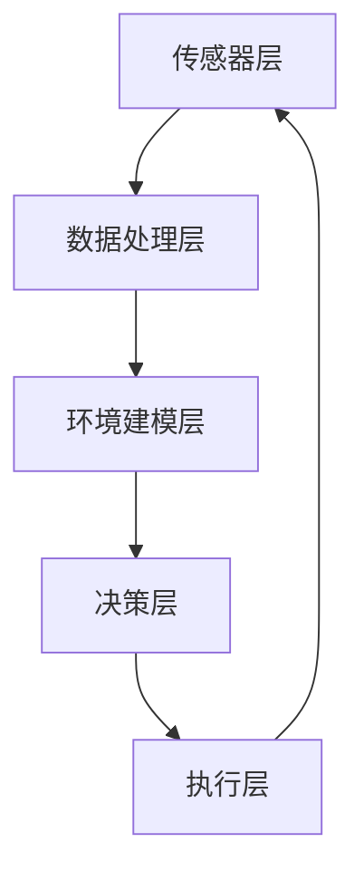

# 情境感知AI Agent：适应动态环境

> 关键词：情境感知、AI Agent、动态环境、智能决策、机器学习、传感器技术、环境建模

> 摘要：本文聚焦于情境感知AI Agent在适应动态环境方面的技术原理、实现方法与应用。首先介绍了情境感知AI Agent的背景，包括目的、预期读者、文档结构和相关术语。接着阐述了核心概念与联系，构建了其原理和架构的文本示意图与Mermaid流程图。详细讲解了核心算法原理，并通过Python代码进行了具体操作步骤的说明。深入探讨了数学模型和公式，并举例说明。通过项目实战展示了代码的实际案例和详细解释。分析了实际应用场景，推荐了学习、开发工具和相关论文著作。最后总结了未来发展趋势与挑战，并提供了常见问题解答和扩展阅读参考资料，旨在为读者全面呈现情境感知AI Agent适应动态环境的技术全貌。

## 1. 背景介绍 
### 1.1 目的和范围
随着科技的飞速发展，AI Agent的应用场景日益广泛，从智能家居到自动驾驶，从工业自动化到智能医疗等领域。然而，许多传统的AI Agent在面对动态变化的环境时，表现出适应性不足的问题。本文章的目的在于深入探讨情境感知AI Agent的技术，使其能够更好地适应动态环境。范围涵盖了情境感知AI Agent的核心概念、算法原理、数学模型、项目实战、应用场景以及未来发展等多个方面，旨在为相关领域的研究人员、开发者和爱好者提供全面而深入的技术指导。

### 1.2 预期读者
本文预期读者包括但不限于人工智能领域的研究人员、软件开发者、机器学习工程师、机器人技术专家、对智能系统感兴趣的学生以及相关行业的从业者。无论您是初学者希望了解情境感知AI Agent的基础知识，还是有一定经验的专业人士寻求技术上的深入拓展，本文都将为您提供有价值的信息。

### 1.3 文档结构概述
本文将按照以下结构进行阐述：首先介绍情境感知AI Agent的核心概念与联系，包括其原理和架构；接着详细讲解核心算法原理，并给出具体的操作步骤和Python代码示例；然后深入探讨相关的数学模型和公式，并通过举例进行说明；之后通过项目实战展示代码的实际应用和详细解释；分析情境感知AI Agent的实际应用场景；推荐学习、开发工具和相关论文著作；最后总结未来发展趋势与挑战，提供常见问题解答和扩展阅读参考资料。

### 1.4 术语表
#### 1.4.1 核心术语定义
- **情境感知AI Agent**：一种能够感知周围环境的情境信息，并根据这些信息做出智能决策的人工智能实体。它可以是软件程序、机器人或其他智能设备。
- **动态环境**：环境的状态和特征随时间不断变化的环境，例如交通路况、天气条件、人员流动等。
- **情境信息**：与环境相关的各种信息，包括物理信息（如温度、湿度、光照等）、语义信息（如地点、事件、人物等）和社会信息（如社交关系、群体行为等）。
- **智能决策**：AI Agent根据感知到的情境信息，结合自身的目标和知识，选择最优的行动方案的过程。

#### 1.4.2 相关概念解释
- **传感器技术**：用于获取环境情境信息的技术，包括视觉传感器（如摄像头）、听觉传感器（如麦克风）、触觉传感器、温度传感器、湿度传感器等。
- **机器学习**：使AI Agent能够从大量数据中学习模式和规律，从而提高其决策能力的技术。常见的机器学习算法包括神经网络、决策树、支持向量机等。
- **环境建模**：对动态环境进行抽象和表示的过程，以便AI Agent能够更好地理解和处理环境信息。环境模型可以是物理模型、数学模型或语义模型。

#### 1.4.3 缩略词列表
- **AI**：Artificial Intelligence（人工智能）
- **ML**：Machine Learning（机器学习）
- **RL**：Reinforcement Learning（强化学习）
- **CNN**：Convolutional Neural Network（卷积神经网络）
- **RNN**：Recurrent Neural Network（循环神经网络）

## 2. 核心概念与联系 

### 核心概念原理
情境感知AI Agent的核心原理是通过传感器技术获取环境的情境信息，将这些信息进行处理和分析，然后结合自身的目标和知识，做出智能决策。具体来说，它包括以下几个关键步骤：
1. **情境感知**：使用各种传感器收集环境的物理、语义和社会信息。例如，在智能家居系统中，传感器可以收集房间的温度、湿度、光照强度等物理信息，以及家庭成员的活动、位置等语义信息。
2. **信息处理**：对收集到的情境信息进行预处理、特征提取和融合。预处理包括数据清洗、滤波等操作，以去除噪声和异常值；特征提取是从原始数据中提取有代表性的特征；信息融合是将不同传感器的信息进行整合，以提高信息的准确性和完整性。
3. **环境建模**：根据处理后的情境信息，构建环境模型。环境模型可以是静态的，也可以是动态的。静态模型描述环境的固定特征，如房间的布局、设备的位置等；动态模型描述环境的变化特征，如人员的流动、设备的状态变化等。
4. **智能决策**：AI Agent根据环境模型和自身的目标，选择最优的行动方案。决策过程可以基于规则、机器学习或强化学习等方法。例如，在智能家居系统中，根据环境温度和用户的偏好，自动调节空调的温度。

### 架构的文本示意图
```plaintext
|---------------------|
|  传感器层           |
|  - 视觉传感器       |
|  - 听觉传感器       |
|  - 其他传感器       |
|---------------------|
|  数据处理层         |
|  - 数据预处理       |
|  - 特征提取         |
|  - 信息融合         |
|---------------------|
|  环境建模层         |
|  - 静态模型         |
|  - 动态模型         |
|---------------------|
|  决策层             |
|  - 规则推理         |
|  - 机器学习         |
|  - 强化学习         |
|---------------------|
|  执行层             |
|  - 控制设备         |
|  - 执行动作         |
|---------------------|
```

### Mermaid流程图


## 3. 核心算法原理 & 具体操作步骤 

### 核心算法原理
情境感知AI Agent的核心算法主要包括机器学习和强化学习算法。下面以强化学习算法为例进行详细讲解。

强化学习是一种通过智能体与环境进行交互，以最大化累积奖励的学习方法。在情境感知AI Agent中，智能体根据当前的环境状态选择一个动作，环境根据智能体的动作给出一个奖励和下一个状态。智能体的目标是学习一个最优的策略，使得在长期内获得的累积奖励最大。

常见的强化学习算法有Q - learning和深度Q网络（DQN）。Q - learning是一种基于值函数的强化学习算法，它通过学习一个Q函数来表示在每个状态下采取每个动作的价值。DQN是在Q - learning的基础上，使用神经网络来近似Q函数，从而能够处理高维的状态空间。

### 具体操作步骤和Python代码示例

以下是一个简单的Q - learning算法的Python代码示例：

```python
import numpy as np

# 定义环境参数
num_states = 5
num_actions = 2
gamma = 0.9  # 折扣因子
alpha = 0.1  # 学习率
epsilon = 0.1  # 探索率

# 初始化Q表
Q = np.zeros((num_states, num_actions))

# 定义环境转移函数
def environment(state, action):
    if action == 0:
        next_state = max(0, state - 1)
    else:
        next_state = min(num_states - 1, state + 1)
    reward = 1 if next_state == num_states - 1 else 0
    return next_state, reward

# Q - learning算法
def q_learning(num_episodes):
    for episode in range(num_episodes):
        state = 0
        done = False
        while not done:
            # 探索与利用
            if np.random.uniform(0, 1) < epsilon:
                action = np.random.choice(num_actions)
            else:
                action = np.argmax(Q[state, :])
            # 执行动作，获取下一个状态和奖励
            next_state, reward = environment(state, action)
            # 更新Q表
            Q[state, action] = Q[state, action] + alpha * (reward + gamma * np.max(Q[next_state, :]) - Q[state, action])
            state = next_state
            if state == num_states - 1:
                done = True
    return Q

# 训练Q表
Q = q_learning(1000)
print("训练后的Q表：")
print(Q)
```

### 代码解释
1. **环境参数定义**：定义了状态数、动作数、折扣因子、学习率和探索率。
2. **Q表初始化**：使用`np.zeros`函数初始化一个全零的Q表。
3. **环境转移函数**：定义了环境根据当前状态和动作返回下一个状态和奖励的规则。
4. **Q - learning算法**：在每个episode中，智能体根据探索与利用策略选择动作，执行动作后更新Q表，直到达到终止状态。
5. **训练Q表**：调用`q_learning`函数进行训练，并打印训练后的Q表。

## 4. 数学模型和公式 & 详细讲解 & 举例说明 

### Q - learning的数学模型和公式
Q - learning的核心是更新Q函数，其更新公式为：

$$Q(s, a) \leftarrow Q(s, a) + \alpha [r + \gamma \max_{a'} Q(s', a') - Q(s, a)]$$

其中：
- $Q(s, a)$ 表示在状态 $s$ 下采取动作 $a$ 的Q值。
- $\alpha$ 是学习率，控制每次更新的步长。
- $r$ 是执行动作 $a$ 后从环境中获得的即时奖励。
- $\gamma$ 是折扣因子，用于平衡即时奖励和未来奖励。
- $s'$ 是执行动作 $a$ 后转移到的下一个状态。
- $\max_{a'} Q(s', a')$ 表示在下一个状态 $s'$ 下选择最优动作的Q值。

### 详细讲解
Q - learning的目标是通过不断地与环境交互，更新Q表，使得Q表中的值能够准确地表示在每个状态下采取每个动作的价值。更新公式的含义是：当前状态和动作的Q值的更新量等于学习率乘以（即时奖励加上折扣后的未来最大Q值减去当前Q值）。

### 举例说明
假设我们有一个简单的网格世界环境，智能体从起点出发，目标是到达终点。状态 $s$ 表示智能体在网格中的位置，动作 $a$ 表示智能体的移动方向（上、下、左、右）。当智能体到达终点时，获得奖励 $r = 1$，否则 $r = 0$。

初始时，Q表中的所有值都为0。假设智能体处于状态 $s_1$，选择动作 $a_1$ 后转移到状态 $s_2$，获得奖励 $r = 0$。根据Q - learning更新公式，更新 $Q(s_1, a_1)$ 的值：

$$Q(s_1, a_1) \leftarrow Q(s_1, a_1) + \alpha [0 + \gamma \max_{a'} Q(s_2, a') - Q(s_1, a_1)]$$

随着智能体不断地与环境交互，Q表中的值会逐渐收敛到最优值，智能体就可以根据Q表选择最优的动作。

## 5. 项目实战：代码实际案例和详细解释说明 

### 5.1  开发环境搭建
为了实现情境感知AI Agent的项目实战，我们需要搭建一个开发环境。以下是具体的步骤：

1. **安装Python**：建议使用Python 3.7及以上版本。可以从Python官方网站（https://www.python.org/downloads/）下载并安装。
2. **安装必要的库**：使用`pip`命令安装以下库：
    - `numpy`：用于数值计算。
    - `matplotlib`：用于数据可视化。
    - `gym`：OpenAI开发的强化学习环境库。

```bash
pip install numpy matplotlib gym
```

### 5.2  源代码详细实现和代码解读

以下是一个使用OpenAI Gym环境实现Q - learning的完整代码示例：

```python
import gym
import numpy as np
import matplotlib.pyplot as plt

# 创建环境
env = gym.make('FrozenLake-v1')

# 定义参数
num_states = env.observation_space.n
num_actions = env.action_space.n
gamma = 0.9
alpha = 0.1
epsilon = 0.1
num_episodes = 1000

# 初始化Q表
Q = np.zeros((num_states, num_actions))

# 记录每个episode的奖励
rewards = []

# Q - learning算法
for episode in range(num_episodes):
    state = env.reset()
    total_reward = 0
    done = False
    while not done:
        # 探索与利用
        if np.random.uniform(0, 1) < epsilon:
            action = env.action_space.sample()
        else:
            action = np.argmax(Q[state, :])
        # 执行动作
        next_state, reward, done, _ = env.step(action)
        # 更新Q表
        Q[state, action] = Q[state, action] + alpha * (reward + gamma * np.max(Q[next_state, :]) - Q[state, action])
        state = next_state
        total_reward += reward
    rewards.append(total_reward)

# 绘制奖励曲线
plt.plot(rewards)
plt.xlabel('Episode')
plt.ylabel('Total Reward')
plt.title('Q - learning in FrozenLake-v1')
plt.show()

# 关闭环境
env.close()
```

### 代码解读与分析
1. **环境创建**：使用`gym.make`函数创建`FrozenLake-v1`环境。
2. **参数定义**：定义状态数、动作数、折扣因子、学习率、探索率和训练的episode数。
3. **Q表初始化**：使用`np.zeros`函数初始化一个全零的Q表。
4. **Q - learning算法**：在每个episode中，智能体根据探索与利用策略选择动作，执行动作后更新Q表，记录每个episode的总奖励。
5. **奖励曲线绘制**：使用`matplotlib`库绘制每个episode的总奖励曲线，用于观察智能体的学习过程。
6. **环境关闭**：使用`env.close`函数关闭环境。

通过观察奖励曲线，我们可以看到智能体的性能随着训练的进行逐渐提高，说明Q - learning算法在这个环境中是有效的。

## 6. 实际应用场景 

### 智能家居
在智能家居系统中，情境感知AI Agent可以根据环境的情境信息自动调节家居设备的运行状态。例如，根据房间的温度、湿度和光照强度，自动调节空调、加湿器和灯光的开关和亮度；根据家庭成员的活动和位置，自动控制门锁、窗帘等设备的开关。

### 自动驾驶
在自动驾驶领域，情境感知AI Agent可以实时感知车辆周围的环境信息，如交通路况、行人、障碍物等，从而做出智能决策，如加速、减速、转弯等。通过对动态环境的准确感知和处理，提高自动驾驶的安全性和可靠性。

### 智能医疗
在智能医疗系统中，情境感知AI Agent可以根据患者的生理数据、病历信息和环境信息，为医生提供辅助诊断和治疗建议。例如，根据患者的体温、血压、心率等生理数据，结合患者的病史和当前症状，智能判断患者的病情，并推荐合适的治疗方案。

### 工业自动化
在工业自动化领域，情境感知AI Agent可以实时监测生产环境的参数，如温度、压力、湿度等，以及设备的运行状态，如故障、磨损等。根据这些信息，自动调整生产流程和设备的运行参数，提高生产效率和产品质量。

## 7. 工具和资源推荐
### 7.1 学习资源推荐
#### 7.1.1 书籍推荐
- 《人工智能：一种现代的方法》（Artificial Intelligence: A Modern Approach）：这本书是人工智能领域的经典教材，涵盖了人工智能的各个方面，包括搜索算法、知识表示、机器学习、自然语言处理等。
- 《强化学习：原理与Python实现》：系统介绍了强化学习的基本原理、算法和应用，并通过Python代码进行了详细的实现和解释。
- 《机器学习》（周志华）：国内机器学习领域的经典教材，内容全面，讲解深入，适合初学者和有一定基础的读者。

#### 7.1.2 在线课程
- Coursera上的“机器学习”课程：由斯坦福大学的Andrew Ng教授授课，是机器学习领域最受欢迎的在线课程之一。
- edX上的“强化学习基础”课程：系统介绍了强化学习的基本概念、算法和应用。
- 中国大学MOOC上的“人工智能基础”课程：适合初学者了解人工智能的基本概念和方法。

#### 7.1.3 技术博客和网站
- Medium：有许多人工智能领域的技术博客，涵盖了最新的研究成果、算法实现和应用案例。
- Towards Data Science：专注于数据科学和人工智能领域的技术博客，提供了丰富的学习资源和实践经验。
- OpenAI官方博客：发布OpenAI的最新研究成果和技术进展。

### 7.2 开发工具框架推荐
#### 7.2.1 IDE和编辑器
- PyCharm：一款功能强大的Python集成开发环境，提供了代码编辑、调试、版本控制等功能。
- Jupyter Notebook：一个交互式的开发环境，适合进行数据分析、模型训练和可视化。
- Visual Studio Code：一款轻量级的代码编辑器，支持多种编程语言，有丰富的插件扩展。

#### 7.2.2 调试和性能分析工具
- PDB：Python自带的调试器，可以帮助开发者定位代码中的问题。
- cProfile：Python的性能分析工具，可以分析代码的运行时间和内存使用情况。
- TensorBoard：TensorFlow的可视化工具，可以可视化模型的训练过程和性能指标。

#### 7.2.3 相关框架和库
- TensorFlow：Google开发的深度学习框架，支持多种深度学习模型的构建和训练。
- PyTorch：Facebook开发的深度学习框架，具有动态图的特点，适合快速原型开发。
- OpenAI Gym：OpenAI开发的强化学习环境库，提供了丰富的强化学习环境。

### 7.3 相关论文著作推荐
#### 7.3.1 经典论文
- “Q - learning”：Watkins和Dayan于1992年发表的论文，首次提出了Q - learning算法。
- “Playing Atari with Deep Reinforcement Learning”：Mnih等人于2013年发表的论文，提出了深度Q网络（DQN）算法，开启了深度强化学习的时代。
- “Human - level control through deep reinforcement learning”：Mnih等人于2015年发表的论文，进一步改进了DQN算法，实现了在Atari游戏上的人类水平控制。

#### 7.3.2 最新研究成果
- 关注NeurIPS、ICML、CVPR等顶级人工智能会议的论文，了解最新的研究成果和技术进展。
- 关注arXiv上的预印本论文，获取最新的研究动态。

#### 7.3.3 应用案例分析
- 阅读相关领域的学术期刊和会议论文，了解情境感知AI Agent在实际应用中的案例和经验。
- 关注科技公司的官方博客和技术报告，了解他们在情境感知AI Agent方面的实践和创新。

## 8. 总结：未来发展趋势与挑战
### 未来发展趋势
- **多模态感知**：未来的情境感知AI Agent将能够融合多种传感器的信息，实现更全面、准确的环境感知。例如，结合视觉、听觉、触觉等多种传感器，实现对复杂环境的感知和理解。
- **深度强化学习与情境感知的融合**：深度强化学习在处理高维状态空间和复杂任务方面具有强大的能力，将其与情境感知相结合，可以提高AI Agent在动态环境中的决策能力和适应性。
- **群体智能与协作**：多个情境感知AI Agent之间可以进行协作和交互，形成群体智能，共同完成复杂的任务。例如，在智能交通系统中，多辆自动驾驶汽车可以通过协作提高交通效率和安全性。
- **可解释性和安全性**：随着AI Agent在关键领域的应用越来越广泛，其可解释性和安全性将变得越来越重要。未来的研究将致力于开发可解释的AI算法和安全可靠的AI系统。

### 挑战
- **数据获取和处理**：获取高质量的情境数据是情境感知AI Agent的基础，但在实际应用中，数据的获取和处理面临着诸多挑战，如数据的多样性、噪声、隐私等问题。
- **环境建模的复杂性**：动态环境的建模是一个复杂的问题，需要考虑环境的不确定性、动态性和多样性。如何构建准确、高效的环境模型是当前面临的一个挑战。
- **计算资源的限制**：深度强化学习等算法需要大量的计算资源，在实际应用中，计算资源的限制可能会影响AI Agent的性能和实时性。
- **伦理和法律问题**：情境感知AI Agent的应用可能会涉及到伦理和法律问题，如隐私保护、责任界定等。如何制定相应的伦理和法律规范是未来需要解决的问题。

## 9. 附录：常见问题与解答
### 问题1：情境感知AI Agent与传统AI Agent有什么区别？
传统AI Agent通常是基于固定的规则或预训练的模型进行决策，对环境的变化适应性较差。而情境感知AI Agent能够实时感知环境的情境信息，并根据这些信息动态调整自己的决策，具有更好的适应性和智能性。

### 问题2：如何选择合适的传感器来实现情境感知？
选择合适的传感器需要考虑以下几个因素：
- **环境特征**：根据环境的特点选择合适的传感器，如在室内环境中可以选择温度、湿度、光照等传感器；在室外环境中可以选择摄像头、雷达等传感器。
- **精度要求**：根据应用的精度要求选择传感器的精度，精度越高的传感器价格通常也越高。
- **成本和功耗**：考虑传感器的成本和功耗，选择性价比高的传感器。

### 问题3：Q - learning算法的收敛性如何保证？
Q - learning算法在满足一定条件下是收敛的，主要条件包括：
- **学习率**：学习率 $\alpha$ 需要随着时间逐渐减小，以保证算法的收敛性。
- **探索率**：探索率 $\epsilon$ 也需要随着时间逐渐减小，使得智能体在训练后期更多地选择最优动作。
- **环境的稳定性**：环境的状态转移和奖励函数需要保持相对稳定，否则算法可能无法收敛。

### 问题4：情境感知AI Agent在实际应用中如何保证安全性？
为了保证情境感知AI Agent在实际应用中的安全性，可以采取以下措施：
- **安全设计**：在算法设计和系统架构设计阶段，考虑安全性因素，如采用容错机制、冗余设计等。
- **数据安全**：对采集的情境数据进行加密和保护，防止数据泄露和恶意攻击。
- **模型验证和测试**：对训练好的模型进行充分的验证和测试，确保其在各种情况下都能正常工作。
- **监控和预警**：实时监控AI Agent的运行状态，当出现异常情况时及时发出预警。

## 10. 扩展阅读 & 参考资料
### 扩展阅读
- 《深度学习》（Deep Learning）：Ian Goodfellow、Yoshua Bengio和Aaron Courville所著，深入介绍了深度学习的原理、算法和应用。
- 《机器人学导论》（Introduction to Robotics: Mechanics and Control）：John J. Craig所著，系统介绍了机器人学的基本原理和控制方法。
- 《人工智能前沿技术》：关注人工智能领域的最新研究成果和技术进展，了解行业动态。

### 参考资料
- OpenAI官方文档：https://openai.com/docs/
- TensorFlow官方文档：https://www.tensorflow.org/api_docs
- PyTorch官方文档：https://pytorch.org/docs/stable/index.html
- Gym官方文档：https://gym.openai.com/docs/

以上文章全面深入地探讨了情境感知AI Agent在适应动态环境方面的技术原理、实现方法、应用场景以及未来发展趋势和挑战，希望能为读者提供有价值的参考。