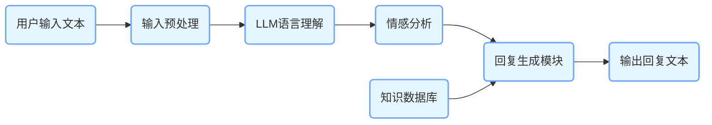

# 情感智能对话AI Agent：LLM驱动的心理健康助手

> 关键词：情感智能对话、AI Agent、大语言模型（LLM）、心理健康助手、自然语言处理

> 摘要：本文聚焦于情感智能对话AI Agent作为基于大语言模型（LLM）驱动的心理健康助手这一主题。首先介绍了该领域的背景，包括研究目的、预期读者等。接着阐述了核心概念与联系，通过示意图和流程图展示其架构原理。详细讲解了核心算法原理，并用Python代码进行说明，同时给出了相关的数学模型和公式。在项目实战部分，提供了开发环境搭建、源代码实现及解读。分析了实际应用场景，推荐了学习、开发工具和相关论文著作。最后总结了未来发展趋势与挑战，并给出常见问题解答和参考资料，旨在为相关领域的研究和应用提供全面的技术指导。

## 1. 背景介绍 
### 1.1 目的和范围
在当今快节奏的社会中，心理健康问题日益受到关注。然而，专业心理健康服务资源相对有限，难以满足人们的需求。情感智能对话AI Agent作为一种创新的解决方案，旨在利用大语言模型（LLM）的强大能力，为用户提供便捷、实时的心理健康支持。本文章的目的是深入探讨如何构建一个基于LLM的情感智能对话AI Agent作为心理健康助手，包括其核心原理、算法实现、实际应用等方面。范围涵盖了从理论基础到实际项目开发的全过程，为相关领域的研究人员、开发者和从业者提供全面的技术参考。

### 1.2 预期读者
本文的预期读者包括但不限于以下几类人群：
- **人工智能研究人员**：对自然语言处理、情感分析等领域感兴趣，希望深入了解如何将大语言模型应用于心理健康领域的研究人员。
- **软件开发人员**：从事人工智能软件开发的工程师，希望学习如何构建情感智能对话系统的具体实现方法。
- **心理健康专业人士**：对利用新技术提升心理健康服务质量感兴趣的心理咨询师、心理治疗师等专业人士。
- **学生**：计算机科学、心理学等相关专业的学生，希望通过本文了解跨学科领域的研究和应用。

### 1.3 文档结构概述
本文将按照以下结构进行组织：
- **核心概念与联系**：介绍情感智能对话AI Agent和大语言模型的核心概念，以及它们之间的联系，通过文本示意图和Mermaid流程图进行展示。
- **核心算法原理 & 具体操作步骤**：详细讲解实现情感智能对话的核心算法原理，并使用Python源代码进行说明。
- **数学模型和公式 & 详细讲解 & 举例说明**：给出相关的数学模型和公式，并进行详细讲解和举例说明。
- **项目实战：代码实际案例和详细解释说明**：提供一个完整的项目实战案例，包括开发环境搭建、源代码详细实现和代码解读。
- **实际应用场景**：分析情感智能对话AI Agent作为心理健康助手的实际应用场景。
- **工具和资源推荐**：推荐相关的学习资源、开发工具框架和论文著作。
- **总结：未来发展趋势与挑战**：总结该领域的未来发展趋势和面临的挑战。
- **附录：常见问题与解答**：解答读者可能遇到的常见问题。
- **扩展阅读 & 参考资料**：提供相关的扩展阅读和参考资料。

### 1.4 术语表
#### 1.4.1 核心术语定义
- **情感智能对话AI Agent**：一种能够理解用户情感并进行智能对话的人工智能代理，旨在为用户提供情感支持和心理健康建议。
- **大语言模型（LLM）**：一种基于深度学习的语言模型，具有强大的语言理解和生成能力，如GPT-3、BERT等。
- **自然语言处理（NLP）**：研究如何让计算机理解和处理人类自然语言的技术领域。
- **情感分析**：对文本中表达的情感倾向进行分析和判断的技术。
- **心理健康助手**：为用户提供心理健康支持和建议的工具或服务。

#### 1.4.2 相关概念解释
- **对话系统**：一种允许用户与计算机进行自然语言交互的系统，可分为任务导向型和开放对话型。
- **预训练模型**：在大规模文本数据上进行无监督学习训练得到的模型，可用于后续的微调任务。
- **微调**：在预训练模型的基础上，使用特定领域的数据进行进一步训练，以适应特定的任务。

#### 1.4.3 缩略词列表
- **LLM**：大语言模型（Large Language Model）
- **NLP**：自然语言处理（Natural Language Processing）
- **API**：应用程序编程接口（Application Programming Interface）

## 2. 核心概念与联系 
### 核心概念原理
情感智能对话AI Agent作为基于LLM驱动的心理健康助手，其核心原理在于利用大语言模型强大的语言理解和生成能力，结合情感分析技术，实现与用户的自然语言交互，并为用户提供个性化的心理健康支持。

大语言模型通过在大规模文本数据上进行预训练，学习到了丰富的语言知识和语义信息。在对话过程中，AI Agent接收用户输入的文本，利用LLM对其进行理解和分析，提取关键信息和情感倾向。然后，根据分析结果，结合预设的规则和知识，生成合适的回复内容。

情感分析技术则用于识别用户文本中的情感状态，如积极、消极、中立等。通过对用户情感的实时监测，AI Agent可以调整回复的语气和内容，提供更具针对性的情感支持。

### 架构的文本示意图
```plaintext
用户输入文本 -> 输入预处理 -> LLM语言理解 -> 情感分析 -> 回复生成模块 -> 输出回复文本
|                                                          |
|----------------------------------------------------------|
                             |
                      知识数据库
```

### Mermaid流程图


## 3. 核心算法原理 & 具体操作步骤 
### 核心算法原理
#### 语言理解
使用大语言模型进行语言理解的核心是将用户输入的文本转换为向量表示，然后通过模型的多层神经网络进行特征提取和语义分析。以GPT系列模型为例，其采用了Transformer架构，通过自注意力机制来捕捉文本中的长距离依赖关系。

#### 情感分析
情感分析通常使用机器学习或深度学习方法。一种常见的方法是使用预训练的情感分类模型，如基于BERT的情感分类器。该模型通过在大规模标注的情感数据上进行训练，学习到不同情感类别对应的文本特征。

#### 回复生成
回复生成基于语言理解和情感分析的结果，结合知识数据库中的信息，生成合适的回复内容。可以使用基于规则的方法或基于生成式模型的方法。基于生成式模型的方法通常使用Seq2Seq模型，如T5、GPT等，通过输入上下文信息生成回复文本。

### 具体操作步骤
#### 步骤1：输入预处理
对用户输入的文本进行清洗和预处理，包括去除特殊字符、分词等操作。

```python
import re
import jieba

def preprocess_text(text):
    # 去除特殊字符
    text = re.sub(r'[^\w\s]', '', text)
    # 分词
    words = jieba.lcut(text)
    return ' '.join(words)

user_input = "我最近心情很糟糕，感觉压力好大啊！"
preprocessed_input = preprocess_text(user_input)
print(preprocessed_input)
```

#### 步骤2：LLM语言理解
使用预训练的大语言模型对预处理后的文本进行编码和理解。这里以Hugging Face的transformers库为例，使用GPT-2模型。

```python
from transformers import GPT2Tokenizer, GPT2Model
import torch

# 加载tokenizer和模型
tokenizer = GPT2Tokenizer.from_pretrained('gpt2')
model = GPT2Model.from_pretrained('gpt2')

# 对输入文本进行编码
input_ids = tokenizer.encode(preprocessed_input, return_tensors='pt')

# 模型推理
with torch.no_grad():
    outputs = model(input_ids)

# 获取最后一层的隐藏状态
last_hidden_state = outputs.last_hidden_state
print(last_hidden_state.shape)
```

#### 步骤3：情感分析
使用预训练的情感分类模型对输入文本进行情感分析。这里以基于BERT的情感分类器为例。

```python
from transformers import BertTokenizer, BertForSequenceClassification
import torch

# 加载tokenizer和模型
tokenizer = BertTokenizer.from_pretrained('bert-base-chinese')
model = BertForSequenceClassification.from_pretrained('bert-base-chinese', num_labels=2)

# 对输入文本进行编码
input_ids = tokenizer.encode(preprocessed_input, return_tensors='pt')

# 模型推理
with torch.no_grad():
    outputs = model(input_ids)

# 获取预测结果
logits = outputs.logits
predicted_label = torch.argmax(logits, dim=1).item()
print("Predicted label:", predicted_label)
```

#### 步骤4：回复生成
根据语言理解和情感分析的结果，结合知识数据库中的信息，生成回复内容。这里简单示例一个基于规则的回复生成方法。

```python
def generate_response(predicted_label):
    if predicted_label == 0:  # 消极情感
        response = "别担心，一切都会好起来的。可以和我具体说说你遇到了什么压力吗？"
    else:  # 积极情感
        response = "听起来你状态很不错呢！继续保持呀！"
    return response

response = generate_response(predicted_label)
print("Response:", response)
```

## 4. 数学模型和公式 & 详细讲解 & 举例说明 
### 语言模型的数学基础
#### 概率语言模型
概率语言模型的目标是计算一个句子 $S = w_1, w_2, \cdots, w_n$ 的概率 $P(S)$，可以表示为：
$$P(S) = P(w_1, w_2, \cdots, w_n) = \prod_{i=1}^{n} P(w_i | w_1, w_2, \cdots, w_{i-1})$$
其中，$P(w_i | w_1, w_2, \cdots, w_{i-1})$ 表示在给定前面 $i-1$ 个词的条件下，第 $i$ 个词出现的概率。

#### Transformer模型
Transformer模型是大语言模型的核心架构，其核心组件是多头自注意力机制（Multi-Head Self-Attention）。自注意力机制通过计算输入序列中每个位置与其他位置的相关性，为每个位置分配不同的权重。

多头自注意力机制的计算公式如下：
$$\text{MultiHead}(Q, K, V) = \text{Concat}(\text{head}_1, \cdots, \text{head}_h) W^O$$
其中，$\text{head}_i = \text{Attention}(QW_i^Q, KW_i^K, VW_i^V)$，$\text{Attention}(Q, K, V) = \text{softmax}(\frac{QK^T}{\sqrt{d_k}})V$。

$Q$、$K$、$V$ 分别是查询（Query）、键（Key）和值（Value）矩阵，$W_i^Q$、$W_i^K$、$W_i^V$ 是可学习的投影矩阵，$d_k$ 是键向量的维度。

### 情感分析的数学模型
#### 逻辑回归
逻辑回归是一种常用的二分类模型，用于情感分析中的情感分类。假设输入特征向量为 $x$，对应的情感标签为 $y \in \{0, 1\}$，逻辑回归模型的输出概率为：
$$P(y = 1 | x) = \frac{1}{1 + e^{-(w^T x + b)}}$$
其中，$w$ 是权重向量，$b$ 是偏置项。

#### 损失函数
对于逻辑回归模型，常用的损失函数是交叉熵损失函数：
$$L(w, b) = -\frac{1}{N} \sum_{i=1}^{N} [y_i \log P(y_i = 1 | x_i) + (1 - y_i) \log (1 - P(y_i = 1 | x_i))]$$
其中，$N$ 是样本数量。

### 举例说明
#### 语言模型概率计算
假设有一个简单的句子 $S = \text{我 喜欢 苹果}$，使用二元语法（Bigram）模型计算其概率。假设 $P(\text{我}) = 0.2$，$P(\text{喜欢} | \text{我}) = 0.3$，$P(\text{苹果} | \text{喜欢}) = 0.4$，则：
$$P(S) = P(\text{我}) \times P(\text{喜欢} | \text{我}) \times P(\text{苹果} | \text{喜欢}) = 0.2 \times 0.3 \times 0.4 = 0.024$$

#### 情感分析逻辑回归
假设有一个简单的情感分析任务，输入特征向量 $x = [0.2, 0.3]$，权重向量 $w = [0.1, 0.2]$，偏置项 $b = 0.5$，则：
$$z = w^T x + b = 0.1 \times 0.2 + 0.2 \times 0.3 + 0.5 = 0.58$$
$$P(y = 1 | x) = \frac{1}{1 + e^{-0.58}} \approx 0.64$$

## 5. 项目实战：代码实际案例和详细解释说明 
### 5.1  开发环境搭建
#### 操作系统
推荐使用Linux或macOS系统，也可以在Windows系统上进行开发。

#### Python环境
安装Python 3.7及以上版本。可以使用Anaconda或Miniconda来管理Python环境。

```bash
# 创建虚拟环境
conda create -n emotion_ai python=3.8
conda activate emotion_ai
```

#### 安装依赖库
使用pip安装所需的库，包括transformers、torch、jieba等。

```bash
pip install transformers torch jieba
```

### 5.2  源代码详细实现和代码解读
#### 完整代码
```python
import re
import jieba
from transformers import GPT2Tokenizer, GPT2Model, BertTokenizer, BertForSequenceClassification
import torch

# 输入预处理
def preprocess_text(text):
    # 去除特殊字符
    text = re.sub(r'[^\w\s]', '', text)
    # 分词
    words = jieba.lcut(text)
    return ' '.join(words)

# LLM语言理解
def llm_understanding(text):
    # 加载tokenizer和模型
    tokenizer = GPT2Tokenizer.from_pretrained('gpt2')
    model = GPT2Model.from_pretrained('gpt2')

    # 对输入文本进行编码
    input_ids = tokenizer.encode(text, return_tensors='pt')

    # 模型推理
    with torch.no_grad():
        outputs = model(input_ids)

    # 获取最后一层的隐藏状态
    last_hidden_state = outputs.last_hidden_state
    return last_hidden_state

# 情感分析
def sentiment_analysis(text):
    # 加载tokenizer和模型
    tokenizer = BertTokenizer.from_pretrained('bert-base-chinese')
    model = BertForSequenceClassification.from_pretrained('bert-base-chinese', num_labels=2)

    # 对输入文本进行编码
    input_ids = tokenizer.encode(text, return_tensors='pt')

    # 模型推理
    with torch.no_grad():
        outputs = model(input_ids)

    # 获取预测结果
    logits = outputs.logits
    predicted_label = torch.argmax(logits, dim=1).item()
    return predicted_label

# 回复生成
def generate_response(predicted_label):
    if predicted_label == 0:  # 消极情感
        response = "别担心，一切都会好起来的。可以和我具体说说你遇到了什么压力吗？"
    else:  # 积极情感
        response = "听起来你状态很不错呢！继续保持呀！"
    return response

# 主函数
def main():
    user_input = input("请输入你的心情描述：")
    preprocessed_input = preprocess_text(user_input)
    # 语言理解
    llm_output = llm_understanding(preprocessed_input)
    print("LLM输出形状:", llm_output.shape)
    # 情感分析
    predicted_label = sentiment_analysis(preprocessed_input)
    print("预测情感标签:", predicted_label)
    # 回复生成
    response = generate_response(predicted_label)
    print("回复内容:", response)

if __name__ == "__main__":
    main()
```

#### 代码解读
- **输入预处理**：`preprocess_text` 函数用于对用户输入的文本进行清洗和分词处理，去除特殊字符，将文本转换为适合模型输入的格式。
- **LLM语言理解**：`llm_understanding` 函数使用GPT-2模型对预处理后的文本进行编码和理解，返回最后一层的隐藏状态。
- **情感分析**：`sentiment_analysis` 函数使用基于BERT的情感分类器对输入文本进行情感分析，返回预测的情感标签。
- **回复生成**：`generate_response` 函数根据情感分析的结果生成相应的回复内容。
- **主函数**：`main` 函数负责接收用户输入，调用上述函数完成整个对话流程，并输出结果。

### 5.3  代码解读与分析
#### 优点
- **模块化设计**：代码采用模块化设计，将不同的功能封装成独立的函数，提高了代码的可维护性和可扩展性。
- **使用预训练模型**：利用Hugging Face的transformers库，使用预训练的GPT-2和BERT模型，减少了模型训练的时间和成本。
- **简单易懂**：代码逻辑清晰，注释详细，适合初学者学习和理解。

#### 不足之处
- **回复生成规则简单**：回复生成部分采用简单的基于规则的方法，生成的回复内容较为单一，缺乏个性化。
- **模型性能有限**：使用的预训练模型可能在特定领域的表现不够理想，需要进一步微调。

## 6. 实际应用场景 
### 心理健康咨询辅助
情感智能对话AI Agent可以作为心理健康咨询师的辅助工具，在咨询师与患者的咨询过程中，实时分析患者的情感状态和言语内容，为咨询师提供参考建议。例如，当患者表达出强烈的消极情绪时，AI Agent可以提醒咨询师关注患者的情绪变化，并提供一些缓解情绪的建议。

### 日常心理支持
用户可以随时与AI Agent进行对话，分享自己的心情和烦恼。AI Agent可以根据用户的情感状态，提供相应的情感支持和心理疏导。例如，当用户感到压力大时，AI Agent可以提供一些放松技巧和应对策略。

### 心理疾病筛查
通过与用户的对话，AI Agent可以对用户的心理状态进行初步筛查，识别可能存在的心理疾病风险。例如，当用户频繁表达出抑郁、焦虑等情绪时，AI Agent可以建议用户寻求专业的心理帮助。

### 心理健康教育
AI Agent可以作为心理健康教育的工具，向用户普及心理健康知识，提供一些心理健康小贴士和自我调节方法。例如，用户可以询问AI Agent关于失眠、焦虑等问题的解决方法，AI Agent可以提供相关的建议和指导。

## 7. 工具和资源推荐
### 7.1 学习资源推荐
#### 7.1.1 书籍推荐
- 《自然语言处理入门》：作者何晗，本书系统介绍了自然语言处理的基础理论和常用技术，适合初学者入门。
- 《深度学习》：作者Ian Goodfellow、Yoshua Bengio和Aaron Courville，本书是深度学习领域的经典教材，涵盖了深度学习的各个方面。
- 《Python自然语言处理》：作者Steven Bird、Ewan Klein和Edward Loper，本书详细介绍了如何使用Python进行自然语言处理，提供了丰富的代码示例。

#### 7.1.2 在线课程
- Coursera上的“Natural Language Processing Specialization”：由斯坦福大学教授授课，系统介绍了自然语言处理的核心技术和应用。
- edX上的“Introduction to Artificial Intelligence”：由麻省理工学院教授授课，涵盖了人工智能的基本概念和方法，包括自然语言处理。
- 吴恩达的“Deep Learning Specialization”：在Coursera上提供，深入介绍了深度学习的理论和实践，对理解大语言模型有很大帮助。

#### 7.1.3 技术博客和网站
- Hugging Face Blog：提供了关于自然语言处理和大语言模型的最新研究成果和技术应用。
- Towards Data Science：一个专注于数据科学和人工智能的技术博客，有很多关于自然语言处理的优质文章。
- arXiv.org：一个预印本服务器，提供了大量关于人工智能和自然语言处理的最新研究论文。

### 7.2 开发工具框架推荐
#### 7.2.1 IDE和编辑器
- PyCharm：一款专业的Python集成开发环境，提供了丰富的代码编辑、调试和项目管理功能。
- Visual Studio Code：一款轻量级的代码编辑器，支持多种编程语言，有丰富的插件扩展。
- Jupyter Notebook：一个交互式的开发环境，适合进行数据分析和模型实验。

#### 7.2.2 调试和性能分析工具
- TensorBoard：一个用于可视化深度学习模型训练过程和性能指标的工具。
- PyTorch Profiler：PyTorch提供的性能分析工具，可以帮助开发者找出代码中的性能瓶颈。
- cProfile：Python内置的性能分析工具，可以分析代码的执行时间和函数调用情况。

#### 7.2.3 相关框架和库
- Hugging Face Transformers：一个用于自然语言处理的开源库，提供了丰富的预训练模型和工具。
- PyTorch：一个深度学习框架，具有动态图机制，易于使用和调试。
- NLTK：一个自然语言处理工具包，提供了丰富的语料库和工具函数。

### 7.3 相关论文著作推荐
#### 7.3.1 经典论文
- “Attention Is All You Need”：介绍了Transformer架构，是大语言模型的基础。
- “BERT: Pre-training of Deep Bidirectional Transformers for Language Understanding”：提出了BERT模型，在自然语言处理领域取得了巨大成功。
- “Generative Pretrained Transformer 3 (GPT-3): Language Models are Few-Shot Learners”：介绍了GPT-3模型，展示了大语言模型的强大能力。

#### 7.3.2 最新研究成果
- 关注arXiv.org上关于自然语言处理和情感分析的最新论文，了解该领域的前沿研究动态。
- 参加相关的学术会议，如ACL（Association for Computational Linguistics）、EMNLP（Conference on Empirical Methods in Natural Language Processing）等，获取最新的研究成果。

#### 7.3.3 应用案例分析
- 可以在ACM Digital Library、IEEE Xplore等数据库中搜索关于情感智能对话系统在心理健康领域应用的案例分析论文，学习实际应用中的经验和方法。

## 8. 总结：未来发展趋势与挑战
### 未来发展趋势
#### 个性化服务
未来的情感智能对话AI Agent将更加注重个性化服务，根据用户的个人信息、历史对话记录和情感状态，提供更加精准、个性化的心理健康支持。例如，为不同年龄段、性别、职业的用户提供定制化的心理疏导方案。

#### 多模态交互
除了文本交互，未来的AI Agent将支持多模态交互，如语音、图像、视频等。通过结合多种模态的信息，AI Agent可以更全面地理解用户的情感状态和需求，提供更加丰富、生动的交互体验。

#### 与专业心理健康服务融合
情感智能对话AI Agent将与专业心理健康服务进行深度融合，成为心理健康服务体系的重要组成部分。例如，与心理咨询师、心理治疗师的工作流程相结合，为患者提供全程的心理健康支持。

#### 跨领域应用
情感智能对话技术将在更多领域得到应用，如教育、医疗、金融等。在教育领域，AI Agent可以为学生提供心理辅导和学习建议；在医疗领域，可辅助医生进行患者情绪管理；在金融领域，可帮助客户缓解投资压力。

### 面临的挑战
#### 数据隐私和安全
在收集和处理用户的心理健康数据时，需要高度重视数据隐私和安全问题。确保用户数据不被泄露、滥用，遵守相关的法律法规和伦理准则。

#### 模型解释性
大语言模型通常是黑盒模型，其决策过程难以解释。在心理健康领域，模型的解释性尤为重要，需要开发可解释的模型和方法，让用户和专业人士能够理解模型的决策依据。

#### 情感理解的准确性
目前的情感分析技术仍然存在一定的局限性，对复杂情感和隐含情感的理解不够准确。需要进一步提高情感分析的准确性和鲁棒性，以更好地满足用户的需求。

#### 伦理和道德问题
情感智能对话AI Agent在提供心理健康支持时，可能会面临伦理和道德问题。例如，如何避免给出不恰当的建议，如何处理用户的自杀倾向等紧急情况。需要建立相应的伦理准则和规范，确保AI Agent的行为符合道德要求。

## 9. 附录：常见问题与解答
### 问题1：如何提高情感分析的准确性？
- 可以使用更多标注的情感数据进行模型训练，提高模型的泛化能力。
- 结合多种特征，如文本的语义特征、语法特征、情感词典等，进行情感分析。
- 对不同领域的数据进行微调，使模型更适应特定领域的情感分析任务。

### 问题2：如何选择合适的大语言模型？
- 考虑模型的性能和计算资源，如模型的大小、训练时间、推理速度等。
- 关注模型在特定任务上的表现，可以通过实验比较不同模型的性能。
- 选择开源且社区支持良好的模型，便于使用和后续的开发。

### 问题3：如何保证AI Agent的回复质量？
- 建立完善的知识数据库，包含丰富的心理健康知识和应对策略。
- 采用基于规则和机器学习相结合的方法，生成更加合理、准确的回复内容。
- 对AI Agent的回复进行人工审核和优化，不断提高回复质量。

### 问题4：如何处理用户的紧急情况，如自杀倾向？
- 在AI Agent中设置紧急情况监测机制，当检测到用户有自杀倾向等紧急情况时，及时提醒专业人员介入。
- 提供紧急求助信息，如当地的心理危机干预热线、医院联系方式等，帮助用户获得及时的帮助。

## 10. 扩展阅读 & 参考资料
### 扩展阅读
- 《情感计算》：深入探讨了情感计算的理论和技术，为情感智能对话系统的研究提供了理论基础。
- 《人工智能伦理》：介绍了人工智能领域的伦理问题和应对策略，对于开发情感智能对话AI Agent具有重要的指导意义。

### 参考资料
- Hugging Face官方文档：https://huggingface.co/docs
- PyTorch官方文档：https://pytorch.org/docs/stable/index.html
- NLTK官方文档：https://www.nltk.org/

通过以上内容，我们对情感智能对话AI Agent作为LLM驱动的心理健康助手进行了全面的介绍，包括核心原理、算法实现、实际应用等方面。希望本文能够为相关领域的研究和应用提供有价值的参考。