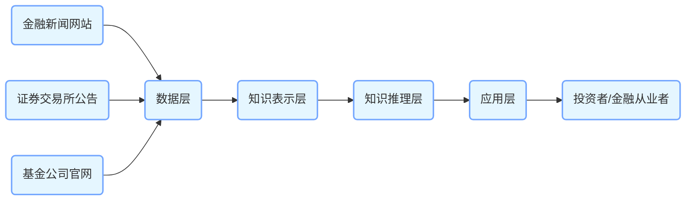

# 打造全面的投资理财知识图谱：方法与工具

> 关键词：投资理财、知识图谱、构建方法、工具、数据融合

> 摘要：本文聚焦于打造全面的投资理财知识图谱，深入探讨其构建的方法与所涉及的工具。首先介绍了相关背景知识，包括目的、预期读者等。接着阐述核心概念，剖析投资理财知识图谱的原理与架构。详细讲解了核心算法原理，并通过 Python 代码进行说明，同时给出相关数学模型和公式。在项目实战部分，从开发环境搭建到源代码实现与解读进行了全面介绍。随后探讨了投资理财知识图谱的实际应用场景，推荐了学习、开发等相关工具和资源。最后对未来发展趋势与挑战进行总结，还设有附录解答常见问题，并提供扩展阅读与参考资料，旨在为读者提供一个全面深入了解投资理财知识图谱构建的技术指南。

## 1. 背景介绍 
### 1.1 目的和范围
在当今复杂多变的金融市场中，投资理财信息海量且分散，投资者往往难以快速、准确地获取所需的有效信息。打造全面的投资理财知识图谱的目的在于整合各类投资理财相关知识，包括金融产品信息、市场动态、投资策略等，构建一个结构化、语义化的知识体系，以支持智能投资决策、风险评估、知识问答等应用。

本文章的范围涵盖了投资理财知识图谱的构建全过程，从核心概念的理解，到构建方法的详细阐述，再到实际应用场景的探讨，以及相关工具和资源的推荐等。

### 1.2 预期读者
本文预期读者包括对投资理财和知识图谱技术感兴趣的金融从业者、数据科学家、人工智能开发者、研究人员以及希望深入了解投资理财知识管理和智能应用的爱好者。

### 1.3 文档结构概述
本文将按照以下结构展开：首先介绍相关背景知识，包括目的、预期读者等；接着阐述核心概念，剖析投资理财知识图谱的原理与架构；详细讲解核心算法原理，并通过 Python 代码进行说明，同时给出相关数学模型和公式；在项目实战部分，从开发环境搭建到源代码实现与解读进行全面介绍；随后探讨投资理财知识图谱的实际应用场景；推荐学习、开发等相关工具和资源；最后对未来发展趋势与挑战进行总结，还设有附录解答常见问题，并提供扩展阅读与参考资料。

### 1.4 术语表
#### 1.4.1 核心术语定义
- **知识图谱**：一种语义网络，用于描述实体（如人、金融产品等）及其之间的关系（如投资关系、风险关联等），以结构化的方式表示知识。
- **投资理财**：对财务进行管理，以实现财务的保值、增值为目的，包括投资股票、基金、债券等多种金融活动。
- **实体**：知识图谱中具有明确意义的对象，如股票、基金公司、投资者等。
- **关系**：实体之间的关联，如“持有”“发行”“投资于”等。

#### 1.4.2 相关概念解释
- **语义化**：将数据赋予明确的语义信息，使得计算机能够理解数据的含义和关系，从而实现更智能的处理和推理。
- **数据融合**：将来自不同数据源的投资理财信息进行整合，消除数据冗余和冲突，形成统一的知识表示。

#### 1.4.3 缩略词列表
- **RDF**：Resource Description Framework（资源描述框架）
- **OWL**：Web Ontology Language（网络本体语言）
- **SPARQL**：SPARQL Protocol and RDF Query Language（SPARQL 协议和 RDF 查询语言）

## 2. 核心概念与联系 

### 核心概念原理
投资理财知识图谱是一种基于图结构的数据模型，它将投资理财领域的各种实体（如股票、基金、债券、投资者、金融机构等）作为节点，实体之间的关系（如发行、持有、投资等）作为边，通过这种方式将复杂的投资理财知识以可视化和结构化的形式呈现出来。

其原理基于语义网技术，利用 RDF 来描述实体和关系，OWL 来定义本体，从而实现对投资理财知识的语义化表示。通过知识图谱，不仅可以存储和查询投资理财信息，还可以进行知识推理，发现潜在的知识和关系。

### 架构的文本示意图
投资理财知识图谱的架构主要包括数据层、知识表示层、知识推理层和应用层。

- **数据层**：收集来自各种数据源的投资理财信息，如金融新闻网站、证券交易所公告、基金公司官网等。这些数据可以是结构化的（如数据库中的表格）、半结构化的（如 XML 文件）或非结构化的（如新闻文本）。
- **知识表示层**：对收集到的数据进行清洗、预处理，然后将其转换为 RDF 三元组（实体 - 关系 - 实体）的形式，存储在图数据库中。同时，使用 OWL 定义本体，明确实体和关系的类型和属性。
- **知识推理层**：基于本体和规则进行知识推理，发现新的知识和关系。例如，根据已知的投资关系和风险评估信息，推理出某个投资者的潜在风险。
- **应用层**：提供各种应用接口，如知识问答、智能投资决策、风险评估等，为投资者和金融从业者提供服务。

### Mermaid 流程图


## 3. 核心算法原理 & 具体操作步骤 

### 核心算法原理
构建投资理财知识图谱的核心算法主要包括实体识别、关系抽取和知识融合。

- **实体识别**：从文本数据中识别出投资理财领域的实体，如股票名称、基金代码、投资者姓名等。常用的方法有基于规则的方法、基于机器学习的方法（如条件随机场 CRF、循环神经网络 RNN 等）和基于深度学习的方法（如 BERT 等）。

- **关系抽取**：确定实体之间的关系，如“发行”“持有”“投资于”等。常见的方法有基于模式匹配的方法、基于监督学习的方法（如支持向量机 SVM、神经网络等）和基于深度学习的端到端方法（如卷积神经网络 CNN 等）。

- **知识融合**：将来自不同数据源的知识进行整合，消除数据冗余和冲突。常用的方法有基于相似度计算的方法、基于聚类的方法和基于本体的方法。

### 具体操作步骤及 Python 源代码

#### 实体识别（基于 BERT）
```python
import torch
from transformers import AutoTokenizer, AutoModelForTokenClassification

# 加载预训练的 BERT 模型和分词器
tokenizer = AutoTokenizer.from_pretrained("dslim/bert-base-NER")
model = AutoModelForTokenClassification.from_pretrained("dslim/bert-base-NER")

# 待识别的文本
text = "张三投资了 10000 元购买了贵州茅台的股票。"

# 对文本进行分词
inputs = tokenizer(text, return_tensors="pt")

# 进行实体识别
with torch.no_grad():
    outputs = model(**inputs)

# 获取预测结果
logits = outputs.logits
predicted_class_ids = logits.argmax(-1)
predicted_labels = [model.config.id2label[id.item()] for id in predicted_class_ids[0]]

# 打印结果
tokens = tokenizer.convert_ids_to_tokens(inputs["input_ids"][0])
for token, label in zip(tokens, predicted_labels):
    print(token, label)
```

#### 关系抽取（基于 CNN）
```python
import torch
import torch.nn as nn
import torch.optim as optim
from torch.utils.data import Dataset, DataLoader

# 定义 CNN 模型
class CNNRelationExtractor(nn.Module):
    def __init__(self, vocab_size, embedding_dim, num_filters, filter_sizes, num_classes):
        super(CNNRelationExtractor, self).__init__()
        self.embedding = nn.Embedding(vocab_size, embedding_dim)
        self.convs = nn.ModuleList([
            nn.Conv2d(1, num_filters, (fs, embedding_dim)) for fs in filter_sizes
        ])
        self.fc = nn.Linear(len(filter_sizes) * num_filters, num_classes)

    def forward(self, x):
        x = self.embedding(x).unsqueeze(1)
        x = [torch.relu(conv(x)).squeeze(3) for conv in self.convs]
        x = [torch.max_pool1d(i, i.size(2)).squeeze(2) for i in x]
        x = torch.cat(x, 1)
        x = self.fc(x)
        return x

# 示例数据
vocab_size = 1000
embedding_dim = 100
num_filters = 100
filter_sizes = [3, 4, 5]
num_classes = 5

# 初始化模型
model = CNNRelationExtractor(vocab_size, embedding_dim, num_filters, filter_sizes, num_classes)

# 定义损失函数和优化器
criterion = nn.CrossEntropyLoss()
optimizer = optim.Adam(model.parameters(), lr=0.001)

# 模拟训练过程
# 这里省略数据加载和训练循环的详细代码
```

#### 知识融合（基于相似度计算）
```python
import numpy as np

# 定义两个实体的特征向量
entity1 = np.array([0.1, 0.2, 0.3])
entity2 = np.array([0.15, 0.22, 0.31])

# 计算余弦相似度
cosine_similarity = np.dot(entity1, entity2) / (np.linalg.norm(entity1) * np.linalg.norm(entity2))

print("余弦相似度:", cosine_similarity)
```

## 4. 数学模型和公式 & 详细讲解 & 举例说明 

### 实体识别（基于 CRF）
#### 数学模型和公式
条件随机场（CRF）是一种概率图模型，用于序列标注任务。在实体识别中，给定输入序列 $x = (x_1, x_2, \cdots, x_n)$ 和标签序列 $y = (y_1, y_2, \cdots, y_n)$，CRF 模型的目标是计算条件概率 $P(y|x)$。

CRF 模型的条件概率公式为：
$$P(y|x) = \frac{1}{Z(x)} \exp \left( \sum_{i=1}^{n} \sum_{k=1}^{K} \lambda_k t_k(y_{i-1}, y_i, x, i) + \sum_{i=1}^{n} \sum_{l=1}^{L} \mu_l s_l(y_i, x, i) \right)$$
其中，$Z(x)$ 是归一化因子，$t_k$ 是转移特征函数，$s_l$ 是状态特征函数，$\lambda_k$ 和 $\mu_l$ 是对应的权重参数。

#### 详细讲解
转移特征函数 $t_k(y_{i-1}, y_i, x, i)$ 用于描述相邻标签之间的转移关系，状态特征函数 $s_l(y_i, x, i)$ 用于描述当前标签与输入序列的关系。通过训练数据学习这些特征函数的权重参数，使得模型能够对输入序列进行准确的标签预测。

#### 举例说明
假设输入序列 $x =$ "张三投资了 10000 元购买了贵州茅台的股票。"，标签集合为 $\{PER, ORG, MONEY, STOCK\}$（分别表示人名、机构名、金额、股票名）。在训练过程中，CRF 模型会学习到如“人名后面接动作词时，下一个标签可能是金融动作相关”等特征关系，从而对输入序列进行实体识别。

### 关系抽取（基于 SVM）
#### 数学模型和公式
支持向量机（SVM）是一种二分类模型，在关系抽取中可以将其扩展为多分类模型。对于给定的训练数据集 $\{(x_1, y_1), (x_2, y_2), \cdots, (x_n, y_n)\}$，其中 $x_i$ 是特征向量，$y_i \in \{-1, +1\}$ 是类别标签，SVM 的目标是找到一个最优的超平面 $w^T x + b = 0$，使得不同类别的样本能够被最大间隔地分开。

SVM 的优化目标可以表示为：
$$\min_{w, b, \xi} \frac{1}{2} w^T w + C \sum_{i=1}^{n} \xi_i$$
$$\text{s.t. } y_i (w^T x_i + b) \geq 1 - \xi_i, \xi_i \geq 0, i = 1, 2, \cdots, n$$
其中，$C$ 是惩罚参数，$\xi_i$ 是松弛变量。

#### 详细讲解
SVM 通过求解上述优化问题，找到最优的权重向量 $w$ 和偏置 $b$，从而确定超平面。在关系抽取中，将实体对的特征向量作为输入，通过训练好的 SVM 模型预测它们之间的关系类别。

#### 举例说明
假设我们要判断两个实体“张三”和“贵州茅台”之间的关系，提取它们的特征向量（如共现次数、上下文信息等），输入到训练好的 SVM 模型中，模型会根据特征向量判断它们之间的关系是“投资于”还是其他关系。

### 知识融合（基于 Jaccard 相似度）
#### 数学模型和公式
Jaccard 相似度用于衡量两个集合的相似程度。对于两个集合 $A$ 和 $B$，Jaccard 相似度定义为：
$$J(A, B) = \frac{|A \cap B|}{|A \cup B|}$$
其中，$|A \cap B|$ 表示集合 $A$ 和 $B$ 的交集的元素个数，$|A \cup B|$ 表示集合 $A$ 和 $B$ 的并集的元素个数。

#### 详细讲解
在知识融合中，将实体的属性集合作为集合 $A$ 和 $B$，通过计算 Jaccard 相似度来判断两个实体是否为同一实体。如果相似度超过某个阈值，则认为它们是同一实体，可以进行合并。

#### 举例说明
假设实体 $A$ 的属性集合为 $\{名称: 贵州茅台, 行业: 白酒, 上市时间: 2001 年\}$，实体 $B$ 的属性集合为 $\{名称: 贵州茅台酒股份有限公司, 行业: 白酒, 上市时间: 2001 年\}$。计算它们的 Jaccard 相似度：
$$A \cap B = \{行业: 白酒, 上市时间: 2001 年\}$$
$$A \cup B = \{名称: 贵州茅台, 名称: 贵州茅台酒股份有限公司, 行业: 白酒, 上市时间: 2001 年\}$$
$$J(A, B) = \frac{2}{3}$$
如果阈值设定为 0.5，则可以认为实体 $A$ 和 $B$ 是同一实体，进行合并。

## 5. 项目实战：代码实际案例和详细解释说明 

### 5.1  开发环境搭建
#### 硬件环境
- 处理器：Intel Core i7 及以上
- 内存：16GB 及以上
- 硬盘：500GB 及以上可用空间

#### 软件环境
- 操作系统：Windows 10、Linux（如 Ubuntu 18.04）或 macOS
- Python 环境：Python 3.7 及以上
- 图数据库：Neo4j 或 JanusGraph
- 深度学习框架：PyTorch 或 TensorFlow

#### 安装步骤
1. **Python 环境安装**：从 Python 官方网站下载并安装 Python 3.7 及以上版本。安装完成后，使用 `pip` 安装所需的库，如 `transformers`、`torch`、`numpy` 等。
```bash
pip install transformers torch numpy
```
2. **图数据库安装**：以 Neo4j 为例，从 Neo4j 官方网站下载并安装 Neo4j 社区版。安装完成后，启动 Neo4j 服务，并创建一个新的数据库。
3. **深度学习框架安装**：根据自己的需求选择安装 PyTorch 或 TensorFlow。以 PyTorch 为例，根据自己的 CUDA 版本和操作系统选择合适的安装命令，如：
```bash
pip install torch torchvision torchaudio
```

### 5.2  源代码详细实现和代码解读
#### 数据收集与预处理
```python
import requests
from bs4 import BeautifulSoup

# 定义数据收集函数
def collect_data(url):
    response = requests.get(url)
    soup = BeautifulSoup(response.text, 'html.parser')
    # 提取所需信息，这里只是示例，具体提取规则根据实际情况调整
    text = soup.get_text()
    return text

# 示例 URL
url = "https://finance.example.com/news"
data = collect_data(url)

# 数据预处理，如去除特殊字符、分词等
import re
from nltk.tokenize import word_tokenize

def preprocess_data(text):
    text = re.sub(r'[^\w\s]', '', text)
    tokens = word_tokenize(text)
    return tokens

preprocessed_data = preprocess_data(data)
```
**代码解读**：
- `collect_data` 函数使用 `requests` 库发送 HTTP 请求获取网页内容，然后使用 `BeautifulSoup` 库解析 HTML 页面，提取所需的文本信息。
- `preprocess_data` 函数使用正则表达式去除特殊字符，然后使用 `nltk` 库的 `word_tokenize` 函数进行分词。

#### 实体识别与关系抽取
```python
# 实体识别（使用之前的 BERT 代码）
import torch
from transformers import AutoTokenizer, AutoModelForTokenClassification

tokenizer = AutoTokenizer.from_pretrained("dslim/bert-base-NER")
model = AutoModelForTokenClassification.from_pretrained("dslim/bert-base-NER")

inputs = tokenizer(" ".join(preprocessed_data), return_tensors="pt")
with torch.no_grad():
    outputs = model(**inputs)

logits = outputs.logits
predicted_class_ids = logits.argmax(-1)
predicted_labels = [model.config.id2label[id.item()] for id in predicted_class_ids[0]]

# 关系抽取（简单示例，假设已经有训练好的模型）
class RelationExtractor:
    def __init__(self):
        # 这里可以加载训练好的模型
        pass

    def extract_relations(self, entities):
        # 简单模拟关系抽取
        relations = []
        for i in range(len(entities) - 1):
            relations.append((entities[i], "关联", entities[i + 1]))
        return relations

entities = []
for token, label in zip(tokenizer.convert_ids_to_tokens(inputs["input_ids"][0]), predicted_labels):
    if label != "O":
        entities.append(token)

extractor = RelationExtractor()
relations = extractor.extract_relations(entities)
```
**代码解读**：
- 实体识别部分使用预训练的 BERT 模型对预处理后的数据进行实体识别，得到每个词的实体标签。
- 关系抽取部分定义了一个简单的 `RelationExtractor` 类，模拟关系抽取过程，将相邻的实体之间建立“关联”关系。

#### 知识图谱构建与存储
```python
from py2neo import Graph, Node, Relationship

# 连接到 Neo4j 数据库
graph = Graph("bolt://localhost:7687", auth=("neo4j", "password"))

# 创建实体节点和关系
for entity in entities:
    node = Node("Entity", name=entity)
    graph.create(node)

for relation in relations:
    start_node = graph.nodes.match("Entity", name=relation[0]).first()
    end_node = graph.nodes.match("Entity", name=relation[2]).first()
    if start_node and end_node:
        rel = Relationship(start_node, relation[1], end_node)
        graph.create(rel)
```
**代码解读**：
- 使用 `py2neo` 库连接到 Neo4j 数据库。
- 遍历实体列表，创建实体节点并存储到数据库中。
- 遍历关系列表，找到对应的实体节点，创建关系并存储到数据库中。

### 5.3  代码解读与分析
#### 数据收集与预处理
数据收集部分通过网络爬虫获取网页信息，需要注意遵守网站的爬虫规则，避免被封禁。数据预处理是为了提高后续实体识别和关系抽取的准确性，去除噪声数据。

#### 实体识别与关系抽取
实体识别使用预训练的 BERT 模型，能够利用大规模语料的知识，提高识别的准确性。关系抽取部分只是简单示例，实际应用中需要使用更复杂的模型和算法，如 CNN、SVM 等，并进行大量的训练。

#### 知识图谱构建与存储
使用 Neo4j 作为图数据库，能够方便地存储和查询知识图谱。在构建知识图谱时，需要注意节点和关系的类型和属性的定义，以便后续的知识推理和应用。

## 6. 实际应用场景 
### 智能投资决策
投资理财知识图谱可以整合各种金融产品信息、市场动态、投资者偏好等知识，通过知识推理和分析，为投资者提供个性化的投资建议。例如，根据投资者的风险承受能力、投资目标和当前市场情况，推荐适合的股票、基金等金融产品。

### 风险评估
通过知识图谱可以分析金融产品之间的关联关系、投资者的投资组合等信息，对投资风险进行评估。例如，发现某个投资者的投资组合过于集中在某个行业或某几只股票上，提示其可能面临的风险。

### 知识问答
投资者可以通过自然语言查询投资理财知识图谱，获取相关的信息和答案。例如，询问“贵州茅台的市盈率是多少？”“如何选择基金？”等问题，知识图谱能够自动回答这些问题。

### 金融监管
监管机构可以利用投资理财知识图谱监测金融市场的异常行为和风险。例如，通过分析金融机构之间的资金流动关系、企业的股权结构等信息，发现潜在的金融风险和违规行为。

## 7. 工具和资源推荐
### 7.1 学习资源推荐
#### 7.1.1 书籍推荐
- 《知识图谱：方法、实践与应用》：全面介绍了知识图谱的基本概念、构建方法和应用场景，是学习知识图谱的经典书籍。
- 《Python 数据分析实战》：介绍了 Python 在数据分析领域的应用，包括数据处理、可视化等内容，对于处理投资理财数据非常有帮助。
- 《深度学习》：由深度学习领域的三位顶尖专家编写，系统地介绍了深度学习的基本原理和算法，对于理解和应用深度学习模型进行实体识别和关系抽取很有帮助。

#### 7.1.2 在线课程
- Coursera 上的“Knowledge Graphs”课程：由知名教授授课，深入讲解知识图谱的理论和实践。
- 中国大学 MOOC 上的“Python 语言程序设计”课程：适合初学者学习 Python 编程，为后续的开发工作打下基础。
- edX 上的“Deep Learning Specialization”课程：由深度学习领域的权威专家 Andrew Ng 授课，全面介绍深度学习的各个方面。

#### 7.1.3 技术博客和网站
- 语义网技术博客（https://www.semantic-web-journal.net/）：提供语义网和知识图谱领域的最新研究成果和技术动态。
- 开源中国（https://www.oschina.net/）：提供丰富的开源项目和技术文章，包括知识图谱相关的内容。
- 掘金（https://juejin.cn/）：有很多开发者分享的技术文章和经验，对于学习和实践投资理财知识图谱很有帮助。

### 7.2 开发工具框架推荐
#### 7.2.1 IDE和编辑器
- PyCharm：功能强大的 Python 集成开发环境，支持代码编辑、调试、版本控制等功能，提高开发效率。
- Visual Studio Code：轻量级的代码编辑器，支持多种编程语言和插件扩展，适合快速开发和调试。

#### 7.2.2 调试和性能分析工具
- Py-Spy：用于分析 Python 程序的性能瓶颈，找出程序中耗时较长的部分。
- TensorBoard：用于可视化深度学习模型的训练过程和性能指标，帮助开发者优化模型。

#### 7.2.3 相关框架和库
- PyTorch：开源的深度学习框架，提供丰富的神经网络模型和工具，方便进行实体识别和关系抽取的开发。
- SpaCy：用于自然语言处理的 Python 库，提供高效的实体识别和关系抽取功能。
- RDFlib：用于处理 RDF 数据的 Python 库，方便进行知识图谱的构建和查询。

### 7.3 相关论文著作推荐
#### 7.3.1 经典论文
- “Knowledge Graph Embedding: A Survey of Approaches and Applications”：对知识图谱嵌入技术进行了全面的综述，介绍了各种知识图谱嵌入方法和应用场景。
- “Entity Recognition and Classification in News”：提出了一种基于机器学习的实体识别和分类方法，对于投资理财领域的实体识别有一定的参考价值。

#### 7.3.2 最新研究成果
- 在 AAAI、IJCAI、KDD 等顶级学术会议上发表的关于知识图谱和投资理财的研究论文，关注最新的技术和方法。

#### 7.3.3 应用案例分析
- 金融机构和科技公司发布的关于投资理财知识图谱应用的案例分析报告，了解实际应用中的经验和挑战。

## 8. 总结：未来发展趋势与挑战
### 未来发展趋势
- **多源数据融合**：未来的投资理财知识图谱将整合更多来源的数据，包括社交媒体数据、物联网数据等，以获取更全面的信息。
- **与人工智能技术的深度融合**：结合深度学习、强化学习等人工智能技术，实现更智能的投资决策和风险评估。
- **跨领域知识图谱的构建**：将投资理财知识图谱与其他领域的知识图谱进行融合，如宏观经济、行业分析等，提供更全面的决策支持。

### 挑战
- **数据质量和一致性**：由于数据来源广泛，数据质量和一致性难以保证，需要有效的数据清洗和融合方法。
- **知识推理的准确性**：知识推理是投资理财知识图谱的重要功能，但目前的推理方法还存在一定的局限性，需要进一步提高推理的准确性。
- **隐私和安全问题**：投资理财涉及大量的个人和金融信息，如何保护这些信息的隐私和安全是一个重要的挑战。

## 9. 附录：常见问题与解答
### 问题 1：如何选择合适的实体识别和关系抽取算法？
解答：选择合适的算法需要考虑数据特点、任务需求和计算资源等因素。如果数据量较小，可以选择基于规则的方法；如果数据量较大，可以选择基于机器学习或深度学习的方法。同时，还需要进行实验和评估，选择性能最优的算法。

### 问题 2：知识图谱构建过程中如何处理数据冲突？
解答：处理数据冲突可以采用基于相似度计算、聚类分析和本体约束等方法。通过计算实体之间的相似度，将相似的实体进行合并；通过聚类分析将数据进行分组，找出冲突的数据；利用本体约束检查数据的一致性，解决冲突问题。

### 问题 3：如何评估投资理财知识图谱的质量？
解答：可以从知识完整性、准确性、一致性和可用性等方面评估投资理财知识图谱的质量。例如，检查知识图谱中是否包含了足够的投资理财知识，实体和关系的标注是否准确，数据是否一致，以及是否能够满足实际应用的需求等。

## 10. 扩展阅读 & 参考资料
### 扩展阅读
- 《人工智能时代的金融科技》：探讨了人工智能技术在金融领域的应用和发展趋势，对于理解投资理财知识图谱的应用背景有帮助。
- 《大数据与金融》：介绍了大数据技术在金融领域的应用，包括数据挖掘、风险评估等内容，与投资理财知识图谱的构建和应用密切相关。

### 参考资料
- [1] 李航. 统计学习方法（第 2 版）[M]. 清华大学出版社, 2019.
- [2] 周志华. 机器学习[M]. 清华大学出版社, 2016.
- [3] 知识图谱官方文档（https://www.w3.org/standards/semanticweb/data）
- [4] Neo4j 官方文档（https://neo4j.com/docs/）
- [5] PyTorch 官方文档（https://pytorch.org/docs/）