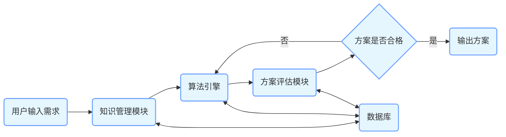

# 技术创新系统：方案生成平台

> 关键词：技术创新系统、方案生成平台、创新算法、数学模型、实际应用场景

> 摘要：本文围绕技术创新系统中的方案生成平台展开深入探讨。首先介绍了该平台提出的背景、目的、预期读者等内容，接着阐述了核心概念与联系，包括原理和架构。详细讲解了核心算法原理并给出 Python 源代码示例，同时介绍了相关数学模型和公式。通过项目实战部分，展示了平台代码的实际案例及详细解释。探讨了其实际应用场景，推荐了学习、开发相关的工具和资源。最后总结了未来发展趋势与挑战，并给出常见问题解答及参考资料，旨在全面深入地剖析技术创新系统中的方案生成平台，为相关领域的研究和实践提供有价值的参考。

## 1. 背景介绍 
### 1.1 目的和范围
在当今快速发展的科技时代，技术创新对于企业和社会的发展至关重要。技术创新系统中的方案生成平台旨在帮助企业、科研机构等快速、高效地生成创新方案，以应对不断变化的市场需求和技术挑战。其范围涵盖了多个领域，如产品研发、工艺改进、商业模式创新等。通过该平台，用户可以利用先进的算法和模型，结合自身的需求和资源，生成具有创新性和可行性的方案。

### 1.2 预期读者
本文的预期读者包括从事技术创新研究的科研人员、企业的研发部门人员、创新管理领域的从业者以及对技术创新系统感兴趣的技术爱好者。这些读者希望通过了解方案生成平台的原理、实现和应用，提升自身在技术创新方面的能力和水平。

### 1.3 文档结构概述
本文首先介绍背景信息，让读者了解方案生成平台的意义和目标。接着阐述核心概念与联系，帮助读者理解平台的基本原理和架构。然后详细讲解核心算法原理和具体操作步骤，通过 Python 代码示例进行说明。之后介绍相关数学模型和公式，并举例说明其应用。项目实战部分展示代码实际案例和详细解释。随后探讨实际应用场景，推荐相关工具和资源。最后总结未来发展趋势与挑战，给出常见问题解答和参考资料。

### 1.4 术语表
#### 1.4.1 核心术语定义
- **技术创新系统**：是一个包含多个要素和环节的复杂系统，旨在推动技术的创新和发展，提高企业或组织的竞争力。
- **方案生成平台**：是技术创新系统中的一个重要组成部分，它利用先进的算法和模型，根据用户的需求和输入信息，生成创新方案的软件平台。
- **创新算法**：是方案生成平台的核心算法，用于挖掘潜在的创新点和生成创新方案。

#### 1.4.2 相关概念解释
- **知识图谱**：是一种用于表示知识和信息的图结构，它可以将不同的实体和它们之间的关系进行可视化和建模，为方案生成提供知识支持。
- **机器学习**：是一门多领域交叉学科，涉及概率论、统计学、逼近论、凸分析、算法复杂度理论等多门学科。它专门研究计算机怎样模拟或实现人类的学习行为，以获取新的知识或技能，重新组织已有的知识结构使之不断改善自身的性能。

#### 1.4.3 缩略词列表
- **AI**：Artificial Intelligence，人工智能
- **ML**：Machine Learning，机器学习
- **KG**：Knowledge Graph，知识图谱

## 2. 核心概念与联系 
### 核心概念原理
技术创新系统中的方案生成平台基于多种技术和理论，其核心原理是通过对大量的知识和信息进行分析、挖掘和整合，结合用户的需求和约束条件，生成具有创新性和可行性的方案。具体来说，平台利用知识图谱来表示和存储相关领域的知识，通过机器学习算法对知识图谱进行挖掘和分析，发现潜在的创新点和关系。然后，根据用户输入的需求和约束条件，利用优化算法生成满足要求的创新方案。

### 架构的文本示意图
方案生成平台主要由以下几个部分组成：
1. **用户界面**：用于用户输入需求和获取生成的方案，提供友好的交互界面。
2. **知识管理模块**：负责知识图谱的构建、维护和更新，存储和管理相关领域的知识。
3. **算法引擎**：包含创新算法、机器学习算法和优化算法等，用于对知识进行挖掘和分析，生成创新方案。
4. **方案评估模块**：对生成的方案进行评估和筛选，确保方案的创新性和可行性。
5. **数据库**：存储用户信息、知识图谱数据、生成的方案等数据。

### Mermaid 流程图


## 3. 核心算法原理 & 具体操作步骤 
### 核心算法原理
方案生成平台的核心算法主要包括知识图谱挖掘算法、创新算法和优化算法。

#### 知识图谱挖掘算法
知识图谱挖掘算法用于从知识图谱中发现潜在的知识和关系。常用的算法有图嵌入算法，如 DeepWalk、Node2Vec 等。这些算法可以将知识图谱中的节点和边表示为低维向量，以便于后续的分析和处理。

#### 创新算法
创新算法基于知识图谱挖掘的结果，通过对知识的组合和变换，发现潜在的创新点。一种简单的创新算法可以是对知识图谱中的节点和边进行随机组合，然后评估组合的创新性。

#### 优化算法
优化算法用于在生成的方案中选择最优的方案。常用的优化算法有遗传算法、模拟退火算法等。这些算法可以在满足用户需求和约束条件的前提下，寻找最优的方案。

### 具体操作步骤
1. **数据准备**：收集和整理相关领域的知识和信息，构建知识图谱。
2. **知识图谱挖掘**：使用图嵌入算法对知识图谱进行挖掘，得到节点和边的向量表示。
3. **创新方案生成**：利用创新算法对知识图谱挖掘的结果进行组合和变换，生成潜在的创新方案。
4. **方案评估**：使用评估指标对生成的方案进行评估，筛选出符合要求的方案。
5. **方案优化**：使用优化算法对筛选出的方案进行优化，得到最优的方案。

### Python 源代码示例
```python
import networkx as nx
import numpy as np
from sklearn.manifold import TSNE
import random

# 构建知识图谱
G = nx.Graph()
G.add_nodes_from([1, 2, 3, 4, 5])
G.add_edges_from([(1, 2), (2, 3), (3, 4), (4, 5)])

# 知识图谱挖掘：使用 Node2Vec 算法
def node2vec(G, dimensions=64, walk_length=80, num_walks=10, workers=4):
    from node2vec import Node2Vec
    node2vec = Node2Vec(G, dimensions=dimensions, walk_length=walk_length, num_walks=num_walks, workers=workers)
    model = node2vec.fit()
    return model

model = node2vec(G)

# 创新方案生成：随机组合节点
def generate_innovative_schemes(model, num_schemes=10):
    nodes = list(model.wv.vocab.keys())
    schemes = []
    for _ in range(num_schemes):
        random_nodes = random.sample(nodes, 2)
        schemes.append(random_nodes)
    return schemes

schemes = generate_innovative_schemes(model)

# 方案评估：简单的评估指标，这里假设节点距离越远越创新
def evaluate_schemes(model, schemes):
    scores = []
    for scheme in schemes:
        node1, node2 = scheme
        score = np.linalg.norm(model.wv[node1] - model.wv[node2])
        scores.append(score)
    return scores

scores = evaluate_schemes(model, schemes)

# 方案优化：选择得分最高的方案
best_scheme_index = np.argmax(scores)
best_scheme = schemes[best_scheme_index]

print("Best scheme:", best_scheme)
```

## 4. 数学模型和公式 & 详细讲解 & 举例说明 
### 图嵌入算法的数学模型
以 DeepWalk 算法为例，其核心思想是通过随机游走生成节点的序列，然后使用 Skip - Gram 模型对节点序列进行训练，得到节点的向量表示。

#### Skip - Gram 模型的目标函数
Skip - Gram 模型的目标是最大化给定中心节点 $v$ 时，其上下文节点 $u$ 出现的概率。目标函数可以表示为：
$$
\max_{\theta} \prod_{v \in V} \prod_{-c \leq j \leq c, j \neq 0} P(u_{j} | v; \theta)
$$
其中，$V$ 是节点集合，$c$ 是上下文窗口大小，$\theta$ 是模型的参数。

#### 概率 $P(u | v; \theta)$ 的计算
概率 $P(u | v; \theta)$ 可以通过 softmax 函数计算：
$$
P(u | v; \theta) = \frac{\exp(\mathbf{u}^{\top} \mathbf{v})}{\sum_{w \in V} \exp(\mathbf{w}^{\top} \mathbf{v})}
$$
其中，$\mathbf{u}$ 和 $\mathbf{v}$ 分别是节点 $u$ 和 $v$ 的向量表示。

### 创新算法的数学模型
创新算法可以通过对知识图谱中的节点和边进行组合和变换来实现。假设知识图谱中的节点集合为 $V$，边集合为 $E$，创新方案可以表示为节点和边的组合。

#### 创新方案的表示
一个创新方案 $S$ 可以表示为：
$$
S = (V_{S}, E_{S})
$$
其中，$V_{S} \subseteq V$ 是方案中包含的节点集合，$E_{S} \subseteq E$ 是方案中包含的边集合。

#### 创新方案的评估指标
创新方案的评估指标可以根据具体的需求和应用场景进行定义。例如，可以定义创新方案的创新性得分 $I(S)$ 为：
$$
I(S) = \sum_{v \in V_{S}} \text{novelty}(v) + \sum_{e \in E_{S}} \text{novelty}(e)
$$
其中，$\text{novelty}(v)$ 和 $\text{novelty}(e)$ 分别是节点 $v$ 和边 $e$ 的新颖性得分。

### 优化算法的数学模型
以遗传算法为例，其基本思想是通过模拟生物进化的过程，不断迭代优化方案。

#### 适应度函数
适应度函数 $f(S)$ 用于评估每个方案 $S$ 的优劣。在方案生成平台中，适应度函数可以根据创新方案的评估指标进行定义。

#### 遗传操作
遗传算法的主要遗传操作包括选择、交叉和变异。选择操作根据适应度函数选择优秀的方案作为父代，交叉操作将父代的基因进行交换，生成子代方案，变异操作对方案的基因进行随机改变，增加种群的多样性。

### 举例说明
假设我们有一个简单的知识图谱，包含 5 个节点和 4 条边。使用 DeepWalk 算法对知识图谱进行挖掘，得到节点的向量表示。然后，通过随机组合节点生成创新方案，使用上述的评估指标对方案进行评估。最后，使用遗传算法对方案进行优化，得到最优的方案。

## 5. 项目实战：代码实际案例和详细解释说明 
### 5.1  开发环境搭建
#### 操作系统
可以选择 Windows、Linux 或 macOS 操作系统。

#### 编程语言
使用 Python 编程语言，推荐使用 Python 3.7 及以上版本。

#### 开发工具
可以使用 PyCharm、Jupyter Notebook 等开发工具。

#### 依赖库安装
在命令行中执行以下命令安装所需的依赖库：
```sh
pip install networkx node2vec numpy scikit-learn
```

### 5.2  源代码详细实现和代码解读
```python
import networkx as nx
import numpy as np
from sklearn.manifold import TSNE
import random
from node2vec import Node2Vec

# 构建知识图谱
G = nx.Graph()
# 添加节点
G.add_nodes_from([1, 2, 3, 4, 5])
# 添加边
G.add_edges_from([(1, 2), (2, 3), (3, 4), (4, 5)])

# 知识图谱挖掘：使用 Node2Vec 算法
def node2vec(G, dimensions=64, walk_length=80, num_walks=10, workers=4):
    """
    使用 Node2Vec 算法对知识图谱进行挖掘，得到节点的向量表示。
    :param G: 知识图谱
    :param dimensions: 向量维度
    :param walk_length: 随机游走的长度
    :param num_walks: 随机游走的次数
    :param workers: 并行处理的线程数
    :return: 节点向量模型
    """
    node2vec = Node2Vec(G, dimensions=dimensions, walk_length=walk_length, num_walks=num_walks, workers=workers)
    model = node2vec.fit()
    return model

model = node2vec(G)

# 创新方案生成：随机组合节点
def generate_innovative_schemes(model, num_schemes=10):
    """
    生成创新方案，通过随机组合节点。
    :param model: 节点向量模型
    :param num_schemes: 生成的方案数量
    :return: 创新方案列表
    """
    nodes = list(model.wv.vocab.keys())
    schemes = []
    for _ in range(num_schemes):
        random_nodes = random.sample(nodes, 2)
        schemes.append(random_nodes)
    return schemes

schemes = generate_innovative_schemes(model)

# 方案评估：简单的评估指标，这里假设节点距离越远越创新
def evaluate_schemes(model, schemes):
    """
    评估创新方案的得分，节点距离越远得分越高。
    :param model: 节点向量模型
    :param schemes: 创新方案列表
    :return: 方案得分列表
    """
    scores = []
    for scheme in schemes:
        node1, node2 = scheme
        score = np.linalg.norm(model.wv[node1] - model.wv[node2])
        scores.append(score)
    return scores

scores = evaluate_schemes(model, schemes)

# 方案优化：选择得分最高的方案
best_scheme_index = np.argmax(scores)
best_scheme = schemes[best_scheme_index]

print("Best scheme:", best_scheme)
```

### 5.3  代码解读与分析
1. **知识图谱构建**：使用 `networkx` 库构建一个简单的知识图谱，包含 5 个节点和 4 条边。
2. **知识图谱挖掘**：使用 `Node2Vec` 算法对知识图谱进行挖掘，得到节点的向量表示。`Node2Vec` 算法通过随机游走生成节点的序列，然后使用 Skip - Gram 模型对节点序列进行训练，得到节点的向量表示。
3. **创新方案生成**：通过随机组合节点生成创新方案。随机选择两个节点作为一个方案。
4. **方案评估**：使用节点之间的欧几里得距离作为评估指标，节点距离越远，方案的创新性越高。
5. **方案优化**：选择得分最高的方案作为最优方案。

## 6. 实际应用场景 
### 产品研发
在产品研发过程中，方案生成平台可以帮助企业快速生成创新的产品设计方案。通过对市场需求、技术趋势和竞争对手的分析，结合企业自身的资源和能力，平台可以生成多种产品设计方案，供企业选择和评估。例如，在电子产品研发中，平台可以根据用户的需求和技术发展趋势，生成不同功能和外观的产品设计方案。

### 工艺改进
方案生成平台可以应用于工艺改进领域。通过对现有工艺的分析和知识图谱的构建，平台可以发现潜在的工艺改进点，并生成相应的改进方案。例如，在制造业中，平台可以帮助企业优化生产流程，提高生产效率和产品质量。

### 商业模式创新
在商业模式创新方面，方案生成平台可以帮助企业发现新的商业机会和盈利模式。通过对市场环境、客户需求和行业趋势的分析，平台可以生成多种商业模式创新方案。例如，在互联网行业，平台可以帮助企业设计新的电子商务模式、共享经济模式等。

## 7. 工具和资源推荐
### 7.1 学习资源推荐
#### 7.1.1 书籍推荐
- 《Python 数据分析实战》：介绍了 Python 在数据分析领域的应用，包括数据处理、可视化和机器学习等方面的内容。
- 《知识图谱：方法、实践与应用》：全面介绍了知识图谱的基本概念、构建方法和应用场景。
- 《机器学习》：由周志华教授编写，是机器学习领域的经典教材，系统地介绍了机器学习的基本概念、算法和应用。

#### 7.1.2 在线课程
- Coursera 上的“Machine Learning”课程：由 Andrew Ng 教授讲授，是机器学习领域的经典在线课程。
- edX 上的“Data Science MicroMasters Program”课程：提供了数据科学领域的系统学习内容，包括数据分析、机器学习和深度学习等方面的课程。
- 中国大学 MOOC 上的“Python 语言程序设计”课程：适合初学者学习 Python 编程语言。

#### 7.1.3 技术博客和网站
- Medium：是一个技术博客平台，上面有很多关于技术创新、人工智能和机器学习等领域的优秀文章。
- arXiv：是一个预印本平台，提供了大量的学术论文，涵盖了计算机科学、物理学、数学等多个领域。
- 开源中国：是国内知名的开源技术社区，提供了很多开源项目和技术文章。

### 7.2 开发工具框架推荐
#### 7.2.1 IDE和编辑器
- PyCharm：是一款专门为 Python 开发设计的集成开发环境，提供了丰富的功能和插件，适合专业的 Python 开发者使用。
- Jupyter Notebook：是一个交互式的开发环境，适合数据科学家和机器学习工程师进行数据分析和模型开发。
- Visual Studio Code：是一款轻量级的代码编辑器，支持多种编程语言，具有丰富的插件和扩展功能。

#### 7.2.2 调试和性能分析工具
- PDB：是 Python 自带的调试工具，可以帮助开发者进行代码调试。
- cProfile：是 Python 自带的性能分析工具，可以帮助开发者分析代码的性能瓶颈。
- Py-Spy：是一个用于 Python 程序的性能分析工具，可以实时分析 Python 程序的性能。

#### 7.2.3 相关框架和库
- NetworkX：是一个用于构建和分析复杂网络的 Python 库，提供了丰富的图算法和数据结构。
- Node2Vec：是一个用于图嵌入的 Python 库，实现了 Node2Vec 算法。
- Scikit-learn：是一个用于机器学习的 Python 库，提供了丰富的机器学习算法和工具。

### 7.3 相关论文著作推荐
#### 7.3.1 经典论文
- “DeepWalk: Online Learning of Social Representations”：介绍了 DeepWalk 算法，是图嵌入领域的经典论文。
- “Node2Vec: Scalable Feature Learning for Networks”：提出了 Node2Vec 算法，在图嵌入领域具有重要的影响力。
- “Knowledge Graph Embedding: A Survey of Approaches and Applications”：对知识图谱嵌入的方法和应用进行了全面的综述。

#### 7.3.2 最新研究成果
- 可以通过 arXiv、ACM Digital Library 等学术平台查找关于技术创新系统、方案生成平台和知识图谱等领域的最新研究成果。

#### 7.3.3 应用案例分析
- 可以参考一些知名企业的技术创新案例，如 Google 的知识图谱应用、Amazon 的产品推荐系统等，了解方案生成平台在实际应用中的效果和经验。

## 8. 总结：未来发展趋势与挑战
### 未来发展趋势
1. **智能化程度不断提高**：随着人工智能技术的不断发展，方案生成平台将具备更强的智能化能力，能够自动理解用户的需求，生成更加精准和创新的方案。
2. **与其他技术的融合**：方案生成平台将与区块链、物联网等技术进行深度融合，拓展其应用场景和功能。例如，结合区块链技术可以实现方案的安全存储和共享，结合物联网技术可以获取更多的实时数据，为方案生成提供支持。
3. **跨领域应用**：方案生成平台将不再局限于某一个领域，而是向跨领域应用发展。例如，在医疗、教育、金融等领域都可以应用方案生成平台，帮助解决复杂的问题。

### 挑战
1. **知识图谱的构建和维护**：知识图谱的构建和维护是一个复杂的过程，需要大量的人力和物力投入。如何保证知识图谱的准确性、完整性和时效性是一个挑战。
2. **算法的可解释性**：一些先进的算法，如深度学习算法，具有较强的预测能力，但缺乏可解释性。在方案生成平台中，用户需要了解方案生成的过程和依据，因此如何提高算法的可解释性是一个重要的问题。
3. **数据安全和隐私保护**：方案生成平台需要处理大量的用户数据和知识图谱数据，如何保证数据的安全和隐私是一个挑战。需要采取有效的技术和管理措施，防止数据泄露和滥用。

## 9. 附录：常见问题与解答
### 1. 方案生成平台生成的方案一定是可行的吗？
方案生成平台生成的方案是基于知识图谱和算法进行推理和组合得到的，虽然经过了评估和筛选，但并不能保证一定是可行的。在实际应用中，还需要对生成的方案进行进一步的验证和评估，结合实际情况进行调整和优化。

### 2. 如何提高方案生成平台的创新能力？
可以通过以下几种方式提高方案生成平台的创新能力：
- 不断更新和完善知识图谱，引入更多的领域知识和创新案例。
- 优化创新算法，采用更先进的技术和方法，如深度学习、强化学习等。
- 结合用户的反馈和建议，不断改进方案生成平台的性能和功能。

### 3. 方案生成平台可以应用于哪些行业？
方案生成平台可以应用于多个行业，如制造业、服务业、医疗、教育、金融等。只要有创新需求和知识积累的行业，都可以使用方案生成平台来辅助创新。

## 10. 扩展阅读 & 参考资料
1. 《人工智能：一种现代的方法》
2. 《大数据时代：生活、工作与思维的大变革》
3. 李开复. 《人工智能》
4. 周志华. 《机器学习》
5. 相关学术论文和研究报告，如发表在 ACM、IEEE 等学术期刊和会议上的关于技术创新、知识图谱和机器学习的论文。
6. 开源项目和代码库，如 NetworkX、Node2Vec 等开源项目的官方文档和代码实现。