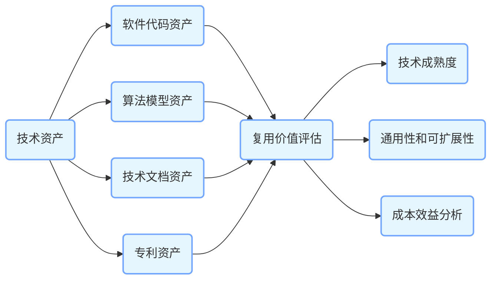

# 技术资产的智能管理：复用价值评估

> 关键词：技术资产、智能管理、复用价值评估、资产复用、价值量化

> 摘要：本文聚焦于技术资产的智能管理中的复用价值评估这一核心问题。首先介绍了技术资产智能管理及复用价值评估的背景知识，包括目的、预期读者等。接着深入探讨了核心概念与联系，详细阐述了核心算法原理并给出Python代码示例。通过数学模型和公式对复用价值评估进行量化分析，辅以实际例子说明。在项目实战部分，给出了开发环境搭建步骤、源代码实现与解读。分析了技术资产复用价值评估的实际应用场景，推荐了相关学习资源、开发工具框架以及论文著作。最后总结了未来发展趋势与挑战，提供常见问题解答和扩展阅读参考资料，旨在为技术资产的智能管理和复用价值评估提供全面、深入的技术指导和理论支持。

## 1. 背景介绍 
### 1.1 目的和范围
技术资产作为企业和组织的重要财富，其合理管理和有效复用对于提高效率、降低成本、提升创新能力具有至关重要的意义。本文章的目的在于深入探讨技术资产的智能管理中的复用价值评估方法，为企业和技术团队提供一套科学、可行的评估体系，帮助他们更好地识别和挖掘技术资产的复用潜力，从而优化资源配置，实现技术资产的最大化价值。

范围涵盖了各类技术资产，包括但不限于软件代码、算法模型、技术文档、专利等。同时，探讨了不同规模和领域的企业和组织在进行技术资产复用价值评估时可能遇到的问题和解决方案。

### 1.2 预期读者
本文预期读者主要包括企业的技术管理人员、软件架构师、程序员、数据分析师以及对技术资产智能管理和复用价值评估感兴趣的研究人员。对于技术管理人员，本文可以帮助他们制定更合理的技术资产战略和管理决策；对于软件架构师和程序员，提供了在实际开发中评估和复用技术资产的方法和思路；对于数据分析师，为其进行相关数据分析提供理论和技术支持；对于研究人员，则可以作为进一步深入研究的参考资料。

### 1.3 文档结构概述
本文将按照以下结构展开：首先介绍技术资产智能管理和复用价值评估的背景知识，包括目的、预期读者等；接着阐述核心概念与联系，给出相关的原理和架构示意图以及流程图；然后详细讲解核心算法原理，并使用Python源代码进行具体实现；通过数学模型和公式对复用价值进行量化分析，并举例说明；在项目实战部分，介绍开发环境搭建、源代码实现和代码解读；分析技术资产复用价值评估的实际应用场景；推荐相关的学习资源、开发工具框架和论文著作；最后总结未来发展趋势与挑战，提供常见问题解答和扩展阅读参考资料。

### 1.4 术语表
#### 1.4.1 核心术语定义
- **技术资产**：指企业或组织在技术研发、创新过程中积累的具有价值的技术成果和资源，包括软件代码、算法模型、技术文档、专利等。
- **智能管理**：利用先进的信息技术和智能算法，对技术资产进行自动化、智能化的管理和决策支持。
- **复用价值评估**：对技术资产在不同场景下的复用可能性和潜在价值进行量化评估的过程。

#### 1.4.2 相关概念解释
- **资产复用**：将已有的技术资产应用到新的项目或任务中，以减少重复开发工作，提高效率和质量。
- **价值量化**：将技术资产的复用价值用具体的数值或指标来表示，以便进行比较和决策。

#### 1.4.3 缩略词列表
- **AI**：Artificial Intelligence，人工智能
- **ML**：Machine Learning，机器学习
- **NLP**：Natural Language Processing，自然语言处理

## 2. 核心概念与联系 
### 2.1 技术资产的分类与特点
技术资产可以分为多种类型，每种类型具有不同的特点。

#### 2.1.1 软件代码资产
软件代码是最常见的技术资产之一，具有可执行性、可维护性和可扩展性等特点。不同编程语言和框架编写的代码在复用性上可能存在差异，例如，采用通用框架编写的代码可能更容易被复用。

#### 2.1.2 算法模型资产
算法模型资产包括机器学习模型、深度学习模型等。这些模型具有预测、分类、聚类等功能，其复用价值取决于模型的准确性、泛化能力和可移植性。

#### 2.1.3 技术文档资产
技术文档包括需求文档、设计文档、用户手册等。它们是技术知识的载体，对于理解和复用其他技术资产具有重要的指导作用。技术文档的完整性、准确性和可读性影响其复用价值。

#### 2.1.4 专利资产
专利是企业技术创新的重要成果，具有独占性和商业价值。专利的复用价值体现在其技术的前瞻性和可应用性上。

### 2.2 复用价值评估的核心原理
复用价值评估的核心原理是综合考虑技术资产的多个因素，量化其在不同场景下的复用可能性和潜在价值。主要考虑以下几个方面：

#### 2.2.1 技术成熟度
技术成熟度反映了技术资产的稳定性和可靠性。成熟的技术资产更容易被复用，因为其风险较低。可以通过技术资产的使用年限、维护记录、社区支持等因素来评估技术成熟度。

#### 2.2.2 通用性和可扩展性
通用性和可扩展性衡量技术资产在不同场景下的适用范围和扩展能力。具有较高通用性和可扩展性的技术资产复用价值更高。

#### 2.2.3 成本效益分析
成本效益分析考虑复用技术资产所带来的成本节约和效益提升。包括开发成本、维护成本、时间成本等方面的节约，以及复用后可能带来的业务增长、质量提升等效益。

### 2.3 核心概念架构示意图

该示意图展示了技术资产的分类以及复用价值评估的核心因素之间的关系。技术资产的不同类型作为输入，经过复用价值评估的多个因素综合考量，最终得出技术资产的复用价值。

## 3. 核心算法原理 & 具体操作步骤 
### 3.1 核心算法原理
复用价值评估可以采用多因素加权评分的方法。具体步骤如下：

#### 3.1.1 确定评估因素和权重
根据技术资产的特点和复用场景，确定影响复用价值的因素，如技术成熟度、通用性和可扩展性、成本效益等，并为每个因素分配相应的权重。

#### 3.1.2 对每个因素进行评分
针对每个评估因素，制定相应的评分标准，对技术资产进行评分。评分可以采用主观评分和客观数据相结合的方法。

#### 3.1.3 计算复用价值得分
将每个因素的评分乘以其对应的权重，然后求和，得到技术资产的复用价值得分。

### 3.2 Python源代码实现
```python
# 定义评估因素和权重
factors = {
    "技术成熟度": 0.3,
    "通用性和可扩展性": 0.3,
    "成本效益分析": 0.4
}

# 定义评分函数
def score_factor(factor, asset):
    if factor == "技术成熟度":
        # 这里简单示例，根据使用年限评分
        use_years = asset.get("使用年限", 0)
        if use_years < 1:
            return 30
        elif use_years < 3:
            return 60
        else:
            return 90
    elif factor == "通用性和可扩展性":
        # 这里简单示例，根据功能复杂度评分
        complexity = asset.get("功能复杂度", 0)
        if complexity < 5:
            return 70
        elif complexity < 10:
            return 50
        else:
            return 30
    elif factor == "成本效益分析":
        # 这里简单示例，根据成本节约比例评分
        cost_saving_ratio = asset.get("成本节约比例", 0)
        if cost_saving_ratio < 0.2:
            return 40
        elif cost_saving_ratio < 0.5:
            return 60
        else:
            return 80

# 定义复用价值评估函数
def evaluate_reuse_value(asset):
    total_score = 0
    for factor, weight in factors.items():
        score = score_factor(factor, asset)
        total_score += score * weight
    return total_score

# 示例技术资产
asset = {
    "使用年限": 2,
    "功能复杂度": 7,
    "成本节约比例": 0.3
}

# 计算复用价值得分
reuse_value_score = evaluate_reuse_value(asset)
print(f"技术资产的复用价值得分: {reuse_value_score}")
```
### 3.3 具体操作步骤
1. **数据收集**：收集技术资产的相关信息，如使用年限、功能复杂度、成本节约比例等。
2. **确定评估因素和权重**：根据实际情况确定影响复用价值的因素和相应的权重。
3. **实现评分函数**：针对每个评估因素，实现相应的评分函数。
4. **计算复用价值得分**：调用复用价值评估函数，计算技术资产的复用价值得分。

## 4. 数学模型和公式 & 详细讲解 & 举例说明 
### 4.1 数学模型和公式
复用价值得分 $V$ 可以用以下公式表示：

$$V = \sum_{i=1}^{n} w_i \times s_i$$

其中，$n$ 是评估因素的数量，$w_i$ 是第 $i$ 个评估因素的权重，且 $\sum_{i=1}^{n} w_i = 1$，$s_i$ 是第 $i$ 个评估因素的评分。

### 4.2 详细讲解
这个公式的核心思想是将每个评估因素的评分乘以其对应的权重，然后求和，得到技术资产的复用价值得分。权重的分配反映了每个评估因素在复用价值评估中的重要程度。评分则是根据技术资产在每个评估因素上的表现进行量化。

### 4.3 举例说明
假设我们有三个评估因素：技术成熟度（权重 $w_1 = 0.3$）、通用性和可扩展性（权重 $w_2 = 0.3$）、成本效益分析（权重 $w_3 = 0.4$）。某技术资产在这三个因素上的评分分别为 $s_1 = 60$，$s_2 = 50$，$s_3 = 60$。

根据公式计算复用价值得分：

$$V = 0.3 \times 60 + 0.3 \times 50 + 0.4 \times 60$$
$$V = 18 + 15 + 24$$
$$V = 57$$

所以，该技术资产的复用价值得分为 57。

## 5. 项目实战：代码实际案例和详细解释说明 
### 5.1  开发环境搭建
#### 5.1.1 安装Python
首先，需要安装Python开发环境。可以从Python官方网站（https://www.python.org/downloads/）下载适合自己操作系统的Python版本，并按照安装向导进行安装。

#### 5.1.2 安装开发工具
推荐使用PyCharm作为开发工具，它是一款功能强大的Python集成开发环境（IDE）。可以从JetBrains官方网站（https://www.jetbrains.com/pycharm/download/）下载并安装PyCharm。

### 5.2  源代码详细实现和代码解读
```python
# 定义评估因素和权重
factors = {
    "技术成熟度": 0.3,
    "通用性和可扩展性": 0.3,
    "成本效益分析": 0.4
}

# 定义评分函数
def score_factor(factor, asset):
    if factor == "技术成熟度":
        # 这里简单示例，根据使用年限评分
        use_years = asset.get("使用年限", 0)
        if use_years < 1:
            return 30
        elif use_years < 3:
            return 60
        else:
            return 90
    elif factor == "通用性和可扩展性":
        # 这里简单示例，根据功能复杂度评分
        complexity = asset.get("功能复杂度", 0)
        if complexity < 5:
            return 70
        elif complexity < 10:
            return 50
        else:
            return 30
    elif factor == "成本效益分析":
        # 这里简单示例，根据成本节约比例评分
        cost_saving_ratio = asset.get("成本节约比例", 0)
        if cost_saving_ratio < 0.2:
            return 40
        elif cost_saving_ratio < 0.5:
            return 60
        else:
            return 80

# 定义复用价值评估函数
def evaluate_reuse_value(asset):
    total_score = 0
    for factor, weight in factors.items():
        score = score_factor(factor, asset)
        total_score += score * weight
    return total_score

# 示例技术资产
asset = {
    "使用年限": 2,
    "功能复杂度": 7,
    "成本节约比例": 0.3
}

# 计算复用价值得分
reuse_value_score = evaluate_reuse_value(asset)
print(f"技术资产的复用价值得分: {reuse_value_score}")
```
#### 5.2.1 代码解读
1. **评估因素和权重定义**：`factors` 字典定义了评估因素和对应的权重，这些权重可以根据实际情况进行调整。
2. **评分函数 `score_factor`**：该函数根据不同的评估因素，对技术资产进行评分。评分标准是根据简单的规则制定的，实际应用中可以根据具体需求进行修改。
3. **复用价值评估函数 `evaluate_reuse_value`**：该函数遍历每个评估因素，调用 `score_factor` 函数获取评分，然后将评分乘以对应的权重并求和，得到复用价值得分。
4. **示例技术资产和计算复用价值得分**：定义了一个示例技术资产 `asset`，并调用 `evaluate_reuse_value` 函数计算其复用价值得分，最后打印输出。

### 5.3  代码解读与分析
#### 5.3.1 优点
- **简单易懂**：代码结构简单，逻辑清晰，易于理解和实现。
- **可扩展性**：可以很方便地添加或修改评估因素和评分标准，以适应不同的应用场景。

#### 5.3.2 局限性
- **评分标准简单**：当前的评分标准是基于简单的规则制定的，可能不够准确和全面。在实际应用中，需要根据具体情况进行更细致的评估。
- **缺乏数据支持**：代码中使用的技术资产信息是手动输入的，在实际项目中，需要从数据库或其他数据源中获取更准确和完整的数据。

## 6. 实际应用场景 
### 6.1 软件开发项目
在软件开发项目中，技术资产的复用可以大大提高开发效率和质量。通过复用价值评估，可以快速筛选出具有高复用价值的代码库、算法模型等技术资产，避免重复开发，减少开发时间和成本。例如，在一个新的Web应用开发项目中，可以复用已有的用户认证模块、数据库操作模块等，提高开发效率。

### 6.2 企业技术创新
企业在进行技术创新时，可以通过复用价值评估挖掘内部的技术资产潜力。对于一些具有高复用价值的技术资产，可以进行进一步的优化和扩展，应用到新的业务领域或产品中，推动企业的技术创新和业务发展。例如，一家制造业企业可以复用其在自动化生产控制方面的技术资产，应用到新的智能工厂建设中。

### 6.3 技术团队协作
在技术团队协作中，复用价值评估可以促进团队成员之间的知识共享和技术交流。团队成员可以通过评估技术资产的复用价值，更好地了解其他成员的工作成果，提高团队的协作效率和创新能力。例如，在一个跨部门的项目中，不同部门的技术人员可以共享和复用彼此的技术资产，共同完成项目任务。

## 7. 工具和资源推荐
### 7.1 学习资源推荐
#### 7.1.1 书籍推荐
- 《软件复用技术》：详细介绍了软件复用的基本概念、方法和技术，是学习软件复用的经典书籍。
- 《人工智能基础》：对于理解人工智能相关的技术资产和复用价值评估有很大帮助。

#### 7.1.2 在线课程
- Coursera上的“Software Engineering Specialization”：提供了关于软件工程和软件复用的系统课程。
- edX上的“Artificial Intelligence for Everyone”：帮助学习者了解人工智能的基本概念和应用。

#### 7.1.3 技术博客和网站
- 开源中国（https://www.oschina.net/）：提供了大量的开源技术资产和相关的技术文章。
- 博客园（https://www.cnblogs.com/）：有很多技术人员分享的关于技术资产复用和管理的经验和案例。

### 7.2 开发工具框架推荐
#### 7.2.1 IDE和编辑器
- PyCharm：功能强大的Python集成开发环境，适合Python开发。
- Visual Studio Code：轻量级的代码编辑器，支持多种编程语言和插件扩展。

#### 7.2.2 调试和性能分析工具
- PySnooper：可以方便地进行Python代码的调试和跟踪。
- cProfile：Python自带的性能分析工具，用于分析代码的性能瓶颈。

#### 7.2.3 相关框架和库
- Pandas：用于数据处理和分析，在技术资产数据处理中非常有用。
- Scikit-learn：机器学习库，可用于构建和评估与技术资产相关的机器学习模型。

### 7.3 相关论文著作推荐
#### 7.3.1 经典论文
- "Software Reuse: A Survey"：对软件复用的发展历程、方法和技术进行了全面的综述。
- "Towards a Framework for Assessing the Reusability of Software Components"：提出了一种评估软件组件复用性的框架。

#### 7.3.2 最新研究成果
- 关注ACM SIGSOFT、IEEE Software等学术会议和期刊，获取关于技术资产复用和管理的最新研究成果。

#### 7.3.3 应用案例分析
- 一些企业和研究机构会发布关于技术资产复用的应用案例分析报告，可以从中学习实际应用中的经验和方法。

## 8. 总结：未来发展趋势与挑战
### 8.1 未来发展趋势
#### 8.1.1 智能化评估
随着人工智能和机器学习技术的发展，未来的复用价值评估将更加智能化。可以利用自然语言处理技术对技术文档进行语义分析，利用机器学习模型对技术资产的复用价值进行更准确的预测。

#### 8.1.2 跨组织和跨领域复用
未来，技术资产的复用将不再局限于企业内部，而是会实现跨组织和跨领域的复用。通过建立技术资产共享平台，不同企业和组织可以共享和复用彼此的技术资产，促进技术创新和产业发展。

#### 8.1.3 与区块链技术结合
区块链技术具有去中心化、不可篡改等特点，可以为技术资产的管理和复用提供更安全、可信的环境。未来，可能会将区块链技术与技术资产复用价值评估相结合，实现技术资产的可信交易和复用。

### 8.2 挑战
#### 8.2.1 数据质量和安全
技术资产复用价值评估需要大量的数据支持，但数据的质量和安全是一个挑战。如何确保数据的准确性、完整性和安全性，是需要解决的问题。

#### 8.2.2 标准和规范缺乏
目前，技术资产复用价值评估还缺乏统一的标准和规范。不同企业和组织可能采用不同的评估方法和指标，导致评估结果缺乏可比性。

#### 8.2.3 文化和管理障碍
在企业内部，可能存在文化和管理障碍，影响技术资产的复用。例如，团队成员可能不愿意共享自己的技术资产，或者企业缺乏有效的激励机制来促进技术资产的复用。

## 9. 附录：常见问题与解答
### 9.1 如何确定评估因素的权重？
评估因素的权重可以根据企业的战略目标、业务需求和技术资产的特点来确定。可以采用专家评估法、层次分析法等方法来确定权重。

### 9.2 评分标准如何制定？
评分标准可以根据评估因素的具体含义和实际情况来制定。可以参考行业标准、历史数据和专家经验等。评分标准应该具有客观性、可操作性和可比性。

### 9.3 如何处理技术资产的更新和变化？
当技术资产发生更新和变化时，需要重新评估其复用价值。可以定期对技术资产进行评估，或者在技术资产发生重大变化时及时进行评估。

## 10. 扩展阅读 & 参考资料
- 《软件工程：实践者的研究方法》
- 《机器学习》（周志华著）
- ACM SIGSOFT官方网站（https://www.sigsoft.org/）
- IEEE Software官方网站（https://www.computer.org/csdl/magazine/so）

通过以上的扩展阅读和参考资料，可以进一步深入学习技术资产的智能管理和复用价值评估相关的知识和技术。