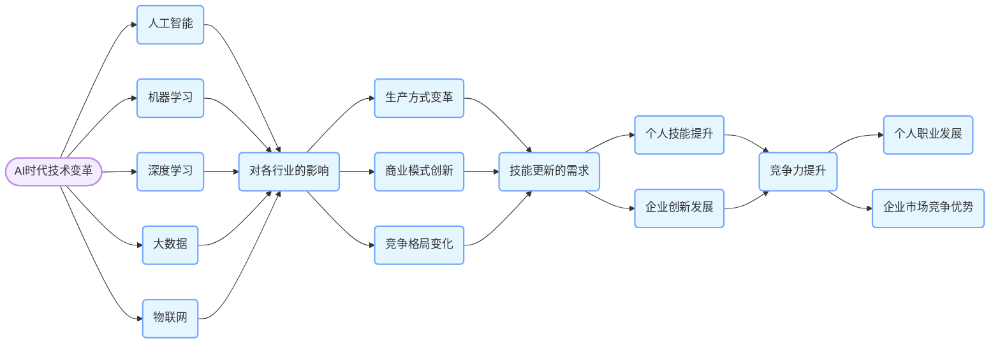

# 技能更新的必要性:如何在AI时代保持竞争力

> 关键词：技能更新、AI时代、竞争力、职业发展、技术变革、学习策略、终身学习

> 摘要：随着人工智能（AI）时代的到来，技术变革日新月异，对各个行业和职业都产生了深远影响。在这样的背景下，技能更新变得尤为重要，它是个人和企业在AI时代保持竞争力的关键。本文将深入探讨技能更新的必要性，分析AI时代对技能的新要求，阐述如何制定有效的学习策略来实现技能更新，以及技能更新在职业发展和企业发展中的具体应用。通过全面的分析和深入的探讨，为读者提供在AI时代保持竞争力的实用指导和建议。

## 1. 背景介绍 
### 1.1 目的和范围
本文的目的在于深入剖析在AI时代技能更新的必要性，并为个人和企业提供切实可行的方法和策略，以帮助他们在这个快速变化的时代保持竞争力。范围涵盖了AI技术对不同行业的影响、技能更新的理论依据、具体的学习方法和实践案例，以及未来技能发展的趋势和挑战。

### 1.2 预期读者
本文预期读者包括职场人士、企业管理者、教育工作者、学生以及对AI时代发展趋势和个人职业发展感兴趣的广大人群。无论是希望提升自身技能的个体，还是关注企业人才培养和发展的管理者，都能从本文中获得有价值的信息和启示。

### 1.3 文档结构概述
本文首先介绍技能更新在AI时代的背景和重要性，然后阐述AI时代对技能的新要求和核心概念。接着详细讲解技能更新的算法原理、具体操作步骤和数学模型。通过项目实战案例，展示技能更新在实际中的应用和效果。之后探讨技能更新的实际应用场景和相关工具资源。最后总结未来技能发展的趋势和挑战，并提供常见问题解答和扩展阅读参考资料。

### 1.4 术语表
#### 1.4.1 核心术语定义
- **AI（Artificial Intelligence）**：人工智能，是指计算机系统能够执行通常需要人类智能才能完成的任务，如学习、推理、解决问题等。
- **技能更新**：指个体或组织为适应不断变化的环境和需求，对自身所具备的知识、技能和能力进行持续改进和提升的过程。
- **竞争力**：在市场或社会环境中，个人或组织相对于其他对手所具有的优势和能力，能够使其在竞争中获得更好的发展和成果。

#### 1.4.2 相关概念解释
- **技术变革**：指由于科学技术的进步和创新，导致生产方式、生活方式和社会结构发生重大变化的过程。在AI时代，技术变革主要体现在人工智能、机器学习、大数据等技术的快速发展和应用。
- **终身学习**：指个体在一生中持续不断地学习和获取知识、技能的过程，以适应社会发展和个人成长的需要。在AI时代，终身学习成为保持竞争力的必要条件。

#### 1.4.3 缩略词列表
- **AI**：Artificial Intelligence（人工智能）
- **ML**：Machine Learning（机器学习）
- **DL**：Deep Learning（深度学习）
- **IoT**：Internet of Things（物联网）

## 2. 核心概念与联系 
### 2.1 AI时代的技术变革
AI时代以人工智能、机器学习、深度学习、大数据、物联网等技术的快速发展和广泛应用为特征。这些技术的不断进步和创新，正在深刻改变着各个行业的生产方式、商业模式和竞争格局。例如，在制造业中，智能制造技术的应用使得生产过程更加自动化、智能化和高效化；在金融行业，人工智能和大数据技术的应用使得风险评估、投资决策等更加精准和科学。

### 2.2 技能更新的重要性
在AI时代，技术变革的速度越来越快，知识和技能的更新换代也越来越频繁。如果个人或组织不能及时进行技能更新，就会很快被时代淘汰。技能更新不仅可以帮助个人提升自身的竞争力，获得更好的职业发展机会，还可以帮助企业提高创新能力和市场竞争力，实现可持续发展。

### 2.3 技能更新与竞争力的关系
技能更新是保持竞争力的关键。通过不断学习和掌握新的知识和技能，个人和组织能够更好地适应市场变化和客户需求，提供更优质的产品和服务，从而在竞争中脱颖而出。同时，竞争力的提升也会促使个人和组织更加重视技能更新，形成一个良性循环。

### 2.4 核心概念原理和架构的文本示意图
```plaintext
AI时代技术变革
|
|-- 人工智能
|-- 机器学习
|-- 深度学习
|-- 大数据
|-- 物联网
|
|-- 对各行业的影响
|   |-- 生产方式变革
|   |-- 商业模式创新
|   |-- 竞争格局变化
|
|-- 技能更新的需求
|   |-- 个人技能提升
|   |-- 企业创新发展
|
|-- 竞争力提升
|   |-- 个人职业发展
|   |-- 企业市场竞争优势
```

### 2.5 Mermaid流程图


## 3. 核心算法原理 & 具体操作步骤 
### 3.1 技能更新的算法原理
技能更新的算法原理可以类比为一个优化问题。我们可以将个人或组织的技能状态看作是一个多维向量 $\vec{S}=(S_1, S_2, \cdots, S_n)$，其中 $S_i$ 表示第 $i$ 种技能的水平。在AI时代，市场需求和技术发展会不断变化，我们可以将其看作是一个目标函数 $f(\vec{S})$，表示在当前环境下个人或组织的竞争力。技能更新的目标就是通过不断调整技能向量 $\vec{S}$，使得目标函数 $f(\vec{S})$ 达到最大值。

### 3.2 具体操作步骤
#### 3.2.1 技能评估
首先，需要对个人或组织现有的技能进行全面评估。可以采用问卷调查、技能测试、绩效评估等方法，确定当前技能向量 $\vec{S}$ 的各个分量 $S_i$ 的值。

```python
# 示例代码：技能评估
skills = ["编程", "数据分析", "人工智能", "沟通能力", "团队协作"]
skill_levels = [3, 2, 1, 4, 3]  # 技能水平，1-5级

def skill_assessment(skills, levels):
    skill_dict = {}
    for i in range(len(skills)):
        skill_dict[skills[i]] = levels[i]
    return skill_dict

current_skills = skill_assessment(skills, skill_levels)
print("当前技能评估结果：", current_skills)
```

#### 3.2.2 市场需求分析
了解市场对各种技能的需求情况，确定目标技能向量 $\vec{T}=(T_1, T_2, \cdots, T_n)$。可以通过行业报告、招聘信息、专家咨询等方式获取市场需求信息。

```python
# 示例代码：市场需求分析
market_demand_skills = ["人工智能", "大数据分析", "云计算", "机器学习", "区块链"]
market_demand_levels = [4, 3, 3, 4, 2]  # 市场需求的技能水平

target_skills = skill_assessment(market_demand_skills, market_demand_levels)
print("市场需求的技能目标：", target_skills)
```

#### 3.2.3 差距分析
计算当前技能向量 $\vec{S}$ 与目标技能向量 $\vec{T}$ 之间的差距 $\vec{D}=\vec{T}-\vec{S}$。差距向量 $\vec{D}$ 中的每个分量 $D_i=T_i - S_i$ 表示第 $i$ 种技能需要提升的幅度。

```python
# 示例代码：差距分析
def gap_analysis(current_skills, target_skills):
    gap = {}
    for skill in target_skills:
        if skill in current_skills:
            gap[skill] = target_skills[skill] - current_skills[skill]
        else:
            gap[skill] = target_skills[skill]
    return gap

skill_gap = gap_analysis(current_skills, target_skills)
print("技能差距分析结果：", skill_gap)
```

#### 3.2.4 学习计划制定
根据差距分析的结果，制定具体的学习计划。学习计划应包括学习目标、学习内容、学习方法、学习时间安排等。可以采用在线课程、培训讲座、实践项目等多种学习方式。

```python
# 示例代码：学习计划制定
def learning_plan(gap):
    plan = {}
    for skill, level in gap.items():
        if level > 0:
            plan[skill] = f"学习 {skill} 技能，目标提升 {level} 级"
    return plan

learning_plan = learning_plan(skill_gap)
print("学习计划：", learning_plan)
```

#### 3.2.5 学习实施与监控
按照学习计划进行学习，并定期对学习效果进行监控和评估。可以通过考试、项目实践、绩效评估等方式检验学习成果，根据评估结果及时调整学习计划。

```python
# 示例代码：学习实施与监控
def learning_implementation(learning_plan):
    for skill, plan in learning_plan.items():
        print(f"正在实施 {plan}")
        # 模拟学习过程
        print(f"学习 {skill} 技能中...")
        # 模拟学习效果评估
        print(f"对 {skill} 技能进行评估...")
    print("学习过程结束，进行总结评估")

learning_implementation(learning_plan)
```

#### 3.2.6 技能更新与迭代
根据学习效果评估的结果，更新个人或组织的技能向量 $\vec{S}$，并重新进行市场需求分析和差距分析，不断迭代学习过程，实现技能的持续更新和提升。

```python
# 示例代码：技能更新与迭代
def skill_update(current_skills, learning_plan):
    for skill, plan in learning_plan.items():
        # 模拟技能提升
        if skill in current_skills:
            current_skills[skill] += 1
        else:
            current_skills[skill] = 1
    return current_skills

updated_skills = skill_update(current_skills, learning_plan)
print("更新后的技能水平：", updated_skills)
```

## 4. 数学模型和公式 & 详细讲解 & 举例说明 
### 4.1 技能向量表示
如前所述，个人或组织的技能状态可以用一个多维向量 $\vec{S}=(S_1, S_2, \cdots, S_n)$ 表示，其中 $S_i$ 表示第 $i$ 种技能的水平，通常取值范围为 $[0, 5]$，$0$ 表示完全不具备该技能，$5$ 表示该技能达到专家水平。

### 4.2 目标函数
目标函数 $f(\vec{S})$ 表示在当前环境下个人或组织的竞争力。目标函数的具体形式可以根据不同的应用场景和需求进行定义。例如，一种简单的目标函数可以是各个技能水平的加权和：

$$f(\vec{S})=\sum_{i=1}^{n} w_i S_i$$

其中 $w_i$ 表示第 $i$ 种技能的权重，反映了该技能在当前环境下的重要性。权重的取值范围为 $[0, 1]$，且 $\sum_{i=1}^{n} w_i = 1$。

### 4.3 差距计算
当前技能向量 $\vec{S}$ 与目标技能向量 $\vec{T}$ 之间的差距 $\vec{D}=\vec{T}-\vec{S}$，差距向量 $\vec{D}$ 的模可以用来衡量整体技能差距的大小：

$$\|\vec{D}\|=\sqrt{\sum_{i=1}^{n} (T_i - S_i)^2}$$

### 4.4 举例说明
假设一个人具备三种技能：编程、数据分析和沟通能力，其当前技能向量为 $\vec{S}=(3, 2, 4)$，市场需求的目标技能向量为 $\vec{T}=(4, 3, 4)$，技能权重分别为 $w_1 = 0.4$，$w_2 = 0.3$，$w_3 = 0.3$。

#### 4.4.1 计算当前竞争力
根据目标函数 $f(\vec{S})=\sum_{i=1}^{n} w_i S_i$，可得：

$$f(\vec{S})=0.4\times3 + 0.3\times2 + 0.3\times4 = 1.2 + 0.6 + 1.2 = 3$$

#### 4.4.2 计算技能差距
差距向量 $\vec{D}=\vec{T}-\vec{S}=(4 - 3, 3 - 2, 4 - 4)=(1, 1, 0)$，差距向量的模为：

$$\|\vec{D}\|=\sqrt{1^2 + 1^2 + 0^2}=\sqrt{2}\approx1.41$$

#### 4.4.3 制定学习计划
根据差距分析的结果，该人需要重点提升编程和数据分析技能，制定相应的学习计划来缩小技能差距，提高竞争力。

## 5. 项目实战：代码实际案例和详细解释说明 
### 5.1  开发环境搭建
#### 5.1.1 安装Python
首先，需要安装Python开发环境。可以从Python官方网站（https://www.python.org/downloads/） 下载适合自己操作系统的Python安装包，并按照安装向导进行安装。

#### 5.1.2 安装开发工具
推荐使用PyCharm作为Python开发工具。可以从JetBrains官方网站（https://www.jetbrains.com/pycharm/download/） 下载PyCharm社区版或专业版，并按照安装向导进行安装。

#### 5.1.3 创建虚拟环境
为了避免不同项目之间的依赖冲突，建议使用虚拟环境。可以使用Python自带的`venv`模块创建虚拟环境：

```bash
python -m venv myenv
```

激活虚拟环境：

- Windows系统：
```bash
myenv\Scripts\activate
```
- Linux/Mac系统：
```bash
source myenv/bin/activate
```

### 5.2  源代码详细实现和代码解读
#### 5.2.1 技能评估模块
```python
# 技能评估模块
skills = ["编程", "数据分析", "人工智能", "沟通能力", "团队协作"]
skill_levels = [3, 2, 1, 4, 3]  # 技能水平，1-5级

def skill_assessment(skills, levels):
    """
    技能评估函数，将技能名称和对应的技能水平组合成字典
    :param skills: 技能名称列表
    :param levels: 技能水平列表
    :return: 技能评估结果字典
    """
    skill_dict = {}
    for i in range(len(skills)):
        skill_dict[skills[i]] = levels[i]
    return skill_dict

current_skills = skill_assessment(skills, skill_levels)
print("当前技能评估结果：", current_skills)
```
**代码解读**：该模块定义了一个`skill_assessment`函数，用于将技能名称列表和技能水平列表组合成一个字典，方便后续处理。

#### 5.2.2 市场需求分析模块
```python
# 市场需求分析模块
market_demand_skills = ["人工智能", "大数据分析", "云计算", "机器学习", "区块链"]
market_demand_levels = [4, 3, 3, 4, 2]  # 市场需求的技能水平

target_skills = skill_assessment(market_demand_skills, market_demand_levels)
print("市场需求的技能目标：", target_skills)
```
**代码解读**：该模块同样使用`skill_assessment`函数，将市场需求的技能名称和技能水平组合成一个字典，得到市场需求的技能目标。

#### 5.2.3 差距分析模块
```python
# 差距分析模块
def gap_analysis(current_skills, target_skills):
    """
    差距分析函数，计算当前技能与目标技能之间的差距
    :param current_skills: 当前技能评估结果字典
    :param target_skills: 市场需求的技能目标字典
    :return: 技能差距字典
    """
    gap = {}
    for skill in target_skills:
        if skill in current_skills:
            gap[skill] = target_skills[skill] - current_skills[skill]
        else:
            gap[skill] = target_skills[skill]
    return gap

skill_gap = gap_analysis(current_skills, target_skills)
print("技能差距分析结果：", skill_gap)
```
**代码解读**：该模块定义了一个`gap_analysis`函数，通过比较当前技能和目标技能的水平，计算出每种技能需要提升的幅度，存储在一个字典中。

#### 5.2.4 学习计划制定模块
```python
# 学习计划制定模块
def learning_plan(gap):
    """
    学习计划制定函数，根据技能差距生成学习计划
    :param gap: 技能差距字典
    :return: 学习计划字典
    """
    plan = {}
    for skill, level in gap.items():
        if level > 0:
            plan[skill] = f"学习 {skill} 技能，目标提升 {level} 级"
    return plan

learning_plan = learning_plan(skill_gap)
print("学习计划：", learning_plan)
```
**代码解读**：该模块定义了一个`learning_plan`函数，根据技能差距分析的结果，生成具体的学习计划，存储在一个字典中。

#### 5.2.5 学习实施与监控模块
```python
# 学习实施与监控模块
def learning_implementation(learning_plan):
    """
    学习实施与监控函数，模拟学习过程和学习效果评估
    :param learning_plan: 学习计划字典
    :return: 无
    """
    for skill, plan in learning_plan.items():
        print(f"正在实施 {plan}")
        # 模拟学习过程
        print(f"学习 {skill} 技能中...")
        # 模拟学习效果评估
        print(f"对 {skill} 技能进行评估...")
    print("学习过程结束，进行总结评估")

learning_implementation(learning_plan)
```
**代码解读**：该模块定义了一个`learning_implementation`函数，模拟学习过程和学习效果评估，通过打印信息来展示学习的各个阶段。

#### 5.2.6 技能更新与迭代模块
```python
# 技能更新与迭代模块
def skill_update(current_skills, learning_plan):
    """
    技能更新与迭代函数，根据学习计划更新技能水平
    :param current_skills: 当前技能评估结果字典
    :param learning_plan: 学习计划字典
    :return: 更新后的技能评估结果字典
    """
    for skill, plan in learning_plan.items():
        # 模拟技能提升
        if skill in current_skills:
            current_skills[skill] += 1
        else:
            current_skills[skill] = 1
    return current_skills

updated_skills = skill_update(current_skills, learning_plan)
print("更新后的技能水平：", updated_skills)
```
**代码解读**：该模块定义了一个`skill_update`函数，根据学习计划更新技能水平，模拟技能提升的过程，返回更新后的技能评估结果字典。

### 5.3  代码解读与分析
通过上述代码，我们实现了一个完整的技能更新流程，包括技能评估、市场需求分析、差距分析、学习计划制定、学习实施与监控以及技能更新与迭代。代码的核心在于通过函数的封装，将每个步骤模块化，使得代码结构清晰，易于维护和扩展。

在实际应用中，可以根据具体需求对代码进行进一步的优化和扩展。例如，可以将技能评估和市场需求分析的数据从文件或数据库中读取，而不是硬编码在代码中；可以使用更复杂的算法来制定学习计划，考虑学习资源的可用性和学习时间的限制等因素。

## 6. 实际应用场景 
### 6.1 个人职业发展
在AI时代，个人的职业发展面临着前所未有的挑战和机遇。随着技术的快速发展，许多传统职业正在被人工智能和自动化技术所取代，而新兴职业如数据分析师、人工智能工程师、机器学习专家等则需求旺盛。因此，个人需要不断更新自己的技能，以适应市场的变化和职业发展的需求。

例如，一名传统的会计人员可以通过学习数据分析和人工智能技术，将自己的职业领域扩展到财务数据分析、财务智能化等方向，提高自己的竞争力和职业发展空间。

### 6.2 企业人才培养
企业在AI时代的竞争中，人才是关键。为了保持企业的创新能力和市场竞争力，企业需要不断培养和提升员工的技能水平。通过制定科学合理的人才培养计划，鼓励员工进行技能更新和学习，可以提高员工的工作效率和工作质量，促进企业的发展。

例如，一家互联网企业可以定期组织员工参加技术培训和学习交流活动，鼓励员工自主学习和研究新兴技术，如人工智能、大数据、云计算等，以提升企业的技术实力和创新能力。

### 6.3 教育机构教学改革
教育机构在AI时代也需要进行教学改革，以培养适应时代发展需求的人才。传统的教育模式注重知识的传授，而在AI时代，更需要培养学生的创新能力、实践能力和终身学习能力。教育机构可以通过引入新兴技术课程、开展实践教学活动、加强校企合作等方式，更新教学内容和教学方法，提高教育质量。

例如，一所高校可以开设人工智能、机器学习、数据科学等专业课程，建立实践教学基地，与企业合作开展项目实践，让学生在学习过程中接触实际问题，提高学生的实践能力和创新能力。

### 6.4 社会就业服务
政府和社会就业服务机构在AI时代也需要发挥重要作用。通过提供职业培训、就业指导、创业支持等服务，帮助劳动者更新技能，提高就业竞争力，促进就业和创业。

例如，政府可以出台相关政策，鼓励企业开展职工技能培训，对参加培训的劳动者给予补贴；社会就业服务机构可以开展职业技能鉴定和认证工作，为劳动者提供技能提升的方向和标准。

## 7. 工具和资源推荐
### 7.1 学习资源推荐
#### 7.1.1 书籍推荐
- 《人工智能：一种现代的方法》（Artificial Intelligence: A Modern Approach）：这是一本经典的人工智能教材，全面介绍了人工智能的基本概念、算法和应用。
- 《Python数据分析实战》（Python for Data Analysis）：本书详细介绍了使用Python进行数据分析的方法和技巧，包括数据处理、数据可视化、机器学习等方面。
- 《深度学习》（Deep Learning）：由深度学习领域的三位先驱Ian Goodfellow、Yoshua Bengio和Aaron Courville撰写，是深度学习领域的权威著作。

#### 7.1.2 在线课程
- Coursera（https://www.coursera.org/）：提供了众多关于人工智能、机器学习、数据分析等领域的在线课程，由全球知名高校和机构的教授授课。
- edX（https://www.edx.org/）：与多所顶尖大学合作，提供高质量的在线课程，涵盖了计算机科学、数据科学、人工智能等多个领域。
- 中国大学MOOC（https://www.icourse163.org/）：国内知名的在线课程平台，提供了丰富的计算机科学、人工智能等相关课程。

#### 7.1.3 技术博客和网站
- Medium（https://medium.com/）：一个汇聚了众多技术专家和爱好者的博客平台，有很多关于人工智能、机器学习、数据分析等领域的优质文章。
- Towards Data Science（https://towardsdatascience.com/）：专注于数据科学和机器学习领域的技术博客，提供了大量的技术文章和实践案例。
- AI Stack Exchange（https://ai.stackexchange.com/）：一个人工智能领域的问答社区，用户可以在这里提问、交流和分享经验。

### 7.2 开发工具框架推荐
#### 7.2.1 IDE和编辑器
- PyCharm：一款专业的Python集成开发环境，具有代码编辑、调试、代码分析等功能，适合Python开发。
- Jupyter Notebook：一个交互式的开发环境，支持多种编程语言，特别适合数据科学和机器学习的开发和实验。
- Visual Studio Code：一款轻量级的代码编辑器，支持多种编程语言和插件扩展，具有丰富的功能和良好的用户体验。

#### 7.2.2 调试和性能分析工具
- pdb：Python自带的调试器，可以帮助开发者定位和解决代码中的问题。
- cProfile：Python的性能分析工具，可以分析代码的运行时间和函数调用情况，帮助开发者优化代码性能。
- TensorBoard：TensorFlow的可视化工具，可以帮助开发者可视化训练过程、模型结构和性能指标等。

#### 7.2.3 相关框架和库
- TensorFlow：一个开源的机器学习框架，由Google开发和维护，广泛应用于深度学习领域。
- PyTorch：另一个流行的深度学习框架，由Facebook开发和维护，具有简洁易用的特点。
- Scikit-learn：一个用于机器学习的Python库，提供了丰富的机器学习算法和工具，适合初学者和快速开发。

### 7.3 相关论文著作推荐
#### 7.3.1 经典论文
- "A Logical Calculus of the Ideas Immanent in Nervous Activity" by Warren S. McCulloch and Walter Pitts (1943)：这篇论文提出了神经元模型，是神经网络领域的开创性工作。
- "Perceptrons: An Introduction to Computational Geometry" by Frank Rosenblatt (1962)：介绍了感知机模型，是早期机器学习的重要成果。
- "ImageNet Classification with Deep Convolutional Neural Networks" by Alex Krizhevsky, Ilya Sutskever, and Geoffrey E. Hinton (2012)：这篇论文介绍了AlexNet模型，开启了深度学习在计算机视觉领域的热潮。

#### 7.3.2 最新研究成果
- arXiv（https://arxiv.org/）：一个预印本平台，提供了大量的最新学术论文，涵盖了人工智能、机器学习、数据科学等多个领域。
- NeurIPS（https://neurips.cc/）：神经信息处理系统大会，是人工智能和机器学习领域的顶级学术会议，每年会发表很多最新的研究成果。
- ICML（https://icml.cc/）：国际机器学习会议，也是机器学习领域的重要学术会议，展示了最新的研究进展和技术创新。

#### 7.3.3 应用案例分析
- Kaggle（https://www.kaggle.com/）：一个数据科学竞赛平台，提供了大量的实际数据集和竞赛项目，通过参与竞赛可以学习到很多实际应用案例和解决问题的方法。
- Google AI Blog（https://ai.googleblog.com/）：Google的人工智能博客，分享了很多Google在人工智能领域的研究成果和应用案例。
- Microsoft AI（https://www.microsoft.com/en-us/ai）：微软的人工智能官方网站，介绍了微软在人工智能领域的技术和应用案例。

## 8. 总结：未来发展趋势与挑战
### 8.1 未来发展趋势
#### 8.1.1 技术融合
未来，人工智能将与其他技术如物联网、大数据、区块链等深度融合，形成更加复杂和强大的技术体系。例如，人工智能与物联网的结合可以实现智能物联网，使设备能够自动感知环境、做出决策和执行任务；人工智能与区块链的结合可以提高数据的安全性和可信度，促进数据的共享和流通。

#### 8.1.2 行业应用拓展
人工智能将在更多的行业得到广泛应用，如医疗、教育、交通、能源等。例如，在医疗领域，人工智能可以辅助医生进行疾病诊断、治疗方案制定和药物研发；在教育领域，人工智能可以实现个性化学习、智能辅导和教育评估。

#### 8.1.3 人才需求变化
随着人工智能技术的发展，对人才的需求也将发生变化。未来，不仅需要具备专业技术知识的人才，还需要具备跨学科知识和创新能力的复合型人才。例如，既懂人工智能技术又懂医疗知识的人才在医疗人工智能领域将具有很大的需求。

### 8.2 挑战
#### 8.2.1 技术伦理和法律问题
人工智能的发展带来了一系列的技术伦理和法律问题，如隐私保护、算法偏见、责任认定等。例如，人工智能算法可能存在偏见，导致对某些群体的不公平对待；当人工智能系统出现故障或造成损害时，责任的认定也存在困难。

#### 8.2.2 就业结构调整
人工智能的应用将导致就业结构的调整，一些传统职业将被取代，而一些新兴职业将涌现。这将给劳动者带来就业压力和职业转型的挑战。例如，一些重复性、规律性的工作将被自动化和人工智能技术所取代，劳动者需要学习新的技能来适应新的就业需求。

#### 8.2.3 教育体系改革
现有的教育体系在培养适应AI时代需求的人才方面存在不足。需要对教育体系进行改革，加强对学生创新能力、实践能力和终身学习能力的培养。例如，需要更新教学内容，引入新兴技术课程；改进教学方法，加强实践教学和项目实践。

### 8.3 应对策略
#### 8.3.1 加强技术伦理和法律研究
政府、企业和学术界应加强对人工智能技术伦理和法律问题的研究，制定相应的法律法规和伦理准则，规范人工智能的发展和应用。例如，建立数据隐私保护制度、算法审计制度等。

#### 8.3.2 促进就业转型和培训
政府和社会应采取措施促进就业转型和培训，为劳动者提供职业培训和再就业支持。例如，出台相关政策鼓励企业开展职工技能培训，提供培训补贴和职业技能鉴定服务。

#### 8.3.3 推进教育体系改革
教育机构应推进教育体系改革，更新教学内容和教学方法，培养适应AI时代需求的人才。例如，加强跨学科教育，开设人工智能、数据科学等新兴专业课程；加强实践教学和校企合作，提高学生的实践能力和创新能力。

## 9. 附录：常见问题与解答
### 9.1 如何确定自己需要更新哪些技能？
可以通过以下几种方法来确定自己需要更新的技能：
- **市场需求分析**：关注行业动态和招聘信息，了解市场对各种技能的需求情况。
- **职业发展规划**：根据自己的职业目标和发展方向，确定需要具备的技能。
- **技能评估**：对自己现有的技能进行评估，找出自己的优势和不足，确定需要提升的技能。

### 9.2 学习新技能需要多长时间？
学习新技能所需的时间取决于多种因素，如技能的难度、学习的方法和效率、个人的基础和学习能力等。一般来说，简单的技能可能只需要几周或几个月的时间就能掌握，而复杂的技能可能需要几年甚至更长的时间。

### 9.3 如何选择适合自己的学习资源？
选择适合自己的学习资源可以考虑以下几个方面：
- **学习目标**：根据自己的学习目标和需求选择相应的学习资源。
- **学习风格**：不同的人有不同的学习风格，如阅读、听讲、实践等，选择适合自己学习风格的学习资源。
- **资源质量**：选择质量高、口碑好的学习资源，可以参考他人的评价和推荐。

### 9.4 技能更新后如何验证和展示自己的能力？
可以通过以下几种方式来验证和展示自己的能力：
- **证书和认证**：参加相关的技能认证考试，获得相应的证书和认证，证明自己的技能水平。
- **项目实践**：通过参与实际项目，展示自己的实践能力和解决问题的能力。
- **作品和成果**：制作自己的作品和成果，如代码、报告、论文等，展示自己的学习成果和创新能力。

### 9.5 企业如何鼓励员工进行技能更新？
企业可以采取以下措施鼓励员工进行技能更新：
- **培训和学习机会**：为员工提供丰富的培训和学习机会，如内部培训、外部培训、在线课程等。
- **激励机制**：建立激励机制，对积极学习和提升技能的员工给予奖励和表彰，如奖金、晋升、荣誉称号等。
- **职业发展规划**：为员工制定明确的职业发展规划，让员工了解自己的职业发展方向和所需的技能，激发员工学习的动力。

## 10. 扩展阅读 & 参考资料
### 10.1 扩展阅读
- 《人类简史：从动物到上帝》（Sapiens: A Brief History of Humankind）by Yuval Noah Harari：这本书探讨了人类的历史和未来发展，对理解人工智能时代的人类社会变革有很大的启发。
- 《奇点临近》（The Singularity Is Near）by Ray Kurzweil：作者预测了人工智能和技术发展的未来趋势，提出了奇点的概念。
- 《智能时代》by 吴军：介绍了人工智能在各个领域的应用和影响，以及对未来社会的展望。

### 10.2 参考资料
- 相关行业报告和研究机构的研究成果，如Gartner、IDC等发布的关于人工智能和技术发展的报告。
- 政府发布的相关政策文件和规划，如国家关于人工智能发展的战略规划和政策措施。
- 学术期刊和会议论文，如《Journal of Artificial Intelligence Research》、《Proceedings of the National Academy of Sciences》等发表的关于人工智能和机器学习的研究论文。