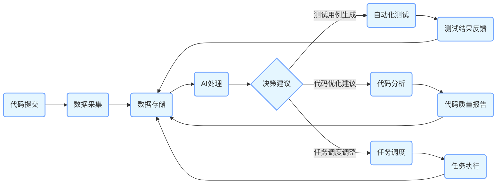

# 持续集成的AI化升级

> 关键词：持续集成、AI化升级、自动化测试、代码分析、智能调度、质量保障、DevOps

> 摘要：本文聚焦于持续集成的AI化升级这一前沿话题。随着软件开发复杂度的不断提升，传统持续集成面临着效率、质量等多方面的挑战。AI技术的融入为持续集成带来了新的机遇，能够实现自动化测试的智能优化、代码分析的深度挖掘、任务调度的精准执行等。文章将深入探讨持续集成AI化升级的核心概念、算法原理、数学模型，通过项目实战展示其具体实现，分析其实际应用场景，并推荐相关的工具和资源。最后对未来发展趋势与挑战进行总结，为软件开发团队提供全面的参考，助力其在数字化转型中提升开发效率和软件质量。

## 1. 背景介绍 
### 1.1 目的和范围
目的在于深入研究如何将AI技术应用于持续集成过程，以提升软件开发的效率、质量和可靠性。范围涵盖持续集成的各个环节，包括代码提交、自动化测试、代码分析、部署等，探讨AI在这些环节中的具体应用和优化策略。

### 1.2 预期读者
本文预期读者包括软件开发工程师、测试工程师、DevOps工程师、软件架构师、CTO等相关技术人员，以及对软件开发流程优化和AI技术应用感兴趣的研究人员和管理人员。

### 1.3 文档结构概述
本文首先介绍持续集成AI化升级的背景，包括目的、预期读者和文档结构概述。接着阐述核心概念与联系，通过文本示意图和Mermaid流程图展示其原理和架构。然后详细讲解核心算法原理及具体操作步骤，结合Python源代码进行说明。再介绍数学模型和公式，并举例说明。之后通过项目实战展示代码实际案例和详细解释。分析实际应用场景，推荐相关的工具和资源。最后总结未来发展趋势与挑战，提供常见问题与解答及扩展阅读和参考资料。

### 1.4 术语表
#### 1.4.1 核心术语定义
- **持续集成（Continuous Integration，CI）**：一种软件开发实践，团队成员频繁地将代码集成到共享的代码库中，每次集成都通过自动化构建和测试来验证，确保代码的一致性和稳定性。
- **AI化升级**：将人工智能技术应用于现有系统或流程，以提升其性能、效率、智能程度等。
- **自动化测试**：使用自动化工具执行测试用例，自动比较实际结果和预期结果，以验证软件的功能和性能。
- **代码分析**：对源代码进行静态或动态分析，以发现代码中的潜在问题，如漏洞、缺陷、代码风格问题等。
- **智能调度**：利用AI算法根据任务的优先级、资源需求、依赖关系等因素，自动安排任务的执行顺序和时间。

#### 1.4.2 相关概念解释
- **DevOps**：一种软件开发和运维的方法论，强调开发团队和运维团队之间的协作和沟通，通过自动化流程实现软件的快速、可靠交付。
- **机器学习**：AI的一个分支，通过让计算机从数据中学习模式和规律，从而实现预测和决策。
- **深度学习**：一种基于人工神经网络的机器学习方法，能够处理复杂的非线性关系，在图像识别、自然语言处理等领域取得了显著的成果。

#### 1.4.3 缩略词列表
- **CI**：Continuous Integration（持续集成）
- **CD**：Continuous Delivery（持续交付）
- **ML**：Machine Learning（机器学习）
- **DL**：Deep Learning（深度学习）

## 2. 核心概念与联系 
### 核心概念原理
持续集成的AI化升级是将AI技术与传统持续集成流程相结合，以实现更高效、智能的软件开发过程。其核心原理在于利用AI的数据分析、模式识别、预测等能力，对持续集成过程中的各个环节进行优化和改进。

在自动化测试方面，AI可以通过学习历史测试数据，自动生成更全面、有效的测试用例，提高测试覆盖率和效率。例如，利用机器学习算法分析代码结构和功能，预测可能出现问题的代码区域，从而有针对性地生成测试用例。

在代码分析方面，AI可以对源代码进行深度挖掘，发现潜在的安全漏洞、代码质量问题等。通过自然语言处理技术，AI可以理解代码的语义和逻辑，对代码进行更准确的评估。

在任务调度方面，AI可以根据任务的优先级、资源需求、依赖关系等因素，自动调整任务的执行顺序和时间，提高资源利用率和任务执行效率。

### 架构的文本示意图
持续集成的AI化升级架构主要包括以下几个部分：

1. **数据采集层**：负责收集持续集成过程中的各种数据，如代码提交记录、测试结果、代码分析报告等。
2. **数据存储层**：将采集到的数据存储在数据库或数据仓库中，以便后续的分析和处理。
3. **AI处理层**：利用机器学习、深度学习等AI算法对存储的数据进行分析和挖掘，生成优化策略和决策建议。
4. **执行控制层**：根据AI处理层的决策建议，对持续集成过程中的各个环节进行控制和调整，如自动生成测试用例、调整任务调度等。
5. **用户界面层**：为用户提供可视化的界面，方便用户查看和管理持续集成过程中的数据和结果。

### Mermaid流程图


## 3. 核心算法原理 & 具体操作步骤 
### 自动化测试用例生成算法原理
自动化测试用例生成是持续集成AI化升级的重要环节之一。这里我们介绍一种基于遗传算法的测试用例生成方法。

遗传算法是一种模拟自然选择和遗传机制的优化算法，通过不断迭代优化候选解，最终找到最优解。在测试用例生成中，每个候选解可以表示一个测试用例，通过遗传算法的选择、交叉和变异操作，不断生成新的测试用例，直到满足一定的终止条件。

### Python源代码实现
```python
import random

# 定义问题的参数
num_variables = 10  # 变量数量
population_size = 50  # 种群大小
generations = 100  # 迭代次数
mutation_rate = 0.1  # 变异率

# 生成初始种群
def generate_population():
    population = []
    for _ in range(population_size):
        individual = [random.randint(0, 1) for _ in range(num_variables)]
        population.append(individual)
    return population

# 定义适应度函数
def fitness_function(individual):
    # 这里简单地将个体中1的数量作为适应度值
    return sum(individual)

# 选择操作
def selection(population):
    fitness_values = [fitness_function(individual) for individual in population]
    total_fitness = sum(fitness_values)
    probabilities = [fitness / total_fitness for fitness in fitness_values]
    selected_indices = random.choices(range(population_size), weights=probabilities, k=2)
    return [population[index] for index in selected_indices]

# 交叉操作
def crossover(parent1, parent2):
    crossover_point = random.randint(1, num_variables - 1)
    child1 = parent1[:crossover_point] + parent2[crossover_point:]
    child2 = parent2[:crossover_point] + parent1[crossover_point:]
    return child1, child2

# 变异操作
def mutation(individual):
    for i in range(num_variables):
        if random.random() < mutation_rate:
            individual[i] = 1 - individual[i]
    return individual

# 遗传算法主循环
def genetic_algorithm():
    population = generate_population()
    for _ in range(generations):
        new_population = []
        for _ in range(population_size // 2):
            parents = selection(population)
            child1, child2 = crossover(parents[0], parents[1])
            child1 = mutation(child1)
            child2 = mutation(child2)
            new_population.extend([child1, child2])
        population = new_population
    best_individual = max(population, key=fitness_function)
    return best_individual

# 运行遗传算法
best_test_case = genetic_algorithm()
print("Best test case:", best_test_case)
```

### 具体操作步骤
1. **初始化种群**：随机生成一定数量的初始测试用例，作为初始种群。
2. **计算适应度**：对每个测试用例计算其适应度值，适应度值表示该测试用例的优劣程度。
3. **选择操作**：根据适应度值选择一定数量的测试用例作为父代。
4. **交叉操作**：对父代测试用例进行交叉操作，生成子代测试用例。
5. **变异操作**：对子代测试用例进行变异操作，引入新的基因。
6. **更新种群**：用子代测试用例替换部分父代测试用例，更新种群。
7. **终止条件判断**：判断是否满足终止条件，如达到最大迭代次数或找到最优解。如果不满足，返回步骤2继续迭代。

## 4. 数学模型和公式 & 详细讲解 & 举例说明 
### 适应度函数数学模型
在上述遗传算法中，适应度函数用于评估每个测试用例的优劣程度。假设我们有一个测试用例 $x = [x_1, x_2, ..., x_n]$，其中 $x_i \in \{0, 1\}$ 表示第 $i$ 个变量的取值。适应度函数 $f(x)$ 可以定义为：

$$f(x) = \sum_{i=1}^{n} x_i$$

这个公式表示测试用例中取值为1的变量数量越多，其适应度值越高。

### 详细讲解
适应度函数的选择直接影响遗传算法的性能。在测试用例生成中，适应度函数应该能够反映测试用例的覆盖程度、执行效率等因素。上述公式只是一个简单的示例，实际应用中需要根据具体的测试需求和目标来设计适应度函数。

### 举例说明
假设我们有一个测试用例 $x = [1, 0, 1, 1, 0]$，其中 $n = 5$。根据上述适应度函数公式，其适应度值为：

$$f(x) = 1 + 0 + 1 + 1 + 0 = 3$$

这表示该测试用例中有3个变量的取值为1。

### 选择概率公式
在选择操作中，每个测试用例被选中的概率与其适应度值成正比。假设种群中有 $m$ 个测试用例，第 $j$ 个测试用例的适应度值为 $f(x_j)$，则其被选中的概率 $p_j$ 可以定义为：

$$p_j = \frac{f(x_j)}{\sum_{i=1}^{m} f(x_i)}$$

### 详细讲解
选择概率公式保证了适应度值高的测试用例有更大的机会被选中作为父代，从而将其优秀的基因传递给子代。通过这种方式，遗传算法能够不断优化种群，逐步找到最优解。

### 举例说明
假设种群中有3个测试用例 $x_1, x_2, x_3$，其适应度值分别为 $f(x_1) = 2, f(x_2) = 3, f(x_3) = 4$。则它们被选中的概率分别为：

$$p_1 = \frac{2}{2 + 3 + 4} = \frac{2}{9}$$

$$p_2 = \frac{3}{2 + 3 + 4} = \frac{3}{9} = \frac{1}{3}$$

$$p_3 = \frac{4}{2 + 3 + 4} = \frac{4}{9}$$

## 5. 项目实战：代码实际案例和详细解释说明 
### 5.1  开发环境搭建
#### 开发语言和框架
我们选择Python作为开发语言，使用以下相关框架和库：
- **Pytest**：用于自动化测试。
- **Flask**：用于构建简单的Web应用，模拟持续集成过程中的代码提交和部署。
- **Scikit-learn**：用于机器学习算法的实现。

#### 安装步骤
1. 安装Python环境，可以从Python官方网站下载并安装。
2. 使用pip安装所需的库：
```sh
pip install pytest flask scikit-learn
```

### 5.2  源代码详细实现和代码解读
#### 代码提交模拟
```python
from flask import Flask

app = Flask(__name__)

# 模拟代码仓库
code_repository = []

@app.route('/commit/<code>', methods=['GET'])
def commit_code(code):
    code_repository.append(code)
    return f"Code {code} committed successfully."

if __name__ == '__main__':
    app.run(debug=True)
```
**代码解读**：这段代码使用Flask框架构建了一个简单的Web应用，提供了一个 `/commit/<code>` 的接口，用于模拟代码提交操作。每次提交的代码会被添加到 `code_repository` 列表中。

#### 自动化测试
```python
import pytest

# 模拟被测函数
def add(a, b):
    return a + b

# 测试用例
def test_add():
    assert add(2, 3) == 5
```
**代码解读**：这段代码使用Pytest框架编写了一个简单的自动化测试用例，用于测试 `add` 函数的功能。

#### 代码分析
```python
from sklearn.feature_extraction.text import TfidfVectorizer
from sklearn.svm import SVC

# 模拟代码数据集
code_dataset = [
    "def func1(): return 1",
    "def func2(): return 2",
    "def func3(): return 3"
]

# 标签数据集
labels = [1, 2, 3]

# 特征提取
vectorizer = TfidfVectorizer()
X = vectorizer.fit_transform(code_dataset)

# 训练模型
model = SVC()
model.fit(X, labels)

# 代码分析函数
def code_analysis(code):
    X_new = vectorizer.transform([code])
    prediction = model.predict(X_new)
    return prediction[0]
```
**代码解读**：这段代码使用Scikit-learn库实现了一个简单的代码分析功能。首先使用 `TfidfVectorizer` 对代码数据集进行特征提取，然后使用 `SVC` 模型进行训练。最后定义了一个 `code_analysis` 函数，用于对新的代码进行分析和预测。

### 5.3  代码解读与分析
#### 代码提交模拟分析
通过Flask框架模拟代码提交操作，方便后续的持续集成流程。这种方式可以模拟真实的开发环境，让我们更好地测试和验证持续集成的功能。

#### 自动化测试分析
Pytest框架提供了简单易用的测试用例编写和执行功能。通过编写自动化测试用例，可以及时发现代码中的问题，保证代码的质量。

#### 代码分析分析
使用机器学习算法进行代码分析，可以对代码的类型、质量等进行预测和评估。通过特征提取和模型训练，可以让模型学习到代码的模式和规律，从而实现更准确的分析。

## 6. 实际应用场景 
### 软件开发团队
对于软件开发团队来说，持续集成的AI化升级可以提高开发效率和软件质量。通过智能的自动化测试用例生成，可以减少测试人员的工作量，提高测试覆盖率。代码分析功能可以帮助开发人员及时发现代码中的问题，提高代码质量。智能调度可以优化任务执行顺序，提高资源利用率。

### 互联网企业
互联网企业通常面临着快速迭代和高并发的挑战。持续集成的AI化升级可以帮助互联网企业实现快速、可靠的软件交付。通过自动化测试和代码分析，可以保证软件的稳定性和安全性。智能调度可以根据用户流量和系统负载，动态调整任务执行顺序，提高系统的性能和响应速度。

### 金融行业
金融行业对软件的安全性和可靠性要求极高。持续集成的AI化升级可以帮助金融企业加强软件的质量保障。通过深度的代码分析，可以发现潜在的安全漏洞，防止金融风险。自动化测试可以保证软件的功能正确性，避免业务错误。

## 7. 工具和资源推荐
### 7.1 学习资源推荐
#### 7.1.1 书籍推荐
- 《持续集成：软件质量改进和风险降低之道》：全面介绍了持续集成的概念、原理和实践方法。
- 《Python机器学习实战》：详细讲解了Python在机器学习领域的应用，包括各种机器学习算法的实现和案例分析。
- 《深度学习》：深度学习领域的经典著作，介绍了深度学习的基本原理、算法和应用。

#### 7.1.2 在线课程
- Coursera上的“机器学习”课程：由斯坦福大学教授Andrew Ng主讲，是机器学习领域的经典课程。
- edX上的“深度学习”课程：由知名学者和专家授课，深入讲解深度学习的理论和实践。
- 网易云课堂上的“持续集成与持续交付实践”课程：介绍了持续集成和持续交付的实际应用和操作技巧。

#### 7.1.3 技术博客和网站
- 开源中国：提供了丰富的开源项目和技术文章，涵盖了持续集成、AI等多个领域。
- 博客园：众多技术人员分享技术经验和心得的平台，有很多关于持续集成和AI的优质文章。
- Medium：国际知名的技术博客平台，有很多前沿的技术文章和研究成果。

### 7.2 开发工具框架推荐
#### 7.2.1 IDE和编辑器
- PyCharm：功能强大的Python集成开发环境，提供了代码编辑、调试、测试等多种功能。
- Visual Studio Code：轻量级的代码编辑器，支持多种编程语言，有丰富的插件扩展。
- IntelliJ IDEA：Java开发的首选IDE，也支持多种其他编程语言，提供了高效的开发工具和功能。

#### 7.2.2 调试和性能分析工具
- PDB：Python自带的调试工具，方便开发人员进行代码调试。
- Py-Spy：用于Python代码的性能分析工具，可以帮助开发人员找出性能瓶颈。
- VisualVM：Java应用的性能分析工具，提供了内存分析、线程分析等多种功能。

#### 7.2.3 相关框架和库
- Jenkins：开源的持续集成工具，提供了丰富的插件和功能，支持多种编程语言和开发环境。
- GitLab CI/CD：集成在GitLab中的持续集成和持续交付工具，与GitLab的代码管理功能紧密结合。
- TensorFlow：Google开发的深度学习框架，提供了丰富的深度学习算法和工具。

### 7.3 相关论文著作推荐
#### 7.3.1 经典论文
- 《Continuous Integration: Improving Software Quality and Reducing Risk》：介绍了持续集成的基本概念和实践方法，是持续集成领域的经典论文。
- 《Deep Learning》：深度学习领域的奠基性论文，介绍了深度学习的基本原理和算法。
- 《Machine Learning for Software Engineering》：探讨了机器学习在软件工程中的应用，包括代码分析、缺陷预测等方面。

#### 7.3.2 最新研究成果
- 《AI-Enhanced Continuous Integration for Software Development》：研究了AI技术在持续集成中的应用，提出了一些新的方法和策略。
- 《Intelligent Test Case Generation for Continuous Integration》：介绍了智能测试用例生成的最新研究成果，提高了测试用例的覆盖率和效率。
- 《Code Analysis Using Machine Learning in Continuous Integration》：探讨了机器学习在代码分析中的应用，实现了更准确的代码质量评估。

#### 7.3.3 应用案例分析
- 《Case Studies of AI-Enabled Continuous Integration in Large-Scale Software Projects》：分析了AI化持续集成在大型软件项目中的应用案例，总结了经验和教训。
- 《Real-World Applications of Continuous Integration with AI in the Financial Industry》：介绍了金融行业中AI化持续集成的实际应用案例，展示了其在保障软件安全和可靠性方面的作用。
- 《Continuous Integration and AI in Internet Companies: A Practical Guide》：为互联网企业提供了AI化持续集成的实践指南和案例分析。

## 8. 总结：未来发展趋势与挑战
### 未来发展趋势
- **更智能的自动化测试**：AI技术将不断发展，自动化测试将更加智能。未来的测试用例生成将能够根据代码的语义和逻辑，自动生成更精准、全面的测试用例，提高测试效率和覆盖率。
- **深度的代码分析**：借助深度学习等技术，代码分析将能够深入挖掘代码的潜在问题，如安全漏洞、性能瓶颈等。同时，代码分析将不仅仅局限于语法和结构，还将考虑代码的业务逻辑和上下文。
- **智能的任务调度**：AI将能够根据系统的实时状态和资源使用情况，动态调整任务的执行顺序和时间，实现更高效的资源利用和任务调度。
- **与DevOps的深度融合**：持续集成的AI化升级将与DevOps理念深度融合，实现软件开发、测试、部署等环节的无缝衔接，提高整个软件开发流程的效率和质量。

### 挑战
- **数据质量和隐私问题**：AI技术的应用依赖于大量的数据，但数据的质量和隐私问题是一个挑战。在持续集成过程中，需要保证数据的准确性、完整性和安全性，同时遵守相关的隐私法规。
- **算法复杂度和性能问题**：一些复杂的AI算法可能会带来较高的计算复杂度和性能开销。在实际应用中，需要选择合适的算法，并进行优化，以保证系统的性能和响应速度。
- **人才短缺**：AI化持续集成需要既懂软件开发又懂AI技术的复合型人才。目前，这类人才相对短缺，需要加强人才培养和引进。
- **技术更新换代快**：AI技术发展迅速，新的算法和技术不断涌现。软件开发团队需要不断学习和更新技术，以跟上技术发展的步伐。

## 9. 附录：常见问题与解答
### 问题1：AI化持续集成需要大量的数据，这些数据从哪里获取？
解答：数据可以从多个来源获取，包括代码仓库中的代码提交记录、自动化测试的结果、代码分析的报告等。此外，还可以收集用户反馈、系统日志等数据，以丰富数据集。

### 问题2：如何保证AI算法在持续集成中的准确性和可靠性？
解答：可以通过以下方法保证准确性和可靠性：
- 使用高质量的数据集进行训练，确保数据的准确性和完整性。
- 对AI算法进行充分的测试和验证，使用不同的数据集和测试用例进行评估。
- 定期对AI模型进行更新和优化，以适应不断变化的代码和需求。

### 问题3：AI化持续集成是否会完全取代人工测试和代码审查？
解答：不会。虽然AI技术可以提高自动化测试和代码分析的效率和准确性，但人工测试和代码审查仍然具有重要的作用。人工测试可以发现一些AI难以检测到的问题，如用户体验问题、业务逻辑问题等。代码审查可以结合开发人员的经验和专业知识，对代码进行更全面的评估。

### 问题4：AI化持续集成的实施成本高吗？
解答：实施成本取决于多个因素，如选择的AI算法、所需的硬件资源、人才成本等。在初期，可能需要投入一定的成本进行技术研发和人才培养。但从长期来看，AI化持续集成可以提高开发效率和软件质量，降低软件开发和维护的成本，带来更高的收益。

## 10. 扩展阅读 & 参考资料
### 扩展阅读
- 《人工智能：现代方法》：全面介绍了人工智能的基本概念、算法和应用，是人工智能领域的经典著作。
- 《软件测试的艺术》：详细讲解了软件测试的方法和技巧，对于理解自动化测试和持续集成中的测试环节有很大帮助。
- 《敏捷软件开发：原则、模式与实践》：介绍了敏捷开发的理念和方法，与持续集成和DevOps有密切的联系。

### 参考资料
- 相关技术文档和官方网站：如Jenkins、GitLab CI/CD、TensorFlow等工具和框架的官方文档。
- 学术期刊和会议论文：如ACM Transactions on Software Engineering and Methodology、IEEE International Conference on Software Engineering等。
- 开源项目和代码库：如GitHub上的相关开源项目，可以参考他人的实现和经验。