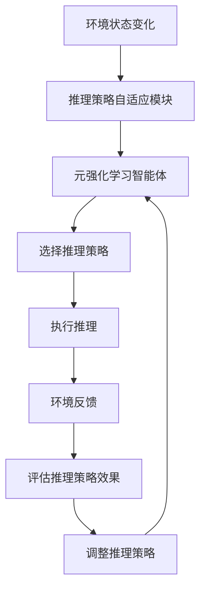

# 推理策略自适应中元强化学习的效果评估

> 关键词：推理策略自适应、元强化学习、效果评估、智能决策、强化学习算法

> 摘要：本文聚焦于推理策略自适应中元强化学习的效果评估。首先介绍了相关背景知识，包括研究目的、预期读者等内容。接着阐述了核心概念与联系，详细讲解了元强化学习和推理策略自适应的原理与架构。在核心算法原理部分，使用Python代码对相关算法进行了详细阐述。通过数学模型和公式深入剖析了元强化学习的内在机制，并举例说明。在项目实战中，给出了开发环境搭建步骤、源代码实现及解读。分析了实际应用场景，推荐了学习资源、开发工具框架和相关论文著作。最后总结了未来发展趋势与挑战，提供了常见问题解答和扩展阅读参考资料，旨在全面深入地探讨推理策略自适应中元强化学习效果评估的各个方面。

## 1. 背景介绍 
### 1.1 目的和范围
推理策略自适应是在复杂动态环境中实现智能决策的关键技术。元强化学习作为一种能够快速适应新任务的强化学习方法，在推理策略自适应中具有重要应用价值。本研究的目的在于深入探讨推理策略自适应中元强化学习的效果评估方法，通过科学合理的评估，明确元强化学习在推理策略自适应中的优势与不足，为进一步优化算法和提升性能提供依据。研究范围涵盖了元强化学习的基本原理、相关算法、数学模型，以及在不同应用场景下的效果评估等方面。

### 1.2 预期读者
本文预期读者包括人工智能领域的研究人员、对强化学习和智能决策感兴趣的开发者、相关专业的学生以及关注智能系统性能优化的技术爱好者。对于希望深入了解推理策略自适应和元强化学习技术，并掌握其效果评估方法的读者具有一定的参考价值。

### 1.3 文档结构概述
本文首先介绍背景知识，包括目的、读者和文档结构等。接着阐述核心概念与联系，通过文本示意图和Mermaid流程图展示元强化学习与推理策略自适应的关系。然后讲解核心算法原理，使用Python代码详细说明。通过数学模型和公式深入分析元强化学习的内在机制并举例。在项目实战部分，给出开发环境搭建步骤、源代码实现及解读。分析实际应用场景，推荐学习资源、开发工具框架和相关论文著作。最后总结未来发展趋势与挑战，提供常见问题解答和扩展阅读参考资料。

### 1.4 术语表
#### 1.4.1 核心术语定义
- **推理策略自适应**：指系统能够根据环境变化和任务需求，自动调整推理策略，以实现更高效、准确的决策过程。
- **元强化学习**：是一种强化学习的扩展，旨在通过学习如何学习，使智能体能够在新任务中快速适应并优化策略。
- **效果评估**：对元强化学习在推理策略自适应中的性能和效果进行量化和分析的过程。

#### 1.4.2 相关概念解释
- **强化学习**：一种通过智能体与环境进行交互，根据环境反馈的奖励信号来学习最优策略的机器学习方法。
- **策略**：智能体在给定状态下选择动作的规则。
- **状态**：环境的一种描述，反映了当前的情况和条件。

#### 1.4.3 缩略词列表
- **RL**：强化学习（Reinforcement Learning）
- **Meta - RL**：元强化学习（Meta Reinforcement Learning）

## 2. 核心概念与联系 
### 2.1 推理策略自适应原理
推理策略自适应是为了应对复杂多变的环境和任务需求而提出的一种智能决策方法。在实际应用中，环境的状态和任务的目标往往是动态变化的，传统的固定推理策略可能无法满足要求。推理策略自适应通过实时感知环境变化，根据环境信息和任务目标，自动调整推理策略，以实现更高效、准确的决策。

其基本原理可以描述为：智能体首先通过传感器获取环境的状态信息，然后根据当前的任务目标和状态信息，选择合适的推理策略。在执行推理过程中，智能体不断接收环境的反馈信息，根据反馈结果评估当前推理策略的效果，并根据评估结果对推理策略进行调整和优化。

### 2.2 元强化学习原理
元强化学习是在强化学习的基础上发展而来的。传统的强化学习需要智能体在每个新任务中从头开始学习，学习效率较低。而元强化学习的目标是让智能体学会如何学习，通过在多个相关任务上进行训练，智能体可以学习到通用的学习策略和知识，从而在面对新任务时能够快速适应并优化策略。

元强化学习的核心思想是引入元学习器，元学习器负责学习如何调整智能体的学习过程。在训练过程中，元学习器根据智能体在不同任务上的表现，调整智能体的学习参数和策略，使得智能体能够更快地收敛到最优策略。

### 2.3 两者联系
推理策略自适应和元强化学习之间存在着密切的联系。元强化学习为推理策略自适应提供了一种有效的方法和技术支持。通过元强化学习，智能体可以学习到在不同环境和任务下的通用推理策略，从而实现推理策略的自适应调整。

在推理策略自适应中，元强化学习可以帮助智能体快速适应新的环境和任务变化，提高推理策略的调整效率和准确性。同时，推理策略自适应的应用场景也为元强化学习提供了实践平台，促进了元强化学习技术的发展和完善。

### 2.4 文本示意图
推理策略自适应和元强化学习的关系可以用以下文本示意图表示：

环境状态变化 -> 推理策略自适应模块 -> 元强化学习智能体 -> 选择推理策略 -> 执行推理 -> 环境反馈 -> 评估推理策略效果 -> 调整推理策略 -> 循环迭代

### 2.5 Mermaid流程图


## 3. 核心算法原理 & 具体操作步骤 
### 3.1 元强化学习算法原理
元强化学习的核心算法有很多种，这里以基于模型无关的元学习（Model - Agnostic Meta - Learning，MAML）算法为例进行讲解。

MAML算法的基本思想是找到一个初始的策略参数，使得在经过少量的梯度更新后，智能体能够在新任务上快速适应并取得较好的性能。具体来说，MAML算法通过在多个任务上进行训练，不断调整初始策略参数，使得初始参数具有更好的泛化能力。

### 3.2 Python代码实现
```python
import torch
import torch.nn as nn
import torch.optim as optim

# 定义一个简单的策略网络
class PolicyNetwork(nn.Module):
    def __init__(self, input_dim, output_dim):
        super(PolicyNetwork, self).__init__()
        self.fc1 = nn.Linear(input_dim, 64)
        self.fc2 = nn.Linear(64, output_dim)

    def forward(self, x):
        x = torch.relu(self.fc1(x))
        x = self.fc2(x)
        return x

# MAML算法实现
class MAML:
    def __init__(self, input_dim, output_dim, alpha=0.01, beta=0.001, num_tasks=10, num_updates=5):
        self.policy = PolicyNetwork(input_dim, output_dim)
        self.alpha = alpha  # 内循环学习率
        self.beta = beta  # 外循环学习率
        self.num_tasks = num_tasks
        self.num_updates = num_updates
        self.meta_optimizer = optim.Adam(self.policy.parameters(), lr=self.beta)

    def inner_loop(self, task_data):
        temp_policy = PolicyNetwork(*list(self.policy.state_dict().values())[0].shape[:2])
        temp_policy.load_state_dict(self.policy.state_dict())
        inner_optimizer = optim.SGD(temp_policy.parameters(), lr=self.alpha)

        for _ in range(self.num_updates):
            states, actions, rewards = task_data
            logits = temp_policy(states)
            loss = self.compute_loss(logits, actions, rewards)
            inner_optimizer.zero_grad()
            loss.backward()
            inner_optimizer.step()

        return temp_policy

    def outer_loop(self, tasks_data):
        meta_loss = 0
        for task_data in tasks_data:
            temp_policy = self.inner_loop(task_data)
            states, actions, rewards = task_data
            logits = temp_policy(states)
            loss = self.compute_loss(logits, actions, rewards)
            meta_loss += loss

        meta_loss /= self.num_tasks
        self.meta_optimizer.zero_grad()
        meta_loss.backward()
        self.meta_optimizer.step()

    def compute_loss(self, logits, actions, rewards):
        # 简单的均方误差损失
        loss_fn = nn.MSELoss()
        return loss_fn(logits, actions * rewards)
```

### 3.3 具体操作步骤
1. **初始化参数**：设置输入维度、输出维度、内循环学习率 $\alpha$、外循环学习率 $\beta$、任务数量和内循环更新次数等参数。
2. **定义策略网络**：使用`PolicyNetwork`类定义一个简单的策略网络。
3. **初始化MAML对象**：创建`MAML`类的实例，传入相应的参数。
4. **收集任务数据**：收集多个任务的数据，每个任务数据包括状态、动作和奖励。
5. **执行内循环**：对于每个任务，在临时策略网络上进行多次梯度更新，得到临时策略。
6. **执行外循环**：计算所有任务的元损失，对元损失进行反向传播，更新主策略网络的参数。
7. **重复步骤4 - 6**：不断迭代，直到达到收敛条件。

## 4. 数学模型和公式 & 详细讲解 & 举例说明 
### 4.1 元强化学习的数学模型
元强化学习的目标是找到一个初始策略参数 $\theta$，使得在经过少量的梯度更新后，智能体能够在新任务上快速适应并取得较好的性能。

设 $T = \{T_1, T_2, \cdots, T_N\}$ 是一组任务集合，每个任务 $T_i$ 有自己的奖励函数 $r_i(s, a)$ 和状态转移函数 $p_i(s'|s, a)$。智能体的策略为 $\pi_{\theta}(a|s)$，其中 $\theta$ 是策略参数。

在 MAML 算法中，内循环的目标是在每个任务 $T_i$ 上对策略参数进行一次或多次梯度更新，得到临时参数 $\theta_i'$：

$$\theta_i' = \theta - \alpha \nabla_{\theta} \mathcal{L}(\pi_{\theta}, T_i)$$

其中，$\alpha$ 是内循环学习率，$\mathcal{L}(\pi_{\theta}, T_i)$ 是任务 $T_i$ 上的损失函数。

外循环的目标是最小化所有任务上临时参数的平均损失：

$$\min_{\theta} \sum_{i = 1}^{N} \mathcal{L}(\pi_{\theta_i'}, T_i)$$

### 4.2 公式详细讲解
- **内循环更新公式**：$\theta_i' = \theta - \alpha \nabla_{\theta} \mathcal{L}(\pi_{\theta}, T_i)$。这个公式表示在任务 $T_i$ 上，根据当前策略参数 $\theta$ 计算损失函数的梯度，然后使用梯度下降法更新参数，得到临时参数 $\theta_i'$。内循环学习率 $\alpha$ 控制了每次更新的步长。
- **外循环目标函数**：$\min_{\theta} \sum_{i = 1}^{N} \mathcal{L}(\pi_{\theta_i'}, T_i)$。这个公式表示在所有任务上，最小化临时参数 $\theta_i'$ 对应的策略的损失。通过不断调整初始参数 $\theta$，使得在不同任务上经过少量更新后，策略能够取得较好的性能。

### 4.3 举例说明
假设我们有两个任务 $T_1$ 和 $T_2$，每个任务的状态空间是二维的，动作空间是一维的。初始策略参数 $\theta$ 是一个随机初始化的向量。

在任务 $T_1$ 上，我们根据当前策略 $\pi_{\theta}$ 与环境交互，得到一组状态、动作和奖励数据。计算损失函数 $\mathcal{L}(\pi_{\theta}, T_1)$，并根据内循环更新公式得到临时参数 $\theta_1'$。

同样，在任务 $T_2$ 上进行相同的操作，得到临时参数 $\theta_2'$。

然后，计算外循环的目标函数 $\sum_{i = 1}^{2} \mathcal{L}(\pi_{\theta_i'}, T_i)$，并根据梯度下降法更新初始参数 $\theta$。不断重复这个过程，直到收敛。

## 5. 项目实战：代码实际案例和详细解释说明 
### 5.1  开发环境搭建
1. **安装Python**：建议使用Python 3.7及以上版本。可以从Python官方网站（https://www.python.org/downloads/）下载并安装。
2. **安装PyTorch**：PyTorch是一个深度学习框架，用于实现元强化学习算法。可以根据自己的系统和CUDA版本，从PyTorch官方网站（https://pytorch.org/get-started/locally/）选择合适的安装命令进行安装。
3. **安装其他依赖库**：根据项目需求，可能需要安装一些其他的依赖库，如`numpy`、`matplotlib`等。可以使用`pip`命令进行安装：
```sh
pip install numpy matplotlib
```

### 5.2  源代码详细实现和代码解读
```python
import torch
import torch.nn as nn
import torch.optim as optim
import numpy as np
import matplotlib.pyplot as plt

# 定义一个简单的策略网络
class PolicyNetwork(nn.Module):
    def __init__(self, input_dim, output_dim):
        super(PolicyNetwork, self).__init__()
        self.fc1 = nn.Linear(input_dim, 64)
        self.fc2 = nn.Linear(64, output_dim)

    def forward(self, x):
        x = torch.relu(self.fc1(x))
        x = self.fc2(x)
        return x

# MAML算法实现
class MAML:
    def __init__(self, input_dim, output_dim, alpha=0.01, beta=0.001, num_tasks=10, num_updates=5):
        self.policy = PolicyNetwork(input_dim, output_dim)
        self.alpha = alpha  # 内循环学习率
        self.beta = beta  # 外循环学习率
        self.num_tasks = num_tasks
        self.num_updates = num_updates
        self.meta_optimizer = optim.Adam(self.policy.parameters(), lr=self.beta)

    def inner_loop(self, task_data):
        temp_policy = PolicyNetwork(*list(self.policy.state_dict().values())[0].shape[:2])
        temp_policy.load_state_dict(self.policy.state_dict())
        inner_optimizer = optim.SGD(temp_policy.parameters(), lr=self.alpha)

        for _ in range(self.num_updates):
            states, actions, rewards = task_data
            logits = temp_policy(states)
            loss = self.compute_loss(logits, actions, rewards)
            inner_optimizer.zero_grad()
            loss.backward()
            inner_optimizer.step()

        return temp_policy

    def outer_loop(self, tasks_data):
        meta_loss = 0
        for task_data in tasks_data:
            temp_policy = self.inner_loop(task_data)
            states, actions, rewards = task_data
            logits = temp_policy(states)
            loss = self.compute_loss(logits, actions, rewards)
            meta_loss += loss

        meta_loss /= self.num_tasks
        self.meta_optimizer.zero_grad()
        meta_loss.backward()
        self.meta_optimizer.step()

    def compute_loss(self, logits, actions, rewards):
        # 简单的均方误差损失
        loss_fn = nn.MSELoss()
        return loss_fn(logits, actions * rewards)

# 生成任务数据
def generate_task_data(num_tasks, num_samples, input_dim, output_dim):
    tasks_data = []
    for _ in range(num_tasks):
        states = torch.randn(num_samples, input_dim)
        actions = torch.randn(num_samples, output_dim)
        rewards = torch.randn(num_samples, output_dim)
        tasks_data.append((states, actions, rewards))
    return tasks_data

# 训练过程
def train_maml(maml, num_epochs, num_tasks, num_samples, input_dim, output_dim):
    losses = []
    for epoch in range(num_epochs):
        tasks_data = generate_task_data(num_tasks, num_samples, input_dim, output_dim)
        maml.outer_loop(tasks_data)
        meta_loss = 0
        for task_data in tasks_data:
            temp_policy = maml.inner_loop(task_data)
            states, actions, rewards = task_data
            logits = temp_policy(states)
            loss = maml.compute_loss(logits, actions, rewards)
            meta_loss += loss
        meta_loss /= num_tasks
        losses.append(meta_loss.item())
        if epoch % 10 == 0:
            print(f'Epoch {epoch}: Loss = {meta_loss.item()}')
    return losses

# 主函数
if __name__ == '__main__':
    input_dim = 2
    output_dim = 1
    num_tasks = 10
    num_samples = 100
    num_epochs = 100
    maml = MAML(input_dim, output_dim)
    losses = train_maml(maml, num_epochs, num_tasks, num_samples, input_dim, output_dim)

    # 绘制损失曲线
    plt.plot(losses)
    plt.xlabel('Epoch')
    plt.ylabel('Loss')
    plt.title('MAML Training Loss')
    plt.show()
```

### 5.3  代码解读与分析
1. **策略网络定义**：`PolicyNetwork`类定义了一个简单的全连接神经网络，用于表示智能体的策略。
2. **MAML类实现**：`MAML`类实现了MAML算法的核心逻辑，包括内循环和外循环。
    - **内循环**：在每个任务上对临时策略网络进行多次梯度更新，得到临时参数。
    - **外循环**：计算所有任务上临时参数的平均损失，对主策略网络的参数进行更新。
3. **任务数据生成**：`generate_task_data`函数用于生成随机的任务数据，包括状态、动作和奖励。
4. **训练过程**：`train_maml`函数实现了训练过程，不断迭代执行外循环，并记录每个epoch的损失。
5. **主函数**：在主函数中，设置参数，创建`MAML`对象，调用`train_maml`函数进行训练，并绘制损失曲线。

通过分析损失曲线，我们可以观察到MAML算法在训练过程中的收敛情况。如果损失曲线逐渐下降并趋于稳定，说明算法在不断学习和优化。

## 6. 实际应用场景 
### 6.1 机器人控制
在机器人控制领域，环境和任务往往是复杂多变的。例如，机器人在不同的地形上执行任务，或者需要完成不同类型的操作。推理策略自适应中元强化学习可以帮助机器人快速适应新的环境和任务要求，调整控制策略，提高机器人的灵活性和适应性。

### 6.2 自动驾驶
自动驾驶汽车需要在各种不同的道路和交通条件下行驶。元强化学习可以让自动驾驶系统学习到通用的驾驶策略，在遇到新的路况和交通场景时，能够快速调整决策，确保行车安全和高效。

### 6.3 游戏AI
在游戏领域，游戏环境和对手的策略都是动态变化的。推理策略自适应中元强化学习可以让游戏AI快速适应新的游戏场景和对手的变化，制定出更有效的游戏策略，提高游戏AI的智能水平。

### 6.4 资源管理
在云计算、数据中心等领域，资源的需求和使用情况是不断变化的。元强化学习可以帮助系统自适应地调整资源分配策略，提高资源利用率和系统性能。

## 7. 工具和资源推荐
### 7.1 学习资源推荐
#### 7.1.1 书籍推荐
- 《强化学习：原理与Python实现》：这本书系统地介绍了强化学习的基本原理和算法，通过Python代码实现了多个经典的强化学习算法，适合初学者入门。
- 《Deep Reinforcement Learning Hands-On》：深入讲解了深度强化学习的相关知识和技术，包括策略梯度、价值函数近似等内容，提供了丰富的实践案例。

#### 7.1.2 在线课程
- Coursera上的“Reinforcement Learning Specialization”：由知名教授授课，涵盖了强化学习的基础理论、算法和应用，通过视频讲解、作业和项目实践，帮助学习者深入掌握强化学习知识。
- Udemy上的“Practical Reinforcement Learning in Python”：通过Python代码实现多个强化学习项目，适合有一定编程基础的学习者。

#### 7.1.3 技术博客和网站
- OpenAI Blog：OpenAI发布的最新研究成果和技术文章，涵盖了人工智能、强化学习等领域的前沿知识。
- Medium上的“Towards Data Science”：有很多关于机器学习、强化学习的高质量文章，由业内专家和研究者分享经验和见解。

### 7.2 开发工具框架推荐
#### 7.2.1 IDE和编辑器
- PyCharm：一款专业的Python集成开发环境，提供了丰富的代码编辑、调试和版本控制功能，适合Python开发。
- Visual Studio Code：一款轻量级的代码编辑器，支持多种编程语言，通过安装相关插件可以方便地进行Python开发和调试。

#### 7.2.2 调试和性能分析工具
- TensorBoard：TensorFlow提供的可视化工具，可以用于监控训练过程中的损失、准确率等指标，帮助开发者分析模型的性能。
- Py-Spy：一个Python性能分析工具，可以实时监测Python程序的CPU使用情况，找出性能瓶颈。

#### 7.2.3 相关框架和库
- PyTorch：一个深度学习框架，提供了丰富的神经网络层和优化算法，支持GPU加速，适合实现元强化学习算法。
- Stable Baselines：一个基于OpenAI Gym的强化学习库，提供了多种预训练的强化学习算法和环境，方便开发者快速上手和实验。

### 7.3 相关论文著作推荐
#### 7.3.1 经典论文
- "Model - Agnostic Meta - Learning for Fast Adaptation of Deep Networks"：提出了MAML算法，是元强化学习领域的经典论文。
- "Proximal Policy Optimization Algorithms"：介绍了近端策略优化算法（PPO），是一种高效的策略梯度算法，在强化学习中得到了广泛应用。

#### 7.3.2 最新研究成果
- 关注顶级学术会议如NeurIPS、ICML、AAAI等，这些会议上发表的论文代表了人工智能和强化学习领域的最新研究成果。

#### 7.3.3 应用案例分析
- 一些知名企业和研究机构发布的应用案例，如谷歌的AlphaGo、OpenAI的Dota 2 AI等，可以帮助我们了解元强化学习在实际应用中的效果和挑战。

## 8. 总结：未来发展趋势与挑战
### 8.1 未来发展趋势
- **多智能体元强化学习**：随着多智能体系统的广泛应用，多智能体元强化学习将成为一个重要的研究方向。通过多智能体元强化学习，智能体之间可以更好地协作和竞争，提高系统的整体性能。
- **结合其他技术**：元强化学习将与深度学习、计算机视觉、自然语言处理等技术相结合，拓展应用场景和功能。例如，在自动驾驶中结合计算机视觉技术，提高对环境的感知能力。
- **可解释性元强化学习**：随着元强化学习在关键领域的应用越来越多，对其可解释性的要求也越来越高。未来的研究将致力于提高元强化学习算法的可解释性，让用户更好地理解和信任智能决策过程。

### 8.2 挑战
- **计算资源需求**：元强化学习通常需要大量的计算资源和时间来训练模型，特别是在处理复杂任务和大规模数据集时。如何提高算法的计算效率，降低计算成本，是一个亟待解决的问题。
- **样本效率**：元强化学习需要在多个任务上进行训练，样本效率较低。如何提高样本效率，减少训练所需的样本数量，是提高元强化学习性能的关键。
- **环境适应性**：在实际应用中，环境往往是复杂多变的，元强化学习算法需要具备更强的环境适应性。如何让智能体在不同的环境中快速适应并优化策略，是一个挑战。

## 9. 附录：常见问题与解答
### 9.1 元强化学习和传统强化学习有什么区别？
传统强化学习需要智能体在每个新任务中从头开始学习，学习效率较低。而元强化学习通过学习如何学习，让智能体能够在新任务中快速适应并优化策略，提高了学习效率和泛化能力。

### 9.2 MAML算法的优缺点是什么？
优点：MAML算法具有较强的通用性和泛化能力，能够在不同的任务上快速适应。缺点：MAML算法的计算复杂度较高，需要大量的计算资源和时间来训练模型。

### 9.3 如何评估推理策略自适应中元强化学习的效果？
可以从多个方面进行评估，如学习效率、泛化能力、策略性能等。常用的评估指标包括奖励值、成功率、收敛速度等。

## 10. 扩展阅读 & 参考资料
### 10.1 扩展阅读
- "Meta - Learning: A Survey"：对元学习领域进行了全面的综述，介绍了元学习的基本概念、算法和应用。
- "Deep Reinforcement Learning: An Overview"：深入探讨了深度强化学习的相关知识和技术，包括算法原理、应用场景和未来发展趋势。

### 10.2 参考资料
- Sutton, R. S., & Barto, A. G. (2018). Reinforcement learning: An introduction. MIT press.
- Finn, C., Abbeel, P., & Levine, S. (2017). Model - agnostic meta - learning for fast adaptation of deep networks. In Proceedings of the 34th International Conference on Machine Learning - Volume 70 (pp. 1126 - 1135). JMLR. org.