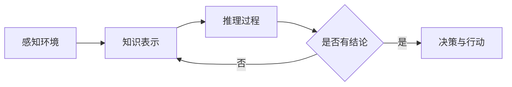

# 提升AI Agent的推理能力：技巧与方法

> 关键词：AI Agent、推理能力、技巧、方法、知识表示、算法优化

> 摘要：本文聚焦于提升AI Agent的推理能力，深入探讨相关的技巧与方法。首先介绍了AI Agent推理能力的背景知识，包括目的、预期读者、文档结构和术语表等内容。接着阐述了核心概念与联系，以清晰的文本示意图和Mermaid流程图呈现其原理和架构。详细讲解了核心算法原理并给出Python源代码示例，同时介绍了相关的数学模型和公式。通过项目实战，给出代码实际案例并进行详细解释说明。分析了AI Agent推理能力的实际应用场景，推荐了相关的工具和资源。最后总结了未来发展趋势与挑战，提供了常见问题与解答以及扩展阅读和参考资料，旨在为提升AI Agent的推理能力提供全面且深入的技术指导。

## 1. 背景介绍 
### 1.1 目的和范围
AI Agent作为人工智能领域的重要组成部分，其推理能力直接影响到其在各种复杂任务中的表现。本文章的目的在于系统地探讨提升AI Agent推理能力的技巧与方法，涵盖从基础概念到实际应用的多个层面。范围包括常见的推理算法、知识表示方法、以及在不同场景下的优化策略等，旨在为研究人员、开发者和相关从业者提供全面的技术参考。

### 1.2 预期读者
本文预期读者包括但不限于人工智能领域的研究人员、AI Agent开发者、计算机科学专业的学生以及对AI Agent推理能力感兴趣的技术爱好者。无论您是希望深入了解理论知识，还是想要在实际项目中提升AI Agent的性能，都能从本文中获得有价值的信息。

### 1.3 文档结构概述
本文将按照以下结构进行阐述：首先介绍背景知识，包括目的、读者和术语表等；接着深入探讨核心概念与联系，以图形化的方式呈现推理能力的原理和架构；然后详细讲解核心算法原理并给出Python代码示例；介绍相关的数学模型和公式；通过项目实战展示代码实现和分析；分析实际应用场景；推荐相关的工具和资源；最后总结未来发展趋势与挑战，提供常见问题解答和扩展阅读参考资料。

### 1.4 术语表
#### 1.4.1 核心术语定义
- **AI Agent**：即人工智能智能体，是一种能够感知环境、根据感知信息进行决策并采取行动的实体。
- **推理能力**：指AI Agent根据已知信息和知识，通过逻辑推导、模式匹配等方法得出新结论或做出决策的能力。
- **知识表示**：将知识以计算机能够理解和处理的形式进行表示的方法。

#### 1.4.2 相关概念解释
- **逻辑推理**：基于逻辑规则进行推导的过程，包括演绎推理、归纳推理等。
- **机器学习推理**：利用机器学习模型进行预测和决策的过程。
- **知识图谱**：一种以图的形式表示知识的结构，用于存储和管理实体之间的关系。

#### 1.4.3 缩略词列表
- **AI**：Artificial Intelligence（人工智能）
- **ML**：Machine Learning（机器学习）
- **DL**：Deep Learning（深度学习）

## 2. 核心概念与联系 

### 核心概念原理
AI Agent的推理能力建立在多个核心概念之上。首先是知识表示，它是推理的基础，将现实世界的知识转化为计算机能够处理的形式，常见的知识表示方法包括谓词逻辑、语义网络、框架等。逻辑推理则是基于这些知识表示进行的操作，通过逻辑规则进行推导，例如在谓词逻辑中，根据前提条件推导出结论。机器学习推理则是利用训练好的模型对输入数据进行预测和分类，例如使用神经网络模型对图像进行识别。

知识图谱是一种重要的知识表示形式，它将实体和实体之间的关系以图的形式表示出来，使得AI Agent能够更好地理解和处理复杂的知识。例如，在一个知识图谱中，“苹果”是一个实体，它与“水果”有“属于”的关系，与“种植”有“被种植”的关系等。

### 架构的文本示意图
```plaintext
              +-----------------+
              |  感知模块       |
              +-----------------+
                      |
                      v
              +-----------------+
              |  知识表示模块   |
              +-----------------+
                      |
                      v
              +-----------------+
              |  推理模块       |
              +-----------------+
                      |
                      v
              +-----------------+
              |  决策与行动模块 |
              +-----------------+
```
这个示意图展示了AI Agent的基本架构，感知模块负责获取环境信息，知识表示模块将信息转化为知识，推理模块根据知识进行推理，决策与行动模块根据推理结果做出决策并采取行动。

### Mermaid流程图

这个流程图展示了AI Agent的推理过程。首先感知环境信息，将其进行知识表示，然后进行推理。如果推理得出结论，则进行决策与行动；如果没有得出结论，则返回知识表示阶段，可能需要获取更多信息或调整知识表示方法。

## 3. 核心算法原理 & 具体操作步骤 

### 基于规则的推理算法
基于规则的推理是一种常见的推理方法，它通过定义一系列的规则来进行推理。例如，在一个简单的专家系统中，规则可以表示为“如果条件A成立，且条件B成立，则结论C成立”。

以下是一个基于规则的推理算法的Python实现示例：
```python
# 定义规则
rules = [
    {"conditions": ["A", "B"], "conclusion": "C"},
    {"conditions": ["C", "D"], "conclusion": "E"}
]

# 定义已知事实
facts = ["A", "B", "D"]

# 推理函数
def rule_based_reasoning(rules, facts):
    new_facts = set(facts)
    while True:
        added = False
        for rule in rules:
            conditions = rule["conditions"]
            conclusion = rule["conclusion"]
            if all(condition in new_facts for condition in conditions) and conclusion not in new_facts:
                new_facts.add(conclusion)
                added = True
        if not added:
            break
    return new_facts

# 进行推理
result = rule_based_reasoning(rules, facts)
print("推理结果:", result)
```
### 具体操作步骤
1. **定义规则**：将领域知识转化为规则的形式，每个规则包含条件和结论。
2. **定义已知事实**：确定当前已知的信息。
3. **推理过程**：不断遍历规则，检查条件是否满足，如果满足且结论不在已知事实中，则将结论添加到已知事实中。
4. **终止条件**：当没有新的事实可以添加时，推理结束。

### 基于机器学习的推理算法
基于机器学习的推理通常使用训练好的模型进行预测。以下是一个使用简单的线性回归模型进行推理的Python示例：
```python
import numpy as np
from sklearn.linear_model import LinearRegression

# 准备训练数据
X_train = np.array([[1], [2], [3], [4], [5]])
y_train = np.array([2, 4, 6, 8, 10])

# 训练模型
model = LinearRegression()
model.fit(X_train, y_train)

# 进行推理
X_test = np.array([[6]])
y_pred = model.predict(X_test)
print("推理结果:", y_pred)
```
### 具体操作步骤
1. **数据准备**：收集和整理训练数据。
2. **模型选择**：选择合适的机器学习模型，例如线性回归、决策树等。
3. **模型训练**：使用训练数据对模型进行训练。
4. **推理过程**：使用训练好的模型对新数据进行预测。

## 4. 数学模型和公式 & 详细讲解 & 举例说明 

### 逻辑推理中的数学模型
在逻辑推理中，常用的数学模型是谓词逻辑。谓词逻辑使用谓词和量词来表示命题和推理规则。例如，命题“所有的人都会死亡”可以表示为 $\forall x (Person(x) \to Mortal(x))$，其中 $\forall$ 是全称量词，表示“所有”，$Person(x)$ 表示 $x$ 是一个人，$Mortal(x)$ 表示 $x$ 会死亡。

### 推理规则
在谓词逻辑中，常见的推理规则包括假言推理和拒取式推理。
- **假言推理**：如果已知 $P \to Q$ 和 $P$，则可以推出 $Q$。例如，如果已知“如果今天下雨，那么地面会湿”（$P \to Q$），且“今天下雨”（$P$），则可以推出“地面会湿”（$Q$）。
- **拒取式推理**：如果已知 $P \to Q$ 和 $\neg Q$，则可以推出 $\neg P$。例如，如果已知“如果今天下雨，那么地面会湿”（$P \to Q$），且“地面没有湿”（$\neg Q$），则可以推出“今天没有下雨”（$\neg P$）。

### 机器学习推理中的数学模型
在机器学习推理中，线性回归是一种常见的数学模型。线性回归的目标是找到一条直线 $y = wx + b$，使得预测值 $\hat{y}$ 与真实值 $y$ 之间的误差最小。误差通常使用均方误差（MSE）来衡量，公式为：
$$MSE = \frac{1}{n} \sum_{i=1}^{n} (y_i - \hat{y}_i)^2$$
其中 $n$ 是样本数量，$y_i$ 是真实值，$\hat{y}_i$ 是预测值。

为了最小化均方误差，通常使用梯度下降法来更新模型参数 $w$ 和 $b$。梯度下降法的更新公式为：
$$w = w - \alpha \frac{\partial MSE}{\partial w}$$
$$b = b - \alpha \frac{\partial MSE}{\partial b}$$
其中 $\alpha$ 是学习率。

### 举例说明
假设有以下训练数据：
| $x$ | $y$ |
|---|---|
| 1 | 2 |
| 2 | 4 |
| 3 | 6 |

我们可以使用线性回归模型来拟合这些数据。首先，初始化参数 $w = 0$ 和 $b = 0$，然后使用梯度下降法进行迭代更新。经过多次迭代后，我们可以得到最优的参数 $w = 2$ 和 $b = 0$，此时线性回归模型为 $y = 2x$。当输入 $x = 4$ 时，预测值 $\hat{y} = 2 \times 4 = 8$。

## 5. 项目实战：代码实际案例和详细解释说明 

### 5.1  开发环境搭建
本项目使用Python进行开发，需要安装以下库：
- `numpy`：用于数值计算。
- `scikit-learn`：用于机器学习模型的训练和推理。
- `networkx`：用于知识图谱的构建和操作。

可以使用以下命令进行安装：
```sh
pip install numpy scikit-learn networkx
```

### 5.2  源代码详细实现和代码解读
以下是一个结合知识图谱和机器学习推理的项目示例：
```python
import networkx as nx
import numpy as np
from sklearn.linear_model import LinearRegression

# 构建知识图谱
G = nx.Graph()
G.add_node("苹果", type="水果")
G.add_node("香蕉", type="水果")
G.add_node("种植", type="行为")
G.add_edge("苹果", "种植", relation="被种植")
G.add_edge("香蕉", "种植", relation="被种植")

# 准备训练数据
X_train = np.array([[1], [2], [3], [4], [5]])
y_train = np.array([2, 4, 6, 8, 10])

# 训练模型
model = LinearRegression()
model.fit(X_train, y_train)

# 知识图谱查询函数
def query_knowledge_graph(graph, entity):
    neighbors = list(graph.neighbors(entity))
    relations = [graph[entity][neighbor]["relation"] for neighbor in neighbors]
    return neighbors, relations

# 推理函数
def reasoning(graph, model, input_value):
    # 知识图谱查询
    neighbors, relations = query_knowledge_graph(graph, "苹果")
    print("知识图谱查询结果:", neighbors, relations)

    # 机器学习推理
    y_pred = model.predict(np.array([[input_value]]))
    print("机器学习推理结果:", y_pred)

    return neighbors, relations, y_pred

# 进行推理
reasoning(G, model, 6)
```
### 5.3  代码解读与分析
1. **知识图谱构建**：使用 `networkx` 库构建一个简单的知识图谱，包含实体和实体之间的关系。
2. **机器学习模型训练**：使用 `scikit-learn` 库训练一个线性回归模型。
3. **知识图谱查询函数**：定义一个函数用于查询知识图谱中某个实体的邻居和关系。
4. **推理函数**：结合知识图谱查询和机器学习推理，首先查询知识图谱，然后使用机器学习模型进行预测。
5. **推理过程**：调用推理函数进行推理，并输出查询结果和预测结果。

## 6. 实际应用场景 
### 智能客服
在智能客服系统中，AI Agent需要根据用户的问题进行推理，以提供准确的回答。例如，当用户询问“苹果手机的售后服务电话是多少”时，AI Agent可以通过知识图谱查询到苹果手机的品牌信息，然后根据相关规则或机器学习模型找到对应的售后服务电话。

### 医疗诊断
在医疗诊断中，AI Agent可以根据患者的症状、病史等信息进行推理，辅助医生做出诊断。例如，通过分析患者的症状和检查结果，结合医学知识图谱和机器学习模型，AI Agent可以预测患者可能患有的疾病，并提供相应的治疗建议。

### 自动驾驶
在自动驾驶中，AI Agent需要根据传感器获取的环境信息进行推理，做出决策并控制车辆的行驶。例如，当检测到前方有障碍物时，AI Agent可以通过推理判断障碍物的类型和距离，然后决定是刹车、避让还是继续行驶。

### 金融风险评估
在金融领域，AI Agent可以根据客户的信用记录、财务状况等信息进行推理，评估客户的信用风险。例如，通过分析客户的收入、负债、还款记录等数据，结合金融知识图谱和机器学习模型，AI Agent可以预测客户违约的可能性，并提供相应的风险评估报告。

## 7. 工具和资源推荐
### 7.1 学习资源推荐
#### 7.1.1 书籍推荐
- 《人工智能：一种现代的方法》：全面介绍了人工智能的各个领域，包括知识表示、推理、机器学习等。
- 《机器学习》：详细讲解了机器学习的基本概念、算法和应用。
- 《知识图谱：方法、实践与应用》：深入探讨了知识图谱的构建、查询和应用。

#### 7.1.2 在线课程
- Coursera上的“人工智能基础”课程：由知名高校教授授课，系统地介绍了人工智能的基础知识。
- edX上的“机器学习”课程：提供了丰富的视频教程和实践项目，帮助学习者掌握机器学习的核心技术。
- 中国大学MOOC上的“知识图谱”课程：结合实际案例，讲解知识图谱的理论和实践。

#### 7.1.3 技术博客和网站
- 机器之心：提供人工智能领域的最新技术动态和研究成果。
- 开源中国：分享开源项目和技术经验，包括AI Agent的开发和应用。
- arXiv：提供计算机科学领域的预印本论文，涵盖了AI Agent推理能力的最新研究。

### 7.2 开发工具框架推荐
#### 7.2.1 IDE和编辑器
- PyCharm：功能强大的Python集成开发环境，提供代码编辑、调试、版本控制等功能。
- Jupyter Notebook：交互式的开发环境，适合进行数据分析和机器学习实验。
- Visual Studio Code：轻量级的代码编辑器，支持多种编程语言和插件扩展。

#### 7.2.2 调试和性能分析工具
- Py-Spy：用于分析Python代码的性能瓶颈，找出耗时的函数和代码段。
- cProfile：Python内置的性能分析工具，提供详细的函数调用统计信息。
- TensorBoard：用于可视化深度学习模型的训练过程和性能指标。

#### 7.2.3 相关框架和库
- TensorFlow：开源的深度学习框架，提供丰富的神经网络模型和工具。
- PyTorch：另一个流行的深度学习框架，具有动态计算图和易于使用的API。
- RDFLib：用于处理RDF（资源描述框架）数据的Python库，可用于知识图谱的构建和查询。

### 7.3 相关论文著作推荐
#### 7.3.1 经典论文
- “A Logical Calculus of the Ideas Immanent in Nervous Activity”：由Warren S. McCulloch和Walter Pitts发表，奠定了神经网络的理论基础。
- “Learning Representations by Back-propagating Errors”：由David E. Rumelhart、Geoffrey E. Hinton和Ronald J. Williams发表，介绍了反向传播算法，推动了神经网络的发展。
- “Knowledge Representation and Reasoning”：对知识表示和推理的理论和方法进行了系统的阐述。

#### 7.3.2 最新研究成果
- 关注顶级学术会议如NeurIPS、ICML、AAAI等上的相关论文，了解AI Agent推理能力的最新研究进展。
- 查阅知名学术期刊如Journal of Artificial Intelligence Research（JAIR）、Artificial Intelligence等上的研究论文。

#### 7.3.3 应用案例分析
- 研究一些实际应用中的AI Agent推理能力案例，如谷歌的AlphaGo、IBM的Watson等，分析其技术实现和应用效果。

## 8. 总结：未来发展趋势与挑战
### 未来发展趋势
- **融合多种推理方法**：未来的AI Agent将融合基于规则的推理、机器学习推理、深度学习推理等多种方法，以提高推理的准确性和效率。
- **知识图谱的扩展和应用**：知识图谱将不断扩展和完善，涵盖更多领域的知识，并在AI Agent的推理中发挥更重要的作用。
- **可解释性推理**：随着AI技术的广泛应用，对AI Agent推理结果的可解释性要求越来越高。未来的研究将注重提高推理过程的可解释性，让用户更好地理解AI Agent的决策依据。
- **多模态推理**：结合图像、语音、文本等多种模态的信息进行推理，提高AI Agent对复杂环境的理解和处理能力。

### 挑战
- **知识获取和表示**：获取和表示高质量的知识是提升AI Agent推理能力的关键，但知识的获取和表示仍然面临着许多挑战，如知识的不确定性、知识的更新和维护等。
- **计算资源和效率**：复杂的推理算法和大规模的知识图谱需要大量的计算资源和时间，如何提高推理的效率是一个亟待解决的问题。
- **伦理和安全问题**：AI Agent的推理结果可能会对人类社会产生重大影响，如何确保AI Agent的推理过程和结果符合伦理和安全要求是一个重要的挑战。

## 9. 附录：常见问题与解答
### 如何选择合适的推理算法？
选择合适的推理算法需要考虑多个因素，如问题的类型、数据的特点、计算资源等。如果问题具有明确的规则和逻辑关系，可以选择基于规则的推理算法；如果数据量较大且具有复杂的模式，可以选择基于机器学习的推理算法。

### 如何提高知识图谱的质量？
提高知识图谱的质量可以从以下几个方面入手：
- **数据来源的可靠性**：选择可靠的数据来源，如权威的数据库、学术文献等。
- **知识的验证和更新**：对知识进行验证和更新，确保知识的准确性和时效性。
- **人工标注和审核**：通过人工标注和审核的方式，提高知识图谱的质量。

### 如何解决AI Agent推理结果的可解释性问题？
解决AI Agent推理结果的可解释性问题可以采用以下方法：
- **基于规则的解释**：如果使用基于规则的推理算法，可以直接解释推理的规则和过程。
- **特征重要性分析**：在机器学习推理中，可以分析特征的重要性，解释模型的决策依据。
- **可视化方法**：使用可视化方法展示推理过程和结果，帮助用户更好地理解。

## 10. 扩展阅读 & 参考资料
- 《人工智能原理与应用》，作者：王万良
- 《深度学习》，作者：Ian Goodfellow、Yoshua Bengio和Aaron Courville
- 相关学术论文和研究报告，如“Enhancing the Reasoning Ability of AI Agents”等。
- 在线技术论坛和社区，如Stack Overflow、GitHub等，获取更多的技术交流和代码示例。