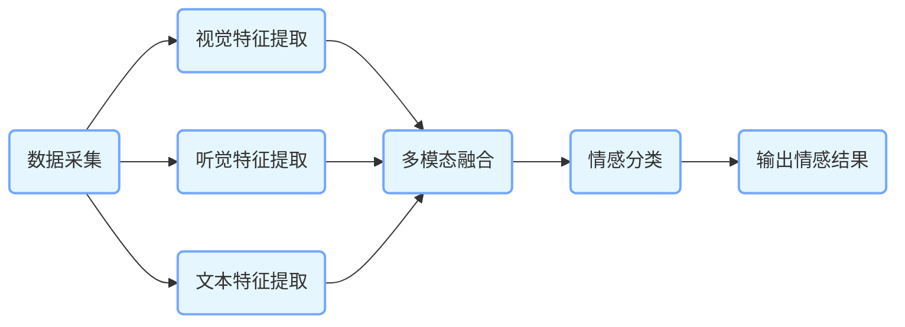

# 提升AI模型在跨模态情感识别任务中的准确性

> 关键词：AI模型、跨模态情感识别、准确性提升、多模态融合、特征提取

> 摘要：本文章聚焦于提升AI模型在跨模态情感识别任务中的准确性。跨模态情感识别融合多种模态信息来理解人类情感，具有重要的应用价值，但也面临诸多挑战。文章首先介绍了跨模态情感识别的背景，包括目的、预期读者等。接着深入探讨核心概念，阐述不同模态信息的联系和融合方式。详细讲解核心算法原理，通过Python代码进行演示。介绍相关数学模型和公式并举例说明。通过项目实战展示如何在实际中提升准确性，分析代码实现和解读。还介绍了跨模态情感识别的实际应用场景，推荐了相关工具和资源。最后总结未来发展趋势与挑战，解答常见问题并提供扩展阅读和参考资料，旨在为相关领域的研究和实践提供全面且深入的指导。

## 1. 背景介绍 
### 1.1 目的和范围
跨模态情感识别是指综合利用多种模态（如视觉、听觉、文本等）的信息来准确判断人类的情感状态。其目的在于突破单一模态信息的局限性，更全面、准确地理解人类情感，以应用于智能客服、智能教育、心理健康监测等多个领域。本文章的范围涵盖跨模态情感识别的基本概念、核心算法、数学模型、项目实战、应用场景等多个方面，旨在为提升AI模型在该任务中的准确性提供系统的理论和实践指导。

### 1.2 预期读者
本文预期读者包括人工智能领域的研究人员、工程师、对跨模态情感识别感兴趣的学生以及相关行业的从业者。无论是希望深入研究该领域理论的学者，还是致力于将跨模态情感识别技术应用于实际项目的开发者，都能从本文中获取有价值的信息。

### 1.3 文档结构概述
本文首先介绍跨模态情感识别的背景信息，包括目的、预期读者和文档结构。接着阐述核心概念，说明不同模态信息之间的联系和融合方式。然后详细讲解核心算法原理，通过Python代码展示具体实现步骤。之后介绍相关数学模型和公式，并举例说明其应用。再通过项目实战，展示如何搭建开发环境、实现源代码以及对代码进行解读。随后介绍跨模态情感识别的实际应用场景。接着推荐相关的工具和资源，包括学习资源、开发工具框架和相关论文著作。最后总结未来发展趋势与挑战，解答常见问题并提供扩展阅读和参考资料。

### 1.4 术语表
#### 1.4.1 核心术语定义
- **跨模态情感识别**：利用多种不同模态（如视觉、听觉、文本等）的信息来推断人类情感状态的过程。
- **多模态融合**：将来自不同模态的信息进行整合，以获取更全面、准确的情感信息。
- **特征提取**：从原始数据中提取出具有代表性的特征，以便后续的情感分析和分类。

#### 1.4.2 相关概念解释
- **模态**：指信息的表现形式，如视觉模态（图像、视频）、听觉模态（语音）、文本模态（文字）等。
- **情感状态**：人类的情绪表现，如高兴、悲伤、愤怒、惊讶等。

#### 1.4.3 缩略词列表
- **CNN**：Convolutional Neural Network，卷积神经网络
- **RNN**：Recurrent Neural Network，循环神经网络
- **LSTM**：Long Short - Term Memory，长短期记忆网络
- **GRU**：Gated Recurrent Unit，门控循环单元

## 2. 核心概念与联系 

### 核心概念原理
跨模态情感识别的核心在于融合多种模态的信息来更准确地理解人类情感。不同模态的信息具有不同的特点和优势，例如视觉模态可以捕捉面部表情、身体姿态等信息，听觉模态可以获取语音的语调、语速等特征，文本模态则能传达具体的语义信息。

单一模态的情感识别存在局限性，例如面部表情可能被刻意伪装，语音语调可能受到口音等因素的影响，文本语义可能存在歧义。通过多模态融合，可以综合利用各模态的优势，弥补单一模态的不足，从而提高情感识别的准确性。

### 架构的文本示意图
跨模态情感识别的基本架构通常包括以下几个部分：
1. **数据采集**：从不同的数据源收集视觉、听觉、文本等模态的数据。
2. **特征提取**：对每个模态的数据进行特征提取，得到具有代表性的特征向量。
3. **多模态融合**：将不同模态的特征向量进行融合，得到综合的特征表示。
4. **情感分类**：利用融合后的特征进行情感分类，判断情感状态。

### Mermaid 流程图


## 3. 核心算法原理 & 具体操作步骤 

### 特征提取算法
在跨模态情感识别中，不同模态的特征提取算法有所不同。以下是几种常见的特征提取算法及Python代码实现。

#### 视觉特征提取（使用预训练的CNN模型）
```python
import torch
import torchvision.models as models
from torchvision import transforms

# 加载预训练的ResNet模型
model = models.resnet18(pretrained=True)
model.eval()

# 定义图像预处理
preprocess = transforms.Compose([
    transforms.Resize(256),
    transforms.CenterCrop(224),
    transforms.ToTensor(),
    transforms.Normalize(mean=[0.485, 0.456, 0.406], std=[0.229, 0.224, 0.225])
])

def extract_visual_features(image):
    """
    提取图像的视觉特征
    :param image: PIL图像
    :return: 特征向量
    """
    input_tensor = preprocess(image)
    input_batch = input_tensor.unsqueeze(0)

    if torch.cuda.is_available():
        input_batch = input_batch.to('cuda')
        model.to('cuda')

    with torch.no_grad():
        features = model(input_batch)
    return features.squeeze().cpu().numpy()
```

#### 听觉特征提取（使用librosa库）
```python
import librosa
import numpy as np

def extract_audio_features(audio_path):
    """
    提取音频的特征
    :param audio_path: 音频文件路径
    :return: 特征向量
    """
    audio, sr = librosa.load(audio_path)
    mfccs = librosa.feature.mfcc(y=audio, sr=sr, n_mfcc=13)
    mfccs_mean = np.mean(mfccs, axis=1)
    return mfccs_mean
```

#### 文本特征提取（使用Word2Vec）
```python
from gensim.models import Word2Vec
import numpy as np

def extract_text_features(text, model):
    """
    提取文本的特征
    :param text: 文本
    :param model: Word2Vec模型
    :return: 特征向量
    """
    words = text.split()
    feature_vectors = []
    for word in words:
        if word in model.wv:
            feature_vectors.append(model.wv[word])
    if len(feature_vectors) == 0:
        return np.zeros(model.vector_size)
    else:
        return np.mean(feature_vectors, axis=0)
```

### 多模态融合算法
常见的多模态融合方法有早期融合、晚期融合和深度融合。以下是晚期融合的Python代码示例。

```python
import numpy as np

def late_fusion(visual_features, audio_features, text_features):
    """
    晚期融合
    :param visual_features: 视觉特征向量
    :param audio_features: 听觉特征向量
    :param text_features: 文本特征向量
    :return: 融合后的特征向量
    """
    return np.concatenate((visual_features, audio_features, text_features), axis=0)
```

### 情感分类算法（使用支持向量机）
```python
from sklearn.svm import SVC
from sklearn.model_selection import train_test_split
from sklearn.metrics import accuracy_score

def train_and_evaluate(X, y):
    """
    训练和评估支持向量机模型
    :param X: 特征矩阵
    :param y: 标签向量
    :return: 模型准确率
    """
    X_train, X_test, y_train, y_test = train_test_split(X, y, test_size=0.2, random_state=42)
    model = SVC()
    model.fit(X_train, y_train)
    y_pred = model.predict(X_test)
    accuracy = accuracy_score(y_test, y_pred)
    return accuracy
```

## 4. 数学模型和公式 & 详细讲解 & 举例说明 

### 特征提取的数学模型
#### 视觉特征提取（卷积操作）
卷积神经网络（CNN）中的卷积操作是视觉特征提取的核心。卷积操作可以用以下公式表示：

$$y_{i,j}^k=\sum_{m=0}^{M - 1}\sum_{n=0}^{N - 1}x_{i + m,j + n}^l\cdot w_{m,n}^{k,l}+b^k$$

其中，$x_{i,j}^l$ 是第 $l$ 层的输入特征图在位置 $(i,j)$ 的值，$w_{m,n}^{k,l}$ 是第 $k$ 个卷积核在位置 $(m,n)$ 的权重，$b^k$ 是第 $k$ 个卷积核的偏置，$y_{i,j}^k$ 是第 $k$ 个输出特征图在位置 $(i,j)$ 的值，$M$ 和 $N$ 是卷积核的大小。

例如，假设有一个 $3\times3$ 的卷积核，输入特征图的大小为 $5\times5$，则对于输出特征图的每个位置，需要将卷积核与输入特征图的对应区域进行元素相乘并求和，再加上偏置。

#### 听觉特征提取（MFCC计算）
梅尔频率倒谱系数（MFCC）是一种常用的音频特征。MFCC的计算步骤包括：
1. 分帧：将音频信号分成若干帧。
2. 加窗：对每一帧信号加窗，通常使用汉明窗。
3. 快速傅里叶变换（FFT）：将每一帧信号转换到频域。
4. 梅尔滤波器组：将频域信号通过梅尔滤波器组，得到梅尔频谱。
5. 对数运算：对梅尔频谱取对数。
6. 离散余弦变换（DCT）：对对数梅尔频谱进行离散余弦变换，得到MFCC。

MFCC的计算公式较为复杂，这里不详细列出。

#### 文本特征提取（Word2Vec）
Word2Vec是一种将单词转换为向量的方法。其基本思想是通过训练一个神经网络，使得在语义上相近的单词在向量空间中也相近。Word2Vec有两种训练模型：CBOW（Continuous Bag - of - Words）和Skip - gram。

CBOW模型的目标是根据上下文单词预测中心单词，其数学模型可以表示为：

$$\hat{w}=\arg\max_{w\in V}P(w|context)=\frac{\exp(u_w^Tv_{context})}{\sum_{w'\in V}\exp(u_{w'}^Tv_{context})}$$

其中，$V$ 是词汇表，$u_w$ 是单词 $w$ 的输出向量，$v_{context}$ 是上下文单词的平均输入向量。

### 多模态融合的数学模型
#### 早期融合
早期融合是在原始数据层面进行融合。假设 $x^v$、$x^a$、$x^t$ 分别是视觉、听觉、文本的原始数据，则早期融合后的数据 $x$ 可以表示为：

$$x = [x^v;x^a;x^t]$$

其中，$[;]$ 表示向量拼接操作。

#### 晚期融合
晚期融合是在特征层面进行融合。假设 $f^v$、$f^a$、$f^t$ 分别是视觉、听觉、文本的特征向量，则晚期融合后 的特征向量 $f$ 可以表示为：

$$f = [f^v;f^a;f^t]$$

#### 深度融合
深度融合是通过神经网络将不同模态的信息进行融合。例如，在一个多模态深度神经网络中，不同模态的输入首先经过各自的子网络进行特征提取，然后将提取的特征进行拼接或加权求和，再通过后续的网络层进行情感分类。

### 情感分类的数学模型
#### 支持向量机（SVM）
支持向量机的目标是找到一个最优的超平面，使得不同类别的样本能够被最大程度地分开。对于线性可分的情况，SVM的优化问题可以表示为：

$$\min_{w,b}\frac{1}{2}\|w\|^2$$

$$s.t.\quad y_i(w^Tx_i + b)\geq1,\quad i = 1,2,\cdots,n$$

其中，$w$ 是超平面的法向量，$b$ 是偏置，$x_i$ 是样本特征向量，$y_i\in\{- 1,1\}$ 是样本标签，$n$ 是样本数量。

对于线性不可分的情况，可以引入松弛变量 $\xi_i$，将优化问题变为：

$$\min_{w,b,\xi}\frac{1}{2}\|w\|^2 + C\sum_{i = 1}^{n}\xi_i$$

$$s.t.\quad y_i(w^Tx_i + b)\geq1-\xi_i,\quad \xi_i\geq0,\quad i = 1,2,\cdots,n$$

其中，$C$ 是惩罚参数。

## 5. 项目实战：代码实际案例和详细解释说明 

### 5.1  开发环境搭建
#### 安装Python
首先，确保你已经安装了Python 3.x 版本。可以从Python官方网站（https://www.python.org/downloads/） 下载并安装。

#### 安装必要的库
使用以下命令安装必要的库：
```bash
pip install torch torchvision librosa gensim scikit-learn numpy pillow
```

### 5.2  源代码详细实现和代码解读
以下是一个完整的跨模态情感识别项目的代码示例：

```python
import torch
import torchvision.models as models
from torchvision import transforms
import librosa
import numpy as np
from gensim.models import Word2Vec
from sklearn.svm import SVC
from sklearn.model_selection import train_test_split
from sklearn.metrics import accuracy_score
from PIL import Image

# 视觉特征提取
model = models.resnet18(pretrained=True)
model.eval()

preprocess = transforms.Compose([
    transforms.Resize(256),
    transforms.CenterCrop(224),
    transforms.ToTensor(),
    transforms.Normalize(mean=[0.485, 0.456, 0.406], std=[0.229, 0.224, 0.225])
])

def extract_visual_features(image):
    input_tensor = preprocess(image)
    input_batch = input_tensor.unsqueeze(0)

    if torch.cuda.is_available():
        input_batch = input_batch.to('cuda')
        model.to('cuda')

    with torch.no_grad():
        features = model(input_batch)
    return features.squeeze().cpu().numpy()

# 听觉特征提取
def extract_audio_features(audio_path):
    audio, sr = librosa.load(audio_path)
    mfccs = librosa.feature.mfcc(y=audio, sr=sr, n_mfcc=13)
    mfccs_mean = np.mean(mfccs, axis=1)
    return mfccs_mean

# 文本特征提取
texts = ["This is a happy sentence", "I feel sad today"]
sentences = [text.split() for text in texts]
word2vec_model = Word2Vec(sentences, min_count=1)

def extract_text_features(text):
    words = text.split()
    feature_vectors = []
    for word in words:
        if word in word2vec_model.wv:
            feature_vectors.append(word2vec_model.wv[word])
    if len(feature_vectors) == 0:
        return np.zeros(word2vec_model.vector_size)
    else:
        return np.mean(feature_vectors, axis=0)

# 多模态融合
def late_fusion(visual_features, audio_features, text_features):
    return np.concatenate((visual_features, audio_features, text_features), axis=0)

# 模拟数据
image = Image.open('test_image.jpg')
audio_path = 'test_audio.wav'
text = "This is a test sentence"

visual_features = extract_visual_features(image)
audio_features = extract_audio_features(audio_path)
text_features = extract_text_features(text)

fused_features = late_fusion(visual_features, audio_features, text_features)

# 模拟标签
labels = np.array([0, 1])  # 0表示高兴，1表示悲伤
features = np.array([fused_features, fused_features])  # 模拟多个样本

# 训练和评估
X_train, X_test, y_train, y_test = train_test_split(features, labels, test_size=0.2, random_state=42)
model = SVC()
model.fit(X_train, y_train)
y_pred = model.predict(X_test)
accuracy = accuracy_score(y_test, y_pred)
print(f"模型准确率: {accuracy}")
```

### 5.3  代码解读与分析
1. **视觉特征提取**：使用预训练的ResNet18模型对图像进行特征提取。首先对图像进行预处理，然后将其输入到模型中，最后得到特征向量。
2. **听觉特征提取**：使用librosa库提取音频的MFCC特征，并取平均值作为最终的特征向量。
3. **文本特征提取**：使用Word2Vec模型将文本转换为向量。首先训练Word2Vec模型，然后将文本中的每个单词转换为向量，最后取平均值作为文本的特征向量。
4. **多模态融合**：使用晚期融合的方法，将视觉、听觉、文本的特征向量进行拼接。
5. **情感分类**：使用支持向量机对融合后的特征向量进行分类，评估模型的准确率。

## 6. 实际应用场景 
### 智能客服
在智能客服系统中，跨模态情感识别可以帮助客服更好地理解用户的情绪状态。通过分析用户的语音语调、面部表情（如果有视频交互）和文本内容，智能客服可以及时调整回答策略，提供更个性化、更贴心的服务。例如，当识别到用户情绪愤怒时，客服可以更加耐心和温和地回应，以缓解用户的不满情绪。

### 智能教育
在智能教育领域，跨模态情感识别可以用于监测学生的学习状态和情绪变化。通过分析学生的面部表情、语音和课堂发言文本，教师可以了解学生对课程内容的掌握情况和学习兴趣。如果发现学生感到困惑或沮丧，教师可以及时调整教学方法，提供更多的帮助和支持。

### 心理健康监测
跨模态情感识别可以应用于心理健康监测系统。通过长期监测用户的语音、面部表情和日常文本记录，系统可以及时发现用户的情绪异常，如抑郁、焦虑等。这对于早期干预和治疗心理健康问题具有重要意义。

### 智能娱乐
在智能娱乐领域，跨模态情感识别可以用于实现个性化的娱乐体验。例如，智能电视可以根据用户的情绪状态推荐适合的电影、音乐或游戏。当用户情绪低落时，推荐一些喜剧电影或欢快的音乐，以帮助用户缓解情绪。

## 7. 工具和资源推荐
### 7.1 学习资源推荐
#### 7.1.1 书籍推荐
- 《深度学习》（Deep Learning）：由Ian Goodfellow、Yoshua Bengio和Aaron Courville所著，是深度学习领域的经典教材，涵盖了神经网络、卷积神经网络、循环神经网络等多个方面的内容。
- 《Python机器学习》（Python Machine Learning）：由Sebastian Raschka所著，详细介绍了Python在机器学习中的应用，包括数据预处理、模型选择、评估等内容。
- 《多模态机器学习：基础与应用》（Multimodal Machine Learning: Principles and Applications）：专门介绍多模态机器学习的书籍，对跨模态情感识别等多模态任务有深入的讲解。

#### 7.1.2 在线课程
- Coursera上的“深度学习专项课程”（Deep Learning Specialization）：由Andrew Ng教授授课，包括神经网络和深度学习、改善深层神经网络、结构化机器学习项目等多个课程，是学习深度学习的优质资源。
- edX上的“人工智能基础”（Fundamentals of Artificial Intelligence）：介绍了人工智能的基本概念、算法和应用，对跨模态情感识别的理论基础有一定的帮助。
- 中国大学MOOC上的“机器学习”课程：由国内知名高校的教授授课，内容丰富，适合初学者学习。

#### 7.1.3 技术博客和网站
- Medium：上面有很多关于人工智能和机器学习的技术博客，其中不乏关于跨模态情感识别的最新研究成果和实践经验分享。
- arXiv：一个预印本平台，提供了大量的学术论文，包括跨模态情感识别领域的最新研究。
- Kaggle：一个数据科学竞赛平台，上面有很多关于多模态数据处理和情感识别的竞赛和数据集，可以通过参与竞赛来提高自己的实践能力。

### 7.2 开发工具框架推荐
#### 7.2.1 IDE和编辑器
- PyCharm：一款专业的Python集成开发环境，提供了代码编辑、调试、版本控制等功能，适合开发Python项目。
- Jupyter Notebook：一个交互式的开发环境，可以方便地进行代码编写、数据可视化和实验记录，非常适合机器学习和深度学习的实验。
- Visual Studio Code：一款轻量级的代码编辑器，支持多种编程语言和插件，具有丰富的扩展功能，可以满足不同的开发需求。

#### 7.2.2 调试和性能分析工具
- TensorBoard：一个用于可视化深度学习模型训练过程的工具，可以查看模型的损失曲线、准确率曲线、参数分布等信息，帮助调试和优化模型。
- PyTorch Profiler：PyTorch提供的性能分析工具，可以分析模型的运行时间、内存使用等情况，找出性能瓶颈。
- cProfile：Python标准库中的性能分析工具，可以对Python代码进行性能分析，找出代码中的性能瓶颈。

#### 7.2.3 相关框架和库
- PyTorch：一个开源的深度学习框架，提供了丰富的神经网络层和优化算法，支持GPU加速，非常适合开发深度学习模型。
- TensorFlow：另一个流行的深度学习框架，具有强大的分布式训练能力和丰富的工具集，广泛应用于工业界和学术界。
- scikit-learn：一个用于机器学习的Python库，提供了多种机器学习算法和工具，如分类、回归、聚类等，适合进行数据预处理和模型评估。

### 7.3 相关论文著作推荐
#### 7.3.1 经典论文
- 《Multimodal Machine Learning: A Survey and Taxonomy》：对多模态机器学习进行了全面的综述和分类，为跨模态情感识别的研究提供了理论基础。
- 《Deep Multimodal Learning: A Survey》：介绍了深度学习在多模态学习中的应用，包括多模态数据的表示、融合和分类等方面的内容。
- 《A Survey on Affective Computing: Technologies, Applications, and Challenges》：对情感计算进行了综述，涵盖了情感识别、情感合成等多个方面的内容。

#### 7.3.2 最新研究成果
- 关注顶级学术会议如ACM Multimedia、CVPR、ICML等上发表的关于跨模态情感识别的论文，这些论文通常代表了该领域的最新研究成果。
- 可以通过Google Scholar等学术搜索引擎，搜索“Cross - modal Emotion Recognition”相关的最新论文。

#### 7.3.3 应用案例分析
- 一些实际应用案例的研究论文可以帮助我们了解跨模态情感识别在不同领域的应用情况和挑战。例如，关于智能客服、智能教育等领域的跨模态情感识别应用案例论文。

## 8. 总结：未来发展趋势与挑战
### 未来发展趋势
#### 多模态融合方法的创新
未来将不断探索更加有效的多模态融合方法，以充分发挥不同模态信息的优势。例如，基于注意力机制的多模态融合方法可以更好地捕捉不同模态之间的关联和重要信息。

#### 跨模态情感识别模型的轻量化
随着移动设备和嵌入式系统的广泛应用，需要开发更加轻量化的跨模态情感识别模型。这些模型在保证准确性的前提下，能够在资源受限的设备上高效运行。

#### 与其他技术的融合
跨模态情感识别将与虚拟现实（VR）、增强现实（AR）、物联网（IoT）等技术进行深度融合。例如，在VR/AR场景中，通过跨模态情感识别可以实现更加沉浸式和个性化的体验；在物联网环境中，可以根据用户的情感状态智能控制设备。

### 挑战
#### 数据的获取和标注
跨模态情感识别需要大量的多模态数据，而这些数据的获取和标注是一项具有挑战性的任务。不同模态的数据采集设备和方法不同，数据的质量和一致性也难以保证。同时，情感标注的主观性较强，需要专业的标注人员进行标注。

#### 模态间的一致性和互补性
不同模态的信息可能存在不一致性和冲突，如何有效地处理这些问题是提高跨模态情感识别准确性的关键。此外，如何挖掘不同模态之间的互补性，充分发挥多模态信息的优势，也是一个需要解决的问题。

#### 计算资源和时间成本
跨模态情感识别通常需要处理大量的数据和复杂的模型，计算资源和时间成本较高。如何优化算法和模型，降低计算资源和时间成本，是实现跨模态情感识别技术广泛应用的关键。

## 9. 附录：常见问题与解答
### 1. 跨模态情感识别中哪种模态的信息更重要？
不同的应用场景和情感类型可能导致不同模态信息的重要性不同。一般来说，视觉模态的面部表情和身体姿态、听觉模态的语音语调、文本模态的语义信息都对情感识别有重要作用。在实际应用中，通常需要综合考虑多种模态的信息。

### 2. 如何处理跨模态数据中的缺失值？
处理跨模态数据中的缺失值可以采用以下方法：
- **删除缺失值**：如果缺失值的比例较小，可以直接删除包含缺失值的样本。
- **填充缺失值**：可以使用均值、中位数、众数等统计量填充缺失值，也可以使用机器学习模型预测缺失值。
- **多模态融合时的处理**：在多模态融合阶段，可以采用加权平均等方法，根据不同模态信息的可靠性进行融合，减少缺失值的影响。

### 3. 跨模态情感识别模型的训练时间过长怎么办？
可以采取以下措施来缩短训练时间：
- **优化模型结构**：选择更轻量级的模型结构，减少模型的参数数量。
- **使用GPU加速**：利用GPU的并行计算能力，加速模型的训练过程。
- **数据采样**：在训练过程中，可以对数据进行采样，减少训练数据的规模。
- **模型优化算法**：选择更高效的优化算法，如Adam、Adagrad等。

## 10. 扩展阅读 & 参考资料
### 扩展阅读
- 《情感计算》（Affective Computing）：深入探讨情感计算的理论和技术，对跨模态情感识别的相关理论有更深入的介绍。
- 《人工智能：一种现代方法》（Artificial Intelligence: A Modern Approach）：全面介绍人工智能的基本概念、算法和应用，为跨模态情感识别的研究提供更广泛的理论基础。

### 参考资料
- Goodfellow, I., Bengio, Y., & Courville, A. (2016). Deep Learning. MIT Press.
- Raschka, S. (2015). Python Machine Learning. Packt Publishing.
- Baltrušaitis, T., Ahuja, C., & Morency, L.-P. (2018). Multimodal Machine Learning: A Survey and Taxonomy. IEEE Transactions on Pattern Analysis and Machine Intelligence, 41(2), 423 - 443.