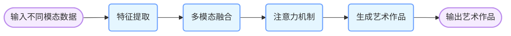

# 提升AI模型在跨模态艺术创作任务中的表现

> 关键词：AI模型、跨模态艺术创作、多模态融合、特征提取、注意力机制

> 摘要：本文聚焦于如何提升AI模型在跨模态艺术创作任务中的表现。首先介绍了相关背景，包括研究目的、预期读者、文档结构和术语表。接着阐述了跨模态艺术创作的核心概念与联系，通过文本示意图和Mermaid流程图展示其原理和架构。详细讲解了核心算法原理及具体操作步骤，并结合Python源代码进行说明。还介绍了相关的数学模型和公式，并举例说明。通过项目实战给出代码实际案例并详细解释。分析了跨模态艺术创作的实际应用场景，推荐了学习、开发工具和相关论文著作。最后总结了未来发展趋势与挑战，提供了常见问题解答和扩展阅读参考资料，旨在为提升AI模型在跨模态艺术创作领域的表现提供全面的技术指导和深入的思考。

## 1. 背景介绍 
### 1.1 目的和范围
随着人工智能技术的飞速发展，AI在艺术创作领域的应用越来越广泛。跨模态艺术创作是指结合多种不同模态的数据，如文本、图像、音频等，进行艺术作品的创作。本研究的目的在于探索如何提升AI模型在跨模态艺术创作任务中的表现，以生成更具创意、高质量的艺术作品。研究范围涵盖了跨模态数据的处理、模型架构的设计、算法的优化等方面，旨在为相关领域的研究和实践提供理论支持和技术指导。

### 1.2 预期读者
本文预期读者包括人工智能领域的研究人员、开发者、艺术创作者以及对跨模态艺术创作感兴趣的爱好者。对于研究人员，本文可以为他们的研究提供新的思路和方法；对于开发者，能够帮助他们在实际项目中提升AI模型的性能；对于艺术创作者，有助于他们更好地理解和应用AI技术进行艺术创作；对于爱好者，可以让他们了解跨模态艺术创作的技术原理和发展趋势。

### 1.3 文档结构概述
本文将按照以下结构进行阐述：首先介绍核心概念与联系，包括跨模态艺术创作的原理和架构；接着详细讲解核心算法原理和具体操作步骤，并给出Python源代码示例；然后介绍相关的数学模型和公式，并举例说明；通过项目实战展示代码实际案例并进行详细解释；分析跨模态艺术创作的实际应用场景；推荐学习、开发工具和相关论文著作；最后总结未来发展趋势与挑战，提供常见问题解答和扩展阅读参考资料。

### 1.4 术语表
#### 1.4.1 核心术语定义
- **跨模态**：指结合不同类型的数据模态，如文本、图像、音频等，以获取更丰富的信息和表达能力。
- **艺术创作**：通过创造性的思维和技巧，运用各种艺术媒介和手段，产生具有审美价值的艺术作品的过程。
- **AI模型**：基于人工智能技术构建的模型，用于处理和分析数据，并生成相应的输出。
- **多模态融合**：将不同模态的数据进行整合和处理，以实现更有效的信息利用和任务执行。

#### 1.4.2 相关概念解释
- **特征提取**：从原始数据中提取具有代表性的特征，以便于后续的处理和分析。在跨模态艺术创作中，需要对不同模态的数据进行特征提取，以获取其关键信息。
- **注意力机制**：一种模拟人类注意力的机制，用于在处理数据时聚焦于重要的部分，提高模型的性能和效率。在跨模态艺术创作中，注意力机制可以帮助模型更好地处理不同模态之间的关系。
- **生成对抗网络（GAN）**：一种由生成器和判别器组成的神经网络模型，通过对抗训练的方式生成逼真的数据。在跨模态艺术创作中，GAN可以用于生成具有创意的艺术作品。

#### 1.4.3 缩略词列表
- **CNN**：卷积神经网络（Convolutional Neural Network）
- **RNN**：循环神经网络（Recurrent Neural Network）
- **LSTM**：长短期记忆网络（Long Short-Term Memory）
- **Transformer**：一种基于注意力机制的神经网络架构
- **GAN**：生成对抗网络（Generative Adversarial Network）

## 2. 核心概念与联系 
### 核心概念原理
跨模态艺术创作的核心在于如何有效地融合不同模态的数据，以生成具有创意和审美价值的艺术作品。不同模态的数据具有不同的特征和表达方式，例如文本数据可以描述艺术作品的主题、情感等信息，图像数据可以直观地展示艺术作品的视觉效果，音频数据可以营造艺术作品的氛围。因此，需要采用合适的方法将这些不同模态的数据进行融合，以充分发挥它们的优势。

一种常见的方法是通过特征提取将不同模态的数据转换为统一的特征表示，然后利用多模态融合技术将这些特征进行整合。在融合过程中，可以采用注意力机制来关注不同模态之间的重要关系，从而提高模型对跨模态信息的处理能力。最后，通过生成模型生成艺术作品，如图像生成、音乐生成等。

### 架构的文本示意图
以下是一个跨模态艺术创作模型的架构示意图：

输入层：接收不同模态的数据，如文本、图像、音频等。
特征提取层：对不同模态的数据进行特征提取，将其转换为统一的特征表示。
多模态融合层：将不同模态的特征进行融合，利用注意力机制关注重要关系。
生成层：根据融合后的特征生成艺术作品，如图像、音乐等。

### Mermaid流程图


## 3. 核心算法原理 & 具体操作步骤 
### 特征提取算法
在跨模态艺术创作中，特征提取是非常重要的一步。对于不同模态的数据，需要采用不同的特征提取方法。

#### 文本特征提取
可以使用预训练的语言模型，如BERT、GPT等，对文本数据进行特征提取。以下是一个使用Python和transformers库进行文本特征提取的示例代码：
```python
from transformers import AutoTokenizer, AutoModel
import torch

# 加载预训练模型和分词器
tokenizer = AutoTokenizer.from_pretrained('bert-base-uncased')
model = AutoModel.from_pretrained('bert-base-uncased')

# 输入文本
text = "This is a beautiful art work."

# 分词
inputs = tokenizer(text, return_tensors='pt')

# 获取模型输出
outputs = model(**inputs)

# 提取特征
text_features = outputs.last_hidden_state.mean(dim=1)

print(text_features.shape)
```

#### 图像特征提取
可以使用预训练的卷积神经网络，如ResNet、VGG等，对图像数据进行特征提取。以下是一个使用Python和torchvision库进行图像特征提取的示例代码：
```python
import torch
import torchvision.models as models
import torchvision.transforms as transforms
from PIL import Image

# 加载预训练模型
model = models.resnet18(pretrained=True)
model.eval()

# 图像预处理
transform = transforms.Compose([
    transforms.Resize(256),
    transforms.CenterCrop(224),
    transforms.ToTensor(),
    transforms.Normalize(mean=[0.485, 0.456, 0.406], std=[0.229, 0.224, 0.225])
])

# 加载图像
image = Image.open('example.jpg')
image = transform(image).unsqueeze(0)

# 获取模型输出
with torch.no_grad():
    outputs = model(image)

# 提取特征
image_features = outputs

print(image_features.shape)
```

### 多模态融合算法
在特征提取之后，需要将不同模态的特征进行融合。一种常见的方法是采用拼接的方式将不同模态的特征连接在一起。以下是一个简单的Python代码示例：
```python
import torch

# 假设text_features和image_features是前面提取的文本和图像特征
text_features = torch.randn(1, 768)
image_features = torch.randn(1, 512)

# 多模态融合
fused_features = torch.cat((text_features, image_features), dim=1)

print(fused_features.shape)
```

### 注意力机制算法
注意力机制可以帮助模型更好地处理不同模态之间的关系。以下是一个简单的多头注意力机制的Python代码示例：
```python
import torch
import torch.nn as nn

class MultiHeadAttention(nn.Module):
    def __init__(self, input_dim, num_heads):
        super(MultiHeadAttention, self).__init__()
        self.num_heads = num_heads
        self.head_dim = input_dim // num_heads
        self.attn_dim = self.head_dim * num_heads

        self.query = nn.Linear(input_dim, self.attn_dim)
        self.key = nn.Linear(input_dim, self.attn_dim)
        self.value = nn.Linear(input_dim, self.attn_dim)
        self.out = nn.Linear(self.attn_dim, input_dim)

    def forward(self, x):
        batch_size = x.size(0)

        Q = self.query(x).view(batch_size, -1, self.num_heads, self.head_dim).transpose(1, 2)
        K = self.key(x).view(batch_size, -1, self.num_heads, self.head_dim).transpose(1, 2)
        V = self.value(x).view(batch_size, -1, self.num_heads, self.head_dim).transpose(1, 2)

        scores = torch.matmul(Q, K.transpose(-2, -1)) / (self.head_dim ** 0.5)
        attn_weights = torch.softmax(scores, dim=-1)
        attn_output = torch.matmul(attn_weights, V)

        attn_output = attn_output.transpose(1, 2).contiguous().view(batch_size, -1, self.attn_dim)
        output = self.out(attn_output)

        return output

# 使用示例
input_dim = 1280
num_heads = 8
x = torch.randn(1, 1, input_dim)
attention = MultiHeadAttention(input_dim, num_heads)
output = attention(x)

print(output.shape)
```

### 生成算法
可以使用生成对抗网络（GAN）来生成艺术作品。以下是一个简单的GAN模型的Python代码示例：
```python
import torch
import torch.nn as nn
import torch.optim as optim

# 生成器
class Generator(nn.Module):
    def __init__(self, input_dim, output_dim):
        super(Generator, self).__init__()
        self.model = nn.Sequential(
            nn.Linear(input_dim, 256),
            nn.LeakyReLU(0.2),
            nn.Linear(256, 512),
            nn.LeakyReLU(0.2),
            nn.Linear(512, output_dim),
            nn.Tanh()
        )

    def forward(self, x):
        return self.model(x)

# 判别器
class Discriminator(nn.Module):
    def __init__(self, input_dim):
        super(Discriminator, self).__init__()
        self.model = nn.Sequential(
            nn.Linear(input_dim, 512),
            nn.LeakyReLU(0.2),
            nn.Linear(512, 256),
            nn.LeakyReLU(0.2),
            nn.Linear(256, 1),
            nn.Sigmoid()
        )

    def forward(self, x):
        return self.model(x)

# 训练GAN
input_dim = 1280
output_dim = 784  # 假设生成的图像是28x28
batch_size = 32
num_epochs = 100
lr = 0.0002

generator = Generator(input_dim, output_dim)
discriminator = Discriminator(output_dim)

criterion = nn.BCELoss()
g_optimizer = optim.Adam(generator.parameters(), lr=lr)
d_optimizer = optim.Adam(discriminator.parameters(), lr=lr)

for epoch in range(num_epochs):
    # 生成随机噪声
    noise = torch.randn(batch_size, input_dim)

    # 生成假样本
    fake_samples = generator(noise)

    # 训练判别器
    real_labels = torch.ones(batch_size, 1)
    fake_labels = torch.zeros(batch_size, 1)

    d_optimizer.zero_grad()
    real_output = discriminator(real_samples)  # 假设real_samples是真实样本
    d_real_loss = criterion(real_output, real_labels)

    fake_output = discriminator(fake_samples.detach())
    d_fake_loss = criterion(fake_output, fake_labels)

    d_loss = d_real_loss + d_fake_loss
    d_loss.backward()
    d_optimizer.step()

    # 训练生成器
    g_optimizer.zero_grad()
    fake_output = discriminator(fake_samples)
    g_loss = criterion(fake_output, real_labels)
    g_loss.backward()
    g_optimizer.step()

    print(f'Epoch {epoch+1}/{num_epochs}, D_loss: {d_loss.item()}, G_loss: {g_loss.item()}')
```

## 4. 数学模型和公式 & 详细讲解 & 举例说明 
### 特征提取
#### 文本特征提取
在使用预训练的语言模型进行文本特征提取时，模型的输出可以表示为：

$$H = \text{Model}(X)$$

其中，$X$ 是输入的文本序列，$H$ 是模型的输出，通常是一个三维张量，形状为 $(batch\_size, sequence\_length, hidden\_dim)$。为了得到一个固定长度的特征向量，可以对 $H$ 进行池化操作，例如平均池化：

$$\text{text\_features} = \frac{1}{sequence\_length} \sum_{i=1}^{sequence\_length} H_{i}$$

举例说明：假设输入的文本序列长度为 10，隐藏维度为 768，经过平均池化后，得到的文本特征向量的维度为 768。

#### 图像特征提取
使用预训练的卷积神经网络进行图像特征提取时，模型的输出可以表示为：

$$F = \text{CNN}(I)$$

其中，$I$ 是输入的图像，$F$ 是模型的输出特征图。通常，会将特征图进行全局平均池化，得到一个固定长度的特征向量：

$$\text{image\_features} = \frac{1}{W \times H} \sum_{i=1}^{W} \sum_{j=1}^{H} F_{i,j}$$

其中，$W$ 和 $H$ 是特征图的宽度和高度。

举例说明：假设输入的图像大小为 224x224，经过ResNet18模型提取特征后，得到的特征图大小为 7x7，通道数为 512。经过全局平均池化后，得到的图像特征向量的维度为 512。

### 多模态融合
多模态融合通常采用拼接的方式，将不同模态的特征连接在一起。假设文本特征向量为 $\text{text\_features}$，图像特征向量为 $\text{image\_features}$，则融合后的特征向量可以表示为：

$$\text{fused\_features} = [\text{text\_features}; \text{image\_features}]$$

其中，$;$ 表示拼接操作。

举例说明：假设文本特征向量的维度为 768，图像特征向量的维度为 512，则融合后的特征向量的维度为 768 + 512 = 1280。

### 注意力机制
多头注意力机制的计算公式如下：

$$\text{Attention}(Q, K, V) = \text{softmax}(\frac{QK^T}{\sqrt{d_k}})V$$

其中，$Q$ 是查询矩阵，$K$ 是键矩阵，$V$ 是值矩阵，$d_k$ 是键的维度。

在多头注意力机制中，会将输入的特征向量分别投影到多个头中，然后对每个头进行注意力计算，最后将所有头的输出拼接在一起并进行线性变换。

$$\text{MultiHead}(Q, K, V) = \text{Concat}(\text{head}_1, \cdots, \text{head}_h)W^O$$

其中，$\text{head}_i = \text{Attention}(QW^Q_i, KW^K_i, VW^V_i)$，$W^Q_i$、$W^K_i$、$W^V_i$ 是投影矩阵，$W^O$ 是输出矩阵。

举例说明：假设输入的特征向量维度为 1280，头的数量为 8，则每个头的维度为 1280 / 8 = 160。在计算注意力时，会先将输入的特征向量分别投影到 8 个头中，每个头的维度为 160，然后进行注意力计算，最后将 8 个头的输出拼接在一起，得到维度为 1280 的输出。

### 生成对抗网络
生成对抗网络由生成器 $G$ 和判别器 $D$ 组成。生成器的目标是生成逼真的样本，判别器的目标是区分真实样本和生成的假样本。

生成器的损失函数可以表示为：

$$L_G = -\mathbb{E}_{z \sim p(z)}[\log D(G(z))]$$

其中，$z$ 是随机噪声，$p(z)$ 是噪声的分布。

判别器的损失函数可以表示为：

$$L_D = -\mathbb{E}_{x \sim p_{data}(x)}[\log D(x)] - \mathbb{E}_{z \sim p(z)}[\log (1 - D(G(z)))]$$

其中，$p_{data}(x)$ 是真实数据的分布。

在训练过程中，交替更新生成器和判别器的参数，直到达到收敛。

举例说明：假设生成器的输入是一个维度为 1280 的随机噪声向量，输出是一个维度为 784 的图像向量。判别器的输入是一个维度为 784 的向量，输出是一个概率值，表示输入是真实样本的概率。在训练过程中，生成器会不断生成更逼真的图像，判别器会不断提高区分真实图像和生成图像的能力。

## 5. 项目实战：代码实际案例和详细解释说明 
### 5.1  开发环境搭建
#### 安装Python
首先需要安装Python，建议使用Python 3.7及以上版本。可以从Python官方网站（https://www.python.org/downloads/）下载并安装。

#### 安装必要的库
使用以下命令安装必要的库：
```sh
pip install torch torchvision transformers numpy matplotlib
```

### 5.2  源代码详细实现和代码解读
以下是一个完整的跨模态艺术创作项目的代码示例，结合了文本和图像模态：

```python
import torch
import torch.nn as nn
import torch.optim as optim
from transformers import AutoTokenizer, AutoModel
import torchvision.models as models
import torchvision.transforms as transforms
from PIL import Image

# 文本特征提取
class TextFeatureExtractor(nn.Module):
    def __init__(self):
        super(TextFeatureExtractor, self).__init__()
        self.tokenizer = AutoTokenizer.from_pretrained('bert-base-uncased')
        self.model = AutoModel.from_pretrained('bert-base-uncased')

    def forward(self, text):
        inputs = self.tokenizer(text, return_tensors='pt')
        outputs = self.model(**inputs)
        text_features = outputs.last_hidden_state.mean(dim=1)
        return text_features

# 图像特征提取
class ImageFeatureExtractor(nn.Module):
    def __init__(self):
        super(ImageFeatureExtractor, self).__init__()
        self.model = models.resnet18(pretrained=True)
        self.model.eval()
        self.transform = transforms.Compose([
            transforms.Resize(256),
            transforms.CenterCrop(224),
            transforms.ToTensor(),
            transforms.Normalize(mean=[0.485, 0.456, 0.406], std=[0.229, 0.224, 0.225])
        ])

    def forward(self, image_path):
        image = Image.open(image_path)
        image = self.transform(image).unsqueeze(0)
        with torch.no_grad():
            outputs = self.model(image)
        image_features = outputs
        return image_features

# 多模态融合
class MultiModalFusion(nn.Module):
    def __init__(self):
        super(MultiModalFusion, self).__init__()

    def forward(self, text_features, image_features):
        fused_features = torch.cat((text_features, image_features), dim=1)
        return fused_features

# 生成器
class Generator(nn.Module):
    def __init__(self, input_dim, output_dim):
        super(Generator, self).__init__()
        self.model = nn.Sequential(
            nn.Linear(input_dim, 256),
            nn.LeakyReLU(0.2),
            nn.Linear(256, 512),
            nn.LeakyReLU(0.2),
            nn.Linear(512, output_dim),
            nn.Tanh()
        )

    def forward(self, x):
        return self.model(x)

# 判别器
class Discriminator(nn.Module):
    def __init__(self, input_dim):
        super(Discriminator, self).__init__()
        self.model = nn.Sequential(
            nn.Linear(input_dim, 512),
            nn.LeakyReLU(0.2),
            nn.Linear(512, 256),
            nn.LeakyReLU(0.2),
            nn.Linear(256, 1),
            nn.Sigmoid()
        )

    def forward(self, x):
        return self.model(x)

# 主函数
def main():
    # 初始化模型
    text_extractor = TextFeatureExtractor()
    image_extractor = ImageFeatureExtractor()
    fusion = MultiModalFusion()
    generator = Generator(1280, 784)
    discriminator = Discriminator(784)

    # 定义损失函数和优化器
    criterion = nn.BCELoss()
    g_optimizer = optim.Adam(generator.parameters(), lr=0.0002)
    d_optimizer = optim.Adam(discriminator.parameters(), lr=0.0002)

    # 输入数据
    text = "A beautiful landscape"
    image_path = "example.jpg"

    # 提取特征
    text_features = text_extractor(text)
    image_features = image_extractor(image_path)

    # 多模态融合
    fused_features = fusion(text_features, image_features)

    # 训练GAN
    num_epochs = 100
    for epoch in range(num_epochs):
        # 生成随机噪声
        noise = torch.randn(1, 1280)

        # 生成假样本
        fake_samples = generator(fused_features + noise)

        # 训练判别器
        real_labels = torch.ones(1, 1)
        fake_labels = torch.zeros(1, 1)

        d_optimizer.zero_grad()
        # 假设real_samples是真实样本
        real_samples = torch.randn(1, 784)
        real_output = discriminator(real_samples)
        d_real_loss = criterion(real_output, real_labels)

        fake_output = discriminator(fake_samples.detach())
        d_fake_loss = criterion(fake_output, fake_labels)

        d_loss = d_real_loss + d_fake_loss
        d_loss.backward()
        d_optimizer.step()

        # 训练生成器
        g_optimizer.zero_grad()
        fake_output = discriminator(fake_samples)
        g_loss = criterion(fake_output, real_labels)
        g_loss.backward()
        g_optimizer.step()

        print(f'Epoch {epoch+1}/{num_epochs}, D_loss: {d_loss.item()}, G_loss: {g_loss.item()}')

if __name__ == "__main__":
    main()
```

### 5.3  代码解读与分析
#### 文本特征提取
`TextFeatureExtractor` 类使用预训练的BERT模型对输入的文本进行特征提取。首先使用 `AutoTokenizer` 对文本进行分词，然后将分词后的结果输入到 `AutoModel` 中，得到模型的输出。最后对输出进行平均池化，得到一个固定长度的文本特征向量。

#### 图像特征提取
`ImageFeatureExtractor` 类使用预训练的ResNet18模型对输入的图像进行特征提取。首先对图像进行预处理，包括调整大小、裁剪、归一化等操作，然后将处理后的图像输入到ResNet18模型中，得到模型的输出。

#### 多模态融合
`MultiModalFusion` 类将文本特征向量和图像特征向量进行拼接，得到一个融合后的特征向量。

#### 生成器和判别器
`Generator` 类和 `Discriminator` 类分别实现了生成器和判别器的网络结构。生成器将融合后的特征向量和随机噪声作为输入，生成一个图像向量。判别器将输入的图像向量作为输入，输出一个概率值，表示输入是真实样本的概率。

#### 训练过程
在主函数中，首先初始化各个模型，然后提取文本和图像的特征，进行多模态融合。接着训练GAN，交替更新生成器和判别器的参数，直到达到收敛。

## 6. 实际应用场景 
### 艺术创作辅助
AI模型在跨模态艺术创作中的应用可以为艺术家提供创作灵感和辅助工具。例如，艺术家可以输入一段文字描述和一张参考图片，AI模型可以根据这些信息生成具有创意的艺术作品，如绘画、插画等。艺术家可以在生成的作品基础上进行进一步的创作和修改，提高创作效率和质量。

### 游戏开发
在游戏开发中，跨模态艺术创作可以用于生成游戏中的场景、角色、道具等。例如，开发者可以输入文字描述和一些风格参考图片，AI模型可以生成符合要求的游戏美术资源，减少美术设计的工作量和时间成本。

### 广告设计
广告设计需要结合文字、图像、音频等多种元素来吸引消费者的注意力。AI模型可以根据广告的主题和目标受众，融合不同模态的数据，生成具有吸引力的广告海报、视频等。例如，输入产品的描述和一些品牌形象图片，AI模型可以生成具有创意的广告海报。

### 虚拟现实和增强现实
在虚拟现实和增强现实应用中，需要创建逼真的虚拟场景和交互体验。跨模态艺术创作可以用于生成虚拟场景中的环境、物体、角色等，以及设计交互音效和语音提示。例如，输入场景的文字描述和一些真实场景的图片，AI模型可以生成逼真的虚拟场景。

## 7. 工具和资源推荐
### 7.1 学习资源推荐
#### 7.1.1 书籍推荐
- 《深度学习》（Deep Learning）：由Ian Goodfellow、Yoshua Bengio和Aaron Courville所著，是深度学习领域的经典教材，涵盖了深度学习的基本概念、算法和应用。
- 《Python深度学习》（Deep Learning with Python）：由Francois Chollet所著，介绍了如何使用Python和Keras库进行深度学习的实践，包含了大量的代码示例和案例分析。
- 《人工智能：一种现代的方法》（Artificial Intelligence: A Modern Approach）：由Stuart Russell和Peter Norvig所著，是人工智能领域的权威教材，涵盖了人工智能的各个方面，包括搜索、知识表示、推理、学习等。

#### 7.1.2 在线课程
- Coursera上的“深度学习专项课程”（Deep Learning Specialization）：由Andrew Ng教授授课，包括五门课程，涵盖了深度学习的基础、卷积神经网络、循环神经网络等内容。
- edX上的“人工智能导论”（Introduction to Artificial Intelligence）：由麻省理工学院（MIT）的教师授课，介绍了人工智能的基本概念、算法和应用。
- 哔哩哔哩（Bilibili）上有很多关于人工智能和深度学习的教程视频，例如“李宏毅机器学习”系列课程，讲解生动易懂。

#### 7.1.3 技术博客和网站
- Medium：是一个技术博客平台，有很多关于人工智能、深度学习的文章，例如Towards Data Science、AI in Plain English等专栏。
- arXiv：是一个预印本服务器，提供了大量的最新的学术论文，涵盖了人工智能、机器学习、计算机视觉等领域。
- GitHub：是一个代码托管平台，有很多开源的人工智能项目和代码库，可以学习和参考。

### 7.2 开发工具框架推荐
#### 7.2.1 IDE和编辑器
- PyCharm：是一款专门为Python开发设计的集成开发环境（IDE），具有强大的代码编辑、调试、自动补全等功能。
- Jupyter Notebook：是一个交互式的开发环境，可以将代码、文本、图像等内容整合在一起，方便进行数据分析和模型训练。
- Visual Studio Code：是一款轻量级的代码编辑器，支持多种编程语言，有丰富的插件和扩展，可以提高开发效率。

#### 7.2.2 调试和性能分析工具
- TensorBoard：是TensorFlow提供的一个可视化工具，可以用于可视化模型的训练过程、损失函数、准确率等指标，帮助调试和优化模型。
- PyTorch Profiler：是PyTorch提供的一个性能分析工具，可以用于分析模型的性能瓶颈，找出耗时较长的操作和模块。
- NVIDIA Nsight Systems：是NVIDIA提供的一个性能分析工具，可以用于分析GPU加速的深度学习模型的性能，找出GPU利用率低的原因。

#### 7.2.3 相关框架和库
- PyTorch：是一个开源的深度学习框架，具有动态图、易于使用等特点，广泛应用于学术界和工业界。
- TensorFlow：是一个开源的深度学习框架，具有强大的分布式训练和部署能力，被很多大型科技公司采用。
- Transformers：是Hugging Face开发的一个自然语言处理库，提供了大量的预训练模型，如BERT、GPT等，方便进行文本处理和生成任务。
- TorchVision：是PyTorch的一个视觉库，提供了预训练的卷积神经网络模型和常用的图像数据集，方便进行图像分类、目标检测等任务。

### 7.3 相关论文著作推荐
#### 7.3.1 经典论文
- “Attention Is All You Need”：提出了Transformer架构，是自然语言处理领域的重要突破，为后续的研究和应用奠定了基础。
- “Generative Adversarial Networks”：首次提出了生成对抗网络（GAN）的概念，开启了生成式模型的研究热潮。
- “ImageNet Classification with Deep Convolutional Neural Networks”：介绍了AlexNet模型，在2012年的ImageNet图像分类竞赛中取得了巨大成功，推动了深度学习在计算机视觉领域的发展。

#### 7.3.2 最新研究成果
- 关注arXiv上关于跨模态学习、多模态融合、生成式模型等方面的最新论文，了解该领域的研究动态和前沿技术。
- 参加相关的学术会议，如NeurIPS、ICML、CVPR等，听取最新的研究报告和成果分享。

#### 7.3.3 应用案例分析
- 研究一些实际应用中的跨模态艺术创作案例，了解如何将理论和技术应用到实际项目中。例如，一些艺术展览中展示的AI生成的艺术作品，以及游戏、广告等领域的实际应用案例。

## 8. 总结：未来发展趋势与挑战
### 未来发展趋势
#### 更强大的多模态融合技术
未来的AI模型将能够更有效地融合不同模态的数据，挖掘不同模态之间的深层次关系，从而生成更加自然、流畅、富有创意的艺术作品。例如，能够更好地理解文本描述中的情感和语义信息，并将其融入到图像或音频的生成中。

#### 个性化创作
随着用户对个性化艺术作品的需求不断增加，AI模型将能够根据用户的偏好、历史创作记录等信息，为用户提供个性化的艺术创作方案。例如，根据用户喜欢的艺术风格、色彩搭配等生成符合用户口味的艺术作品。

#### 跨领域融合
跨模态艺术创作将与其他领域进行更深入的融合，如医学、教育、娱乐等。例如，在医学领域，AI模型可以根据医学图像和文本描述生成可视化的病例报告，帮助医生更好地理解病情；在教育领域，可以用于开发交互式的艺术教育课程，提高学生的艺术素养。

#### 实时交互创作
未来的AI模型将支持实时交互创作，用户可以在创作过程中与模型进行实时互动，随时调整创作方向和参数。例如，在绘画过程中，用户可以通过语音指令或手势操作，让AI模型实时修改画面的内容和风格。

### 挑战
#### 数据质量和标注问题
跨模态数据的质量和标注是影响AI模型性能的重要因素。不同模态的数据来源广泛，质量参差不齐，且标注成本较高。如何获取高质量的跨模态数据，并进行准确的标注，是一个亟待解决的问题。

#### 计算资源和效率
跨模态艺术创作通常需要处理大量的数据和复杂的模型，对计算资源的需求较高。如何在有限的计算资源下提高模型的训练和推理效率，是一个挑战。例如，开发高效的算法和优化技术，减少模型的计算量和内存占用。

#### 伦理和法律问题
随着AI在艺术创作领域的应用越来越广泛，伦理和法律问题也日益凸显。例如，AI生成的艺术作品的版权归属问题、AI模型是否会取代人类艺术家等问题。需要建立相应的伦理和法律规范，保障艺术创作的健康发展。

#### 模型可解释性
AI模型的可解释性是一个重要的问题，尤其是在艺术创作领域。用户需要了解模型是如何生成艺术作品的，以及模型的决策依据是什么。如何提高AI模型的可解释性，让用户更好地理解和信任模型的输出，是一个需要研究的方向。

## 9. 附录：常见问题与解答
### 问题1：跨模态艺术创作需要哪些数据？
跨模态艺术创作可以使用多种不同模态的数据，常见的包括文本、图像、音频等。例如，在图像生成任务中，可以使用文本描述和参考图像作为输入；在音乐生成任务中，可以使用文本描述和音乐片段作为输入。

### 问题2：如何评估AI模型在跨模态艺术创作任务中的表现？
可以从多个方面评估AI模型在跨模态艺术创作任务中的表现，包括生成作品的质量、创意性、与输入数据的相关性等。可以使用人工评估和自动评估相结合的方法，例如请专业的艺术家或用户对生成的作品进行评价，同时使用一些客观的指标，如图像的清晰度、音乐的和谐度等进行评估。

### 问题3：跨模态艺术创作模型的训练时间长吗？
跨模态艺术创作模型的训练时间通常较长，这取决于模型的复杂度、数据量的大小和计算资源的配置。一般来说，使用预训练模型进行微调可以缩短训练时间。此外，还可以采用分布式训练、混合精度训练等技术来提高训练效率。

### 问题4：AI模型生成的艺术作品有版权吗？
目前关于AI模型生成的艺术作品的版权归属问题还存在争议。一些国家和地区认为，AI模型本身不具有版权，生成的作品的版权归属于模型的开发者或使用者；而另一些国家和地区则在探讨建立新的版权制度来规范AI生成作品的版权问题。

### 问题5：如何提高跨模态艺术创作模型的创意性？
可以从以下几个方面提高跨模态艺术创作模型的创意性：一是使用多样化的训练数据，包括不同风格、主题的艺术作品；二是引入随机噪声或随机化机制，增加生成作品的多样性；三是结合人类的创意和指导，让用户在创作过程中参与调整和修改。

## 10. 扩展阅读 & 参考资料
### 扩展阅读
- 《艺术与人工智能》：探讨了人工智能在艺术领域的应用和影响，以及艺术与人工智能之间的关系。
- 《未来艺术：AI时代的艺术新形态》：介绍了AI时代艺术创作的新趋势和新形态，以及AI对艺术创作、欣赏和传播的影响。
- 《多模态机器学习：原理与应用》：深入介绍了多模态机器学习的理论和方法，包括多模态数据的处理、融合和分析等。

### 参考资料
- Goodfellow, I. J., Bengio, Y., & Courville, A. (2016). Deep Learning. MIT Press.
- Chollet, F. (2017). Deep Learning with Python. Manning Publications.
- Russell, S. J., & Norvig, P. (2020). Artificial Intelligence: A Modern Approach. Pearson.
- Vaswani, A., Shazeer, N., Parmar, N., Uszkoreit, J., Jones, L., Gomez, A. N., ... & Polosukhin, I. (2017). Attention is all you need. In Advances in neural information processing systems (pp. 5998-6008).
- Goodfellow, I. J., Pouget-Abadie, J., Mirza, M., Xu, B., Warde-Farley, D., Ozair, S., ... & Bengio, Y. (2014). Generative adversarial nets. In Advances in neural information processing systems (pp. 2672-2680).
- Krizhevsky, A., Sutskever, I., & Hinton, G. E. (2012). ImageNet classification with deep convolutional neural networks. In Advances in neural information processing systems (pp. 1097-1105).