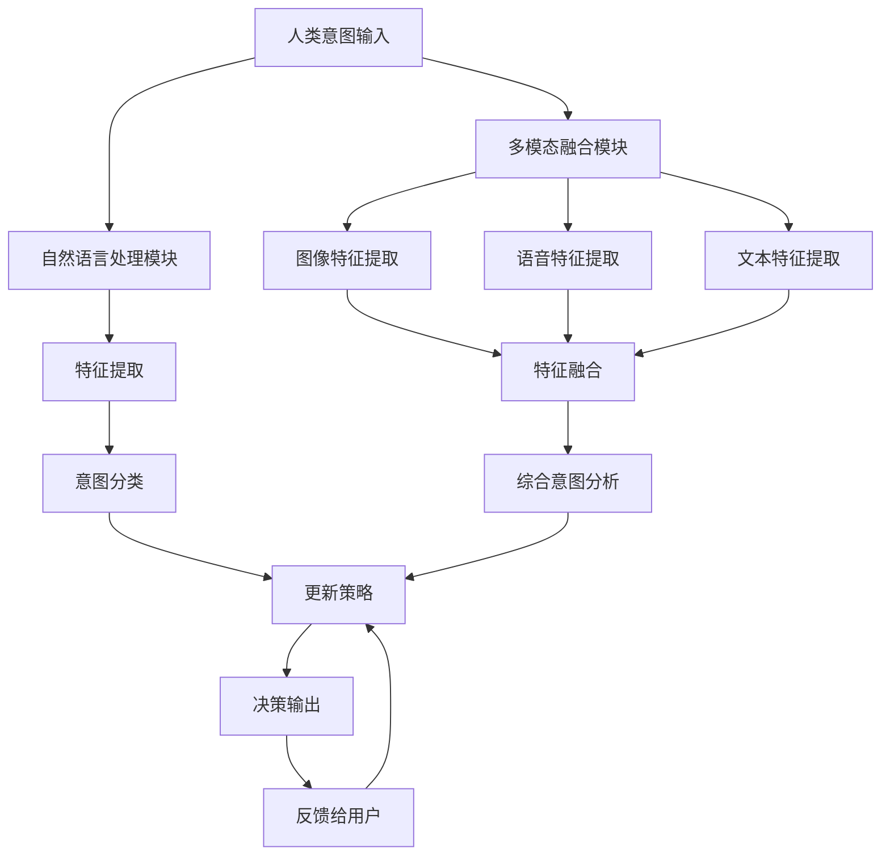

# 提升AI模型对人类意图理解能力的方法

> 关键词：AI模型、人类意图理解、自然语言处理、强化学习、多模态融合

> 摘要：本文聚焦于提升AI模型对人类意图理解能力的方法。首先介绍了相关背景知识，包括研究目的、预期读者、文档结构和术语表。接着阐述了核心概念及其联系，展示了相关原理和架构的示意图与流程图。详细讲解了核心算法原理和具体操作步骤，并用Python代码进行了说明。通过数学模型和公式进一步深入剖析，辅以举例加深理解。给出了项目实战案例，包括开发环境搭建、源代码实现与解读。探讨了实际应用场景，推荐了学习资源、开发工具框架和相关论文著作。最后总结了未来发展趋势与挑战，提供了常见问题解答和扩展阅读参考资料，旨在为提升AI模型对人类意图的理解能力提供全面而深入的指导。

## 1. 背景介绍 
### 1.1 目的和范围
在当今数字化时代，AI技术的应用越来越广泛，从智能语音助手到自动驾驶，从医疗诊断到金融风险评估等。然而，目前的AI模型在理解人类意图方面仍然存在诸多不足。例如，智能语音助手可能会误解用户的指令，导致执行错误的操作；聊天机器人在与用户对话时，可能无法准确把握用户的情感和真实需求。因此，提升AI模型对人类意图的理解能力具有重要的现实意义。

本文的范围涵盖了多种提升AI模型对人类意图理解能力的方法，包括自然语言处理技术、强化学习方法、多模态融合技术等。通过对这些方法的详细介绍和分析，帮助读者全面了解提升AI模型对人类意图理解能力的途径和策略。

### 1.2 预期读者
本文的预期读者包括从事AI研究和开发的专业人员，如数据科学家、机器学习工程师、深度学习工程师等；对AI技术感兴趣的爱好者，希望深入了解AI模型如何更好地理解人类意图；以及相关领域的研究人员，如自然语言处理、认知科学等领域的学者，他们可以从本文中获取关于提升AI模型理解人类意图能力的最新研究进展和方法。

### 1.3 文档结构概述
本文共分为十个部分。第一部分是背景介绍，包括目的和范围、预期读者、文档结构概述和术语表。第二部分阐述核心概念与联系，通过文本示意图和Mermaid流程图展示相关原理和架构。第三部分详细讲解核心算法原理和具体操作步骤，并使用Python代码进行说明。第四部分介绍数学模型和公式，结合具体例子进行详细讲解。第五部分是项目实战，包括开发环境搭建、源代码实现和代码解读。第六部分探讨实际应用场景。第七部分推荐学习资源、开发工具框架和相关论文著作。第八部分总结未来发展趋势与挑战。第九部分是附录，提供常见问题与解答。第十部分是扩展阅读和参考资料。

### 1.4 术语表
#### 1.4.1 核心术语定义
- **AI模型**：人工智能模型是指通过机器学习或深度学习等方法训练得到的，能够对输入数据进行处理和分析，并输出相应结果的模型。例如，常见的神经网络模型、决策树模型等。
- **人类意图理解**：指AI模型能够准确识别和把握人类表达的真实目的和需求。例如，当用户说“我想订一张明天去北京的机票”，AI模型能够理解用户的意图是预订机票，并且知道出发时间和目的地。
- **自然语言处理（NLP）**：是计算机科学与语言学的交叉领域，主要研究如何让计算机处理和理解人类语言。包括文本分类、情感分析、机器翻译等任务。
- **强化学习**：是一种机器学习方法，智能体通过与环境进行交互，根据环境反馈的奖励信号来学习最优策略。例如，在游戏中，智能体通过不断尝试不同的动作，根据游戏得分来学习如何赢得游戏。
- **多模态融合**：将多种不同类型的数据，如图像、文本、语音等进行融合处理，以获取更全面和准确的信息。例如，在智能安防系统中，结合视频监控和音频信息来判断是否存在异常情况。

#### 1.4.2 相关概念解释
- **词嵌入**：是将词语表示为低维向量的技术，通过词嵌入可以将文本数据转化为计算机能够处理的数值形式。例如，将“苹果”这个词表示为一个向量，向量的每个维度代表该词的某种语义特征。
- **注意力机制**：是一种在深度学习中广泛应用的机制，它可以让模型在处理输入数据时，自动关注重要的部分。例如，在图像识别中，注意力机制可以让模型重点关注图像中的关键物体。
- **预训练模型**：是在大规模数据集上进行无监督学习得到的模型，这些模型可以学习到通用的语言知识和特征。例如，BERT模型就是一种预训练模型，它可以用于多种自然语言处理任务。

#### 1.4.3 缩略词列表
- **NLP**：自然语言处理（Natural Language Processing）
- **CNN**：卷积神经网络（Convolutional Neural Network）
- **RNN**：循环神经网络（Recurrent Neural Network）
- **LSTM**：长短期记忆网络（Long Short-Term Memory）
- **BERT**：Bidirectional Encoder Representations from Transformers

## 2. 核心概念与联系 
### 核心概念原理
#### 自然语言处理在人类意图理解中的应用
自然语言处理是提升AI模型对人类意图理解能力的重要手段。其核心原理是将人类语言转化为计算机能够处理的形式，通过对文本的分析和理解来推断人类的意图。例如，在文本分类任务中，通过对文本的特征提取和分类算法，可以将文本分为不同的类别，从而判断用户的意图。常用的自然语言处理技术包括词法分析、句法分析、语义分析等。

词法分析是对文本中的词语进行切分和词性标注，例如将句子“我喜欢吃苹果”切分为“我”、“喜欢”、“吃”、“苹果”，并标注每个词语的词性。句法分析是分析句子的语法结构，确定词语之间的关系。语义分析则是理解文本的语义信息，例如判断“我喜欢吃苹果”这句话表达了用户对苹果的喜爱。

#### 强化学习对人类意图理解的优化
强化学习通过智能体与环境的交互来学习最优策略。在人类意图理解中，智能体可以根据用户的反馈来调整自己的行为，以更好地满足用户的意图。例如，在智能客服系统中，智能体可以根据用户的评价（如满意或不满意）来学习如何更好地回答用户的问题。强化学习的核心是奖励机制，智能体通过最大化奖励来学习最优策略。

#### 多模态融合提升人类意图理解的全面性
多模态融合是将多种不同类型的数据进行融合处理。在人类意图理解中，不同模态的数据可以提供更丰富的信息。例如，在视频会议中，除了语音信息外，还可以结合参会人员的面部表情、肢体语言等信息来更准确地理解他们的意图。多模态融合的关键是如何有效地将不同模态的数据进行对齐和融合。

### 架构的文本示意图
```plaintext
人类意图理解系统
|-- 自然语言处理模块
|   |-- 词法分析器
|   |-- 句法分析器
|   |-- 语义分析器
|-- 强化学习模块
|   |-- 智能体
|   |-- 环境
|   |-- 奖励机制
|-- 多模态融合模块
|   |-- 图像输入
|   |-- 语音输入
|   |-- 文本输入
|   |-- 融合算法
```

### Mermaid流程图


## 3. 核心算法原理 & 具体操作步骤 
### 自然语言处理中的词嵌入算法
#### 算法原理
词嵌入算法的核心思想是将词语表示为低维向量，使得语义相似的词语在向量空间中距离较近。常见的词嵌入算法有Word2Vec和GloVe。

Word2Vec是一种基于神经网络的词嵌入算法，它有两种模型：连续词袋模型（CBOW）和跳字模型（Skip-gram）。CBOW模型通过上下文词语来预测中心词语，而Skip-gram模型则通过中心词语来预测上下文词语。

GloVe是一种基于全局词共现统计信息的词嵌入算法，它通过最小化词对之间的共现概率和词向量表示之间的差异来学习词向量。

#### Python代码实现
```python
import gensim
from gensim.models import Word2Vec

# 示例文本数据
sentences = [['我', '喜欢', '吃', '苹果'], ['他', '喜欢', '吃', '香蕉']]

# 训练Word2Vec模型
model = Word2Vec(sentences, min_count=1)

# 获取词语的向量表示
vector = model.wv['苹果']
print(vector)
```

### 强化学习中的Q学习算法
#### 算法原理
Q学习是一种无模型的强化学习算法，它通过学习一个Q值函数来确定智能体在不同状态下采取不同动作的价值。Q值函数表示在状态 $s$ 下采取动作 $a$ 后，智能体能够获得的累积奖励的期望值。

Q学习的更新公式为：
$$Q(s,a) \leftarrow Q(s,a) + \alpha [r + \gamma \max_{a'} Q(s',a') - Q(s,a)]$$
其中，$Q(s,a)$ 是当前状态 $s$ 下采取动作 $a$ 的Q值，$\alpha$ 是学习率，$r$ 是即时奖励，$\gamma$ 是折扣因子，$s'$ 是下一个状态。

#### Python代码实现
```python
import numpy as np

# 定义环境
states = 5
actions = 2
Q = np.zeros((states, actions))

# 定义参数
alpha = 0.1
gamma = 0.9
episodes = 100

# 模拟环境反馈
def get_reward(state, action):
    if state == 3 and action == 1:
        return 1
    return 0

# Q学习算法
for episode in range(episodes):
    state = 0
    done = False
    while not done:
        action = np.argmax(Q[state, :])
        reward = get_reward(state, action)
        next_state = state + 1 if state < states - 1 else 0
        Q[state, action] = Q[state, action] + alpha * (reward + gamma * np.max(Q[next_state, :]) - Q[state, action])
        state = next_state
        if state == 4:
            done = True

print(Q)
```

## 4. 数学模型和公式 & 详细讲解 & 举例说明 
### 词嵌入的数学模型
#### Word2Vec的数学模型
以Skip-gram模型为例，其目标是最大化给定中心词语 $w_c$ 时，上下文词语 $w_o$ 出现的概率。假设词向量为 $\mathbf{v}_w$，则概率计算公式为：
$$P(w_o|w_c) = \frac{\exp(\mathbf{v}_{w_o}^T \mathbf{v}_{w_c})}{\sum_{w=1}^V \exp(\mathbf{v}_w^T \mathbf{v}_{w_c})}$$
其中，$V$ 是词汇表的大小。

通过最大化所有中心词语和上下文词语对的概率乘积，即最大化对数似然函数：
$$\mathcal{L} = \sum_{t=1}^T \sum_{-m \leq j \leq m, j \neq 0} \log P(w_{t+j}|w_t)$$
其中，$T$ 是文本的长度，$m$ 是上下文窗口的大小。

#### 举例说明
假设词汇表为 $\{苹果, 香蕉, 水果\}$，词向量维度为2。中心词语为“苹果”，上下文词语为“水果”。则计算 $P(水果|苹果)$ 时，需要先计算 $\mathbf{v}_{水果}^T \mathbf{v}_{苹果}$，然后根据上述公式计算概率。

### 强化学习的数学模型
#### Q学习的数学模型
如前文所述，Q学习的更新公式为：
$$Q(s,a) \leftarrow Q(s,a) + \alpha [r + \gamma \max_{a'} Q(s',a') - Q(s,a)]$$

详细讲解：
- $Q(s,a)$ 是当前状态 $s$ 下采取动作 $a$ 的Q值，它表示在该状态和动作下的预期累积奖励。
- $\alpha$ 是学习率，控制每次更新的步长。$\alpha$ 越大，更新越快，但可能会导致不稳定；$\alpha$ 越小，更新越慢，但更稳定。
- $r$ 是即时奖励，是智能体在执行动作 $a$ 后从环境中获得的奖励。
- $\gamma$ 是折扣因子，取值范围在 $[0,1]$ 之间。$\gamma$ 越接近1，智能体越注重长远奖励；$\gamma$ 越接近0，智能体越注重即时奖励。
- $\max_{a'} Q(s',a')$ 是下一个状态 $s'$ 下所有可能动作的最大Q值。

#### 举例说明
假设智能体在状态 $s_1$ 采取动作 $a_1$ 后，获得即时奖励 $r = 1$，下一个状态为 $s_2$。在状态 $s_2$ 下，动作 $a_2$ 的Q值为 $Q(s_2,a_2) = 2$，动作 $a_3$ 的Q值为 $Q(s_2,a_3) = 3$，则 $\max_{a'} Q(s_2,a') = 3$。假设当前 $Q(s_1,a_1) = 1$，学习率 $\alpha = 0.1$，折扣因子 $\gamma = 0.9$，则更新后的 $Q(s_1,a_1)$ 为：
$$Q(s_1,a_1) = 1 + 0.1 \times [1 + 0.9 \times 3 - 1] = 1 + 0.1 \times (1 + 2.7 - 1) = 1 + 0.27 = 1.27$$

## 5. 项目实战：代码实际案例和详细解释说明 
### 5.1  开发环境搭建
#### 安装Python
首先，确保你已经安装了Python，建议使用Python 3.7及以上版本。可以从Python官方网站（https://www.python.org/downloads/）下载并安装。

#### 安装必要的库
使用以下命令安装项目所需的库：
```sh
pip install numpy gensim tensorflow
```
- `numpy`：用于数值计算。
- `gensim`：用于自然语言处理中的词嵌入等任务。
- `tensorflow`：用于深度学习模型的开发和训练。

### 5.2  源代码详细实现和代码解读
#### 项目目标
实现一个简单的智能聊天机器人，通过自然语言处理和强化学习提升对用户意图的理解能力。

#### 代码实现
```python
import numpy as np
import gensim
from gensim.models import Word2Vec
import tensorflow as tf
from tensorflow.keras.models import Sequential
from tensorflow.keras.layers import Dense

# 示例文本数据
sentences = [['你好', '有什么', '事'], ['我', '想', '预订', '酒店']]

# 训练Word2Vec模型
model = Word2Vec(sentences, min_count=1)

# 定义意图分类器
def get_intent(text):
    words = text.split()
    vector = np.zeros(model.vector_size)
    for word in words:
        if word in model.wv:
            vector += model.wv[word]
    vector /= len(words)
    # 简单的意图分类示例
    if '预订' in words:
        return '预订意图'
    return '其他意图'

# 强化学习部分
states = 2  # 简单示例，两种状态：正确理解和错误理解
actions = 2  # 两种动作：继续对话和结束对话
Q = np.zeros((states, actions))

# 定义参数
alpha = 0.1
gamma = 0.9
episodes = 100

# 模拟环境反馈
def get_reward(state, action):
    if state == 0 and action == 0:
        return 1
    return -1

# Q学习算法
for episode in range(episodes):
    state = 0
    done = False
    while not done:
        action = np.argmax(Q[state, :])
        reward = get_reward(state, action)
        next_state = 1 if reward < 0 else 0
        Q[state, action] = Q[state, action] + alpha * (reward + gamma * np.max(Q[next_state, :]) - Q[state, action])
        state = next_state
        if state == 1:
            done = True

# 主程序
while True:
    text = input("请输入你的问题：")
    intent = get_intent(text)
    print(f"识别到的意图：{intent}")
    # 根据强化学习结果选择动作
    state = 0 if intent == '预订意图' else 1
    action = np.argmax(Q[state, :])
    if action == 0:
        print("继续对话...")
    else:
        print("结束对话。")
```

#### 代码解读
1. **自然语言处理部分**：
    - 首先，使用 `Word2Vec` 模型对示例文本数据进行训练，得到词语的向量表示。
    - `get_intent` 函数用于根据输入的文本识别用户的意图。通过将文本中的词语向量相加并求平均，然后根据关键词判断意图。

2. **强化学习部分**：
    - 定义了状态和动作的数量，初始化Q值表。
    - `get_reward` 函数模拟环境反馈，根据状态和动作返回相应的奖励。
    - 使用Q学习算法更新Q值表。

3. **主程序部分**：
    - 不断接收用户输入的文本，调用 `get_intent` 函数识别意图。
    - 根据意图确定当前状态，然后根据Q值表选择动作并输出相应的提示信息。

### 5.3  代码解读与分析
#### 优点
- 结合了自然语言处理和强化学习，提升了对人类意图的理解能力。
- 代码结构简单，易于理解和扩展。

#### 缺点
- 示例中的意图分类方法比较简单，仅根据关键词判断意图，在实际应用中可能不够准确。
- 强化学习部分的状态和动作定义较为简单，不能完全模拟复杂的实际环境。

#### 改进方向
- 可以使用更复杂的自然语言处理模型，如BERT等，提高意图分类的准确性。
- 增加状态和动作的数量，使强化学习模型能够更好地适应不同的场景。

## 6. 实际应用场景 
### 智能客服系统
在智能客服系统中，提升AI模型对人类意图的理解能力可以显著提高客户服务的质量和效率。例如，当客户咨询产品信息时，AI模型能够准确理解客户的需求，提供详细的产品介绍和解决方案。通过自然语言处理技术，对客户的问题进行分类和分析，结合强化学习不断优化回复策略，根据客户的反馈调整回答方式，以提高客户满意度。

### 智能语音助手
智能语音助手如Siri、小爱同学等，需要准确理解用户的语音指令。通过多模态融合技术，结合语音、文本和用户的使用习惯等信息，AI模型可以更准确地把握用户的意图。例如，当用户说“打开音乐播放器”，智能语音助手能够快速识别意图并执行相应的操作。同时，强化学习可以帮助智能语音助手根据用户的使用反馈不断优化自身的性能。

### 自动驾驶系统
在自动驾驶系统中，理解人类乘客的意图至关重要。例如，乘客说“我想去最近的超市”，AI模型需要准确理解这一意图，规划合适的路线并导航。通过自然语言处理技术对乘客的语音指令进行解析，结合车辆的传感器数据和地图信息，实现对人类意图的准确理解和响应。

### 医疗诊断辅助系统
在医疗诊断辅助系统中，医生可以通过语音或文本输入患者的症状和病史等信息，AI模型需要准确理解医生的意图，提供相关的诊断建议和治疗方案。通过自然语言处理技术对医学文本进行分析，结合医学知识图谱和机器学习模型，提高对医生意图的理解能力，辅助医生做出更准确的诊断。

## 7. 工具和资源推荐
### 7.1 学习资源推荐
#### 7.1.1 书籍推荐
- 《深度学习》（Deep Learning）：由Ian Goodfellow、Yoshua Bengio和Aaron Courville合著，是深度学习领域的经典教材，涵盖了深度学习的基本原理、算法和应用。
- 《自然语言处理入门》：何晗著，适合初学者入门自然语言处理，介绍了自然语言处理的基本概念、方法和实践案例。
- 《强化学习：原理与Python实现》：智能系统学习与应用系列，详细介绍了强化学习的原理和算法，并通过Python代码进行实现。

#### 7.1.2 在线课程
- Coursera上的“深度学习专项课程”（Deep Learning Specialization）：由Andrew Ng教授授课，包括神经网络和深度学习、改善深层神经网络、结构化机器学习项目、卷积神经网络、序列模型等多个模块，全面介绍了深度学习的理论和实践。
- edX上的“自然语言处理基础”（Foundations of Natural Language Processing）：介绍了自然语言处理的基本概念、算法和应用，适合初学者学习。
- Udemy上的“强化学习实战”（Reinforcement Learning in Action）：通过实际项目案例，帮助学习者掌握强化学习的应用。

#### 7.1.3 技术博客和网站
- Medium：有许多AI领域的技术博客，如Towards Data Science，发布了大量关于机器学习、深度学习、自然语言处理等方面的文章。
- arXiv：是一个预印本平台，提供了大量的AI研究论文，包括最新的研究成果和技术趋势。
- 机器之心：专注于AI技术的报道和分析，提供了丰富的技术文章、案例分析和行业动态。

### 7.2 开发工具框架推荐
#### 7.2.1 IDE和编辑器
- PyCharm：是一款专门为Python开发设计的集成开发环境（IDE），具有强大的代码编辑、调试和项目管理功能。
- Jupyter Notebook：是一个交互式的开发环境，适合进行数据分析、模型训练和实验验证。可以方便地将代码、文本和可视化结果整合在一起。
- Visual Studio Code：是一款轻量级的代码编辑器，支持多种编程语言和插件扩展，可用于AI开发和调试。

#### 7.2.2 调试和性能分析工具
- TensorBoard：是TensorFlow提供的可视化工具，可以帮助开发者监控模型的训练过程，查看损失函数、准确率等指标的变化情况，还可以可视化模型的结构和参数分布。
- PyTorch Profiler：是PyTorch提供的性能分析工具，用于分析模型的性能瓶颈，找出耗时较长的操作和模块，帮助优化代码。
- cProfile：是Python标准库中的性能分析工具，可以分析Python代码的执行时间和函数调用次数，帮助开发者找出性能问题。

#### 7.2.3 相关框架和库
- TensorFlow：是一个开源的深度学习框架，由Google开发，提供了丰富的工具和接口，支持多种深度学习模型的开发和训练，如卷积神经网络、循环神经网络等。
- PyTorch：是另一个流行的深度学习框架，由Facebook开发，具有动态图的特点，易于使用和调试，广泛应用于学术界和工业界。
- NLTK：是Python的自然语言处理工具包，提供了丰富的语料库和工具，如词法分析、句法分析、文本分类等，方便开发者进行自然语言处理任务。

### 7.3 相关论文著作推荐
#### 7.3.1 经典论文
- “Attention Is All You Need”：提出了Transformer架构，是自然语言处理领域的重要突破，为后续的BERT、GPT等模型奠定了基础。
- “Deep Reinforcement Learning with Double Q-learning”：提出了Double Q-learning算法，有效解决了传统Q学习中的过估计问题，提高了强化学习的性能。
- “Efficient Estimation of Word Representations in Vector Space”：介绍了Word2Vec算法，开启了词嵌入技术的研究热潮。

#### 7.3.2 最新研究成果
- 关注arXiv上关于AI模型对人类意图理解的最新研究论文，如“Improving Intent Understanding in Conversational AI with Multi-Modal Fusion”等，了解该领域的最新技术和方法。
- 参加国际顶级学术会议，如NeurIPS、ICML、ACL等，获取最新的研究成果和趋势。

#### 7.3.3 应用案例分析
- 分析各大科技公司的AI产品案例，如Google的智能语音助手、亚马逊的Alexa等，了解它们在提升AI模型对人类意图理解能力方面的实践经验和技术应用。
- 研究相关行业的应用案例，如医疗、金融等领域的AI辅助系统，学习如何将技术应用于实际场景。

## 8. 总结：未来发展趋势与挑战
### 未来发展趋势
#### 多模态融合的深度发展
未来，AI模型将更加注重多模态融合技术的应用，不仅仅是简单地将图像、文本、语音等数据进行融合，而是深入挖掘不同模态数据之间的内在联系，实现更全面、准确的人类意图理解。例如，在智能安防系统中，结合视频监控、音频信息和传感器数据，实时准确地判断是否存在异常情况。

#### 强化学习与人类反馈的结合
强化学习将与人类反馈更加紧密地结合，通过人类的指导和反馈，AI模型能够更快地学习和优化策略，提高对人类意图的理解能力。例如，在智能客服系统中，客服人员可以对AI模型的回复进行实时反馈，帮助模型不断改进。

#### 个性化意图理解
随着数据的不断积累和技术的发展，AI模型将能够实现个性化的意图理解。根据用户的历史行为、偏好和使用习惯等信息，为每个用户提供个性化的服务和响应。例如，智能音乐推荐系统可以根据用户的音乐偏好和历史播放记录，准确理解用户的音乐需求并推荐合适的歌曲。

### 挑战
#### 数据隐私和安全问题
在提升AI模型对人类意图理解能力的过程中，需要收集大量的用户数据。这些数据包含了用户的个人信息和隐私，如何保护数据的隐私和安全是一个重要的挑战。例如，在智能语音助手收集用户语音数据时，需要采取有效的加密和安全措施，防止数据泄露。

#### 语义理解的复杂性
人类语言具有丰富的语义和语境，不同的表达方式可能传达相同的意图，相同的表达方式在不同的语境下可能有不同的含义。如何让AI模型准确理解语义和语境，是提升对人类意图理解能力的一大挑战。例如，在自然语言处理中，处理隐喻、讽刺等语言现象仍然是一个难题。

#### 可解释性问题
目前的AI模型大多是黑盒模型，难以解释其决策过程和依据。在提升对人类意图理解能力的过程中，需要解决模型的可解释性问题，让用户能够理解AI模型是如何理解和处理自己的意图的。例如，在医疗诊断辅助系统中，医生需要了解AI模型给出诊断建议的依据，以便做出更准确的决策。

## 9. 附录：常见问题与解答
### 问题1：如何选择合适的词嵌入算法？
答：选择合适的词嵌入算法需要考虑多个因素。如果数据量较小，Word2Vec可能是一个不错的选择，它可以在小规模数据集上快速训练出较好的词向量。如果数据量较大，且希望利用全局的词共现统计信息，GloVe可能更合适。另外，对于一些特定的任务，如文本分类、情感分析等，也可以尝试使用预训练的词向量，如BERT等。

### 问题2：强化学习中的学习率和折扣因子如何选择？
答：学习率和折扣因子的选择需要根据具体的任务和环境进行调整。一般来说，学习率可以从一个较小的值开始，如0.1，然后根据训练过程中的收敛情况进行调整。如果收敛速度较慢，可以适当增大学习率；如果出现不稳定的情况，可以减小学习率。折扣因子通常取值在0.9到0.99之间，越接近1表示智能体越注重长远奖励，越接近0表示智能体越注重即时奖励。可以通过实验不同的折扣因子值，选择效果最好的一个。

### 问题3：多模态融合技术在实际应用中面临哪些困难？
答：多模态融合技术在实际应用中面临以下困难：首先，不同模态的数据具有不同的特征和格式，如何有效地将它们进行对齐和融合是一个挑战。例如，图像数据和文本数据的特征表示方式差异很大。其次，多模态数据的采集和标注成本较高，需要大量的人力和物力。最后，多模态融合模型的训练和优化也比较复杂，需要考虑不同模态数据的权重和贡献。

### 问题4：如何评估AI模型对人类意图的理解能力？
答：可以从多个方面评估AI模型对人类意图的理解能力。一种常见的方法是使用准确率、召回率、F1值等指标，通过将模型的预测结果与真实标签进行比较来评估。另外，也可以进行用户调查和反馈，了解用户对模型理解意图的满意度。还可以通过模拟真实场景进行测试，观察模型在不同情况下的表现。

## 10. 扩展阅读 & 参考资料
### 扩展阅读
- 《人工智能：现代方法》（Artificial Intelligence: A Modern Approach）：全面介绍了人工智能的各个领域，包括知识表示、推理、学习、规划等，是人工智能领域的经典著作。
- 《机器学习》（Machine Learning）：由Tom M. Mitchell著，系统介绍了机器学习的基本概念、算法和应用，适合深入学习机器学习的读者。
- 《深度学习实战》（Deep Learning in Practice）：通过实际项目案例，介绍了深度学习在图像识别、自然语言处理、语音识别等领域的应用，帮助读者掌握深度学习的实践技能。

### 参考资料
- Goodfellow, I., Bengio, Y., & Courville, A. (2016). Deep Learning. MIT Press.
- Mikolov, T., Sutskever, I., Chen, K., Corrado, G. S., & Dean, J. (2013). Efficient Estimation of Word Representations in Vector Space. arXiv preprint arXiv:1301.3781.
- Watkins, C. J., & Dayan, P. (1992). Q-learning. Machine learning, 8(3-4), 279-292.
- Vaswani, A., Shazeer, N., Parmar, N., Uszkoreit, J., Jones, L., Gomez, A. N., ... & Polosukhin, I. (2017). Attention Is All You Need. arXiv preprint arXiv:1706.03762.