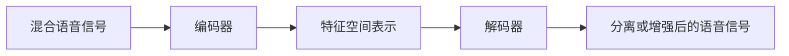

# 提高AI模型在复杂声学环境下的语音分离与增强效果

> 关键词：AI模型、复杂声学环境、语音分离、语音增强、深度学习

> 摘要：本文聚焦于提高AI模型在复杂声学环境下的语音分离与增强效果。首先介绍了研究的背景、目的、预期读者等信息，接着阐述了语音分离与增强的核心概念及联系，包括原理和架构。详细讲解了相关核心算法原理，并给出Python代码示例。对数学模型和公式进行了深入分析与举例说明。通过项目实战展示了代码实现和解读。探讨了实际应用场景，推荐了学习、开发工具和相关论文著作。最后总结了未来发展趋势与挑战，并给出常见问题解答和扩展阅读参考资料。旨在为相关领域的研究者和开发者提供全面而深入的技术指导。

## 1. 背景介绍 
### 1.1 目的和范围
在现实生活中，语音信号往往会受到复杂声学环境的干扰，如背景噪音、混响等。这些干扰会严重影响语音的清晰度和可懂度，给语音通信、语音识别等应用带来极大的挑战。本研究的目的在于提高AI模型在复杂声学环境下的语音分离与增强效果，从而提升语音相关应用的性能。研究范围涵盖了从核心概念的理解、算法原理的研究、数学模型的构建，到实际项目的开发和应用场景的探讨。

### 1.2 预期读者
本文预期读者包括从事语音处理、人工智能、信号处理等领域的研究者、开发者，以及对语音分离与增强技术感兴趣的学生和爱好者。对于那些希望深入了解复杂声学环境下语音处理技术的专业人士，本文将提供全面而深入的技术指导；对于初学者，本文将帮助他们建立起对该领域的基本认识和理解。

### 1.3 文档结构概述
本文首先介绍了研究的背景信息，包括目的、预期读者和文档结构。接着阐述了语音分离与增强的核心概念及联系，包括原理和架构，并给出了相应的示意图和流程图。然后详细讲解了核心算法原理，并用Python代码进行了详细阐述。之后对数学模型和公式进行了深入分析和举例说明。通过项目实战展示了代码的实际实现和解读。探讨了实际应用场景，推荐了学习、开发工具和相关论文著作。最后总结了未来发展趋势与挑战，并给出常见问题解答和扩展阅读参考资料。

### 1.4 术语表
#### 1.4.1 核心术语定义
- **语音分离**：将混合语音信号中的不同语音源分离出来的过程。
- **语音增强**：在存在噪声、混响等干扰的情况下，提高语音信号质量和可懂度的技术。
- **复杂声学环境**：包含多种噪声源、混响等复杂因素的声学环境，如嘈杂的街道、会议室等。
- **AI模型**：基于人工智能技术构建的模型，如深度学习模型，用于解决语音分离与增强问题。

#### 1.4.2 相关概念解释
- **声学特征**：描述语音信号声学特性的参数，如频谱、倒谱等。
- **深度学习**：一种基于人工神经网络的机器学习方法，在语音处理领域取得了显著的成果。
- **损失函数**：用于衡量模型预测结果与真实标签之间差异的函数，在训练模型时用于优化模型参数。

#### 1.4.3 缩略词列表
- **DNN**：Deep Neural Network，深度神经网络
- **CNN**：Convolutional Neural Network，卷积神经网络
- **RNN**：Recurrent Neural Network，循环神经网络
- **LSTM**：Long Short-Term Memory，长短期记忆网络
- **GRU**：Gated Recurrent Unit，门控循环单元

## 2. 核心概念与联系 

### 2.1 语音分离与增强的原理
语音分离的基本原理是利用语音信号的特征和统计特性，将混合语音信号分解为不同的语音源。常见的方法包括独立成分分析（ICA）、非负矩阵分解（NMF）等传统方法，以及基于深度学习的方法。语音增强则是通过对带噪语音信号进行处理，抑制噪声成分，增强语音成分。常见的方法包括谱减法、维纳滤波等传统方法，以及基于深度学习的端到端方法。

### 2.2 核心架构
在基于深度学习的语音分离与增强系统中，通常采用编码器 - 解码器架构。编码器将输入的混合语音信号映射到一个特征空间，解码器则将特征空间中的表示重构为分离或增强后的语音信号。常见的编码器和解码器包括卷积神经网络（CNN）、循环神经网络（RNN）及其变体（如LSTM、GRU）等。

### 2.3 文本示意图
```plaintext
输入：混合语音信号
|
V
编码器（CNN/RNN等）
|
V
特征空间表示
|
V
解码器（CNN/RNN等）
|
V
输出：分离或增强后的语音信号
```

### 2.4 Mermaid流程图


## 3. 核心算法原理 & 具体操作步骤 

### 3.1 基于深度学习的语音分离与增强算法原理
基于深度学习的语音分离与增强算法通常采用端到端的训练方式，即直接从混合语音信号到分离或增强后的语音信号进行建模。常见的模型包括深度神经网络（DNN）、卷积神经网络（CNN）、循环神经网络（RNN）及其变体等。

以基于卷积神经网络（CNN）的语音增强为例，其原理是通过卷积层提取语音信号的局部特征，池化层进行特征降维，全连接层进行特征融合和分类。具体步骤如下：
1. **数据预处理**：将混合语音信号进行分帧、加窗等处理，转换为频谱图或梅尔频谱图等特征表示。
2. **模型构建**：构建CNN模型，包括卷积层、池化层、全连接层等。
3. **模型训练**：使用标注好的训练数据对模型进行训练，通过损失函数衡量模型预测结果与真实标签之间的差异，使用优化算法更新模型参数。
4. **模型推理**：将待处理的混合语音信号输入到训练好的模型中，得到分离或增强后的语音信号。

### 3.2 Python代码实现
```python
import numpy as np
import tensorflow as tf
from tensorflow.keras import layers

# 数据预处理
def preprocess_audio(audio, frame_length=256, hop_length=128):
    """
    将音频信号转换为频谱图
    :param audio: 音频信号
    :param frame_length: 帧长
    :param hop_length: 帧移
    :return: 频谱图
    """
    spectrogram = tf.signal.stft(audio, frame_length=frame_length, frame_step=hop_length)
    magnitude_spectrogram = tf.abs(spectrogram)
    return magnitude_spectrogram

# 构建CNN模型
def build_cnn_model(input_shape):
    """
    构建CNN模型
    :param input_shape: 输入形状
    :return: CNN模型
    """
    model = tf.keras.Sequential([
        layers.Conv2D(32, (3, 3), activation='relu', input_shape=input_shape),
        layers.MaxPooling2D((2, 2)),
        layers.Conv2D(64, (3, 3), activation='relu'),
        layers.MaxPooling2D((2, 2)),
        layers.Flatten(),
        layers.Dense(64, activation='relu'),
        layers.Dense(input_shape[-1], activation='linear')
    ])
    model.compile(optimizer='adam', loss='mse')
    return model

# 训练模型
def train_model(model, X_train, y_train, epochs=10, batch_size=32):
    """
    训练模型
    :param model: 模型
    :param X_train: 训练数据
    :param y_train: 训练标签
    :param epochs: 训练轮数
    :param batch_size: 批次大小
    :return: 训练历史
    """
    history = model.fit(X_train, y_train, epochs=epochs, batch_size=batch_size)
    return history

# 模型推理
def predict(model, X_test):
    """
    模型推理
    :param model: 模型
    :param X_test: 测试数据
    :return: 预测结果
    """
    y_pred = model.predict(X_test)
    return y_pred

# 示例数据
audio = np.random.randn(16000)  # 示例音频信号
spectrogram = preprocess_audio(audio)
X_train = spectrogram[np.newaxis, ..., np.newaxis]
y_train = X_train  # 简单示例，假设输入和输出相同

# 构建模型
input_shape = X_train.shape[1:]
model = build_cnn_model(input_shape)

# 训练模型
history = train_model(model, X_train, y_train)

# 模型推理
y_pred = predict(model, X_train)
```

## 4. 数学模型和公式 & 详细讲解 & 举例说明 

### 4.1 语音信号的数学表示
语音信号 $s(t)$ 可以看作是一个时间序列，通常在时域上进行表示。为了更好地分析和处理语音信号，常常将其转换到频域，常用的方法是短时傅里叶变换（STFT）。

短时傅里叶变换的公式为：
$$
S(m, k) = \sum_{n = 0}^{N - 1} s(n) w(n - mR) e^{-j2\pi kn/N}
$$
其中，$S(m, k)$ 是第 $m$ 帧的第 $k$ 个频率分量，$s(n)$ 是语音信号，$w(n)$ 是窗函数，$N$ 是帧长，$R$ 是帧移。

### 4.2 基于深度学习的语音分离与增强的数学模型
以基于深度神经网络（DNN）的语音增强为例，假设输入的带噪语音信号的频谱图为 $X$，目标纯净语音信号的频谱图为 $Y$。DNN 模型可以看作是一个函数 $f$，将输入 $X$ 映射到输出 $\hat{Y}$：
$$
\hat{Y} = f(X; \theta)
$$
其中，$\theta$ 是模型的参数。

为了训练模型，需要定义一个损失函数来衡量模型预测结果 $\hat{Y}$ 与真实标签 $Y$ 之间的差异。常用的损失函数包括均方误差（MSE）：
$$
L(\theta) = \frac{1}{M} \sum_{i = 1}^{M} (\hat{Y}_i - Y_i)^2
$$
其中，$M$ 是样本数量。

### 4.3 举例说明
假设我们有一个简单的语音信号 $s(t) = \sin(2\pi f_0 t)$，其中 $f_0 = 1000$ Hz，采样率 $fs = 16000$ Hz，信号长度为 $T = 1$ s。我们可以使用 Python 代码计算其短时傅里叶变换：
```python
import numpy as np
import matplotlib.pyplot as plt
from scipy.signal import stft

# 生成语音信号
fs = 16000
T = 1
t = np.linspace(0, T, fs * T)
f0 = 1000
s = np.sin(2 * np.pi * f0 * t)

# 计算短时傅里叶变换
f, t, Zxx = stft(s, fs, nperseg=256)

# 绘制频谱图
plt.pcolormesh(t, f, np.abs(Zxx), shading='gouraud')
plt.title('STFT Magnitude')
plt.xlabel('Time [sec]')
plt.ylabel('Frequency [Hz]')
plt.show()
```
在这个例子中，我们可以看到语音信号在频域上的分布情况。

## 5. 项目实战：代码实际案例和详细解释说明 

### 5.1 开发环境搭建
为了实现语音分离与增强项目，我们需要搭建以下开发环境：
1. **Python环境**：建议使用 Python 3.7 及以上版本。
2. **深度学习框架**：使用 TensorFlow 或 PyTorch 等深度学习框架。这里我们使用 TensorFlow。
3. **音频处理库**：使用 librosa 库进行音频处理。

可以使用以下命令安装所需的库：
```bash
pip install tensorflow librosa
```

### 5.2 源代码详细实现和代码解读
以下是一个基于 TensorFlow 和 librosa 的语音增强项目的完整代码：
```python
import numpy as np
import tensorflow as tf
import librosa
import librosa.display
import matplotlib.pyplot as plt

# 数据预处理
def preprocess_audio(audio_path, frame_length=256, hop_length=128):
    """
    将音频文件转换为频谱图
    :param audio_path: 音频文件路径
    :param frame_length: 帧长
    :param hop_length: 帧移
    :return: 频谱图
    """
    audio, sr = librosa.load(audio_path, sr=16000)
    spectrogram = librosa.stft(audio, n_fft=frame_length, hop_length=hop_length)
    magnitude_spectrogram = np.abs(spectrogram)
    return magnitude_spectrogram

# 构建CNN模型
def build_cnn_model(input_shape):
    """
    构建CNN模型
    :param input_shape: 输入形状
    :return: CNN模型
    """
    model = tf.keras.Sequential([
        layers.Conv2D(32, (3, 3), activation='relu', input_shape=input_shape),
        layers.MaxPooling2D((2, 2)),
        layers.Conv2D(64, (3, 3), activation='relu'),
        layers.MaxPooling2D((2, 2)),
        layers.Flatten(),
        layers.Dense(64, activation='relu'),
        layers.Dense(input_shape[-1], activation='linear')
    ])
    model.compile(optimizer='adam', loss='mse')
    return model

# 训练模型
def train_model(model, X_train, y_train, epochs=10, batch_size=32):
    """
    训练模型
    :param model: 模型
    :param X_train: 训练数据
    :param y_train: 训练标签
    :param epochs: 训练轮数
    :param batch_size: 批次大小
    :return: 训练历史
    """
    history = model.fit(X_train, y_train, epochs=epochs, batch_size=batch_size)
    return history

# 模型推理
def predict(model, X_test):
    """
    模型推理
    :param model: 模型
    :param X_test: 测试数据
    :return: 预测结果
    """
    y_pred = model.predict(X_test)
    return y_pred

# 示例数据
audio_path = 'path/to/your/audio.wav'
spectrogram = preprocess_audio(audio_path)
X_train = spectrogram[np.newaxis, ..., np.newaxis]
y_train = X_train  # 简单示例，假设输入和输出相同

# 构建模型
input_shape = X_train.shape[1:]
model = build_cnn_model(input_shape)

# 训练模型
history = train_model(model, X_train, y_train)

# 模型推理
y_pred = predict(model, X_train)

# 将频谱图转换回音频信号
y_pred = y_pred[0, ..., 0]
phase = np.angle(librosa.stft(librosa.load(audio_path, sr=16000)[0], n_fft=256, hop_length=128))
enhanced_audio = librosa.istft(y_pred * np.exp(1j * phase), hop_length=128)

# 绘制原始音频和增强后音频的波形图
plt.figure(figsize=(12, 6))
plt.subplot(2, 1, 1)
audio, sr = librosa.load(audio_path, sr=16000)
librosa.display.waveshow(audio, sr=sr)
plt.title('Original Audio')
plt.subplot(2, 1, 2)
librosa.display.waveshow(enhanced_audio, sr=sr)
plt.title('Enhanced Audio')
plt.show()
```

### 5.3 代码解读与分析
1. **数据预处理**：`preprocess_audio` 函数将音频文件转换为频谱图，使用 `librosa.stft` 函数进行短时傅里叶变换。
2. **模型构建**：`build_cnn_model` 函数构建了一个简单的 CNN 模型，包括卷积层、池化层和全连接层。
3. **模型训练**：`train_model` 函数使用训练数据对模型进行训练，使用均方误差（MSE）作为损失函数，Adam 优化器进行参数更新。
4. **模型推理**：`predict` 函数将测试数据输入到训练好的模型中，得到预测结果。
5. **音频重建**：将预测的频谱图转换回音频信号，使用 `librosa.istft` 函数进行逆短时傅里叶变换。
6. **可视化**：使用 `librosa.display.waveshow` 函数绘制原始音频和增强后音频的波形图，直观展示语音增强的效果。

## 6. 实际应用场景 
### 6.1 语音通信
在语音通信中，复杂声学环境会导致语音信号受到干扰，影响通信质量。通过语音分离与增强技术，可以提高语音的清晰度和可懂度，提升通信效果。例如，在车载通信、会议通话等场景中，应用语音分离与增强技术可以有效抑制背景噪音，使通话更加清晰。

### 6.2 语音识别
语音识别系统在复杂声学环境下的性能会受到严重影响。语音分离与增强技术可以预处理语音信号，去除噪声和干扰，提高语音识别的准确率。例如，在智能语音助手、语音导航等应用中，使用语音分离与增强技术可以提高语音识别的可靠性。

### 6.3 音频监控
在音频监控系统中，复杂声学环境会使监控音频信号包含大量噪声和干扰。通过语音分离与增强技术，可以提取出有用的语音信息，提高音频监控的效果。例如，在公共场所的音频监控中，应用语音分离与增强技术可以清晰地捕捉到关键语音信息。

## 7. 工具和资源推荐
### 7.1 学习资源推荐
#### 7.1.1 书籍推荐
- 《语音信号处理》：全面介绍了语音信号处理的基本理论和方法。
- 《深度学习》：深入讲解了深度学习的原理和应用，包括在语音处理领域的应用。
- 《Python语音处理实战》：结合 Python 语言，介绍了语音处理的实际应用案例。

#### 7.1.2 在线课程
- Coursera 上的“语音信号处理”课程：由知名高校教授授课，系统介绍语音信号处理的知识。
- edX 上的“深度学习与人工智能”课程：涵盖了深度学习在语音处理等领域的应用。
- 网易云课堂上的“Python语音处理入门”课程：适合初学者快速入门语音处理。

#### 7.1.3 技术博客和网站
- 知乎：有很多关于语音处理的技术文章和讨论。
- GitHub：可以找到很多开源的语音处理项目和代码。
- 语音技术社区：专注于语音处理领域的技术交流和分享。

### 7.2 开发工具框架推荐
#### 7.2.1 IDE和编辑器
- PyCharm：功能强大的 Python 集成开发环境，适合开发语音处理项目。
- Jupyter Notebook：交互式的开发环境，方便进行代码调试和数据分析。
- Visual Studio Code：轻量级的代码编辑器，支持多种编程语言和插件。

#### 7.2.2 调试和性能分析工具
- TensorBoard：TensorFlow 提供的可视化工具，用于监控模型训练过程和分析模型性能。
- PyTorch Profiler：PyTorch 提供的性能分析工具，用于分析模型的运行时间和内存使用情况。
- cProfile：Python 内置的性能分析工具，用于分析 Python 代码的性能。

#### 7.2.3 相关框架和库
- TensorFlow：开源的深度学习框架，提供了丰富的工具和函数，用于构建和训练语音处理模型。
- PyTorch：另一个流行的深度学习框架，具有动态图和易于使用的特点。
- librosa：Python 中的音频处理库，提供了丰富的音频处理功能，如音频读取、特征提取等。

### 7.3 相关论文著作推荐
#### 7.3.1 经典论文
- "Deep Clustering: Discriminative Embeddings for Segregating Speakers in Speech Mixtures"：提出了基于深度聚类的语音分离方法。
- "Wave-U-Net: A Multi-Scale Neural Network for End-to-End Audio Source Separation"：介绍了 Wave-U-Net 模型，用于端到端的音频源分离。
- "A New Approach to Linear Filtering and Prediction Problems"：提出了维纳滤波的理论，是语音增强领域的经典论文。

#### 7.3.2 最新研究成果
- 每年的国际语音通信协会年会（INTERSPEECH）和电气与电子工程师协会国际声学、语音和信号处理会议（ICASSP）上都会有很多关于语音分离与增强的最新研究成果。
- arXiv 预印本平台上也有很多关于语音处理的最新研究论文。

#### 7.3.3 应用案例分析
- "Real-Time Speech Enhancement for Mobile Devices Using Deep Neural Networks"：介绍了在移动设备上应用深度学习进行实时语音增强的案例。
- "Speech Separation in Meeting Environments Using Multi-Channel Deep Neural Networks"：分析了在会议环境中使用多通道深度学习进行语音分离的应用案例。

## 8. 总结：未来发展趋势与挑战
### 8.1 未来发展趋势
- **多模态融合**：将语音信号与其他模态信息（如视觉、文本等）进行融合，提高语音分离与增强的效果。例如，在视频会议中，结合视觉信息可以更好地分离不同说话人的语音。
- **实时处理**：随着移动设备和物联网的发展，对语音分离与增强的实时处理能力提出了更高的要求。未来的研究将致力于提高模型的实时处理速度。
- **个性化增强**：根据不同用户的需求和环境特点，实现个性化的语音增强。例如，为听力障碍者提供定制化的语音增强方案。

### 8.2 挑战
- **复杂声学环境建模**：复杂声学环境具有多样性和不确定性，如何准确地建模和处理这些环境是一个挑战。
- **数据稀缺问题**：获取大量标注好的语音数据是训练高质量模型的关键，但在实际应用中，数据标注的成本较高，数据稀缺问题较为突出。
- **模型复杂度与性能平衡**：为了提高语音分离与增强的效果，模型往往会变得越来越复杂，但复杂的模型会增加计算成本和训练时间，如何平衡模型复杂度与性能是一个需要解决的问题。

## 9. 附录：常见问题与解答
### 9.1 如何选择合适的深度学习模型？
选择合适的深度学习模型需要考虑多个因素，如数据特点、任务需求、计算资源等。如果数据具有局部特征，可以选择卷积神经网络（CNN）；如果数据具有序列特征，可以选择循环神经网络（RNN）及其变体（如LSTM、GRU）。此外，还可以参考相关的研究论文和开源项目，了解不同模型在语音分离与增强任务中的性能表现。

### 9.2 如何处理数据稀缺问题？
处理数据稀缺问题可以采用以下方法：
- **数据增强**：通过对现有数据进行变换（如加噪、变速等），生成更多的训练数据。
- **迁移学习**：使用在大规模数据集上预训练好的模型，在目标数据集上进行微调。
- **半监督学习和无监督学习**：利用未标注的数据进行学习，提高模型的性能。

### 9.3 如何评估语音分离与增强的效果？
评估语音分离与增强的效果可以使用以下指标：
- **信噪比（SNR）**：衡量语音信号与噪声信号的功率比，SNR 越高，说明语音增强效果越好。
- **感知语音质量评估（PESQ）**：通过模拟人类听觉系统，评估语音的感知质量。
- **主观评价**：邀请人类听众对语音分离与增强的效果进行主观评价，如平均意见得分（MOS）。

## 10. 扩展阅读 & 参考资料
### 10.1 扩展阅读
- 《神经网络与深度学习》：深入讲解了神经网络和深度学习的原理和应用。
- 《信号与系统》：介绍了信号处理的基本理论和方法。
- 《声学基础》：了解声学环境的基本原理和特性。

### 10.2 参考资料
- 相关的学术论文和研究报告。
- 开源的语音处理项目和代码，如 LibriSpeech、WSJ0 等数据集。
- 官方文档和教程，如 TensorFlow、PyTorch、librosa 等库的官方文档。