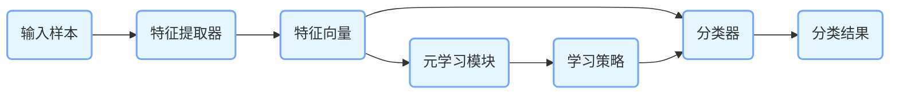

# 提高AI模型在少次学习任务中的泛化能力

> 关键词：AI模型、少次学习、泛化能力、元学习、数据增强

> 摘要：本文聚焦于提高AI模型在少次学习任务中的泛化能力这一关键问题。首先介绍了少次学习任务的背景和相关概念，阐述了提高泛化能力的重要性和挑战。接着详细讲解了核心概念，包括少次学习的原理和相关架构，并通过Mermaid流程图进行直观展示。在核心算法原理部分，使用Python源代码深入阐述了几种常见的提高泛化能力的算法。同时，给出了相应的数学模型和公式，并举例说明。通过项目实战，展示了如何在实际开发中提高模型的泛化能力，包括开发环境搭建、源代码实现和代码解读。还探讨了实际应用场景，推荐了相关的学习资源、开发工具框架和论文著作。最后总结了未来的发展趋势与挑战，并提供了常见问题的解答和扩展阅读的参考资料。

## 1. 背景介绍 
### 1.1 目的和范围
少次学习（Few-Shot Learning）是人工智能领域中的一个重要研究方向，旨在让模型在仅有少量样本的情况下进行有效的学习和泛化。传统的机器学习和深度学习方法通常需要大量的标注数据来训练模型，以达到较好的性能。然而，在许多实际应用场景中，获取大量标注数据是非常困难、昂贵甚至不可行的，例如医疗影像诊断、珍稀物种识别等。因此，提高AI模型在少次学习任务中的泛化能力具有重要的现实意义。

本文的范围主要涵盖了提高AI模型在少次学习任务中泛化能力的相关理论、算法、实践和应用。我们将探讨核心概念、算法原理、数学模型，通过实际案例展示如何实现和优化模型的泛化能力，并介绍相关的工具和资源。

### 1.2 预期读者
本文的预期读者包括人工智能领域的研究人员、工程师、学生以及对少次学习和模型泛化能力感兴趣的技术爱好者。对于研究人员，本文可以提供最新的研究思路和方法；对于工程师，有助于他们在实际项目中应用相关技术来解决少数据问题；对于学生，能够帮助他们深入理解少次学习的原理和实践。

### 1.3 文档结构概述
本文将按照以下结构进行组织：
- 核心概念与联系：介绍少次学习的核心概念、原理和架构，并通过Mermaid流程图进行可视化展示。
- 核心算法原理 & 具体操作步骤：详细讲解几种常见的提高泛化能力的算法，并使用Python源代码进行阐述。
- 数学模型和公式 & 详细讲解 & 举例说明：给出相关的数学模型和公式，并通过具体例子进行说明。
- 项目实战：通过实际项目展示如何提高模型在少次学习任务中的泛化能力，包括开发环境搭建、源代码实现和代码解读。
- 实际应用场景：探讨少次学习在不同领域的实际应用场景。
- 工具和资源推荐：推荐相关的学习资源、开发工具框架和论文著作。
- 总结：未来发展趋势与挑战：总结少次学习的发展趋势和面临的挑战。
- 附录：常见问题与解答：解答读者可能遇到的常见问题。
- 扩展阅读 & 参考资料：提供进一步学习的扩展阅读材料和参考资料。

### 1.4 术语表
#### 1.4.1 核心术语定义
- **少次学习（Few-Shot Learning）**：指模型在仅有少量标注样本的情况下进行学习和泛化的能力。通常分为单样本学习（One-Shot Learning）和少样本学习（Few-Shot Learning），单样本学习是少次学习的一种特殊情况，只使用一个样本进行学习。
- **泛化能力（Generalization Ability）**：模型在未见过的数据上表现出良好性能的能力。在少次学习中，泛化能力尤为重要，因为模型需要从少量样本中学习到足够的信息来对新的数据进行准确分类或预测。
- **元学习（Meta-Learning）**：也称为“学习如何学习”，是一种让模型在多个任务上进行学习，从而快速适应新任务的方法。元学习可以帮助模型在少次学习任务中更好地泛化。
- **数据增强（Data Augmentation）**：通过对原始数据进行各种变换，如旋转、翻转、缩放等，来生成新的数据样本，从而增加数据的多样性和数量，提高模型的泛化能力。

#### 1.4.2 相关概念解释
- **支持集（Support Set）**：在少次学习中，用于训练模型的少量标注样本集合。
- **查询集（Query Set）**：用于测试模型性能的未见过的样本集合。
- **原型（Prototype）**：在原型网络（Prototype Network）中，每个类别的原型是该类别所有支持样本的特征向量的平均值。模型通过计算查询样本与各个原型之间的距离来进行分类。

#### 1.4.3 缩略词列表
- **CNN**：卷积神经网络（Convolutional Neural Network）
- **RNN**：循环神经网络（Recurrent Neural Network）
- **LSTM**：长短期记忆网络（Long Short-Term Memory）
- **MAML**：模型无关元学习（Model-Agnostic Meta-Learning）
- **Siamese Network**：孪生网络

## 2. 核心概念与联系 
### 少次学习的原理
少次学习的核心目标是让模型在仅有少量标注样本的情况下，能够快速学习到类别之间的本质差异，从而对新的样本进行准确分类或预测。传统的机器学习和深度学习方法通常依赖于大量的数据来学习模型的参数，而少次学习需要模型具备更强的归纳能力和泛化能力。

少次学习的一种常见方法是元学习，它通过在多个任务上进行训练，让模型学习到如何快速适应新的任务。元学习的基本思想是，在训练过程中，模型不仅学习每个任务的具体知识，还学习到一种通用的学习策略，这种策略可以帮助模型在面对新任务时，利用少量的样本快速调整自己的参数，从而实现少次学习。

### 少次学习的架构
少次学习的架构通常包括以下几个部分：
- **特征提取器**：用于从输入样本中提取特征。常见的特征提取器包括卷积神经网络（CNN）、循环神经网络（RNN）等。
- **元学习模块**：负责学习通用的学习策略。元学习模块可以采用不同的方法，如模型无关元学习（MAML）、原型网络（Prototype Network）等。
- **分类器**：根据提取的特征和学习到的策略，对新的样本进行分类或预测。

### 文本示意图
```plaintext
输入样本 -> 特征提取器 -> 特征向量
特征向量 -> 元学习模块 -> 学习策略
学习策略 + 特征向量 -> 分类器 -> 分类结果
```

### Mermaid流程图


## 3. 核心算法原理 & 具体操作步骤 
### 原型网络（Prototype Network）
#### 算法原理
原型网络的核心思想是为每个类别计算一个原型，原型是该类别所有支持样本的特征向量的平均值。在测试阶段，模型通过计算查询样本与各个原型之间的距离来进行分类，将查询样本分类到距离最近的原型所对应的类别。

#### Python源代码实现
```python
import torch
import torch.nn as nn
import torch.optim as optim
from torch.utils.data import DataLoader
import numpy as np

# 定义特征提取器
class FeatureExtractor(nn.Module):
    def __init__(self):
        super(FeatureExtractor, self).__init__()
        self.conv1 = nn.Conv2d(3, 64, kernel_size=3, padding=1)
        self.relu1 = nn.ReLU()
        self.pool1 = nn.MaxPool2d(2)
        self.conv2 = nn.Conv2d(64, 64, kernel_size=3, padding=1)
        self.relu2 = nn.ReLU()
        self.pool2 = nn.MaxPool2d(2)
        self.conv3 = nn.Conv2d(64, 64, kernel_size=3, padding=1)
        self.relu3 = nn.ReLU()
        self.pool3 = nn.MaxPool2d(2)
        self.conv4 = nn.Conv2d(64, 64, kernel_size=3, padding=1)
        self.relu4 = nn.ReLU()

    def forward(self, x):
        x = self.pool1(self.relu1(self.conv1(x)))
        x = self.pool2(self.relu2(self.conv2(x)))
        x = self.pool3(self.relu3(self.conv3(x)))
        x = self.relu4(self.conv4(x))
        x = x.view(x.size(0), -1)
        return x

# 计算原型
def compute_prototypes(support_features, support_labels, num_classes):
    prototypes = []
    for c in range(num_classes):
        indices = (support_labels == c).nonzero(as_tuple=True)[0]
        class_features = support_features[indices]
        prototype = class_features.mean(dim=0)
        prototypes.append(prototype)
    prototypes = torch.stack(prototypes)
    return prototypes

# 计算距离
def euclidean_distance(query_features, prototypes):
    n = query_features.size(0)
    m = prototypes.size(0)
    query_features = query_features.unsqueeze(1).expand(n, m, -1)
    prototypes = prototypes.unsqueeze(0).expand(n, m, -1)
    dist = torch.pow(query_features - prototypes, 2).sum(dim=2)
    return dist

# 训练函数
def train(model, dataloader, optimizer, num_classes):
    model.train()
    total_loss = 0
    for support_images, support_labels, query_images, query_labels in dataloader:
        optimizer.zero_grad()
        support_features = model(support_images)
        query_features = model(query_images)
        prototypes = compute_prototypes(support_features, support_labels, num_classes)
        dist = euclidean_distance(query_features, prototypes)
        logits = -dist
        loss = nn.CrossEntropyLoss()(logits, query_labels)
        loss.backward()
        optimizer.step()
        total_loss += loss.item()
    return total_loss / len(dataloader)

# 测试函数
def test(model, dataloader, num_classes):
    model.eval()
    correct = 0
    total = 0
    with torch.no_grad():
        for support_images, support_labels, query_images, query_labels in dataloader:
            support_features = model(support_images)
            query_features = model(query_images)
            prototypes = compute_prototypes(support_features, support_labels, num_classes)
            dist = euclidean_distance(query_features, prototypes)
            logits = -dist
            predictions = logits.argmax(dim=1)
            correct += (predictions == query_labels).sum().item()
            total += query_labels.size(0)
    return correct / total

# 示例使用
if __name__ == "__main__":
    # 假设已经有了数据集和数据加载器
    num_classes = 5
    model = FeatureExtractor()
    optimizer = optim.Adam(model.parameters(), lr=0.001)
    dataloader = DataLoader(...)  # 替换为实际的数据加载器
    num_epochs = 10
    for epoch in range(num_epochs):
        train_loss = train(model, dataloader, optimizer, num_classes)
        test_acc = test(model, dataloader, num_classes)
        print(f'Epoch {epoch + 1}/{num_epochs}, Train Loss: {train_loss:.4f}, Test Acc: {test_acc:.4f}')
```

### 模型无关元学习（MAML）
#### 算法原理
模型无关元学习（MAML）的核心思想是找到一组初始参数，使得模型在经过少量梯度更新后，能够在新的任务上取得较好的性能。MAML通过在多个任务上进行训练，让模型学习到如何快速适应新的任务。

#### Python源代码实现
```python
import torch
import torch.nn as nn
import torch.optim as optim
from torchmeta.modules import MetaModule, MetaLinear

# 定义模型
class MetaModel(MetaModule):
    def __init__(self):
        super(MetaModel, self).__init__()
        self.linear1 = MetaLinear(1, 10)
        self.relu = nn.ReLU()
        self.linear2 = MetaLinear(10, 1)

    def forward(self, x, params=None):
        x = self.linear1(x, params=self.get_subdict(params, 'linear1'))
        x = self.relu(x)
        x = self.linear2(x, params=self.get_subdict(params, 'linear2'))
        return x

# MAML训练函数
def maml_train(model, dataloader, meta_optimizer, num_inner_steps, inner_lr):
    model.train()
    meta_loss = 0
    for task_batch in dataloader:
        support_inputs, support_targets, query_inputs, query_targets = task_batch
        task_losses = []
        for i in range(len(support_inputs)):
            support_x = support_inputs[i].unsqueeze(1)
            support_y = support_targets[i].unsqueeze(1)
            query_x = query_inputs[i].unsqueeze(1)
            query_y = query_targets[i].unsqueeze(1)

            # 内循环
            fast_weights = model.meta_named_parameters()
            for _ in range(num_inner_steps):
                support_outputs = model(support_x, params=fast_weights)
                inner_loss = nn.MSELoss()(support_outputs, support_y)
                grads = torch.autograd.grad(inner_loss, fast_weights.values(), create_graph=True)
                fast_weights = dict(
                    (name, param - inner_lr * grad)
                    for ((name, param), grad) in zip(fast_weights.items(), grads)
                )

            # 外循环
            query_outputs = model(query_x, params=fast_weights)
            task_loss = nn.MSELoss()(query_outputs, query_y)
            task_losses.append(task_loss)

        meta_loss += torch.stack(task_losses).mean()

    meta_optimizer.zero_grad()
    meta_loss.backward()
    meta_optimizer.step()
    return meta_loss.item()

# 示例使用
if __name__ == "__main__":
    model = MetaModel()
    meta_optimizer = optim.Adam(model.parameters(), lr=0.001)
    dataloader = DataLoader(...)  # 替换为实际的数据加载器
    num_inner_steps = 5
    inner_lr = 0.01
    num_epochs = 10
    for epoch in range(num_epochs):
        meta_loss = maml_train(model, dataloader, meta_optimizer, num_inner_steps, inner_lr)
        print(f'Epoch {epoch + 1}/{num_epochs}, Meta Loss: {meta_loss:.4f}')
```

## 4. 数学模型和公式 & 详细讲解 & 举例说明 
### 原型网络的数学模型
#### 特征提取
假设输入样本为 $x$，特征提取器为 $f$，则提取的特征向量为 $z = f(x)$。

#### 原型计算
对于每个类别 $c$，其原型 $p_c$ 是该类别所有支持样本的特征向量的平均值：
$$p_c = \frac{1}{N_c} \sum_{i=1}^{N_c} z_i$$
其中 $N_c$ 是类别 $c$ 的支持样本数量，$z_i$ 是类别 $c$ 的第 $i$ 个支持样本的特征向量。

#### 距离计算
使用欧几里得距离计算查询样本 $z_q$ 与各个原型 $p_c$ 之间的距离：
$$d(z_q, p_c) = \| z_q - p_c \|^2$$

#### 分类
根据距离计算结果，将查询样本分类到距离最近的原型所对应的类别：
$$\hat{y} = \arg\min_{c} d(z_q, p_c)$$

#### 举例说明
假设我们有一个少次学习任务，有 3 个类别，每个类别有 2 个支持样本。输入样本的维度为 $3\times32\times32$，特征提取器将其转换为维度为 64 的特征向量。

对于类别 1，其支持样本的特征向量分别为 $z_{11} = [1, 2, \cdots, 64]$ 和 $z_{12} = [2, 3, \cdots, 65]$，则该类别的原型为：
$$p_1 = \frac{1}{2} (z_{11} + z_{12}) = [1.5, 2.5, \cdots, 64.5]$$

假设查询样本的特征向量为 $z_q = [1.2, 2.3, \cdots, 63.4]$，则查询样本与类别 1 原型的欧几里得距离为：
$$d(z_q, p_1) = \sum_{i=1}^{64} (z_{q,i} - p_{1,i})^2$$

通过计算查询样本与所有类别的原型之间的距离，将查询样本分类到距离最近的原型所对应的类别。

### 模型无关元学习（MAML）的数学模型
#### 内循环
在每个任务上，模型的参数 $\theta$ 经过 $K$ 步梯度更新得到快速参数 $\theta'$：
$$\theta_{k+1}' = \theta_k' - \alpha \nabla_{\theta_k'} L(\theta_k', \mathcal{T}_{support})$$
其中 $\alpha$ 是内循环的学习率，$\mathcal{T}_{support}$ 是支持集，$L$ 是损失函数。

#### 外循环
在多个任务上，通过最小化查询集上的损失来更新模型的初始参数 $\theta$：
$$\min_{\theta} \sum_{\mathcal{T}} L(\theta', \mathcal{T}_{query})$$
其中 $\mathcal{T}$ 是所有任务的集合，$\mathcal{T}_{query}$ 是查询集。

#### 举例说明
假设我们有一个回归任务，模型是一个简单的线性回归模型 $y = wx + b$，损失函数是均方误差损失 $L = \frac{1}{N} \sum_{i=1}^{N} (y_i - \hat{y}_i)^2$。

在一个任务的内循环中，初始参数为 $\theta = [w, b]$，支持集有 5 个样本 $(x_1, y_1), (x_2, y_2), \cdots, (x_5, y_5)$。经过 2 步梯度更新：
- 第一步：计算支持集上的损失 $L_1$，并更新参数 $\theta_1' = \theta - \alpha \nabla_{\theta} L_1$。
- 第二步：计算新参数下支持集上的损失 $L_2$，并更新参数 $\theta_2' = \theta_1' - \alpha \nabla_{\theta_1'} L_2$。

在外循环中，在多个任务上，通过最小化查询集上的损失来更新模型的初始参数 $\theta$。

## 5. 项目实战：代码实际案例和详细解释说明 
### 5.1  开发环境搭建
#### 操作系统
推荐使用 Ubuntu 18.04 或更高版本，或者 Windows 10 及以上。

#### Python环境
建议使用 Python 3.7 或更高版本。可以使用 Anaconda 来管理 Python 环境：
```bash
# 下载并安装 Anaconda
wget https://repo.anaconda.com/archive/Anaconda3-2023.07-2-Linux-x86_64.sh
bash Anaconda3-2023.07-2-Linux-x86_64.sh

# 创建虚拟环境
conda create -n few_shot_learning python=3.8
conda activate few_shot_learning
```

#### 安装依赖库
```bash
pip install torch torchvision numpy matplotlib
```

### 5.2  源代码详细实现和代码解读
#### 数据集准备
我们使用 Omniglot 数据集作为示例，该数据集包含 1623 个不同的手写字符，每个字符有 20 个样本。

```python
import torchvision.transforms as transforms
from torchmeta.datasets import Omniglot
from torchmeta.transforms import ClassSplitter, Categorical

# 定义数据变换
transform = transforms.Compose([
    transforms.Resize(28),
    transforms.ToTensor()
])

# 加载 Omniglot 数据集
dataset = Omniglot('data', num_classes_per_task=5, meta_train=True,
                   transform=transform, target_transform=Categorical(num_classes=5),
                   download=True)
dataset = ClassSplitter(dataset, shuffle=True, num_train_per_class=1, num_test_per_class=15)
```

#### 原型网络实现
```python
import torch
import torch.nn as nn
import torch.optim as optim
from torch.utils.data import DataLoader

# 定义特征提取器
class FeatureExtractor(nn.Module):
    def __init__(self):
        super(FeatureExtractor, self).__init__()
        self.conv1 = nn.Conv2d(1, 64, kernel_size=3, padding=1)
        self.relu1 = nn.ReLU()
        self.pool1 = nn.MaxPool2d(2)
        self.conv2 = nn.Conv2d(64, 64, kernel_size=3, padding=1)
        self.relu2 = nn.ReLU()
        self.pool2 = nn.MaxPool2d(2)
        self.conv3 = nn.Conv2d(64, 64, kernel_size=3, padding=1)
        self.relu3 = nn.ReLU()
        self.pool3 = nn.MaxPool2d(2)
        self.conv4 = nn.Conv2d(64, 64, kernel_size=3, padding=1)
        self.relu4 = nn.ReLU()

    def forward(self, x):
        x = self.pool1(self.relu1(self.conv1(x)))
        x = self.pool2(self.relu2(self.conv2(x)))
        x = self.pool3(self.relu3(self.conv3(x)))
        x = self.relu4(self.conv4(x))
        x = x.view(x.size(0), -1)
        return x

# 计算原型
def compute_prototypes(support_features, support_labels, num_classes):
    prototypes = []
    for c in range(num_classes):
        indices = (support_labels == c).nonzero(as_tuple=True)[0]
        class_features = support_features[indices]
        prototype = class_features.mean(dim=0)
        prototypes.append(prototype)
    prototypes = torch.stack(prototypes)
    return prototypes

# 计算距离
def euclidean_distance(query_features, prototypes):
    n = query_features.size(0)
    m = prototypes.size(0)
    query_features = query_features.unsqueeze(1).expand(n, m, -1)
    prototypes = prototypes.unsqueeze(0).expand(n, m, -1)
    dist = torch.pow(query_features - prototypes, 2).sum(dim=2)
    return dist

# 训练函数
def train(model, dataloader, optimizer, num_classes):
    model.train()
    total_loss = 0
    for task in dataloader:
        support_images, support_labels = task['train']
        query_images, query_labels = task['test']
        optimizer.zero_grad()
        support_features = model(support_images)
        query_features = model(query_images)
        prototypes = compute_prototypes(support_features, support_labels, num_classes)
        dist = euclidean_distance(query_features, prototypes)
        logits = -dist
        loss = nn.CrossEntropyLoss()(logits, query_labels)
        loss.backward()
        optimizer.step()
        total_loss += loss.item()
    return total_loss / len(dataloader)

# 测试函数
def test(model, dataloader, num_classes):
    model.eval()
    correct = 0
    total = 0
    with torch.no_grad():
        for task in dataloader:
            support_images, support_labels = task['train']
            query_images, query_labels = task['test']
            support_features = model(support_images)
            query_features = model(query_images)
            prototypes = compute_prototypes(support_features, support_labels, num_classes)
            dist = euclidean_distance(query_features, prototypes)
            logits = -dist
            predictions = logits.argmax(dim=1)
            correct += (predictions == query_labels).sum().item()
            total += query_labels.size(0)
    return correct / total

# 示例使用
if __name__ == "__main__":
    num_classes = 5
    model = FeatureExtractor()
    optimizer = optim.Adam(model.parameters(), lr=0.001)
    dataloader = DataLoader(dataset, batch_size=4, shuffle=True)
    num_epochs = 10
    for epoch in range(num_epochs):
        train_loss = train(model, dataloader, optimizer, num_classes)
        test_acc = test(model, dataloader, num_classes)
        print(f'Epoch {epoch + 1}/{num_epochs}, Train Loss: {train_loss:.4f}, Test Acc: {test_acc:.4f}')
```

### 5.3  代码解读与分析
#### 数据集准备
- 使用 `torchmeta.datasets.Omniglot` 加载 Omniglot 数据集，并进行数据变换，将图像调整为 28x28 大小并转换为张量。
- 使用 `ClassSplitter` 将数据集划分为支持集和查询集，每个类别有 1 个支持样本和 15 个查询样本。

#### 原型网络实现
- **特征提取器**：定义了一个简单的卷积神经网络作为特征提取器，通过四层卷积和池化层将输入图像转换为特征向量。
- **原型计算**：`compute_prototypes` 函数计算每个类别的原型，即该类别所有支持样本的特征向量的平均值。
- **距离计算**：`euclidean_distance` 函数计算查询样本与各个原型之间的欧几里得距离。
- **训练函数**：在每个任务上，计算支持集和查询集的特征向量，计算原型和距离，使用交叉熵损失进行训练。
- **测试函数**：在测试阶段，计算查询样本与原型之间的距离，根据距离进行分类，并计算准确率。

## 6. 实际应用场景 
### 医疗影像诊断
在医疗影像诊断中，获取大量标注的病例数据是非常困难的，因为需要专业的医生进行标注，而且某些疾病的病例数量本身就很少。少次学习可以帮助模型在仅有少量标注病例的情况下，对新的影像进行准确诊断。例如，对于罕见疾病的影像诊断，模型可以通过少次学习快速适应新的疾病类型，提高诊断的准确性和效率。

### 珍稀物种识别
在生态保护领域，珍稀物种的数量稀少，获取大量的物种图像数据比较困难。少次学习可以让模型在少量样本的情况下，对珍稀物种进行准确识别。例如，在野外监测中，通过少次学习模型可以快速识别出珍稀鸟类、动物等，为生态保护提供有力支持。

### 个性化推荐系统
在个性化推荐系统中，每个用户的行为数据通常比较少。少次学习可以帮助模型在少量用户数据的情况下，快速学习用户的偏好，为用户提供个性化的推荐。例如，在新用户注册后，模型可以通过少次学习快速了解用户的兴趣，推荐符合用户需求的商品或服务。

### 智能家居控制
在智能家居控制中，不同用户对智能家居设备的使用习惯和需求各不相同，而且每个用户的使用数据也比较少。少次学习可以让模型在少量用户数据的情况下，快速适应不同用户的需求，实现个性化的智能家居控制。例如，根据用户的少量操作数据，模型可以自动调整灯光亮度、温度等参数，提供更加舒适的家居环境。

## 7. 工具和资源推荐
### 7.1 学习资源推荐
#### 7.1.1 书籍推荐
- 《Deep Learning》（深度学习）：由 Ian Goodfellow、Yoshua Bengio 和 Aaron Courville 所著，是深度学习领域的经典教材，涵盖了深度学习的基本概念、算法和应用。
- 《Machine Learning: A Probabilistic Perspective》（机器学习：一种概率视角）：由 Kevin P. Murphy 所著，从概率的角度介绍了机器学习的各种算法和模型，对于理解少次学习的理论基础有很大帮助。
- 《Few-Shot Learning》：专门介绍少次学习的书籍，详细讲解了少次学习的各种算法和应用场景。

#### 7.1.2 在线课程
- Coursera 上的《Deep Learning Specialization》（深度学习专项课程）：由 Andrew Ng 教授讲授，是深度学习领域的经典在线课程，涵盖了深度学习的各个方面。
- edX 上的《Probability-The Science of Uncertainty and Data》（概率 - 不确定性和数据的科学）：帮助学习者建立概率和统计的基础知识，对于理解少次学习的数学模型很有帮助。
- B 站上的一些少次学习相关的课程和教程，例如一些知名高校的公开课视频。

#### 7.1.3 技术博客和网站
- Medium 上有很多关于少次学习和人工智能的技术博客，例如 Towards Data Science 等。
- arXiv.org 是一个预印本服务器，上面有很多最新的少次学习研究论文。
- OpenAI 的官方博客，会发布一些关于人工智能领域的最新研究成果和技术进展。

### 7.2 开发工具框架推荐
#### 7.2.1 IDE和编辑器
- PyCharm：是一款专门为 Python 开发设计的集成开发环境（IDE），具有强大的代码编辑、调试和自动补全功能。
- Jupyter Notebook：是一个交互式的开发环境，适合进行数据分析和模型实验，可以实时查看代码的运行结果。
- Visual Studio Code：是一款轻量级的代码编辑器，支持多种编程语言和插件，对于 Python 开发也有很好的支持。

#### 7.2.2 调试和性能分析工具
- TensorBoard：是 TensorFlow 提供的可视化工具，可以用于查看模型的训练过程、损失曲线、准确率等指标。
- PyTorch Profiler：是 PyTorch 提供的性能分析工具，可以帮助开发者分析模型的性能瓶颈，优化代码。
- NVIDIA Nsight Systems：是 NVIDIA 提供的性能分析工具，适用于 GPU 加速的深度学习模型，可以帮助开发者优化 GPU 代码。

#### 7.2.3 相关框架和库
- PyTorch：是一个开源的深度学习框架，具有动态图和静态图两种模式，易于使用和调试，在少次学习领域有广泛的应用。
- TensorFlow：是另一个知名的深度学习框架，具有强大的分布式训练和部署能力，也有很多少次学习的相关实现。
- Torchmeta：是一个专门为元学习设计的 PyTorch 扩展库，提供了各种元学习算法和数据集的实现。

### 7.3 相关论文著作推荐
#### 7.3.1 经典论文
- "Matching Networks for One Shot Learning"：提出了匹配网络（Matching Networks），是少次学习领域的经典论文之一。
- "Model-Agnostic Meta-Learning for Fast Adaptation of Deep Networks"：提出了模型无关元学习（MAML）算法，为少次学习提供了一种通用的解决方案。
- "Prototypical Networks for Few-shot Learning"：提出了原型网络（Prototype Network），通过计算原型来实现少次学习。

#### 7.3.2 最新研究成果
- 可以通过 arXiv.org 搜索最新的少次学习研究论文，了解该领域的最新技术进展。
- 参加相关的学术会议，如 NeurIPS、ICML、CVPR 等，获取最新的研究成果和学术动态。

#### 7.3.3 应用案例分析
- 一些学术期刊和会议论文会有少次学习在不同领域的应用案例分析，例如医疗影像诊断、自然语言处理等。
- 一些科技公司的博客和技术报告也会分享少次学习在实际项目中的应用经验和成果。

## 8. 总结：未来发展趋势与挑战
### 未来发展趋势
#### 与其他技术的融合
少次学习将与其他人工智能技术，如强化学习、生成对抗网络（GAN）等进行更深入的融合。例如，将少次学习与强化学习相结合，可以让智能体在少量样本的情况下快速学习到最优策略；将少次学习与 GAN 相结合，可以生成更多的样本用于训练，提高模型的泛化能力。

#### 跨领域应用拓展
少次学习将在更多的领域得到应用，如金融、交通、能源等。在金融领域，少次学习可以用于风险评估、欺诈检测等；在交通领域，可以用于自动驾驶、交通流量预测等；在能源领域，可以用于能源消耗预测、设备故障诊断等。

#### 模型的可解释性
随着少次学习模型的复杂度不断增加，模型的可解释性变得越来越重要。未来的研究将更加关注少次学习模型的可解释性，开发出能够解释模型决策过程的方法和技术，提高模型的可信度和可靠性。

### 挑战
#### 数据质量和多样性
在少次学习中，数据的质量和多样性对模型的性能影响很大。由于样本数量有限，数据中的噪声和偏差可能会对模型的训练产生较大的影响。因此，如何获取高质量、多样化的数据是少次学习面临的一个重要挑战。

#### 模型的泛化能力
虽然少次学习的目标是提高模型在少量样本下的泛化能力，但目前的模型在实际应用中仍然存在泛化能力不足的问题。如何设计更加有效的算法和模型结构，提高模型的泛化能力，是少次学习领域需要解决的关键问题。

#### 计算资源和效率
少次学习通常需要大量的计算资源和时间，特别是在元学习中，需要在多个任务上进行训练。如何优化算法和模型结构，提高计算效率，减少计算资源的消耗，是少次学习面临的另一个挑战。

## 9. 附录：常见问题与解答
### 问题 1：少次学习和传统机器学习有什么区别？
传统机器学习通常需要大量的标注数据来训练模型，以达到较好的性能。而少次学习的目标是让模型在仅有少量标注样本的情况下进行学习和泛化。少次学习更注重模型的归纳能力和快速适应新任务的能力。

### 问题 2：元学习和少次学习有什么关系？
元学习是一种实现少次学习的有效方法。元学习通过在多个任务上进行训练，让模型学习到如何快速适应新的任务。在少次学习中，元学习可以帮助模型在少量样本的情况下，利用学到的通用学习策略快速调整自己的参数，从而实现少次学习。

### 问题 3：如何选择合适的少次学习算法？
选择合适的少次学习算法需要考虑多个因素，如数据集的特点、任务的类型、计算资源等。如果数据集的样本数量较少，且类别之间的差异较大，可以考虑使用原型网络等算法；如果需要模型能够快速适应不同的任务，可以考虑使用模型无关元学习（MAML）等算法。

### 问题 4：少次学习在实际应用中存在哪些局限性？
少次学习在实际应用中存在一些局限性，如数据质量和多样性的影响、模型的泛化能力不足、计算资源和效率的问题等。此外，少次学习模型的可解释性也是一个需要解决的问题，在一些对模型解释性要求较高的领域，少次学习模型的应用可能会受到限制。

## 10. 扩展阅读 & 参考资料
### 扩展阅读
- 《Meta-Learning: A Survey》：对元学习进行了全面的综述，介绍了元学习的各种算法和应用。
- 《Few-Shot Learning with Graph Neural Networks》：探讨了如何使用图神经网络实现少次学习。
- 《Adversarial Few-Shot Learning》：研究了如何将对抗学习应用于少次学习。

### 参考资料
- Goodfellow, I., Bengio, Y., & Courville, A. (2016). Deep Learning. MIT Press.
- Murphy, K. P. (2012). Machine Learning: A Probabilistic Perspective. MIT Press.
- Vinyals, O., Blundell, C., Lillicrap, T., Wierstra, D. (2016). Matching Networks for One Shot Learning. NeurIPS.
- Finn, C., Abbeel, P., & Levine, S. (2017). Model-Agnostic Meta-Learning for Fast Adaptation of Deep Networks. ICML.
- Snell, J., Swersky, K., & Zemel, R. S. (2017). Prototypical Networks for Few-shot Learning. NeurIPS.