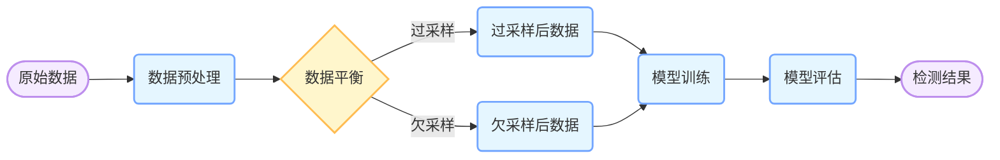

# 提高AI模型在稀有事件检测中的敏感性与准确性

> 关键词：AI模型、稀有事件检测、敏感性、准确性、数据不平衡、模型优化

> 摘要：本文聚焦于提高AI模型在稀有事件检测中的敏感性与准确性这一关键问题。首先介绍了稀有事件检测的背景，包括其目的、预期读者和文档结构等。接着阐述了相关核心概念及联系，分析了稀有事件检测的原理和架构。详细讲解了核心算法原理和具体操作步骤，并结合Python代码进行说明。探讨了数学模型和公式，通过举例加深理解。在项目实战部分，给出了开发环境搭建、源代码实现和代码解读。分析了实际应用场景，推荐了学习资源、开发工具框架和相关论文著作。最后总结了未来发展趋势与挑战，并提供了常见问题解答和扩展阅读参考资料，旨在为提高AI模型在稀有事件检测中的性能提供全面的指导。

## 1. 背景介绍 
### 1.1 目的和范围
稀有事件在众多领域中广泛存在，如金融欺诈检测、医疗疾病诊断、工业设备故障预警等。然而，由于稀有事件发生的频率极低，AI模型在检测这些事件时往往面临着敏感性和准确性不足的问题。本文的目的在于深入探讨如何提高AI模型在稀有事件检测中的敏感性与准确性，通过分析核心概念、算法原理、数学模型等方面，结合实际项目案例，为解决这一问题提供有效的方法和策略。

本文的范围涵盖了从理论到实践的多个层面，包括对稀有事件检测相关概念的介绍、核心算法的原理分析、数学模型的推导和应用、实际项目的开发和实现，以及对未来发展趋势的展望和常见问题的解答。

### 1.2 预期读者
本文预期读者包括从事AI技术研究和开发的科研人员、数据科学家、机器学习工程师，以及对稀有事件检测感兴趣的相关领域从业者。对于希望提高AI模型在稀有事件检测中性能的专业人士，本文将提供有价值的技术指导和实践经验。

### 1.3 文档结构概述
本文将按照以下结构进行组织：
1. **背景介绍**：介绍本文的目的、范围、预期读者和文档结构，以及相关术语的定义。
2. **核心概念与联系**：阐述稀有事件检测的核心概念、原理和架构，通过文本示意图和Mermaid流程图进行说明。
3. **核心算法原理 & 具体操作步骤**：详细讲解提高AI模型在稀有事件检测中性能的核心算法原理，并给出具体的操作步骤，结合Python代码进行详细阐述。
4. **数学模型和公式 & 详细讲解 & 举例说明**：介绍稀有事件检测中涉及的数学模型和公式，进行详细讲解，并通过实际例子进行说明。
5. **项目实战：代码实际案例和详细解释说明**：通过一个实际的项目案例，介绍开发环境的搭建、源代码的实现和代码的解读。
6. **实际应用场景**：分析稀有事件检测在不同领域的实际应用场景。
7. **工具和资源推荐**：推荐学习资源、开发工具框架和相关论文著作。
8. **总结：未来发展趋势与挑战**：总结提高AI模型在稀有事件检测中性能的关键要点，展望未来发展趋势，并分析面临的挑战。
9. **附录：常见问题与解答**：解答读者在学习和实践过程中常见的问题。
10. **扩展阅读 & 参考资料**：提供扩展阅读的建议和相关参考资料。

### 1.4 术语表
#### 1.4.1 核心术语定义
- **稀有事件**：指在数据集中发生频率极低的事件，通常与正常事件相比，其样本数量极少。
- **敏感性**：在稀有事件检测中，敏感性是指模型正确检测出稀有事件的能力，通常用真阳性率（True Positive Rate，TPR）来衡量。
- **准确性**：模型正确分类所有事件（包括稀有事件和正常事件）的能力，通常用准确率（Accuracy）来衡量。
- **数据不平衡**：指数据集中不同类别样本数量差异较大的情况，在稀有事件检测中，稀有事件样本数量远少于正常事件样本数量。
- **过采样**：通过增加稀有事件样本数量来解决数据不平衡问题的方法。
- **欠采样**：通过减少正常事件样本数量来解决数据不平衡问题的方法。

#### 1.4.2 相关概念解释
- **混淆矩阵**：用于评估分类模型性能的一种表格，包含真阳性（True Positive，TP）、假阳性（False Positive，FP）、真阴性（True Negative，TN）和假阴性（False Negative，FN）四个指标。
- **ROC曲线**：受试者工作特征曲线（Receiver Operating Characteristic Curve），用于展示分类模型在不同阈值下的敏感性和特异性之间的权衡关系。
- **AUC值**：ROC曲线下的面积（Area Under the Curve），用于衡量分类模型的整体性能。

#### 1.4.3 缩略词列表
- **TP**：True Positive，真阳性
- **FP**：False Positive，假阳性
- **TN**：True Negative，真阴性
- **FN**：False Negative，假阴性
- **TPR**：True Positive Rate，真阳性率
- **FPR**：False Positive Rate，假阳性率
- **ROC**：Receiver Operating Characteristic，受试者工作特征
- **AUC**：Area Under the Curve，曲线下面积

## 2. 核心概念与联系 

### 核心概念原理
在稀有事件检测中，核心目标是提高模型对稀有事件的敏感性和准确性。然而，由于数据不平衡的问题，传统的分类模型往往会偏向于多数类（正常事件），导致对稀有事件的检测性能不佳。

为了解决这个问题，需要从多个方面入手。首先，数据层面可以采用过采样、欠采样等方法来平衡数据分布，使模型能够更好地学习稀有事件的特征。其次，模型层面可以选择合适的算法和优化策略，如集成学习、深度学习等，以提高模型的性能。此外，还可以通过调整模型的阈值来平衡敏感性和特异性。

### 架构示意图
以下是一个简单的稀有事件检测架构示意图：



这个架构图展示了稀有事件检测的主要步骤：首先对原始数据进行预处理，然后进行数据平衡操作（过采样或欠采样），接着使用平衡后的数据进行模型训练，最后对模型进行评估并输出检测结果。

### 各部分联系
- **数据预处理**：是整个流程的基础，它可以对原始数据进行清洗、特征提取和转换等操作，为后续的数据平衡和模型训练提供高质量的数据。
- **数据平衡**：通过过采样或欠采样等方法，调整数据集中不同类别的样本比例，使模型能够更好地学习稀有事件的特征，提高对稀有事件的检测能力。
- **模型训练**：使用平衡后的数据对模型进行训练，选择合适的算法和参数，使模型能够学习到数据中的模式和规律。
- **模型评估**：使用评估指标（如敏感性、准确性、ROC曲线、AUC值等）对训练好的模型进行评估，判断模型的性能是否满足需求，并根据评估结果进行模型优化。

## 3. 核心算法原理 & 具体操作步骤 

### 核心算法原理
在稀有事件检测中，常用的核心算法包括集成学习算法（如随机森林、梯度提升树）和深度学习算法（如神经网络）。下面以随机森林算法为例，介绍其原理。

随机森林是一种集成学习算法，它通过组合多个决策树来进行分类和回归任务。在随机森林中，每个决策树都是基于不同的随机子集数据和随机特征子集进行训练的，这样可以增加模型的多样性，减少过拟合的风险。

随机森林的基本原理如下：
1. **随机采样**：从原始数据集中有放回地随机采样，生成多个不同的训练子集。
2. **特征随机选择**：在每个决策树的节点上，随机选择一部分特征进行分裂，而不是使用所有特征。
3. **决策树构建**：使用每个训练子集和随机选择的特征子集构建决策树。
4. **投票决策**：对于新的样本，每个决策树都会给出一个分类结果，最终的分类结果通过投票的方式确定。

### 具体操作步骤
以下是使用Python和Scikit-learn库实现随机森林算法进行稀有事件检测的具体操作步骤：

```python
import numpy as np
from sklearn.ensemble import RandomForestClassifier
from sklearn.model_selection import train_test_split
from sklearn.metrics import accuracy_score, recall_score

# 1. 准备数据
# 假设X是特征矩阵，y是标签向量
# 这里使用随机生成的数据作为示例
np.random.seed(42)
X = np.random.rand(1000, 10)
y = np.random.randint(0, 2, 1000)

# 2. 划分训练集和测试集
X_train, X_test, y_train, y_test = train_test_split(X, y, test_size=0.2, random_state=42)

# 3. 创建随机森林分类器
rf = RandomForestClassifier(n_estimators=100, random_state=42)

# 4. 训练模型
rf.fit(X_train, y_train)

# 5. 预测
y_pred = rf.predict(X_test)

# 6. 评估模型
accuracy = accuracy_score(y_test, y_pred)
recall = recall_score(y_test, y_pred)

print(f"Accuracy: {accuracy}")
print(f"Recall: {recall}")
```

### 代码解释
1. **准备数据**：使用`numpy`库随机生成特征矩阵`X`和标签向量`y`。
2. **划分训练集和测试集**：使用`train_test_split`函数将数据划分为训练集和测试集，测试集占比为20%。
3. **创建随机森林分类器**：使用`RandomForestClassifier`类创建一个随机森林分类器，设置决策树的数量为100。
4. **训练模型**：使用`fit`方法对模型进行训练。
5. **预测**：使用训练好的模型对测试集进行预测。
6. **评估模型**：使用`accuracy_score`和`recall_score`函数计算模型的准确率和召回率。

## 4. 数学模型和公式 & 详细讲解 & 举例说明 

### 混淆矩阵
混淆矩阵是评估分类模型性能的重要工具，它包含四个指标：真阳性（TP）、假阳性（FP）、真阴性（TN）和假阴性（FN）。

$$
\begin{array}{|c|c|c|}
\hline
& \text{预测正类} & \text{预测负类} \\
\hline
\text{实际正类} & TP & FN \\
\hline
\text{实际负类} & FP & TN \\
\hline
\end{array}
$$

### 敏感性（真阳性率）
敏感性是指模型正确检测出稀有事件的能力，计算公式为：

$$
TPR = \frac{TP}{TP + FN}
$$

### 特异性
特异性是指模型正确检测出正常事件的能力，计算公式为：

$$
TNR = \frac{TN}{TN + FP}
$$

### 准确性
准确性是指模型正确分类所有事件的能力，计算公式为：

$$
Accuracy = \frac{TP + TN}{TP + TN + FP + FN}
$$

### ROC曲线和AUC值
ROC曲线是展示分类模型在不同阈值下的敏感性和特异性之间权衡关系的曲线。AUC值是ROC曲线下的面积，用于衡量分类模型的整体性能，AUC值越接近1，模型性能越好。

### 举例说明
假设我们有一个稀有事件检测模型，对100个样本进行预测，得到以下混淆矩阵：

$$
\begin{array}{|c|c|c|}
\hline
& \text{预测正类} & \text{预测负类} \\
\hline
\text{实际正类} & 10 & 5 \\
\hline
\text{实际负类} & 3 & 82 \\
\hline
\end{array}
$$

根据上述公式，我们可以计算出：
- 敏感性（TPR）：$TPR = \frac{10}{10 + 5} = \frac{10}{15} \approx 0.67$
- 特异性（TNR）：$TNR = \frac{82}{82 + 3} = \frac{82}{85} \approx 0.96$
- 准确性：$Accuracy = \frac{10 + 82}{10 + 82 + 5 + 3} = \frac{92}{100} = 0.92$

通过这些指标，我们可以评估模型在稀有事件检测中的性能。

## 5. 项目实战：代码实际案例和详细解释说明 

### 5.1  开发环境搭建
在进行稀有事件检测项目实战之前，需要搭建开发环境。以下是具体步骤：

1. **安装Python**：建议使用Python 3.7及以上版本，可以从Python官方网站（https://www.python.org/downloads/）下载并安装。
2. **安装必要的库**：使用`pip`命令安装以下库：
    - `numpy`：用于数值计算。
    - `pandas`：用于数据处理和分析。
    - `scikit-learn`：用于机器学习算法实现。
    - `matplotlib`：用于数据可视化。

```bash
pip install numpy pandas scikit-learn matplotlib
```

### 5.2  源代码详细实现和代码解读
以下是一个使用随机森林算法进行信用卡欺诈检测的实际案例，信用卡欺诈是一种典型的稀有事件检测问题。

```python
import pandas as pd
from sklearn.ensemble import RandomForestClassifier
from sklearn.model_selection import train_test_split
from sklearn.metrics import confusion_matrix, accuracy_score, recall_score
import matplotlib.pyplot as plt
import seaborn as sns

# 1. 加载数据
data = pd.read_csv('creditcard.csv')

# 2. 数据探索
print(data.head())
print(data['Class'].value_counts())

# 3. 划分特征和标签
X = data.drop('Class', axis=1)
y = data['Class']

# 4. 划分训练集和测试集
X_train, X_test, y_train, y_test = train_test_split(X, y, test_size=0.2, random_state=42)

# 5. 创建随机森林分类器
rf = RandomForestClassifier(n_estimators=100, random_state=42)

# 6. 训练模型
rf.fit(X_train, y_train)

# 7. 预测
y_pred = rf.predict(X_test)

# 8. 评估模型
conf_matrix = confusion_matrix(y_test, y_pred)
accuracy = accuracy_score(y_test, y_pred)
recall = recall_score(y_test, y_pred)

print(f"Confusion Matrix:\n{conf_matrix}")
print(f"Accuracy: {accuracy}")
print(f"Recall: {recall}")

# 9. 可视化混淆矩阵
plt.figure(figsize=(8, 6))
sns.heatmap(conf_matrix, annot=True, fmt='d', cmap='Blues')
plt.xlabel('Predicted')
plt.ylabel('Actual')
plt.title('Confusion Matrix')
plt.show()
```

### 代码解读与分析
1. **加载数据**：使用`pandas`库的`read_csv`函数加载信用卡欺诈数据集。
2. **数据探索**：查看数据集的前几行和标签列`Class`的分布情况，了解数据的基本特征。
3. **划分特征和标签**：将数据集划分为特征矩阵`X`和标签向量`y`。
4. **划分训练集和测试集**：使用`train_test_split`函数将数据划分为训练集和测试集，测试集占比为20%。
5. **创建随机森林分类器**：使用`RandomForestClassifier`类创建一个随机森林分类器，设置决策树的数量为100。
6. **训练模型**：使用`fit`方法对模型进行训练。
7. **预测**：使用训练好的模型对测试集进行预测。
8. **评估模型**：使用`confusion_matrix`、`accuracy_score`和`recall_score`函数计算混淆矩阵、准确率和召回率。
9. **可视化混淆矩阵**：使用`seaborn`库的`heatmap`函数可视化混淆矩阵，直观地展示模型的分类结果。

通过这个实际案例，我们可以看到如何使用随机森林算法进行稀有事件检测，并评估模型的性能。

## 6. 实际应用场景 
### 金融领域
在金融领域，稀有事件检测有着广泛的应用，如信用卡欺诈检测、贷款违约预测等。信用卡欺诈是一种典型的稀有事件，欺诈交易在所有交易中所占比例极低。通过提高AI模型在信用卡欺诈检测中的敏感性和准确性，可以及时发现欺诈交易，保护用户的资金安全。贷款违约预测也是一个重要的应用场景，通过对借款人的信用数据进行分析，预测其是否会违约，帮助金融机构降低风险。

### 医疗领域
在医疗领域，稀有事件检测可用于疾病诊断、药物不良反应监测等。例如，某些罕见疾病的发病率极低，但早期诊断对于患者的治疗和康复至关重要。通过提高AI模型在罕见疾病检测中的敏感性和准确性，可以帮助医生更准确地诊断疾病，制定个性化的治疗方案。药物不良反应监测也是一个重要的应用场景，通过对患者的用药数据进行分析，及时发现药物的不良反应，保障患者的用药安全。

### 工业领域
在工业领域，稀有事件检测可用于设备故障预警、质量控制等。例如，工业设备的故障往往是稀有事件，但一旦发生故障，可能会导致生产中断、设备损坏等严重后果。通过提高AI模型在设备故障预警中的敏感性和准确性，可以及时发现设备的潜在故障，提前进行维护和修复，减少停机时间和维修成本。质量控制也是一个重要的应用场景，通过对产品的生产数据进行分析，及时发现产品的质量问题，提高产品的合格率。

### 交通领域
在交通领域，稀有事件检测可用于交通事故预警、交通拥堵预测等。例如，交通事故是一种稀有事件，但会对交通系统的正常运行造成严重影响。通过提高AI模型在交通事故预警中的敏感性和准确性，可以及时发现潜在的交通事故风险，采取相应的措施，减少交通事故的发生。交通拥堵预测也是一个重要的应用场景，通过对交通流量数据进行分析，预测交通拥堵的发生时间和地点，为交通管理部门提供决策支持。

## 7. 工具和资源推荐
### 7.1 学习资源推荐
#### 7.1.1 书籍推荐
- 《机器学习》（周志华）：本书全面介绍了机器学习的基本概念、算法和应用，是机器学习领域的经典教材。
- 《Python机器学习》（Sebastian Raschka）：本书以Python为工具，详细介绍了机器学习的算法和实践，适合初学者入门。
- 《深度学习》（Ian Goodfellow、Yoshua Bengio、Aaron Courville）：本书是深度学习领域的权威著作，系统介绍了深度学习的理论和应用。

#### 7.1.2 在线课程
- Coursera上的“机器学习”课程（Andrew Ng）：该课程是机器学习领域的经典在线课程，由斯坦福大学教授Andrew Ng主讲，内容涵盖了机器学习的基本概念、算法和应用。
- edX上的“深度学习”课程（Geoffrey Hinton、Yoshua Bengio、Yann LeCun）：该课程由深度学习领域的三位先驱Geoffrey Hinton、Yoshua Bengio和Yann LeCun主讲，系统介绍了深度学习的理论和应用。
- 中国大学MOOC上的“机器学习基础”课程（周志华）：该课程由机器学习领域的知名学者周志华教授主讲，内容涵盖了机器学习的基本概念、算法和应用。

#### 7.1.3 技术博客和网站
- Medium：是一个技术博客平台，上面有很多关于机器学习、深度学习和稀有事件检测的优秀文章。
- Towards Data Science：是一个专注于数据科学和机器学习的博客网站，上面有很多高质量的技术文章和实践案例。
- Kaggle：是一个数据科学竞赛平台，上面有很多关于稀有事件检测的数据集和竞赛项目，可以通过参与竞赛来提高自己的实践能力。

### 7.2 开发工具框架推荐
#### 7.2.1 IDE和编辑器
- PyCharm：是一款专门为Python开发设计的集成开发环境（IDE），具有强大的代码编辑、调试和项目管理功能。
- Jupyter Notebook：是一个交互式的开发环境，适合进行数据探索、模型实验和代码演示。
- Visual Studio Code：是一款轻量级的代码编辑器，支持多种编程语言和插件扩展，适合快速开发和调试。

#### 7.2.2 调试和性能分析工具
- TensorBoard：是TensorFlow的可视化工具，可以用于可视化模型的训练过程、性能指标和网络结构。
- Scikit-learn的`GridSearchCV`和`RandomizedSearchCV`：用于模型参数调优和超参数搜索，可以提高模型的性能。
- Profiler：是Python的性能分析工具，可以用于分析代码的运行时间和内存使用情况，找出性能瓶颈。

#### 7.2.3 相关框架和库
- Scikit-learn：是一个简单易用的机器学习库，提供了丰富的机器学习算法和工具，适合初学者和快速开发。
- TensorFlow：是一个开源的深度学习框架，具有强大的计算能力和分布式训练功能，适合大规模深度学习项目。
- PyTorch：是一个基于Python的深度学习框架，具有动态图机制和简洁的API，适合研究和开发。

### 7.3 相关论文著作推荐
#### 7.3.1 经典论文
- “The Elements of Statistical Learning”（Trevor Hastie、Robert Tibshirani、Jerome Friedman）：本书是统计学习领域的经典著作，系统介绍了统计学习的理论和方法。
- “Random Forests”（Leo Breiman）：该论文是随机森林算法的经典论文，详细介绍了随机森林算法的原理和应用。
- “Gradient Boosting Machines, a Tutorial”（T. Hastie、R. Tibshirani、J. Friedman）：该论文是梯度提升树算法的经典论文，详细介绍了梯度提升树算法的原理和应用。

#### 7.3.2 最新研究成果
- 每年的顶级机器学习会议（如NeurIPS、ICML、CVPR等）上都会有很多关于稀有事件检测的最新研究成果，可以关注这些会议的论文。
- 一些知名的学术期刊（如Journal of Machine Learning Research、Artificial Intelligence等）也会发表关于稀有事件检测的最新研究成果。

#### 7.3.3 应用案例分析
- Kaggle上有很多关于稀有事件检测的竞赛项目和解决方案，可以参考这些案例来了解实际应用中的方法和技巧。
- 一些企业和研究机构也会发布关于稀有事件检测的应用案例和技术报告，可以关注这些资源来了解实际应用中的挑战和解决方案。

## 8. 总结：未来发展趋势与挑战
### 未来发展趋势
- **多模态数据融合**：未来的稀有事件检测将不再局限于单一类型的数据，而是会融合多种模态的数据，如图像、文本、音频等，以提高检测的准确性和敏感性。
- **深度学习的进一步应用**：深度学习在稀有事件检测中的应用将越来越广泛，特别是在处理复杂的非线性关系和大规模数据方面，深度学习模型将展现出更大的优势。
- **强化学习的引入**：强化学习可以通过与环境的交互来学习最优的决策策略，在稀有事件检测中引入强化学习可以提高模型的自适应能力和决策效率。
- **跨领域合作**：稀有事件检测涉及到多个领域的知识和技术，未来将加强跨领域的合作，整合不同领域的资源和优势，推动稀有事件检测技术的发展。

### 挑战
- **数据稀缺性**：稀有事件本身发生的频率极低，导致可用的训练数据非常稀缺，这给模型的训练和性能提升带来了很大的挑战。
- **数据不平衡**：稀有事件检测中数据不平衡问题非常严重，传统的分类模型往往会偏向于多数类，导致对稀有事件的检测性能不佳。
- **模型可解释性**：深度学习模型在稀有事件检测中取得了很好的效果，但这些模型往往是黑盒模型，缺乏可解释性，这在一些对解释性要求较高的领域（如医疗、金融等）应用时会受到限制。
- **实时性要求**：在一些应用场景中，如交通事件预警、工业设备故障预警等，对稀有事件的检测需要具备实时性，这对模型的计算效率和响应速度提出了很高的要求。

## 9. 附录：常见问题与解答
### 问题1：如何解决稀有事件检测中的数据不平衡问题？
答：可以采用过采样、欠采样、合成少数类过采样技术（SMOTE）等方法来解决数据不平衡问题。过采样是通过增加稀有事件样本数量来平衡数据分布；欠采样是通过减少正常事件样本数量来平衡数据分布；SMOTE是一种合成少数类样本的方法，通过在少数类样本之间进行插值来生成新的样本。

### 问题2：如何评估稀有事件检测模型的性能？
答：可以使用敏感性、特异性、准确性、ROC曲线、AUC值等指标来评估稀有事件检测模型的性能。敏感性衡量模型正确检测出稀有事件的能力；特异性衡量模型正确检测出正常事件的能力；准确性衡量模型正确分类所有事件的能力；ROC曲线展示模型在不同阈值下的敏感性和特异性之间的权衡关系；AUC值衡量模型的整体性能。

### 问题3：深度学习模型在稀有事件检测中有哪些优势？
答：深度学习模型可以自动学习数据中的复杂特征和模式，特别是在处理大规模数据和复杂的非线性关系方面具有很大的优势。深度学习模型可以通过多层神经网络对数据进行深度挖掘，从而提高对稀有事件的检测能力。

### 问题4：如何提高稀有事件检测模型的实时性？
答：可以采用以下方法提高稀有事件检测模型的实时性：选择计算效率高的模型架构，如轻量级的神经网络；优化模型的训练和推理过程，减少计算时间；采用分布式计算和并行计算技术，提高计算速度。

## 10. 扩展阅读 & 参考资料
### 扩展阅读
- 《数据挖掘：概念与技术》（Jiawei Han、Jian Pei、Jianwen Yin）：本书全面介绍了数据挖掘的基本概念、算法和应用，对稀有事件检测有深入的探讨。
- 《模式识别与机器学习》（Christopher Bishop）：本书是模式识别和机器学习领域的经典著作，对稀有事件检测中的分类算法和模型有详细的介绍。
- 《Python深度学习》（Francois Chollet）：本书以Python和Keras为工具，详细介绍了深度学习的算法和实践，适合对深度学习在稀有事件检测中的应用感兴趣的读者。

### 参考资料
- Scikit-learn官方文档：https://scikit-learn.org/stable/
- TensorFlow官方文档：https://www.tensorflow.org/
- PyTorch官方文档：https://pytorch.org/
- Kaggle官方网站：https://www.kaggle.com/
- 相关学术期刊和会议论文：如Journal of Machine Learning Research、NeurIPS、ICML等。