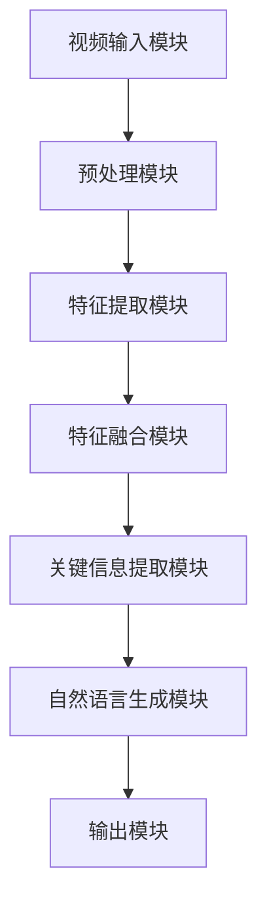

# 提高AI模型在视频内容摘要生成任务中的质量

> 关键词：AI模型、视频内容摘要生成、质量提升、深度学习、特征提取、自然语言处理

> 摘要：本文围绕提高AI模型在视频内容摘要生成任务中的质量展开深入探讨。首先介绍了该任务的背景，包括目的、预期读者、文档结构等内容。接着阐述了相关核心概念及其联系，详细讲解了核心算法原理和具体操作步骤，并给出相应的Python代码示例。通过数学模型和公式进一步剖析其理论基础，并举例说明。在项目实战部分，给出了开发环境搭建、源代码实现及解读。探讨了实际应用场景，推荐了学习资源、开发工具框架和相关论文著作。最后总结未来发展趋势与挑战，提供常见问题解答及扩展阅读参考资料，旨在为研究者和开发者提供全面且深入的技术指导，助力提升视频内容摘要生成的质量。

## 1. 背景介绍 
### 1.1 目的和范围
随着互联网的飞速发展，视频内容呈爆炸式增长。大量的视频信息给用户获取关键信息带来了极大的困扰，因此视频内容摘要生成技术应运而生。本文章的目的在于深入研究如何提高AI模型在视频内容摘要生成任务中的质量，以生成更准确、更全面且更具可读性的视频摘要。范围涵盖了从核心概念、算法原理到项目实战等多个方面，全面探讨提升质量的方法和策略。

### 1.2 预期读者
本文预期读者包括对人工智能、视频处理、自然语言处理等领域感兴趣的研究人员、开发者、学生，以及从事相关技术应用和产品开发的专业人士。希望通过本文的阐述，能为他们在视频内容摘要生成领域的研究和实践提供有价值的参考。

### 1.3 文档结构概述
本文将按照以下结构展开：首先介绍背景知识，包括目的、读者和文档结构等；接着阐述核心概念与联系，使读者对相关技术有初步的理论认识；然后详细讲解核心算法原理和具体操作步骤，并给出Python代码示例；通过数学模型和公式进一步分析其理论基础；在项目实战部分，给出开发环境搭建、源代码实现及解读；探讨实际应用场景；推荐学习资源、开发工具框架和相关论文著作；最后总结未来发展趋势与挑战，提供常见问题解答及扩展阅读参考资料。

### 1.4 术语表
#### 1.4.1 核心术语定义
- **AI模型**：即人工智能模型，是基于机器学习、深度学习等技术构建的算法模型，用于模拟人类智能完成各种任务，如视频内容摘要生成。
- **视频内容摘要生成**：指通过AI技术对视频内容进行分析和处理，提取关键信息，生成简洁、准确的文本摘要，以帮助用户快速了解视频的主要内容。
- **特征提取**：从视频数据中提取具有代表性的信息，如视觉特征、音频特征等，用于后续的分析和处理。
- **自然语言处理（NLP）**：研究如何让计算机理解、处理和生成人类语言的技术，在视频内容摘要生成中用于将提取的视频信息转化为自然语言文本。

#### 1.4.2 相关概念解释
- **深度学习**：是机器学习的一个分支，通过构建多层神经网络来学习数据的复杂特征和模式。在视频内容摘要生成中，深度学习模型可以自动从视频中提取高级特征，提高摘要生成的质量。
- **多模态融合**：指将来自不同模态（如视觉、音频、文本）的数据进行融合处理，以获取更全面、准确的信息。在视频内容摘要生成中，多模态融合可以结合视频的视觉和音频信息，生成更丰富的摘要。

#### 1.4.3 缩略词列表
- **CNN**：卷积神经网络（Convolutional Neural Network），用于图像和视频的特征提取。
- **RNN**：循环神经网络（Recurrent Neural Network），用于处理序列数据，如文本。
- **LSTM**：长短期记忆网络（Long Short-Term Memory），是RNN的一种变体，能够有效处理长序列数据。
- **NLP**：自然语言处理（Natural Language Processing）。

## 2. 核心概念与联系 

### 核心概念原理
视频内容摘要生成主要涉及到视频处理、特征提取、自然语言处理等多个领域的技术。其基本原理是首先对视频进行预处理，包括视频解码、帧率调整等操作；然后从视频中提取视觉、音频等特征；接着将这些特征进行融合和分析，提取关键信息；最后通过自然语言处理技术将关键信息转化为自然语言文本，生成视频摘要。

### 架构的文本示意图
视频内容摘要生成系统主要由以下几个部分组成：
1. **视频输入模块**：负责接收视频数据。
2. **预处理模块**：对视频进行解码、帧率调整等预处理操作。
3. **特征提取模块**：从视频中提取视觉、音频等特征。
4. **特征融合模块**：将提取的不同模态的特征进行融合。
5. **关键信息提取模块**：对融合后的特征进行分析，提取关键信息。
6. **自然语言生成模块**：将关键信息转化为自然语言文本，生成视频摘要。
7. **输出模块**：输出生成的视频摘要。

### Mermaid流程图


## 3. 核心算法原理 & 具体操作步骤 

### 核心算法原理
视频内容摘要生成的核心算法主要包括特征提取算法和自然语言生成算法。在特征提取方面，常用的算法有卷积神经网络（CNN）用于提取视觉特征，循环神经网络（RNN）及其变体（如LSTM）用于处理音频和文本序列数据。在自然语言生成方面，常用的算法有基于注意力机制的序列到序列模型。

### 具体操作步骤
1. **视频预处理**：使用FFmpeg等工具对视频进行解码，将视频转换为图像帧序列和音频序列。
2. **视觉特征提取**：使用预训练的CNN模型（如ResNet、VGG等）对图像帧进行特征提取。
3. **音频特征提取**：使用MFCC（Mel频率倒谱系数）等方法对音频序列进行特征提取。
4. **特征融合**：将视觉特征和音频特征进行融合，可以使用简单的拼接方法或更复杂的融合网络。
5. **关键信息提取**：使用LSTM等模型对融合后的特征进行处理，提取关键信息。
6. **自然语言生成**：使用基于注意力机制的序列到序列模型将关键信息转换为自然语言文本。

### Python源代码详细阐述
以下是一个简单的视频内容摘要生成的Python代码示例，使用了PyTorch深度学习框架：

```python
import torch
import torch.nn as nn
import torchvision.models as models
import librosa
import numpy as np

# 视觉特征提取模型
class VisualFeatureExtractor(nn.Module):
    def __init__(self):
        super(VisualFeatureExtractor, self).__init__()
        self.resnet = models.resnet18(pretrained=True)
        self.resnet.fc = nn.Identity()  # 去掉最后一层全连接层

    def forward(self, images):
        features = self.resnet(images)
        return features

# 音频特征提取函数
def extract_audio_features(audio_path):
    audio, sr = librosa.load(audio_path)
    mfccs = librosa.feature.mfcc(y=audio, sr=sr)
    return mfccs

# 特征融合函数
def fuse_features(visual_features, audio_features):
    # 简单的拼接方法
    fused_features = torch.cat((visual_features, torch.from_numpy(audio_features).float()), dim=1)
    return fused_features

# 关键信息提取模型
class KeyInfoExtractor(nn.Module):
    def __init__(self, input_size, hidden_size):
        super(KeyInfoExtractor, self).__init__()
        self.lstm = nn.LSTM(input_size, hidden_size, batch_first=True)

    def forward(self, fused_features):
        output, _ = self.lstm(fused_features)
        return output

# 自然语言生成模型（简单示例）
class NaturalLanguageGenerator(nn.Module):
    def __init__(self, input_size, vocab_size):
        super(NaturalLanguageGenerator, self).__init__()
        self.fc = nn.Linear(input_size, vocab_size)

    def forward(self, key_info):
        output = self.fc(key_info)
        return output

# 主函数
def main():
    # 初始化模型
    visual_extractor = VisualFeatureExtractor()
    audio_features = extract_audio_features('audio.wav')
    # 模拟视觉特征
    visual_features = torch.randn(1, 512)
    fused_features = fuse_features(visual_features, audio_features)
    key_info_extractor = KeyInfoExtractor(input_size=fused_features.shape[1], hidden_size=256)
    key_info = key_info_extractor(fused_features.unsqueeze(0))
    vocab_size = 1000
    language_generator = NaturalLanguageGenerator(input_size=256, vocab_size=vocab_size)
    output = language_generator(key_info)
    print(output.shape)

if __name__ == "__main__":
    main()
```

## 4. 数学模型和公式 & 详细讲解 & 举例说明 

### 视觉特征提取的数学模型
在使用卷积神经网络（CNN）进行视觉特征提取时，主要涉及到卷积运算和池化运算。

#### 卷积运算
卷积运算的数学公式为：
$$y_{i,j} = \sum_{m=0}^{M-1} \sum_{n=0}^{N-1} x_{i+m,j+n} \cdot w_{m,n} + b$$
其中，$x$ 是输入图像，$w$ 是卷积核，$b$ 是偏置，$y$ 是卷积输出。

#### 池化运算
常用的池化运算有最大池化和平均池化。以最大池化为例，其数学公式为：
$$y_{i,j} = \max_{m=0}^{M-1} \max_{n=0}^{N-1} x_{i \cdot s + m,j \cdot s + n}$$
其中，$s$ 是池化步长。

### 音频特征提取的数学模型
MFCC（Mel频率倒谱系数）是一种常用的音频特征提取方法，其主要步骤包括：
1. **预加重**：对音频信号进行高通滤波，增强高频成分。
2. **分帧**：将音频信号分成若干帧。
3. **加窗**：对每一帧信号加窗，减少频谱泄漏。
4. **快速傅里叶变换（FFT）**：将时域信号转换为频域信号。
5. **Mel滤波**：使用Mel滤波器组对频域信号进行滤波。
6. **对数运算**：对滤波后的信号取对数。
7. **离散余弦变换（DCT）**：将对数信号进行离散余弦变换，得到MFCC系数。

### 特征融合的数学模型
特征融合可以使用简单的拼接方法，即将视觉特征和音频特征按维度拼接在一起。假设视觉特征为 $\mathbf{v} \in \mathbb{R}^{d_v}$，音频特征为 $\mathbf{a} \in \mathbb{R}^{d_a}$，则融合后的特征为 $\mathbf{f} = [\mathbf{v}, \mathbf{a}] \in \mathbb{R}^{d_v + d_a}$。

### 关键信息提取的数学模型
在使用LSTM进行关键信息提取时，LSTM的数学公式为：
$$\begin{cases}
\mathbf{i}_t = \sigma(\mathbf{W}_{ii} \mathbf{x}_t + \mathbf{W}_{hi} \mathbf{h}_{t-1} + \mathbf{b}_i) \\
\mathbf{f}_t = \sigma(\mathbf{W}_{if} \mathbf{x}_t + \mathbf{W}_{hf} \mathbf{h}_{t-1} + \mathbf{b}_f) \\
\mathbf{g}_t = \tanh(\mathbf{W}_{ig} \mathbf{x}_t + \mathbf{W}_{hg} \mathbf{h}_{t-1} + \mathbf{b}_g) \\
\mathbf{o}_t = \sigma(\mathbf{W}_{io} \mathbf{x}_t + \mathbf{W}_{ho} \mathbf{h}_{t-1} + \mathbf{b}_o) \\
\mathbf{c}_t = \mathbf{f}_t \odot \mathbf{c}_{t-1} + \mathbf{i}_t \odot \mathbf{g}_t \\
\mathbf{h}_t = \mathbf{o}_t \odot \tanh(\mathbf{c}_t)
\end{cases}$$
其中，$\mathbf{i}_t$、$\mathbf{f}_t$、$\mathbf{o}_t$ 分别是输入门、遗忘门、输出门，$\mathbf{g}_t$ 是候选记忆单元，$\mathbf{c}_t$ 是细胞状态，$\mathbf{h}_t$ 是隐藏状态，$\sigma$ 是sigmoid函数，$\tanh$ 是双曲正切函数，$\odot$ 是逐元素相乘。

### 自然语言生成的数学模型
基于注意力机制的序列到序列模型是一种常用的自然语言生成模型。其主要思想是通过注意力机制动态地选择输入序列中的相关信息，生成输出序列。具体的数学公式较为复杂，这里不详细展开。

### 举例说明
假设我们有一个视频，包含图像帧和音频信息。我们使用ResNet18模型对图像帧进行视觉特征提取，得到一个维度为512的特征向量。同时，使用MFCC方法对音频信息进行特征提取，得到一个维度为128的特征向量。然后，将这两个特征向量按维度拼接在一起，得到一个维度为640的融合特征向量。接着，使用LSTM模型对融合特征向量进行处理，提取关键信息。最后，使用基于注意力机制的序列到序列模型将关键信息转换为自然语言文本，生成视频摘要。

## 5. 项目实战：代码实际案例和详细解释说明 

### 5.1  开发环境搭建
#### 操作系统
推荐使用Ubuntu 18.04或更高版本，也可以使用Windows 10或macOS。

#### 编程语言
使用Python 3.7或更高版本。

#### 深度学习框架
使用PyTorch深度学习框架，可以通过以下命令安装：
```sh
pip install torch torchvision
```

#### 其他依赖库
安装FFmpeg用于视频处理，安装librosa用于音频处理，可以通过以下命令安装：
```sh
sudo apt-get install ffmpeg
pip install librosa
```

### 5.2  源代码详细实现和代码解读
以下是一个更完整的视频内容摘要生成的Python代码示例：

```python
import torch
import torch.nn as nn
import torchvision.models as models
import librosa
import numpy as np
import cv2
import os

# 视觉特征提取模型
class VisualFeatureExtractor(nn.Module):
    def __init__(self):
        super(VisualFeatureExtractor, self).__init__()
        self.resnet = models.resnet18(pretrained=True)
        self.resnet.fc = nn.Identity()  # 去掉最后一层全连接层

    def forward(self, images):
        features = self.resnet(images)
        return features

# 音频特征提取函数
def extract_audio_features(audio_path):
    audio, sr = librosa.load(audio_path)
    mfccs = librosa.feature.mfcc(y=audio, sr=sr)
    mfccs = np.mean(mfccs, axis=1)  # 简单的特征聚合
    return mfccs

# 视频帧提取函数
def extract_video_frames(video_path):
    cap = cv2.VideoCapture(video_path)
    frames = []
    while cap.isOpened():
        ret, frame = cap.read()
        if not ret:
            break
        frame = cv2.resize(frame, (224, 224))
        frame = frame.transpose(2, 0, 1)  # 调整维度
        frames.append(frame)
    cap.release()
    frames = np.array(frames)
    frames = torch.from_numpy(frames).float() / 255.0  # 归一化
    return frames

# 特征融合函数
def fuse_features(visual_features, audio_features):
    # 简单的拼接方法
    audio_features = np.tile(audio_features, (visual_features.shape[0], 1))
    audio_features = torch.from_numpy(audio_features).float()
    fused_features = torch.cat((visual_features, audio_features), dim=1)
    return fused_features

# 关键信息提取模型
class KeyInfoExtractor(nn.Module):
    def __init__(self, input_size, hidden_size):
        super(KeyInfoExtractor, self).__init__()
        self.lstm = nn.LSTM(input_size, hidden_size, batch_first=True)

    def forward(self, fused_features):
        output, _ = self.lstm(fused_features)
        return output

# 自然语言生成模型（简单示例）
class NaturalLanguageGenerator(nn.Module):
    def __init__(self, input_size, vocab_size):
        super(NaturalLanguageGenerator, self).__init__()
        self.fc = nn.Linear(input_size, vocab_size)

    def forward(self, key_info):
        output = self.fc(key_info)
        return output

# 主函数
def main():
    video_path = 'video.mp4'
    audio_path = 'audio.wav'
    # 提取视频帧
    frames = extract_video_frames(video_path)
    # 提取视觉特征
    visual_extractor = VisualFeatureExtractor()
    visual_features = visual_extractor(frames)
    visual_features = visual_features.view(visual_features.shape[0], -1)
    # 提取音频特征
    audio_features = extract_audio_features(audio_path)
    # 特征融合
    fused_features = fuse_features(visual_features, audio_features)
    # 关键信息提取
    key_info_extractor = KeyInfoExtractor(input_size=fused_features.shape[1], hidden_size=256)
    key_info = key_info_extractor(fused_features.unsqueeze(0))
    # 自然语言生成
    vocab_size = 1000
    language_generator = NaturalLanguageGenerator(input_size=256, vocab_size=vocab_size)
    output = language_generator(key_info)
    print(output.shape)

if __name__ == "__main__":
    main()
```

### 5.3  代码解读与分析
1. **VisualFeatureExtractor类**：使用预训练的ResNet18模型进行视觉特征提取，去掉最后一层全连接层，得到图像的特征向量。
2. **extract_audio_features函数**：使用librosa库提取音频的MFCC特征，并进行简单的特征聚合。
3. **extract_video_frames函数**：使用OpenCV库提取视频的帧，并进行尺寸调整和归一化处理。
4. **fuse_features函数**：将视觉特征和音频特征进行拼接，得到融合后的特征向量。
5. **KeyInfoExtractor类**：使用LSTM模型对融合后的特征向量进行处理，提取关键信息。
6. **NaturalLanguageGenerator类**：使用全连接层将关键信息转换为自然语言文本的概率分布。
7. **main函数**：调用上述函数和类，完成视频内容摘要生成的整个流程。

## 6. 实际应用场景 
### 视频内容推荐
在视频平台中，通过生成视频内容摘要，可以帮助用户快速了解视频的主要内容，从而提高用户的视频浏览效率和点击率。例如，YouTube等视频平台可以在视频列表中显示视频的摘要信息，让用户快速筛选感兴趣的视频。

### 视频内容审核
在视频内容审核过程中，生成视频内容摘要可以帮助审核人员快速了解视频的主题和关键信息，提高审核效率。例如，社交媒体平台可以使用视频内容摘要生成技术对用户上传的视频进行初步审核，筛选出违规视频。

### 视频内容检索
在视频检索系统中，视频内容摘要可以作为视频的文本描述，用于文本检索。用户可以通过输入关键词搜索相关视频，系统可以根据视频内容摘要进行匹配和排序。例如，百度视频等搜索引擎可以使用视频内容摘要生成技术提高视频检索的准确性和效率。

### 辅助视障人士
对于视障人士来说，视频内容摘要可以将视频信息转换为文本信息，通过语音合成技术朗读给视障人士听，帮助他们了解视频的内容。例如，一些无障碍视频平台可以使用视频内容摘要生成技术为视障人士提供服务。

## 7. 工具和资源推荐
### 7.1 学习资源推荐
#### 7.1.1 书籍推荐
- 《深度学习》（Deep Learning）：由Ian Goodfellow、Yoshua Bengio和Aaron Courville所著，是深度学习领域的经典教材，涵盖了深度学习的基本原理、算法和应用。
- 《Python深度学习》（Deep Learning with Python）：由Francois Chollet所著，以Keras深度学习框架为例，介绍了深度学习的基本概念和实践方法。
- 《自然语言处理入门》（Natural Language Processing with Python）：由Steven Bird、Ewan Klein和Edward Loper所著，介绍了自然语言处理的基本技术和方法。

#### 7.1.2 在线课程
- Coursera上的“深度学习专项课程”（Deep Learning Specialization）：由Andrew Ng教授授课，涵盖了深度学习的各个方面，包括神经网络、卷积神经网络、循环神经网络等。
- edX上的“自然语言处理”（Natural Language Processing）：由哥伦比亚大学的教授授课，介绍了自然语言处理的基本技术和应用。
- 哔哩哔哩（Bilibili）上的相关AI课程：有很多博主分享了关于深度学习、自然语言处理等方面的课程，内容丰富多样。

#### 7.1.3 技术博客和网站
- arXiv：是一个预印本论文平台，提供了大量关于人工智能、机器学习等领域的最新研究成果。
- Medium：有很多技术博主分享关于AI、深度学习等方面的技术文章和经验。
- 机器之心：专注于人工智能领域的资讯和技术分享，提供了很多有价值的技术文章和案例分析。

### 7.2 开发工具框架推荐
#### 7.2.1 IDE和编辑器
- PyCharm：是一款专门为Python开发设计的集成开发环境（IDE），提供了丰富的功能和插件，方便开发和调试Python代码。
- Jupyter Notebook：是一个交互式的开发环境，适合进行数据分析、模型训练和可视化等工作。
- Visual Studio Code：是一款轻量级的代码编辑器，支持多种编程语言和插件，可用于Python开发。

#### 7.2.2 调试和性能分析工具
- TensorBoard：是TensorFlow提供的可视化工具，可用于可视化模型训练过程中的损失函数、准确率等指标。
- PyTorch Profiler：是PyTorch提供的性能分析工具，可用于分析模型的性能瓶颈和资源使用情况。
- cProfile：是Python标准库中的性能分析工具，可用于分析Python代码的执行时间和函数调用关系。

#### 7.2.3 相关框架和库
- PyTorch：是一个开源的深度学习框架，提供了丰富的神经网络模块和工具，支持GPU加速。
- TensorFlow：是另一个流行的深度学习框架，具有广泛的应用和丰富的社区资源。
- OpenCV：是一个开源的计算机视觉库，提供了各种图像处理和计算机视觉算法，可用于视频处理和视觉特征提取。
- librosa：是一个用于音频处理的Python库，提供了各种音频特征提取和处理方法。

### 7.3 相关论文著作推荐
#### 7.3.1 经典论文
- “ImageNet Classification with Deep Convolutional Neural Networks”：由Alex Krizhevsky、Ilya Sutskever和Geoffrey Hinton发表，介绍了AlexNet卷积神经网络，开启了深度学习在计算机视觉领域的应用。
- “Long Short-Term Memory”：由Sepp Hochreiter和Jürgen Schmidhuber发表，介绍了长短期记忆网络（LSTM），解决了传统循环神经网络的梯度消失问题。
- “Attention Is All You Need”：由Ashish Vaswani等人发表，介绍了Transformer模型，提出了注意力机制，在自然语言处理领域取得了巨大成功。

#### 7.3.2 最新研究成果
- 关注arXiv上关于视频内容摘要生成、多模态学习等领域的最新论文，了解最新的研究进展和技术方法。
- 参加相关的学术会议，如CVPR（计算机视觉与模式识别会议）、ICML（国际机器学习会议）、ACL（计算语言学协会年会）等，获取最新的研究成果和学术动态。

#### 7.3.3 应用案例分析
- 分析一些知名视频平台（如YouTube、抖音等）的视频内容摘要生成技术和应用案例，了解实际应用中的技术挑战和解决方案。
- 研究一些相关的开源项目，如OpenAI的GPT系列、Hugging Face的Transformers库等，学习其实现原理和应用方法。

## 8. 总结：未来发展趋势与挑战
### 未来发展趋势
1. **多模态融合技术的发展**：未来的视频内容摘要生成将更加注重多模态信息的融合，不仅包括视觉和音频信息，还可能包括文本、传感器数据等。通过融合多种模态的信息，可以生成更全面、准确的视频摘要。
2. **基于深度学习的端到端模型**：随着深度学习技术的不断发展，将出现更多基于深度学习的端到端模型，直接从视频输入生成自然语言摘要，避免了传统方法中多个模块的独立训练和优化。
3. **个性化摘要生成**：根据用户的兴趣、偏好和历史行为，生成个性化的视频摘要，提高用户体验和满意度。
4. **实时摘要生成**：在实时视频流处理中，实现实时的视频内容摘要生成，满足用户对实时信息的需求。

### 挑战
1. **多模态数据的处理和融合**：多模态数据的特点和分布不同，如何有效地处理和融合这些数据是一个挑战。需要研究更高效的多模态融合算法和模型。
2. **语义理解和表达**：视频内容摘要生成需要对视频的语义信息进行理解和表达，如何准确地捕捉视频中的语义信息，并将其转换为自然语言文本是一个难题。
3. **计算资源和效率**：深度学习模型通常需要大量的计算资源和时间进行训练和推理，如何在有限的计算资源下提高模型的效率和性能是一个挑战。
4. **数据标注和质量**：高质量的标注数据是训练模型的基础，但是视频数据的标注成本高、难度大，如何获取足够的高质量标注数据是一个挑战。

## 9. 附录：常见问题与解答
### 问题1：视频内容摘要生成的准确率如何提高？
答：可以从以下几个方面提高准确率：1. 采用更先进的特征提取算法和模型，如使用更强大的卷积神经网络和循环神经网络；2. 加强多模态信息的融合，充分利用视频的视觉、音频等信息；3. 增加训练数据的数量和质量，提高模型的泛化能力；4. 优化自然语言生成模型，提高生成文本的准确性和流畅性。

### 问题2：如何处理不同格式和分辨率的视频？
答：在视频预处理阶段，可以使用FFmpeg等工具将不同格式的视频转换为统一的格式，如MP4。对于不同分辨率的视频，可以进行尺寸调整，将视频帧统一调整为固定的分辨率，如224x224。

### 问题3：视频内容摘要生成的速度如何提高？
答：可以采用以下方法提高速度：1. 使用GPU加速，利用GPU的并行计算能力加快模型的训练和推理速度；2. 优化模型结构，减少模型的参数数量和计算量；3. 采用异步处理和并行计算技术，提高数据处理和模型推理的效率。

### 问题4：如何处理视频中的噪声和干扰？
答：在视频预处理阶段，可以采用滤波、降噪等方法去除视频中的噪声和干扰。对于音频信号，可以使用音频处理技术进行降噪处理。在特征提取阶段，可以采用鲁棒的特征提取算法，减少噪声和干扰对特征提取的影响。

## 10. 扩展阅读 & 参考资料
### 扩展阅读
- 阅读更多关于深度学习、自然语言处理、计算机视觉等领域的专业书籍和论文，深入了解相关技术和方法。
- 关注相关的技术博客和论坛，了解行业动态和最新技术趋势。
- 参与开源项目，学习和实践优秀的代码和算法。

### 参考资料
1. Goodfellow, I., Bengio, Y., & Courville, A. (2016). Deep Learning. MIT Press.
2. Chollet, F. (2018). Deep Learning with Python. Manning Publications.
3. Bird, S., Klein, E., & Loper, E. (2009). Natural Language Processing with Python. O'Reilly Media.
4. Krizhevsky, A., Sutskever, I., & Hinton, G. E. (2012). ImageNet Classification with Deep Convolutional Neural Networks. Advances in Neural Information Processing Systems.
5. Hochreiter, S., & Schmidhuber, J. (1997). Long Short-Term Memory. Neural Computation.
6. Vaswani, A., Shazeer, N., Parmar, N., Uszkoreit, J., Jones, L., Gomez, A. N., ... & Polosukhin, I. (2017). Attention Is All You Need. Advances in Neural Information Processing Systems.