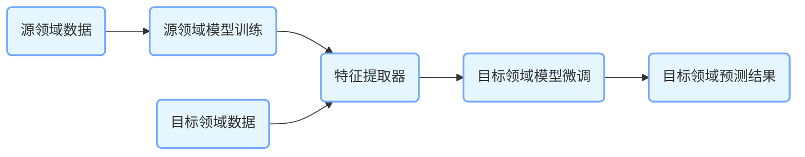

# 提高AI模型在跨领域知识迁移中的效果

> 关键词：AI模型、跨领域知识迁移、迁移学习、效果提升、领域适应

> 摘要：本文聚焦于提高AI模型在跨领域知识迁移中的效果这一重要课题。首先介绍了该研究的背景、目的、预期读者、文档结构及相关术语。接着阐述了跨领域知识迁移的核心概念与联系，包括原理和架构，并给出了相应的示意图和流程图。详细讲解了核心算法原理，结合Python源代码进行说明，同时介绍了相关的数学模型和公式，并举例阐释。通过项目实战，展示了开发环境搭建、源代码实现及代码解读。探讨了AI模型跨领域知识迁移的实际应用场景，推荐了学习资源、开发工具框架以及相关论文著作。最后总结了未来发展趋势与挑战，提供了常见问题解答和扩展阅读参考资料，旨在为研究和应用AI模型跨领域知识迁移提供全面而深入的指导。

## 1. 背景介绍 
### 1.1 目的和范围
在当今人工智能快速发展的时代，AI模型在各个领域都有广泛的应用。然而，不同领域的数据分布和特征存在显著差异，使得模型在一个领域训练后直接应用到另一个领域时，性能往往会大幅下降。提高AI模型在跨领域知识迁移中的效果，旨在解决这一问题，让模型能够更高效地将在源领域学到的知识迁移到目标领域，减少目标领域标注数据的需求，降低训练成本，提高模型的泛化能力和适应性，从而拓展AI模型的应用范围。本文的范围涵盖了跨领域知识迁移的核心概念、算法原理、数学模型、实际案例以及相关的工具和资源等方面。

### 1.2 预期读者
本文预期读者包括人工智能领域的研究人员、开发者、数据科学家、机器学习工程师以及对跨领域知识迁移感兴趣的技术爱好者。研究人员可以从本文中获取最新的研究思路和方法，开发者和工程师能够学习到实际的代码实现和应用技巧，技术爱好者可以了解跨领域知识迁移的基本原理和应用场景。

### 1.3 文档结构概述
本文共分为十个部分。第一部分是背景介绍，阐述了研究的目的、预期读者和文档结构。第二部分介绍核心概念与联系，包括跨领域知识迁移的原理和架构，并给出示意图和流程图。第三部分详细讲解核心算法原理，结合Python源代码进行说明。第四部分介绍数学模型和公式，并举例说明。第五部分通过项目实战，展示开发环境搭建、源代码实现及代码解读。第六部分探讨实际应用场景。第七部分推荐学习资源、开发工具框架以及相关论文著作。第八部分总结未来发展趋势与挑战。第九部分是附录，提供常见问题与解答。第十部分列出扩展阅读和参考资料。

### 1.4 术语表
#### 1.4.1 核心术语定义
- **跨领域知识迁移（Cross - domain knowledge transfer）**：指将在一个或多个源领域中学习到的知识应用到不同但相关的目标领域中，以提高目标领域模型的性能。
- **源领域（Source domain）**：是指模型已经学习到丰富知识的领域，通常有大量的标注数据。
- **目标领域（Target domain）**：是指模型需要应用知识的新领域，可能只有少量或没有标注数据。
- **迁移学习（Transfer learning）**：是实现跨领域知识迁移的一种技术，通过利用源领域和目标领域之间的相似性，将源领域的知识迁移到目标领域。

#### 1.4.2 相关概念解释
- **领域适应（Domain adaptation）**：是迁移学习的一种特殊形式，主要关注如何调整源领域模型以适应目标领域的数据分布差异。
- **特征表示学习（Feature representation learning）**：旨在学习数据的有效特征表示，使得源领域和目标领域的数据在特征空间中具有更好的可迁移性。

#### 1.4.3 缩略词列表
- **CNN（Convolutional Neural Network）**：卷积神经网络
- **DNN（Deep Neural Network）**：深度神经网络
- **GAN（Generative Adversarial Network）**：生成对抗网络

## 2. 核心概念与联系 
### 核心概念原理
跨领域知识迁移的核心原理是利用源领域和目标领域之间的相似性，将源领域中学习到的有用知识迁移到目标领域。这些知识可以是模型的参数、特征表示、结构等。其基本思想是，虽然不同领域的数据分布存在差异，但它们可能共享一些底层的特征或模式。通过挖掘这些共享信息，可以在目标领域中更快地训练出性能良好的模型。

例如，在图像识别任务中，源领域可能是自然图像的分类，目标领域是医学图像的分类。虽然两种图像的数据分布不同，但它们都包含一些基本的视觉特征，如边缘、纹理等。跨领域知识迁移就是要找到这些共享特征，并将其应用到目标领域的模型训练中。

### 架构的文本示意图
以下是一个简单的跨领域知识迁移架构示意图：

源领域数据 -> 源领域模型训练 -> 特征提取器（学习共享特征） -> 目标领域数据 -> 目标领域模型微调 -> 目标领域预测结果

在这个架构中，首先在源领域数据上训练一个模型，得到一个特征提取器。这个特征提取器能够学习到源领域和目标领域共享的特征。然后，将目标领域的数据输入到特征提取器中，提取特征。最后，在提取的特征上微调目标领域的模型，得到最终的预测结果。

### Mermaid流程图


## 3. 核心算法原理 & 具体操作步骤 
### 核心算法原理
#### 基于对抗训练的领域适应算法
基于对抗训练的领域适应算法是一种常用的跨领域知识迁移方法，其核心思想是通过对抗训练来学习领域无关的特征表示。具体来说，该算法引入一个领域判别器，用于区分特征是来自源领域还是目标领域。同时，训练一个特征提取器，使得它能够生成让领域判别器难以区分来源的特征。

### Python源代码实现
```python
import torch
import torch.nn as nn
import torch.optim as optim

# 定义特征提取器
class FeatureExtractor(nn.Module):
    def __init__(self):
        super(FeatureExtractor, self).__init__()
        self.conv1 = nn.Conv2d(3, 64, kernel_size=3, padding=1)
        self.relu1 = nn.ReLU()
        self.pool1 = nn.MaxPool2d(2)
        self.conv2 = nn.Conv2d(64, 128, kernel_size=3, padding=1)
        self.relu2 = nn.ReLU()
        self.pool2 = nn.MaxPool2d(2)

    def forward(self, x):
        x = self.pool1(self.relu1(self.conv1(x)))
        x = self.pool2(self.relu2(self.conv2(x)))
        return x

# 定义领域判别器
class DomainDiscriminator(nn.Module):
    def __init__(self):
        super(DomainDiscriminator, self).__init__()
        self.fc1 = nn.Linear(128 * 8 * 8, 1024)
        self.relu1 = nn.ReLU()
        self.fc2 = nn.Linear(1024, 1)
        self.sigmoid = nn.Sigmoid()

    def forward(self, x):
        x = x.view(-1, 128 * 8 * 8)
        x = self.relu1(self.fc1(x))
        x = self.sigmoid(self.fc2(x))
        return x

# 定义分类器
class Classifier(nn.Module):
    def __init__(self):
        super(Classifier, self).__init__()
        self.fc1 = nn.Linear(128 * 8 * 8, 1024)
        self.relu1 = nn.ReLU()
        self.fc2 = nn.Linear(1024, 10)

    def forward(self, x):
        x = x.view(-1, 128 * 8 * 8)
        x = self.relu1(self.fc1(x))
        x = self.fc2(x)
        return x

# 初始化模型
feature_extractor = FeatureExtractor()
domain_discriminator = DomainDiscriminator()
classifier = Classifier()

# 定义优化器
optimizer_feature_extractor = optim.Adam(feature_extractor.parameters(), lr=0.001)
optimizer_domain_discriminator = optim.Adam(domain_discriminator.parameters(), lr=0.001)
optimizer_classifier = optim.Adam(classifier.parameters(), lr=0.001)

# 定义损失函数
criterion_domain = nn.BCELoss()
criterion_classification = nn.CrossEntropyLoss()

# 训练过程
num_epochs = 10
for epoch in range(num_epochs):
    # 假设 source_data 和 target_data 是源领域和目标领域的数据
    for source_batch, target_batch in zip(source_data_loader, target_data_loader):
        source_images, source_labels = source_batch
        target_images, _ = target_batch

        # 训练领域判别器
        optimizer_domain_discriminator.zero_grad()

        source_features = feature_extractor(source_images)
        target_features = feature_extractor(target_images)

        source_domain_labels = torch.ones(source_images.size(0), 1)
        target_domain_labels = torch.zeros(target_images.size(0), 1)

        source_domain_output = domain_discriminator(source_features)
        target_domain_output = domain_discriminator(target_features)

        domain_loss_source = criterion_domain(source_domain_output, source_domain_labels)
        domain_loss_target = criterion_domain(target_domain_output, target_domain_labels)
        domain_loss = domain_loss_source + domain_loss_target

        domain_loss.backward()
        optimizer_domain_discriminator.step()

        # 训练特征提取器和分类器
        optimizer_feature_extractor.zero_grad()
        optimizer_classifier.zero_grad()

        source_features = feature_extractor(source_images)
        source_class_output = classifier(source_features)
        classification_loss = criterion_classification(source_class_output, source_labels)

        source_features = feature_extractor(source_images)
        target_features = feature_extractor(target_images)

        source_domain_labels = torch.zeros(source_images.size(0), 1)
        target_domain_labels = torch.ones(target_images.size(0), 1)

        source_domain_output = domain_discriminator(source_features)
        target_domain_output = domain_discriminator(target_features)

        domain_loss_source = criterion_domain(source_domain_output, source_domain_labels)
        domain_loss_target = criterion_domain(target_domain_output, target_domain_labels)
        domain_loss = domain_loss_source + domain_loss_target

        total_loss = classification_loss + domain_loss
        total_loss.backward()
        optimizer_feature_extractor.step()
        optimizer_classifier.step()

    print(f'Epoch {epoch + 1}/{num_epochs}, Loss: {total_loss.item()}')
```

### 具体操作步骤
1. **数据准备**：收集源领域和目标领域的数据，并进行预处理，如归一化、裁剪等。
2. **模型初始化**：初始化特征提取器、领域判别器和分类器。
3. **训练领域判别器**：将源领域和目标领域的数据分别输入到特征提取器中，得到特征表示。然后将这些特征输入到领域判别器中，计算领域判别损失，并更新领域判别器的参数。
4. **训练特征提取器和分类器**：在源领域数据上计算分类损失，同时在源领域和目标领域数据上计算领域判别损失（此时领域判别器的标签反转）。将分类损失和领域判别损失相加，更新特征提取器和分类器的参数。
5. **重复步骤3和4**：多次迭代训练，直到模型收敛。

## 4. 数学模型和公式 & 详细讲解 & 举例说明 
### 数学模型和公式
#### 领域判别损失
领域判别损失用于训练领域判别器，使其能够准确区分特征是来自源领域还是目标领域。假设 $x_s$ 是源领域的特征，$x_t$ 是目标领域的特征，$D$ 是领域判别器，$y_s = 1$ 表示源领域标签，$y_t = 0$ 表示目标领域标签。则领域判别损失 $L_d$ 可以表示为：

$$L_d = -\frac{1}{n_s}\sum_{i = 1}^{n_s}\log(D(x_s^i)) - \frac{1}{n_t}\sum_{j = 1}^{n_t}\log(1 - D(x_t^j))$$

其中 $n_s$ 和 $n_t$ 分别是源领域和目标领域的样本数量。

#### 分类损失
分类损失用于训练分类器，使其能够对源领域的数据进行准确分类。假设 $f$ 是特征提取器，$C$ 是分类器，$x_s$ 是源领域的数据，$y_s$ 是源领域的真实标签。则分类损失 $L_c$ 可以表示为：

$$L_c = -\frac{1}{n_s}\sum_{i = 1}^{n_s}\log(C(f(x_s^i))_{y_s^i})$$

#### 总损失
总损失是分类损失和领域判别损失的加权和，用于训练特征提取器。假设 $\lambda$ 是领域判别损失的权重，则总损失 $L$ 可以表示为：

$$L = L_c+\lambda L_d$$

### 详细讲解
- **领域判别损失**：领域判别损失的目标是让领域判别器能够准确区分源领域和目标领域的特征。通过最大化源领域特征被判别为源领域的概率，以及最大化目标领域特征被判别为目标领域的概率，来训练领域判别器。
- **分类损失**：分类损失的目标是让分类器能够对源领域的数据进行准确分类。通过最小化分类器预测结果和真实标签之间的交叉熵损失，来训练分类器。
- **总损失**：总损失的目标是在保证分类器性能的同时，让特征提取器学习到领域无关的特征表示。通过调整领域判别损失的权重 $\lambda$，可以平衡分类损失和领域判别损失的影响。

### 举例说明
假设我们有一个源领域数据集 $S$ 包含 100 个样本，目标领域数据集 $T$ 包含 50 个样本。在某一次训练迭代中，领域判别器对源领域特征的预测结果为 $[0.9, 0.8, \cdots]$，对目标领域特征的预测结果为 $[0.1, 0.2, \cdots]$。分类器对源领域数据的预测结果为 $[0.1, 0.2, 0.7, \cdots]$，真实标签为 $[2, \cdots]$。则可以根据上述公式计算领域判别损失、分类损失和总损失。

## 5. 项目实战：代码实际案例和详细解释说明 
### 5.1  开发环境搭建
#### 安装Python
首先，确保你已经安装了Python 3.x 版本。可以从Python官方网站（https://www.python.org/downloads/） 下载并安装。

#### 安装深度学习框架
本项目使用PyTorch作为深度学习框架。可以使用以下命令安装PyTorch：
```sh
pip install torch torchvision
```

#### 安装其他依赖库
还需要安装一些其他的依赖库，如NumPy、Matplotlib等。可以使用以下命令安装：
```sh
pip install numpy matplotlib
```

### 5.2  源代码详细实现和代码解读
以下是完整的项目代码及详细解读：

```python
import torch
import torch.nn as nn
import torch.optim as optim
import torchvision
import torchvision.transforms as transforms

# 定义特征提取器
class FeatureExtractor(nn.Module):
    def __init__(self):
        super(FeatureExtractor, self).__init__()
        # 第一个卷积层，输入通道数为3，输出通道数为64，卷积核大小为3，填充为1
        self.conv1 = nn.Conv2d(3, 64, kernel_size=3, padding=1)
        self.relu1 = nn.ReLU()
        # 最大池化层，池化核大小为2
        self.pool1 = nn.MaxPool2d(2)
        # 第二个卷积层，输入通道数为64，输出通道数为128，卷积核大小为3，填充为1
        self.conv2 = nn.Conv2d(64, 128, kernel_size=3, padding=1)
        self.relu2 = nn.ReLU()
        self.pool2 = nn.MaxPool2d(2)

    def forward(self, x):
        # 前向传播过程
        x = self.pool1(self.relu1(self.conv1(x)))
        x = self.pool2(self.relu2(self.conv2(x)))
        return x

# 定义领域判别器
class DomainDiscriminator(nn.Module):
    def __init__(self):
        super(DomainDiscriminator, self).__init__()
        # 第一个全连接层，输入维度为128 * 8 * 8，输出维度为1024
        self.fc1 = nn.Linear(128 * 8 * 8, 1024)
        self.relu1 = nn.ReLU()
        # 第二个全连接层，输入维度为1024，输出维度为1
        self.fc2 = nn.Linear(1024, 1)
        self.sigmoid = nn.Sigmoid()

    def forward(self, x):
        # 将特征展平
        x = x.view(-1, 128 * 8 * 8)
        x = self.relu1(self.fc1(x))
        x = self.sigmoid(self.fc2(x))
        return x

# 定义分类器
class Classifier(nn.Module):
    def __init__(self):
        super(Classifier, self).__init__()
        # 第一个全连接层，输入维度为128 * 8 * 8，输出维度为1024
        self.fc1 = nn.Linear(128 * 8 * 8, 1024)
        self.relu1 = nn.ReLU()
        # 第二个全连接层，输入维度为1024，输出维度为10
        self.fc2 = nn.Linear(1024, 10)

    def forward(self, x):
        # 将特征展平
        x = x.view(-1, 128 * 8 * 8)
        x = self.relu1(self.fc1(x))
        x = self.fc2(x)
        return x

# 数据预处理
transform = transforms.Compose([
    transforms.Resize((32, 32)),
    transforms.ToTensor(),
    transforms.Normalize((0.5, 0.5, 0.5), (0.5, 0.5, 0.5))
])

# 加载源领域数据集（这里以CIFAR-10为例）
source_trainset = torchvision.datasets.CIFAR10(root='./data', train=True,
                                               download=True, transform=transform)
source_trainloader = torch.utils.data.DataLoader(source_trainset, batch_size=32,
                                                 shuffle=True, num_workers=2)

# 加载目标领域数据集（这里假设目标领域数据集与源领域数据集格式相同）
target_trainset = torchvision.datasets.CIFAR10(root='./data', train=False,
                                               download=True, transform=transform)
target_trainloader = torch.utils.data.DataLoader(target_trainset, batch_size=32,
                                                 shuffle=True, num_workers=2)

# 初始化模型
feature_extractor = FeatureExtractor()
domain_discriminator = DomainDiscriminator()
classifier = Classifier()

# 定义优化器
optimizer_feature_extractor = optim.Adam(feature_extractor.parameters(), lr=0.001)
optimizer_domain_discriminator = optim.Adam(domain_discriminator.parameters(), lr=0.001)
optimizer_classifier = optim.Adam(classifier.parameters(), lr=0.001)

# 定义损失函数
criterion_domain = nn.BCELoss()
criterion_classification = nn.CrossEntropyLoss()

# 训练过程
num_epochs = 10
for epoch in range(num_epochs):
    # 假设 source_data 和 target_data 是源领域和目标领域的数据
    for source_batch, target_batch in zip(source_trainloader, target_trainloader):
        source_images, source_labels = source_batch
        target_images, _ = target_batch

        # 训练领域判别器
        optimizer_domain_discriminator.zero_grad()

        source_features = feature_extractor(source_images)
        target_features = feature_extractor(target_images)

        source_domain_labels = torch.ones(source_images.size(0), 1)
        target_domain_labels = torch.zeros(target_images.size(0), 1)

        source_domain_output = domain_discriminator(source_features)
        target_domain_output = domain_discriminator(target_features)

        domain_loss_source = criterion_domain(source_domain_output, source_domain_labels)
        domain_loss_target = criterion_domain(target_domain_output, target_domain_labels)
        domain_loss = domain_loss_source + domain_loss_target

        domain_loss.backward()
        optimizer_domain_discriminator.step()

        # 训练特征提取器和分类器
        optimizer_feature_extractor.zero_grad()
        optimizer_classifier.zero_grad()

        source_features = feature_extractor(source_images)
        source_class_output = classifier(source_features)
        classification_loss = criterion_classification(source_class_output, source_labels)

        source_features = feature_extractor(source_images)
        target_features = feature_extractor(target_images)

        source_domain_labels = torch.zeros(source_images.size(0), 1)
        target_domain_labels = torch.ones(target_images.size(0), 1)

        source_domain_output = domain_discriminator(source_features)
        target_domain_output = domain_discriminator(target_features)

        domain_loss_source = criterion_domain(source_domain_output, source_domain_labels)
        domain_loss_target = criterion_domain(target_domain_output, target_domain_labels)
        domain_loss = domain_loss_source + domain_loss_target

        total_loss = classification_loss + domain_loss
        total_loss.backward()
        optimizer_feature_extractor.step()
        optimizer_classifier.step()

    print(f'Epoch {epoch + 1}/{num_epochs}, Loss: {total_loss.item()}')
```

### 5.3  代码解读与分析
#### 模型定义
- **FeatureExtractor**：特征提取器使用两个卷积层和两个最大池化层，用于提取图像的特征。
- **DomainDiscriminator**：领域判别器使用两个全连接层和一个Sigmoid激活函数，用于判断特征是来自源领域还是目标领域。
- **Classifier**：分类器使用两个全连接层，用于对源领域的数据进行分类。

#### 数据加载
使用 `torchvision.datasets.CIFAR10` 加载源领域和目标领域的数据集，并使用 `torch.utils.data.DataLoader` 进行数据加载。

#### 训练过程
- **训练领域判别器**：首先将源领域和目标领域的数据输入到特征提取器中，得到特征表示。然后将这些特征输入到领域判别器中，计算领域判别损失，并更新领域判别器的参数。
- **训练特征提取器和分类器**：在源领域数据上计算分类损失，同时在源领域和目标领域数据上计算领域判别损失（此时领域判别器的标签反转）。将分类损失和领域判别损失相加，更新特征提取器和分类器的参数。

#### 损失函数
- **BCELoss**：用于计算领域判别损失，因为领域判别是一个二分类问题。
- **CrossEntropyLoss**：用于计算分类损失，因为分类是一个多分类问题。

## 6. 实际应用场景 
### 图像识别
在图像识别领域，跨领域知识迁移可以将在自然图像上训练的模型应用到医学图像、卫星图像等其他领域。例如，医学图像的标注成本较高，通过将自然图像识别模型的知识迁移到医学图像识别中，可以减少医学图像标注的工作量，提高模型的训练效率和性能。

### 语音识别
在语音识别中，不同的语音场景（如安静环境、嘈杂环境）和不同的语言之间存在领域差异。通过跨领域知识迁移，可以将在一种语音场景或语言上训练的模型应用到其他场景或语言中，提高语音识别的泛化能力。

### 文本分类
在文本分类任务中，不同的文本领域（如新闻、社交媒体、学术论文）具有不同的语言风格和主题分布。跨领域知识迁移可以将在一个文本领域上训练的分类模型应用到其他领域，减少目标领域标注数据的需求。

### 机器人控制
在机器人控制中，机器人需要在不同的环境中执行任务，每个环境都可以看作一个不同的领域。通过跨领域知识迁移，机器人可以将在一个环境中学习到的控制策略应用到其他环境中，提高机器人的适应性和灵活性。

## 7. 工具和资源推荐
### 7.1 学习资源推荐
#### 7.1.1 书籍推荐
- 《深度学习》（Deep Learning）：由Ian Goodfellow、Yoshua Bengio和Aaron Courville合著，是深度学习领域的经典教材，涵盖了深度学习的基本原理、算法和应用。
- 《机器学习》（Machine Learning: A Probabilistic Perspective）：由Kevin P. Murphy所著，从概率的角度介绍了机器学习的基本概念和算法，对理解跨领域知识迁移的理论基础有很大帮助。

#### 7.1.2 在线课程
- Coursera上的“深度学习专项课程”（Deep Learning Specialization）：由Andrew Ng教授授课，包括神经网络和深度学习、改善深层神经网络、结构化机器学习项目等多个课程，系统地介绍了深度学习的知识和技能。
- edX上的“人工智能基础”（Foundations of Artificial Intelligence）：由UC Berkeley的教授授课，涵盖了人工智能的基本概念、算法和应用，对跨领域知识迁移有一定的涉及。

#### 7.1.3 技术博客和网站
- Medium上的AI相关博客：有很多AI领域的专家和研究者在Medium上分享他们的研究成果和实践经验，如Towards Data Science、AI in Plain English等。
- arXiv.org：是一个预印本平台，提供了大量的AI领域的研究论文，包括跨领域知识迁移的最新研究成果。

### 7.2 开发工具框架推荐
#### 7.2.1 IDE和编辑器
- PyCharm：是一款专门为Python开发设计的集成开发环境，具有代码编辑、调试、代码分析等功能，非常适合深度学习项目的开发。
- Jupyter Notebook：是一个交互式的开发环境，可以在浏览器中编写和运行代码，同时可以添加文本说明和可视化结果，方便进行实验和数据分析。

#### 7.2.2 调试和性能分析工具
- TensorBoard：是TensorFlow的可视化工具，可以用于可视化训练过程中的损失曲线、准确率曲线、模型结构等，帮助开发者调试和优化模型。
- PyTorch Profiler：是PyTorch的性能分析工具，可以分析模型的运行时间、内存使用情况等，帮助开发者找出性能瓶颈。

#### 7.2.3 相关框架和库
- PyTorch：是一个开源的深度学习框架，具有动态图的特点，易于使用和调试，广泛应用于跨领域知识迁移的研究和开发。
- TensorFlow：是另一个开源的深度学习框架，具有强大的分布式训练和部署能力，也有很多跨领域知识迁移的相关工具和模型。

### 7.3 相关论文著作推荐
#### 7.3.1 经典论文
- “Domain-Adversarial Training of Neural Networks”：提出了基于对抗训练的领域适应方法，是跨领域知识迁移领域的经典论文。
- “Unsupervised Domain Adaptation by Backpropagation”：提出了一种基于反向传播的无监督领域适应方法，对跨领域知识迁移的发展产生了重要影响。

#### 7.3.2 最新研究成果
可以通过arXiv.org、ACM Digital Library、IEEE Xplore等学术平台搜索跨领域知识迁移的最新研究论文，了解该领域的最新进展。

#### 7.3.3 应用案例分析
可以参考一些实际应用案例的论文，如医学图像识别、语音识别等领域的跨领域知识迁移应用案例，学习如何将理论方法应用到实际问题中。

## 8. 总结：未来发展趋势与挑战
### 未来发展趋势
#### 更复杂的领域适应方法
未来的研究将探索更复杂的领域适应方法，如多源领域适应、跨模态领域适应等。多源领域适应可以利用多个源领域的知识来提高目标领域的模型性能，跨模态领域适应可以在不同的模态（如图像、文本、语音）之间进行知识迁移。

#### 与其他技术的融合
跨领域知识迁移将与其他技术（如强化学习、生成对抗网络等）进行更深入的融合。例如，将强化学习与跨领域知识迁移相结合，可以让模型在不同的环境中自适应地学习和迁移知识。

#### 应用领域的拓展
跨领域知识迁移的应用领域将不断拓展，如在自动驾驶、智能家居、金融等领域的应用。随着这些领域数据的不断增加和需求的不断提高，跨领域知识迁移将发挥更大的作用。

### 挑战
#### 领域差异的度量和处理
如何准确地度量源领域和目标领域之间的差异，并有效地处理这些差异是一个挑战。不同领域的数据可能具有不同的分布、特征和语义，需要开发更有效的方法来进行领域适应。

#### 标注数据的稀缺性
在目标领域中，标注数据往往是稀缺的。如何在有限的标注数据下实现有效的知识迁移是一个关键问题。需要研究半监督学习、无监督学习等方法，以减少对标注数据的依赖。

#### 模型的可解释性
跨领域知识迁移模型的可解释性较差，难以理解模型是如何将源领域的知识迁移到目标领域的。提高模型的可解释性，对于实际应用中的决策和信任建立具有重要意义。

## 9. 附录：常见问题与解答
### 问题1：跨领域知识迁移和传统机器学习有什么区别？
传统机器学习通常假设训练数据和测试数据来自相同的分布，而跨领域知识迁移允许训练数据（源领域）和测试数据（目标领域）具有不同的分布。跨领域知识迁移通过利用源领域的知识来提高目标领域的模型性能，而传统机器学习主要关注在单一领域内的模型训练。

### 问题2：如何选择合适的源领域？
选择合适的源领域需要考虑源领域和目标领域之间的相似性。可以从数据的特征、语义、任务等方面进行评估。一般来说，源领域和目标领域在某些方面具有相似性，如视觉特征、语言模式等，这样才能更好地进行知识迁移。

### 问题3：跨领域知识迁移需要多少目标领域的标注数据？
这取决于具体的方法和应用场景。一些方法可以在少量标注数据下实现有效的知识迁移，而另一些方法可能需要更多的标注数据。在实际应用中，可以通过实验来确定最佳的标注数据量。

### 问题4：如何评估跨领域知识迁移的效果？
可以使用目标领域的测试数据来评估模型的性能，如准确率、召回率、F1值等。此外，还可以比较迁移前后模型的性能差异，以及与不进行迁移的模型进行对比。

## 10. 扩展阅读 & 参考资料
### 扩展阅读
- 《迁移学习简明手册》（A Concise Handbook of Transfer Learning）：对迁移学习的各种方法和应用进行了详细的介绍。
- 《深度学习实战》（Deep Learning in Practice）：通过实际案例介绍了深度学习在各个领域的应用，包括跨领域知识迁移。

### 参考资料
- Goodfellow, I., Bengio, Y., & Courville, A. (2016). Deep Learning. MIT Press.
- Murphy, K. P. (2012). Machine Learning: A Probabilistic Perspective. MIT Press.
- Ganin, Y., & Lempitsky, V. (2015). Domain-Adversarial Training of Neural Networks. Journal of Machine Learning Research.
- Tzeng, E., Hoffman, J., Saenko, K., & Darrell, T. (2014). Unsupervised Domain Adaptation by Backpropagation. arXiv preprint arXiv:1409.7495.