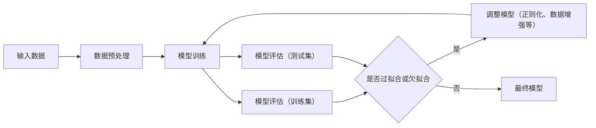

# 提高AI模型泛化能力的新方法探索

> 关键词：AI模型、泛化能力、新方法、正则化、数据增强

> 摘要：本文聚焦于提高AI模型泛化能力的新方法探索。首先介绍了相关背景，包括研究目的、预期读者、文档结构和术语表。接着阐述了核心概念与联系，分析了泛化能力的原理和相关架构。详细讲解了核心算法原理及具体操作步骤，使用Python代码进行示例。探讨了数学模型和公式，并举例说明。通过项目实战展示代码实际案例及详细解释。列举了实际应用场景，推荐了学习资源、开发工具框架和相关论文著作。最后总结了未来发展趋势与挑战，还提供了常见问题解答和扩展阅读参考资料，旨在为提升AI模型泛化能力提供全面的理论与实践指导。

## 1. 背景介绍 
### 1.1 目的和范围
在当今人工智能领域，AI模型的泛化能力至关重要。泛化能力指的是模型在未见过的数据上表现良好的能力。一个具有强泛化能力的模型能够准确地对新数据进行预测和分类，而不仅仅是在训练数据上表现出色。本研究的目的在于探索提高AI模型泛化能力的新方法，涵盖了从理论原理到实际应用的多个方面。范围涉及常见的AI模型，如神经网络、决策树等，以及不同的应用场景，包括图像识别、自然语言处理等。

### 1.2 预期读者
本文预期读者包括人工智能领域的研究人员、开发者、学生以及对AI技术感兴趣的爱好者。研究人员可以从新方法的探索中获取灵感，为进一步的学术研究提供方向；开发者能够将这些新方法应用到实际项目中，提升模型的性能；学生可以通过阅读本文加深对AI模型泛化能力的理解；而爱好者则可以了解该领域的前沿知识。

### 1.3 文档结构概述
本文将按照以下结构进行阐述。首先介绍背景知识，包括目的、读者和文档结构等。接着讲解核心概念与联系，通过文本示意图和Mermaid流程图展示泛化能力相关的原理和架构。然后详细说明核心算法原理和具体操作步骤，使用Python代码进行示例。之后探讨数学模型和公式，并举例说明。通过项目实战展示代码实际案例及详细解释。列举实际应用场景，推荐学习资源、开发工具框架和相关论文著作。最后总结未来发展趋势与挑战，提供常见问题解答和扩展阅读参考资料。

### 1.4 术语表
#### 1.4.1 核心术语定义
- **泛化能力**：AI模型在未见过的数据上进行准确预测和分类的能力。
- **过拟合**：模型在训练数据上表现很好，但在测试数据上表现不佳，即模型过于复杂，学习到了训练数据中的噪声和无关特征。
- **欠拟合**：模型过于简单，无法捕捉数据中的复杂模式，在训练数据和测试数据上的表现都不理想。
- **正则化**：一种通过限制模型复杂度来防止过拟合的技术。

#### 1.4.2 相关概念解释
- **数据增强**：通过对原始数据进行变换，如旋转、翻转、缩放等，生成新的数据样本，从而增加训练数据的多样性。
- **集成学习**：将多个弱模型组合成一个强模型的方法，通过综合多个模型的预测结果来提高泛化能力。

#### 1.4.3 缩略词列表
- **DNN**：深度神经网络（Deep Neural Network）
- **CNN**：卷积神经网络（Convolutional Neural Network）
- **RNN**：循环神经网络（Recurrent Neural Network）

## 2. 核心概念与联系 

### 泛化能力的原理
泛化能力的核心在于模型能够学习到数据的本质特征，而不是仅仅记忆训练数据。一个具有良好泛化能力的模型应该能够从训练数据中提取出通用的模式，并将这些模式应用到未见过的数据上。例如，在图像识别任务中，模型应该能够识别出不同角度、光照条件下的同一物体。

### 架构示意图
以下是一个简单的AI模型训练和泛化的文本示意图：

输入数据 -> 数据预处理 -> 模型训练 -> 模型评估（训练集） -> 模型评估（测试集） -> 调整模型（如正则化、数据增强） -> 最终模型

### Mermaid流程图


## 3. 核心算法原理 & 具体操作步骤 

### 正则化算法原理
正则化是一种常用的提高模型泛化能力的方法。常见的正则化方法包括L1正则化和L2正则化。

L1正则化的目标是在损失函数中添加模型参数的绝对值之和，公式如下：
$$J(\theta) = J_0(\theta) + \lambda\sum_{i=1}^{n}|\theta_i|$$
其中，$J_0(\theta)$ 是原始的损失函数，$\lambda$ 是正则化参数，$\theta_i$ 是模型的参数。

L2正则化的目标是在损失函数中添加模型参数的平方和，公式如下：
$$J(\theta) = J_0(\theta) + \lambda\sum_{i=1}^{n}\theta_i^2$$

### Python代码示例
```python
import numpy as np
from sklearn.linear_model import Ridge, Lasso
from sklearn.datasets import make_regression
from sklearn.model_selection import train_test_split

# 生成数据
X, y = make_regression(n_samples=100, n_features=10, noise=0.5, random_state=42)
X_train, X_test, y_train, y_test = train_test_split(X, y, test_size=0.2, random_state=42)

# L2正则化（Ridge回归）
ridge = Ridge(alpha=0.5)  # alpha 对应正则化参数 lambda
ridge.fit(X_train, y_train)
ridge_score = ridge.score(X_test, y_test)
print(f"Ridge regression score: {ridge_score}")

# L1正则化（Lasso回归）
lasso = Lasso(alpha=0.5)
lasso.fit(X_train, y_train)
lasso_score = lasso.score(X_test, y_test)
print(f"Lasso regression score: {lasso_score}")
```

### 具体操作步骤
1. 导入必要的库，如 `numpy`、`sklearn` 等。
2. 生成或加载数据，并将其划分为训练集和测试集。
3. 选择合适的正则化方法（L1或L2），并设置正则化参数。
4. 训练模型。
5. 在测试集上评估模型的性能。

## 4. 数学模型和公式 & 详细讲解 & 举例说明 

### 泛化误差的数学模型
泛化误差可以表示为：
$$E_{gen} = E_{in} + E_{bias} + E_{var}$$
其中，$E_{gen}$ 是泛化误差，$E_{in}$ 是训练误差，$E_{bias}$ 是偏差，$E_{var}$ 是方差。

偏差表示模型的预测值与真实值之间的系统性误差，通常是由于模型过于简单导致的。方差表示模型在不同训练数据集上的波动程度，通常是由于模型过于复杂导致的。

### 详细讲解
为了提高模型的泛化能力，我们需要同时降低偏差和方差。正则化可以通过限制模型的复杂度来降低方差，而增加模型的复杂度（如增加神经网络的层数和神经元数量）可以降低偏差。

### 举例说明
假设我们有一个简单的线性回归模型 $y = \theta_0 + \theta_1x$，其中 $\theta_0$ 和 $\theta_1$ 是模型的参数。如果数据实际上是一个二次函数 $y = ax^2 + bx + c$，那么使用线性回归模型就会导致较大的偏差，因为模型过于简单，无法捕捉数据的真实模式。

另一方面，如果我们使用一个非常复杂的神经网络来拟合这个简单的线性数据，模型可能会在训练数据上表现得非常好，但在测试数据上表现不佳，这是因为模型的方差过大，学习到了训练数据中的噪声。

## 5. 项目实战：代码实际案例和详细解释说明 

### 5.1  开发环境搭建
- **Python环境**：建议使用Python 3.7及以上版本。可以通过Anaconda或官方Python网站进行安装。
- **必要的库**：安装 `numpy`、`pandas`、`scikit-learn`、`tensorflow` 或 `pytorch` 等库。可以使用 `pip` 或 `conda` 进行安装，例如：
```bash
pip install numpy pandas scikit-learn tensorflow
```

### 5.2  源代码详细实现和代码解读
以下是一个使用深度学习模型（TensorFlow）进行图像分类的示例，同时使用数据增强和正则化来提高泛化能力。

```python
import tensorflow as tf
from tensorflow.keras import layers, models
from tensorflow.keras.datasets import cifar10
from tensorflow.keras.preprocessing.image import ImageDataGenerator
from tensorflow.keras.regularizers import l2

# 加载数据集
(train_images, train_labels), (test_images, test_labels) = cifar10.load_data()

# 数据预处理
train_images, test_images = train_images / 255.0, test_images / 255.0

# 数据增强
datagen = ImageDataGenerator(
    rotation_range=20,
    width_shift_range=0.2,
    height_shift_range=0.2,
    horizontal_flip=True
)
datagen.fit(train_images)

# 构建模型
model = models.Sequential([
    layers.Conv2D(32, (3, 3), activation='relu', kernel_regularizer=l2(0.001), input_shape=(32, 32, 3)),
    layers.MaxPooling2D((2, 2)),
    layers.Conv2D(64, (3, 3), activation='relu', kernel_regularizer=l2(0.001)),
    layers.MaxPooling2D((2, 2)),
    layers.Conv2D(64, (3, 3), activation='relu', kernel_regularizer=l2(0.001)),
    layers.Flatten(),
    layers.Dense(64, activation='relu', kernel_regularizer=l2(0.001)),
    layers.Dense(10)
])

# 编译模型
model.compile(optimizer='adam',
              loss=tf.keras.losses.SparseCategoricalCrossentropy(from_logits=True),
              metrics=['accuracy'])

# 训练模型
history = model.fit(datagen.flow(train_images, train_labels, batch_size=32),
                    epochs=20,
                    validation_data=(test_images, test_labels))

# 评估模型
test_loss, test_acc = model.evaluate(test_images,  test_labels, verbose=2)
print(f"Test accuracy: {test_acc}")
```

### 5.3  代码解读与分析
- **数据加载和预处理**：使用 `cifar10.load_data()` 加载CIFAR-10数据集，并将图像数据归一化到 [0, 1] 范围内。
- **数据增强**：使用 `ImageDataGenerator` 对训练数据进行增强，包括旋转、平移和水平翻转等操作，增加数据的多样性。
- **模型构建**：构建一个简单的卷积神经网络，使用 `l2` 正则化来限制模型的复杂度。
- **模型编译**：使用 `adam` 优化器和 `SparseCategoricalCrossentropy` 损失函数进行编译。
- **模型训练**：使用增强后的数据进行训练，并在验证集上进行评估。
- **模型评估**：在测试集上评估模型的性能。

## 6. 实际应用场景 
### 图像识别
在图像识别领域，提高模型的泛化能力可以使模型更好地识别不同角度、光照条件和背景下的物体。例如，在安防监控系统中，模型需要能够准确识别不同姿态和穿着的人；在自动驾驶中，模型需要能够识别不同天气和光照条件下的交通标志和障碍物。

### 自然语言处理
在自然语言处理中，泛化能力可以帮助模型处理不同风格、语法和语义的文本。例如，在情感分析任务中，模型需要能够准确判断不同用户在不同场景下表达的情感；在机器翻译中，模型需要能够处理不同语言的语法和表达方式。

### 医疗诊断
在医疗诊断中，提高模型的泛化能力可以使模型在不同患者群体和医疗设备下准确诊断疾病。例如，在医学影像诊断中，模型需要能够识别不同年龄段、性别和种族的患者的疾病特征；在疾病预测中，模型需要能够考虑到不同生活习惯和遗传因素的影响。

## 7. 工具和资源推荐
### 7.1 学习资源推荐
#### 7.1.1 书籍推荐
- 《深度学习》（Deep Learning）：由Ian Goodfellow、Yoshua Bengio和Aaron Courville所著，是深度学习领域的经典教材，涵盖了深度学习的基本原理、算法和应用。
- 《Python机器学习》（Python Machine Learning）：由Sebastian Raschka和Vahid Mirjalili所著，介绍了使用Python进行机器学习的方法和技术。

#### 7.1.2 在线课程
- Coursera上的“深度学习专项课程”（Deep Learning Specialization）：由Andrew Ng教授授课，系统地介绍了深度学习的各个方面。
- edX上的“人工智能基础”（Introduction to Artificial Intelligence）：涵盖了人工智能的基本概念、算法和应用。

#### 7.1.3 技术博客和网站
- Medium上的Towards Data Science：提供了大量关于数据科学、机器学习和人工智能的文章和教程。
- Kaggle：一个数据科学竞赛平台，上面有很多优秀的开源代码和解决方案，可以学习到实际应用中的技巧和方法。

### 7.2 开发工具框架推荐
#### 7.2.1 IDE和编辑器
- PyCharm：一个功能强大的Python集成开发环境，提供了代码编辑、调试、版本控制等功能。
- Jupyter Notebook：一个交互式的开发环境，适合进行数据探索和模型实验。

#### 7.2.2 调试和性能分析工具
- TensorBoard：TensorFlow提供的可视化工具，可以用于监控模型的训练过程、查看模型的结构和性能指标。
- PyTorch Profiler：PyTorch提供的性能分析工具，可以帮助开发者找出模型的性能瓶颈。

#### 7.2.3 相关框架和库
- TensorFlow：一个开源的深度学习框架，提供了丰富的工具和接口，适合开发各种深度学习模型。
- PyTorch：另一个流行的深度学习框架，以其动态图机制和易用性受到广泛关注。
- Scikit-learn：一个用于机器学习的Python库，提供了各种机器学习算法和工具，适合进行数据预处理、模型选择和评估。

### 7.3 相关论文著作推荐
#### 7.3.1 经典论文
- “Dropout: A Simple Way to Prevent Neural Networks from Overfitting”：介绍了Dropout技术，是一种简单有效的防止过拟合的方法。
- “Batch Normalization: Accelerating Deep Network Training by Reducing Internal Covariate Shift”：提出了Batch Normalization技术，能够加速神经网络的训练过程。

#### 7.3.2 最新研究成果
- 可以关注顶级学术会议如NeurIPS、ICML、CVPR等上的最新研究成果，了解提高AI模型泛化能力的最新方法和技术。

#### 7.3.3 应用案例分析
- 可以在ACM Digital Library、IEEE Xplore等数据库中查找相关的应用案例分析，了解如何在实际项目中提高模型的泛化能力。

## 8. 总结：未来发展趋势与挑战
### 未来发展趋势
- **多模态融合**：将图像、文本、音频等多种模态的数据进行融合，提高模型的泛化能力和应用范围。例如，在智能客服中，结合图像和文本信息可以更好地理解用户的需求。
- **自监督学习**：通过自动生成标签来进行学习，减少对人工标注数据的依赖，提高模型的泛化能力。例如，在自然语言处理中，使用掩码语言模型进行自监督学习。
- **元学习**：让模型学会如何快速适应新的任务和数据，提高模型的泛化能力和迁移能力。例如，在小样本学习中，元学习可以帮助模型在少量数据上快速学习。

### 挑战
- **数据隐私和安全**：在提高模型泛化能力的过程中，需要处理大量的数据，这可能会涉及到数据隐私和安全问题。例如，在医疗诊断中，患者的隐私数据需要得到保护。
- **计算资源需求**：一些提高泛化能力的方法，如深度神经网络和大规模数据增强，需要大量的计算资源。如何在有限的计算资源下提高模型的泛化能力是一个挑战。
- **模型可解释性**：随着模型复杂度的增加，模型的可解释性变得越来越差。如何在提高泛化能力的同时，保证模型的可解释性是一个重要的问题。

## 9. 附录：常见问题与解答
### 问题1：如何判断模型是否过拟合或欠拟合？
可以通过比较模型在训练集和测试集上的性能来判断。如果模型在训练集上的性能很好，但在测试集上的性能很差，那么可能存在过拟合问题；如果模型在训练集和测试集上的性能都不理想，那么可能存在欠拟合问题。

### 问题2：正则化参数 $\lambda$ 如何选择？
可以使用交叉验证的方法来选择合适的正则化参数。将训练数据划分为多个子集，分别使用不同的 $\lambda$ 值进行训练和验证，选择在验证集上性能最好的 $\lambda$ 值。

### 问题3：数据增强是否会增加训练时间？
是的，数据增强会增加训练数据的数量，从而增加训练时间。但是，通过合理设置数据增强的参数和使用并行计算等技术，可以在一定程度上减少训练时间的增加。

## 10. 扩展阅读 & 参考资料
- Goodfellow, I., Bengio, Y., & Courville, A. (2016). Deep Learning. MIT Press.
- Raschka, S., & Mirjalili, V. (2017). Python Machine Learning. Packt Publishing.
- Srivastava, N., Hinton, G., Krizhevsky, A., Sutskever, I., & Salakhutdinov, R. (2014). Dropout: A Simple Way to Prevent Neural Networks from Overfitting. Journal of Machine Learning Research, 15(1), 1929-1958.
- Ioffe, S., & Szegedy, C. (2015). Batch Normalization: Accelerating Deep Network Training by Reducing Internal Covariate Shift. arXiv preprint arXiv:1502.03167.