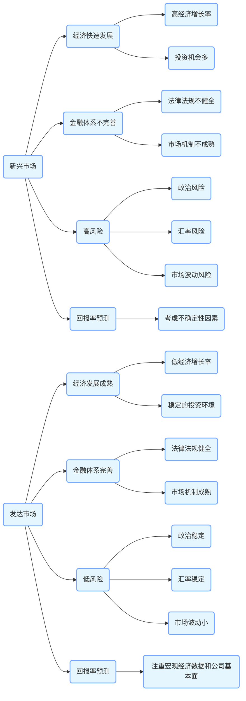

# 新兴市场与发达市场未来回报率预测的差异

> 关键词：新兴市场、发达市场、回报率预测、市场差异、经济环境、投资策略、风险因素

> 摘要：本文旨在深入探讨新兴市场与发达市场未来回报率预测的差异。通过对两个市场的背景分析，阐述核心概念及联系，介绍相关算法原理和数学模型，结合项目实战案例进行详细解释，探讨实际应用场景。同时，推荐相关工具和资源，总结未来发展趋势与挑战，并提供常见问题解答及参考资料，帮助投资者更好地理解两个市场回报率预测的特点，制定合理的投资策略。

## 1. 背景介绍 
### 1.1 目的和范围
本研究的目的是全面分析新兴市场与发达市场在未来回报率预测方面存在的差异。范围涵盖了两个市场的经济环境、市场结构、政策因素、风险特征等多个维度，旨在为投资者、金融机构及相关研究人员提供深入的见解，以便更好地评估投资机会、制定投资策略以及进行风险管理。

### 1.2 预期读者
本文预期读者包括专业投资者、金融分析师、经济学家、投资机构从业者、学术研究人员以及对金融市场有兴趣的一般读者。对于专业人士，本文可作为深入研究市场差异和回报率预测的参考资料；对于一般读者，可帮助其初步了解新兴市场和发达市场的特点及投资要点。

### 1.3 文档结构概述
本文首先介绍背景信息，包括目的、预期读者和文档结构概述，以及相关术语表。接着阐述核心概念与联系，通过文本示意图和 Mermaid 流程图展示两个市场的关键要素及相互关系。然后讲解核心算法原理和具体操作步骤，用 Python 源代码详细阐述。再介绍数学模型和公式，并举例说明。随后通过项目实战案例，包括开发环境搭建、源代码实现和代码解读，深入分析实际应用。之后探讨两个市场的实际应用场景，推荐相关工具和资源。最后总结未来发展趋势与挑战，提供常见问题解答及参考资料。

### 1.4 术语表
#### 1.4.1 核心术语定义
- **新兴市场**：指发展中国家或地区的金融市场，通常具有较高的经济增长率、快速的工业化进程和不断完善的金融体系，但也伴随着较高的风险和不确定性。
- **发达市场**：指经济发展成熟、金融体系完善、市场机制健全、法律法规完备的国家或地区的金融市场，一般具有较低的风险和相对稳定的回报率。
- **回报率**：指投资在一定时期内所获得的收益与初始投资的比率，反映了投资的盈利能力。
- **预测模型**：用于根据历史数据和相关因素对未来回报率进行预测的数学模型或统计方法。

#### 1.4.2 相关概念解释
- **经济周期**：指经济活动在运行过程中所经历的扩张、繁荣、衰退和萧条的循环过程。新兴市场和发达市场的经济周期特点不同，对回报率预测有重要影响。
- **风险溢价**：指投资者为承担额外风险而要求获得的额外回报。新兴市场由于风险较高，通常具有较高的风险溢价。
- **市场有效性**：指市场价格反映所有可用信息的程度。发达市场一般具有较高的市场有效性，而新兴市场的市场有效性相对较低。

#### 1.4.3 缩略词列表
- **GDP**：国内生产总值（Gross Domestic Product）
- **CPI**：消费者物价指数（Consumer Price Index）
- **P/E**：市盈率（Price-to-Earnings Ratio）
- **ROE**：净资产收益率（Return on Equity）

## 2. 核心概念与联系 

### 核心概念原理
新兴市场和发达市场在经济发展水平、市场成熟度、政策环境等方面存在显著差异，这些差异导致了两个市场在回报率预测上的不同特点。

新兴市场通常处于经济快速发展阶段，具有较高的经济增长率和投资机会。然而，由于其金融体系不够完善、法律法规不够健全、政治稳定性较差等因素，新兴市场的风险也相对较高。因此，新兴市场的回报率预测需要考虑更多的不确定性因素，如政治风险、汇率风险、市场波动风险等。

发达市场经济发展成熟，金融体系完善，市场机制健全，法律法规完备。发达市场的回报率相对稳定，但增长速度相对较慢。在发达市场的回报率预测中，更注重宏观经济数据、公司基本面分析以及市场趋势的研究。

### 架构的文本示意图
```plaintext
新兴市场
|-- 经济快速发展
|   |-- 高经济增长率
|   |-- 投资机会多
|-- 金融体系不完善
|   |-- 法律法规不健全
|   |-- 市场机制不成熟
|-- 高风险
|   |-- 政治风险
|   |-- 汇率风险
|   |-- 市场波动风险
|-- 回报率预测
|   |-- 考虑不确定性因素

发达市场
|-- 经济发展成熟
|   |-- 低经济增长率
|   |-- 稳定的投资环境
|-- 金融体系完善
|   |-- 法律法规健全
|   |-- 市场机制成熟
|-- 低风险
|   |-- 政治稳定
|   |-- 汇率稳定
|   |-- 市场波动小
|-- 回报率预测
|   |-- 注重宏观经济数据和公司基本面
```

### Mermaid 流程图


## 3. 核心算法原理 & 具体操作步骤 

### 算法原理
在预测新兴市场和发达市场的回报率时，我们可以使用多种算法，如线性回归、时间序列分析、机器学习算法等。这里我们以线性回归为例进行讲解。

线性回归是一种用于建立自变量和因变量之间线性关系的统计方法。在回报率预测中，我们可以将一些影响回报率的因素作为自变量，如 GDP 增长率、CPI、利率等，将回报率作为因变量，通过建立线性回归模型来预测未来的回报率。

线性回归模型的一般形式为：

$$y = \beta_0 + \beta_1x_1 + \beta_2x_2 + \cdots + \beta_nx_n + \epsilon$$

其中，$y$ 是因变量（回报率），$x_1, x_2, \cdots, x_n$ 是自变量（影响回报率的因素），$\beta_0, \beta_1, \cdots, \beta_n$ 是回归系数，$\epsilon$ 是误差项。

### Python 源代码详细阐述
```python
import numpy as np
import pandas as pd
from sklearn.linear_model import LinearRegression
from sklearn.model_selection import train_test_split
from sklearn.metrics import mean_squared_error

# 生成示例数据
np.random.seed(0)
n_samples = 100
# 自变量：GDP 增长率、CPI、利率
X = np.random.randn(n_samples, 3)
# 因变量：回报率
y = 2 * X[:, 0] + 1 * X[:, 1] - 0.5 * X[:, 2] + np.random.randn(n_samples)

# 划分训练集和测试集
X_train, X_test, y_train, y_test = train_test_split(X, y, test_size=0.2, random_state=42)

# 创建线性回归模型
model = LinearRegression()

# 训练模型
model.fit(X_train, y_train)

# 预测
y_pred = model.predict(X_test)

# 评估模型
mse = mean_squared_error(y_test, y_pred)
print(f"均方误差: {mse}")

# 查看回归系数
print(f"回归系数: {model.coef_}")
print(f"截距: {model.intercept_}")
```

### 具体操作步骤
1. **数据收集**：收集新兴市场和发达市场的相关数据，包括宏观经济数据（如 GDP 增长率、CPI、利率等）、市场数据（如股票指数、债券收益率等）和公司数据（如财务报表、盈利预测等）。
2. **数据预处理**：对收集到的数据进行清洗、整理和标准化处理，以确保数据的质量和一致性。
3. **特征选择**：从收集到的众多特征中选择对回报率有显著影响的特征，作为自变量。
4. **模型训练**：使用训练集数据对线性回归模型进行训练，估计回归系数。
5. **模型评估**：使用测试集数据对训练好的模型进行评估，计算均方误差等评估指标，评估模型的预测性能。
6. **预测**：使用训练好的模型对未来的回报率进行预测。

## 4. 数学模型和公式 & 详细讲解 & 举例说明 

### 线性回归模型公式
线性回归模型的一般形式为：

$$y = \beta_0 + \beta_1x_1 + \beta_2x_2 + \cdots + \beta_nx_n + \epsilon$$

其中，$y$ 是因变量（回报率），$x_1, x_2, \cdots, x_n$ 是自变量（影响回报率的因素），$\beta_0, \beta_1, \cdots, \beta_n$ 是回归系数，$\epsilon$ 是误差项。

### 详细讲解
- **回归系数**：$\beta_0$ 是截距，表示当所有自变量都为 0 时，因变量的取值。$\beta_1, \beta_2, \cdots, \beta_n$ 是斜率，表示自变量每变化一个单位，因变量的平均变化量。
- **误差项**：$\epsilon$ 表示模型无法解释的随机误差，通常假设其服从均值为 0、方差为 $\sigma^2$ 的正态分布。

### 举例说明
假设我们要预测股票的回报率，选择的自变量有 GDP 增长率、CPI 和利率。我们收集了过去 100 个季度的数据，使用线性回归模型进行训练，得到回归系数 $\beta_0 = 0.05$，$\beta_1 = 0.2$，$\beta_2 = -0.1$，$\beta_3 = -0.05$。

如果当前季度的 GDP 增长率为 3%，CPI 为 2%，利率为 1%，则预测的股票回报率为：

$$y = 0.05 + 0.2 \times 0.03 - 0.1 \times 0.02 - 0.05 \times 0.01 = 0.05 + 0.006 - 0.002 - 0.0005 = 0.0535$$

即预测的股票回报率为 5.35%。

## 5. 项目实战：代码实际案例和详细解释说明 

### 5.1  开发环境搭建
- **操作系统**：Windows、Linux 或 macOS
- **Python 版本**：Python 3.6 及以上
- **开发工具**：推荐使用 PyCharm 或 Jupyter Notebook
- **必要库**：安装 `numpy`、`pandas`、`scikit-learn` 等库，可以使用以下命令进行安装：
```sh
pip install numpy pandas scikit-learn
```

### 5.2  源代码详细实现和代码解读
```python
import numpy as np
import pandas as pd
from sklearn.linear_model import LinearRegression
from sklearn.model_selection import train_test_split
from sklearn.metrics import mean_squared_error

# 读取数据
data = pd.read_csv('market_data.csv')

# 提取自变量和因变量
X = data[['gdp_growth', 'cpi', 'interest_rate']].values
y = data['return_rate'].values

# 划分训练集和测试集
X_train, X_test, y_train, y_test = train_test_split(X, y, test_size=0.2, random_state=42)

# 创建线性回归模型
model = LinearRegression()

# 训练模型
model.fit(X_train, y_train)

# 预测
y_pred = model.predict(X_test)

# 评估模型
mse = mean_squared_error(y_test, y_pred)
print(f"均方误差: {mse}")

# 查看回归系数
print(f"回归系数: {model.coef_}")
print(f"截距: {model.intercept_}")
```

### 代码解读
1. **数据读取**：使用 `pandas` 库的 `read_csv` 函数读取存储在 `market_data.csv` 文件中的市场数据。
2. **自变量和因变量提取**：从数据中提取自变量（GDP 增长率、CPI、利率）和因变量（回报率）。
3. **数据划分**：使用 `train_test_split` 函数将数据划分为训练集和测试集，测试集占比为 20%。
4. **模型创建**：创建一个线性回归模型对象。
5. **模型训练**：使用训练集数据对线性回归模型进行训练。
6. **预测**：使用训练好的模型对测试集数据进行预测。
7. **模型评估**：使用 `mean_squared_error` 函数计算预测结果的均方误差，评估模型的预测性能。
8. **回归系数查看**：查看线性回归模型的回归系数和截距。

### 5.3  代码解读与分析
- **均方误差**：均方误差（MSE）是衡量模型预测误差的常用指标，MSE 越小，说明模型的预测性能越好。
- **回归系数**：回归系数反映了自变量对因变量的影响程度。正的回归系数表示自变量与因变量呈正相关，负的回归系数表示自变量与因变量呈负相关。
- **截距**：截距表示当所有自变量都为 0 时，因变量的取值。

通过分析回归系数和截距，我们可以了解不同因素对回报率的影响方向和程度，从而更好地理解市场的运行机制。

## 6. 实际应用场景 
### 新兴市场
- **投资决策**：在新兴市场进行投资时，由于市场的不确定性较高，投资者需要更加谨慎地评估风险和回报率。通过对新兴市场回报率的预测，投资者可以选择具有较高潜力的投资项目，优化投资组合。
- **风险管理**：新兴市场的风险较大，如政治风险、汇率风险等。通过预测回报率，投资者可以提前采取风险控制措施，如分散投资、套期保值等，降低投资风险。
- **政策制定**：政府和监管机构可以根据新兴市场回报率的预测结果，制定相应的政策，促进市场的稳定发展。例如，调整利率、税收政策等，以吸引更多的投资。

### 发达市场
- **资产配置**：在发达市场，投资者通常更注重资产的长期稳定回报。通过对发达市场回报率的预测，投资者可以合理配置资产，如股票、债券、基金等，实现资产的保值增值。
- **养老基金管理**：养老基金等长期投资者在发达市场中占据重要地位。通过预测回报率，养老基金管理者可以制定合理的投资策略，确保基金的长期收益，满足养老金支付的需求。
- **金融产品创新**：金融机构可以根据发达市场回报率的预测结果，开发创新的金融产品，如结构化产品、衍生产品等，满足不同投资者的需求。

## 7. 工具和资源推荐
### 7.1 学习资源推荐
#### 7.1.1 书籍推荐
- 《金融市场与金融机构基础》（Frank J. Fabozzi、Pamela P. Peterson 著）：介绍了金融市场和金融机构的基本概念、运作机制和风险管理等内容，是学习金融市场的经典教材。
- 《投资学》（滋维·博迪、亚历克斯·凯恩、艾伦·J·马库斯 著）：全面阐述了投资学的基本理论和方法，包括资产定价、投资组合管理、风险管理等内容，是投资领域的权威著作。
- 《计量经济学》（詹姆斯·H·斯托克、马克·W·沃森 著）：系统介绍了计量经济学的基本理论和方法，包括线性回归模型、时间序列分析、面板数据模型等，是学习计量经济学的优秀教材。

#### 7.1.2 在线课程
- Coursera 平台上的“Financial Markets”（耶鲁大学）：由著名经济学家罗伯特·希勒教授授课，介绍了金融市场的基本概念、运作机制和投资策略等内容。
- edX 平台上的“Introduction to Financial Engineering and Risk Management”（哥伦比亚大学）：介绍了金融工程和风险管理的基本理论和方法，包括衍生品定价、风险度量和套期保值等内容。
- 中国大学 MOOC 平台上的“计量经济学”（厦门大学）：由国家级教学名师洪永淼教授授课，系统介绍了计量经济学的基本理论和方法。

#### 7.1.3 技术博客和网站
- Seeking Alpha：提供全球金融市场的分析和评论，包括股票、债券、基金等投资领域的研究报告和观点。
- Bloomberg：全球知名的金融信息服务提供商，提供实时的金融市场数据、新闻和分析。
- 雪球：国内知名的投资社区，提供股票、基金等投资领域的讨论和交流平台，以及专业的投资分析和研究报告。

### 7.2 开发工具框架推荐
#### 7.2.1 IDE和编辑器
- PyCharm：一款功能强大的 Python 集成开发环境，提供代码编辑、调试、版本控制等功能，适合专业的 Python 开发者。
- Jupyter Notebook：一个交互式的笔记本环境，支持 Python、R 等多种编程语言，适合数据探索、模型开发和报告生成。
- Visual Studio Code：一款轻量级的代码编辑器，支持多种编程语言和插件扩展，适合快速开发和调试。

#### 7.2.2 调试和性能分析工具
- PySnooper：一个简单易用的 Python 调试工具，可以自动记录函数的调用过程和变量的值，方便调试代码。
- cProfile：Python 内置的性能分析工具，可以分析代码的运行时间和函数调用次数，帮助优化代码性能。
- Scalene：一个高性能的 Python 性能分析工具，可以实时监测代码的 CPU 和内存使用情况，提供详细的性能分析报告。

#### 7.2.3 相关框架和库
- NumPy：一个用于科学计算的 Python 库，提供高效的多维数组对象和数学函数，是数据分析和机器学习的基础库。
- Pandas：一个用于数据处理和分析的 Python 库，提供数据结构和数据操作工具，方便进行数据清洗、整理和分析。
- Scikit-learn：一个用于机器学习的 Python 库，提供多种机器学习算法和工具，包括分类、回归、聚类、降维等，适合快速开发和实验机器学习模型。

### 7.3 相关论文著作推荐
#### 7.3.1 经典论文
- Fama, E. F., & French, K. R. (1992). The cross-section of expected stock returns. The Journal of Finance, 47(2), 427-465.：提出了著名的 Fama-French 三因子模型，用于解释股票回报率的差异。
- Sharpe, W. F. (1964). Capital asset prices: A theory of market equilibrium under conditions of risk. The Journal of Finance, 19(3), 425-442.：提出了资本资产定价模型（CAPM），用于描述资产的预期回报率与市场风险之间的关系。
- Markowitz, H. M. (1952). Portfolio selection. The Journal of Finance, 7(1), 77-91.：提出了投资组合理论，为投资者提供了一种优化投资组合的方法。

#### 7.3.2 最新研究成果
- Pastor, L., & Stambaugh, R. F. (2012). Investing for the long run when returns are predictable. The Journal of Finance, 67(4), 1415-1448.：研究了在回报率可预测的情况下，长期投资的策略和绩效。
- Harvey, C. R., Liu, Y., & Zhu, H. (2016). … and the cross-section of expected returns. The Review of Financial Studies, 29(1), 5-68.：对金融领域中大量的回报率预测因子进行了综合分析和评估。
- Ang, A., & Bekaert, G. (2007). Stock return predictability: Is it there? The Review of Financial Studies, 20(3), 651-707.：探讨了股票回报率预测的有效性和可靠性。

#### 7.3.3 应用案例分析
- Damodaran, A. (2012). Investment valuation: Tools and techniques for determining the value of any asset. John Wiley & Sons.：通过大量的实际案例，介绍了投资估值的方法和技巧，包括股票、债券、企业等资产的估值。
- Bodie, Z., Kane, A., & Marcus, A. J. (2018). Investments. McGraw-Hill Education.：书中包含了许多实际的投资案例和分析，帮助读者理解投资学的理论和方法在实际中的应用。
- Fabozzi, F. J., & Modigliani, F. (2012). Capital markets: Institutions and instruments. Pearson.：通过实际案例介绍了资本市场的运作机制和金融工具的应用，对理解金融市场的实际情况有很大帮助。

## 8. 总结：未来发展趋势与挑战
### 未来发展趋势
- **数据驱动的预测方法**：随着信息技术的发展和数据的大量积累，未来的回报率预测将更加依赖于数据驱动的方法，如机器学习、深度学习等。这些方法可以处理复杂的非线性关系，提高预测的准确性。
- **跨市场和跨资产的整合分析**：新兴市场和发达市场之间的联系日益紧密，未来的回报率预测将更加注重跨市场和跨资产的整合分析。投资者需要综合考虑不同市场和资产之间的相关性，优化投资组合。
- **风险管理的重要性增加**：由于市场的不确定性和波动性增加，未来的回报率预测将更加注重风险管理。投资者需要采用更加有效的风险管理策略，降低投资风险。

### 挑战
- **数据质量和可靠性**：数据是回报率预测的基础，但数据的质量和可靠性往往受到多种因素的影响，如数据缺失、数据错误、数据不一致等。如何获取高质量、可靠的数据是回报率预测面临的一大挑战。
- **模型的复杂性和可解释性**：随着预测方法的不断发展，模型的复杂性也在不断增加。复杂的模型虽然可以提高预测的准确性，但往往缺乏可解释性，难以理解和应用。如何在提高预测准确性的同时，保持模型的可解释性是回报率预测面临的另一个挑战。
- **市场的不确定性和变化性**：金融市场是一个复杂的系统，受到多种因素的影响，如宏观经济环境、政策变化、突发事件等。市场的不确定性和变化性使得回报率预测变得更加困难，需要不断调整和优化预测模型。

## 9. 附录：常见问题与解答
### 1. 新兴市场和发达市场的回报率预测有哪些主要区别？
新兴市场的回报率预测需要考虑更多的不确定性因素，如政治风险、汇率风险、市场波动风险等；而发达市场的回报率预测更注重宏观经济数据、公司基本面分析以及市场趋势的研究。新兴市场的回报率通常具有较高的波动性，而发达市场的回报率相对稳定。

### 2. 如何选择合适的预测模型？
选择合适的预测模型需要考虑多个因素，如数据的特点、预测的目标、模型的复杂度和可解释性等。对于线性关系较强的数据，可以选择线性回归模型；对于非线性关系较强的数据，可以选择机器学习或深度学习模型。同时，还需要对不同的模型进行评估和比较，选择性能最优的模型。

### 3. 回报率预测的准确性如何保证？
回报率预测的准确性受到多种因素的影响，如数据质量、模型选择、市场的不确定性等。为了保证预测的准确性，需要采取以下措施：
- 收集高质量、可靠的数据，并进行数据清洗和预处理。
- 选择合适的预测模型，并对模型进行优化和调整。
- 考虑多种因素的影响，进行综合分析和判断。
- 不断更新和调整预测模型，以适应市场的变化。

### 4. 回报率预测在投资决策中有哪些应用？
回报率预测在投资决策中具有重要的应用价值，主要包括以下几个方面：
- 投资项目选择：通过预测不同投资项目的回报率，选择具有较高潜力的投资项目。
- 投资组合优化：根据回报率预测结果，合理配置资产，优化投资组合，降低投资风险。
- 风险管理：通过预测回报率，提前采取风险控制措施，如分散投资、套期保值等，降低投资风险。
- 投资策略制定：根据回报率预测结果，制定合理的投资策略，如长期投资、短期投资、价值投资、成长投资等。

## 10. 扩展阅读 & 参考资料
### 扩展阅读
- 《金融炼金术》（乔治·索罗斯 著）：介绍了索罗斯的投资哲学和方法，对理解金融市场的运行机制和投资决策有很大的启发。
- 《聪明的投资者》（本杰明·格雷厄姆 著）：被誉为投资领域的圣经，介绍了价值投资的基本理念和方法，对投资者具有重要的指导意义。
- 《黑天鹅》（纳西姆·尼古拉斯·塔勒布 著）：探讨了不可预测的重大事件对金融市场和投资决策的影响，提醒投资者要关注市场的不确定性和风险。

### 参考资料
- [Investopedia](https://www.investopedia.com/)：提供金融领域的专业术语解释、投资知识和市场分析。
- [World Bank](https://www.worldbank.org/)：提供全球经济数据、研究报告和政策分析。
- [International Monetary Fund (IMF)](https://www.imf.org/)：提供全球经济和金融市场的分析和预测，以及相关的政策建议。