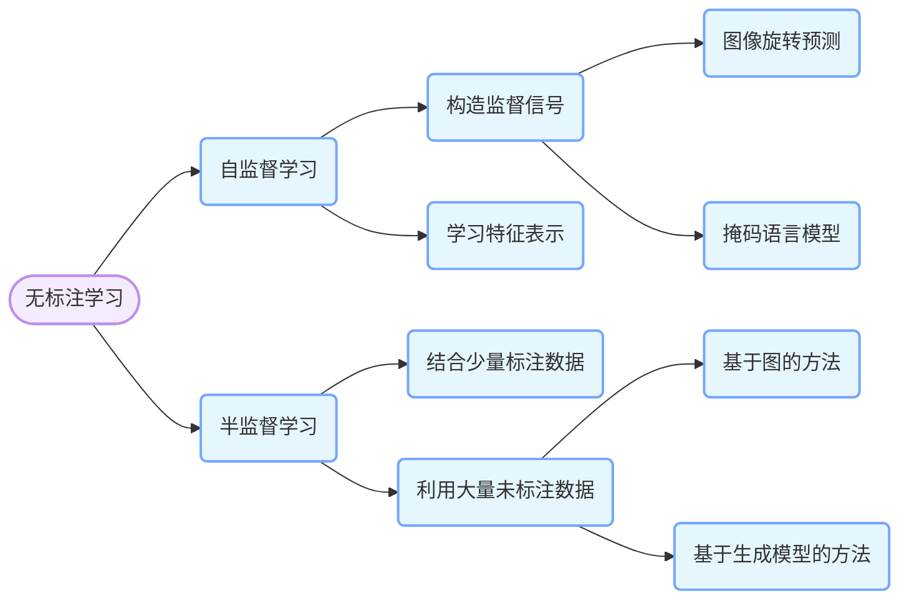

# 无标注学习:AI训练的未来趋势

> 关键词：无标注学习、AI训练、未来趋势、机器学习、数据效率、自监督学习、半监督学习

> 摘要：本文围绕无标注学习这一AI训练的未来趋势展开深入探讨。首先介绍了无标注学习提出的背景和重要意义，明确了文章的目的、范围、预期读者和文档结构。接着详细阐述了无标注学习的核心概念，包括自监督学习、半监督学习等关键技术及其联系，并通过文本示意图和Mermaid流程图进行直观展示。深入分析了核心算法原理，结合Python源代码进行详细说明，同时给出相关数学模型和公式，并举例讲解。通过项目实战，从开发环境搭建到源代码的详细实现与解读，展示了无标注学习在实际中的应用。探讨了无标注学习的实际应用场景，推荐了学习、开发所需的工具和资源，包括书籍、在线课程、技术博客、IDE、调试工具、相关框架和库以及重要论文著作。最后总结了无标注学习的未来发展趋势与挑战，提供了常见问题解答和扩展阅读及参考资料，旨在为读者全面呈现无标注学习的技术全貌和发展前景。

## 1. 背景介绍 
### 1.1 目的和范围
在人工智能（AI）领域，数据标注一直是一项耗时、费力且成本高昂的工作。传统的监督学习方法高度依赖大量标注好的数据来训练模型，这不仅限制了模型的可扩展性，也增加了数据收集和处理的难度。无标注学习作为一种新兴的训练范式，旨在减少对标注数据的依赖，提高数据利用效率，从而降低AI训练的成本和时间。本文的目的在于深入探讨无标注学习的核心概念、算法原理、实际应用等方面，为读者全面介绍这一AI训练的未来趋势。范围涵盖无标注学习的各个关键领域，包括自监督学习、半监督学习等相关技术，以及其在不同应用场景中的实践和发展前景。

### 1.2 预期读者
本文预期读者包括人工智能领域的研究人员、开发者、数据科学家、机器学习工程师等专业人士，以及对AI技术发展趋势感兴趣的爱好者。对于专业人士，本文提供了深入的技术分析和实践指导，有助于他们在工作中应用无标注学习技术；对于爱好者，本文以通俗易懂的语言介绍了无标注学习的基本概念和应用，帮助他们了解AI领域的前沿动态。

### 1.3 文档结构概述
本文将按照以下结构进行组织：首先介绍无标注学习的背景信息，包括目的、范围、预期读者和术语表；接着阐述无标注学习的核心概念及其联系，通过文本示意图和Mermaid流程图进行直观展示；深入分析核心算法原理，并结合Python源代码详细说明；给出相关数学模型和公式，并举例讲解；通过项目实战展示无标注学习在实际中的应用，包括开发环境搭建、源代码实现与解读；探讨无标注学习的实际应用场景；推荐学习和开发所需的工具和资源；总结无标注学习的未来发展趋势与挑战；提供常见问题解答和扩展阅读及参考资料。

### 1.4 术语表
#### 1.4.1 核心术语定义
- **无标注学习**：指在训练过程中不依赖或仅少量依赖标注数据的机器学习方法，旨在从大量未标注数据中挖掘有用信息来训练模型。
- **自监督学习**：一种无标注学习方法，通过构造监督信号，让模型从自身数据中学习特征表示，例如通过预测图像的旋转角度来学习图像的特征。
- **半监督学习**：结合少量标注数据和大量未标注数据进行训练的学习方法，利用未标注数据中的信息来提高模型的性能。
- **数据标注**：对原始数据进行标记，赋予其特定的标签或类别，以便用于监督学习训练。

#### 1.4.2 相关概念解释
- **无监督学习**：与无标注学习有一定关联，但无监督学习主要关注在未标注数据中发现数据的内在结构和模式，如聚类分析、降维等，而无标注学习更强调利用未标注数据进行模型训练以完成特定任务。
- **弱监督学习**：使用弱标签（如不完全准确或不完整的标签）进行训练的学习方法，介于监督学习和无标注学习之间。

#### 1.4.3 缩略词列表
- **AI**：Artificial Intelligence，人工智能
- **ML**：Machine Learning，机器学习
- **SSL**：Semi-Supervised Learning，半监督学习
- **SSSL**：Self-Supervised Learning，自监督学习

## 2. 核心概念与联系 
无标注学习主要包括自监督学习和半监督学习等技术，下面详细介绍这些核心概念及其联系。

### 自监督学习
自监督学习是无标注学习的重要分支，其核心思想是通过构造监督信号，让模型从自身数据中学习有用的特征表示。例如，在图像领域，可以通过预测图像的旋转角度、颜色通道等任务来训练模型，让模型学习到图像的内在特征。在自然语言处理领域，可以通过掩码语言模型（Masked Language Model），将输入文本中的部分单词掩码，让模型预测被掩码的单词，从而学习到语言的语义信息。

### 半监督学习
半监督学习结合了少量标注数据和大量未标注数据进行训练。其基本假设是未标注数据中包含了丰富的结构信息，通过利用这些信息可以提高模型的性能。常见的半监督学习方法包括基于图的方法、基于生成模型的方法等。基于图的方法将数据点看作图中的节点，通过节点之间的连接关系来传播标签信息；基于生成模型的方法则通过生成模型来模拟数据的分布，利用未标注数据来学习更准确的模型参数。

### 核心概念原理和架构的文本示意图
```plaintext
无标注学习
├── 自监督学习
│   ├── 构造监督信号
│   │   ├── 图像旋转预测
│   │   ├── 掩码语言模型
│   ├── 学习特征表示
├── 半监督学习
│   ├── 结合少量标注数据
│   ├── 利用大量未标注数据
│   │   ├── 基于图的方法
│   │   ├── 基于生成模型的方法
```

### Mermaid流程图


## 3. 核心算法原理 & 具体操作步骤 （算法原理讲解必须使用Python源代码来详细阐述）
### 自监督学习 - 图像旋转预测算法原理及实现
#### 算法原理
图像旋转预测是一种简单而有效的自监督学习方法。其基本思想是将输入图像随机旋转一定角度（如0°、90°、180°、270°），然后让模型预测旋转的角度。通过这种方式，模型可以学习到图像的内在特征。

#### 具体操作步骤
1. 加载图像数据集。
2. 对图像进行随机旋转。
3. 构建神经网络模型。
4. 训练模型，使其预测图像的旋转角度。

#### Python源代码实现
```python
import torch
import torch.nn as nn
import torch.optim as optim
from torchvision import datasets, transforms
from torch.utils.data import DataLoader

# 定义数据预处理
transform = transforms.Compose([
    transforms.ToTensor(),
    transforms.Normalize((0.5,), (0.5,))
])

# 加载数据集
train_dataset = datasets.MNIST(root='./data', train=True,
                               download=True, transform=transform)
train_loader = DataLoader(train_dataset, batch_size=64, shuffle=True)

# 定义神经网络模型
class RotationNet(nn.Module):
    def __init__(self):
        super(RotationNet, self).__init__()
        self.conv1 = nn.Conv2d(1, 10, kernel_size=5)
        self.conv2 = nn.Conv2d(10, 20, kernel_size=5)
        self.fc1 = nn.Linear(320, 50)
        self.fc2 = nn.Linear(50, 4)  # 4个旋转角度

    def forward(self, x):
        x = nn.functional.relu(nn.functional.max_pool2d(self.conv1(x), 2))
        x = nn.functional.relu(nn.functional.max_pool2d(self.conv2(x), 2))
        x = x.view(-1, 320)
        x = nn.functional.relu(self.fc1(x))
        x = self.fc2(x)
        return x

model = RotationNet()

# 定义损失函数和优化器
criterion = nn.CrossEntropyLoss()
optimizer = optim.SGD(model.parameters(), lr=0.01, momentum=0.5)

# 训练模型
for epoch in range(10):
    running_loss = 0.0
    for i, (images, _) in enumerate(train_loader):
        # 随机旋转图像
        angles = torch.randint(0, 4, (images.size(0),))
        rotated_images = torch.stack([torch.rot90(img, angle, [1, 2]) for img, angle in zip(images, angles)], dim=0)

        optimizer.zero_grad()
        outputs = model(rotated_images)
        loss = criterion(outputs, angles)
        loss.backward()
        optimizer.step()

        running_loss += loss.item()
    print(f'Epoch {epoch + 1}, Loss: {running_loss / len(train_loader)}')
```

### 半监督学习 - 基于图的方法算法原理及实现
#### 算法原理
基于图的半监督学习方法将数据点看作图中的节点，节点之间的边表示数据点之间的相似性。通过标签传播算法，将标注数据的标签信息传播到未标注数据上。

#### 具体操作步骤
1. 构建图，计算数据点之间的相似性。
2. 初始化节点的标签信息。
3. 进行标签传播，更新未标注数据的标签。
4. 使用更新后的标签训练模型。

#### Python源代码实现
```python
import numpy as np
from sklearn.datasets import make_circles
from sklearn.neighbors import kneighbors_graph
from sklearn.semi_supervised import LabelPropagation

# 生成数据集
X, y = make_circles(n_samples=200, noise=0.1, factor=0.5)

# 随机选择部分数据作为标注数据
rng = np.random.RandomState(42)
random_unlabeled_points = rng.rand(len(y)) < 0.3
labels = np.copy(y)
labels[random_unlabeled_points] = -1  # 未标注数据的标签设为 -1

# 构建图
graph = kneighbors_graph(X, n_neighbors=10)

# 进行标签传播
label_propagation = LabelPropagation(kernel='knn', n_neighbors=10)
label_propagation.fit(X, labels)

# 打印预测结果
predicted_labels = label_propagation.transduction_
print('Predicted labels:', predicted_labels)
```

## 4. 数学模型和公式 & 详细讲解 & 举例说明 
### 自监督学习 - 图像旋转预测的数学模型
在图像旋转预测的自监督学习中，我们的目标是让模型预测图像的旋转角度。假设输入图像为 $x$，旋转角度的真实标签为 $y$，模型的预测输出为 $\hat{y}$。我们使用交叉熵损失函数来衡量预测结果与真实标签之间的差异，交叉熵损失函数的数学公式为：

$$
L(\hat{y}, y) = -\sum_{i=1}^{C} y_i \log(\hat{y}_i)
$$

其中，$C$ 是类别数（在图像旋转预测中，$C = 4$ 表示4个旋转角度），$y_i$ 是真实标签的第 $i$ 个分量（one-hot编码），$\hat{y}_i$ 是模型预测输出的第 $i$ 个分量。

#### 举例说明
假设我们有一个图像，其真实旋转角度为90°，对应的one-hot编码标签为 $y = [0, 1, 0, 0]$。模型的预测输出为 $\hat{y} = [0.1, 0.7, 0.1, 0.1]$。则交叉熵损失为：

$$
L(\hat{y}, y) = -(0 \times \log(0.1) + 1 \times \log(0.7) + 0 \times \log(0.1) + 0 \times \log(0.1)) \approx 0.357
$$

### 半监督学习 - 基于图的标签传播数学模型
在基于图的半监督学习中，我们使用标签传播算法来更新未标注数据的标签。设 $L$ 表示标注数据的索引集合，$U$ 表示未标注数据的索引集合，$D$ 是图的度矩阵，$W$ 是图的邻接矩阵，$Y$ 是标签矩阵，其中 $Y_{i,k}$ 表示第 $i$ 个数据点属于第 $k$ 类的概率。

标签传播的迭代公式为：

$$
Y_{U}^{(t + 1)} = (D_{U,U}^{-1}W_{U,U})Y_{U}^{(t)} + (D_{U,L}^{-1}W_{U,L})Y_{L}
$$

其中，$Y_{U}^{(t)}$ 是第 $t$ 次迭代时未标注数据的标签矩阵，$Y_{L}$ 是标注数据的标签矩阵。

#### 举例说明
假设有一个简单的图，包含3个标注数据和2个未标注数据。图的邻接矩阵 $W$ 和度矩阵 $D$ 如下：

$$
W = \begin{bmatrix}
0 & 1 & 0 & 1 & 0 \\
1 & 0 & 1 & 0 & 1 \\
0 & 1 & 0 & 0 & 0 \\
1 & 0 & 0 & 0 & 1 \\
0 & 1 & 0 & 1 & 0
\end{bmatrix}
$$

$$
D = \begin{bmatrix}
2 & 0 & 0 & 0 & 0 \\
0 & 3 & 0 & 0 & 0 \\
0 & 0 & 1 & 0 & 0 \\
0 & 0 & 0 & 2 & 0 \\
0 & 0 & 0 & 0 & 2
\end{bmatrix}
$$

标注数据的标签矩阵 $Y_{L} = \begin{bmatrix}
1 & 0 \\
0 & 1 \\
1 & 0
\end{bmatrix}$，初始时未标注数据的标签矩阵 $Y_{U}^{(0)} = \begin{bmatrix}
0.5 & 0.5 \\
0.5 & 0.5
\end{bmatrix}$。

通过标签传播的迭代公式，可以计算出下一次迭代时未标注数据的标签矩阵 $Y_{U}^{(1)}$。

## 5. 项目实战：代码实际案例和详细解释说明 
### 5.1  开发环境搭建
#### 安装Python
首先，确保你已经安装了Python。建议使用Python 3.7及以上版本。可以从Python官方网站（https://www.python.org/downloads/） 下载并安装。

#### 安装深度学习框架
本文使用PyTorch作为深度学习框架。可以使用以下命令安装PyTorch：
```bash
pip install torch torchvision
```

#### 安装其他依赖库
还需要安装一些其他的依赖库，如NumPy、Scikit-learn等。可以使用以下命令安装：
```bash
pip install numpy scikit-learn
```

### 5.2  源代码详细实现和代码解读
#### 自监督学习 - 图像旋转预测项目
```python
import torch
import torch.nn as nn
import torch.optim as optim
from torchvision import datasets, transforms
from torch.utils.data import DataLoader

# 定义数据预处理
transform = transforms.Compose([
    transforms.ToTensor(),
    transforms.Normalize((0.5,), (0.5,))
])

# 加载数据集
train_dataset = datasets.MNIST(root='./data', train=True,
                               download=True, transform=transform)
train_loader = DataLoader(train_dataset, batch_size=64, shuffle=True)

# 定义神经网络模型
class RotationNet(nn.Module):
    def __init__(self):
        super(RotationNet, self).__init__()
        self.conv1 = nn.Conv2d(1, 10, kernel_size=5)
        self.conv2 = nn.Conv2d(10, 20, kernel_size=5)
        self.fc1 = nn.Linear(320, 50)
        self.fc2 = nn.Linear(50, 4)  # 4个旋转角度

    def forward(self, x):
        x = nn.functional.relu(nn.functional.max_pool2d(self.conv1(x), 2))
        x = nn.functional.relu(nn.functional.max_pool2d(self.conv2(x), 2))
        x = x.view(-1, 320)
        x = nn.functional.relu(self.fc1(x))
        x = self.fc2(x)
        return x

model = RotationNet()

# 定义损失函数和优化器
criterion = nn.CrossEntropyLoss()
optimizer = optim.SGD(model.parameters(), lr=0.01, momentum=0.5)

# 训练模型
for epoch in range(10):
    running_loss = 0.0
    for i, (images, _) in enumerate(train_loader):
        # 随机旋转图像
        angles = torch.randint(0, 4, (images.size(0),))
        rotated_images = torch.stack([torch.rot90(img, angle, [1, 2]) for img, angle in zip(images, angles)], dim=0)

        optimizer.zero_grad()
        outputs = model(rotated_images)
        loss = criterion(outputs, angles)
        loss.backward()
        optimizer.step()

        running_loss += loss.item()
    print(f'Epoch {epoch + 1}, Loss: {running_loss / len(train_loader)}')
```

#### 代码解读
1. **数据预处理**：使用 `transforms.Compose` 定义了数据预处理的步骤，包括将图像转换为张量和归一化操作。
2. **数据集加载**：使用 `datasets.MNIST` 加载MNIST数据集，并使用 `DataLoader` 进行批量加载。
3. **模型定义**：定义了一个简单的卷积神经网络 `RotationNet`，包含两个卷积层和两个全连接层，最后输出4个旋转角度的预测结果。
4. **损失函数和优化器**：使用交叉熵损失函数 `nn.CrossEntropyLoss` 和随机梯度下降优化器 `optim.SGD`。
5. **训练过程**：在每个epoch中，对图像进行随机旋转，然后将旋转后的图像输入模型进行预测，计算损失并更新模型参数。

#### 半监督学习 - 基于图的标签传播项目
```python
import numpy as np
from sklearn.datasets import make_circles
from sklearn.neighbors import kneighbors_graph
from sklearn.semi_supervised import LabelPropagation

# 生成数据集
X, y = make_circles(n_samples=200, noise=0.1, factor=0.5)

# 随机选择部分数据作为标注数据
rng = np.random.RandomState(42)
random_unlabeled_points = rng.rand(len(y)) < 0.3
labels = np.copy(y)
labels[random_unlabeled_points] = -1  # 未标注数据的标签设为 -1

# 构建图
graph = kneighbors_graph(X, n_neighbors=10)

# 进行标签传播
label_propagation = LabelPropagation(kernel='knn', n_neighbors=10)
label_propagation.fit(X, labels)

# 打印预测结果
predicted_labels = label_propagation.transduction_
print('Predicted labels:', predicted_labels)
```

#### 代码解读
1. **数据集生成**：使用 `make_circles` 生成一个环形数据集。
2. **标注数据选择**：随机选择部分数据作为标注数据，将未标注数据的标签设为 -1。
3. **图构建**：使用 `kneighbors_graph` 构建图，计算数据点之间的相似性。
4. **标签传播**：使用 `LabelPropagation` 进行标签传播，将标注数据的标签信息传播到未标注数据上。
5. **结果输出**：打印预测结果。

### 5.3  代码解读与分析
#### 自监督学习 - 图像旋转预测
- **优点**：通过自监督学习的方式，不需要大量标注数据就可以让模型学习到图像的内在特征。可以在无标注数据上进行预训练，然后在有标注数据上进行微调，提高模型的性能。
- **缺点**：旋转预测任务可能与实际任务存在一定的差距，需要进一步的微调才能应用到实际任务中。

#### 半监督学习 - 基于图的标签传播
- **优点**：利用了未标注数据中的结构信息，通过标签传播可以提高模型的性能。适用于数据量较大但标注数据较少的情况。
- **缺点**：图的构建和标签传播的过程可能比较复杂，需要选择合适的参数。对数据的分布和相似性度量比较敏感。

## 6. 实际应用场景 
### 计算机视觉领域
- **图像分类**：在图像分类任务中，无标注学习可以通过自监督学习的方式在大量未标注图像上进行预训练，学习到图像的通用特征。然后在少量标注图像上进行微调，提高图像分类的性能。例如，在一些大规模图像数据集上进行自监督预训练，然后在特定领域的图像分类任务中进行微调。
- **目标检测**：无标注学习可以帮助模型学习到目标的形状、纹理等特征，从而提高目标检测的准确率。例如，通过自监督学习预测图像中目标的旋转、缩放等变换，让模型更好地理解目标的几何特征。
- **图像分割**：在图像分割任务中，半监督学习可以结合少量标注的分割掩码和大量未标注图像，利用未标注图像中的信息来提高分割的精度。例如，通过标签传播算法将标注的分割掩码信息传播到未标注图像上。

### 自然语言处理领域
- **文本分类**：无标注学习可以在大量未标注文本上进行预训练，学习到语言的语义信息。然后在少量标注文本上进行微调，提高文本分类的性能。例如，使用掩码语言模型在大规模文本语料库上进行预训练，然后在特定领域的文本分类任务中进行微调。
- **机器翻译**：半监督学习可以利用大量未标注的平行语料，通过自训练等方法提高机器翻译的质量。例如，使用已有的翻译模型对未标注的平行语料进行翻译，然后将翻译结果作为伪标签进行训练。
- **情感分析**：无标注学习可以帮助模型学习到文本中的情感倾向特征。例如，通过自监督学习预测文本的情感极性，让模型更好地理解文本的情感信息。

### 医疗领域
- **疾病诊断**：在医疗图像（如X光、CT等）诊断中，标注数据往往比较稀缺。无标注学习可以在大量未标注的医疗图像上进行预训练，学习到图像的特征，然后在少量标注图像上进行微调，提高疾病诊断的准确率。
- **药物研发**：在药物研发过程中，需要处理大量的生物数据（如基因序列、蛋白质结构等）。无标注学习可以帮助挖掘这些数据中的潜在信息，加速药物研发的进程。例如，通过自监督学习预测基因序列的功能，为药物研发提供有价值的信息。

## 7. 工具和资源推荐
### 7.1 学习资源推荐
#### 7.1.1 书籍推荐
- 《深度学习》（Deep Learning）：由Ian Goodfellow、Yoshua Bengio和Aaron Courville合著，是深度学习领域的经典教材，涵盖了深度学习的基本概念、算法和应用。
- 《Python机器学习》（Python Machine Learning）：由Sebastian Raschka和Vahid Mirjalili合著，介绍了Python在机器学习中的应用，包括无标注学习等相关内容。
- 《动手学深度学习》（Dive into Deep Learning）：由李沐等人编写，提供了丰富的深度学习实践案例，包括无标注学习的实现。

#### 7.1.2 在线课程
- Coursera上的“深度学习专项课程”（Deep Learning Specialization）：由Andrew Ng教授讲授，系统地介绍了深度学习的各个方面，包括无标注学习的相关内容。
- edX上的“人工智能基础”（Fundamentals of Artificial Intelligence）：提供了人工智能的基础知识，包括机器学习、无标注学习等内容。
- 哔哩哔哩上的“李沐深度学习”系列课程：以通俗易懂的方式讲解深度学习的原理和实践，包括无标注学习的实现。

#### 7.1.3 技术博客和网站
- Medium：是一个技术博客平台，有很多关于无标注学习的文章和教程。
- arXiv：是一个预印本论文平台，提供了最新的无标注学习研究成果。
- Kaggle：是一个数据科学竞赛平台，有很多关于无标注学习的实践案例和讨论。

### 7.2 开发工具框架推荐
#### 7.2.1 IDE和编辑器
- PyCharm：是一款专业的Python集成开发环境，提供了丰富的代码编辑、调试和分析功能。
- Jupyter Notebook：是一个交互式的开发环境，适合进行数据探索和模型训练。
- Visual Studio Code：是一款轻量级的代码编辑器，支持多种编程语言，有丰富的插件可以扩展功能。

#### 7.2.2 调试和性能分析工具
- PyTorch Profiler：是PyTorch提供的性能分析工具，可以帮助用户分析模型的性能瓶颈。
- TensorBoard：是TensorFlow提供的可视化工具，也可以用于PyTorch模型的可视化和性能分析。
- cProfile：是Python内置的性能分析工具，可以帮助用户分析代码的性能。

#### 7.2.3 相关框架和库
- PyTorch：是一个开源的深度学习框架，提供了丰富的深度学习模型和工具，支持无标注学习的实现。
- TensorFlow：是另一个流行的深度学习框架，也提供了无标注学习的相关工具和模型。
- Scikit-learn：是一个机器学习库，提供了半监督学习等相关算法的实现。

### 7.3 相关论文著作推荐
#### 7.3.1 经典论文
- “A Simple Framework for Contrastive Learning of Visual Representations”：提出了一种简单的对比学习框架，用于自监督学习图像表示。
- “Semi-Supervised Learning Using Gaussian Fields and Harmonic Functions”：介绍了基于图的半监督学习方法的基本原理。
- “BERT: Pre-training of Deep Bidirectional Transformers for Language Understanding”：提出了BERT模型，是自然语言处理领域自监督学习的经典之作。

#### 7.3.2 最新研究成果
- 关注arXiv上的最新论文，了解无标注学习领域的最新研究进展。
- 参加相关的学术会议，如NeurIPS、ICML等，获取最新的研究成果。

#### 7.3.3 应用案例分析
- Kaggle上的相关竞赛和讨论，提供了很多无标注学习在实际应用中的案例分析。
- 各大科技公司的技术博客，如Google AI Blog、Facebook AI Research等，分享了无标注学习在实际应用中的经验和成果。

## 8. 总结：未来发展趋势与挑战
### 未来发展趋势
- **与其他技术的融合**：无标注学习将与强化学习、迁移学习等技术深度融合，进一步提高模型的性能和泛化能力。例如，将自监督学习与强化学习结合，让智能体在无标注环境中学习到更有效的策略。
- **跨模态学习**：无标注学习将从单一模态（如图像、文本）向跨模态（如图像-文本、音频-视频）学习发展，以更好地理解和处理多源信息。例如，通过无标注学习实现图像和文本之间的关联和理解。
- **自动化无标注学习**：未来将出现更多自动化的无标注学习方法和工具，降低无标注学习的技术门槛，让更多的开发者和研究者能够应用无标注学习技术。

### 挑战
- **无标注数据的质量和多样性**：无标注学习高度依赖未标注数据的质量和多样性。如何获取高质量、多样化的未标注数据，并对其进行有效的预处理和筛选，是一个挑战。
- **模型的可解释性**：无标注学习模型往往比较复杂，其决策过程难以解释。如何提高无标注学习模型的可解释性，让人们更好地理解模型的行为和决策依据，是一个重要的研究方向。
- **计算资源的需求**：无标注学习通常需要大量的计算资源来处理大规模的未标注数据。如何降低无标注学习的计算成本，提高计算效率，是一个亟待解决的问题。

## 9. 附录：常见问题与解答
### 问题1：无标注学习和无监督学习有什么区别？
答：无监督学习主要关注在未标注数据中发现数据的内在结构和模式，如聚类分析、降维等；而无标注学习更强调利用未标注数据进行模型训练以完成特定任务，包括自监督学习、半监督学习等方法。

### 问题2：无标注学习需要多少标注数据？
答：这取决于具体的任务和方法。半监督学习通常需要少量标注数据，而自监督学习可以在完全无标注数据上进行预训练，然后在少量标注数据上进行微调。

### 问题3：无标注学习的性能如何？
答：无标注学习在很多任务中都取得了不错的性能，尤其是在标注数据稀缺的情况下。通过利用未标注数据中的信息，无标注学习可以提高模型的泛化能力和性能。

### 问题4：如何选择合适的无标注学习方法？
答：需要根据具体的任务、数据特点和计算资源等因素来选择合适的无标注学习方法。例如，如果数据量较大且标注数据较少，可以考虑半监督学习；如果有大量未标注数据，可以尝试自监督学习。

## 10. 扩展阅读 & 参考资料
- Goodfellow, I., Bengio, Y., & Courville, A. (2016). Deep Learning. MIT Press.
- Raschka, S., & Mirjalili, V. (2017). Python Machine Learning. Packt Publishing.
- Li, M., Zhang, A., Li, Z., & Smola, A. J. (2020). Dive into Deep Learning.
- Chen, T., Kornblith, S., Norouzi, M., & Hinton, G. (2020). A Simple Framework for Contrastive Learning of Visual Representations. arXiv preprint arXiv:2002.05709.
- Zhu, X., & Ghahramani, Z. (2002). Semi-Supervised Learning Using Gaussian Fields and Harmonic Functions. Proceedings of the 20th International Conference on Machine Learning (ICML-03).
- Devlin, J., Chang, M. W., Lee, K., & Toutanova, K. (2018). BERT: Pre-training of Deep Bidirectional Transformers for Language Understanding. arXiv preprint arXiv:1810.04805.
- 相关技术博客和网站：Medium、arXiv、Kaggle等。