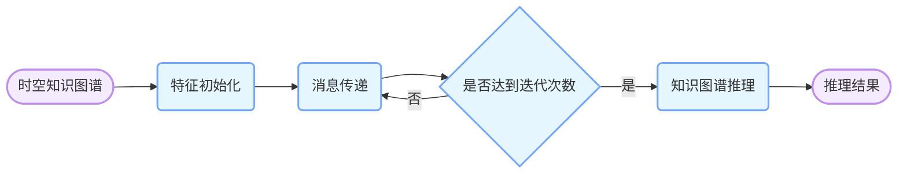

# 时空知识图谱推理中图神经网络的前沿技术

> 关键词：时空知识图谱、图神经网络、知识图谱推理、前沿技术、时空信息处理

> 摘要：本文聚焦于时空知识图谱推理中图神经网络的前沿技术。首先介绍时空知识图谱和图神经网络的相关背景知识，接着深入探讨图神经网络在时空知识图谱推理中的核心概念、算法原理、数学模型等内容。通过项目实战展示具体的代码实现与应用，分析其在不同实际场景中的应用情况。同时推荐相关的学习资源、开发工具和论文著作，最后总结图神经网络在时空知识图谱推理领域的未来发展趋势与挑战，并对常见问题进行解答，为相关研究和实践提供全面且深入的参考。

## 1. 背景介绍 
### 1.1 目的和范围
时空知识图谱推理是一个具有重要研究价值和应用前景的领域。随着大数据时代的到来，包含时空信息的数据日益增多，如地理信息系统、交通数据、社交媒体中的动态信息等。时空知识图谱能够有效地组织和表示这些时空数据，而图神经网络作为一种强大的图数据处理工具，为时空知识图谱的推理提供了新的思路和方法。本文的目的在于全面介绍时空知识图谱推理中图神经网络的前沿技术，涵盖其基本概念、算法原理、实际应用等多个方面，范围涉及从理论基础到实践案例的完整知识体系。

### 1.2 预期读者
本文预期读者包括计算机科学、人工智能、数据挖掘等领域的研究人员和学者，他们希望深入了解时空知识图谱推理中图神经网络的最新技术进展；也包括相关专业的学生，为他们提供系统的学习资料；同时对于从事智能交通、地理信息系统、社交网络分析等应用领域的工程师和技术人员，本文可以帮助他们将图神经网络技术应用到实际项目中。

### 1.3 文档结构概述
本文将按照以下结构进行阐述：首先介绍时空知识图谱和图神经网络的核心概念以及它们之间的联系，并通过文本示意图和 Mermaid 流程图进行说明；接着详细讲解图神经网络在时空知识图谱推理中的核心算法原理和具体操作步骤，结合 Python 源代码进行阐述；然后介绍相关的数学模型和公式，并举例说明；通过项目实战展示代码实际案例并进行详细解释；分析图神经网络在时空知识图谱推理中的实际应用场景；推荐相关的学习资源、开发工具和论文著作；最后总结未来发展趋势与挑战，解答常见问题，并提供扩展阅读和参考资料。

### 1.4 术语表
#### 1.4.1 核心术语定义
- **时空知识图谱**：是一种特殊的知识图谱，它不仅包含实体和实体之间的关系，还融入了时间和空间信息，用于表示和管理具有时空特性的数据。
- **图神经网络**：是一类专门处理图结构数据的神经网络，它通过节点之间的连接信息来学习节点和图的特征表示。
- **知识图谱推理**：是指利用知识图谱中已有的知识，通过一定的推理方法，推导出新的知识或关系的过程。

#### 1.4.2 相关概念解释
- **时空信息**：时间信息表示事件发生的先后顺序和持续时间，空间信息表示物体或事件在空间中的位置和范围。在时空知识图谱中，时空信息用于更准确地描述实体和关系的特性。
- **图结构数据**：由节点和边组成的数据结构，节点表示实体，边表示实体之间的关系。图结构数据能够自然地表示复杂的关系网络，如社交网络、交通网络等。

#### 1.4.3 缩略词列表
- **GNN**：Graph Neural Network，图神经网络
- **KG**：Knowledge Graph，知识图谱
- **STKG**：Spatio - Temporal Knowledge Graph，时空知识图谱

## 2. 核心概念与联系 

### 2.1 时空知识图谱的概念与结构
时空知识图谱是知识图谱在时空维度上的扩展。传统的知识图谱通常以三元组 $(h, r, t)$ 的形式表示知识，其中 $h$ 表示头实体，$r$ 表示关系，$t$ 表示尾实体。而时空知识图谱在此基础上，增加了时间和空间信息，形成四元组或五元组的表示形式，如 $(h, r, t, T, S)$，其中 $T$ 表示时间信息，$S$ 表示空间信息。

时空知识图谱的结构可以看作是一个复杂的图，节点代表实体，边代表关系，每个节点和边都可以关联时空信息。例如，在一个地理信息的时空知识图谱中，节点可以是城市、景点等实体，边可以表示城市之间的距离、景点之间的交通连接等关系，时间信息可以表示景点的开放时间、城市的历史变迁等，空间信息可以表示城市的地理位置、景点的占地面积等。

### 2.2 图神经网络的概念与原理
图神经网络是一种强大的图数据处理工具，它的核心思想是通过节点之间的消息传递来学习节点和图的特征表示。图神经网络的基本操作包括节点特征聚合和更新。

节点特征聚合是指将节点的邻居节点的特征信息进行聚合，常用的聚合方式有求和、平均、最大池化等。节点特征更新是指根据聚合后的邻居节点特征和节点自身的特征，更新节点的特征表示。通过多次迭代的消息传递过程，图神经网络可以捕捉到图中节点之间的复杂关系和全局结构信息。

### 2.3 时空知识图谱与图神经网络的联系
图神经网络为时空知识图谱推理提供了有效的方法。时空知识图谱的图结构数据天然适合图神经网络进行处理。图神经网络可以利用时空知识图谱中的节点和边的信息，学习节点和关系的特征表示，从而进行知识图谱推理。

例如，在时空知识图谱中，图神经网络可以根据节点的时空信息和邻居节点的关系，预测节点之间的潜在关系或节点在未来的状态。同时，时空知识图谱中的时空信息也可以为图神经网络的消息传递过程提供额外的约束和指导，提高推理的准确性和效率。

### 2.4 文本示意图
时空知识图谱推理中图神经网络的工作流程可以用以下文本示意图表示：

时空知识图谱包含实体、关系、时间和空间信息，图神经网络将这些信息作为输入。首先对节点和边的特征进行初始化，然后通过多次消息传递过程，节点不断聚合邻居节点的特征信息，并更新自身的特征表示。在消息传递过程中，考虑时空信息的约束和影响。最后，根据学习到的节点和关系的特征表示，进行知识图谱推理，如预测新的关系、实体分类等。

### 2.5 Mermaid 流程图


## 3. 核心算法原理 & 具体操作步骤 

### 3.1 图神经网络的基本算法原理
图神经网络的基本算法包括图卷积网络（GCN）、图注意力网络（GAT）等。下面以图卷积网络为例，介绍其算法原理。

图卷积网络的核心思想是通过对节点的邻居节点特征进行加权求和，来更新节点的特征表示。具体来说，对于图中的节点 $i$，其特征更新公式为：

$$H^{(l + 1)}_i=\sigma\left(\sum_{j\in\mathcal{N}(i)}\frac{1}{\sqrt{d_id_j}}W^{(l)}H^{(l)}_j\right)$$

其中，$H^{(l)}$ 表示第 $l$ 层的节点特征矩阵，$\mathcal{N}(i)$ 表示节点 $i$ 的邻居节点集合，$d_i$ 和 $d_j$ 分别表示节点 $i$ 和节点 $j$ 的度，$W^{(l)}$ 是第 $l$ 层的可学习权重矩阵，$\sigma$ 是激活函数。

### 3.2 考虑时空信息的图神经网络算法原理
在时空知识图谱推理中，需要考虑时空信息对图神经网络的影响。一种常见的方法是将时空信息融入到节点和边的特征中，然后在消息传递过程中进行处理。

例如，可以将时间信息表示为时间嵌入向量，将空间信息表示为空间嵌入向量，然后将这些嵌入向量与节点和边的原始特征进行拼接。在消息传递过程中，根据时空信息对邻居节点的特征进行加权，使得距离更近、时间更接近的邻居节点对当前节点的影响更大。

### 3.3 具体操作步骤
1. **数据预处理**：将时空知识图谱数据进行清洗、转换和特征提取，将时空信息转换为合适的特征表示。
2. **特征初始化**：对节点和边的特征进行初始化，将时空信息融入到特征中。
3. **模型构建**：选择合适的图神经网络模型，如 GCN、GAT 等，并根据时空知识图谱的特点进行调整。
4. **消息传递**：通过多次迭代的消息传递过程，更新节点的特征表示。
5. **知识图谱推理**：根据学习到的节点和关系的特征表示，进行知识图谱推理，如关系预测、实体分类等。

### 3.4 Python 源代码实现
以下是一个简单的使用 PyTorch Geometric 库实现的图卷积网络示例，用于时空知识图谱推理：

```python
import torch
import torch.nn.functional as F
from torch_geometric.nn import GCNConv

# 定义图卷积网络模型
class GCN(torch.nn.Module):
    def __init__(self, in_channels, hidden_channels, out_channels):
        super(GCN, self).__init__()
        self.conv1 = GCNConv(in_channels, hidden_channels)
        self.conv2 = GCNConv(hidden_channels, out_channels)

    def forward(self, x, edge_index):
        x = self.conv1(x, edge_index)
        x = F.relu(x)
        x = F.dropout(x, training=self.training)
        x = self.conv2(x, edge_index)
        return F.log_softmax(x, dim=1)

# 示例数据
num_nodes = 10
num_features = 5
num_classes = 3

x = torch.randn(num_nodes, num_features)
edge_index = torch.tensor([[0, 1, 1, 2], [1, 0, 2, 1]], dtype=torch.long)
y = torch.randint(0, num_classes, (num_nodes,))

# 初始化模型
model = GCN(num_features, 16, num_classes)
optimizer = torch.optim.Adam(model.parameters(), lr=0.01, weight_decay=5e-4)

# 训练模型
model.train()
for epoch in range(200):
    optimizer.zero_grad()
    out = model(x, edge_index)
    loss = F.nll_loss(out, y)
    loss.backward()
    optimizer.step()

# 测试模型
model.eval()
pred = model(x, edge_index).argmax(dim=1)
correct = (pred == y).sum().item()
accuracy = correct / num_nodes
print(f'Accuracy: {accuracy:.4f}')
```

## 4. 数学模型和公式 & 详细讲解 & 举例说明 

### 4.1 图神经网络的数学模型
图神经网络的数学模型可以用图信号处理的理论来解释。图可以看作是一个图信号处理系统，节点的特征可以看作是图信号，图神经网络的消息传递过程可以看作是对图信号的滤波操作。

设图 $G=(V, E)$ 表示时空知识图谱，其中 $V$ 是节点集合，$E$ 是边集合。节点的特征向量 $x\in\mathbb{R}^n$ 表示图信号，其中 $n$ 是节点的数量。图的邻接矩阵 $A\in\mathbb{R}^{n\times n}$ 表示节点之间的连接关系。

图卷积网络的数学模型可以表示为：

$$y = \sigma\left(D^{-\frac{1}{2}}AD^{-\frac{1}{2}}XW\right)$$

其中，$D$ 是图的度矩阵，$X\in\mathbb{R}^{n\times d}$ 是节点的特征矩阵，$W\in\mathbb{R}^{d\times c}$ 是可学习的权重矩阵，$c$ 是输出特征的维度，$\sigma$ 是激活函数。

### 4.2 考虑时空信息的数学模型
在考虑时空信息的情况下，需要对图卷积网络的数学模型进行扩展。可以将时空信息表示为额外的特征矩阵 $T\in\mathbb{R}^{n\times t}$ 和 $S\in\mathbb{R}^{n\times s}$，其中 $t$ 和 $s$ 分别是时间和空间特征的维度。

将时空特征矩阵与节点的原始特征矩阵进行拼接，得到新的特征矩阵 $\tilde{X}=[X, T, S]\in\mathbb{R}^{n\times(d + t + s)}$。然后在图卷积操作中，使用新的特征矩阵进行计算。

$$y = \sigma\left(D^{-\frac{1}{2}}AD^{-\frac{1}{2}}\tilde{X}W\right)$$

### 4.3 详细讲解
- **邻接矩阵 $A$**：邻接矩阵 $A$ 表示图中节点之间的连接关系。如果节点 $i$ 和节点 $j$ 之间有边相连，则 $A_{ij}=1$，否则 $A_{ij}=0$。
- **度矩阵 $D$**：度矩阵 $D$ 是一个对角矩阵，其对角元素 $D_{ii}$ 表示节点 $i$ 的度，即与节点 $i$ 相连的边的数量。
- **权重矩阵 $W$**：权重矩阵 $W$ 是可学习的参数，通过训练过程来优化。它的作用是将输入特征映射到输出特征空间。
- **激活函数 $\sigma$**：激活函数 $\sigma$ 用于引入非线性因素，增加模型的表达能力。常见的激活函数有 ReLU、Sigmoid、Tanh 等。

### 4.4 举例说明
假设有一个简单的时空知识图谱，包含 3 个节点和 2 条边。节点的特征向量为 $x_1=[1, 2]^T$，$x_2=[3, 4]^T$，$x_3=[5, 6]^T$，邻接矩阵为：

$$A=\begin{bmatrix}0 & 1 & 0\\1 & 0 & 1\\0 & 1 & 0\end{bmatrix}$$

度矩阵为：

$$D=\begin{bmatrix}1 & 0 & 0\\0 & 2 & 0\\0 & 0 & 1\end{bmatrix}$$

可学习的权重矩阵 $W=\begin{bmatrix}0.1 & 0.2\\0.3 & 0.4\end{bmatrix}$，激活函数为 ReLU。

首先计算 $D^{-\frac{1}{2}}AD^{-\frac{1}{2}}$：

$$D^{-\frac{1}{2}}=\begin{bmatrix}1 & 0 & 0\\0 & \frac{1}{\sqrt{2}} & 0\\0 & 0 & 1\end{bmatrix}$$

$$D^{-\frac{1}{2}}AD^{-\frac{1}{2}}=\begin{bmatrix}0 & \frac{1}{\sqrt{2}} & 0\\\frac{1}{\sqrt{2}} & 0 & \frac{1}{\sqrt{2}}\\0 & \frac{1}{\sqrt{2}} & 0\end{bmatrix}$$

节点的特征矩阵 $X=\begin{bmatrix}1 & 2\\3 & 4\\5 & 6\end{bmatrix}$，则：

$$D^{-\frac{1}{2}}AD^{-\frac{1}{2}}X=\begin{bmatrix}0 & \frac{1}{\sqrt{2}} & 0\\\frac{1}{\sqrt{2}} & 0 & \frac{1}{\sqrt{2}}\\0 & \frac{1}{\sqrt{2}} & 0\end{bmatrix}\begin{bmatrix}1 & 2\\3 & 4\\5 & 6\end{bmatrix}=\begin{bmatrix}\frac{3}{\sqrt{2}} & \frac{4}{\sqrt{2}}\\\frac{6}{\sqrt{2}} & \frac{8}{\sqrt{2}}\\\frac{3}{\sqrt{2}} & \frac{4}{\sqrt{2}}\end{bmatrix}$$

$$(D^{-\frac{1}{2}}AD^{-\frac{1}{2}}X)W=\begin{bmatrix}\frac{3}{\sqrt{2}} & \frac{4}{\sqrt{2}}\\\frac{6}{\sqrt{2}} & \frac{8}{\sqrt{2}}\\\frac{3}{\sqrt{2}} & \frac{4}{\sqrt{2}}\end{bmatrix}\begin{bmatrix}0.1 & 0.2\\0.3 & 0.4\end{bmatrix}=\begin{bmatrix}\frac{1.5}{\sqrt{2}} & \frac{2.2}{\sqrt{2}}\\\frac{3}{\sqrt{2}} & \frac{4.4}{\sqrt{2}}\\\frac{1.5}{\sqrt{2}} & \frac{2.2}{\sqrt{2}}\end{bmatrix}$$

最后，经过 ReLU 激活函数：

$$y = \text{ReLU}\left(\begin{bmatrix}\frac{1.5}{\sqrt{2}} & \frac{2.2}{\sqrt{2}}\\\frac{3}{\sqrt{2}} & \frac{4.4}{\sqrt{2}}\\\frac{1.5}{\sqrt{2}} & \frac{2.2}{\sqrt{2}}\end{bmatrix}\right)=\begin{bmatrix}\frac{1.5}{\sqrt{2}} & \frac{2.2}{\sqrt{2}}\\\frac{3}{\sqrt{2}} & \frac{4.4}{\sqrt{2}}\\\frac{1.5}{\sqrt{2}} & \frac{2.2}{\sqrt{2}}\end{bmatrix}$$

## 5. 项目实战：代码实际案例和详细解释说明 

### 5.1 开发环境搭建
- **Python 环境**：建议使用 Python 3.7 及以上版本。可以通过 Anaconda 或 Miniconda 来管理 Python 环境。
- **深度学习框架**：使用 PyTorch 作为深度学习框架，PyTorch Geometric 作为图神经网络的扩展库。可以通过以下命令安装：
```sh
pip install torch torchvision
pip install torch-geometric
```
- **其他依赖库**：根据具体需求，可能需要安装 numpy、pandas、matplotlib 等库。

### 5.2 源代码详细实现和代码解读
以下是一个更完整的时空知识图谱推理项目示例，使用 PyTorch Geometric 实现一个考虑时空信息的图神经网络模型。

```python
import torch
import torch.nn.functional as F
from torch_geometric.data import Data
from torch_geometric.nn import GCNConv

# 定义考虑时空信息的图神经网络模型
class SpatioTemporalGCN(torch.nn.Module):
    def __init__(self, in_channels, hidden_channels, out_channels):
        super(SpatioTemporalGCN, self).__init__()
        self.conv1 = GCNConv(in_channels, hidden_channels)
        self.conv2 = GCNConv(hidden_channels, out_channels)

    def forward(self, x, edge_index):
        x = self.conv1(x, edge_index)
        x = F.relu(x)
        x = F.dropout(x, training=self.training)
        x = self.conv2(x, edge_index)
        return F.log_softmax(x, dim=1)

# 示例数据生成
# 节点特征（包含时空信息）
node_features = torch.randn(10, 5)  # 10 个节点，每个节点 5 维特征
# 边索引
edge_index = torch.tensor([[0, 1, 1, 2], [1, 0, 2, 1]], dtype=torch.long)
# 节点标签
node_labels = torch.randint(0, 3, (10,))

# 创建图数据对象
data = Data(x=node_features, edge_index=edge_index, y=node_labels)

# 初始化模型
model = SpatioTemporalGCN(in_channels=5, hidden_channels=16, out_channels=3)
optimizer = torch.optim.Adam(model.parameters(), lr=0.01, weight_decay=5e-4)

# 训练模型
model.train()
for epoch in range(200):
    optimizer.zero_grad()
    out = model(data.x, data.edge_index)
    loss = F.nll_loss(out, data.y)
    loss.backward()
    optimizer.step()

# 测试模型
model.eval()
pred = model(data.x, data.edge_index).argmax(dim=1)
correct = (pred == data.y).sum().item()
accuracy = correct / data.num_nodes
print(f'Accuracy: {accuracy:.4f}')
```

### 5.3 代码解读与分析
- **数据生成**：通过 `torch.randn` 生成节点特征，`torch.tensor` 定义边索引，`torch.randint` 生成节点标签。然后使用 `Data` 类创建图数据对象。
- **模型定义**：定义了一个 `SpatioTemporalGCN` 类，继承自 `torch.nn.Module`。在 `__init__` 方法中初始化了两个图卷积层，在 `forward` 方法中定义了前向传播过程。
- **训练过程**：使用 `Adam` 优化器进行参数更新，`F.nll_loss` 作为损失函数。在每个训练 epoch 中，计算损失并进行反向传播。
- **测试过程**：将模型设置为评估模式，通过 `argmax` 函数获取预测结果，计算准确率。

## 6. 实际应用场景 
### 6.1 智能交通领域
在智能交通领域，时空知识图谱可以表示交通网络中的道路、车辆、交通信号等实体以及它们之间的关系。图神经网络可以利用时空知识图谱中的信息进行交通流量预测、交通事故预警等任务。

例如，通过分析道路的历史交通流量数据、车辆的行驶轨迹和交通信号的变化情况，图神经网络可以学习到交通网络的时空特征，预测未来的交通流量，为交通管理部门提供决策支持。

### 6.2 地理信息系统领域
在地理信息系统领域，时空知识图谱可以表示地理实体（如城市、山脉、河流等）和它们之间的空间关系。图神经网络可以用于地理实体的分类、地理区域的划分、地理现象的预测等任务。

例如，通过分析地理实体的空间位置、地形地貌、气候条件等信息，图神经网络可以对地理区域进行分类，如将其划分为城市区域、农村区域、自然保护区等。

### 6.3 社交网络分析领域
在社交网络分析领域，时空知识图谱可以表示用户、用户之间的关系以及用户的行为信息。图神经网络可以用于用户行为预测、社交网络社区发现、信息传播预测等任务。

例如，通过分析用户的社交关系、发布的内容、行为时间等信息，图神经网络可以预测用户的未来行为，如是否会发布新的内容、是否会与其他用户互动等。

### 6.4 物联网领域
在物联网领域，时空知识图谱可以表示物联网设备、设备之间的连接关系以及设备的状态信息。图神经网络可以用于设备故障预测、设备状态监测、物联网网络优化等任务。

例如，通过分析物联网设备的地理位置、传感器数据、通信状态等信息，图神经网络可以预测设备是否会发生故障，提前进行维护，提高物联网系统的可靠性和稳定性。

## 7. 工具和资源推荐
### 7.1 学习资源推荐
#### 7.1.1 书籍推荐
- 《深度学习》（Deep Learning）：由 Ian Goodfellow、Yoshua Bengio 和 Aaron Courville 所著，是深度学习领域的经典教材，涵盖了神经网络的基本原理和算法。
- 《图神经网络入门》（Graph Neural Networks: Foundations, Frontiers, and Applications）：系统介绍了图神经网络的基本概念、算法和应用，适合初学者和研究人员阅读。
- 《知识图谱：方法、实践与应用》：详细介绍了知识图谱的构建、推理和应用，对时空知识图谱的研究有重要的参考价值。

#### 7.1.2 在线课程
- Coursera 上的 “Deep Learning Specialization”：由 Andrew Ng 教授授课，全面介绍了深度学习的理论和实践。
- edX 上的 “Graph Neural Networks for Machine Learning”：专门讲解图神经网络的课程，包括图神经网络的基本原理、算法实现和应用案例。
- B 站上的相关课程：有许多关于深度学习、图神经网络和知识图谱的视频教程，适合初学者快速入门。

#### 7.1.3 技术博客和网站
- Medium：有许多关于深度学习、图神经网络和知识图谱的技术博客文章，作者来自学术界和工业界，提供了最新的研究成果和实践经验。
- arXiv：是一个预印本平台，包含了大量关于图神经网络和知识图谱的研究论文，可以及时了解最新的研究动态。
- 开源中国：有许多关于人工智能和数据挖掘的技术文章和开源项目，对学习和实践有很大的帮助。

### 7.2 开发工具框架推荐
#### 7.2.1 IDE和编辑器
- PyCharm：是一款专业的 Python 集成开发环境，提供了代码编辑、调试、版本控制等功能，适合开发深度学习项目。
- Jupyter Notebook：是一个交互式的开发环境，适合进行数据分析、模型实验和代码演示。
- Visual Studio Code：是一款轻量级的代码编辑器，支持多种编程语言和插件，具有良好的扩展性。

#### 7.2.2 调试和性能分析工具
- TensorBoard：是 TensorFlow 提供的可视化工具，可以用于可视化模型的训练过程、损失曲线、准确率等指标。
- PyTorch Profiler：是 PyTorch 提供的性能分析工具，可以帮助用户分析模型的性能瓶颈，优化代码。
- NVIDIA Nsight Systems：是 NVIDIA 提供的性能分析工具，适合分析 GPU 加速的深度学习模型的性能。

#### 7.2.3 相关框架和库
- PyTorch Geometric：是一个基于 PyTorch 的图神经网络扩展库，提供了丰富的图神经网络模型和工具，方便用户进行图数据处理和模型开发。
- DGL（Deep Graph Library）：是一个开源的图神经网络框架，支持多种深度学习后端，具有高效的图数据处理和模型训练能力。
- NetworkX：是一个用于创建、操作和研究复杂网络的 Python 库，提供了丰富的图算法和数据结构，适合进行图数据的分析和可视化。

### 7.3 相关论文著作推荐
#### 7.3.1 经典论文
- “Semi - Supervised Classification with Graph Convolutional Networks”：提出了图卷积网络（GCN）的经典论文，为图神经网络的发展奠定了基础。
- “Graph Attention Networks”：提出了图注意力网络（GAT）的论文，引入了注意力机制，提高了图神经网络的性能。
- “Knowledge Graph Embedding: A Survey of Approaches and Applications”：对知识图谱嵌入技术进行了全面的综述，介绍了各种知识图谱嵌入方法和应用场景。

#### 7.3.2 最新研究成果
- 关注 NeurIPS、ICML、CVPR、AAAI 等顶级学术会议的论文，了解图神经网络和时空知识图谱推理的最新研究成果。
- 关注相关领域的顶级期刊，如 Journal of Artificial Intelligence Research（JAIR）、Artificial Intelligence（AI）等，获取最新的研究进展。

#### 7.3.3 应用案例分析
- 许多企业和研究机构会发布关于图神经网络和时空知识图谱推理的应用案例，如 Google、Facebook、阿里巴巴等公司的技术博客。这些案例可以帮助用户了解如何将图神经网络技术应用到实际项目中。

## 8. 总结：未来发展趋势与挑战
### 8.1 未来发展趋势
- **多模态融合**：未来的时空知识图谱推理中图神经网络将更加注重多模态信息的融合，如将图像、文本、音频等信息与时空信息相结合，提高推理的准确性和全面性。
- **动态时空知识图谱处理**：随着数据的不断更新和变化，处理动态时空知识图谱将成为研究的重点。图神经网络需要能够实时地处理和更新时空知识图谱中的信息，进行动态推理。
- **可解释性增强**：图神经网络的可解释性一直是一个重要的问题。未来的研究将致力于提高图神经网络在时空知识图谱推理中的可解释性，使得推理结果更加可信和易于理解。
- **跨领域应用拓展**：图神经网络在时空知识图谱推理中的应用将不断拓展到更多的领域，如医疗保健、金融、能源等，为这些领域的决策和管理提供支持。

### 8.2 挑战
- **数据复杂性**：时空知识图谱中的数据具有高度的复杂性，包括时空信息的多样性、数据的不确定性和噪声等。如何有效地处理这些复杂的数据是一个挑战。
- **计算资源需求**：图神经网络的训练和推理通常需要大量的计算资源，尤其是在处理大规模的时空知识图谱时。如何优化算法和模型，降低计算资源需求是一个亟待解决的问题。
- **模型评估标准**：目前还缺乏统一的模型评估标准来评价图神经网络在时空知识图谱推理中的性能。需要建立更加科学、合理的评估标准，以促进该领域的发展。
- **隐私和安全问题**：时空知识图谱中包含大量的敏感信息，如个人的位置信息、行为信息等。如何在保证推理性能的同时，保护数据的隐私和安全是一个重要的挑战。

## 9. 附录：常见问题与解答
### 9.1 什么是时空知识图谱？
时空知识图谱是一种特殊的知识图谱，它不仅包含实体和实体之间的关系，还融入了时间和空间信息，用于表示和管理具有时空特性的数据。

### 9.2 图神经网络与传统神经网络有什么区别？
传统神经网络主要处理欧几里得空间的数据，如图像、文本等，而图神经网络专门处理图结构数据。图神经网络通过节点之间的消息传递来学习节点和图的特征表示，能够捕捉到图中节点之间的复杂关系和全局结构信息。

### 9.3 如何将时空信息融入到图神经网络中？
可以将时空信息表示为时间嵌入向量和空间嵌入向量，然后将这些嵌入向量与节点和边的原始特征进行拼接。在消息传递过程中，根据时空信息对邻居节点的特征进行加权，使得距离更近、时间更接近的邻居节点对当前节点的影响更大。

### 9.4 图神经网络在时空知识图谱推理中的应用有哪些优势？
图神经网络能够有效地处理时空知识图谱的图结构数据，捕捉到节点之间的复杂关系和全局结构信息。通过考虑时空信息，图神经网络可以提高知识图谱推理的准确性和效率，为实际应用提供更可靠的支持。

### 9.5 如何选择合适的图神经网络模型？
选择合适的图神经网络模型需要考虑多个因素，如数据的特点、任务的需求、计算资源等。常见的图神经网络模型包括图卷积网络（GCN）、图注意力网络（GAT）等。可以根据具体情况进行实验和比较，选择性能最优的模型。

## 10. 扩展阅读 & 参考资料
- 相关学术论文和研究报告，可通过学术数据库（如 IEEE Xplore、ACM Digital Library 等）进行查找。
- 开源项目和代码库，如 GitHub 上的相关项目，可以参考和学习他人的实现和经验。
- 行业动态和技术新闻，关注相关的技术媒体和论坛，了解最新的技术发展和应用案例。

以上文章详细介绍了时空知识图谱推理中图神经网络的前沿技术，从背景知识到核心概念、算法原理、实际应用等多个方面进行了阐述，希望对读者有所帮助。