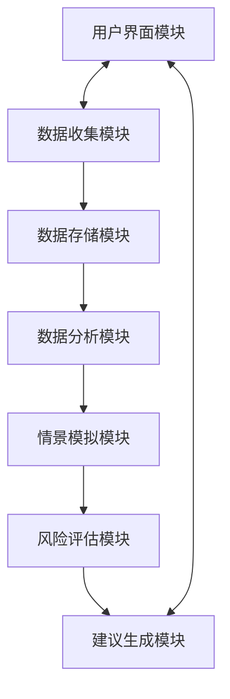

# 智能个人财务stress testing工具

> 关键词：智能个人财务、压力测试工具、风险评估、财务规划、数据分析、风险管理、金融科技

> 摘要：本文围绕智能个人财务压力测试工具展开深入探讨。随着个人财务状况日益复杂，人们对准确评估自身财务风险的需求愈发迫切。智能个人财务压力测试工具应运而生，它借助先进的数据分析和算法，能够模拟各种极端情况，帮助用户了解自身财务的稳健性。文章详细阐述了该工具的核心概念、算法原理、数学模型，通过项目实战展示其具体实现过程，探讨了实际应用场景，并推荐了相关的学习资源、开发工具和论文著作。最后对其未来发展趋势与挑战进行总结，为用户和开发者提供全面的参考。

## 1. 背景介绍 
### 1.1 目的和范围
在当今复杂多变的经济环境下，个人面临着诸多财务风险，如市场波动、就业不稳定、突发疾病等。智能个人财务压力测试工具的目的在于帮助个人全面、准确地评估自身财务状况在各种不利情况下的承受能力，从而提前做好应对措施，实现财务的稳健管理。

本工具的范围涵盖个人的主要财务方面，包括收入、支出、资产、负债等。通过模拟不同的压力情景，如失业、重大疾病、市场暴跌等，分析这些情景对个人财务状况的影响，为个人提供有针对性的财务建议。

### 1.2 预期读者
本文的预期读者包括普通个人用户，他们希望借助该工具更好地管理自己的财务，了解自身财务风险；金融从业者，如理财顾问、投资经理等，可将其作为辅助工具，为客户提供更专业的财务规划建议；以及对该领域感兴趣的开发者和研究人员，他们可以从技术实现和理论研究的角度深入了解智能个人财务压力测试工具。

### 1.3 文档结构概述
本文首先介绍智能个人财务压力测试工具的背景信息，包括目的、预期读者和文档结构。接着阐述核心概念与联系，通过文本示意图和Mermaid流程图展示其原理和架构。然后详细讲解核心算法原理和具体操作步骤，结合Python源代码进行说明。随后介绍数学模型和公式，并举例说明。通过项目实战部分，展示开发环境搭建、源代码实现和代码解读。探讨实际应用场景，推荐相关的工具和资源，包括学习资源、开发工具框架和论文著作。最后总结未来发展趋势与挑战，提供常见问题与解答以及扩展阅读和参考资料。

### 1.4 术语表
#### 1.4.1 核心术语定义
- **智能个人财务压力测试工具**：一种利用先进技术和算法，模拟各种不利情景，对个人财务状况进行风险评估和压力测试的工具。
- **压力情景**：指可能对个人财务状况产生重大影响的不利事件或情况，如失业、市场暴跌、重大疾病等。
- **财务稳健性**：个人财务状况在面对各种压力情景时的承受能力和稳定性。
- **风险评估**：对个人财务面临的各种风险进行识别、分析和评估的过程。

#### 1.4.2 相关概念解释
- **资产负债表**：记录个人在某一特定日期的资产和负债情况的报表，反映个人的财务状况。
- **现金流量表**：记录个人在一定时期内现金流入和流出情况的报表，反映个人的资金动态。
- **蒙特卡罗模拟**：一种通过随机抽样来模拟各种可能结果的统计方法，常用于风险评估和预测。

#### 1.4.3 缩略词列表
- **AI**：Artificial Intelligence，人工智能
- **ML**：Machine Learning，机器学习
- **API**：Application Programming Interface，应用程序编程接口

## 2. 核心概念与联系 
### 核心概念原理
智能个人财务压力测试工具的核心原理是基于对个人财务数据的收集、分析和模拟。首先，收集个人的收入、支出、资产、负债等详细财务数据。然后，利用这些数据构建个人财务模型。通过设定各种压力情景，如失业导致收入中断、市场暴跌导致资产价值缩水等，将这些情景代入财务模型中进行模拟计算。最后，根据模拟结果评估个人财务在不同压力情景下的稳健性，并提供相应的风险预警和财务建议。

### 架构的文本示意图
智能个人财务压力测试工具主要由以下几个部分组成：
1. **数据收集模块**：负责收集个人的各种财务数据，包括银行账户信息、投资记录、信用卡账单等。
2. **数据存储模块**：将收集到的财务数据进行安全存储，以便后续分析和处理。
3. **数据分析模块**：对存储的财务数据进行清洗、整理和分析，提取有用的信息。
4. **情景模拟模块**：设定各种压力情景，并将其代入个人财务模型进行模拟计算。
5. **风险评估模块**：根据模拟结果评估个人财务的风险程度，给出风险等级和相应的风险预警。
6. **建议生成模块**：根据风险评估结果，为个人提供针对性的财务建议，如调整资产配置、增加储蓄等。
7. **用户界面模块**：为用户提供友好的交互界面，方便用户输入财务数据、查看测试结果和获取财务建议。

### Mermaid流程图


## 3. 核心算法原理 & 具体操作步骤 
### 核心算法原理
智能个人财务压力测试工具主要使用蒙特卡罗模拟算法和风险评估算法。

#### 蒙特卡罗模拟算法
蒙特卡罗模拟算法是一种通过随机抽样来模拟各种可能结果的统计方法。在个人财务压力测试中，我们可以利用该算法模拟不同压力情景下个人财务的变化情况。具体步骤如下：
1. 确定模拟的参数，如收入、支出、资产收益率等的概率分布。
2. 随机生成这些参数的值，根据个人财务模型计算出相应的财务指标，如净资产、现金流量等。
3. 重复步骤2多次，得到大量的模拟结果。
4. 对模拟结果进行统计分析，如计算平均值、标准差、置信区间等，以评估个人财务在不同压力情景下的风险程度。

#### 风险评估算法
风险评估算法主要基于模拟结果对个人财务的风险程度进行评估。常见的风险评估指标包括风险价值（VaR）、条件风险价值（CVaR）等。

风险价值（VaR）是指在一定的置信水平下，个人财务在未来一段时间内可能遭受的最大损失。条件风险价值（CVaR）是指在损失超过VaR的情况下，平均的损失金额。

### 具体操作步骤
#### 步骤1：数据收集
通过用户输入、API接口等方式收集个人的财务数据，包括收入、支出、资产、负债等信息。

#### 步骤2：数据预处理
对收集到的财务数据进行清洗、整理和标准化处理，去除异常值和缺失值，确保数据的准确性和一致性。

#### 步骤3：构建个人财务模型
根据个人的财务数据，构建个人财务模型，包括资产负债表、现金流量表等。

#### 步骤4：设定压力情景
根据实际情况设定各种压力情景，如失业、市场暴跌、重大疾病等。

#### 步骤5：蒙特卡罗模拟
利用蒙特卡罗模拟算法，对不同压力情景下个人财务的变化情况进行模拟。

#### 步骤6：风险评估
根据模拟结果，使用风险评估算法计算风险价值（VaR）、条件风险价值（CVaR）等风险指标，评估个人财务的风险程度。

#### 步骤7：生成财务建议
根据风险评估结果，为个人提供针对性的财务建议，如调整资产配置、增加储蓄等。

### Python源代码实现
```python
import numpy as np

# 定义个人财务数据
income_mean = 5000  # 月收入均值
income_std = 500    # 月收入标准差
expense_mean = 3000 # 月支出均值
expense_std = 300   # 月支出标准差
asset_value = 100000 # 资产价值
debt_value = 50000  # 负债价值
interest_rate = 0.05 # 资产收益率

# 定义模拟参数
num_simulations = 1000  # 模拟次数
simulation_period = 12  # 模拟周期（月）

# 蒙特卡罗模拟
def monte_carlo_simulation():
    net_asset_list = []
    for _ in range(num_simulations):
        net_asset = asset_value - debt_value
        for _ in range(simulation_period):
            income = np.random.normal(income_mean, income_std)
            expense = np.random.normal(expense_mean, expense_std)
            asset_return = net_asset * interest_rate * np.random.normal(1, 0.1)
            net_asset = net_asset + income - expense + asset_return
        net_asset_list.append(net_asset)
    return net_asset_list

# 风险评估
def risk_assessment(net_asset_list, confidence_level=0.95):
    sorted_net_asset = np.sort(net_asset_list)
    var_index = int((1 - confidence_level) * num_simulations)
    var = sorted_net_asset[var_index]
    cvar = np.mean(sorted_net_asset[:var_index])
    return var, cvar

# 执行模拟和风险评估
net_asset_list = monte_carlo_simulation()
var, cvar = risk_assessment(net_asset_list)

print(f"风险价值（VaR）: {var}")
print(f"条件风险价值（CVaR）: {cvar}")
```

## 4. 数学模型和公式 & 详细讲解 & 举例说明 
### 数学模型
智能个人财务压力测试工具主要基于以下数学模型：

#### 资产负债模型
资产负债模型用于描述个人在某一特定日期的资产和负债情况。其基本公式为：
$$Net\ Asset = Assets - Liabilities$$
其中，$Net\ Asset$ 表示净资产，$Assets$ 表示资产总额，$Liabilities$ 表示负债总额。

#### 现金流量模型
现金流量模型用于描述个人在一定时期内现金流入和流出情况。其基本公式为：
$$Cash\ Flow = Income - Expense$$
其中，$Cash\ Flow$ 表示现金流量，$Income$ 表示收入，$Expense$ 表示支出。

#### 资产收益模型
资产收益模型用于描述资产在一定时期内的收益情况。其基本公式为：
$$Asset\ Return = Asset\ Value \times Interest\ Rate$$
其中，$Asset\ Return$ 表示资产收益，$Asset\ Value$ 表示资产价值，$Interest\ Rate$ 表示资产收益率。

### 风险评估公式
#### 风险价值（VaR）
风险价值（VaR）是指在一定的置信水平下，个人财务在未来一段时间内可能遭受的最大损失。其计算公式为：
$$VaR_{\alpha} = - \inf \{ x \in \mathbb{R} : F(x) \geq \alpha \}$$
其中，$\alpha$ 表示置信水平，$F(x)$ 表示损失分布函数。

#### 条件风险价值（CVaR）
条件风险价值（CVaR）是指在损失超过VaR的情况下，平均的损失金额。其计算公式为：
$$CVaR_{\alpha} = \frac{1}{1 - \alpha} \int_{\alpha}^{1} VaR_{u} du$$

### 举例说明
假设个人的资产价值为 $100000$ 元，负债价值为 $50000$ 元，月收入均值为 $5000$ 元，月支出均值为 $3000$ 元，资产收益率为 $5\%$。我们进行 $1000$ 次蒙特卡罗模拟，模拟周期为 $12$ 个月，置信水平为 $95\%$。

通过上述Python代码进行模拟和风险评估，得到风险价值（VaR）和条件风险价值（CVaR）。假设模拟结果为：风险价值（VaR）为 $80000$ 元，条件风险价值（CVaR）为 $75000$ 元。这意味着在 $95\%$ 的置信水平下，个人在未来 $12$ 个月内可能遭受的最大损失为 $80000$ 元，在损失超过 $80000$ 元的情况下，平均的损失金额为 $75000$ 元。

## 5. 项目实战：代码实际案例和详细解释说明 
### 5.1  开发环境搭建
#### 操作系统
可以选择Windows、Linux或macOS等常见操作系统。

#### 编程语言
使用Python作为开发语言，Python具有丰富的库和工具，适合数据处理、模拟计算和风险评估等任务。

#### 开发工具
推荐使用PyCharm作为集成开发环境（IDE），它提供了强大的代码编辑、调试和管理功能。

#### 依赖库安装
在命令行中使用以下命令安装所需的依赖库：
```sh
pip install numpy pandas matplotlib
```
其中，`numpy` 用于数值计算，`pandas` 用于数据处理，`matplotlib` 用于数据可视化。

### 5.2  源代码详细实现和代码解读
```python
import numpy as np
import pandas as pd
import matplotlib.pyplot as plt

# 定义个人财务数据
income_mean = 5000  # 月收入均值
income_std = 500    # 月收入标准差
expense_mean = 3000 # 月支出均值
expense_std = 300   # 月支出标准差
asset_value = 100000 # 资产价值
debt_value = 50000  # 负债价值
interest_rate = 0.05 # 资产收益率

# 定义模拟参数
num_simulations = 1000  # 模拟次数
simulation_period = 12  # 模拟周期（月）

# 蒙特卡罗模拟
def monte_carlo_simulation():
    net_asset_list = []
    for _ in range(num_simulations):
        net_asset = asset_value - debt_value
        cash_flow_list = []
        for _ in range(simulation_period):
            income = np.random.normal(income_mean, income_std)
            expense = np.random.normal(expense_mean, expense_std)
            asset_return = net_asset * interest_rate * np.random.normal(1, 0.1)
            cash_flow = income - expense + asset_return
            net_asset = net_asset + cash_flow
            cash_flow_list.append(cash_flow)
        net_asset_list.append(net_asset)
        # 保存每次模拟的现金流量数据
        df = pd.DataFrame(cash_flow_list, columns=['Cash Flow'])
        df.to_csv(f'simulation_{len(net_asset_list)}.csv', index=False)
    return net_asset_list

# 风险评估
def risk_assessment(net_asset_list, confidence_level=0.95):
    sorted_net_asset = np.sort(net_asset_list)
    var_index = int((1 - confidence_level) * num_simulations)
    var = sorted_net_asset[var_index]
    cvar = np.mean(sorted_net_asset[:var_index])
    return var, cvar

# 执行模拟和风险评估
net_asset_list = monte_carlo_simulation()
var, cvar = risk_assessment(net_asset_list)

print(f"风险价值（VaR）: {var}")
print(f"条件风险价值（CVaR）: {cvar}")

# 数据可视化
plt.hist(net_asset_list, bins=50, density=True)
plt.title('Net Asset Distribution')
plt.xlabel('Net Asset')
plt.ylabel('Density')
plt.show()
```

### 代码解读与分析
1. **数据定义**：定义了个人的财务数据和模拟参数，包括收入、支出、资产、负债、收益率、模拟次数和模拟周期等。
2. **蒙特卡罗模拟**：在 `monte_carlo_simulation` 函数中，通过循环进行多次模拟。每次模拟中，随机生成收入、支出和资产收益，计算现金流量和净资产，并将每次模拟的现金流量数据保存为CSV文件。
3. **风险评估**：在 `risk_assessment` 函数中，根据模拟结果计算风险价值（VaR）和条件风险价值（CVaR）。
4. **数据可视化**：使用 `matplotlib` 库绘制净资产分布直方图，直观展示模拟结果的分布情况。

## 6. 实际应用场景 
### 个人财务规划
个人可以使用智能个人财务压力测试工具来评估自己的财务状况在不同压力情景下的稳定性。例如，在考虑购房、创业等重大财务决策时，通过模拟失业、市场波动等压力情景，了解自己的财务承受能力，从而制定合理的财务规划。

### 理财顾问服务
理财顾问可以利用该工具为客户提供更专业的财务规划建议。通过对客户的财务数据进行分析和模拟，理财顾问可以准确评估客户的风险承受能力，为客户制定个性化的资产配置方案，并在市场变化时及时调整建议。

### 金融机构风险管理
金融机构可以将智能个人财务压力测试工具用于个人客户的风险管理。在发放贷款、信用卡等金融产品时，通过对客户的财务状况进行压力测试，评估客户的还款能力和违约风险，从而降低金融机构的风险。

### 教育和培训
该工具可以作为教育和培训的案例，帮助学生和从业人员了解个人财务风险管理的重要性和方法。通过实际操作和模拟，让学习者更好地掌握财务分析和风险评估的技能。

## 7. 工具和资源推荐
### 7.1 学习资源推荐
#### 7.1.1 书籍推荐
- 《财务风险管理》：全面介绍了财务风险管理的理论和方法，包括风险评估、风险控制等内容。
- 《Python数据分析实战》：详细讲解了Python在数据分析领域的应用，包括数据处理、统计分析、可视化等方面的知识。
- 《金融数学》：介绍了金融领域的数学模型和方法，为理解智能个人财务压力测试工具的数学原理提供了理论基础。

#### 7.1.2 在线课程
- Coursera上的“Financial Risk Management”：由知名大学教授授课，系统讲解了财务风险管理的知识和技能。
- edX上的“Python for Data Science”：通过实际案例和项目，帮助学习者掌握Python在数据分析中的应用。
- Udemy上的“Financial Modeling and Valuation in Python”：介绍了如何使用Python进行金融建模和估值。

#### 7.1.3 技术博客和网站
- Medium：有许多关于数据分析、金融科技等领域的优质博客文章，可以获取最新的技术动态和实践经验。
- Towards Data Science：专注于数据科学和机器学习领域的技术分享，提供了大量的代码示例和案例分析。
- Investopedia：是一个专业的金融知识网站，提供了丰富的金融术语解释、投资策略和市场分析等内容。

### 7.2 开发工具框架推荐
#### 7.2.1 IDE和编辑器
- PyCharm：功能强大的Python集成开发环境，提供了代码编辑、调试、版本控制等多种功能。
- Jupyter Notebook：交互式的开发环境，适合进行数据分析和模型开发，方便代码的展示和分享。
- Visual Studio Code：轻量级的代码编辑器，支持多种编程语言和插件，具有良好的扩展性。

#### 7.2.2 调试和性能分析工具
- PDB：Python自带的调试工具，可以帮助开发者定位和解决代码中的问题。
- cProfile：Python的性能分析工具，可以分析代码的执行时间和资源消耗情况，帮助优化代码性能。
- Py-Spy：用于实时分析Python程序的性能，提供可视化的性能分析报告。

#### 7.2.3 相关框架和库
- NumPy：用于高效的数值计算，提供了多维数组对象和各种数学函数。
- Pandas：用于数据处理和分析，提供了数据结构和数据操作工具。
- Matplotlib：用于数据可视化，提供了丰富的绘图功能。
- Scikit-learn：用于机器学习和数据挖掘，提供了各种机器学习算法和工具。

### 7.3 相关论文著作推荐
#### 7.3.1 经典论文
- “Value at Risk: The New Benchmark for Managing Financial Risk”：介绍了风险价值（VaR）的概念和计算方法，是金融风险管理领域的经典论文。
- “Monte Carlo Methods in Financial Engineering”：详细阐述了蒙特卡罗模拟在金融工程中的应用，为智能个人财务压力测试工具的模拟算法提供了理论支持。
- “Risk Management and Financial Institutions”：系统介绍了金融机构的风险管理理论和实践，对理解个人财务风险管理具有重要的参考价值。

#### 7.3.2 最新研究成果
- 关注顶级金融期刊和学术会议，如《Journal of Financial Economics》、《Review of Financial Studies》等，获取关于个人财务风险管理和智能金融工具的最新研究成果。
- 关注知名研究机构的研究报告，如国际货币基金组织（IMF）、世界银行等发布的关于金融稳定和风险管理的报告。

#### 7.3.3 应用案例分析
- 参考金融机构和咨询公司发布的个人财务风险管理应用案例，了解实际应用中智能个人财务压力测试工具的使用方法和效果。
- 分析互联网金融公司的风险管理实践，学习其在数据收集、模型构建和风险评估等方面的经验。

## 8. 总结：未来发展趋势与挑战
### 未来发展趋势
#### 智能化和自动化
随着人工智能和机器学习技术的不断发展，智能个人财务压力测试工具将变得更加智能化和自动化。工具可以自动收集和分析个人财务数据，自动生成风险评估报告和财务建议，为用户提供更加便捷和高效的服务。

#### 个性化和定制化
未来的工具将更加注重个性化和定制化。根据用户的不同需求和财务状况，提供个性化的压力情景模拟和财务建议，满足用户的多样化需求。

#### 与其他金融服务的融合
智能个人财务压力测试工具将与其他金融服务进行深度融合，如银行理财、保险规划、投资顾问等。通过整合不同的金融服务，为用户提供一站式的金融解决方案。

#### 数据安全和隐私保护
随着个人财务数据的重要性日益凸显，数据安全和隐私保护将成为未来发展的重要方向。工具开发者将采用更加先进的技术和措施，确保用户数据的安全和隐私。

### 挑战
#### 数据质量和准确性
个人财务数据的质量和准确性直接影响压力测试结果的可靠性。然而，数据收集过程中可能存在数据缺失、错误、不一致等问题，需要采取有效的数据清洗和预处理措施，提高数据质量。

#### 模型的复杂性和可解释性
智能个人财务压力测试工具使用的模型越来越复杂，这增加了模型的可解释性难度。用户和监管机构需要理解模型的原理和计算过程，以便对测试结果进行评估和决策。因此，如何提高模型的可解释性是一个重要的挑战。

#### 法律法规和监管要求
个人财务数据涉及用户的隐私和权益，受到严格的法律法规和监管要求的约束。工具开发者需要遵守相关法律法规，确保工具的合法合规运行。

#### 技术更新和创新
金融市场和技术环境不断变化，智能个人财务压力测试工具需要不断更新和创新，以适应新的市场需求和技术发展。开发者需要持续关注行业动态，投入研发资源，保持工具的竞争力。

## 9. 附录：常见问题与解答
### 问题1：智能个人财务压力测试工具的结果准确吗？
解答：智能个人财务压力测试工具的结果是基于一定的假设和模型计算得出的，具有一定的不确定性。其准确性受到数据质量、模型选择和参数设置等多种因素的影响。因此，测试结果仅供参考，不能完全替代专业的财务建议。

### 问题2：如何确保个人财务数据的安全？
解答：工具开发者通常会采用多种安全措施来确保个人财务数据的安全，如数据加密、访问控制、安全审计等。用户在使用工具时，也应注意选择正规、可靠的工具，并保护好自己的账号和密码。

### 问题3：智能个人财务压力测试工具可以替代理财顾问吗？
解答：不能。虽然智能个人财务压力测试工具可以提供一定的风险评估和财务建议，但理财顾问具有专业的知识和经验，能够根据用户的具体情况进行个性化的分析和建议。因此，工具可以作为理财顾问的辅助工具，而不能完全替代理财顾问。

### 问题4：如何选择适合自己的压力情景？
解答：选择压力情景应根据个人的实际情况和风险承受能力来确定。一般来说，可以考虑常见的压力情景，如失业、市场暴跌、重大疾病等。同时，也可以根据自己的特殊情况，设定个性化的压力情景。

## 10. 扩展阅读 & 参考资料
### 扩展阅读
- 《富爸爸穷爸爸》：通过生动的故事和案例，介绍了个人理财的重要性和方法。
- 《小狗钱钱》：一本适合初学者的理财启蒙书籍，以有趣的方式传授理财知识。
- 《聪明的投资者》：价值投资领域的经典著作，对个人投资决策具有重要的指导意义。

### 参考资料
- 相关的金融法律法规和监管文件，如《中华人民共和国商业银行法》、《个人金融信息保护规范》等。
- 金融机构和研究机构发布的行业报告和研究成果，如《中国金融稳定报告》、《全球金融科技发展报告》等。
- 相关的学术论文和书籍，如前文推荐的《财务风险管理》、《Python数据分析实战》等。