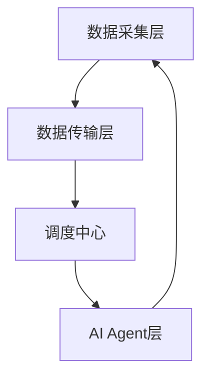

# 智能交通系统中的AI Agent调度中心

> 关键词：智能交通系统、AI Agent、调度中心、交通优化、多智能体系统、实时调度、交通流控制

> 摘要：本文围绕智能交通系统中的AI Agent调度中心展开深入探讨。首先介绍了智能交通系统的背景以及AI Agent调度中心的重要性和研究范围，明确预期读者群体和文档结构。接着阐述核心概念，包括AI Agent、调度中心等，给出原理和架构示意图及流程图。详细讲解核心算法原理，用Python代码展示具体操作步骤，并从数学模型和公式层面深入剖析。通过项目实战，介绍开发环境搭建、源代码实现与解读。探讨实际应用场景，推荐相关工具和资源，最后总结未来发展趋势与挑战，提供常见问题解答和扩展阅读参考资料，旨在全面阐述AI Agent调度中心在智能交通系统中的关键作用和技术细节。

## 1. 背景介绍 
### 1.1 目的和范围
随着城市化进程的加速和机动车保有量的迅猛增长，交通拥堵、交通事故频发等问题日益严重，给人们的出行和社会经济发展带来了巨大的负面影响。智能交通系统（Intelligent Transportation System，ITS）作为解决交通问题的有效手段应运而生。其中，AI Agent调度中心在智能交通系统中起着核心的调度和协调作用，旨在通过智能的决策和优化算法，实现交通资源的合理分配，提高交通效率，减少拥堵，降低交通事故发生率。

本文的研究范围主要聚焦于AI Agent调度中心在智能交通系统中的原理、算法、实现和应用。涵盖从基本概念的介绍到核心算法的深入分析，再到实际项目的案例展示，以及相关工具和资源的推荐等方面。

### 1.2 预期读者
本文预期读者包括交通工程领域的研究人员和工程师，他们可以从文中获取AI Agent调度中心在智能交通系统中应用的最新技术和方法，为其研究和实践提供参考；计算机科学领域的专业人士，如人工智能专家、程序员等，能够了解智能交通系统的需求和特点，将AI技术更好地应用于交通领域；对智能交通系统感兴趣的学生和爱好者，通过本文可以系统地学习AI Agent调度中心的相关知识，为进一步深入研究打下基础。

### 1.3 文档结构概述
本文将按照以下结构进行阐述：首先介绍背景信息，包括目的、范围、预期读者和文档结构概述等；接着讲解核心概念与联系，通过文本示意图和Mermaid流程图清晰展示相关概念的原理和架构；然后详细阐述核心算法原理，并给出Python源代码实现具体操作步骤；从数学模型和公式的角度进行深入分析，并举例说明；通过项目实战，介绍开发环境搭建、源代码实现和代码解读；探讨AI Agent调度中心在智能交通系统中的实际应用场景；推荐相关的工具和资源，包括学习资源、开发工具框架和相关论文著作；最后总结未来发展趋势与挑战，提供常见问题解答和扩展阅读参考资料。

### 1.4 术语表
#### 1.4.1 核心术语定义
- **智能交通系统（Intelligent Transportation System，ITS）**：将先进的信息技术、通信技术、传感技术、控制技术和计算机技术等有效地集成运用于整个交通运输管理体系，从而建立起一种在大范围内、全方位发挥作用的，实时、准确、高效的综合运输和管理系统。
- **AI Agent（人工智能智能体）**：是一种能够感知环境、自主决策并采取行动以实现特定目标的智能实体。在智能交通系统中，AI Agent可以代表车辆、交通信号控制器、交通管理中心等不同的交通参与者。
- **调度中心**：负责对智能交通系统中的各种AI Agent进行协调和调度的核心机构，通过收集和分析交通信息，制定合理的调度策略，以优化交通流。

#### 1.4.2 相关概念解释
- **多智能体系统（Multi - Agent System，MAS）**：由多个AI Agent组成的系统，这些智能体之间可以相互通信、协作和竞争，共同完成复杂的任务。在智能交通系统中，多智能体系统可以用于模拟和优化交通行为。
- **交通流**：指在单位时间内，通过道路某一地点、某一断面或某一车道的交通实体数。交通流的特性包括流量、速度和密度等。
- **实时调度**：根据实时的交通信息，动态地调整AI Agent的行为和任务分配，以适应交通状况的变化。

#### 1.4.3 缩略词列表
- **ITS**：Intelligent Transportation System（智能交通系统）
- **MAS**：Multi - Agent System（多智能体系统）

## 2. 核心概念与联系 
### 核心概念原理
在智能交通系统中，AI Agent是核心的组成部分。每个AI Agent都具有一定的感知能力，能够收集周围的交通信息，如车辆的位置、速度、交通信号灯的状态等。基于这些信息，AI Agent可以进行自主决策，例如选择行驶路线、调整车速等。

调度中心作为整个系统的核心控制机构，负责收集各个AI Agent的信息，并对其进行分析和处理。调度中心根据交通状况和预设的目标，制定调度策略，向各个AI Agent发送指令，协调它们的行为，以实现交通的优化。

### 架构示意图
智能交通系统中的AI Agent调度中心架构主要包括以下几个部分：
- **数据采集层**：通过各种传感器（如摄像头、雷达、地磁传感器等）收集交通信息，包括车辆的位置、速度、流量等。
- **数据传输层**：将采集到的交通信息传输到调度中心，通常采用有线或无线通信技术。
- **调度中心**：对收集到的交通信息进行处理和分析，制定调度策略，并向各个AI Agent发送指令。
- **AI Agent层**：包括车辆、交通信号控制器等不同类型的AI Agent，它们接收调度中心的指令，并根据自身的状态和环境信息进行决策和行动。

下面是文本示意图：

```plaintext
+-------------------+
|  数据采集层       |
|  (传感器网络)     |
+-------------------+
         |
         v
+-------------------+
|  数据传输层       |
|  (通信网络)       |
+-------------------+
         |
         v
+-------------------+
|  调度中心         |
|  (决策与控制)     |
+-------------------+
         |
         v
+-------------------+
|  AI Agent层       |
|  (车辆、信号控制器等) |
+-------------------+
```

### Mermaid流程图


这个流程图展示了智能交通系统中信息的流动过程。数据采集层收集交通信息，通过数据传输层发送到调度中心。调度中心进行分析和决策后，向AI Agent层发送指令。AI Agent层根据指令行动，并将新的信息反馈给数据采集层，形成一个闭环的系统。

## 3. 核心算法原理 & 具体操作步骤 
### 核心算法原理
在AI Agent调度中心中，常用的核心算法包括基于规则的调度算法、遗传算法、蚁群算法和强化学习算法等。这里我们以强化学习算法为例进行详细讲解。

强化学习是一种通过智能体与环境进行交互，不断尝试不同的动作，并根据环境反馈的奖励信号来学习最优策略的机器学习方法。在智能交通系统中，AI Agent可以看作是智能体，交通环境是环境，调度策略就是智能体的动作。

强化学习的基本原理可以用马尔可夫决策过程（Markov Decision Process，MDP）来描述。MDP由一个四元组 $(S, A, P, R)$ 组成，其中：
- $S$ 是状态空间，表示智能体所处的环境状态。在智能交通系统中，状态可以包括车辆的位置、速度、交通信号灯的状态、道路拥堵情况等。
- $A$ 是动作空间，表示智能体可以采取的动作。例如，车辆可以选择加速、减速、转弯等动作，交通信号控制器可以调整信号灯的时长。
- $P$ 是状态转移概率，表示在当前状态 $s$ 下采取动作 $a$ 后，转移到下一个状态 $s'$ 的概率，即 $P(s'|s, a)$。
- $R$ 是奖励函数，表示在当前状态 $s$ 下采取动作 $a$ 后，获得的即时奖励 $R(s, a)$。奖励函数的设计通常与系统的目标相关，例如减少交通拥堵、提高通行效率等。

智能体的目标是通过不断地与环境交互，学习到一个最优策略 $\pi^*(s)$，使得长期累积奖励最大。

### 具体操作步骤
以下是使用Python实现一个简单的基于强化学习的AI Agent调度算法的具体步骤和代码示例：

```python
import numpy as np

# 定义状态空间、动作空间和奖励函数
# 假设状态空间有10个状态，动作空间有3个动作
state_space_size = 10
action_space_size = 3

# 初始化Q表
q_table = np.zeros((state_space_size, action_space_size))

# 定义超参数
learning_rate = 0.1
discount_rate = 0.99
exploration_rate = 1
max_exploration_rate = 1
min_exploration_rate = 0.01
exploration_decay_rate = 0.001

# 模拟环境的状态转移和奖励反馈
def get_next_state_and_reward(current_state, action):
    # 这里简单模拟状态转移和奖励反馈
    next_state = (current_state + action) % state_space_size
    if next_state == 5:
        reward = 10
    else:
        reward = -1
    return next_state, reward

# 训练过程
num_episodes = 1000
for episode in range(num_episodes):
    state = np.random.randint(0, state_space_size)
    done = False

    while not done:
        # 选择动作（使用epsilon-greedy策略）
        exploration_rate_threshold = np.random.uniform(0, 1)
        if exploration_rate_threshold > exploration_rate:
            action = np.argmax(q_table[state, :])
        else:
            action = np.random.randint(0, action_space_size)

        # 执行动作，获取下一个状态和奖励
        next_state, reward = get_next_state_and_reward(state, action)

        # 更新Q表
        q_table[state, action] = q_table[state, action] + learning_rate * (reward + discount_rate * np.max(q_table[next_state, :]) - q_table[state, action])

        state = next_state

        if state == 5:
            done = True

    # 衰减探索率
    exploration_rate = min_exploration_rate + (max_exploration_rate - min_exploration_rate) * np.exp(-exploration_decay_rate * episode)

# 输出训练好的Q表
print("Trained Q-table:")
print(q_table)
```

### 代码解释
1. **初始化Q表**：Q表是一个二维数组，用于存储每个状态下每个动作的价值。初始时，所有的值都设为0。
2. **定义超参数**：包括学习率、折扣率、探索率等。学习率控制Q表更新的步长，折扣率表示未来奖励的重要性，探索率用于平衡探索和利用。
3. **模拟环境的状态转移和奖励反馈**：`get_next_state_and_reward` 函数模拟了智能体在环境中执行动作后，环境返回的下一个状态和奖励。
4. **训练过程**：使用epsilon - greedy策略选择动作，根据环境反馈的奖励更新Q表。在每个回合结束后，衰减探索率，逐渐减少探索的比例。
5. **输出训练好的Q表**：训练完成后，输出训练好的Q表，智能体可以根据Q表选择最优动作。

## 4. 数学模型和公式 & 详细讲解 & 举例说明 
### 马尔可夫决策过程（MDP）
如前所述，马尔可夫决策过程由四元组 $(S, A, P, R)$ 组成。其核心公式是贝尔曼方程，用于描述最优价值函数和最优策略之间的关系。

#### 状态价值函数
状态价值函数 $V^\pi(s)$ 表示在策略 $\pi$ 下，从状态 $s$ 开始的长期累积奖励的期望，定义为：
$$V^\pi(s) = \mathbb{E}_\pi\left[\sum_{t = 0}^{\infty}\gamma^tR_{t + 1}|S_0 = s\right]$$
其中，$\gamma$ 是折扣因子，$0 \leq \gamma \leq 1$，用于控制未来奖励的重要性。

#### 动作价值函数
动作价值函数 $Q^\pi(s, a)$ 表示在策略 $\pi$ 下，从状态 $s$ 执行动作 $a$ 后，再继续按照策略 $\pi$ 行动的长期累积奖励的期望，定义为：
$$Q^\pi(s, a) = \mathbb{E}_\pi\left[\sum_{t = 0}^{\infty}\gamma^tR_{t + 1}|S_0 = s, A_0 = a\right]$$

#### 贝尔曼方程
状态价值函数和动作价值函数满足贝尔曼方程：
$$V^\pi(s) = \sum_{a \in A}\pi(a|s)Q^\pi(s, a)$$
$$Q^\pi(s, a) = R(s, a) + \gamma\sum_{s' \in S}P(s'|s, a)V^\pi(s')$$

#### 最优价值函数和最优策略
最优状态价值函数 $V^*(s)$ 和最优动作价值函数 $Q^*(s, a)$ 分别定义为：
$$V^*(s) = \max_{\pi}V^\pi(s)$$
$$Q^*(s, a) = \max_{\pi}Q^\pi(s, a)$$

最优策略 $\pi^*(s)$ 可以通过最优动作价值函数得到：
$$\pi^*(s) = \arg\max_{a}Q^*(s, a)$$

### 举例说明
假设一个简单的智能交通场景，有一个十字路口，交通信号灯有两种状态：绿灯和红灯。车辆有两种动作：前进和等待。状态空间 $S = \{s_1, s_2\}$，其中 $s_1$ 表示绿灯状态，$s_2$ 表示红灯状态；动作空间 $A = \{a_1, a_2\}$，其中 $a_1$ 表示前进，$a_2$ 表示等待。

状态转移概率矩阵 $P$ 如下：
$$P = \begin{bmatrix}
P(s_1|s_1, a_1) & P(s_2|s_1, a_1) \\
P(s_1|s_1, a_2) & P(s_2|s_1, a_2) \\
P(s_1|s_2, a_1) & P(s_2|s_2, a_1) \\
P(s_1|s_2, a_2) & P(s_2|s_2, a_2)
\end{bmatrix}=\begin{bmatrix}
0.8 & 0.2 \\
0.9 & 0.1 \\
0.1 & 0.9 \\
0.2 & 0.8
\end{bmatrix}$$

奖励函数 $R$ 如下：
$$R = \begin{bmatrix}
R(s_1, a_1) & R(s_1, a_2) \\
R(s_2, a_1) & R(s_2, a_2)
\end{bmatrix}=\begin{bmatrix}
10 & -1 \\
-10 & 0
\end{bmatrix}$$

折扣因子 $\gamma = 0.9$。

我们可以根据贝尔曼方程计算最优价值函数和最优策略。首先，初始化 $V^0(s) = 0$，然后迭代更新：
$$V^{k + 1}(s) = \max_{a}\left[R(s, a) + \gamma\sum_{s' \in S}P(s'|s, a)V^k(s')\right]$$

经过多次迭代，最终收敛到最优状态价值函数 $V^*(s)$，进而得到最优策略 $\pi^*(s)$。

## 5. 项目实战：代码实际案例和详细解释说明 
### 5.1  开发环境搭建
#### 操作系统
可以选择Windows、Linux或macOS等常见的操作系统。这里以Ubuntu 20.04为例进行说明。

#### 编程语言和开发工具
- **Python**：版本3.7及以上。可以使用以下命令安装Python：
```bash
sudo apt update
sudo apt install python3 python3-pip
```
- **IDE**：推荐使用PyCharm或VS Code。PyCharm是一款功能强大的Python集成开发环境，提供了代码编辑、调试、自动补全等功能；VS Code是一款轻量级的代码编辑器，通过安装Python扩展可以实现Python开发的各种功能。

#### 相关库的安装
- **NumPy**：用于数值计算。可以使用以下命令安装：
```bash
pip install numpy
```
- **OpenAI Gym**：一个用于开发和比较强化学习算法的工具包。可以使用以下命令安装：
```bash
pip install gym
```

### 5.2  源代码详细实现和代码解读
以下是一个使用OpenAI Gym库实现的简单智能交通模拟环境的代码示例：

```python
import gym
from gym import spaces
import numpy as np

class TrafficEnv(gym.Env):
    def __init__(self):
        # 定义状态空间和动作空间
        self.state_space_size = 10
        self.action_space_size = 3
        self.observation_space = spaces.Discrete(self.state_space_size)
        self.action_space = spaces.Discrete(self.action_space_size)

        # 初始化状态
        self.state = np.random.randint(0, self.state_space_size)

    def step(self, action):
        # 执行动作，获取下一个状态和奖励
        next_state = (self.state + action) % self.state_space_size
        if next_state == 5:
            reward = 10
        else:
            reward = -1

        # 判断是否结束
        done = (next_state == 5)

        # 可选的信息
        info = {}

        # 更新状态
        self.state = next_state

        return next_state, reward, done, info

    def reset(self):
        # 重置环境状态
        self.state = np.random.randint(0, self.state_space_size)
        return self.state

    def render(self, mode='human'):
        # 渲染环境（这里简单打印状态）
        print(f"Current state: {self.state}")

    def close(self):
        # 关闭环境
        pass

# 使用环境进行训练
env = TrafficEnv()
num_episodes = 1000
learning_rate = 0.1
discount_rate = 0.99
exploration_rate = 1
max_exploration_rate = 1
min_exploration_rate = 0.01
exploration_decay_rate = 0.001

q_table = np.zeros((env.state_space_size, env.action_space_size))

for episode in range(num_episodes):
    state = env.reset()
    done = False

    while not done:
        exploration_rate_threshold = np.random.uniform(0, 1)
        if exploration_rate_threshold > exploration_rate:
            action = np.argmax(q_table[state, :])
        else:
            action = env.action_space.sample()

        next_state, reward, done, info = env.step(action)

        q_table[state, action] = q_table[state, action] + learning_rate * (reward + discount_rate * np.max(q_table[next_state, :]) - q_table[state, action])

        state = next_state

    exploration_rate = min_exploration_rate + (max_exploration_rate - min_exploration_rate) * np.exp(-exploration_decay_rate * episode)

# 测试训练好的策略
state = env.reset()
done = False
total_reward = 0
while not done:
    action = np.argmax(q_table[state, :])
    next_state, reward, done, info = env.step(action)
    total_reward += reward
    state = next_state
    env.render()

print(f"Total reward: {total_reward}")
env.close()
```

### 5.3  代码解读与分析
#### 自定义环境类 `TrafficEnv`
- `__init__` 方法：初始化环境的状态空间、动作空间和初始状态。
- `step` 方法：执行动作，根据动作计算下一个状态和奖励，判断是否结束，并更新环境状态。
- `reset` 方法：重置环境状态，返回初始状态。
- `render` 方法：渲染环境，这里简单打印当前状态。
- `close` 方法：关闭环境。

#### 训练过程
使用epsilon - greedy策略选择动作，根据环境反馈的奖励更新Q表。在每个回合结束后，衰减探索率，逐渐减少探索的比例。

#### 测试过程
使用训练好的Q表选择最优动作，执行测试并计算总奖励。

通过这个项目实战，我们可以看到如何使用强化学习算法在自定义的智能交通环境中进行训练和测试，实现AI Agent的调度。

## 6. 实际应用场景 
### 城市交通信号控制
AI Agent调度中心可以应用于城市交通信号控制中。通过收集路口的交通流量、车速等信息，调度中心可以实时调整交通信号灯的时长和相位，以优化交通流。例如，在交通高峰期，增加主干道的绿灯时长，减少次干道的绿灯时长，提高道路的通行效率；在交通低谷期，适当缩短信号灯的周期，减少车辆的等待时间。

### 智能公交调度
在智能公交系统中，AI Agent调度中心可以根据实时的客流信息、车辆位置和行驶状态等，合理安排公交车辆的发车时间、行驶路线和停靠站点。例如，当某个站点的客流量较大时，调度中心可以及时增加该线路的公交车辆，减少乘客的等待时间；当某条道路发生拥堵时，调度中心可以指挥公交车辆绕行，避免延误。

### 自动驾驶车辆协同
对于自动驾驶车辆，AI Agent调度中心可以实现车辆之间的协同和调度。通过车辆之间的通信和信息共享，调度中心可以为自动驾驶车辆规划最优的行驶路线，避免车辆之间的碰撞和拥堵。例如，在交叉路口，调度中心可以根据车辆的位置和速度，协调车辆的通行顺序，提高路口的通行效率。

### 物流运输调度
在物流运输领域，AI Agent调度中心可以优化货物的配送路线和车辆的调度。根据货物的数量、重量、目的地等信息，以及车辆的载重、行驶速度等参数，调度中心可以合理安排车辆的运输任务，减少运输成本和时间。例如，采用路径规划算法，为配送车辆选择最短的行驶路线，提高物流配送的效率。

## 7. 工具和资源推荐
### 7.1 学习资源推荐
#### 7.1.1 书籍推荐
- 《智能交通系统概论》：全面介绍了智能交通系统的基本概念、技术和应用，是学习智能交通系统的入门书籍。
- 《强化学习：原理与Python实现》：详细讲解了强化学习的基本原理和算法，并通过Python代码实现了多个实例，适合初学者学习强化学习。
- 《多智能体系统》：深入探讨了多智能体系统的理论和应用，对于理解AI Agent在智能交通系统中的协作和调度具有重要的参考价值。

#### 7.1.2 在线课程
- Coursera上的“Intelligent Transportation Systems”：由知名大学的教授授课，系统地介绍了智能交通系统的各个方面，包括交通流量理论、交通控制、智能车辆等。
- edX上的“Reinforcement Learning”：提供了强化学习的深入学习内容，包括马尔可夫决策过程、Q学习、策略梯度算法等。

#### 7.1.3 技术博客和网站
- 智能交通世界网：提供智能交通领域的最新资讯、技术文章和行业报告，是了解智能交通行业动态的重要平台。
- OpenAI官方博客：发布强化学习领域的最新研究成果和技术进展，对于学习强化学习算法具有重要的参考价值。

### 7.2 开发工具框架推荐
#### 7.2.1 IDE和编辑器
- PyCharm：功能强大的Python集成开发环境，提供了丰富的代码编辑、调试和分析工具，适合开发复杂的Python项目。
- VS Code：轻量级的代码编辑器，通过安装Python扩展可以实现Python开发的各种功能，具有良好的扩展性和跨平台性。

#### 7.2.2 调试和性能分析工具
- PDB：Python自带的调试器，可以帮助开发者定位代码中的问题。
- cProfile：Python的性能分析工具，可以分析代码的运行时间和函数调用次数，帮助开发者优化代码性能。

#### 7.2.3 相关框架和库
- OpenAI Gym：用于开发和比较强化学习算法的工具包，提供了多种环境和接口，方便开发者进行强化学习实验。
- Stable Baselines3：基于PyTorch的强化学习库，提供了多种预训练的强化学习算法和模型，方便开发者快速实现强化学习应用。

### 7.3 相关论文著作推荐
#### 7.3.1 经典论文
- “Markov Decision Processes”：由Richard Bellman发表的经典论文，首次提出了马尔可夫决策过程的概念，为强化学习的发展奠定了基础。
- “Q - Learning”：由Christopher Watkins发表的论文，提出了Q学习算法，是强化学习中的经典算法之一。

#### 7.3.2 最新研究成果
- 关注ACM SIGKDD、NeurIPS、ICML等顶级学术会议的论文，了解智能交通系统和强化学习领域的最新研究成果。
- 查阅《Transportation Research Part C: Emerging Technologies》、《Artificial Intelligence》等学术期刊的论文，获取相关领域的前沿研究。

#### 7.3.3 应用案例分析
- 分析一些实际的智能交通系统项目案例，如新加坡的智能交通管理系统、哥本哈根的智能公交系统等，了解AI Agent调度中心在实际应用中的实现方法和效果。

## 8. 总结：未来发展趋势与挑战
### 未来发展趋势
#### 融合多种技术
未来的AI Agent调度中心将融合更多的先进技术，如物联网、大数据、云计算、区块链等。物联网技术可以实现交通信息的实时采集和传输，大数据技术可以对海量的交通数据进行分析和挖掘，云计算技术可以提供强大的计算能力支持，区块链技术可以保证交通数据的安全和可信。

#### 多智能体协同与博弈
随着智能交通系统的发展，多智能体之间的协同和博弈将变得更加复杂和重要。AI Agent调度中心需要考虑不同智能体的利益和目标，实现多智能体之间的最优协作，提高整个交通系统的效率和安全性。

#### 与城市规划的结合
AI Agent调度中心将与城市规划更加紧密地结合，为城市交通规划提供科学的决策依据。通过对交通流量、人口分布、土地利用等数据的分析，优化城市道路网络布局，合理规划交通设施建设，实现城市交通的可持续发展。

#### 智能化和自主化
AI Agent调度中心将朝着智能化和自主化的方向发展。通过深度学习、强化学习等人工智能技术，实现智能体的自主决策和学习能力，提高调度中心的智能水平和自适应能力。

### 挑战
#### 数据安全和隐私保护
智能交通系统中涉及大量的个人隐私数据，如车辆位置、行驶轨迹等。如何保证这些数据的安全和隐私，防止数据泄露和滥用，是AI Agent调度中心面临的重要挑战之一。

#### 算法的可解释性和可靠性
深度学习和强化学习等人工智能算法通常是黑盒模型，其决策过程难以解释。在智能交通系统中，算法的可解释性和可靠性至关重要，因为错误的决策可能会导致严重的后果。如何提高算法的可解释性和可靠性，是需要解决的关键问题。

#### 复杂环境的适应性
智能交通系统的环境复杂多变，受到天气、道路状况、突发事件等多种因素的影响。AI Agent调度中心需要具备良好的适应性，能够在不同的环境条件下做出合理的调度决策。

#### 标准和规范的制定
目前，智能交通系统的标准和规范还不够完善，不同的系统之间可能存在兼容性问题。制定统一的标准和规范，促进智能交通系统的互联互通和协同发展，是未来的重要任务。

## 9. 附录：常见问题与解答
### 问题1：AI Agent调度中心与传统交通调度系统有什么区别？
解答：传统交通调度系统通常基于固定的规则和经验进行调度，缺乏对实时交通信息的动态响应能力。而AI Agent调度中心可以通过智能体感知环境，实时收集交通信息，并使用人工智能算法进行分析和决策，能够更好地适应交通状况的变化，提高交通调度的效率和灵活性。

### 问题2：强化学习算法在智能交通系统中的应用有哪些局限性？
解答：强化学习算法在智能交通系统中的应用存在一些局限性。例如，训练过程可能需要大量的时间和计算资源；算法的收敛性和稳定性可能受到环境噪声和不确定性的影响；奖励函数的设计比较困难，需要考虑多个目标和因素。

### 问题3：如何保证AI Agent调度中心的安全性？
解答：为了保证AI Agent调度中心的安全性，可以采取以下措施：采用安全可靠的通信协议，防止数据传输过程中的泄露和篡改；对数据进行加密处理，保护数据的隐私；建立安全监测和预警机制，及时发现和处理安全事件；进行严格的权限管理，防止非法访问和操作。

### 问题4：AI Agent调度中心在实际应用中面临的最大挑战是什么？
解答：AI Agent调度中心在实际应用中面临的最大挑战之一是数据的质量和完整性。交通数据的准确性和实时性直接影响调度决策的质量，如果数据存在误差或缺失，可能会导致错误的调度决策。此外，算法的可解释性和可靠性、复杂环境的适应性等也是实际应用中需要解决的重要问题。

## 10. 扩展阅读 & 参考资料
### 扩展阅读
- 《人工智能：一种现代的方法》：全面介绍了人工智能的基本概念、算法和应用，对于深入理解AI Agent和强化学习算法具有重要的参考价值。
- 《交通工程学》：详细讲解了交通工程的基本理论和方法，包括交通流量分析、交通规划、交通控制等，有助于了解智能交通系统的工程背景。

### 参考资料
- 相关学术论文和研究报告：如《智能交通系统发展战略研究》、《基于强化学习的交通信号控制算法研究》等。
- 行业标准和规范：如《智能运输系统 术语》、《道路交通信号控制机》等。
- 官方网站和技术文档：如OpenAI官方网站、NumPy官方文档等。