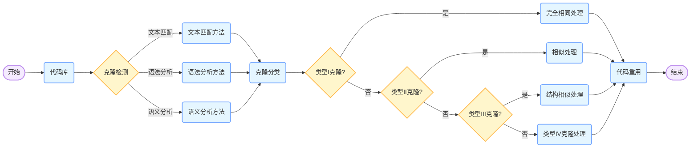

# 智能代码克隆管理:提高代码重用效率

> 关键词：智能代码克隆管理、代码重用、代码相似度、克隆检测、软件开发效率

> 摘要：本文围绕智能代码克隆管理展开，旨在探讨如何通过有效的管理手段提高代码重用效率。首先介绍了智能代码克隆管理的背景，包括目的、预期读者等内容。接着深入讲解了核心概念、算法原理、数学模型等理论知识，通过Python代码详细阐述了算法的实现。然后通过项目实战展示了智能代码克隆管理在实际开发中的应用，分析了开发环境搭建、源代码实现及解读。之后探讨了其实际应用场景，并推荐了相关的学习资源、开发工具框架和论文著作。最后总结了未来发展趋势与挑战，还提供了常见问题解答和参考资料，为开发者全面了解和应用智能代码克隆管理提供了有价值的参考。

## 1. 背景介绍 
### 1.1 目的和范围
在软件开发过程中，代码克隆是一种常见现象。代码克隆指的是在一个或多个软件系统中存在相似或相同的代码片段。代码克隆既有积极的一面，比如可以提高开发效率、减少重复劳动；但也有消极的影响，例如增加了维护成本、降低了代码的可理解性和可维护性等。

智能代码克隆管理的目的在于对代码克隆进行有效的检测、分类和管理，从而充分发挥代码克隆的积极作用，同时减少其负面影响，最终提高代码的重用效率。其范围涵盖了从简单的代码片段比较到复杂的大规模软件系统中代码克隆的全面管理，涉及不同编程语言、不同开发环境下的代码。

### 1.2 预期读者
本文的预期读者包括软件开发人员、软件测试人员、软件项目经理、软件架构师等与软件开发过程相关的专业人士。对于正在学习软件开发的学生和研究人员，本文也能提供有价值的参考，帮助他们更好地理解代码克隆现象以及如何进行有效的管理。

### 1.3 文档结构概述
本文首先介绍智能代码克隆管理的背景信息，包括目的、读者群体和文档结构。接着阐述核心概念，包括代码克隆的定义、分类以及相关联系，并通过文本示意图和Mermaid流程图进行直观展示。然后详细讲解核心算法原理，使用Python代码进行具体实现。之后介绍数学模型和公式，并举例说明。通过项目实战，展示代码实际案例并进行详细解释。随后探讨实际应用场景，推荐相关的工具和资源。最后总结未来发展趋势与挑战，提供常见问题解答和参考资料。

### 1.4 术语表
#### 1.4.1 核心术语定义
- **代码克隆**：指在一个或多个软件系统中存在相似或相同的代码片段。这些代码片段可能是完全相同的，也可能是经过一些简单修改（如变量名替换、语句顺序调整等）后相似的。
- **代码重用**：指在软件开发过程中，重复使用已有的代码片段或软件组件，以减少开发工作量、提高开发效率和代码质量。
- **克隆检测**：通过特定的算法和技术，在软件系统中找出存在的代码克隆片段的过程。
- **克隆分类**：根据代码克隆的相似程度和特征，将其分为不同的类型，以便进行更有针对性的管理。

#### 1.4.2 相关概念解释
- **语法层面克隆**：指代码在语法结构上相似，例如代码的语句顺序、关键字使用等相同，但变量名、常量值等可能不同。
- **语义层面克隆**：指代码在功能和语义上相似，即使语法结构可能有较大差异，但实现的功能是相同的。
- **克隆簇**：一组相互克隆的代码片段集合。

#### 1.4.3 缩略词列表
- **AST**：Abstract Syntax Tree，抽象语法树
- **SLOC**：Source Lines of Code，源代码行数

## 2. 核心概念与联系 

### 代码克隆的分类
代码克隆通常可以分为以下几类：
1. **类型I克隆**：完全相同的代码克隆，代码片段在字符级别完全一致，不包含注释和空白字符。
2. **类型II克隆**：相似的代码克隆，代码片段在语法结构上相似，但可能存在一些标识符（如变量名、函数名）的替换、常量值的改变等。
3. **类型III克隆**：结构相似的代码克隆，代码片段在语法结构上相似，但可能存在语句的插入、删除或顺序调整等。
4. **类型IV克隆**：语义相似的代码克隆，代码片段在功能和语义上相似，但语法结构可能有较大差异。

### 核心概念的文本示意图
```plaintext
代码克隆
|-- 类型I克隆（完全相同）
|-- 类型II克隆（相似，标识符替换等）
|-- 类型III克隆（结构相似，语句调整）
|-- 类型IV克隆（语义相似，语法差异大）

代码重用
|-- 基于代码克隆的重用
|-- 基于软件组件的重用

克隆检测
|-- 文本匹配方法
|-- 语法分析方法
|-- 语义分析方法

克隆分类
|-- 按相似程度分类（I - IV类）
|-- 按功能分类
```

### Mermaid流程图


## 3. 核心算法原理 & 具体操作步骤 

### 文本匹配方法
文本匹配方法是一种简单直观的克隆检测方法，其基本思想是将代码文件按行或按字符进行分割，然后比较不同代码片段的文本内容。

以下是一个使用Python实现的简单文本匹配克隆检测算法：
```python
def text_matching_clone_detection(code_files):
    clones = []
    for i in range(len(code_files)):
        for j in range(i + 1, len(code_files)):
            file1 = code_files[i]
            file2 = code_files[j]
            with open(file1, 'r') as f1, open(file2, 'r') as f2:
                content1 = f1.read()
                content2 = f2.read()
                if content1 == content2:
                    clones.append((file1, file2))
    return clones

# 示例使用
code_files = ['file1.py', 'file2.py', 'file3.py']
result = text_matching_clone_detection(code_files)
print("克隆代码文件对:", result)
```
#### 算法步骤：
1. 遍历所有的代码文件对。
2. 打开每对代码文件，读取其内容。
3. 比较两个文件的内容是否相同，如果相同则认为这两个文件是克隆文件。

### 语法分析方法
语法分析方法基于抽象语法树（AST）进行克隆检测。首先将代码文件解析为AST，然后比较不同代码文件的AST结构。

以下是一个使用Python的`ast`模块实现的简单语法分析克隆检测算法：
```python
import ast

def ast_matching_clone_detection(code_files):
    clones = []
    ast_trees = []
    for file in code_files:
        with open(file, 'r') as f:
            try:
                tree = ast.parse(f.read())
                ast_trees.append(tree)
            except SyntaxError:
                continue
    for i in range(len(ast_trees)):
        for j in range(i + 1, len(ast_trees)):
            if ast.dump(ast_trees[i]) == ast.dump(ast_trees[j]):
                clones.append((code_files[i], code_files[j]))
    return clones

# 示例使用
code_files = ['file1.py', 'file2.py', 'file3.py']
result = ast_matching_clone_detection(code_files)
print("克隆代码文件对:", result)
```
#### 算法步骤：
1. 遍历所有的代码文件，将每个文件解析为AST。
2. 遍历所有的AST对，比较它们的字符串表示是否相同，如果相同则认为对应的代码文件是克隆文件。

## 4. 数学模型和公式 & 详细讲解 & 举例说明 

### 相似度计算
在克隆检测中，相似度计算是一个重要的环节。常用的相似度计算方法有编辑距离（Levenshtein距离）和余弦相似度等。

#### 编辑距离
编辑距离是指将一个字符串转换为另一个字符串所需的最少编辑操作（插入、删除、替换）次数。其数学定义如下：
设 $s_1$ 和 $s_2$ 是两个字符串，$d(i, j)$ 表示 $s_1$ 的前 $i$ 个字符和 $s_2$ 的前 $j$ 个字符之间的编辑距离，则有：
$$
d(i, j) = 
\begin{cases}
i & \text{if } j = 0 \\
j & \text{if } i = 0 \\
d(i - 1, j - 1) & \text{if } s_1[i - 1] = s_2[j - 1] \\
1 + \min(d(i - 1, j), d(i, j - 1), d(i - 1, j - 1)) & \text{otherwise}
\end{cases}
$$

以下是使用Python实现的编辑距离计算代码：
```python
def levenshtein_distance(s1, s2):
    if len(s1) < len(s2):
        return levenshtein_distance(s2, s1)

    if len(s2) == 0:
        return len(s1)

    previous_row = range(len(s2) + 1)
    for i, c1 in enumerate(s1):
        current_row = [i + 1]
        for j, c2 in enumerate(s2):
            insertions = previous_row[j + 1] + 1
            deletions = current_row[j] + 1
            substitutions = previous_row[j] + (c1 != c2)
            current_row.append(min(insertions, deletions, substitutions))
        previous_row = current_row

    return previous_row[-1]

# 示例使用
s1 = "kitten"
s2 = "sitting"
distance = levenshtein_distance(s1, s2)
print("编辑距离:", distance)
```

#### 余弦相似度
余弦相似度用于衡量两个向量之间的夹角余弦值，在文本相似度计算中，通常将文本转换为向量表示。设 $\vec{A}$ 和 $\vec{B}$ 是两个向量，则它们的余弦相似度定义为：
$$
\cos(\theta) = \frac{\vec{A} \cdot \vec{B}}{\|\vec{A}\| \|\vec{B}\|}
$$
其中，$\vec{A} \cdot \vec{B}$ 是向量的点积，$\|\vec{A}\|$ 和 $\|\vec{B}\|$ 分别是向量的模。

以下是使用Python的`sklearn`库实现的余弦相似度计算代码：
```python
from sklearn.feature_extraction.text import TfidfVectorizer
from sklearn.metrics.pairwise import cosine_similarity

def cosine_similarity_text(text1, text2):
    vectorizer = TfidfVectorizer()
    vectors = vectorizer.fit_transform([text1, text2])
    similarity = cosine_similarity(vectors[0:1], vectors[1:2])
    return similarity[0][0]

# 示例使用
text1 = "This is a sample text."
text2 = "This is another sample text."
similarity = cosine_similarity_text(text1, text2)
print("余弦相似度:", similarity)
```

## 5. 项目实战：代码实际案例和详细解释说明 

### 5.1  开发环境搭建
#### 操作系统
本项目可以在Windows、Linux或Mac OS等主流操作系统上进行开发。

#### 编程语言和版本
使用Python 3.x版本，建议使用Python 3.7及以上版本。

#### 依赖库安装
安装以下必要的Python库：
```bash
pip install sklearn
```

### 5.2  源代码详细实现和代码解读
以下是一个综合的代码克隆检测项目示例，结合了文本匹配和语法分析方法：
```python
import ast
from sklearn.feature_extraction.text import TfidfVectorizer
from sklearn.metrics.pairwise import cosine_similarity

def text_matching_clone_detection(code_files):
    clones = []
    for i in range(len(code_files)):
        for j in range(i + 1, len(code_files)):
            file1 = code_files[i]
            file2 = code_files[j]
            with open(file1, 'r') as f1, open(file2, 'r') as f2:
                content1 = f1.read()
                content2 = f2.read()
                if content1 == content2:
                    clones.append((file1, file2))
    return clones

def ast_matching_clone_detection(code_files):
    clones = []
    ast_trees = []
    for file in code_files:
        with open(file, 'r') as f:
            try:
                tree = ast.parse(f.read())
                ast_trees.append(tree)
            except SyntaxError:
                continue
    for i in range(len(ast_trees)):
        for j in range(i + 1, len(ast_trees)):
            if ast.dump(ast_trees[i]) == ast.dump(ast_trees[j]):
                clones.append((code_files[i], code_files[j]))
    return clones

def cosine_similarity_clone_detection(code_files, threshold=0.8):
    clones = []
    contents = []
    for file in code_files:
        with open(file, 'r') as f:
            contents.append(f.read())
    vectorizer = TfidfVectorizer()
    vectors = vectorizer.fit_transform(contents)
    num_files = len(code_files)
    for i in range(num_files):
        for j in range(i + 1, num_files):
            similarity = cosine_similarity(vectors[i:i + 1], vectors[j:j + 1])[0][0]
            if similarity >= threshold:
                clones.append((code_files[i], code_files[j]))
    return clones

# 示例使用
code_files = ['file1.py', 'file2.py', 'file3.py']
text_clones = text_matching_clone_detection(code_files)
ast_clones = ast_matching_clone_detection(code_files)
cosine_clones = cosine_similarity_clone_detection(code_files)

print("文本匹配克隆:", text_clones)
print("语法分析克隆:", ast_clones)
print("余弦相似度克隆:", cosine_clones)
```
### 5.3  代码解读与分析
- **text_matching_clone_detection函数**：通过比较代码文件的文本内容是否相同来检测克隆。这种方法简单直接，但只能检测到完全相同的代码克隆。
- **ast_matching_clone_detection函数**：将代码文件解析为AST，然后比较AST的字符串表示是否相同。这种方法可以检测到语法结构相似的代码克隆。
- **cosine_similarity_clone_detection函数**：使用TF-IDF向量表示代码文件内容，然后计算余弦相似度。当相似度超过设定的阈值时，认为是克隆代码。这种方法可以检测到语义相似的代码克隆。

## 6. 实际应用场景 
### 软件开发过程中的代码审查
在软件开发过程中，代码审查是保证代码质量的重要环节。智能代码克隆管理可以帮助审查人员快速发现代码中的克隆部分，从而更好地评估代码的可维护性和可扩展性。例如，在一个大型项目中，如果多个模块中存在大量相同或相似的代码，可能意味着这些代码可以进行重构，提取为公共的函数或类，以提高代码的重用性和可维护性。

### 软件维护和更新
当软件需要进行维护和更新时，智能代码克隆管理可以帮助开发人员快速定位到需要修改的所有克隆代码。如果只修改了其中一个克隆代码而忽略了其他克隆代码，可能会导致软件功能不一致。通过智能代码克隆管理，可以确保所有相关的克隆代码都得到了正确的修改。

### 知识产权保护
在软件开发中，代码的知识产权保护是一个重要问题。智能代码克隆管理可以用于检测是否存在代码抄袭或侵权行为。通过比较不同软件系统中的代码，可以发现是否存在未经授权的代码克隆，从而保护软件开发者的知识产权。

### 教育领域
在计算机科学教育中，智能代码克隆管理可以帮助教师检测学生作业中的抄袭行为。教师可以使用克隆检测工具比较学生提交的代码，发现是否存在抄袭现象。同时，对于学生来说，了解代码克隆和代码重用的概念，可以帮助他们更好地学习编程，提高编程效率。

## 7. 工具和资源推荐
### 7.1 学习资源推荐
#### 7.1.1 书籍推荐
- 《代码大全（第2版）》：这本书全面介绍了软件开发的各个方面，包括代码的组织、设计和维护等内容，对理解代码克隆和代码重用有很大的帮助。
- 《重构：改善既有代码的设计》：详细讲解了如何对现有的代码进行重构，通过重构可以减少代码克隆，提高代码的质量和可维护性。

#### 7.1.2 在线课程
- Coursera上的“Software Engineering Specialization”：该课程涵盖了软件工程的多个方面，包括代码管理、软件测试等内容，对智能代码克隆管理有深入的讲解。
- edX上的“Introduction to Software Engineering”：这门课程介绍了软件工程的基本概念和方法，其中也涉及到了代码克隆和代码重用的相关知识。

#### 7.1.3 技术博客和网站
- Stack Overflow：这是一个程序员社区，上面有很多关于代码克隆和代码重用的讨论和解决方案。
- Medium：上面有很多技术博客文章，其中不乏关于智能代码克隆管理的深入分析和实践经验分享。

### 7.2 开发工具框架推荐
#### 7.2.1 IDE和编辑器
- PyCharm：这是一款专门为Python开发设计的集成开发环境，具有强大的代码分析和重构功能，可以帮助开发者更好地管理代码克隆。
- Visual Studio Code：一款轻量级的代码编辑器，支持多种编程语言，有丰富的插件可以扩展其功能，例如代码克隆检测插件。

#### 7.2.2 调试和性能分析工具
- PDB：Python自带的调试器，可以帮助开发者调试代码，找出代码中的问题，包括与代码克隆相关的问题。
- cProfile：Python的性能分析工具，可以分析代码的执行时间和资源使用情况，有助于优化代码，减少代码克隆带来的性能问题。

#### 7.2.3 相关框架和库
- difflib：Python标准库中的一个模块，提供了比较文本差异的功能，可以用于代码克隆检测。
- pylint：一个Python代码分析工具，可以检查代码中的错误和不规范之处，也可以帮助发现代码克隆问题。

### 7.3 相关论文著作推荐
#### 7.3.1 经典论文
- “An Analysis of the Nature and Impact of Code Clones in Open Source Software”：该论文对开源软件中的代码克隆现象进行了深入分析，探讨了代码克隆的本质和影响。
- “A Taxonomy and Survey of Program Clone Detection Techniques”：对代码克隆检测技术进行了分类和综述，为后续的研究和实践提供了重要的参考。

#### 7.3.2 最新研究成果
- 可以关注ACM SIGSOFT等计算机科学领域的顶级会议和期刊，例如ACM Transactions on Software Engineering and Methodology (TOSEM)，上面会发表很多关于代码克隆管理的最新研究成果。

#### 7.3.3 应用案例分析
- 一些大型软件公司的技术博客会分享他们在智能代码克隆管理方面的应用案例，例如Google、Microsoft等公司的技术博客，可以从中学习到实际应用中的经验和技巧。

## 8. 总结：未来发展趋势与挑战
### 未来发展趋势
#### 智能化和自动化程度提高
随着人工智能技术的不断发展，智能代码克隆管理将越来越智能化和自动化。例如，利用机器学习和深度学习算法，可以自动识别代码克隆的类型和潜在的问题，并提供相应的解决方案。

#### 跨语言和跨平台支持
在软件开发中，越来越多的项目采用多种编程语言和不同的开发平台。未来的智能代码克隆管理工具将支持更多的编程语言和开发平台，实现跨语言和跨平台的代码克隆检测和管理。

#### 与软件开发流程的深度融合
智能代码克隆管理将与软件开发的各个阶段（如需求分析、设计、编码、测试、维护等）深度融合，成为软件开发流程中不可或缺的一部分。例如，在代码提交时自动进行克隆检测，在软件设计阶段就考虑如何避免代码克隆等。

### 挑战
#### 语义理解的困难
虽然目前已经有一些语义分析方法用于代码克隆检测，但要准确理解代码的语义仍然是一个挑战。不同的编程语言和编程风格可能会导致代码在语义上相似但语法结构差异很大，这给语义分析带来了很大的困难。

#### 大规模代码库的处理
随着软件系统的规模越来越大，代码库中的代码量也越来越多。如何高效地处理大规模代码库中的代码克隆检测和管理是一个亟待解决的问题。传统的克隆检测算法在处理大规模代码库时可能会面临性能瓶颈。

#### 代码克隆的合理利用和管理
代码克隆既有积极的一面，也有消极的一面。如何在软件开发过程中合理地利用代码克隆，同时有效地管理代码克隆带来的问题，是一个需要平衡的挑战。例如，在某些情况下，代码克隆可能是为了提高开发效率，但过度的代码克隆会增加维护成本。

## 9. 附录：常见问题与解答
### 问题1：代码克隆一定会带来负面影响吗？
答：不是的，代码克隆既有积极的一面，也有消极的一面。积极方面，代码克隆可以提高开发效率，减少重复劳动；消极方面，代码克隆会增加维护成本，降低代码的可理解性和可维护性。

### 问题2：如何选择合适的克隆检测方法？
答：这取决于具体的应用场景和需求。如果只需要检测完全相同的代码克隆，可以选择文本匹配方法；如果需要检测语法结构相似的代码克隆，可以选择语法分析方法；如果需要检测语义相似的代码克隆，可以选择语义分析方法或基于相似度计算的方法。

### 问题3：智能代码克隆管理工具的性能如何？
答：不同的智能代码克隆管理工具性能可能会有所不同。一般来说，工具的性能受到多种因素的影响，如代码库的规模、克隆检测算法的复杂度等。在选择工具时，需要根据实际情况进行评估和测试。

### 问题4：如何处理检测到的代码克隆？
答：处理检测到的代码克隆可以根据具体情况采取不同的措施。如果是完全相同的代码克隆，可以考虑提取为公共的函数或类；如果是相似的代码克隆，可以进行重构，使代码更加简洁和可维护；如果是语义相似但语法结构差异较大的代码克隆，需要仔细分析其功能和逻辑，进行适当的优化。

## 10. 扩展阅读 & 参考资料
- Fowler, M. (2018). Refactoring: Improving the Design of Existing Code. Addison-Wesley Professional.
- McConnell, S. C. (2004). Code Complete. Microsoft Press.
- IEEE Transactions on Software Engineering.
- ACM SIGSOFT Software Engineering Notes.
- Online tutorials and documentation on Python, such as the official Python documentation.
- Official websites of IDEs and development tools, such as PyCharm and Visual Studio Code.