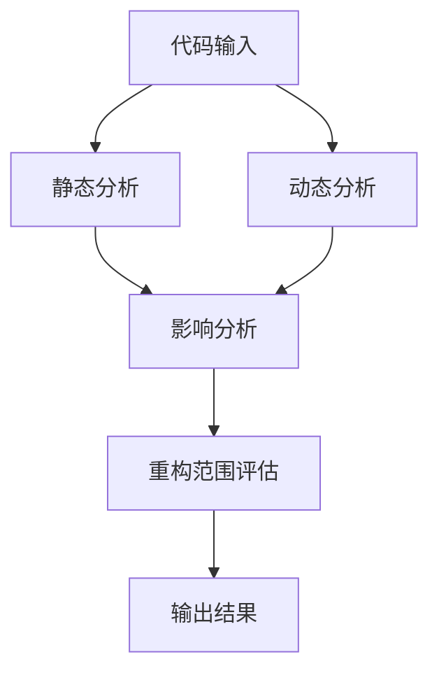

# 智能代码重构影响分析:精准评估重构范围

> 关键词：智能代码重构、影响分析、精准评估、重构范围、代码依赖

> 摘要：本文围绕智能代码重构影响分析中精准评估重构范围这一核心主题展开。详细介绍了代码重构的背景知识，深入剖析了核心概念与联系，阐述了核心算法原理及具体操作步骤，通过数学模型和公式进一步阐释其原理，结合项目实战展示代码实现与解读，探讨了实际应用场景，推荐了相关的工具和资源，最后对未来发展趋势与挑战进行总结，并提供常见问题解答及参考资料，旨在帮助开发者全面理解和掌握如何在智能代码重构中精准评估重构范围，提高代码重构的效率和质量。

## 1. 背景介绍 
### 1.1 目的和范围
代码重构是软件开发过程中的重要环节，它有助于提高代码的可维护性、可读性和性能。然而，在进行代码重构时，一个关键的问题是如何精准地评估重构的范围，以避免对其他部分的代码产生意外的影响。本文章的目的就是深入探讨智能代码重构影响分析中精准评估重构范围的方法和技术，范围涵盖了从理论原理到实际应用的各个方面，包括核心概念的解释、算法的实现、数学模型的推导、项目实战的演示以及相关工具和资源的推荐等。

### 1.2 预期读者
本文预期读者主要包括软件开发人员、软件工程师、软件架构师、程序员以及对代码重构和智能编程技术感兴趣的研究人员。这些读者可能在日常工作中需要进行代码重构，或者对如何提高代码质量和开发效率有一定的需求，通过阅读本文，他们可以获取关于精准评估重构范围的相关知识和技术。

### 1.3 文档结构概述
本文共分为十个部分。第一部分是背景介绍，包括目的和范围、预期读者、文档结构概述以及术语表。第二部分介绍核心概念与联系，通过文本示意图和 Mermaid 流程图来展示相关概念的原理和架构。第三部分阐述核心算法原理及具体操作步骤，并使用 Python 源代码进行详细说明。第四部分介绍数学模型和公式，并进行详细讲解和举例说明。第五部分是项目实战，包括开发环境搭建、源代码详细实现和代码解读以及代码解读与分析。第六部分探讨实际应用场景。第七部分推荐相关的工具和资源，包括学习资源、开发工具框架和相关论文著作。第八部分总结未来发展趋势与挑战。第九部分是附录，提供常见问题与解答。第十部分是扩展阅读与参考资料。

### 1.4 术语表
#### 1.4.1 核心术语定义
- **智能代码重构**：利用人工智能技术辅助进行代码重构的过程，旨在提高重构的效率和准确性。
- **影响分析**：对代码变更可能产生的影响进行分析和评估的过程，包括对代码结构、功能和性能的影响。
- **重构范围**：指在代码重构过程中需要进行修改的代码部分的范围，包括直接修改的代码和受影响的相关代码。
- **代码依赖**：指代码中不同部分之间的相互关系，一个部分的代码可能依赖于其他部分的代码才能正常运行。

#### 1.4.2 相关概念解释
- **静态分析**：在不运行代码的情况下对代码进行分析的技术，通过分析代码的语法、结构和语义来获取代码的相关信息。
- **动态分析**：在代码运行过程中对代码进行分析的技术，通过收集代码运行时的信息来了解代码的行为和性能。
- **代码度量**：对代码的各种属性进行量化测量的过程，例如代码的复杂度、行数、耦合度等。

#### 1.4.3 缩略词列表
- **AST**：Abstract Syntax Tree，抽象语法树
- **IR**：Intermediate Representation，中间表示
- **SLOC**：Source Lines of Code，源代码行数

## 2. 核心概念与联系 

### 核心概念原理
智能代码重构影响分析的核心在于理解代码之间的依赖关系和变更的影响范围。代码依赖关系是指代码中不同部分之间的相互关联，例如函数调用、变量引用等。当对某一部分代码进行重构时，需要考虑这些依赖关系，以确定重构的影响范围。

影响分析可以分为静态影响分析和动态影响分析。静态影响分析通过对代码的静态结构进行分析，例如解析代码的抽象语法树（AST），来确定代码之间的依赖关系和可能的影响范围。动态影响分析则通过在代码运行过程中收集信息，例如记录函数调用栈、变量值的变化等，来了解代码的实际行为和变更的影响。

精准评估重构范围的关键在于综合考虑静态和动态信息，结合代码的语义和上下文，准确地识别出所有可能受影响的代码部分。

### 架构的文本示意图
```plaintext
智能代码重构影响分析系统
├── 代码输入模块
│   └── 接收待重构的代码
├── 静态分析模块
│   ├── 解析代码的抽象语法树（AST）
│   ├── 提取代码的静态依赖关系
│   └── 分析代码的结构和语义
├── 动态分析模块
│   ├── 运行代码并收集运行时信息
│   ├── 记录函数调用栈和变量值的变化
│   └── 分析代码的实际行为
├── 影响分析模块
│   ├── 综合静态和动态信息
│   ├── 确定重构的影响范围
│   └── 生成影响报告
├── 重构范围评估模块
│   ├── 根据影响报告精准评估重构范围
│   └── 提供重构建议
└── 输出模块
    └── 输出重构范围和建议
```

### Mermaid 流程图


## 3. 核心算法原理 & 具体操作步骤 

### 核心算法原理
核心算法的主要目标是通过静态和动态分析相结合的方式，精准地评估代码重构的影响范围。具体步骤如下：

1. **静态分析**：
    - 解析代码的抽象语法树（AST），将代码转换为一种中间表示形式。
    - 遍历 AST，提取代码中的各种依赖关系，例如函数调用、变量引用等。
    - 构建代码的依赖图，用于表示代码之间的依赖关系。

2. **动态分析**：
    - 在代码运行过程中，记录函数调用栈和变量值的变化。
    - 分析运行时信息，确定代码的实际执行路径和依赖关系。

3. **影响分析**：
    - 综合静态和动态信息，确定重构的影响范围。
    - 对影响范围内的代码进行标记，以便后续的重构操作。

### 具体操作步骤及 Python 源代码

#### 1. 静态分析
以下是一个简单的 Python 示例，用于解析 Python 代码的 AST 并提取函数调用关系：

```python
import ast

def extract_function_calls(code):
    class FunctionCallVisitor(ast.NodeVisitor):
        def __init__(self):
            self.calls = []

        def visit_Call(self, node):
            if isinstance(node.func, ast.Name):
                self.calls.append(node.func.id)
            self.generic_visit(node)

    tree = ast.parse(code)
    visitor = FunctionCallVisitor()
    visitor.visit(tree)
    return visitor.calls

# 示例代码
code = """
def foo():
    bar()

def bar():
    pass
"""

function_calls = extract_function_calls(code)
print("函数调用关系:", function_calls)
```

#### 2. 动态分析
以下是一个简单的 Python 示例，用于记录函数调用栈：

```python
import sys

def trace_calls(frame, event, arg):
    if event == 'call':
        print(f"调用函数: {frame.f_code.co_name}")
    return trace_calls

def foo():
    bar()

def bar():
    pass

sys.settrace(trace_calls)
foo()
sys.settrace(None)
```

#### 3. 影响分析
综合静态和动态信息，确定重构的影响范围。以下是一个简单的示例，假设我们要重构 `foo` 函数，需要确定其影响范围：

```python
# 静态分析得到的函数调用关系
static_function_calls = {'foo': ['bar']}

# 动态分析得到的函数调用栈
dynamic_call_stack = ['foo', 'bar']

# 确定重构的影响范围
impact_scope = set()
for func in dynamic_call_stack:
    if func in static_function_calls:
        impact_scope.update(static_function_calls[func])
impact_scope.add('foo')

print("重构的影响范围:", impact_scope)
```

## 4. 数学模型和公式 & 详细讲解 & 举例说明 

### 数学模型
我们可以使用图论的方法来表示代码的依赖关系。将代码中的每个函数、类、变量等看作图中的节点，将它们之间的依赖关系看作图中的边。这样，代码的依赖关系就可以表示为一个有向图 $G=(V, E)$，其中 $V$ 是节点的集合，$E$ 是边的集合。

设 $v_i$ 表示图中的一个节点，$e_{ij}$ 表示从节点 $v_i$ 到节点 $v_j$ 的一条边。如果存在从节点 $v_i$ 到节点 $v_j$ 的边，则表示 $v_i$ 依赖于 $v_j$。

### 公式
- **节点的入度**：节点 $v_j$ 的入度 $in(v_j)$ 表示有多少个节点依赖于 $v_j$，计算公式为：
$$in(v_j) = \sum_{i=1}^{|V|} e_{ij}$$

- **节点的出度**：节点 $v_i$ 的出度 $out(v_i)$ 表示 $v_i$ 依赖于多少个节点，计算公式为：
$$out(v_i) = \sum_{j=1}^{|V|} e_{ij}$$

- **重构的影响范围**：设要重构的节点为 $v_k$，则重构的影响范围 $S$ 可以通过深度优先搜索（DFS）或广度优先搜索（BFS）算法从 $v_k$ 开始遍历图得到。

### 详细讲解
节点的入度和出度可以帮助我们了解代码中各个部分的依赖程度。入度较大的节点通常是比较重要的节点，因为有很多其他节点依赖于它；出度较大的节点则表示它依赖于很多其他节点。

在确定重构的影响范围时，我们可以从要重构的节点开始，沿着图中的边进行遍历，将所有可达的节点都加入到影响范围中。这样可以确保我们考虑到了所有可能受影响的代码部分。

### 举例说明
假设我们有以下代码：

```python
def foo():
    bar()

def bar():
    baz()

def baz():
    pass
```

对应的依赖图 $G=(V, E)$ 中，$V = \{foo, bar, baz\}$，$E = \{(foo, bar), (bar, baz)\}$。

- 节点 `foo` 的出度 $out(foo) = 1$，入度 $in(foo) = 0$。
- 节点 `bar` 的出度 $out(bar) = 1$，入度 $in(bar) = 1$。
- 节点 `baz` 的出度 $out(baz) = 0$，入度 $in(baz) = 1$。

如果要重构 `foo` 函数，通过深度优先搜索从 `foo` 开始遍历图，得到的影响范围 $S = \{foo, bar, baz\}$。

## 5. 项目实战：代码实际案例和详细解释说明 

### 5.1  开发环境搭建
#### 开发语言和版本
本项目使用 Python 3.8 作为开发语言，Python 3.8 提供了丰富的标准库和第三方库，方便进行代码分析和处理。

#### 第三方库安装
- `ast`：Python 标准库，用于解析代码的抽象语法树。
- `sys`：Python 标准库，用于进行系统级的操作，如设置跟踪函数。
- `networkx`：用于构建和分析图结构，方便表示代码的依赖关系。

可以使用以下命令安装 `networkx`：
```sh
pip install networkx
```

### 5.2  源代码详细实现和代码解读

#### 静态分析模块
```python
import ast
import networkx as nx

def build_dependency_graph(code):
    class FunctionCallVisitor(ast.NodeVisitor):
        def __init__(self, graph):
            self.graph = graph

        def visit_Call(self, node):
            if isinstance(node.func, ast.Name):
                caller_name = node.parent.name if hasattr(node, 'parent') else 'unknown'
                callee_name = node.func.id
                if not self.graph.has_node(caller_name):
                    self.graph.add_node(caller_name)
                if not self.graph.has_node(callee_name):
                    self.graph.add_node(callee_name)
                self.graph.add_edge(caller_name, callee_name)
            self.generic_visit(node)

    tree = ast.parse(code)
    graph = nx.DiGraph()
    visitor = FunctionCallVisitor(graph)
    visitor.visit(tree)
    return graph

# 示例代码
code = """
def foo():
    bar()

def bar():
    baz()

def baz():
    pass
"""

dependency_graph = build_dependency_graph(code)
print("依赖图节点:", dependency_graph.nodes())
print("依赖图边:", dependency_graph.edges())
```
**代码解读**：
- `build_dependency_graph` 函数用于构建代码的依赖图。
- `FunctionCallVisitor` 类继承自 `ast.NodeVisitor`，用于遍历代码的 AST 并提取函数调用关系。
- 在 `visit_Call` 方法中，我们根据函数调用的信息添加节点和边到图中。

#### 动态分析模块
```python
import sys
import networkx as nx

def trace_calls(frame, event, arg, graph):
    if event == 'call':
        caller_name = frame.f_back.f_code.co_name if frame.f_back else 'unknown'
        callee_name = frame.f_code.co_name
        if not graph.has_node(caller_name):
            graph.add_node(caller_name)
        if not graph.has_node(callee_name):
            graph.add_node(callee_name)
        graph.add_edge(caller_name, callee_name)
    return trace_calls

def foo():
    bar()

def bar():
    baz()

def baz():
    pass

dynamic_graph = nx.DiGraph()
sys.settrace(lambda frame, event, arg: trace_calls(frame, event, arg, dynamic_graph))
foo()
sys.settrace(None)

print("动态依赖图节点:", dynamic_graph.nodes())
print("动态依赖图边:", dynamic_graph.edges())
```
**代码解读**：
- `trace_calls` 函数用于记录函数调用信息，并将其添加到动态依赖图中。
- `sys.settrace` 函数用于设置跟踪函数，在代码运行过程中调用 `trace_calls` 函数记录函数调用信息。

#### 影响分析模块
```python
import networkx as nx

def analyze_impact(graph, target_node):
    impact_scope = set()
    stack = [target_node]
    while stack:
        node = stack.pop()
        if node not in impact_scope:
            impact_scope.add(node)
            stack.extend(graph.successors(node))
    return impact_scope

# 假设要重构的函数是 'foo'
target_node = 'foo'
impact_scope = analyze_impact(dependency_graph, target_node)
print("重构的影响范围:", impact_scope)
```
**代码解读**：
- `analyze_impact` 函数使用深度优先搜索算法从目标节点开始遍历图，确定重构的影响范围。

### 5.3  代码解读与分析
通过上述代码，我们实现了一个简单的智能代码重构影响分析系统。静态分析模块通过解析代码的 AST 构建了代码的静态依赖图，动态分析模块通过记录函数调用信息构建了代码的动态依赖图。影响分析模块结合静态和动态信息，使用深度优先搜索算法确定了重构的影响范围。

在实际应用中，我们可以根据具体需求对代码进行扩展和优化。例如，可以添加更多的代码分析功能，如变量引用分析、类继承关系分析等；可以使用更复杂的图算法来提高影响分析的准确性；可以将系统集成到开发工具中，方便开发者在开发过程中进行代码重构影响分析。

## 6. 实际应用场景 
### 大型软件系统的维护和升级
在大型软件系统中，代码规模庞大，代码之间的依赖关系复杂。当需要对系统进行维护和升级时，例如修改某个模块的功能、添加新的功能等，精准评估重构范围可以帮助开发者避免对其他部分的代码产生意外的影响，减少系统出现故障的风险。

### 开源项目的贡献和协作
在开源项目中，不同的开发者可能会对项目的代码进行修改和贡献。精准评估重构范围可以帮助开发者更好地理解自己的修改对整个项目的影响，提高代码的质量和可维护性，同时也方便其他开发者进行代码审查和协作。

### 代码优化和性能提升
当需要对代码进行优化和性能提升时，例如优化算法、减少内存占用等，精准评估重构范围可以帮助开发者确定哪些代码部分需要进行修改，避免不必要的修改，提高优化的效率和效果。

## 7. 工具和资源推荐
### 7.1 学习资源推荐
#### 7.1.1 书籍推荐
- 《代码整洁之道》：这本书介绍了编写高质量代码的原则和方法，对于理解代码重构的重要性和方法有很大的帮助。
- 《重构：改善既有代码的设计》：经典的代码重构书籍，详细介绍了各种代码重构的技术和实践。
- 《Python 源码剖析》：深入剖析 Python 源代码的实现原理，对于理解 Python 代码的分析和处理有很大的帮助。

#### 7.1.2 在线课程
- Coursera 上的 “Software Design and Architecture” 课程：介绍了软件设计和架构的相关知识，包括代码重构的方法和技术。
- edX 上的 “Python for Everybody” 课程：适合初学者学习 Python 编程，为后续进行代码分析和重构打下基础。

#### 7.1.3 技术博客和网站
- Medium 上的 “The Startup” 博客：有很多关于软件开发和代码重构的文章，提供了最新的技术和实践经验。
- Stack Overflow：开发者社区，有很多关于代码分析和重构的问题和解答，可以帮助解决实际遇到的问题。

### 7.2 开发工具框架推荐
#### 7.2.1 IDE和编辑器
- PyCharm：功能强大的 Python IDE，提供了代码分析、重构等功能，方便开发者进行代码开发和维护。
- Visual Studio Code：轻量级的代码编辑器，支持多种编程语言，有丰富的插件可以扩展功能，适合进行代码分析和重构。

#### 7.2.2 调试和性能分析工具
- pdb：Python 标准库中的调试工具，可以帮助开发者调试代码，找出代码中的问题。
- cProfile：Python 标准库中的性能分析工具，可以帮助开发者分析代码的性能瓶颈，进行优化。

#### 7.2.3 相关框架和库
- `ast`：Python 标准库，用于解析代码的抽象语法树。
- `networkx`：用于构建和分析图结构，方便表示代码的依赖关系。
- `pylint`：Python 代码分析工具，可以检查代码的质量和风格，发现潜在的问题。

### 7.3 相关论文著作推荐
#### 7.3.1 经典论文
- “Refactoring: A Software Engineering Perspective”：从软件工程的角度介绍了代码重构的原理和方法。
- “Static Analysis of Large Software Systems”：介绍了静态分析技术在大型软件系统中的应用，对于理解代码的静态分析有很大的帮助。

#### 7.3.2 最新研究成果
- 可以关注 ACM SIGSOFT 等学术会议上的相关论文，了解代码重构和影响分析的最新研究成果。

#### 7.3.3 应用案例分析
- 可以参考一些开源项目的文档和博客，了解他们在代码重构和影响分析方面的实践经验和应用案例。

## 8. 总结：未来发展趋势与挑战
### 未来发展趋势
- **智能化程度不断提高**：随着人工智能技术的不断发展，智能代码重构影响分析系统将越来越智能化。例如，可以使用机器学习和深度学习技术自动识别代码中的问题和重构机会，提高重构的效率和准确性。
- **与开发工具的深度集成**：智能代码重构影响分析系统将与开发工具（如 IDE）进行更深度的集成，为开发者提供更便捷的重构支持。例如，在开发过程中实时分析代码的变更影响，提供即时的重构建议。
- **跨语言和跨平台支持**：未来的系统将支持更多的编程语言和平台，能够处理不同类型的代码，提高系统的通用性和适用性。

### 挑战
- **代码复杂性**：随着软件系统的不断发展，代码的复杂性越来越高，代码之间的依赖关系也越来越复杂。准确地分析和评估代码的影响范围变得越来越困难，需要更高效和准确的分析算法。
- **动态性和不确定性**：在一些动态语言和分布式系统中，代码的行为和依赖关系具有很大的动态性和不确定性。如何在这种情况下准确地评估重构的影响范围是一个挑战。
- **数据隐私和安全**：在进行代码分析和重构时，可能会涉及到敏感的代码和数据。如何保证数据的隐私和安全，防止数据泄露和滥用是一个重要的问题。

## 9. 附录：常见问题与解答
### 问题 1：静态分析和动态分析有什么区别？
静态分析是在不运行代码的情况下对代码进行分析，通过解析代码的语法、结构和语义来获取代码的相关信息。动态分析是在代码运行过程中对代码进行分析，通过收集代码运行时的信息来了解代码的实际行为和性能。静态分析可以发现一些潜在的问题，但无法了解代码的实际执行情况；动态分析可以获取代码的实际运行信息，但需要运行代码，可能会受到环境和数据的影响。

### 问题 2：如何提高影响分析的准确性？
可以综合使用静态和动态分析技术，结合代码的语义和上下文信息，考虑更多的因素，如变量的作用域、函数的调用关系、类的继承关系等。同时，可以使用更复杂的图算法和机器学习技术来提高分析的准确性。

### 问题 3：智能代码重构影响分析系统可以应用于哪些编程语言？
目前的系统主要针对 Python 语言进行开发，但可以通过扩展和修改来支持其他编程语言。对于不同的编程语言，需要使用相应的语法解析器和分析工具来解析代码的结构和语义。

### 问题 4：如何处理代码中的注释和空白行？
在进行代码分析时，通常会忽略代码中的注释和空白行，只关注代码的实际内容。在解析代码的抽象语法树时，注释和空白行不会被包含在树中，因此不会对分析结果产生影响。

## 10. 扩展阅读 & 参考资料
### 扩展阅读
- 《Python 高级编程》：深入介绍 Python 编程的高级特性和技巧，对于进一步理解 Python 代码的分析和处理有很大的帮助。
- 《人工智能：一种现代的方法》：介绍了人工智能的基本原理和方法，对于了解智能代码重构影响分析系统中的人工智能技术有很大的帮助。

### 参考资料
- Python 官方文档：https://docs.python.org/3/
- NetworkX 官方文档：https://networkx.org/documentation/stable/
- ACM SIGSOFT 官方网站：https://www.sigsoft.org/