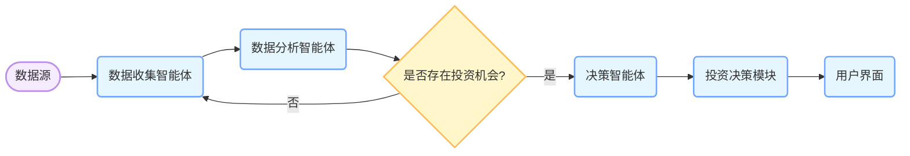

# 智能体协作增强价值投资的新兴市场机会识别

> 关键词：智能体协作、价值投资、新兴市场、机会识别、人工智能

> 摘要：本文聚焦于智能体协作在增强价值投资的新兴市场机会识别方面的应用。通过深入剖析智能体协作的核心概念、算法原理，建立数学模型，结合项目实战案例，探讨其在新兴市场投资中的实际应用场景。旨在为投资者和相关研究人员提供全面且深入的技术与理论支持，助力更好地把握新兴市场的投资机会，同时分析未来发展趋势与面临的挑战。

## 1. 背景介绍 
### 1.1 目的和范围
随着全球经济的快速发展，新兴市场在世界经济格局中的地位日益重要。新兴市场蕴含着巨大的投资潜力，但同时也伴随着较高的风险和不确定性。传统的价值投资方法在面对新兴市场复杂多变的环境时，往往存在一定的局限性。本文的目的在于研究如何利用智能体协作技术来增强价值投资对新兴市场机会的识别能力，提高投资决策的准确性和效率。

本文的范围涵盖了智能体协作的基本概念、相关算法原理、数学模型的建立，以及在新兴市场价值投资中的具体应用。通过理论分析和实际案例研究，全面探讨智能体协作在新兴市场机会识别中的作用和价值。

### 1.2 预期读者
本文预期读者包括金融投资领域的专业人士，如基金经理、投资分析师等，他们希望借助先进的技术手段提升在新兴市场的投资决策能力；计算机科学和人工智能领域的研究人员，对智能体协作在金融领域的应用感兴趣；以及对新兴市场投资和人工智能技术有学习需求的学生和爱好者。

### 1.3 文档结构概述
本文将按照以下结构展开：首先介绍背景信息，包括目的、预期读者和文档结构概述；接着阐述智能体协作的核心概念及其与价值投资的联系；然后详细讲解核心算法原理和具体操作步骤，并用 Python 代码进行阐述；建立数学模型并进行详细讲解和举例说明；通过项目实战展示代码实际案例并进行详细解释；探讨实际应用场景；推荐相关的工具和资源；总结未来发展趋势与挑战；提供常见问题解答和扩展阅读参考资料。

### 1.4 术语表
#### 1.4.1 核心术语定义
- **智能体（Agent）**：是一个能够感知环境，并根据感知到的信息进行决策和行动的实体。在本文中，智能体可以是具有特定功能的软件程序，用于处理和分析新兴市场的相关数据。
- **智能体协作（Agent Collaboration）**：指多个智能体通过相互通信、协调和合作，共同完成一个或多个任务的过程。在价值投资中，不同的智能体可以分工协作，从不同角度分析新兴市场数据，以增强对投资机会的识别能力。
- **价值投资（Value Investing）**：一种投资策略，基于对资产内在价值的评估，寻找被低估的资产进行投资，以期在未来获得资产价值回归带来的收益。
- **新兴市场（Emerging Markets）**：指那些经济发展速度较快、市场潜力较大，但市场机制和基础设施相对不完善的国家或地区的市场。

#### 1.4.2 相关概念解释
- **多智能体系统（Multi - Agent System，MAS）**：由多个智能体组成的系统，这些智能体之间可以进行交互和协作，以实现共同的目标。在新兴市场机会识别中，多智能体系统可以利用不同智能体的优势，提高对市场信息的处理能力和投资决策的准确性。
- **投资机会识别（Investment Opportunity Identification）**：通过对市场数据、行业动态、公司基本面等信息的分析，发现具有投资价值的资产或项目的过程。

#### 1.4.3 缩略词列表
- **MAS**：Multi - Agent System（多智能体系统）

## 2. 核心概念与联系 

### 2.1 智能体的基本概念
智能体是一个具有自主性、反应性、社会性和主动性的实体。自主性意味着智能体能够在没有外部干预的情况下独立完成任务；反应性表示智能体能够感知环境的变化并做出相应的反应；社会性体现为智能体能够与其他智能体进行通信和协作；主动性则是指智能体能够主动地发起行动以实现自身的目标。

在新兴市场机会识别中，智能体可以被设计为具有不同的功能，如数据收集智能体、数据分析智能体、决策智能体等。数据收集智能体负责从各种数据源收集新兴市场的相关数据，包括市场行情、公司财务报表、行业新闻等；数据分析智能体对收集到的数据进行处理和分析，提取有价值的信息；决策智能体根据数据分析的结果，结合投资策略和风险偏好，做出投资决策。

### 2.2 智能体协作的原理
智能体协作的核心原理是通过智能体之间的通信和协调，实现资源共享、知识互补和任务分工。在多智能体系统中，每个智能体都有自己的知识和能力，但这些知识和能力往往是有限的。通过协作，智能体可以整合各自的资源和知识，提高系统的整体性能。

智能体协作的过程通常包括以下几个步骤：
1. **任务分解**：将一个复杂的任务分解为多个子任务，分配给不同的智能体。
2. **通信与协调**：智能体之间通过通信机制交换信息，协调各自的行动，避免冲突和重复工作。
3. **合作执行**：智能体按照分工和协调的结果，执行各自的子任务，并将执行结果反馈给其他智能体。
4. **结果整合**：将各个智能体的执行结果进行整合，得到最终的任务结果。

### 2.3 智能体协作与价值投资的联系
智能体协作与价值投资的联系在于，智能体协作可以为价值投资提供更全面、准确的市场信息和分析结果，从而增强价值投资对新兴市场机会的识别能力。

在价值投资中，准确评估资产的内在价值是关键。然而，新兴市场的复杂性和不确定性使得传统的评估方法面临挑战。智能体协作可以通过多个智能体从不同角度对新兴市场进行分析，包括宏观经济环境、行业发展趋势、公司基本面等，从而更全面地了解市场情况，提高对资产内在价值评估的准确性。

同时，智能体协作还可以及时捕捉市场的变化和投资机会。不同的智能体可以实时监测市场动态，一旦发现潜在的投资机会，能够迅速做出反应，为投资者提供及时的决策建议。

### 2.4 核心概念原理和架构的文本示意图
智能体协作增强价值投资的新兴市场机会识别系统主要由以下几个部分组成：
1. **数据源**：包括各种金融数据平台、新闻媒体、公司公告等，为智能体提供原始数据。
2. **智能体层**：由多个不同功能的智能体组成，如数据收集智能体、数据分析智能体、决策智能体等。这些智能体通过通信机制进行协作，完成对新兴市场数据的处理和分析。
3. **投资决策模块**：根据智能体的分析结果，结合投资策略和风险偏好，做出投资决策。
4. **用户界面**：为投资者提供可视化的界面，展示投资机会和决策结果。

### 2.5 Mermaid 流程图


## 3. 核心算法原理 & 具体操作步骤 

### 3.1 核心算法原理
在智能体协作增强价值投资的新兴市场机会识别中，常用的算法包括机器学习算法、深度学习算法和多智能体协调算法。

#### 3.1.1 机器学习算法
机器学习算法可以用于对新兴市场数据进行分类、回归和聚类分析。例如，使用逻辑回归算法对公司的财务数据进行分析，预测公司的盈利能力；使用决策树算法对市场行情数据进行分类，识别不同的市场状态。

以下是一个简单的逻辑回归算法的 Python 代码示例：
```python
import numpy as np
from sklearn.linear_model import LogisticRegression
from sklearn.model_selection import train_test_split
from sklearn.metrics import accuracy_score

# 生成示例数据
X = np.random.randn(100, 5)
y = np.random.randint(0, 2, 100)

# 划分训练集和测试集
X_train, X_test, y_train, y_test = train_test_split(X, y, test_size=0.2, random_state=42)

# 创建逻辑回归模型
model = LogisticRegression()

# 训练模型
model.fit(X_train, y_train)

# 预测
y_pred = model.predict(X_test)

# 计算准确率
accuracy = accuracy_score(y_test, y_pred)
print(f"Accuracy: {accuracy}")
```

#### 3.1.2 深度学习算法
深度学习算法可以处理复杂的非线性关系，在图像识别、自然语言处理等领域取得了显著的成果。在新兴市场机会识别中，可以使用深度学习算法对文本数据（如新闻报道、公司公告）进行情感分析，了解市场情绪；使用循环神经网络（RNN）对时间序列数据（如股票价格）进行预测。

以下是一个简单的基于 Keras 的 LSTM 网络的 Python 代码示例：
```python
from keras.models import Sequential
from keras.layers import LSTM, Dense
import numpy as np

# 生成示例时间序列数据
data = np.array([i for i in range(100)])
X = []
y = []
for i in range(len(data) - 10):
    X.append(data[i:i+10])
    y.append(data[i+10])
X = np.array(X)
y = np.array(y)

# 调整数据形状以适应 LSTM 输入
X = np.reshape(X, (X.shape[0], X.shape[1], 1))

# 创建 LSTM 模型
model = Sequential()
model.add(LSTM(50, input_shape=(10, 1)))
model.add(Dense(1))
model.compile(optimizer='adam', loss='mse')

# 训练模型
model.fit(X, y, epochs=100, batch_size=32)

# 预测
test_data = np.array([i for i in range(100, 110)])
test_data = np.reshape(test_data, (1, 10, 1))
prediction = model.predict(test_data)
print(f"Prediction: {prediction}")
```

#### 3.1.3 多智能体协调算法
多智能体协调算法用于解决智能体之间的通信、协作和冲突解决问题。常见的多智能体协调算法包括合同网协议、基于博弈论的协调算法等。合同网协议是一种基于任务分配的协调算法，通过招标、投标和中标等过程，实现任务的合理分配。

以下是一个简单的合同网协议的 Python 代码示例：
```python
import random

# 定义智能体类
class Agent:
    def __init__(self, id):
        self.id = id
        self.capability = random.randint(1, 10)

    def bid(self, task):
        # 简单的投标策略：能力越强，投标价格越低
        return 1 / self.capability

    def execute_task(self, task):
        print(f"Agent {self.id} is executing task {task}")

# 定义任务分配器类
class TaskAllocator:
    def __init__(self, agents):
        self.agents = agents

    def allocate_task(self, task):
        bids = []
        for agent in self.agents:
            bid = agent.bid(task)
            bids.append((agent, bid))
        # 选择投标价格最低的智能体
        bids.sort(key=lambda x: x[1])
        winner = bids[0][0]
        winner.execute_task(task)

# 创建智能体和任务分配器
agents = [Agent(i) for i in range(5)]
allocator = TaskAllocator(agents)

# 分配任务
task = "Analyze market data"
allocator.allocate_task(task)
```

### 3.2 具体操作步骤
1. **数据收集**：使用数据收集智能体从各种数据源收集新兴市场的相关数据，包括市场行情、公司财务报表、行业新闻等。
2. **数据预处理**：对收集到的数据进行清洗、转换和归一化处理，以提高数据的质量和可用性。
3. **特征提取**：从预处理后的数据中提取有价值的特征，作为机器学习和深度学习算法的输入。
4. **模型训练**：使用机器学习和深度学习算法对提取的特征进行训练，建立预测模型。
5. **智能体协作**：不同的智能体通过多智能体协调算法进行通信和协作，共同完成对新兴市场的分析和投资机会的识别。
6. **投资决策**：根据智能体的分析结果，结合投资策略和风险偏好，做出投资决策。
7. **结果评估**：对投资决策的结果进行评估，不断优化模型和智能体协作策略。

## 4. 数学模型和公式 & 详细讲解 & 举例说明 

### 4.1 价值评估模型
在价值投资中，常用的价值评估模型是现金流折现模型（Discounted Cash Flow Model，DCF）。该模型的基本思想是将资产未来的现金流折现到当前时刻，以评估资产的内在价值。

#### 4.1.1 数学公式
$$V = \sum_{t=1}^{n} \frac{CF_t}{(1 + r)^t}$$
其中，$V$ 表示资产的内在价值，$CF_t$ 表示第 $t$ 期的现金流，$r$ 表示折现率，$n$ 表示现金流的期数。

#### 4.1.2 详细讲解
现金流折现模型的核心是预测资产未来的现金流和确定合适的折现率。现金流的预测需要考虑资产的盈利能力、市场前景、行业竞争等因素；折现率的确定则需要考虑市场利率、资产的风险水平等因素。

#### 4.1.3 举例说明
假设某公司未来 3 年的现金流分别为 100 万元、120 万元和 150 万元，折现率为 10%。则该公司的内在价值为：
$$V = \frac{100}{(1 + 0.1)^1} + \frac{120}{(1 + 0.1)^2} + \frac{150}{(1 + 0.1)^3} \approx 295.88 \text{（万元）}$$

### 4.2 风险评估模型
在新兴市场投资中，风险评估是非常重要的。常用的风险评估模型是资本资产定价模型（Capital Asset Pricing Model，CAPM）。

#### 4.2.1 数学公式
$$R_i = R_f + \beta_i (R_m - R_f)$$
其中，$R_i$ 表示资产 $i$ 的预期收益率，$R_f$ 表示无风险收益率，$\beta_i$ 表示资产 $i$ 的贝塔系数，$R_m$ 表示市场组合的预期收益率。

#### 4.2.2 详细讲解
资本资产定价模型的核心是通过贝塔系数来衡量资产的系统性风险。贝塔系数表示资产的收益率与市场组合收益率的相关性。如果 $\beta_i > 1$，则表示资产的系统性风险高于市场平均水平；如果 $\beta_i < 1$，则表示资产的系统性风险低于市场平均水平。

#### 4.2.3 举例说明
假设无风险收益率为 3%，市场组合的预期收益率为 10%，某股票的贝塔系数为 1.2。则该股票的预期收益率为：
$$R_i = 3\% + 1.2 \times (10\% - 3\%) = 11.4\%$$

### 4.3 智能体协作模型
在智能体协作中，可以使用博弈论来建立智能体之间的协作模型。以合同网协议为例，智能体之间的协作可以看作是一个招标 - 投标 - 中标博弈。

#### 4.3.1 数学公式
假设存在 $n$ 个智能体 $A_1, A_2, \cdots, A_n$ 和一个任务 $T$。每个智能体 $A_i$ 对任务 $T$ 的投标价格为 $b_i$。任务分配者选择投标价格最低的智能体作为中标者。则中标者 $A_j$ 满足：
$$b_j = \min\{b_1, b_2, \cdots, b_n\}$$

#### 4.3.2 详细讲解
在合同网协议中，智能体的投标价格反映了其完成任务的成本和能力。任务分配者通过比较各个智能体的投标价格，选择最优的智能体来完成任务，以提高任务执行的效率和质量。

#### 4.3.3 举例说明
假设有 3 个智能体 $A_1, A_2, A_3$，它们对任务 $T$ 的投标价格分别为 5、3 和 7。则中标者为 $A_2$，因为 $3 = \min\{5, 3, 7\}$。

## 5. 项目实战：代码实际案例和详细解释说明 

### 5.1 开发环境搭建
1. **安装 Python**：推荐使用 Python 3.7 及以上版本。可以从 Python 官方网站（https://www.python.org/downloads/）下载并安装。
2. **安装必要的库**：使用 pip 命令安装以下库：
```sh
pip install numpy pandas scikit-learn keras
```
3. **选择开发工具**：可以使用 PyCharm、Jupyter Notebook 等开发工具。

### 5.2 源代码详细实现和代码解读
以下是一个简单的智能体协作增强价值投资的新兴市场机会识别系统的代码示例：
```python
import numpy as np
import pandas as pd
from sklearn.linear_model import LogisticRegression
from sklearn.model_selection import train_test_split
from sklearn.metrics import accuracy_score

# 数据收集智能体
class DataCollector:
    def __init__(self, data_path):
        self.data_path = data_path

    def collect_data(self):
        data = pd.read_csv(self.data_path)
        return data

# 数据分析智能体
class DataAnalyzer:
    def __init__(self):
        self.model = LogisticRegression()

    def analyze_data(self, X, y):
        X_train, X_test, y_train, y_test = train_test_split(X, y, test_size=0.2, random_state=42)
        self.model.fit(X_train, y_train)
        y_pred = self.model.predict(X_test)
        accuracy = accuracy_score(y_test, y_pred)
        return accuracy

# 决策智能体
class DecisionMaker:
    def __init__(self, threshold):
        self.threshold = threshold

    def make_decision(self, accuracy):
        if accuracy > self.threshold:
            return "Invest"
        else:
            return "Do not invest"

# 主程序
if __name__ == "__main__":
    # 数据收集
    data_collector = DataCollector("data.csv")
    data = data_collector.collect_data()

    # 划分特征和标签
    X = data.iloc[:, :-1].values
    y = data.iloc[:, -1].values

    # 数据分析
    data_analyzer = DataAnalyzer()
    accuracy = data_analyzer.analyze_data(X, y)

    # 决策
    decision_maker = DecisionMaker(threshold=0.8)
    decision = decision_maker.make_decision(accuracy)

    print(f"Accuracy: {accuracy}")
    print(f"Decision: {decision}")
```

### 5.3 代码解读与分析
1. **数据收集智能体（DataCollector）**：负责从指定的文件路径中读取数据，并返回一个 Pandas DataFrame 对象。
2. **数据分析智能体（DataAnalyzer）**：使用逻辑回归算法对数据进行分析，计算模型的准确率。
3. **决策智能体（DecisionMaker）**：根据模型的准确率和设定的阈值，做出投资决策。
4. **主程序**：依次调用数据收集智能体、数据分析智能体和决策智能体，完成数据收集、分析和决策的过程。

## 6. 实际应用场景 
### 6.1 新兴市场股票投资
在新兴市场股票投资中，智能体协作可以帮助投资者更好地识别有潜力的股票。数据收集智能体可以收集上市公司的财务报表、行业新闻、市场行情等数据；数据分析智能体可以对这些数据进行分析，挖掘股票的内在价值和潜在风险；决策智能体可以根据分析结果，结合投资者的风险偏好和投资目标，做出投资决策。

### 6.2 新兴市场基金投资
对于新兴市场基金投资，智能体协作可以帮助投资者选择合适的基金产品。数据收集智能体可以收集基金的历史业绩、投资组合、基金经理的背景等信息；数据分析智能体可以对这些信息进行分析，评估基金的投资价值和风险水平；决策智能体可以根据分析结果，为投资者提供基金投资建议。

### 6.3 新兴市场项目投资
在新兴市场项目投资中，智能体协作可以帮助投资者评估项目的可行性和投资价值。数据收集智能体可以收集项目的市场前景、技术方案、财务预算等信息；数据分析智能体可以对这些信息进行分析，预测项目的收益和风险；决策智能体可以根据分析结果，决定是否投资该项目。

## 7. 工具和资源推荐
### 7.1 学习资源推荐
#### 7.1.1 书籍推荐
- 《机器学习》（周志华著）：介绍了机器学习的基本概念、算法和应用，是学习机器学习的经典教材。
- 《深度学习》（Ian Goodfellow、Yoshua Bengio 和 Aaron Courville 著）：全面介绍了深度学习的理论和实践，是深度学习领域的权威著作。
- 《多智能体系统》（Michael Wooldridge 著）：详细介绍了多智能体系统的基本概念、理论和应用，是学习多智能体系统的重要参考书籍。

#### 7.1.2 在线课程
- Coursera 上的“机器学习”课程（由 Andrew Ng 教授授课）：讲解了机器学习的基本算法和应用，是学习机器学习的优秀在线课程。
- edX 上的“深度学习”课程（由 MIT 教授授课）：介绍了深度学习的最新进展和应用，适合有一定机器学习基础的学习者。
- Udemy 上的“多智能体系统”课程：详细介绍了多智能体系统的设计和开发，是学习多智能体系统的实用课程。

#### 7.1.3 技术博客和网站
- Medium：是一个技术博客平台，上面有很多关于机器学习、人工智能和金融科技的优秀文章。
- Towards Data Science：专注于数据科学和机器学习领域的技术博客，提供了很多实用的教程和案例。
- Kaggle：是一个数据科学竞赛平台，上面有很多关于金融数据挖掘和投资分析的案例和代码。

### 7.2 开发工具框架推荐
#### 7.2.1 IDE和编辑器
- PyCharm：是一款专业的 Python 集成开发环境，提供了丰富的代码编辑、调试和分析功能。
- Jupyter Notebook：是一个交互式的开发环境，适合进行数据探索和模型实验。
- Visual Studio Code：是一款轻量级的代码编辑器，支持多种编程语言和插件扩展。

#### 7.2.2 调试和性能分析工具
- PDB：是 Python 自带的调试工具，可以帮助开发者调试代码。
- Py-Spy：是一个性能分析工具，可以分析 Python 程序的性能瓶颈。
- TensorBoard：是 TensorFlow 提供的可视化工具，可以帮助开发者可视化模型训练过程和结果。

#### 7.2.3 相关框架和库
- NumPy：是 Python 中用于科学计算的基础库，提供了高效的数组操作和数学函数。
- Pandas：是 Python 中用于数据处理和分析的库，提供了数据结构和数据操作工具。
- Scikit-learn：是 Python 中用于机器学习的库，提供了各种机器学习算法和工具。
- Keras：是一个高级神经网络 API，基于 TensorFlow 或 Theano 实现，适合快速搭建和训练深度学习模型。

### 7.3 相关论文著作推荐
#### 7.3.1 经典论文
- “A Mathematical Theory of Communication”（Claude E. Shannon 著）：奠定了信息论的基础，对现代通信和计算机科学产生了深远的影响。
- “Gradient-Based Learning Applied to Document Recognition”（Yann LeCun、Léon Bottou、Yoshua Bengio 和 Patrick Haffner 著）：介绍了卷积神经网络在手写字符识别中的应用，是深度学习领域的经典论文。
- “Multiagent Systems: A Modern Approach to Distributed Artificial Intelligence”（Gerhard Weiss 著）：全面介绍了多智能体系统的理论和应用，是多智能体系统领域的经典著作。

#### 7.3.2 最新研究成果
- 关注顶级学术会议和期刊，如 NeurIPS、ICML、IJCAI 等，这些会议和期刊上发表了很多关于机器学习、人工智能和多智能体系统的最新研究成果。
- 关注知名研究机构和学者的研究动态，如斯坦福大学、麻省理工学院、谷歌大脑等，他们在智能体协作和金融科技领域有很多前沿的研究成果。

#### 7.3.3 应用案例分析
- 研究一些成功的智能体协作在金融投资领域的应用案例，如量化投资公司使用智能体协作技术进行股票投资决策的案例，分析其技术方案和应用效果。

## 8. 总结：未来发展趋势与挑战
### 8.1 未来发展趋势
1. **智能化程度不断提高**：随着人工智能技术的不断发展，智能体的智能化程度将不断提高，能够更好地理解和处理复杂的市场信息，提高投资决策的准确性和效率。
2. **多领域融合**：智能体协作将与区块链、物联网、大数据等技术深度融合，为新兴市场投资提供更全面、准确的信息和更强大的技术支持。
3. **个性化投资服务**：根据投资者的风险偏好、投资目标和资产状况，提供个性化的投资建议和服务，满足不同投资者的需求。

### 8.2 挑战
1. **数据质量和安全问题**：新兴市场的数据质量和安全性相对较低，智能体协作需要处理大量的市场数据，如何保证数据的质量和安全是一个重要的挑战。
2. **算法的可解释性**：机器学习和深度学习算法往往是黑盒模型，其决策过程难以解释。在金融投资领域，投资者需要了解投资决策的依据和风险，如何提高算法的可解释性是一个亟待解决的问题。
3. **智能体之间的协调和冲突解决**：在多智能体系统中，智能体之间的协调和冲突解决是一个复杂的问题。如何设计高效的多智能体协调算法，确保智能体之间的协作顺畅，是智能体协作技术面临的挑战之一。

## 9. 附录：常见问题与解答
### 9.1 智能体协作在新兴市场机会识别中的优势是什么？
智能体协作可以整合多个智能体的知识和能力，从不同角度对新兴市场进行分析，提高对市场信息的处理能力和投资决策的准确性。同时，智能体协作还可以及时捕捉市场的变化和投资机会，为投资者提供及时的决策建议。

### 9.2 如何保证智能体协作系统的可靠性和稳定性？
可以通过以下措施保证智能体协作系统的可靠性和稳定性：
1. 采用冗余设计，确保系统在部分智能体出现故障时仍能正常运行。
2. 建立监控和预警机制，及时发现和处理系统中的异常情况。
3. 对智能体进行定期的维护和更新，保证智能体的性能和功能正常。

### 9.3 智能体协作在新兴市场投资中面临的最大挑战是什么？
智能体协作在新兴市场投资中面临的最大挑战包括数据质量和安全问题、算法的可解释性问题以及智能体之间的协调和冲突解决问题。

## 10. 扩展阅读 & 参考资料
1. 《人工智能：一种现代方法》（Stuart Russell、Peter Norvig 著）
2. 《金融科技前沿：理论与实务》（谢平、邹传伟 著）
3. “The Future of Finance: Artificial Intelligence and Machine Learning in the Financial Services Industry”（Oliver Wyman 报告）
4. “Multi - Agent Systems for Financial Decision - Making”（相关学术论文）
5. 各大金融数据平台和新闻媒体的相关报道和研究报告。