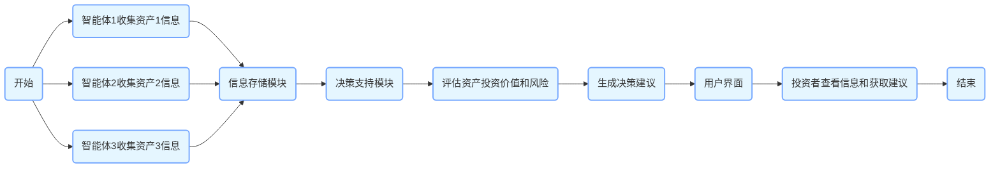

# 智能体协作提高价值投资的跨资产类别对比分析

> 关键词：智能体协作、价值投资、跨资产类别、对比分析、投资决策

> 摘要：本文聚焦于智能体协作在价值投资领域的应用，深入探讨如何通过智能体协作实现跨资产类别的对比分析，以提高价值投资的准确性和效率。首先介绍了研究的背景，包括目的、预期读者等内容。接着阐述了智能体、价值投资、跨资产类别等核心概念及其联系，并给出相应的原理和架构示意图与流程图。详细讲解了核心算法原理及具体操作步骤，辅以 Python 源代码说明。同时给出了相关的数学模型和公式，并举例进行说明。通过项目实战展示了代码的实际案例及详细解释。分析了智能体协作在价值投资跨资产类别对比分析中的实际应用场景。推荐了相关的学习资源、开发工具框架以及论文著作。最后总结了未来发展趋势与挑战，提供了常见问题解答及扩展阅读和参考资料，旨在为投资者和相关研究人员提供全面深入的技术指导和决策参考。

## 1. 背景介绍 
### 1.1 目的和范围
价值投资作为一种重要的投资策略，旨在寻找被低估的资产并长期持有以获取价值回归带来的收益。然而，在当今复杂多变的金融市场中，资产类别日益丰富，包括股票、债券、期货、外汇、房地产等，投资者面临着如何在众多资产类别中进行有效比较和选择的难题。本研究的目的在于利用智能体协作的技术手段，实现对不同资产类别的综合评估和对比分析，为投资者提供更科学、准确的投资决策依据。

本研究的范围涵盖了常见的主要资产类别，通过智能体的协作和信息交互，对各类资产的基本面、市场表现、风险特征等多方面因素进行分析，以找出具有较高投资价值的资产组合。

### 1.2 预期读者
本文的预期读者包括专业投资者、投资机构的分析师、金融科技领域的研究人员、对价值投资和人工智能应用感兴趣的学生以及相关行业的从业者。希望通过本文的阐述，能够帮助读者深入理解智能体协作在价值投资跨资产类别对比分析中的原理、方法和应用，为其在投资实践和研究中提供有益的参考。

### 1.3 文档结构概述
本文将按照以下结构展开：首先介绍相关的背景信息，包括研究目的、预期读者等；接着阐述智能体、价值投资、跨资产类别等核心概念及其联系，并给出相应的原理和架构示意图与流程图；详细讲解核心算法原理及具体操作步骤，辅以 Python 源代码说明；同时给出相关的数学模型和公式，并举例进行说明；通过项目实战展示代码的实际案例及详细解释；分析智能体协作在价值投资跨资产类别对比分析中的实际应用场景；推荐相关的学习资源、开发工具框架以及论文著作；最后总结未来发展趋势与挑战，提供常见问题解答及扩展阅读和参考资料。

### 1.4 术语表
#### 1.4.1 核心术语定义
- **智能体（Agent）**：是一种能够感知环境、自主决策并采取行动以实现特定目标的实体。在本研究中，智能体可以是软件程序，负责收集、分析和处理与资产相关的信息。
- **价值投资（Value Investing）**：是一种基于资产内在价值的投资策略，投资者通过分析资产的基本面，寻找被市场低估的资产，并在价格回归其内在价值时获得收益。
- **跨资产类别（Cross - Asset Class）**：指涉及不同类型资产的投资活动，常见的资产类别包括股票、债券、期货、外汇、房地产等。

#### 1.4.2 相关概念解释
- **资产内在价值（Intrinsic Value）**：是指资产本身所具有的真实价值，通常通过对资产的财务状况、盈利能力、市场竞争力等因素进行分析和评估得出。
- **风险调整后收益（Risk - Adjusted Return）**：是指在考虑投资风险的情况下，衡量投资收益的一种指标。常见的风险调整后收益指标包括夏普比率、特雷诺比率等。

#### 1.4.3 缩略词列表
- **AI（Artificial Intelligence）**：人工智能
- **ML（Machine Learning）**：机器学习
- **RL（Reinforcement Learning）**：强化学习
- **VAR（Value at Risk）**：风险价值

## 2. 核心概念与联系 
### 2.1 智能体的概念与原理
智能体是一种具有自主性、反应性、社会性和适应性的实体。自主性意味着智能体能够独立地感知环境并做出决策；反应性表示智能体能够对环境中的变化做出及时的响应；社会性体现了智能体之间可以进行交互和协作；适应性则表明智能体能够根据环境的变化调整自己的行为和策略。

智能体的基本架构通常包括感知模块、决策模块和执行模块。感知模块负责收集环境中的信息，决策模块根据感知到的信息进行分析和推理，做出决策，执行模块则根据决策结果采取相应的行动。

### 2.2 价值投资的概念与原理
价值投资的核心思想是寻找被市场低估的资产。投资者通过对资产的基本面进行深入分析，包括财务报表、行业前景、公司竞争力等方面，评估资产的内在价值。当市场价格低于资产的内在价值时，投资者认为该资产具有投资价值，从而进行买入操作；当市场价格回归或超过资产的内在价值时，投资者可以选择卖出资产以获取收益。

### 2.3 跨资产类别的概念与原理
跨资产类别投资是指投资者将资金分散投资于不同类型的资产，以降低投资组合的风险并提高收益的稳定性。不同资产类别具有不同的风险和收益特征，例如股票具有较高的收益潜力但风险也相对较大，债券则相对较为稳定，收益较低。通过合理配置不同资产类别，可以实现风险和收益的平衡。

### 2.4 智能体协作与价值投资、跨资产类别的联系
智能体协作可以在价值投资的跨资产类别对比分析中发挥重要作用。多个智能体可以分别负责不同资产类别的信息收集和分析，通过协作和信息共享，实现对各类资产的综合评估。智能体可以利用机器学习和数据分析技术，对资产的基本面、市场表现等信息进行处理和挖掘，为价值投资提供更准确的决策依据。同时，智能体协作还可以帮助投资者优化资产配置，实现跨资产类别的风险分散和收益最大化。

### 2.5 核心概念原理和架构的文本示意图
智能体协作提高价值投资的跨资产类别对比分析系统的架构主要包括多个智能体、信息存储模块、决策支持模块和用户界面。多个智能体分别负责不同资产类别的信息收集和分析，将收集到的信息存储在信息存储模块中。决策支持模块对存储的信息进行综合处理和分析，利用机器学习和数据分析技术，评估资产的投资价值和风险，为投资者提供决策建议。用户界面则为投资者提供与系统交互的接口，方便投资者查看信息和获取决策建议。

### 2.6 Mermaid 流程图


## 3. 核心算法原理 & 具体操作步骤 
### 3.1 核心算法原理
在智能体协作提高价值投资的跨资产类别对比分析中，主要涉及到的核心算法包括机器学习算法和多智能体协作算法。

#### 3.1.1 机器学习算法
机器学习算法用于对资产的信息进行处理和分析，以评估资产的投资价值和风险。常见的机器学习算法包括线性回归、逻辑回归、决策树、随机森林、支持向量机等。

以线性回归为例，线性回归是一种用于建立自变量和因变量之间线性关系的统计模型。在价值投资中，可以将资产的基本面指标（如市盈率、市净率等）作为自变量，将资产的收益率作为因变量，建立线性回归模型，以预测资产的收益率。

#### 3.1.2 多智能体协作算法
多智能体协作算法用于协调多个智能体之间的行为和信息交互，以实现共同的目标。常见的多智能体协作算法包括合同网协议、拍卖算法、基于博弈论的协作算法等。

以合同网协议为例，合同网协议是一种基于任务分配的多智能体协作算法。在该算法中，一个智能体作为管理者，发布任务请求，其他智能体作为参与者，根据自身的能力和资源对任务进行投标。管理者根据投标结果选择最合适的参与者执行任务。

### 3.2 具体操作步骤
#### 3.2.1 数据收集
多个智能体分别负责不同资产类别的信息收集，包括资产的基本面信息、市场表现信息、宏观经济信息等。信息收集的来源可以包括金融数据库、新闻媒体、公司公告等。

#### 3.2.2 数据预处理
对收集到的信息进行预处理，包括数据清洗、数据归一化、特征提取等操作。数据清洗用于去除数据中的噪声和异常值，数据归一化用于将不同尺度的数据转换为相同的尺度，特征提取用于从原始数据中提取出有代表性的特征。

#### 3.2.3 模型训练
利用预处理后的数据对机器学习模型进行训练，以建立资产的投资价值和风险评估模型。训练过程中，可以采用交叉验证等方法对模型进行优化和评估。

#### 3.2.4 智能体协作
多个智能体通过多智能体协作算法进行信息交互和任务分配，共同完成对不同资产类别的对比分析。智能体可以将自己的分析结果发送给其他智能体，同时接收其他智能体的分析结果，以实现信息共享和协作。

#### 3.2.5 决策支持
根据智能体的协作结果，决策支持模块对不同资产类别的投资价值和风险进行综合评估，为投资者提供决策建议。决策建议可以包括资产的买入、卖出、持有等操作建议，以及资产配置的比例建议。

### 3.3 Python 源代码实现
以下是一个简单的 Python 代码示例，演示了如何使用线性回归模型对股票的收益率进行预测：

```python
import pandas as pd
from sklearn.linear_model import LinearRegression
from sklearn.model_selection import train_test_split
from sklearn.preprocessing import StandardScaler

# 读取数据
data = pd.read_csv('stock_data.csv')

# 提取特征和标签
X = data[['pe_ratio', 'pb_ratio', 'roe']]
y = data['return_rate']

# 数据预处理
scaler = StandardScaler()
X = scaler.fit_transform(X)

# 划分训练集和测试集
X_train, X_test, y_train, y_test = train_test_split(X, y, test_size=0.2, random_state=42)

# 训练线性回归模型
model = LinearRegression()
model.fit(X_train, y_train)

# 预测
y_pred = model.predict(X_test)

# 评估模型
from sklearn.metrics import mean_squared_error
mse = mean_squared_error(y_test, y_pred)
print(f"Mean Squared Error: {mse}")
```

## 4. 数学模型和公式 & 详细讲解 & 举例说明 
### 4.1 线性回归模型
线性回归模型是一种用于建立自变量和因变量之间线性关系的统计模型。其数学表达式为：

$$y = \beta_0 + \beta_1x_1 + \beta_2x_2 + \cdots + \beta_nx_n + \epsilon$$

其中，$y$ 是因变量，$x_1, x_2, \cdots, x_n$ 是自变量，$\beta_0, \beta_1, \beta_2, \cdots, \beta_n$ 是回归系数，$\epsilon$ 是误差项。

线性回归模型的目标是通过最小化误差项的平方和来估计回归系数。误差项的平方和可以表示为：

$$SSE = \sum_{i=1}^{m}(y_i - \hat{y}_i)^2$$

其中，$m$ 是样本数量，$y_i$ 是实际值，$\hat{y}_i$ 是预测值。

通过最小化 $SSE$，可以得到回归系数的估计值。在 Python 中，可以使用 `sklearn` 库中的 `LinearRegression` 类来实现线性回归模型。

### 4.2 风险调整后收益指标
#### 4.2.1 夏普比率
夏普比率是一种衡量投资组合风险调整后收益的指标，其数学表达式为：

$$Sharpe Ratio = \frac{R_p - R_f}{\sigma_p}$$

其中，$R_p$ 是投资组合的预期收益率，$R_f$ 是无风险收益率，$\sigma_p$ 是投资组合的收益率标准差。

夏普比率越高，说明投资组合在承担相同风险的情况下获得的收益越高。

#### 4.2.2 特雷诺比率
特雷诺比率也是一种衡量投资组合风险调整后收益的指标，其数学表达式为：

$$Treynor Ratio = \frac{R_p - R_f}{\beta_p}$$

其中，$\beta_p$ 是投资组合的贝塔系数，反映了投资组合相对于市场的系统性风险。

### 4.3 举例说明
假设我们有一个投资组合，其预期收益率为 15%，无风险收益率为 3%，收益率标准差为 20%，贝塔系数为 1.2。则该投资组合的夏普比率和特雷诺比率分别为：

$$Sharpe Ratio = \frac{0.15 - 0.03}{0.2} = 0.6$$

$$Treynor Ratio = \frac{0.15 - 0.03}{1.2} = 0.1$$

通过计算夏普比率和特雷诺比率，可以对投资组合的风险调整后收益进行评估，从而为投资者提供决策参考。

## 5. 项目实战：代码实际案例和详细解释说明 
### 5.1  开发环境搭建
#### 5.1.1 安装 Python
首先需要安装 Python 环境，建议安装 Python 3.7 及以上版本。可以从 Python 官方网站（https://www.python.org/downloads/） 下载并安装。

#### 5.1.2 安装必要的库
在本项目中，需要使用到 `pandas`、`numpy`、`sklearn` 等库。可以使用以下命令进行安装：

```bash
pip install pandas numpy scikit-learn
```

### 5.2  源代码详细实现和代码解读
以下是一个完整的项目实战代码示例，实现了智能体协作提高价值投资的跨资产类别对比分析的基本功能：

```python
import pandas as pd
import numpy as np
from sklearn.linear_model import LinearRegression
from sklearn.model_selection import train_test_split
from sklearn.preprocessing import StandardScaler
from sklearn.metrics import mean_squared_error

# 智能体类
class Agent:
    def __init__(self, asset_type):
        self.asset_type = asset_type

    def collect_data(self):
        # 模拟数据收集
        if self.asset_type == 'stock':
            data = pd.read_csv('stock_data.csv')
        elif self.asset_type == 'bond':
            data = pd.read_csv('bond_data.csv')
        else:
            data = None
        return data

    def preprocess_data(self, data):
        # 数据预处理
        if data is not None:
            X = data[['pe_ratio', 'pb_ratio', 'roe']]
            y = data['return_rate']
            scaler = StandardScaler()
            X = scaler.fit_transform(X)
            return X, y
        else:
            return None, None

    def train_model(self, X, y):
        # 训练模型
        if X is not None and y is not None:
            X_train, X_test, y_train, y_test = train_test_split(X, y, test_size=0.2, random_state=42)
            model = LinearRegression()
            model.fit(X_train, y_train)
            y_pred = model.predict(X_test)
            mse = mean_squared_error(y_test, y_pred)
            return model, mse
        else:
            return None, None

# 主函数
def main():
    # 创建智能体
    stock_agent = Agent('stock')
    bond_agent = Agent('bond')

    # 数据收集
    stock_data = stock_agent.collect_data()
    bond_data = bond_agent.collect_data()

    # 数据预处理
    stock_X, stock_y = stock_agent.preprocess_data(stock_data)
    bond_X, bond_y = bond_agent.preprocess_data(bond_data)

    # 模型训练
    stock_model, stock_mse = stock_agent.train_model(stock_X, stock_y)
    bond_model, bond_mse = bond_agent.train_model(bond_X, bond_y)

    # 输出结果
    print(f"Stock Model MSE: {stock_mse}")
    print(f"Bond Model MSE: {bond_mse}")

if __name__ == "__main__":
    main()
```

### 5.3  代码解读与分析
#### 5.3.1 智能体类
`Agent` 类表示一个智能体，每个智能体负责一种资产类别的信息收集、数据预处理和模型训练。`__init__` 方法用于初始化智能体的资产类型，`collect_data` 方法用于模拟数据收集，`preprocess_data` 方法用于对收集到的数据进行预处理，`train_model` 方法用于训练线性回归模型并评估模型的性能。

#### 5.3.2 主函数
`main` 函数是程序的入口，负责创建智能体、调用智能体的方法进行数据收集、预处理和模型训练，并输出模型的评估结果。

通过这个项目实战，可以看到智能体协作在价值投资的跨资产类别对比分析中的基本实现过程。多个智能体分别负责不同资产类别的分析，通过协作和信息共享，可以实现对不同资产类别的综合评估。

## 6. 实际应用场景 
### 6.1 投资机构的资产配置决策
投资机构在进行资产配置决策时，需要考虑不同资产类别的风险和收益特征。通过智能体协作提高价值投资的跨资产类别对比分析，可以帮助投资机构更全面、准确地评估不同资产类别的投资价值，从而优化资产配置方案，降低投资风险，提高投资收益。

### 6.2 个人投资者的投资决策
个人投资者在进行投资决策时，往往面临着信息不足、分析能力有限等问题。智能体协作可以为个人投资者提供更专业、全面的投资分析和决策建议，帮助个人投资者做出更明智的投资决策。

### 6.3 金融监管机构的市场监测
金融监管机构需要对金融市场进行实时监测，以防范金融风险。智能体协作可以帮助金融监管机构收集和分析不同资产类别的信息，及时发现市场异常情况，采取相应的监管措施，维护金融市场的稳定。

### 6.4 企业的战略投资决策
企业在进行战略投资决策时，需要考虑不同投资项目的风险和收益特征。通过智能体协作提高价值投资的跨资产类别对比分析，可以帮助企业更准确地评估不同投资项目的价值，从而做出更合理的战略投资决策。

## 7. 工具和资源推荐
### 7.1 学习资源推荐
#### 7.1.1 书籍推荐
- 《Python 数据分析实战》：本书详细介绍了 Python 在数据分析领域的应用，包括数据处理、数据分析、数据可视化等方面的内容，对于学习智能体协作和价值投资的数据分析部分有很大帮助。
- 《机器学习》（周志华著）：这是一本机器学习领域的经典教材，全面介绍了机器学习的基本概念、算法和应用，对于理解智能体协作中使用的机器学习算法有很大的帮助。
- 《价值投资：从格雷厄姆到巴菲特》：本书系统地介绍了价值投资的理论和实践，包括价值投资的基本原理、选股方法、投资策略等内容，对于深入理解价值投资的理念和方法有很大的帮助。

#### 7.1.2 在线课程
- Coursera 上的“机器学习”课程：由斯坦福大学的 Andrew Ng 教授授课，是一门非常经典的机器学习在线课程，涵盖了机器学习的基本概念、算法和应用，对于学习智能体协作中的机器学习算法有很大的帮助。
- edX 上的“Python 数据科学”课程：该课程介绍了 Python 在数据科学领域的应用，包括数据处理、数据分析、数据可视化等方面的内容，对于学习智能体协作中的数据分析部分有很大的帮助。
- Udemy 上的“价值投资实战”课程：该课程结合实际案例，介绍了价值投资的理念、方法和实践，对于理解价值投资的实际应用有很大的帮助。

#### 7.1.3 技术博客和网站
- 机器之心（https://www.alienlab.cn/）：专注于人工智能领域的技术博客，提供了大量关于人工智能、机器学习、深度学习等方面的技术文章和资讯，对于了解智能体协作的最新技术和发展趋势有很大的帮助。
- 金融界（https://www.jrj.com.cn/）：提供了丰富的金融市场信息和投资分析工具，对于了解金融市场的动态和价值投资的实践有很大的帮助。
- 雪球（https://xueqiu.com/）：是一个投资者社区，提供了大量的投资分析、研究报告和投资策略分享，对于了解价值投资的实践和交流投资经验有很大的帮助。

### 7.2 开发工具框架推荐
#### 7.2.1 IDE和编辑器
- PyCharm：是一款专业的 Python 集成开发环境，提供了丰富的代码编辑、调试、测试等功能，对于开发智能体协作和价值投资的 Python 代码有很大的帮助。
- Jupyter Notebook：是一个交互式的开发环境，支持 Python、R 等多种编程语言，适合进行数据分析和模型训练的实验和演示。

#### 7.2.2 调试和性能分析工具
- pdb：是 Python 自带的调试工具，可以帮助开发者进行代码调试和问题排查。
- cProfile：是 Python 自带的性能分析工具，可以帮助开发者分析代码的性能瓶颈，优化代码性能。

#### 7.2.3 相关框架和库
- pandas：是一个强大的数据分析库，提供了丰富的数据结构和数据处理功能，适合进行金融数据的处理和分析。
- numpy：是一个基础的数值计算库，提供了高效的数组和矩阵运算功能，适合进行机器学习算法的实现。
- sklearn：是一个常用的机器学习库，提供了丰富的机器学习算法和工具，适合进行智能体协作中的机器学习模型训练和评估。

### 7.3 相关论文著作推荐
#### 7.3.1 经典论文
- Fama, E. F., & French, K. R. (1992). The cross - section of expected stock returns. The Journal of Finance, 47(2), 427 - 465. 该论文提出了著名的 Fama - French 三因子模型，用于解释股票收益率的横截面差异，对于理解价值投资的理论基础有很大的帮助。
- Sharpe, W. F. (1964). Capital asset prices: A theory of market equilibrium under conditions of risk. The Journal of Finance, 19(3), 425 - 442. 该论文提出了资本资产定价模型（CAPM），用于描述资产的预期收益率与风险之间的关系，对于理解风险调整后收益的概念有很大的帮助。

#### 7.3.2 最新研究成果
- 可以通过学术数据库（如 IEEE Xplore、ACM Digital Library、ScienceDirect 等）搜索关于智能体协作、价值投资、跨资产类别分析等方面的最新研究论文，了解该领域的最新发展动态和研究成果。

#### 7.3.3 应用案例分析
- 可以参考一些金融科技公司的研究报告和案例分析，了解智能体协作在价值投资和跨资产类别分析中的实际应用案例和效果。例如，一些量化投资公司的研究报告中可能会介绍他们如何利用智能体协作和机器学习算法进行资产配置和投资决策。

## 8. 总结：未来发展趋势与挑战
### 8.1 未来发展趋势
#### 8.1.1 智能化程度不断提高
随着人工智能技术的不断发展，智能体的智能化程度将不断提高。智能体将能够更加自主地感知环境、做出决策和采取行动，实现更高效的协作和更准确的投资分析。

#### 8.1.2 多学科融合趋势明显
智能体协作提高价值投资的跨资产类别对比分析涉及到人工智能、金融、数学等多个学科领域。未来，多学科融合的趋势将更加明显，不同学科的知识和技术将相互渗透和融合，为该领域的发展带来新的机遇和挑战。

#### 8.1.3 应用场景不断拓展
智能体协作在价值投资领域的应用场景将不断拓展。除了投资机构的资产配置决策、个人投资者的投资决策等传统应用场景外，还将应用于金融监管、企业战略投资等更多领域。

### 8.2 挑战
#### 8.2.1 数据质量和安全性问题
智能体协作需要大量的金融数据作为支撑，数据的质量和安全性直接影响到分析结果的准确性和可靠性。因此，如何保证数据的质量和安全性是一个亟待解决的问题。

#### 8.2.2 算法的可解释性问题
机器学习算法在智能体协作中得到了广泛应用，但一些算法（如深度学习算法）的可解释性较差，难以理解其决策过程和依据。在价值投资领域，投资者需要了解算法的决策过程和依据，以便做出合理的投资决策。因此，如何提高算法的可解释性是一个重要的挑战。

#### 8.2.3 法律法规和伦理问题
智能体协作在金融领域的应用涉及到法律法规和伦理问题。例如，智能体的决策是否符合法律法规的要求，是否会对投资者的利益造成损害等。因此，需要建立健全相关的法律法规和伦理准则，规范智能体协作在金融领域的应用。

## 9. 附录：常见问题与解答
### 9.1 智能体协作在价值投资中的优势是什么？
智能体协作在价值投资中的优势主要包括：可以实现信息的快速收集和处理，提高分析效率；多个智能体可以从不同的角度对资产进行分析，提高分析的准确性和全面性；智能体可以根据环境的变化及时调整策略，提高投资决策的灵活性和适应性。

### 9.2 如何选择合适的机器学习算法？
选择合适的机器学习算法需要考虑多个因素，包括数据的特点、问题的类型、算法的性能等。例如，如果数据是线性可分的，可以选择线性回归、逻辑回归等线性算法；如果数据是非线性的，可以选择决策树、随机森林、支持向量机等非线性算法。同时，还可以通过交叉验证等方法对不同的算法进行评估和比较，选择性能最优的算法。

### 9.3 如何保证智能体协作的安全性？
保证智能体协作的安全性需要从多个方面入手，包括数据的加密和存储安全、智能体的身份认证和授权、网络的安全防护等。同时，还需要建立健全安全管理制度和应急预案，及时发现和处理安全问题。

### 9.4 智能体协作在价值投资中的应用前景如何？
智能体协作在价值投资中的应用前景非常广阔。随着人工智能技术的不断发展和金融市场的不断变化，智能体协作将在投资决策、资产配置、风险控制等方面发挥越来越重要的作用，为投资者提供更科学、准确的决策依据，提高投资收益和降低投资风险。

## 10. 扩展阅读 & 参考资料
### 10.1 扩展阅读
- 《人工智能：一种现代方法》：本书全面介绍了人工智能的基本概念、算法和应用，对于深入理解智能体的原理和技术有很大的帮助。
- 《金融市场学》：本书系统地介绍了金融市场的基本理论、运行机制和投资策略，对于了解金融市场的基本知识和价值投资的实践有很大的帮助。

### 10.2 参考资料
- 相关金融数据库的官方文档和使用说明，如 Wind 数据库、东方财富数据库等。
- 相关 Python 库的官方文档和教程，如 pandas、numpy、sklearn 等。
- 相关学术论文和研究报告，可以通过学术数据库（如 IEEE Xplore、ACM Digital Library、ScienceDirect 等）进行搜索和获取。