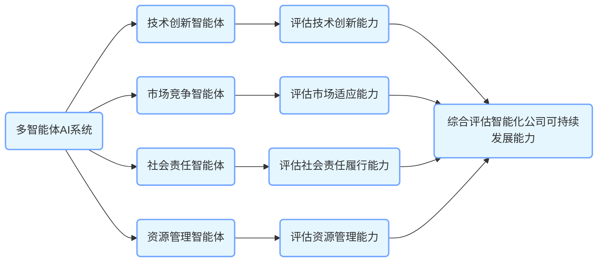

# 智能化公司可持续发展能力分析：多智能体AI的新方法

> 关键词：智能化公司、可持续发展能力、多智能体AI、分析方法、人工智能

> 摘要：本文聚焦于智能化公司可持续发展能力的分析，创新性地引入多智能体AI的新方法。首先阐述了智能化公司可持续发展能力分析的背景与重要性，详细介绍了多智能体AI的核心概念、原理及架构。通过Python代码详细阐述了相关核心算法原理和具体操作步骤，并运用数学模型和公式对其进行深入讲解与举例说明。在项目实战部分，给出了实际案例及详细解释。探讨了该方法在实际中的应用场景，推荐了相关的工具和资源。最后总结了未来发展趋势与挑战，解答常见问题并提供扩展阅读与参考资料，旨在为智能化公司可持续发展能力分析提供全面且深入的技术支持和理论指导。

## 1. 背景介绍 
### 1.1 目的和范围
在当今数字化和智能化快速发展的时代，智能化公司如雨后春笋般涌现。这些公司在技术创新、市场竞争等方面面临着诸多挑战和机遇。可持续发展能力是衡量智能化公司长期生存和发展潜力的重要指标。本研究的目的在于探索一种基于多智能体AI的新方法，能够更准确、全面地分析智能化公司的可持续发展能力。

研究范围涵盖了智能化公司的各个方面，包括技术创新能力、市场适应能力、资源管理能力、社会责任履行能力等。通过多智能体AI的模拟和分析，综合考虑公司内部和外部环境的各种因素，为智能化公司的可持续发展提供科学的评估和决策依据。

### 1.2 预期读者
本文预期读者主要包括以下几类人群：
1. **智能化公司的管理者和决策者**：帮助他们深入了解公司的可持续发展能力，制定科学合理的发展战略。
2. **人工智能领域的研究人员**：为他们在多智能体AI的应用研究方面提供新的思路和方向。
3. **投资者**：辅助他们评估智能化公司的投资价值和风险。
4. **相关专业的学生**：作为学习智能化公司管理和多智能体AI技术的参考资料。

### 1.3 文档结构概述
本文将按照以下结构进行阐述：
1. **背景介绍**：介绍研究的目的、范围、预期读者和文档结构概述，以及相关术语的定义和解释。
2. **核心概念与联系**：详细介绍多智能体AI和智能化公司可持续发展能力的核心概念，以及它们之间的联系，并给出相应的文本示意图和Mermaid流程图。
3. **核心算法原理 & 具体操作步骤**：运用Python源代码详细阐述多智能体AI的核心算法原理和具体操作步骤。
4. **数学模型和公式 & 详细讲解 & 举例说明**：通过数学模型和公式对多智能体AI分析智能化公司可持续发展能力的方法进行深入讲解，并举例说明。
5. **项目实战：代码实际案例和详细解释说明**：给出实际的项目案例，包括开发环境搭建、源代码详细实现和代码解读。
6. **实际应用场景**：探讨多智能体AI在智能化公司可持续发展能力分析中的实际应用场景。
7. **工具和资源推荐**：推荐相关的学习资源、开发工具框架和论文著作。
8. **总结：未来发展趋势与挑战**：总结多智能体AI在智能化公司可持续发展能力分析中的未来发展趋势和面临的挑战。
9. **附录：常见问题与解答**：解答读者在阅读过程中可能遇到的常见问题。
10. **扩展阅读 & 参考资料**：提供相关的扩展阅读材料和参考资料。

### 1.4 术语表
#### 1.4.1 核心术语定义
1. **智能化公司**：指运用先进的信息技术和人工智能技术，实现业务流程自动化、决策智能化，以提高运营效率和创新能力的公司。
2. **可持续发展能力**：指公司在长期发展过程中，能够在经济、社会和环境等方面保持平衡和协调发展的能力。
3. **多智能体AI**：指由多个智能体组成的人工智能系统，每个智能体具有一定的自主性和智能性，能够通过相互协作和交互来完成复杂的任务。

#### 1.4.2 相关概念解释
1. **智能体**：是一个具有感知、决策和行动能力的实体，能够根据环境的变化自主地做出决策和采取行动。
2. **协作**：指多个智能体之间通过信息共享和相互配合，共同完成一个或多个任务的过程。
3. **交互**：指智能体之间通过某种通信机制进行信息传递和交流的过程。

#### 1.4.3 缩略词列表
1. **AI**：Artificial Intelligence（人工智能）
2. **MAS**：Multi - Agent System（多智能体系统）

## 2. 核心概念与联系 
### 多智能体AI的核心概念
多智能体AI是由多个智能体组成的系统。每个智能体都有自己的目标、知识和能力。智能体可以感知周围环境的信息，根据自身的知识和目标进行决策，并采取相应的行动。智能体之间可以通过通信机制进行信息交换和协作，以实现共同的目标。

多智能体AI的优点在于其灵活性和适应性。由于每个智能体都具有一定的自主性，系统可以根据环境的变化动态地调整智能体的行为和协作方式，从而更好地应对复杂多变的情况。

### 智能化公司可持续发展能力的核心概念
智能化公司的可持续发展能力是一个综合的概念，它涉及到公司的多个方面。从经济角度来看，公司需要具备良好的盈利能力和财务稳定性，能够在市场竞争中保持优势。从社会角度来看，公司需要履行社会责任，关注员工福利、消费者权益和社会发展。从环境角度来看，公司需要采取环保措施，减少对环境的负面影响。

### 多智能体AI与智能化公司可持续发展能力的联系
多智能体AI可以为智能化公司可持续发展能力的分析提供有力的支持。通过将智能化公司的各个方面抽象为不同的智能体，如技术创新智能体、市场竞争智能体、社会责任智能体等，多智能体AI可以模拟这些智能体之间的相互作用和协作，从而更全面地分析公司的可持续发展能力。

例如，技术创新智能体可以根据公司的研发投入和技术水平，评估公司的技术创新能力；市场竞争智能体可以根据市场需求和竞争态势，评估公司的市场适应能力；社会责任智能体可以根据公司的社会责任履行情况，评估公司的社会形象和声誉。这些智能体之间相互协作和信息共享，最终得出对公司可持续发展能力的综合评估。

### 文本示意图
多智能体AI与智能化公司可持续发展能力的关系可以用以下文本示意图表示：

智能化公司可持续发展能力分析是一个复杂的系统工程，多智能体AI作为一种强大的分析工具，通过多个智能体的协作和交互，对智能化公司的各个方面进行评估和分析。每个智能体代表智能化公司的一个特定方面，如技术、市场、社会等。智能体之间通过信息传递和协作，形成一个有机的整体，共同完成对公司可持续发展能力的评估。

### Mermaid流程图


## 3. 核心算法原理 & 具体操作步骤 
### 核心算法原理
多智能体AI分析智能化公司可持续发展能力的核心算法主要基于智能体的决策和协作机制。每个智能体都有自己的决策规则和目标函数，根据感知到的环境信息和其他智能体传递的信息，智能体可以做出决策并采取相应的行动。

智能体的决策过程可以用以下步骤表示：
1. **感知环境信息**：智能体通过传感器或其他方式获取周围环境的信息，如市场需求、技术发展趋势、社会舆论等。
2. **更新自身知识**：智能体根据感知到的信息，更新自己的知识和信念。
3. **生成决策方案**：智能体根据自身的目标和知识，生成多个可能的决策方案。
4. **评估决策方案**：智能体根据一定的评估标准，对生成的决策方案进行评估，选择最优的决策方案。
5. **执行决策方案**：智能体根据选择的决策方案，采取相应的行动。

智能体之间的协作机制主要包括信息共享和任务分配。智能体可以通过通信机制将自己的信息传递给其他智能体，同时也可以接收其他智能体传递的信息。在任务分配方面，智能体可以根据自身的能力和任务的需求，将任务分配给其他智能体，以实现任务的高效完成。

### 具体操作步骤
以下是使用Python实现多智能体AI分析智能化公司可持续发展能力的具体操作步骤：

#### 步骤1：定义智能体类
```python
class Agent:
    def __init__(self, name, goals):
        self.name = name
        self.goals = goals
        self.knowledge = {}
        self.decision = None

    def perceive(self, environment):
        # 感知环境信息
        self.knowledge.update(environment)

    def update_knowledge(self):
        # 更新自身知识
        # 这里可以根据具体需求实现知识更新的逻辑
        pass

    def generate_decisions(self):
        # 生成决策方案
        # 这里可以根据具体需求实现决策方案生成的逻辑
        decisions = []
        return decisions

    def evaluate_decisions(self, decisions):
        # 评估决策方案
        # 这里可以根据具体需求实现决策方案评估的逻辑
        best_decision = None
        return best_decision

    def make_decision(self):
        self.update_knowledge()
        decisions = self.generate_decisions()
        self.decision = self.evaluate_decisions(decisions)
        return self.decision

    def communicate(self, other_agents):
        # 与其他智能体通信
        for agent in other_agents:
            if agent != self:
                # 这里可以实现信息传递的逻辑
                pass
```

#### 步骤2：定义环境类
```python
class Environment:
    def __init__(self):
        self.state = {}

    def update_state(self, new_state):
        self.state.update(new_state)

    def get_state(self):
        return self.state
```

#### 步骤3：创建智能体和环境实例
```python
# 创建环境实例
environment = Environment()

# 创建智能体实例
tech_agent = Agent("技术创新智能体", ["提高技术创新能力"])
market_agent = Agent("市场竞争智能体", ["提高市场适应能力"])
social_agent = Agent("社会责任智能体", ["履行社会责任"])

agents = [tech_agent, market_agent, social_agent]
```

#### 步骤4：模拟智能体的决策和协作过程
```python
# 模拟环境变化
new_state = {"市场需求增加": True, "技术发展趋势": "人工智能技术"}
environment.update_state(new_state)

# 智能体感知环境信息
for agent in agents:
    agent.perceive(environment.get_state())

# 智能体做出决策
for agent in agents:
    decision = agent.make_decision()
    print(f"{agent.name}的决策是: {decision}")

# 智能体之间通信
for agent in agents:
    agent.communicate(agents)
```

## 4. 数学模型和公式 & 详细讲解 & 举例说明 
### 数学模型
多智能体AI分析智能化公司可持续发展能力的数学模型可以基于多目标优化理论。设智能化公司的可持续发展能力可以用一个向量 $S=(s_1, s_2, \cdots, s_n)$ 表示，其中 $s_i$ 表示公司在第 $i$ 个方面的可持续发展能力指标，如技术创新能力、市场适应能力、社会责任履行能力等。

每个智能体的目标可以用一个目标函数 $f_i(S)$ 表示，智能体的决策过程就是在满足一定约束条件的情况下，最大化自己的目标函数。设智能体的决策变量为 $x=(x_1, x_2, \cdots, x_m)$，则智能体的决策问题可以表示为：

$$
\begin{cases}
\max f_i(S(x)) \\
\text{s.t. } g_j(x) \leq 0, j = 1, 2, \cdots, k \\
h_l(x) = 0, l = 1, 2, \cdots, p
\end{cases}
$$

其中 $g_j(x)$ 表示不等式约束条件，$h_l(x)$ 表示等式约束条件。

### 详细讲解
在上述数学模型中，目标函数 $f_i(S(x))$ 表示智能体在决策变量 $x$ 下的目标值。例如，对于技术创新智能体，目标函数可以表示为技术创新能力的提升程度；对于市场竞争智能体，目标函数可以表示为市场份额的增加程度。

约束条件 $g_j(x) \leq 0$ 和 $h_l(x) = 0$ 表示智能体在决策过程中需要满足的限制条件。例如，资源限制、法律法规限制等。

多智能体之间的协作可以通过信息共享和协调目标函数来实现。智能体可以将自己的目标函数和决策信息传递给其他智能体，其他智能体可以根据这些信息调整自己的决策，以实现整体目标的优化。

### 举例说明
假设智能化公司的可持续发展能力可以用技术创新能力 $s_1$、市场适应能力 $s_2$ 和社会责任履行能力 $s_3$ 三个指标来表示。技术创新智能体的目标是最大化技术创新能力，其目标函数可以表示为：

$$
f_1(S) = a_1s_1
$$

其中 $a_1$ 是一个权重系数，表示技术创新能力在技术创新智能体目标中的重要程度。

市场竞争智能体的目标是最大化市场适应能力，其目标函数可以表示为：

$$
f_2(S) = a_2s_2
$$

其中 $a_2$ 是一个权重系数，表示市场适应能力在市场竞争智能体目标中的重要程度。

社会责任智能体的目标是最大化社会责任履行能力，其目标函数可以表示为：

$$
f_3(S) = a_3s_3
$$

其中 $a_3$ 是一个权重系数，表示社会责任履行能力在社会责任智能体目标中的重要程度。

假设公司的资源有限，技术创新、市场竞争和社会责任履行都需要消耗一定的资源。设技术创新的资源消耗为 $r_1(x)$，市场竞争的资源消耗为 $r_2(x)$，社会责任履行的资源消耗为 $r_3(x)$，则资源约束条件可以表示为：

$$
r_1(x) + r_2(x) + r_3(x) \leq R
$$

其中 $R$ 是公司的总资源量。

每个智能体在决策过程中，需要在满足资源约束条件的情况下，最大化自己的目标函数。同时，智能体之间可以通过信息共享和协作，调整自己的决策，以实现公司整体可持续发展能力的提升。

## 5. 项目实战：代码实际案例和详细解释说明 
### 5.1  开发环境搭建
#### 开发环境选择
本项目使用Python语言进行开发，推荐使用Python 3.7及以上版本。开发环境可以选择以下几种：
1. **Anaconda**：Anaconda是一个开源的Python发行版本，包含了Python解释器、常用的科学计算库和开发工具。可以从Anaconda官方网站（https://www.anaconda.com/ ）下载并安装适合自己操作系统的版本。
2. **PyCharm**：PyCharm是一款专业的Python集成开发环境（IDE），提供了代码编辑、调试、版本控制等强大的功能。可以从JetBrains官方网站（https://www.jetbrains.com/pycharm/ ）下载并安装适合自己操作系统的版本。

#### 安装依赖库
本项目需要使用一些Python库，如`numpy`、`pandas`等。可以使用以下命令进行安装：
```sh
pip install numpy pandas
```

### 5.2  源代码详细实现和代码解读
#### 项目需求分析
本项目的目标是使用多智能体AI分析智能化公司的可持续发展能力。具体需求如下：
1. 定义不同类型的智能体，如技术创新智能体、市场竞争智能体、社会责任智能体等。
2. 模拟智能体的决策和协作过程，根据环境信息和其他智能体的信息，做出决策并采取行动。
3. 评估智能化公司的可持续发展能力，根据智能体的决策结果，计算公司在各个方面的可持续发展能力指标。

#### 源代码实现
```python
import numpy as np
import pandas as pd

# 定义智能体类
class Agent:
    def __init__(self, name, goals, weights):
        self.name = name
        self.goals = goals
        self.weights = weights
        self.knowledge = {}
        self.decision = None

    def perceive(self, environment):
        # 感知环境信息
        self.knowledge.update(environment)

    def update_knowledge(self):
        # 更新自身知识
        # 这里可以根据具体需求实现知识更新的逻辑
        pass

    def generate_decisions(self):
        # 生成决策方案
        # 这里可以根据具体需求实现决策方案生成的逻辑
        decisions = []
        for goal in self.goals:
            decision = np.random.rand()
            decisions.append(decision)
        return decisions

    def evaluate_decisions(self, decisions):
        # 评估决策方案
        scores = []
        for decision in decisions:
            score = 0
            for goal, weight in zip(self.goals, self.weights):
                score += weight * decision
            scores.append(score)
        best_index = np.argmax(scores)
        best_decision = decisions[best_index]
        return best_decision

    def make_decision(self):
        self.update_knowledge()
        decisions = self.generate_decisions()
        self.decision = self.evaluate_decisions(decisions)
        return self.decision

    def communicate(self, other_agents):
        # 与其他智能体通信
        for agent in other_agents:
            if agent != self:
                # 这里可以实现信息传递的逻辑
                self.knowledge.update(agent.knowledge)

# 定义环境类
class Environment:
    def __init__(self):
        self.state = {}

    def update_state(self, new_state):
        self.state.update(new_state)

    def get_state(self):
        return self.state

# 定义智能化公司类
class IntelligentCompany:
    def __init__(self, agents):
        self.agents = agents
        self.sustainable_ability = {}

    def simulate(self, environment, steps):
        for step in range(steps):
            # 智能体感知环境信息
            for agent in self.agents:
                agent.perceive(environment.get_state())

            # 智能体做出决策
            for agent in self.agents:
                agent.make_decision()

            # 智能体之间通信
            for agent in self.agents:
                agent.communicate(self.agents)

            # 评估公司的可持续发展能力
            self.evaluate_sustainable_ability()

    def evaluate_sustainable_ability(self):
        total_score = 0
        for agent in self.agents:
            score = agent.decision
            total_score += score
        self.sustainable_ability = total_score

# 主函数
if __name__ == "__main__":
    # 创建环境实例
    environment = Environment()

    # 创建智能体实例
    tech_agent = Agent("技术创新智能体", ["提高技术创新能力"], [0.4])
    market_agent = Agent("市场竞争智能体", ["提高市场适应能力"], [0.3])
    social_agent = Agent("社会责任智能体", ["履行社会责任"], [0.3])

    agents = [tech_agent, market_agent, social_agent]

    # 创建智能化公司实例
    company = IntelligentCompany(agents)

    # 模拟环境变化
    new_state = {"市场需求增加": True, "技术发展趋势": "人工智能技术"}
    environment.update_state(new_state)

    # 模拟公司的决策和发展过程
    company.simulate(environment, 10)

    # 输出公司的可持续发展能力
    print(f"智能化公司的可持续发展能力: {company.sustainable_ability}")
```

#### 代码解读
1. **智能体类（`Agent`）**：
    - `__init__` 方法：初始化智能体的名称、目标和权重。
    - `perceive` 方法：感知环境信息，更新智能体的知识。
    - `update_knowledge` 方法：更新智能体的知识，这里只是一个占位方法，具体逻辑可以根据需求实现。
    - `generate_decisions` 方法：生成决策方案，这里简单地使用随机数生成决策。
    - `evaluate_decisions` 方法：评估决策方案，根据目标权重计算决策的得分，选择得分最高的决策。
    - `make_decision` 方法：调用 `update_knowledge`、`generate_decisions` 和 `evaluate_decisions` 方法，做出决策。
    - `communicate` 方法：与其他智能体通信，更新智能体的知识。

2. **环境类（`Environment`）**：
    - `__init__` 方法：初始化环境的状态。
    - `update_state` 方法：更新环境的状态。
    - `get_state` 方法：获取环境的状态。

3. **智能化公司类（`IntelligentCompany`）**：
    - `__init__` 方法：初始化智能化公司的智能体列表和可持续发展能力。
    - `simulate` 方法：模拟公司的决策和发展过程，包括智能体感知环境信息、做出决策、通信和评估可持续发展能力。
    - `evaluate_sustainable_ability` 方法：评估公司的可持续发展能力，根据智能体的决策结果计算总得分。

4. **主函数**：
    - 创建环境实例、智能体实例和智能化公司实例。
    - 模拟环境变化。
    - 模拟公司的决策和发展过程。
    - 输出公司的可持续发展能力。

### 5.3  代码解读与分析
#### 代码优点
1. **模块化设计**：代码采用模块化设计，将智能体、环境和智能化公司分别封装成类，提高了代码的可维护性和可扩展性。
2. **易于理解**：代码结构清晰，每个类和方法的功能明确，易于理解和修改。
3. **可扩展性**：可以根据具体需求，很容易地扩展智能体的类型和决策逻辑，以及环境的变化和评估指标。

#### 代码不足
1. **决策逻辑简单**：代码中的决策逻辑比较简单，只是使用随机数生成决策，没有考虑实际的业务需求和复杂的环境因素。
2. **通信机制不完善**：代码中的通信机制只是简单地更新知识，没有实现更复杂的信息传递和协作逻辑。
3. **评估指标单一**：代码中的可持续发展能力评估指标只是简单地将智能体的决策得分相加，没有考虑不同指标之间的权重和相互关系。

#### 改进方向
1. **优化决策逻辑**：根据实际的业务需求和环境因素，设计更复杂的决策逻辑，如基于机器学习算法的决策模型。
2. **完善通信机制**：实现更复杂的信息传递和协作逻辑，如基于多智能体协商算法的协作机制。
3. **丰富评估指标**：设计更全面的可持续发展能力评估指标体系，考虑不同指标之间的权重和相互关系，如层次分析法（AHP）、模糊综合评价法等。

## 6. 实际应用场景 
### 战略规划
智能化公司在制定战略规划时，可以使用多智能体AI分析自身的可持续发展能力。通过模拟不同的发展策略和市场环境，评估公司在技术创新、市场竞争、社会责任等方面的表现，为战略决策提供科学依据。

例如，公司可以模拟增加研发投入、拓展市场渠道、加强社会责任履行等策略，分析这些策略对公司可持续发展能力的影响，从而选择最优的发展战略。

### 风险管理
多智能体AI可以帮助智能化公司识别和评估潜在的风险。通过模拟不同的风险场景，如市场波动、技术故障、社会舆论压力等，分析公司在这些风险情况下的可持续发展能力，制定相应的风险应对措施。

例如，公司可以模拟市场需求突然下降的情况，分析公司的市场适应能力和财务稳定性，提前做好库存管理、成本控制等应对措施。

### 资源分配
智能化公司在进行资源分配时，可以使用多智能体AI分析不同资源分配方案对公司可持续发展能力的影响。通过模拟不同的资源分配比例，评估公司在技术创新、市场竞争、社会责任等方面的表现，实现资源的最优配置。

例如，公司可以模拟将更多的资源投入到技术创新领域，分析对公司技术创新能力和市场竞争力的提升效果，同时考虑对社会责任履行能力的影响，从而确定最优的资源分配方案。

### 绩效评估
多智能体AI可以为智能化公司的绩效评估提供新的方法和视角。通过分析公司在不同方面的可持续发展能力，如技术创新能力、市场适应能力、社会责任履行能力等，综合评估公司的绩效表现。

例如，公司可以使用多智能体AI分析不同部门在技术创新、市场竞争、社会责任等方面的贡献，为部门绩效评估和员工激励提供依据。

## 7. 工具和资源推荐
### 7.1 学习资源推荐
#### 7.1.1 书籍推荐
1. 《多智能体系统导论》：本书全面介绍了多智能体系统的基本概念、理论和方法，包括智能体的建模、决策、协作和通信等方面的内容。
2. 《人工智能：一种现代的方法》：这是一本经典的人工智能教材，涵盖了人工智能的各个领域，包括多智能体AI的相关内容。
3. 《可持续发展经济学》：本书介绍了可持续发展的经济理论和方法，对于理解智能化公司的可持续发展能力具有重要的参考价值。

#### 7.1.2 在线课程
1. Coursera上的“Artificial Intelligence”课程：该课程由斯坦福大学的教授授课，系统地介绍了人工智能的基本概念、算法和应用，包括多智能体AI的相关内容。
2. edX上的“Multi - Agent Systems”课程：该课程深入介绍了多智能体系统的理论和实践，包括智能体的设计、协作和学习等方面的内容。
3. 中国大学MOOC上的“可持续发展概论”课程：该课程介绍了可持续发展的基本概念、理论和实践，对于理解智能化公司的可持续发展能力具有重要的帮助。

#### 7.1.3 技术博客和网站
1. AI Stack Exchange：这是一个人工智能领域的问答社区，用户可以在这里提问、回答问题和分享经验，了解多智能体AI的最新技术和应用。
2. Towards Data Science：这是一个数据科学和人工智能领域的技术博客，经常发布关于多智能体AI、可持续发展等方面的技术文章和案例分析。
3. 联合国可持续发展目标官网（https://sdgs.un.org/ ）：该网站提供了关于可持续发展目标的详细信息和最新动态，对于理解智能化公司的社会责任和可持续发展能力具有重要的参考价值。

### 7.2 开发工具框架推荐
#### 7.2.1 IDE和编辑器
1. PyCharm：如前所述，PyCharm是一款专业的Python集成开发环境，提供了代码编辑、调试、版本控制等强大的功能，非常适合Python开发。
2. Visual Studio Code：这是一款轻量级的代码编辑器，支持多种编程语言和插件扩展，具有丰富的功能和良好的用户体验。

#### 7.2.2 调试和性能分析工具
1. pdb：Python自带的调试器，可以帮助开发者调试Python代码，查找和解决代码中的问题。
2. cProfile：Python的性能分析工具，可以帮助开发者分析代码的性能瓶颈，优化代码的执行效率。

#### 7.2.3 相关框架和库
1. Mesa：这是一个基于Python的多智能体建模框架，提供了智能体的建模、仿真和可视化等功能，方便开发者快速搭建多智能体系统。
2. NumPy：这是一个Python的科学计算库，提供了高效的数组操作和数学函数，对于多智能体AI的数值计算非常有用。
3. Pandas：这是一个Python的数据处理库，提供了高效的数据结构和数据处理工具，对于多智能体AI的数据处理和分析非常有帮助。

### 7.3 相关论文著作推荐
#### 7.3.1 经典论文
1. “Multi - Agent Systems: A Modern Approach to Distributed Artificial Intelligence”：这篇论文是多智能体系统领域的经典文献，系统地介绍了多智能体系统的基本概念、理论和方法。
2. “Sustainable Development: A Review of the Concept”：这篇论文对可持续发展的概念进行了全面的回顾和分析，对于理解智能化公司的可持续发展能力具有重要的理论指导意义。

#### 7.3.2 最新研究成果
1. 可以通过IEEE Xplore、ACM Digital Library等学术数据库，搜索关于多智能体AI在可持续发展领域的最新研究成果。
2. 关注相关的学术会议，如International Joint Conference on Artificial Intelligence（IJCAI）、Association for the Advancement of Artificial Intelligence（AAAI）等，了解多智能体AI和可持续发展领域的最新研究动态。

#### 7.3.3 应用案例分析
1. 可以通过企业的官方网站、行业报告等渠道，了解智能化公司在可持续发展方面的实践案例和经验教训。
2. 关注相关的行业论坛和社交媒体，与同行交流和分享多智能体AI在智能化公司可持续发展能力分析中的应用案例和实践经验。

## 8. 总结：未来发展趋势与挑战
### 未来发展趋势
1. **与其他技术的融合**：多智能体AI将与其他技术，如区块链、物联网、大数据等深度融合，为智能化公司的可持续发展能力分析提供更强大的技术支持。例如，区块链技术可以提供可信的信息共享和协作环境，物联网技术可以实时获取公司的运营数据，大数据技术可以对海量数据进行分析和挖掘。
2. **更加智能化和自适应**：多智能体AI将不断发展和进化，变得更加智能化和自适应。智能体将能够根据环境的变化自动调整自己的行为和决策策略，实现更高效的协作和更优的决策。
3. **应用领域的拓展**：多智能体AI在智能化公司可持续发展能力分析中的应用领域将不断拓展。除了战略规划、风险管理、资源分配和绩效评估等领域，还将应用于供应链管理、创新生态系统建设等领域。

### 挑战
1. **技术复杂性**：多智能体AI是一个复杂的技术领域，涉及到智能体的建模、决策、协作和通信等多个方面的技术问题。如何设计高效、可靠的多智能体系统，是一个亟待解决的技术难题。
2. **数据质量和安全**：多智能体AI的分析和决策依赖于大量的数据。如何保证数据的质量和安全，是一个重要的挑战。数据的不准确、不完整或泄露可能会导致决策的失误和公司的损失。
3. **伦理和法律问题**：多智能体AI的应用可能会带来一些伦理和法律问题。例如，智能体的决策可能会影响到人类的利益和权益，如何确保智能体的决策符合伦理和法律的要求，是一个需要深入研究的问题。

## 9. 附录：常见问题与解答
### 问题1：多智能体AI与传统的人工智能方法有什么区别？
解答：传统的人工智能方法通常是基于单一智能体的，而多智能体AI是由多个智能体组成的系统。多智能体AI强调智能体之间的协作和交互，能够更好地应对复杂多变的环境和任务。多智能体AI可以模拟多个实体之间的相互作用和决策过程，更符合现实世界的情况。

### 问题2：如何确定智能体的目标和权重？
解答：智能体的目标和权重可以根据具体的业务需求和分析目的来确定。可以通过专家评估、历史数据分析、机器学习等方法来确定智能体的目标和权重。例如，可以邀请行业专家对不同方面的可持续发展能力进行评估，确定其重要性权重；也可以通过分析历史数据，找出不同因素对公司可持续发展能力的影响程度，从而确定智能体的目标和权重。

### 问题3：多智能体AI分析智能化公司可持续发展能力的准确性如何保证？
解答：要保证多智能体AI分析的准确性，可以从以下几个方面入手：
1. **数据质量**：确保输入的数据准确、完整、可靠。可以通过数据清洗、数据验证等方法提高数据质量。
2. **模型优化**：不断优化多智能体AI的模型和算法，使其能够更好地模拟现实情况。可以通过实验和验证，调整模型的参数和结构。
3. **多方法验证**：采用多种方法对分析结果进行验证和比较，如与传统的分析方法进行对比，邀请专家进行评估等。

### 问题4：多智能体AI在实际应用中可能会遇到哪些问题？
解答：多智能体AI在实际应用中可能会遇到以下问题：
1. **通信问题**：智能体之间的通信可能会受到网络延迟、带宽限制等因素的影响，导致信息传递不及时或不准确。
2. **冲突解决**：多个智能体的目标和决策可能会发生冲突，如何解决这些冲突是一个需要解决的问题。
3. **计算资源限制**：多智能体AI的计算复杂度较高，可能会受到计算资源的限制，影响系统的性能和效率。

## 10. 扩展阅读 & 参考资料
### 扩展阅读
1. 《复杂系统理论与多智能体系统》：深入介绍了复杂系统理论和多智能体系统的关系，以及多智能体系统在复杂系统中的应用。
2. 《企业可持续发展报告编制指南》：提供了企业可持续发展报告的编制方法和标准，对于理解智能化公司的可持续发展能力评估具有重要的参考价值。
3. 《人工智能伦理与法律》：探讨了人工智能在伦理和法律方面的问题，对于多智能体AI的应用具有重要的指导意义。

### 参考资料
1. 相关的学术论文和研究报告，可以通过学术数据库和图书馆获取。
2. 行业标准和规范，如国际标准化组织（ISO）发布的相关标准。
3. 企业的官方网站和年度报告，了解企业在可持续发展方面的实践和成果。