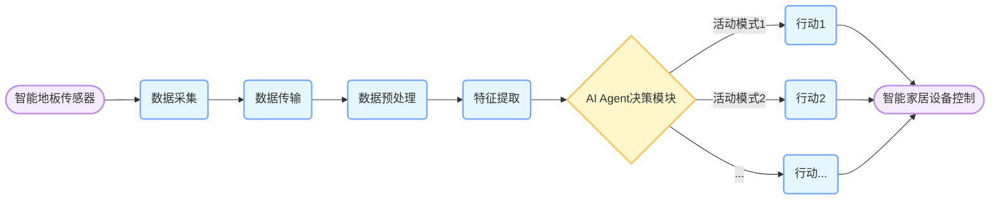

# 智能地板：AI Agent的室内活动模式分析

> 关键词：智能地板、AI Agent、室内活动模式、数据分析、行为识别

> 摘要：本文围绕智能地板与AI Agent的室内活动模式分析展开。首先介绍了智能地板和AI Agent的背景知识，明确研究的目的、范围和预期读者。接着阐述了核心概念及其联系，包括智能地板和AI Agent的原理与架构，并通过Mermaid流程图进行直观展示。深入讲解了核心算法原理，用Python源代码详细阐述操作步骤，同时给出相关数学模型和公式并举例说明。通过项目实战，详细介绍开发环境搭建、源代码实现与解读。探讨了实际应用场景，推荐了学习、开发相关的工具和资源，包括书籍、在线课程、技术博客等。最后总结了未来发展趋势与挑战，还设置了附录解答常见问题，并提供扩展阅读和参考资料，旨在为相关领域的研究和应用提供全面且深入的参考。

## 1. 背景介绍 
### 1.1 目的和范围
随着智能家居和人工智能技术的飞速发展，对室内人员活动模式的深入分析变得越来越重要。智能地板作为一种新兴的传感器技术，能够实时感知室内人员的活动信息。本研究的目的在于利用智能地板所采集的数据，借助AI Agent（人工智能代理）对室内人员的活动模式进行精准分析。研究范围涵盖了智能地板的数据采集、数据预处理、AI Agent的模型构建、活动模式的识别与分类等多个环节，旨在为智能家居的个性化服务、安防监控、健康监测等领域提供有力的技术支持。

### 1.2 预期读者
本文预期读者包括对智能家居、人工智能、传感器技术等领域感兴趣的科研人员、工程师、学生以及相关行业的从业者。对于希望深入了解智能地板和AI Agent结合应用的技术爱好者，本文将提供全面且深入的技术讲解和案例分析；对于从事相关领域研究和开发的专业人员，本文将为其提供有价值的参考和创新思路。

### 1.3 文档结构概述
本文将按照以下结构进行阐述：首先介绍智能地板和AI Agent的背景知识以及相关术语；接着深入讲解核心概念及其联系，通过文本示意图和Mermaid流程图展示其原理和架构；然后详细阐述核心算法原理，并使用Python源代码说明具体操作步骤；随后给出相关的数学模型和公式，并进行详细讲解和举例说明；通过项目实战，介绍开发环境搭建、源代码实现与解读；探讨智能地板和AI Agent在实际中的应用场景；推荐相关的学习、开发工具和资源；最后总结未来发展趋势与挑战，设置附录解答常见问题，并提供扩展阅读和参考资料。

### 1.4 术语表
#### 1.4.1 核心术语定义
- **智能地板**：一种集成了多种传感器（如压力传感器、电容传感器等）的地板系统，能够实时感知人员在地板上的活动信息，如脚步位置、压力分布、行走轨迹等。
- **AI Agent**：人工智能代理，是一种能够感知环境、进行决策并采取行动的智能实体。在本文中，AI Agent主要用于对智能地板采集的数据进行分析和处理，以识别和分类室内人员的活动模式。
- **活动模式**：指室内人员在不同场景下的行为方式，如行走、站立、坐下、躺下等。通过对智能地板数据的分析，可以提取出这些活动模式的特征，从而实现对人员行为的识别和理解。

#### 1.4.2 相关概念解释
- **传感器融合**：将多种不同类型的传感器数据进行综合处理，以获取更全面、准确的信息。在智能地板系统中，可能会同时使用压力传感器、电容传感器等多种传感器，通过传感器融合技术可以提高数据的可靠性和准确性。
- **机器学习**：是一门多领域交叉学科，涉及概率论、统计学、逼近论、凸分析、算法复杂度理论等多门学科。它专门研究计算机怎样模拟或实现人类的学习行为，以获取新的知识或技能，重新组织已有的知识结构使之不断改善自身的性能。在本文中，机器学习算法用于对智能地板采集的数据进行分类和识别，以确定人员的活动模式。
- **深度学习**：是机器学习的一个分支领域，它是一种基于对数据进行表征学习的方法。深度学习通过构建具有很多层的神经网络模型，自动从大量数据中学习到复杂的特征和模式。在室内活动模式分析中，深度学习模型可以更有效地处理复杂的传感器数据，提高活动模式识别的准确率。

#### 1.4.3 缩略词列表
- **AI**：Artificial Intelligence，人工智能
- **ML**：Machine Learning，机器学习
- **DL**：Deep Learning，深度学习
- **IoT**：Internet of Things，物联网

## 2. 核心概念与联系 

### 智能地板原理与架构
智能地板的核心是传感器网络，其架构主要包括传感器层、数据传输层和数据处理层。

传感器层由分布在地板上的多个传感器组成，这些传感器可以实时感知人员在地板上的压力、位移等信息。常见的传感器类型包括压力传感器、电容传感器等。压力传感器可以测量人员施加在地板上的压力大小，电容传感器则可以检测人员与地板之间的电容变化，从而推断出人员的位置和动作。

数据传输层负责将传感器采集到的数据传输到数据处理层。常见的数据传输方式包括有线传输和无线传输。有线传输方式如以太网、USB等，具有传输稳定、速度快的优点；无线传输方式如Wi-Fi、蓝牙等，具有安装方便、灵活性高的优点。

数据处理层对传输过来的数据进行处理和分析。首先对数据进行预处理，包括滤波、降噪、归一化等操作，以提高数据的质量。然后使用机器学习或深度学习算法对处理后的数据进行分类和识别，以确定人员的活动模式。

### AI Agent原理与架构
AI Agent是一种能够感知环境、进行决策并采取行动的智能实体。其架构主要包括感知模块、决策模块和行动模块。

感知模块负责收集环境信息，在本文中主要是智能地板采集的数据。感知模块将收集到的数据进行预处理，提取出有用的特征，然后将这些特征传递给决策模块。

决策模块根据感知模块提供的特征，使用机器学习或深度学习算法进行决策。决策模块的目标是根据当前的环境信息，确定最优的行动方案。在室内活动模式分析中，决策模块的任务是根据智能地板采集的数据，识别和分类人员的活动模式。

行动模块根据决策模块的决策结果，采取相应的行动。在智能家居应用中，行动模块可以控制智能家居设备的开关、调节设备的参数等，以实现个性化的服务。

### 智能地板与AI Agent的联系
智能地板为AI Agent提供了丰富的环境信息，AI Agent则利用这些信息进行决策和行动。智能地板采集的数据是AI Agent进行活动模式分析的基础，AI Agent通过对这些数据的分析和处理，实现对室内人员活动模式的识别和理解。同时，AI Agent的决策结果可以反馈给智能地板系统，实现对智能地板的优化和控制。例如，根据人员的活动模式，调整智能地板的传感器采样频率，以提高数据采集的效率和准确性。

### 文本示意图
```plaintext
智能地板系统
├── 传感器层
│   ├── 压力传感器
│   ├── 电容传感器
│   └── ...
├── 数据传输层
│   ├── 有线传输
│   └── 无线传输
└── 数据处理层
    ├── 数据预处理
    ├── 特征提取
    └── 活动模式识别

AI Agent系统
├── 感知模块
│   └── 接收智能地板数据
├── 决策模块
│   └── 机器学习/深度学习算法
└── 行动模块
    └── 控制智能家居设备
```

### Mermaid流程图


## 3. 核心算法原理 & 具体操作步骤 

### 核心算法原理
在智能地板的室内活动模式分析中，常用的算法包括机器学习算法和深度学习算法。这里以支持向量机（SVM）和卷积神经网络（CNN）为例进行讲解。

#### 支持向量机（SVM）
支持向量机是一种有监督的机器学习算法，其基本思想是在特征空间中找到一个最优的超平面，使得不同类别的样本能够被最大程度地分开。在室内活动模式分析中，SVM可以用于对智能地板采集的数据进行分类，将不同的活动模式分为不同的类别。

#### 卷积神经网络（CNN）
卷积神经网络是一种深度学习算法，特别适合处理具有网格结构的数据，如图像、音频等。在智能地板的应用中，智能地板采集的数据可以看作是一种二维的网格数据，因此CNN可以有效地提取数据中的特征，从而提高活动模式识别的准确率。

### 具体操作步骤

#### 数据采集
使用智能地板的传感器采集室内人员的活动数据，包括压力值、电容值等。将采集到的数据按照时间顺序进行记录，形成数据集。

#### 数据预处理
对采集到的数据进行预处理，包括滤波、降噪、归一化等操作。滤波可以去除数据中的噪声，降噪可以提高数据的质量，归一化可以将数据的取值范围统一到一个固定的区间，便于后续的处理。

#### 特征提取
从预处理后的数据中提取有用的特征，如压力的平均值、标准差、最大值、最小值等。这些特征可以反映人员的活动模式，为后续的分类和识别提供依据。

#### 模型训练
使用提取的特征和对应的活动模式标签，对SVM或CNN模型进行训练。在训练过程中，调整模型的参数，使得模型能够准确地分类不同的活动模式。

#### 模型评估
使用测试数据集对训练好的模型进行评估，计算模型的准确率、召回率、F1值等指标，评估模型的性能。

#### 活动模式识别
将新采集到的数据进行预处理和特征提取，然后输入到训练好的模型中，得到人员的活动模式。

### Python源代码实现

```python
import numpy as np
from sklearn.svm import SVC
from sklearn.model_selection import train_test_split
from sklearn.preprocessing import StandardScaler
from sklearn.metrics import accuracy_score

# 数据采集和预处理（假设已经完成）
# 这里使用随机生成的数据作为示例
X = np.random.rand(100, 10)  # 特征矩阵，100个样本，每个样本10个特征
y = np.random.randint(0, 3, 100)  # 标签，0, 1, 2 表示三种不同的活动模式

# 数据划分
X_train, X_test, y_train, y_test = train_test_split(X, y, test_size=0.2, random_state=42)

# 数据归一化
scaler = StandardScaler()
X_train = scaler.fit_transform(X_train)
X_test = scaler.transform(X_test)

# 模型训练
model = SVC()
model.fit(X_train, y_train)

# 模型评估
y_pred = model.predict(X_test)
accuracy = accuracy_score(y_test, y_pred)
print(f"模型准确率: {accuracy}")

# 活动模式识别（假设新采集到的数据）
new_data = np.random.rand(1, 10)
new_data = scaler.transform(new_data)
predicted_label = model.predict(new_data)
print(f"预测的活动模式标签: {predicted_label}")
```

## 4. 数学模型和公式 & 详细讲解 & 举例说明 

### 支持向量机（SVM）数学模型和公式

#### 线性可分情况
在二维空间中，假设有两类样本点 $x_i \in \mathbb{R}^2$，$i = 1, 2, \cdots, n$，其对应的标签 $y_i \in \{-1, 1\}$。线性可分的支持向量机的目标是找到一个最优的超平面 $w^T x + b = 0$，使得不同类别的样本能够被最大程度地分开。

超平面到样本点的距离可以表示为：
$$d_i = \frac{|w^T x_i + b|}{\|w\|}$$

为了使得不同类别的样本能够被最大程度地分开，我们希望找到一个超平面，使得所有样本点到超平面的最小距离最大。即：
$$\max_{w, b} \frac{1}{\|w\|} \min_{i} |w^T x_i + b|$$

为了方便计算，我们可以令 $\min_{i} |w^T x_i + b| = 1$，则上述问题可以转化为：
$$\min_{w, b} \frac{1}{2} \|w\|^2$$
$$\text{s.t. } y_i (w^T x_i + b) \geq 1, i = 1, 2, \cdots, n$$

这是一个凸二次规划问题，可以使用拉格朗日乘子法求解。引入拉格朗日乘子 $\alpha_i \geq 0$，$i = 1, 2, \cdots, n$，拉格朗日函数为：
$$L(w, b, \alpha) = \frac{1}{2} \|w\|^2 - \sum_{i=1}^{n} \alpha_i (y_i (w^T x_i + b) - 1)$$

对 $w$ 和 $b$ 求偏导数并令其为 0，得到：
$$\frac{\partial L}{\partial w} = w - \sum_{i=1}^{n} \alpha_i y_i x_i = 0 \Rightarrow w = \sum_{i=1}^{n} \alpha_i y_i x_i$$
$$\frac{\partial L}{\partial b} = -\sum_{i=1}^{n} \alpha_i y_i = 0$$

将上述结果代入拉格朗日函数，得到对偶问题：
$$\max_{\alpha} \sum_{i=1}^{n} \alpha_i - \frac{1}{2} \sum_{i=1}^{n} \sum_{j=1}^{n} \alpha_i \alpha_j y_i y_j x_i^T x_j$$
$$\text{s.t. } \sum_{i=1}^{n} \alpha_i y_i = 0$$
$$\alpha_i \geq 0, i = 1, 2, \cdots, n$$

求解对偶问题得到最优的拉格朗日乘子 $\alpha^*$，然后可以计算出最优的 $w^*$ 和 $b^*$：
$$w^* = \sum_{i=1}^{n} \alpha_i^* y_i x_i$$
$$b^* = y_j - w^{*T} x_j$$
其中 $j$ 是满足 $0 < \alpha_j^* < C$ 的任意一个样本点的索引。

#### 线性不可分情况
在实际应用中，样本点往往不是线性可分的。为了处理这种情况，我们可以引入松弛变量 $\xi_i \geq 0$，$i = 1, 2, \cdots, n$，允许一些样本点违反约束条件。此时的优化问题变为：
$$\min_{w, b, \xi} \frac{1}{2} \|w\|^2 + C \sum_{i=1}^{n} \xi_i$$
$$\text{s.t. } y_i (w^T x_i + b) \geq 1 - \xi_i, i = 1, 2, \cdots, n$$
$$\xi_i \geq 0, i = 1, 2, \cdots, n$$

其中 $C > 0$ 是惩罚参数，用于控制对误分类样本的惩罚程度。同样可以使用拉格朗日乘子法求解这个问题，得到对偶问题：
$$\max_{\alpha} \sum_{i=1}^{n} \alpha_i - \frac{1}{2} \sum_{i=1}^{n} \sum_{j=1}^{n} \alpha_i \alpha_j y_i y_j x_i^T x_j$$
$$\text{s.t. } \sum_{i=1}^{n} \alpha_i y_i = 0$$
$$0 \leq \alpha_i \leq C, i = 1, 2, \cdots, n$$

#### 举例说明
假设有两个样本点 $x_1 = [1, 2]^T$，$y_1 = 1$ 和 $x_2 = [3, 4]^T$，$y_2 = -1$。我们可以使用上述公式求解最优的超平面。

首先，计算 $x_1^T x_1 = 1^2 + 2^2 = 5$，$x_1^T x_2 = 1 \times 3 + 2 \times 4 = 11$，$x_2^T x_2 = 3^2 + 4^2 = 25$。

对偶问题的目标函数为：
$$\max_{\alpha_1, \alpha_2} \alpha_1 + \alpha_2 - \frac{1}{2} (\alpha_1^2 \times 5 + 2 \alpha_1 \alpha_2 \times (-11) + \alpha_2^2 \times 25)$$
约束条件为：
$$\alpha_1 - \alpha_2 = 0$$
$$\alpha_1 \geq 0, \alpha_2 \geq 0$$

求解上述对偶问题，得到最优的 $\alpha_1^*$ 和 $\alpha_2^*$，然后计算 $w^*$ 和 $b^*$，从而得到最优的超平面。

### 卷积神经网络（CNN）数学模型和公式

#### 卷积层
卷积层是CNN的核心层，其主要作用是提取输入数据的特征。假设输入数据为 $X \in \mathbb{R}^{H \times W \times C}$，其中 $H$ 是高度，$W$ 是宽度，$C$ 是通道数。卷积核为 $K \in \mathbb{R}^{h \times w \times C \times F}$，其中 $h$ 是卷积核的高度，$w$ 是卷积核的宽度，$F$ 是卷积核的数量。

卷积层的输出 $Y \in \mathbb{R}^{H' \times W' \times F}$ 可以通过以下公式计算：
$$Y_{i, j, k} = \sum_{m=0}^{h-1} \sum_{n=0}^{w-1} \sum_{l=0}^{C-1} K_{m, n, l, k} X_{i+m, j+n, l} + b_k$$
其中 $i = 0, 1, \cdots, H' - 1$，$j = 0, 1, \cdots, W' - 1$，$k = 0, 1, \cdots, F - 1$，$b_k$ 是偏置项。

#### 激活函数
为了引入非线性因素，卷积层的输出通常会经过激活函数处理。常用的激活函数包括ReLU（Rectified Linear Unit）函数：
$$f(x) = \max(0, x)$$

#### 池化层
池化层的主要作用是对卷积层的输出进行下采样，减少数据的维度，同时保留重要的特征。常用的池化方法包括最大池化和平均池化。

最大池化的计算公式为：
$$Y_{i, j, k} = \max_{m=0}^{h_{pool}-1} \max_{n=0}^{w_{pool}-1} X_{i \times s + m, j \times s + n, k}$$
其中 $h_{pool}$ 和 $w_{pool}$ 是池化窗口的高度和宽度，$s$ 是步长。

#### 全连接层
全连接层将池化层的输出展平为一维向量，然后通过一系列的线性变换和激活函数，得到最终的输出。假设输入向量为 $x \in \mathbb{R}^{N}$，全连接层的权重矩阵为 $W \in \mathbb{R}^{M \times N}$，偏置向量为 $b \in \mathbb{R}^{M}$，则输出向量 $y \in \mathbb{R}^{M}$ 可以通过以下公式计算：
$$y = f(Wx + b)$$
其中 $f$ 是激活函数。

#### 举例说明
假设输入数据为一个 $4 \times 4$ 的灰度图像 $X$，卷积核为一个 $3 \times 3$ 的矩阵 $K$。卷积层的输出 $Y$ 可以通过上述卷积公式计算。例如，对于输出的第一个元素 $Y_{0, 0}$：
$$Y_{0, 0} = \sum_{m=0}^{2} \sum_{n=0}^{2} K_{m, n} X_{m, n} + b$$

然后将卷积层的输出经过ReLU激活函数处理，再进行最大池化操作，最后将池化层的输出展平为一维向量，输入到全连接层进行分类。

## 5. 项目实战：代码实际案例和详细解释说明 

### 5.1  开发环境搭建
#### 硬件环境
- **智能地板**：选择一款适合的智能地板产品，确保其能够采集到所需的活动数据，如压力、电容等。
- **计算机**：具备足够的计算资源，如CPU、GPU等，以支持模型的训练和推理。建议使用配备NVIDIA GPU的计算机，以加速深度学习模型的训练。

#### 软件环境
- **操作系统**：推荐使用Linux系统，如Ubuntu 18.04或更高版本。
- **Python环境**：安装Python 3.7或更高版本，并使用虚拟环境管理工具（如venv或conda）创建一个独立的Python环境。
- **深度学习框架**：安装TensorFlow或PyTorch深度学习框架，用于构建和训练卷积神经网络模型。
- **机器学习库**：安装scikit-learn库，用于实现支持向量机等机器学习算法。

#### 安装步骤
1. **创建虚拟环境**
使用conda创建虚拟环境：
```bash
conda create -n smart_floor python=3.8
conda activate smart_floor
```

2. **安装深度学习框架**
安装TensorFlow：
```bash
pip install tensorflow-gpu
```
或者安装PyTorch：
```bash
pip install torch torchvision torchaudio --extra-index-url https://download.pytorch.org/whl/cu113
```

3. **安装机器学习库**
```bash
pip install scikit-learn
```

### 5.2  源代码详细实现和代码解读

#### 数据采集和预处理
```python
import numpy as np
import pandas as pd
from sklearn.preprocessing import StandardScaler

# 假设从智能地板采集到的数据存储在CSV文件中
data = pd.read_csv('smart_floor_data.csv')

# 提取特征和标签
X = data.drop('label', axis=1).values
y = data['label'].values

# 数据归一化
scaler = StandardScaler()
X = scaler.fit_transform(X)
```
**代码解读**：首先使用`pandas`库读取存储在CSV文件中的智能地板数据。然后将数据分为特征矩阵`X`和标签向量`y`。最后使用`StandardScaler`对特征矩阵进行归一化处理，使得每个特征的均值为0，标准差为1。

#### 模型训练（以卷积神经网络为例）
```python
import tensorflow as tf
from tensorflow.keras.models import Sequential
from tensorflow.keras.layers import Conv2D, MaxPooling2D, Flatten, Dense

# 调整数据形状以适应CNN输入
X = X.reshape(-1, 10, 10, 1)  # 假设数据可以转换为10x10的二维矩阵

# 划分训练集和测试集
X_train, X_test, y_train, y_test = train_test_split(X, y, test_size=0.2, random_state=42)

# 构建CNN模型
model = Sequential([
    Conv2D(32, (3, 3), activation='relu', input_shape=(10, 10, 1)),
    MaxPooling2D((2, 2)),
    Flatten(),
    Dense(64, activation='relu'),
    Dense(3, activation='softmax')  # 假设3种活动模式
])

# 编译模型
model.compile(optimizer='adam',
              loss='sparse_categorical_crossentropy',
              metrics=['accuracy'])

# 训练模型
model.fit(X_train, y_train, epochs=10, batch_size=32, validation_data=(X_test, y_test))
```
**代码解读**：首先将特征矩阵`X`的形状调整为适合CNN输入的形状（假设数据可以转换为10x10的二维矩阵）。然后使用`train_test_split`函数将数据划分为训练集和测试集。接着构建一个简单的CNN模型，包括卷积层、池化层、全连接层等。使用`compile`方法编译模型，指定优化器、损失函数和评估指标。最后使用`fit`方法训练模型，指定训练的轮数、批次大小和验证数据。

#### 模型评估和预测
```python
# 模型评估
test_loss, test_acc = model.evaluate(X_test, y_test)
print(f"测试集损失: {test_loss}, 测试集准确率: {test_acc}")

# 预测新数据
new_data = np.random.rand(1, 10, 10, 1)
predictions = model.predict(new_data)
predicted_label = np.argmax(predictions)
print(f"预测的活动模式标签: {predicted_label}")
```
**代码解读**：使用`evaluate`方法对训练好的模型在测试集上进行评估，得到测试集的损失和准确率。然后生成一个新的随机数据，使用`predict`方法进行预测，得到预测结果的概率分布，最后使用`argmax`函数获取概率最大的标签作为预测的活动模式标签。

### 5.3  代码解读与分析
#### 数据预处理的重要性
数据预处理是模型训练的重要步骤，它可以提高数据的质量，减少噪声和异常值的影响，使得模型能够更好地学习数据中的特征。在本项目中，使用`StandardScaler`对数据进行归一化处理，使得每个特征的均值为0，标准差为1，这样可以避免特征之间的尺度差异对模型训练的影响。

#### CNN模型的优势
CNN模型在处理具有网格结构的数据（如图像、音频等）方面具有很大的优势。在智能地板的应用中，智能地板采集的数据可以看作是一种二维的网格数据，因此CNN可以有效地提取数据中的特征，从而提高活动模式识别的准确率。

#### 模型评估和预测的意义
模型评估可以帮助我们了解模型的性能，判断模型是否过拟合或欠拟合。在本项目中，使用测试集对模型进行评估，得到测试集的损失和准确率，这可以帮助我们选择最优的模型参数和结构。预测新数据可以验证模型的泛化能力，判断模型是否能够在实际应用中准确地识别活动模式。

## 6. 实际应用场景 

### 智能家居
在智能家居中，智能地板和AI Agent的结合可以实现个性化的服务。例如，根据人员的活动模式，自动调节室内的温度、湿度、光照等环境参数。当人员进入卧室并躺在床上时，智能地板可以检测到这一活动模式，AI Agent可以根据预设的规则，自动关闭卧室的灯光，调节空调的温度，为人员提供舒适的睡眠环境。

### 安防监控
智能地板可以实时监测室内人员的活动情况，AI Agent可以对这些活动模式进行分析和识别。当检测到异常的活动模式（如非法入侵、突然摔倒等）时，AI Agent可以及时发出警报，并通知相关人员。例如，当有陌生人进入室内时，智能地板可以检测到其行走轨迹和行为模式，AI Agent可以判断其为非法入侵，并立即向业主的手机发送警报信息。

### 健康监测
对于老年人或患有慢性疾病的人群，智能地板可以实时监测他们的活动模式，如行走速度、步数、站立时间等。AI Agent可以对这些数据进行分析，评估他们的健康状况。当检测到活动模式异常（如行走速度突然变慢、长时间卧床不起等）时，AI Agent可以及时通知家属或医护人员，以便及时采取措施。

### 商业场所
在商业场所（如商场、超市等），智能地板可以采集顾客的活动数据，AI Agent可以对这些数据进行分析，了解顾客的行为习惯和购物偏好。商家可以根据这些信息，优化店铺的布局、商品陈列和营销策略，提高顾客的购物体验和销售额。例如，通过分析顾客在不同区域的停留时间和行走轨迹，商家可以了解哪些商品更受顾客欢迎，从而调整商品的摆放位置。

## 7. 工具和资源推荐
### 7.1 学习资源推荐
#### 7.1.1 书籍推荐
- 《机器学习》（周志华著）：全面介绍了机器学习的基本概念、算法和应用，是机器学习领域的经典教材。
- 《深度学习》（Ian Goodfellow、Yoshua Bengio和Aaron Courville著）：深度学习领域的权威著作，深入讲解了深度学习的原理、算法和应用。
- 《Python机器学习实战》（Sebastian Raschka和Vahid Mirjalili著）：通过实际案例介绍了如何使用Python实现机器学习算法，适合初学者入门。

#### 7.1.2 在线课程
- Coursera上的“机器学习”课程（Andrew Ng教授主讲）：经典的机器学习课程，系统地介绍了机器学习的基本概念、算法和应用。
- edX上的“深度学习”课程（由不同的知名教授主讲）：深入讲解了深度学习的原理、算法和应用，适合有一定基础的学习者。
- 哔哩哔哩上的“人工智能从入门到精通”系列课程：由国内知名学者和工程师主讲，内容丰富，适合初学者和进阶学习者。

#### 7.1.3 技术博客和网站
- Medium：一个汇聚了众多技术专家和爱好者的平台，上面有很多关于人工智能、机器学习、深度学习等领域的优质博客文章。
- 知乎：国内知名的知识问答社区，上面有很多关于人工智能、机器学习、深度学习等领域的专业讨论和优质回答。
- 机器之心：专注于人工智能领域的资讯和技术分享平台，提供最新的行业动态、技术文章和研究成果。

### 7.2 开发工具框架推荐
#### 7.2.1 IDE和编辑器
- PyCharm：一款专业的Python集成开发环境，具有代码编辑、调试、版本控制等功能，适合Python开发。
- Jupyter Notebook：一个交互式的开发环境，支持Python、R等多种编程语言，适合数据探索、模型训练和可视化。
- Visual Studio Code：一款轻量级的代码编辑器，支持多种编程语言和插件，具有丰富的扩展功能。

#### 7.2.2 调试和性能分析工具
- TensorBoard：TensorFlow的可视化工具，可以帮助用户直观地查看模型的训练过程、损失曲线、准确率等指标，方便调试和优化模型。
- PyTorch Profiler：PyTorch的性能分析工具，可以帮助用户分析模型的性能瓶颈，优化模型的训练和推理速度。
- cProfile：Python的内置性能分析工具，可以帮助用户分析Python代码的性能瓶颈，找出耗时较长的函数和代码段。

#### 7.2.3 相关框架和库
- TensorFlow：一个开源的深度学习框架，由Google开发和维护，具有丰富的深度学习模型和工具，支持CPU、GPU和TPU等多种计算设备。
- PyTorch：一个开源的深度学习框架，由Facebook开发和维护，具有动态图、易于调试等优点，受到了很多研究人员和开发者的喜爱。
- scikit-learn：一个开源的机器学习库，提供了丰富的机器学习算法和工具，如分类、回归、聚类等，适合初学者和快速开发。

### 7.3 相关论文著作推荐
#### 7.3.1 经典论文
- “Support-Vector Networks”（Cortes和Vapnik著）：支持向量机领域的经典论文，首次提出了支持向量机的概念和算法。
- “ImageNet Classification with Deep Convolutional Neural Networks”（Alex Krizhevsky、Ilya Sutskever和Geoffrey E. Hinton著）：卷积神经网络领域的经典论文，提出了AlexNet模型，开启了深度学习在计算机视觉领域的应用热潮。
- “Long Short-Term Memory”（Sepp Hochreiter和Jürgen Schmidhuber著）：长短时记忆网络（LSTM）领域的经典论文，提出了LSTM模型，解决了传统循环神经网络的梯度消失和梯度爆炸问题。

#### 7.3.2 最新研究成果
- 关注顶级学术会议（如NeurIPS、ICML、CVPR等）和期刊（如Journal of Artificial Intelligence Research、Artificial Intelligence等）上的最新研究成果，了解智能地板和AI Agent在室内活动模式分析领域的最新技术和方法。

#### 7.3.3 应用案例分析
- 查阅相关的行业报告和案例分析，了解智能地板和AI Agent在智能家居、安防监控、健康监测等领域的实际应用案例，学习他人的经验和做法。

## 8. 总结：未来发展趋势与挑战

### 未来发展趋势
#### 多传感器融合
未来的智能地板系统将不仅仅依赖于单一类型的传感器，而是会融合多种不同类型的传感器，如压力传感器、电容传感器、红外传感器、摄像头等，以获取更全面、准确的室内人员活动信息。通过多传感器融合技术，可以提高活动模式识别的准确率和可靠性，为用户提供更个性化的服务。

#### 边缘计算
随着物联网和5G技术的发展，边缘计算将在智能地板系统中得到广泛应用。边缘计算可以将数据处理和分析的任务从云端转移到本地设备上，减少数据传输的延迟和带宽需求，提高系统的响应速度和安全性。同时，边缘计算还可以在本地设备上实现模型的训练和优化，提高系统的智能水平。

#### 与其他智能家居设备的集成
智能地板将与其他智能家居设备（如智能门锁、智能家电、智能摄像头等）实现更深度的集成，形成一个完整的智能家居生态系统。通过与其他设备的协同工作，可以实现更智能化的家居控制和管理。例如，当智能地板检测到人员离开家时，可以自动关闭所有的家电设备，同时触发智能门锁的锁定功能。

#### 应用领域的拓展
智能地板和AI Agent的应用领域将不断拓展，除了智能家居、安防监控、健康监测等领域外，还将在教育、医疗、工业等领域得到广泛应用。例如，在教育领域，智能地板可以用于监测学生的课堂行为，帮助教师更好地了解学生的学习状态；在医疗领域，智能地板可以用于康复训练和病情监测，为患者提供更个性化的医疗服务。

### 挑战
#### 数据隐私和安全
智能地板采集的是用户的个人活动信息，这些信息涉及到用户的隐私和安全。因此，如何保护用户的数据隐私和安全是智能地板系统面临的一个重要挑战。需要采取一系列的技术措施（如数据加密、访问控制、匿名化处理等）和管理措施（如制定严格的数据使用政策和规范等）来确保用户数据的安全。

#### 数据质量和标注
智能地板采集的数据质量直接影响到活动模式识别的准确率。由于环境噪声、传感器故障等因素的影响，采集到的数据可能存在噪声、缺失值等问题。同时，为了训练机器学习和深度学习模型，需要对大量的数据进行标注，这是一个耗时、耗力的工作。因此，如何提高数据质量和标注效率是智能地板系统面临的另一个挑战。

#### 模型的可解释性
深度学习模型在活动模式识别方面取得了很好的效果，但这些模型往往是黑盒模型，其决策过程难以解释。在一些对安全性和可靠性要求较高的应用场景（如医疗、安防等）中，模型的可解释性是非常重要的。因此，如何提高模型的可解释性是智能地板系统面临的一个重要挑战。

#### 系统的成本和可靠性
智能地板系统的成本和可靠性是影响其推广和应用的重要因素。目前，智能地板的制造成本较高，限制了其大规模的应用。同时，智能地板系统需要长时间稳定运行，其可靠性也是一个需要解决的问题。因此，如何降低系统的成本和提高系统的可靠性是智能地板系统面临的一个重要挑战。

## 9. 附录：常见问题与解答

### 1. 智能地板的数据采集频率应该设置为多少？
智能地板的数据采集频率应该根据具体的应用场景和需求来设置。一般来说，对于一些对实时性要求较高的应用场景（如安防监控、健康监测等），数据采集频率可以设置得高一些，如10Hz - 100Hz；对于一些对实时性要求较低的应用场景（如智能家居的环境控制等），数据采集频率可以设置得低一些，如1Hz - 10Hz。

### 2. 如何选择合适的机器学习或深度学习算法？
选择合适的机器学习或深度学习算法需要考虑多个因素，如数据的特点、问题的复杂度、模型的可解释性等。对于一些简单的分类问题，可以选择支持向量机、决策树等传统的机器学习算法；对于一些复杂的图像、音频等数据，可以选择卷积神经网络、循环神经网络等深度学习算法。同时，还可以通过实验比较不同算法的性能，选择最优的算法。

### 3. 如何处理智能地板采集到的缺失值和异常值？
处理智能地板采集到的缺失值和异常值可以采用以下方法：
- **缺失值处理**：可以采用删除含有缺失值的样本、用均值或中位数填充缺失值、使用插值方法填充缺失值等方法。
- **异常值处理**：可以采用基于统计的方法（如Z-score方法、IQR方法等）、基于机器学习的方法（如孤立森林、One-Class SVM等）来检测和处理异常值。

### 4. 如何提高活动模式识别的准确率？
提高活动模式识别的准确率可以从以下几个方面入手：
- **数据质量**：提高智能地板采集的数据质量，减少噪声和异常值的影响。
- **特征工程**：提取更有代表性的特征，如压力的变化率、行走的步长等。
- **模型选择和优化**：选择合适的机器学习或深度学习算法，并对模型进行优化，如调整模型的参数、增加训练数据等。
- **多传感器融合**：融合多种不同类型的传感器数据，以获取更全面、准确的信息。

### 5. 智能地板系统的安装和维护需要注意哪些问题？
智能地板系统的安装和维护需要注意以下问题：
- **安装**：确保智能地板的安装位置平整、牢固，传感器的布局合理，数据传输线路连接正确。
- **维护**：定期检查智能地板的传感器、数据传输线路等设备是否正常工作，及时更换损坏的设备；定期对智能地板进行清洁，避免灰尘、杂物等影响传感器的性能。

## 10. 扩展阅读 & 参考资料

### 扩展阅读
- 《智能家居系统设计与实现》：全面介绍了智能家居系统的设计原理、技术实现和应用案例，对智能地板和AI Agent在智能家居中的应用有更深入的探讨。
- 《人工智能与物联网》：探讨了人工智能和物联网的融合发展趋势，以及智能传感器在物联网中的应用，为智能地板系统的发展提供了新的思路和方向。
- 《数据挖掘：概念与技术》：详细介绍了数据挖掘的基本概念、算法和应用，对于智能地板数据的分析和处理有很大的帮助。

### 参考资料
- [智能地板技术白皮书](https://example.com/smart_floor_whitepaper.pdf)
- [AI Agent研究报告](https://example.com/ai_agent_report.pdf)
- [TensorFlow官方文档](https://www.tensorflow.org/)
- [PyTorch官方文档](https://pytorch.org/)
- [scikit-learn官方文档](https://scikit-learn.org/)