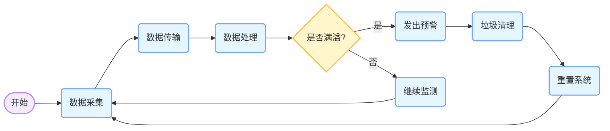

# 智能垃圾桶：AI Agent的满溢预警系统

> 关键词：智能垃圾桶、AI Agent、满溢预警系统、传感器技术、物联网、机器学习、数据分析

> 摘要：本文围绕智能垃圾桶的AI Agent满溢预警系统展开深入探讨。首先介绍了该系统的背景，包括目的、预期读者等内容。接着详细阐述了核心概念，如AI Agent、满溢预警的原理及架构。通过Python代码深入讲解了核心算法原理与具体操作步骤，利用数学模型和公式对系统进行了理论分析。以实际项目为例，展示了代码的实现与解读。探讨了该系统的实际应用场景，推荐了相关的学习资源、开发工具和论文著作。最后总结了未来发展趋势与挑战，并对常见问题进行了解答，为智能垃圾桶满溢预警系统的研究和开发提供了全面而深入的参考。

## 1. 背景介绍 
### 1.1 目的和范围
随着城市化进程的加速，城市垃圾产生量日益增加，传统垃圾桶管理方式面临着效率低、成本高、资源浪费等诸多问题。智能垃圾桶的AI Agent满溢预警系统旨在利用先进的传感器技术、AI Agent以及物联网技术，实时监测垃圾桶的满溢状态，并及时发出预警信息，以便垃圾处理部门能够合理安排垃圾收集路线和时间，提高垃圾处理效率，降低运营成本，减少环境污染。

本系统的范围涵盖了从垃圾桶数据采集、传输、处理到预警信息发布的整个过程，包括硬件设备的选型与安装、软件算法的开发与优化、系统的集成与测试等方面。

### 1.2 预期读者
本文预期读者包括但不限于以下几类人群：
- **技术开发者**：对智能硬件、物联网、AI技术感兴趣，希望了解智能垃圾桶满溢预警系统的实现原理和技术细节，以便进行相关项目的开发和研究。
- **城市管理者**：关注城市环境卫生管理，希望通过引入智能垃圾桶满溢预警系统提高垃圾处理效率，优化资源配置，改善城市环境质量。
- **科研人员**：从事智能传感器、机器学习、数据分析等领域的研究工作，希望从本系统中获取相关的研究思路和数据支持。
- **环保爱好者**：关心环境保护问题，希望了解智能垃圾桶满溢预警系统在减少垃圾外溢、降低环境污染方面的作用和意义。

### 1.3 文档结构概述
本文共分为十个部分，具体结构如下：
1. **背景介绍**：阐述系统的目的、范围、预期读者和文档结构概述，并对相关术语进行解释。
2. **核心概念与联系**：介绍智能垃圾桶、AI Agent、满溢预警系统等核心概念的原理和架构，通过文本示意图和Mermaid流程图展示它们之间的联系。
3. **核心算法原理 & 具体操作步骤**：使用Python源代码详细阐述核心算法的原理和具体操作步骤。
4. **数学模型和公式 & 详细讲解 & 举例说明**：建立数学模型，使用LaTeX格式的公式对系统进行理论分析，并通过具体例子进行说明。
5. **项目实战：代码实际案例和详细解释说明**：介绍开发环境的搭建，展示源代码的详细实现和代码解读，对代码进行分析。
6. **实际应用场景**：探讨智能垃圾桶满溢预警系统在不同场景下的应用。
7. **工具和资源推荐**：推荐相关的学习资源、开发工具框架和论文著作。
8. **总结：未来发展趋势与挑战**：总结智能垃圾桶满溢预警系统的未来发展趋势和面临的挑战。
9. **附录：常见问题与解答**：对常见问题进行解答。
10. **扩展阅读 & 参考资料**：提供扩展阅读的内容和参考资料。

### 1.4 术语表
#### 1.4.1 核心术语定义
- **智能垃圾桶**：一种集成了传感器、通信模块和处理单元的垃圾桶，能够实时感知垃圾桶的状态信息，并将数据传输到云端或管理平台。
- **AI Agent**：人工智能代理，是一种能够感知环境、自主决策并采取行动的智能实体。在本系统中，AI Agent负责对垃圾桶的满溢状态进行分析和判断，并发出预警信息。
- **满溢预警系统**：通过对垃圾桶内垃圾容量的实时监测，当垃圾达到一定阈值时，系统自动发出预警信号，提醒相关人员及时进行垃圾清理的系统。
- **传感器技术**：利用各种传感器（如超声波传感器、红外传感器等）获取物理量信息的技术。在本系统中，传感器用于测量垃圾桶内垃圾的高度或体积。
- **物联网（IoT）**：通过各种信息传感设备，将物品与互联网连接起来，实现物品的智能化识别、定位、跟踪、监控和管理的一种网络。在本系统中，物联网技术用于实现垃圾桶与管理平台之间的数据传输。
- **机器学习**：一门多领域交叉学科，涉及概率论、统计学、逼近论、凸分析、算法复杂度理论等多门学科。它专门研究计算机怎样模拟或实现人类的学习行为，以获取新的知识或技能，重新组织已有的知识结构使之不断改善自身的性能。在本系统中，机器学习算法用于对垃圾桶满溢状态进行预测和分析。

#### 1.4.2 相关概念解释
- **数据采集**：指从各种数据源中收集数据的过程。在本系统中，数据采集主要是通过传感器获取垃圾桶内垃圾的状态信息。
- **数据传输**：将采集到的数据从数据源传输到数据处理中心的过程。在本系统中，数据传输可以通过有线或无线通信方式实现，如Wi-Fi、蓝牙、LoRa等。
- **数据处理**：对采集到的数据进行清洗、转换、分析和挖掘的过程。在本系统中，数据处理主要是对垃圾桶的满溢状态进行判断和预测。
- **预警信息发布**：当系统检测到垃圾桶满溢时，将预警信息发送给相关人员的过程。预警信息可以通过短信、邮件、APP推送等方式发布。

#### 1.4.3 缩略词列表
- **AI**：Artificial Intelligence，人工智能
- **IoT**：Internet of Things，物联网
- **MEMS**：Micro-Electro-Mechanical Systems，微机电系统
- **RF**：Radio Frequency，射频
- **API**：Application Programming Interface，应用程序编程接口

## 2. 核心概念与联系 

### 核心概念原理
#### 智能垃圾桶
智能垃圾桶的核心是集成了多种传感器，如超声波传感器、红外传感器等，用于实时监测垃圾桶内垃圾的高度或体积。传感器将采集到的数据通过通信模块（如Wi-Fi、蓝牙、LoRa等）传输到云端或管理平台。智能垃圾桶还可以配备太阳能电池板，为其提供持续的电力供应，以保证系统的正常运行。

#### AI Agent
AI Agent是一种能够感知环境、自主决策并采取行动的智能实体。在智能垃圾桶满溢预警系统中，AI Agent接收来自智能垃圾桶的传感器数据，对数据进行分析和处理，判断垃圾桶的满溢状态。如果垃圾桶达到满溢阈值，AI Agent将自动发出预警信息，通知相关人员及时进行垃圾清理。AI Agent可以基于机器学习算法，如决策树、神经网络等，对垃圾桶的满溢状态进行预测和分析，提高预警的准确性和及时性。

#### 满溢预警系统
满溢预警系统是整个智能垃圾桶系统的核心功能之一。它通过对垃圾桶内垃圾容量的实时监测，当垃圾达到一定阈值时，系统自动发出预警信号。预警信号可以通过多种方式发布，如短信、邮件、APP推送等，以便相关人员及时获取信息并采取相应的措施。满溢预警系统还可以结合地图信息，显示垃圾桶的位置和满溢状态，方便垃圾处理部门合理安排垃圾收集路线和时间。

### 架构的文本示意图
智能垃圾桶满溢预警系统主要由以下几个部分组成：
1. **数据采集层**：包括智能垃圾桶上的各种传感器，如超声波传感器、红外传感器等，用于采集垃圾桶内垃圾的状态信息。
2. **数据传输层**：通过有线或无线通信方式（如Wi-Fi、蓝牙、LoRa等）将采集到的数据传输到云端或管理平台。
3. **数据处理层**：在云端或管理平台上对采集到的数据进行清洗、转换、分析和挖掘，利用AI Agent对垃圾桶的满溢状态进行判断和预测。
4. **预警信息发布层**：当系统检测到垃圾桶满溢时，将预警信息通过短信、邮件、APP推送等方式发送给相关人员。
5. **用户交互层**：提供用户界面，方便用户查看垃圾桶的状态信息、预警信息和管理系统设置。

### Mermaid流程图


## 3. 核心算法原理 & 具体操作步骤 

### 核心算法原理
在智能垃圾桶满溢预警系统中，核心算法主要用于判断垃圾桶的满溢状态。一种常用的方法是基于传感器采集的垃圾高度数据，通过设定阈值来判断垃圾桶是否满溢。以下是一个简单的基于阈值判断的算法原理：

1. **数据采集**：通过超声波传感器或红外传感器实时采集垃圾桶内垃圾的高度数据。
2. **数据预处理**：对采集到的数据进行清洗和滤波，去除噪声和异常值。
3. **阈值判断**：将处理后的数据与预设的满溢阈值进行比较，如果垃圾高度超过阈值，则判断垃圾桶满溢。
4. **预警处理**：如果判断垃圾桶满溢，则发出预警信息，通知相关人员及时进行垃圾清理。

### 具体操作步骤及Python源代码实现
以下是一个使用Python实现的简单示例代码，模拟智能垃圾桶满溢预警系统的核心算法：

```python
import random
import time

# 预设满溢阈值（单位：厘米）
FULL_THRESHOLD = 80

def collect_data():
    """模拟传感器数据采集"""
    # 随机生成垃圾高度数据（0 - 100 厘米）
    return random.randint(0, 100)

def preprocess_data(data):
    """数据预处理，这里简单返回原始数据，实际应用中可进行滤波等处理"""
    return data

def check_fullness(data):
    """判断垃圾桶是否满溢"""
    if data >= FULL_THRESHOLD:
        return True
    else:
        return False

def send_alert():
    """发送预警信息，这里简单打印信息，实际应用中可通过短信、邮件等方式发送"""
    print("警告：垃圾桶已满，请及时清理！")

def main():
    while True:
        # 数据采集
        raw_data = collect_data()
        # 数据预处理
        processed_data = preprocess_data(raw_data)
        # 判断垃圾桶是否满溢
        is_full = check_fullness(processed_data)
        if is_full:
            # 发出预警信息
            send_alert()
        else:
            print(f"当前垃圾高度：{processed_data} 厘米，垃圾桶未满。")
        # 每隔 5 秒采集一次数据
        time.sleep(5)

if __name__ == "__main__":
    main()
```

### 代码解释
1. **collect_data() 函数**：模拟传感器数据采集，随机生成 0 - 100 厘米之间的垃圾高度数据。
2. **preprocess_data() 函数**：数据预处理函数，这里简单返回原始数据，实际应用中可以进行滤波、去噪等处理。
3. **check_fullness() 函数**：判断垃圾桶是否满溢的函数，将处理后的数据与预设的满溢阈值进行比较，如果超过阈值则返回 True，否则返回 False。
4. **send_alert() 函数**：发送预警信息的函数，这里简单打印警告信息，实际应用中可以通过短信、邮件、APP 推送等方式发送预警信息。
5. **main() 函数**：主函数，循环执行数据采集、预处理、满溢判断和预警处理的过程，每隔 5 秒采集一次数据。

## 4. 数学模型和公式 & 详细讲解 & 举例说明 

### 数学模型
在智能垃圾桶满溢预警系统中，可以建立一个简单的数学模型来描述垃圾桶的满溢状态。假设垃圾桶的高度为 $H$，垃圾的当前高度为 $h$，满溢阈值为 $T$，则垃圾桶的满溢状态可以用以下公式表示：

$$
\text{满溢状态} = 
\begin{cases}
\text{满溢}, & h \geq T \\
\text{未满}, & h < T
\end{cases}
$$

### 详细讲解
这个数学模型非常简单直观，它基于垃圾的当前高度与满溢阈值的比较来判断垃圾桶的满溢状态。当垃圾的当前高度 $h$ 大于或等于满溢阈值 $T$ 时，认为垃圾桶已满，需要及时清理；当垃圾的当前高度 $h$ 小于满溢阈值 $T$ 时，认为垃圾桶未满，可以继续使用。

### 举例说明
假设一个垃圾桶的高度 $H = 100$ 厘米，满溢阈值 $T = 80$ 厘米。通过传感器采集到垃圾的当前高度 $h = 85$ 厘米，将 $h$ 和 $T$ 代入上述公式中：

由于 $h = 85$ 厘米 $\geq T = 80$ 厘米，根据公式可知，此时垃圾桶的满溢状态为“满溢”，系统应该发出预警信息，通知相关人员及时进行垃圾清理。

如果采集到垃圾的当前高度 $h = 60$ 厘米，由于 $h = 60$ 厘米 $< T = 80$ 厘米，根据公式可知，此时垃圾桶的满溢状态为“未满”，系统不需要发出预警信息。

## 5. 项目实战：代码实际案例和详细解释说明 

### 5.1  开发环境搭建
#### 硬件环境
- **智能垃圾桶**：选择一款集成了超声波传感器或红外传感器的智能垃圾桶，确保传感器能够正常工作并采集到准确的垃圾高度数据。
- **开发板**：选择一款支持通信功能的开发板，如 Raspberry Pi、Arduino 等，用于连接传感器和实现数据传输。
- **通信模块**：根据实际需求选择合适的通信模块，如 Wi-Fi 模块、蓝牙模块、LoRa 模块等，实现数据的无线传输。

#### 软件环境
- **操作系统**：根据开发板的类型选择合适的操作系统，如 Raspbian（适用于 Raspberry Pi）、Arduino IDE（适用于 Arduino）等。
- **开发语言**：选择 Python 作为开发语言，因为 Python 具有丰富的库和工具，便于快速开发和实现系统功能。
- **开发工具**：选择 PyCharm、Visual Studio Code 等集成开发环境（IDE），提高开发效率。

### 5.2  源代码详细实现和代码解读
以下是一个基于 Raspberry Pi 和超声波传感器的智能垃圾桶满溢预警系统的实际代码示例：

```python
import RPi.GPIO as GPIO
import time
import requests

# 定义超声波传感器引脚
TRIG = 18
ECHO = 24

# 预设满溢阈值（单位：厘米）
FULL_THRESHOLD = 80

# 服务器 API 地址，用于发送预警信息
API_URL = "http://your-server-url/api/alert"

def setup():
    """初始化 GPIO 引脚"""
    GPIO.setmode(GPIO.BCM)
    GPIO.setup(TRIG, GPIO.OUT)
    GPIO.setup(ECHO, GPIO.IN)

def get_distance():
    """获取超声波传感器测量的距离（单位：厘米）"""
    GPIO.output(TRIG, True)
    time.sleep(0.00001)
    GPIO.output(TRIG, False)

    StartTime = time.time()
    StopTime = time.time()

    while GPIO.input(ECHO) == 0:
        StartTime = time.time()

    while GPIO.input(ECHO) == 1:
        StopTime = time.time()

    TimeElapsed = StopTime - StartTime
    distance = (TimeElapsed * 34300) / 2

    return distance

def check_fullness(distance):
    """判断垃圾桶是否满溢"""
    # 假设垃圾桶高度为 100 厘米
    trash_height = 100 - distance
    if trash_height >= FULL_THRESHOLD:
        return True
    else:
        return False

def send_alert():
    """发送预警信息到服务器"""
    try:
        response = requests.post(API_URL, json={"message": "垃圾桶已满，请及时清理！"})
        if response.status_code == 200:
            print("预警信息发送成功！")
        else:
            print(f"预警信息发送失败，状态码：{response.status_code}")
    except Exception as e:
        print(f"预警信息发送失败，错误信息：{e}")

def main():
    try:
        setup()
        while True:
            # 获取超声波传感器测量的距离
            distance = get_distance()
            # 判断垃圾桶是否满溢
            is_full = check_fullness(distance)
            if is_full:
                # 发出预警信息
                send_alert()
            else:
                print(f"当前垃圾高度：{100 - distance} 厘米，垃圾桶未满。")
            time.sleep(5)
    except KeyboardInterrupt:
        print("程序终止，清理 GPIO 引脚...")
        GPIO.cleanup()

if __name__ == "__main__":
    main()
```

### 代码解读
1. **setup() 函数**：初始化 GPIO 引脚，将超声波传感器的触发引脚（TRIG）设置为输出模式，回声引脚（ECHO）设置为输入模式。
2. **get_distance() 函数**：通过超声波传感器测量距离，利用超声波在空气中的传播时间计算出距离。
3. **check_fullness() 函数**：根据测量的距离计算出垃圾的高度，将其与预设的满溢阈值进行比较，判断垃圾桶是否满溢。
4. **send_alert() 函数**：将预警信息发送到服务器，使用 requests 库发送 POST 请求，将预警信息以 JSON 格式发送到服务器的 API 地址。
5. **main() 函数**：主函数，循环执行数据采集、满溢判断和预警处理的过程，每隔 5 秒采集一次数据。当用户按下 Ctrl+C 时，程序终止并清理 GPIO 引脚。

### 5.3  代码解读与分析
#### 优点
- **简单易懂**：代码结构清晰，逻辑简单，易于理解和实现。
- **可扩展性**：可以根据实际需求对代码进行扩展，如添加更多的传感器、优化数据处理算法、改进预警信息发送方式等。
- **兼容性**：代码基于 Python 语言开发，具有良好的兼容性，可以在不同的开发板和操作系统上运行。

#### 缺点
- **精度问题**：超声波传感器的测量精度可能受到环境因素的影响，如温度、湿度、风速等，导致测量结果存在一定的误差。
- **稳定性问题**：网络通信可能存在不稳定的情况，导致预警信息发送失败。
- **缺乏数据存储和分析功能**：代码中没有对采集到的数据进行存储和分析，无法对垃圾桶的使用情况进行统计和分析。

## 6. 实际应用场景 
### 城市街道
在城市街道上，智能垃圾桶满溢预警系统可以实时监测垃圾桶的满溢状态，当垃圾桶达到满溢阈值时，系统自动发出预警信息，通知垃圾处理部门及时进行清理。这样可以避免垃圾外溢，保持街道的整洁和卫生，提高城市的环境卫生水平。同时，通过对垃圾桶使用数据的分析，可以合理安排垃圾收集路线和时间，提高垃圾处理效率，降低运营成本。

### 景区
在景区内，游客流量较大，垃圾产生量也相对较多。智能垃圾桶满溢预警系统可以及时发现垃圾桶的满溢情况，确保景区内的环境整洁。此外，系统还可以结合景区地图，显示垃圾桶的位置和满溢状态，方便游客找到空的垃圾桶，提高游客的满意度。

### 学校
在学校里，智能垃圾桶满溢预警系统可以帮助学校管理部门及时了解垃圾桶的使用情况，合理安排垃圾清理工作。同时，通过对学生垃圾投放行为的分析，可以开展环保教育活动，培养学生的环保意识。

### 商业中心
在商业中心，智能垃圾桶满溢预警系统可以提高垃圾处理效率，保持商业中心的整洁和美观。此外，系统还可以结合商业中心的人流量数据，预测垃圾产生量，提前做好垃圾清理准备工作。

## 7. 工具和资源推荐
### 7.1 学习资源推荐
#### 7.1.1 书籍推荐
- 《Python 数据分析实战》：介绍了 Python 在数据分析领域的应用，包括数据采集、清洗、分析和可视化等方面的知识，对于学习智能垃圾桶满溢预警系统的数据处理部分有很大的帮助。
- 《物联网技术与应用》：全面介绍了物联网的基本概念、技术体系和应用案例，对于理解智能垃圾桶满溢预警系统的物联网架构和通信技术有重要的参考价值。
- 《机器学习实战》：通过实际案例介绍了机器学习的基本算法和应用，对于学习智能垃圾桶满溢预警系统的 AI Agent 部分有很大的启发。

#### 7.1.2 在线课程
- Coursera 上的“Python for Data Science and Machine Learning Bootcamp”：该课程介绍了 Python 在数据科学和机器学习领域的应用，包括数据处理、机器学习算法实现等方面的内容。
- edX 上的“Internet of Things (IoT) Fundamentals”：该课程介绍了物联网的基本概念、技术和应用，对于学习智能垃圾桶满溢预警系统的物联网部分有很大的帮助。
- Udemy 上的“Artificial Intelligence A-Z™: Learn How To Build An AI”：该课程介绍了人工智能的基本概念、算法和应用，对于学习智能垃圾桶满溢预警系统的 AI Agent 部分有很大的启发。

#### 7.1.3 技术博客和网站
- 博客园：提供了大量的技术文章和博客，涵盖了 Python、物联网、机器学习等多个领域的内容，可以从中获取相关的技术知识和经验分享。
- 开源中国：提供了丰富的开源项目和技术文章，对于学习智能垃圾桶满溢预警系统的开源代码和相关技术有很大的帮助。
- 知乎：有很多关于智能硬件、物联网、AI 等领域的讨论和分享，可以从中获取最新的技术动态和行业趋势。

### 7.2 开发工具框架推荐
#### 7.2.1 IDE和编辑器
- PyCharm：一款专业的 Python 集成开发环境，具有代码自动补全、调试、版本控制等功能，提高开发效率。
- Visual Studio Code：一款轻量级的代码编辑器，支持多种编程语言和插件扩展，适合快速开发和调试。
- Arduino IDE：一款专门用于 Arduino 开发的集成开发环境，提供了简单易用的开发界面和丰富的库函数，方便开发基于 Arduino 的智能垃圾桶项目。

#### 7.2.2 调试和性能分析工具
- Wireshark：一款网络协议分析工具，可以用于分析智能垃圾桶与管理平台之间的数据传输情况，排查网络通信故障。
- Py-Spy：一款 Python 性能分析工具，可以用于分析 Python 代码的性能瓶颈，优化代码性能。
- GPIO Zero：一款用于 Raspberry Pi GPIO 控制的 Python 库，提供了简单易用的 API 接口，方便开发基于 Raspberry Pi 的智能垃圾桶项目。

#### 7.2.3 相关框架和库
- Flask：一款轻量级的 Python Web 框架，可以用于开发智能垃圾桶满溢预警系统的服务器端应用，实现数据接收、处理和预警信息发布等功能。
- Django：一款功能强大的 Python Web 框架，提供了丰富的组件和工具，适合开发大型的智能垃圾桶满溢预警系统的服务器端应用。
- TensorFlow：一款开源的机器学习框架，提供了丰富的机器学习算法和工具，适合开发智能垃圾桶满溢预警系统的 AI Agent 部分，实现垃圾满溢状态的预测和分析。

### 7.3 相关论文著作推荐
#### 7.3.1 经典论文
- “Internet of Things for Smart Cities”：该论文介绍了物联网在智慧城市建设中的应用，包括智能交通、智能能源、智能环境等方面的内容，对于理解智能垃圾桶满溢预警系统在智慧城市中的作用有重要的参考价值。
- “Machine Learning for Sensor Data Analysis in Internet of Things”：该论文介绍了机器学习在物联网传感器数据分析中的应用，包括数据预处理、特征提取、分类和预测等方面的内容，对于学习智能垃圾桶满溢预警系统的 AI Agent 部分有很大的启发。
- “Wireless Sensor Networks for Environmental Monitoring”：该论文介绍了无线传感器网络在环境监测中的应用，包括传感器节点设计、数据传输、网络拓扑结构等方面的内容，对于学习智能垃圾桶满溢预警系统的传感器技术和物联网通信技术有重要的参考价值。

#### 7.3.2 最新研究成果
- 关注 IEEE、ACM 等学术会议和期刊上关于智能硬件、物联网、AI 等领域的最新研究成果，了解智能垃圾桶满溢预警系统的最新技术发展趋势。
- 关注国内外知名高校和科研机构的研究动态，如清华大学、麻省理工学院、斯坦福大学等，获取相关的研究论文和报告。

#### 7.3.3 应用案例分析
- 分析国内外智能垃圾桶满溢预警系统的实际应用案例，了解系统的架构设计、技术选型、实施过程和应用效果，从中获取经验和启示。
- 关注相关企业的技术博客和产品介绍，如华为、阿里巴巴、腾讯等，了解他们在智能垃圾桶满溢预警系统方面的实践经验和创新成果。

## 8. 总结：未来发展趋势与挑战
### 未来发展趋势
#### 智能化程度不断提高
随着人工智能技术的不断发展，智能垃圾桶满溢预警系统的智能化程度将不断提高。未来的系统将能够通过机器学习算法对大量的历史数据进行分析和挖掘，实现对垃圾产生量的精准预测，提前安排垃圾收集工作，进一步提高垃圾处理效率。

#### 多功能集成
未来的智能垃圾桶将不仅仅具备满溢预警功能，还将集成更多的功能，如垃圾分类识别、垃圾重量监测、环境监测等。通过这些功能的集成，可以实现对垃圾的全方位管理，提高资源回收利用率，减少环境污染。

#### 与智慧城市的深度融合
智能垃圾桶满溢预警系统将与智慧城市的其他系统进行深度融合，如智能交通系统、智能能源系统等。通过数据共享和协同工作，可以实现城市资源的优化配置，提高城市的运行效率和管理水平。

#### 环保意识的提升
随着人们环保意识的不断提高，智能垃圾桶满溢预警系统将得到更广泛的应用和推广。同时，系统也将成为环保宣传和教育的重要工具，通过对垃圾产生量和处理情况的统计和分析，引导人们养成良好的环保习惯。

### 挑战
#### 技术难题
智能垃圾桶满溢预警系统涉及到传感器技术、物联网技术、人工智能技术等多个领域，技术复杂度较高。在实际应用中，可能会遇到传感器精度不够、网络通信不稳定、数据处理效率低下等技术难题，需要不断进行技术创新和优化。

#### 成本问题
智能垃圾桶的研发、生产和部署成本较高，包括传感器、通信模块、开发板等硬件设备的成本，以及软件开发、系统集成和维护等方面的成本。如何降低成本，提高系统的性价比，是推广智能垃圾桶满溢预警系统面临的一个重要挑战。

#### 数据安全和隐私问题
智能垃圾桶满溢预警系统需要收集和处理大量的用户数据，如垃圾桶的位置、满溢状态、垃圾投放时间等。这些数据涉及到用户的隐私和安全问题，如果数据泄露或被滥用，可能会给用户带来不必要的麻烦。因此，如何保障数据的安全和隐私，是智能垃圾桶满溢预警系统需要解决的一个重要问题。

#### 法律法规和标准问题
目前，智能垃圾桶满溢预警系统还缺乏统一的法律法规和标准。在系统的研发、生产、部署和应用过程中，可能会遇到法律法规和标准不明确的问题，影响系统的推广和应用。因此，需要加快制定相关的法律法规和标准，规范智能垃圾桶满溢预警系统的发展。

## 9. 附录：常见问题与解答
### 1. 智能垃圾桶满溢预警系统的精度如何保证？
智能垃圾桶满溢预警系统的精度主要取决于传感器的精度和数据处理算法的准确性。在选择传感器时，应选择精度高、稳定性好的传感器，并进行定期校准和维护。在数据处理方面，可以采用滤波、去噪等技术对采集到的数据进行预处理，提高数据的准确性。同时，可以利用机器学习算法对大量的历史数据进行分析和挖掘，优化满溢判断模型，提高预警的准确性。

### 2. 智能垃圾桶满溢预警系统的通信方式有哪些？各有什么优缺点？
智能垃圾桶满溢预警系统的通信方式主要有 Wi-Fi、蓝牙、LoRa、GPRS 等。
- **Wi-Fi**：优点是传输速度快、带宽高，适合大数据量的传输；缺点是覆盖范围有限，需要有 Wi-Fi 热点支持，功耗较高。
- **蓝牙**：优点是功耗低、成本低，适合近距离通信；缺点是传输距离短、带宽有限，不适合大数据量的传输。
- **LoRa**：优点是传输距离远、功耗低、成本低，适合远距离、低速率的通信；缺点是传输速度较慢，数据传输量有限。
- **GPRS**：优点是覆盖范围广、通信稳定，适合远程通信；缺点是功耗较高、通信费用较高。

### 3. 智能垃圾桶满溢预警系统如何进行数据存储和管理？
智能垃圾桶满溢预警系统可以将采集到的数据存储在本地数据库或云端服务器中。本地数据库适合数据量较小、对数据实时性要求较高的应用场景；云端服务器适合数据量较大、需要进行数据分析和挖掘的应用场景。在数据管理方面，可以采用数据备份、数据加密、数据访问控制等技术，保障数据的安全和可靠性。

### 4. 智能垃圾桶满溢预警系统的预警信息如何发送？
智能垃圾桶满溢预警系统的预警信息可以通过短信、邮件、APP 推送等方式发送。在实际应用中，可以根据用户的需求和偏好选择合适的预警信息发送方式。同时，为了确保预警信息能够及时、准确地发送到相关人员手中，可以设置多个预警渠道，提高预警的可靠性。

### 5. 智能垃圾桶满溢预警系统的维护和管理需要注意哪些问题？
智能垃圾桶满溢预警系统的维护和管理需要注意以下几个问题：
- **定期检查硬件设备**：定期检查传感器、通信模块、开发板等硬件设备的工作状态，确保设备正常运行。
- **更新软件系统**：及时更新软件系统，修复软件漏洞，提高系统的稳定性和安全性。
- **清理垃圾桶**：及时清理垃圾桶内的垃圾，避免垃圾堆积影响传感器的正常工作。
- **数据备份和恢复**：定期对采集到的数据进行备份，防止数据丢失。在需要时，能够及时恢复数据。
- **安全管理**：加强系统的安全管理，设置访问权限，防止非法入侵和数据泄露。

## 10. 扩展阅读 & 参考资料
### 扩展阅读
- 《智能城市：从理论到实践》：深入探讨了智能城市的概念、技术和应用，对于理解智能垃圾桶满溢预警系统在智能城市建设中的作用和意义有很大的帮助。
- 《大数据时代：生活、工作与思维的大变革》：介绍了大数据的基本概念、技术和应用，对于学习智能垃圾桶满溢预警系统的数据处理和分析有重要的参考价值。
- 《人工智能：现代方法》：全面介绍了人工智能的基本概念、算法和应用，对于深入学习智能垃圾桶满溢预警系统的 AI Agent 部分有很大的启发。

### 参考资料
- 相关的技术文档和产品说明书，如传感器、通信模块、开发板等硬件设备的技术文档和产品说明书。
- 相关的学术论文和研究报告，如 IEEE、ACM 等学术会议和期刊上关于智能硬件、物联网、AI 等领域的学术论文和研究报告。
- 相关的开源项目和代码库，如 GitHub 上的智能垃圾桶满溢预警系统的开源项目和代码库。