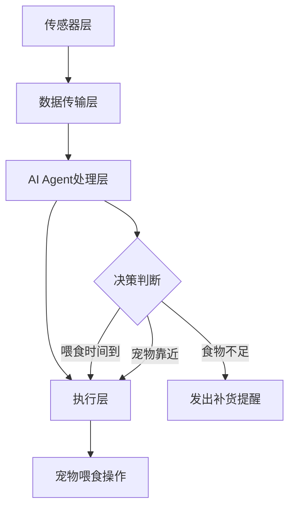

# 智能宠物喂食器：AI Agent的宠物饮食管理

> 关键词：智能宠物喂食器、AI Agent、宠物饮食管理、人工智能、物联网、自动化、传感器技术

> 摘要：本文聚焦于智能宠物喂食器中AI Agent在宠物饮食管理方面的应用。详细介绍了智能宠物喂食器的背景知识，包括其目的、预期读者等内容。深入剖析了AI Agent与智能宠物喂食器相关的核心概念和联系，阐述了其核心算法原理及具体操作步骤，运用数学模型和公式对其工作原理进行详细讲解。通过项目实战给出代码实际案例并详细解释。探讨了智能宠物喂食器的实际应用场景，推荐了相关的工具和资源。最后总结了其未来发展趋势与挑战，还给出了常见问题与解答以及扩展阅读和参考资料，旨在全面深入地探讨智能宠物喂食器中AI Agent在宠物饮食管理的技术原理和应用价值。

## 1. 背景介绍 
### 1.1 目的和范围
随着人们生活水平的提高，宠物在家庭中的地位日益重要。然而，现代生活节奏快，人们常常因为工作、旅行等原因无法按时给宠物喂食。智能宠物喂食器的出现就是为了解决这一问题，它借助AI Agent技术实现宠物饮食的智能化管理。本文章的范围涵盖智能宠物喂食器的技术原理、开发实现、应用场景等多个方面，旨在全面介绍AI Agent在宠物饮食管理中的应用。

### 1.2 预期读者
本文预期读者包括对人工智能、物联网、宠物科技感兴趣的技术爱好者，从事相关领域研究的科研人员，以及想要开发智能宠物产品的开发者和创业者。

### 1.3 文档结构概述
本文首先介绍智能宠物喂食器的背景知识，包括目的、读者和文档结构等。接着阐述核心概念与联系，展示其原理和架构。然后讲解核心算法原理及具体操作步骤，结合Python代码详细说明。再通过数学模型和公式深入剖析其工作原理。之后进行项目实战，给出代码实际案例并详细解读。随后探讨实际应用场景，推荐相关工具和资源。最后总结未来发展趋势与挑战，提供常见问题与解答以及扩展阅读和参考资料。

### 1.4 术语表
#### 1.4.1 核心术语定义
- **智能宠物喂食器**：一种具备智能化功能的宠物喂食设备，能够根据预设规则或实时情况自动给宠物喂食。
- **AI Agent**：人工智能代理，是一种能够感知环境、做出决策并采取行动的智能实体。在智能宠物喂食器中，AI Agent可以根据宠物的状态、环境信息等做出喂食决策。
- **物联网（IoT）**：通过各种信息传感设备，如传感器、射频识别技术、全球定位系统等，按约定的协议，将任何物品与互联网相连接，进行信息交换和通信，以实现智能化识别、定位、跟踪、监控和管理的一种网络概念。

#### 1.4.2 相关概念解释
- **传感器技术**：智能宠物喂食器中会使用多种传感器，如重量传感器、红外传感器等。重量传感器用于检测食物剩余量，红外传感器可用于检测宠物是否靠近喂食器。
- **机器学习**：AI Agent可以利用机器学习算法对宠物的饮食习惯、健康状况等数据进行分析和学习，从而更好地进行饮食管理。

#### 1.4.3 缩略词列表
- **IoT**：Internet of Things（物联网）
- **AI**：Artificial Intelligence（人工智能）

## 2. 核心概念与联系 
### 核心概念原理
智能宠物喂食器中的AI Agent是整个系统的核心智能组件。其工作原理基于感知、决策和行动三个主要环节。

感知环节：智能宠物喂食器通过各种传感器收集信息，如食物剩余量、宠物的活动情况、当前时间等。这些传感器将物理信号转换为电信号或数字信号，传递给AI Agent。

决策环节：AI Agent接收到传感器传来的信息后，结合预设的规则和机器学习模型进行分析和决策。例如，如果食物剩余量低于设定的阈值，或者到了宠物的喂食时间，AI Agent会做出相应的喂食决策。

行动环节：根据决策结果，AI Agent控制智能宠物喂食器的执行机构，如电机、闸门等，实现食物的投放。

### 架构的文本示意图
智能宠物喂食器的架构主要包括传感器层、数据传输层、AI Agent处理层和执行层。

传感器层：包含各种传感器，如重量传感器、红外传感器、温度传感器等，负责收集环境和宠物的相关信息。

数据传输层：将传感器收集到的数据传输到AI Agent处理层。可以采用有线或无线通信方式，如Wi-Fi、蓝牙、ZigBee等。

AI Agent处理层：对传感器数据进行处理和分析，根据预设规则和机器学习模型做出决策。

执行层：根据AI Agent的决策结果，控制喂食器的执行机构，如电机、闸门等，实现食物的投放和其他操作。

### Mermaid 流程图


## 3. 核心算法原理 & 具体操作步骤 
### 核心算法原理
智能宠物喂食器中AI Agent的核心算法主要包括规则引擎算法和机器学习算法。

规则引擎算法：根据预设的规则进行决策。例如，设定每天早上8点和晚上6点为宠物的喂食时间，当时间到达设定时间时，AI Agent控制喂食器进行喂食。规则引擎算法可以通过条件判断语句实现。

机器学习算法：可以对宠物的饮食习惯、健康状况等数据进行分析和学习。例如，通过分析宠物的进食量和进食时间，预测宠物的饥饿程度，从而更加精准地进行喂食管理。常见的机器学习算法包括决策树、神经网络等。

### 具体操作步骤
#### 数据收集
使用传感器收集食物剩余量、宠物活动情况、时间等数据。以下是一个简单的Python代码示例，模拟重量传感器收集食物剩余量：
```python
import random

def get_food_weight():
    # 模拟重量传感器读取食物重量
    return random.uniform(0, 1000)  # 单位：克
```

#### 数据传输
将收集到的数据传输到AI Agent处理层。如果使用Wi-Fi通信，可以使用Python的socket库实现数据传输。以下是一个简单的示例：
```python
import socket

def send_data(data):
    # 创建socket对象
    s = socket.socket(socket.AF_INET, socket.SOCK_STREAM)
    # 获取本地主机名
    host = socket.gethostname()
    port = 12345
    # 连接服务，指定主机和端口
    s.connect((host, port))
    # 发送数据
    s.send(str(data).encode())
    # 接收服务端返回的数据
    response = s.recv(1024)
    print('Received from server: {}'.format(response.decode()))
    # 关闭连接
    s.close()
```

#### 数据处理和决策
AI Agent接收到数据后，进行处理和决策。以下是一个简单的规则引擎算法示例：
```python
def make_decision(food_weight):
    if food_weight < 100:  # 食物剩余量低于100克
        return '发出补货提醒'
    else:
        return '正常状态'
```

#### 执行操作
根据决策结果，控制喂食器的执行机构。以下是一个简单的模拟执行操作的代码示例：
```python
def execute_action(action):
    if action == '发出补货提醒':
        print('发出补货提醒，例如闪烁指示灯或发送手机通知')
    else:
        print('保持正常状态')
```

#### 完整示例代码
```python
import random
import socket

def get_food_weight():
    # 模拟重量传感器读取食物重量
    return random.uniform(0, 1000)  # 单位：克

def send_data(data):
    # 创建socket对象
    s = socket.socket(socket.AF_INET, socket.SOCK_STREAM)
    # 获取本地主机名
    host = socket.gethostname()
    port = 12345
    # 连接服务，指定主机和端口
    s.connect((host, port))
    # 发送数据
    s.send(str(data).encode())
    # 接收服务端返回的数据
    response = s.recv(1024)
    print('Received from server: {}'.format(response.decode()))
    # 关闭连接
    s.close()

def make_decision(food_weight):
    if food_weight < 100:  # 食物剩余量低于100克
        return '发出补货提醒'
    else:
        return '正常状态'

def execute_action(action):
    if action == '发出补货提醒':
        print('发出补货提醒，例如闪烁指示灯或发送手机通知')
    else:
        print('保持正常状态')

if __name__ == '__main__':
    food_weight = get_food_weight()
    send_data(food_weight)
    decision = make_decision(food_weight)
    execute_action(decision)
```

## 4. 数学模型和公式 & 详细讲解 & 举例说明 
### 数学模型
智能宠物喂食器中的AI Agent可以使用多种数学模型进行决策和分析。以下介绍两种常见的数学模型：线性回归模型和决策树模型。

#### 线性回归模型
线性回归模型用于预测宠物的进食量。假设宠物的进食量 $y$ 与时间 $x_1$、环境温度 $x_2$ 等因素有关，可以建立如下线性回归模型：

$$y = \beta_0 + \beta_1x_1 + \beta_2x_2 + \epsilon$$

其中，$\beta_0$ 是截距，$\beta_1$ 和 $\beta_2$ 是回归系数，$\epsilon$ 是误差项。

#### 决策树模型
决策树模型用于根据宠物的各种特征进行分类和决策。例如，根据宠物的体重、年龄、活动量等特征，决策树可以判断宠物是否需要增加或减少食物摄入量。

### 详细讲解
#### 线性回归模型
线性回归模型的目标是找到最优的回归系数 $\beta_0$、$\beta_1$ 和 $\beta_2$，使得预测值与实际值之间的误差最小。通常使用最小二乘法来求解回归系数。

最小二乘法的目标是最小化误差平方和：

$$S(\beta_0, \beta_1, \beta_2) = \sum_{i=1}^{n}(y_i - (\beta_0 + \beta_1x_{i1} + \beta_2x_{i2}))^2$$

其中，$n$ 是样本数量，$y_i$ 是第 $i$ 个样本的实际进食量，$x_{i1}$ 和 $x_{i2}$ 是第 $i$ 个样本的时间和环境温度。

通过对 $S(\beta_0, \beta_1, \beta_2)$ 求偏导数并令其等于0，可以得到回归系数的最优解。

#### 决策树模型
决策树模型是一种基于树结构进行决策的模型。每个内部节点表示一个特征上的测试，每个分支表示一个测试输出，每个叶节点表示一个类别或值。

决策树的构建过程包括特征选择、树的生成和剪枝等步骤。常见的特征选择方法有信息增益、信息增益比、基尼指数等。

### 举例说明
#### 线性回归模型
假设我们收集了以下宠物进食量、时间和环境温度的数据：

| 时间（小时） | 环境温度（℃） | 进食量（克） |
|---|---|---|
| 8 | 20 | 50 |
| 12 | 25 | 60 |
| 16 | 22 | 55 |
| 20 | 23 | 58 |

使用Python的 `sklearn` 库可以实现线性回归模型：
```python
from sklearn.linear_model import LinearRegression
import numpy as np

# 特征矩阵
X = np.array([[8, 20], [12, 25], [16, 22], [20, 23]])
# 目标向量
y = np.array([50, 60, 55, 58])

# 创建线性回归模型
model = LinearRegression()
# 拟合模型
model.fit(X, y)

# 预测
new_X = np.array([[10, 21]])
prediction = model.predict(new_X)
print('预测的进食量：', prediction)
```

#### 决策树模型
假设我们根据宠物的体重、年龄和活动量来判断宠物是否需要增加食物摄入量。数据如下：

| 体重（千克） | 年龄（岁） | 活动量（高/中/低） | 需要增加食物摄入量（是/否） |
|---|---|---|---|
| 5 | 2 | 高 | 是 |
| 3 | 3 | 中 | 否 |
| 6 | 1 | 高 | 是 |
| 4 | 4 | 低 | 否 |

使用Python的 `sklearn` 库可以实现决策树模型：
```python
from sklearn.tree import DecisionTreeClassifier
from sklearn.preprocessing import LabelEncoder
import pandas as pd

# 数据
data = {
    '体重': [5, 3, 6, 4],
    '年龄': [2, 3, 1, 4],
    '活动量': ['高', '中', '高', '低'],
    '需要增加食物摄入量': ['是', '否', '是', '否']
}
df = pd.DataFrame(data)

# 对分类特征进行编码
le_activity = LabelEncoder()
le_need_increase = LabelEncoder()
df['活动量'] = le_activity.fit_transform(df['活动量'])
df['需要增加食物摄入量'] = le_need_increase.fit_transform(df['需要增加食物摄入量'])

# 特征矩阵
X = df[['体重', '年龄', '活动量']]
# 目标向量
y = df['需要增加食物摄入量']

# 创建决策树模型
model = DecisionTreeClassifier()
# 拟合模型
model.fit(X, y)

# 预测
new_X = pd.DataFrame({'体重': [5], '年龄': [2], '活动量': le_activity.transform(['高'])})
prediction = model.predict(new_X)
print('预测结果：', le_need_increase.inverse_transform(prediction))
```

## 5. 项目实战：代码实际案例和详细解释说明 
### 5.1  开发环境搭建
#### 硬件环境
- **智能宠物喂食器开发板**：可以选择Arduino、Raspberry Pi等开发板。这里以Raspberry Pi为例。
- **传感器**：重量传感器、红外传感器、温度传感器等。
- **执行机构**：电机、闸门等。

#### 软件环境
- **操作系统**：Raspbian（基于Debian的Raspberry Pi操作系统）
- **开发语言**：Python
- **开发工具**：Thonny（Raspberry Pi自带的Python集成开发环境）

### 5.2  源代码详细实现和代码解读
#### 初始化传感器和执行机构
```python
import RPi.GPIO as GPIO
import time

# 设置GPIO模式
GPIO.setmode(GPIO.BCM)

# 重量传感器引脚
WEIGHT_SENSOR_PIN = 17
# 红外传感器引脚
IR_SENSOR_PIN = 18
# 电机控制引脚
MOTOR_PIN = 22

# 初始化引脚
GPIO.setup(WEIGHT_SENSOR_PIN, GPIO.IN)
GPIO.setup(IR_SENSOR_PIN, GPIO.IN)
GPIO.setup(MOTOR_PIN, GPIO.OUT)
```
**代码解读**：这段代码使用 `RPi.GPIO` 库来控制Raspberry Pi的GPIO引脚。首先设置GPIO模式为BCM，然后定义了重量传感器、红外传感器和电机控制的引脚，并将它们初始化为输入或输出模式。

#### 读取传感器数据
```python
def read_weight_sensor():
    # 模拟读取重量传感器数据
    return GPIO.input(WEIGHT_SENSOR_PIN)

def read_ir_sensor():
    # 模拟读取红外传感器数据
    return GPIO.input(IR_SENSOR_PIN)
```
**代码解读**：这两个函数分别用于读取重量传感器和红外传感器的数据。通过 `GPIO.input` 函数读取引脚的电平状态。

#### 控制电机
```python
def control_motor(state):
    if state:
        GPIO.output(MOTOR_PIN, GPIO.HIGH)
    else:
        GPIO.output(MOTOR_PIN, GPIO.LOW)
```
**代码解读**：这个函数用于控制电机的开关状态。当 `state` 为 `True` 时，将电机控制引脚设置为高电平，电机启动；当 `state` 为 `False` 时，将电机控制引脚设置为低电平，电机停止。

#### 主循环
```python
while True:
    weight = read_weight_sensor()
    ir = read_ir_sensor()

    if ir == 1:  # 宠物靠近
        if weight > 0:  # 有食物
            control_motor(True)  # 启动电机喂食
            time.sleep(5)  # 喂食5秒
            control_motor(False)  # 停止电机
    time.sleep(1)  # 每秒检测一次
```
**代码解读**：这是主循环代码，不断读取重量传感器和红外传感器的数据。当红外传感器检测到宠物靠近且有食物时，启动电机喂食5秒，然后停止电机。每秒检测一次传感器数据。

### 5.3  代码解读与分析
#### 优点
- **简单易懂**：代码结构清晰，使用了基本的Python语法和GPIO控制函数，易于理解和实现。
- **实时性**：通过每秒检测一次传感器数据，能够及时响应宠物的靠近和食物的状态。

#### 缺点
- **缺乏智能决策**：代码只是简单地根据传感器数据进行喂食操作，没有考虑宠物的饮食习惯、健康状况等因素，缺乏智能决策能力。
- **稳定性问题**：由于使用了模拟的传感器读取函数，实际应用中可能会存在传感器数据不准确的问题，影响系统的稳定性。

## 6. 实际应用场景 
### 家庭场景
在家庭场景中，智能宠物喂食器可以帮助主人在无法按时给宠物喂食的情况下，确保宠物能够按时进食。例如，主人因工作加班、外出旅行等原因不在家时，智能宠物喂食器可以按照预设的时间和量给宠物喂食。同时，AI Agent可以根据宠物的饮食习惯和健康状况进行个性化的饮食管理，如根据宠物的年龄、体重、活动量等因素调整食物的摄入量。

### 宠物寄养场景
在宠物寄养场所，智能宠物喂食器可以提高寄养服务的效率和质量。多个宠物可以使用同一个智能宠物喂食器，AI Agent可以根据每个宠物的信息进行分别喂食，避免了人工喂食可能出现的错误和遗漏。同时，智能宠物喂食器可以记录宠物的进食情况，方便寄养人员了解宠物的健康状况。

### 宠物医疗场景
在宠物医疗场景中，智能宠物喂食器可以辅助宠物的治疗和康复。例如，对于患有糖尿病、肥胖症等疾病的宠物，智能宠物喂食器可以根据医生的建议，精确控制宠物的食物摄入量和进食时间，帮助宠物更好地管理疾病。

## 7. 工具和资源推荐
### 7.1 学习资源推荐
#### 7.1.1 书籍推荐
- 《Python机器学习实战》：这本书详细介绍了Python在机器学习领域的应用，包括线性回归、决策树等算法的实现和应用，对于理解智能宠物喂食器中AI Agent的机器学习算法有很大帮助。
- 《物联网技术与应用》：全面介绍了物联网的相关技术和应用场景，对于了解智能宠物喂食器中的物联网技术有重要参考价值。

#### 7.1.2 在线课程
- Coursera上的“Machine Learning”课程：由斯坦福大学教授Andrew Ng主讲，是机器学习领域的经典课程，深入讲解了机器学习的基本原理和算法。
- edX上的“IoT Fundamentals: Connecting Things”课程：介绍了物联网的基础知识和关键技术，对于学习智能宠物喂食器的物联网部分很有帮助。

#### 7.1.3 技术博客和网站
- Medium：上面有很多关于人工智能、物联网和宠物科技的技术博客文章，可以了解到最新的技术动态和应用案例。
- Hackster.io：一个开源硬件和物联网项目的分享平台，上面有很多智能宠物产品的开发案例和经验分享。

### 7.2 开发工具框架推荐
#### 7.2.1 IDE和编辑器
- Thonny：适用于Raspberry Pi的Python集成开发环境，简单易用，适合初学者。
- PyCharm：功能强大的Python集成开发环境，提供了代码编辑、调试、版本控制等丰富的功能，适合专业开发者。

#### 7.2.2 调试和性能分析工具
- GPIO Zero：用于Raspberry Pi GPIO调试的Python库，可以方便地测试GPIO引脚的输入输出功能。
- cProfile：Python的性能分析工具，可以分析代码的执行时间和函数调用情况，帮助优化代码性能。

#### 7.2.3 相关框架和库
- TensorFlow：开源的机器学习框架，提供了丰富的机器学习算法和工具，可用于智能宠物喂食器中AI Agent的机器学习模型开发。
- MQTT：轻量级的物联网消息传输协议，可用于智能宠物喂食器与云平台之间的数据传输。

### 7.3 相关论文著作推荐
#### 7.3.1 经典论文
- “A Survey on Artificial Intelligence Techniques for Smart Home Systems”：该论文综述了人工智能技术在智能家居系统中的应用，对于理解智能宠物喂食器中AI Agent的应用有参考价值。
- “Internet of Things: A Survey on Enabling Technologies, Protocols, and Applications”：全面介绍了物联网的相关技术、协议和应用，对于智能宠物喂食器的物联网部分有深入的讲解。

#### 7.3.2 最新研究成果
- 关注ACM、IEEE等学术会议和期刊上关于人工智能、物联网和宠物科技的最新研究成果，了解该领域的前沿技术和发展趋势。

#### 7.3.3 应用案例分析
- 分析一些实际的智能宠物产品的应用案例，了解它们的技术实现和市场应用情况，从中获取灵感和经验。

## 8. 总结：未来发展趋势与挑战
### 未来发展趋势
#### 更加智能化
未来的智能宠物喂食器将更加智能化，AI Agent将能够更准确地分析宠物的健康状况、饮食习惯等信息，实现个性化的饮食管理。例如，通过分析宠物的粪便、尿液等样本，检测宠物的健康指标，根据检测结果调整食物的配方和摄入量。

#### 与其他智能设备集成
智能宠物喂食器将与其他智能设备集成，如智能摄像头、智能健康监测设备等，实现更全面的宠物管理。例如，智能摄像头可以实时监控宠物的活动情况，智能健康监测设备可以监测宠物的心率、体温等生理指标，这些信息可以与智能宠物喂食器的AI Agent共享，实现更精准的饮食管理。

#### 云服务和大数据应用
智能宠物喂食器将越来越多地使用云服务和大数据技术。通过将宠物的饮食数据、健康数据等上传到云端，AI Agent可以利用大数据分析技术进行更深入的分析和挖掘，为宠物提供更好的饮食管理方案。同时，云服务还可以实现远程控制和管理，主人可以通过手机APP随时随地了解宠物的饮食情况和健康状况。

### 挑战
#### 数据安全和隐私问题
智能宠物喂食器涉及到宠物的健康数据、饮食习惯等敏感信息，数据安全和隐私问题是一个重要的挑战。需要采取有效的数据加密、访问控制等措施，确保宠物数据的安全和隐私。

#### 技术可靠性
智能宠物喂食器的技术可靠性直接关系到宠物的饮食和健康。需要提高传感器的精度和可靠性，确保AI Agent的决策准确无误，以及执行机构的稳定运行。

#### 成本问题
目前智能宠物喂食器的成本相对较高，限制了其市场推广和应用。需要通过技术创新和规模化生产降低成本，使智能宠物喂食器更加普及。

## 9. 附录：常见问题与解答
### 1. 智能宠物喂食器的食物容易变质怎么办？
可以在智能宠物喂食器中添加温度传感器和湿度传感器，实时监测食物的存储环境。当温度或湿度超过设定的阈值时，AI Agent可以发出提醒，主人可以及时采取措施，如更换食物、调整存储环境等。同时，可以选择具有保鲜功能的智能宠物喂食器，如采用密封设计、冷藏功能等。

### 2. 智能宠物喂食器如果出现故障，宠物会饿肚子吗？
为了避免这种情况，可以在智能宠物喂食器中设置备用喂食模式。当智能宠物喂食器出现故障时，可以手动操作或通过备用电源启动备用喂食模式，确保宠物能够按时进食。同时，智能宠物喂食器可以通过网络连接向主人发送故障提醒，主人可以及时进行维修。

### 3. 智能宠物喂食器的AI Agent是如何学习宠物的饮食习惯的？
AI Agent可以通过收集宠物的进食时间、进食量、食物偏好等数据，使用机器学习算法进行分析和学习。例如，使用决策树算法对宠物的进食数据进行分类和预测，使用线性回归算法预测宠物的进食量。随着数据的不断积累，AI Agent可以越来越准确地了解宠物的饮食习惯。

### 4. 智能宠物喂食器可以支持多种宠物吗？
可以，智能宠物喂食器可以通过设置不同的喂食计划和食物量来支持多种宠物。例如，对于大型犬和小型犬，可以根据它们的体重和食量设置不同的喂食量；对于猫和狗，可以根据它们的饮食习惯设置不同的喂食时间和食物种类。

## 10. 扩展阅读 & 参考资料
### 扩展阅读
- 《智能宠物科技的未来发展方向》
- 《人工智能在宠物健康管理中的应用研究》

### 参考资料
- [Raspberry Pi官方文档](https://www.raspberrypi.org/documentation/)
- [TensorFlow官方文档](https://www.tensorflow.org/)
- [MQTT官方文档](https://mqtt.org/)