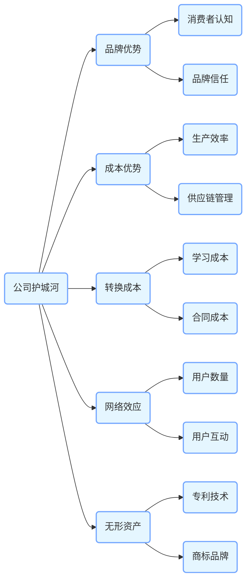

# 智能系统辅助公司护城河动态评估

> 关键词：智能系统、公司护城河、动态评估、财务分析、竞争优势

> 摘要：本文聚焦于智能系统辅助公司护城河动态评估这一关键议题。在当今竞争激烈且快速变化的商业环境中，准确评估公司的护城河对于投资者、管理者等具有重要意义。智能系统凭借其高效的数据处理、分析和预测能力，为公司护城河的动态评估提供了新的思路和方法。文章详细阐述了公司护城河的核心概念与联系，介绍了用于评估的核心算法原理及具体操作步骤，通过数学模型和公式深入剖析评估过程，结合项目实战给出实际案例及详细解释，探讨了智能系统在公司护城河评估中的实际应用场景，推荐了相关的工具和资源，并对未来发展趋势与挑战进行了总结，同时在附录中解答常见问题，为读者全面深入了解该领域提供了有价值的参考。

## 1. 背景介绍 
### 1.1 目的和范围
公司护城河的概念由巴菲特提出，它代表了公司抵御竞争对手侵蚀其市场份额和盈利能力的能力。在不断变化的市场环境中，准确评估公司的护城河是投资者做出明智投资决策、管理者制定战略规划的关键。本文章的目的在于探讨如何利用智能系统对公司护城河进行动态评估。范围涵盖了公司护城河的各个维度，包括品牌优势、成本优势、转换成本、网络效应等，以及智能系统在数据收集、处理、分析和预测等方面的应用。

### 1.2 预期读者
本文预期读者包括金融投资者、企业管理者、财务分析师、人工智能领域的研究人员以及对公司战略和投资分析感兴趣的相关人士。投资者可以借助智能系统的评估结果更好地选择投资标的；企业管理者可以了解自身公司护城河的状况，以便制定相应的战略来巩固和提升竞争优势；财务分析师可以将智能系统的评估方法纳入其分析框架；人工智能领域的研究人员可以从实际应用场景中获取灵感，进一步优化智能系统的算法和模型；而对相关领域感兴趣的人士则可以通过本文了解公司护城河评估的前沿方法和技术。

### 1.3 文档结构概述
本文将首先介绍公司护城河的核心概念与联系，包括其原理和架构，并通过Mermaid流程图进行直观展示。接着阐述用于评估的核心算法原理，并用Python源代码详细说明具体操作步骤。然后给出数学模型和公式，通过举例进行详细讲解。之后通过项目实战，介绍开发环境搭建、源代码实现和代码解读。再探讨智能系统在公司护城河评估中的实际应用场景。随后推荐相关的工具和资源，包括学习资源、开发工具框架和相关论文著作。最后总结未来发展趋势与挑战，在附录中解答常见问题，并提供扩展阅读和参考资料。

### 1.4 术语表
#### 1.4.1 核心术语定义
- **公司护城河**：指公司拥有的可持续竞争优势，使其能够在长期内保持高于行业平均水平的盈利能力，抵御竞争对手的挑战。
- **智能系统**：利用人工智能技术，具备数据收集、处理、分析、学习和预测等功能的计算机系统。
- **动态评估**：对公司护城河的评估不是静态的，而是随着时间和市场环境的变化进行持续的监测和分析。
- **财务指标**：反映公司财务状况和经营成果的一系列数据，如营业收入、净利润、资产负债率等。
- **非财务指标**：除财务指标外，影响公司护城河的其他因素，如品牌形象、客户满意度、技术创新能力等。

#### 1.4.2 相关概念解释
- **竞争优势**：公司相对于竞争对手在产品、服务、成本、技术等方面具有的优势，是公司护城河的基础。
- **可持续性**：公司的竞争优势能够在较长时间内保持，不受短期市场波动和竞争对手的轻易侵蚀。
- **数据挖掘**：从大量的数据中发现有价值的信息和模式的过程，是智能系统进行分析的重要手段。
- **机器学习**：让计算机通过数据学习模式和规律，从而进行预测和决策的技术，在智能系统中广泛应用。

#### 1.4.3 缩略词列表
- **AI**：Artificial Intelligence，人工智能
- **ML**：Machine Learning，机器学习
- **NLP**：Natural Language Processing，自然语言处理
- **PCA**：Principal Component Analysis，主成分分析
- **ROE**：Return on Equity，净资产收益率

## 2. 核心概念与联系 
公司护城河是一个综合性的概念，它涉及到公司的多个方面，包括财务、市场、技术、管理等。核心概念之间的联系可以用以下文本示意图和Mermaid流程图来表示。

### 文本示意图
公司护城河的核心概念主要包括品牌优势、成本优势、转换成本、网络效应和无形资产等。品牌优势通过消费者对品牌的认知和信任来体现，能够吸引消费者并提高产品的附加值；成本优势使公司能够以更低的成本生产和销售产品，从而在价格上具有竞争力；转换成本是指消费者从一个产品或服务转换到另一个产品或服务时所面临的成本，较高的转换成本可以锁定客户；网络效应是指随着用户数量的增加，产品或服务的价值也随之增加，形成良性循环；无形资产包括专利、技术、商标等，能够为公司带来独特的竞争优势。这些核心概念相互影响、相互作用，共同构成了公司的护城河。

### Mermaid流程图


从流程图可以看出，公司护城河由多个核心概念构成，每个核心概念又包含多个子因素。这些因素相互关联，共同影响着公司的竞争优势和护城河的强度。

## 3. 核心算法原理 & 具体操作步骤 
在智能系统辅助公司护城河动态评估中，我们可以使用多种算法，如主成分分析（PCA）、逻辑回归、决策树等。这里以主成分分析和逻辑回归为例进行详细讲解。

### 主成分分析（PCA）原理
主成分分析是一种无监督学习算法，用于数据降维和特征提取。其基本思想是通过线性变换将原始数据转换为一组各维度线性无关的主成分，使得数据在这些主成分上的方差最大。具体步骤如下：
1. 数据标准化：将原始数据进行标准化处理，使得每个特征的均值为0，方差为1。
2. 计算协方差矩阵：计算标准化后数据的协方差矩阵。
3. 计算特征值和特征向量：对协方差矩阵进行特征值分解，得到特征值和特征向量。
4. 选择主成分：根据特征值的大小，选择前k个最大的特征值对应的特征向量作为主成分。
5. 数据转换：将原始数据投影到选择的主成分上，得到降维后的数据。

### Python代码实现
```python
import numpy as np
from sklearn.preprocessing import StandardScaler
from sklearn.decomposition import PCA

# 示例数据
X = np.array([[1, 2, 3], [4, 5, 6], [7, 8, 9], [10, 11, 12]])

# 数据标准化
scaler = StandardScaler()
X_scaled = scaler.fit_transform(X)

# 主成分分析
pca = PCA(n_components=2)
X_pca = pca.fit_transform(X_scaled)

print("原始数据形状:", X.shape)
print("降维后数据形状:", X_pca.shape)
```

### 逻辑回归原理
逻辑回归是一种有监督学习算法，用于分类问题。在公司护城河评估中，我们可以将公司分为具有强护城河和弱护城河两类，通过逻辑回归模型进行分类预测。逻辑回归的基本原理是通过逻辑函数将线性回归的输出映射到[0, 1]之间，作为分类的概率。具体步骤如下：
1. 数据准备：将原始数据分为训练集和测试集。
2. 模型训练：使用训练集数据训练逻辑回归模型。
3. 模型预测：使用训练好的模型对测试集数据进行预测。
4. 模型评估：使用评估指标（如准确率、召回率、F1值等）评估模型的性能。

### Python代码实现
```python
from sklearn.linear_model import LogisticRegression
from sklearn.model_selection import train_test_split
from sklearn.metrics import accuracy_score

# 示例数据
X = np.array([[1, 2], [3, 4], [5, 6], [7, 8]])
y = np.array([0, 0, 1, 1])

# 数据划分
X_train, X_test, y_train, y_test = train_test_split(X, y, test_size=0.2, random_state=42)

# 逻辑回归模型训练
model = LogisticRegression()
model.fit(X_train, y_train)

# 模型预测
y_pred = model.predict(X_test)

# 模型评估
accuracy = accuracy_score(y_test, y_pred)
print("模型准确率:", accuracy)
```

### 具体操作步骤
1. **数据收集**：收集与公司护城河相关的数据，包括财务指标、市场数据、行业数据等。
2. **数据预处理**：对收集到的数据进行清洗、标准化、缺失值处理等操作。
3. **特征提取**：使用主成分分析等算法提取数据的主要特征。
4. **模型训练**：使用逻辑回归等算法训练分类模型。
5. **模型评估**：使用测试集数据评估模型的性能，调整模型参数。
6. **动态评估**：定期收集新的数据，对模型进行更新和评估，实现公司护城河的动态评估。

## 4. 数学模型和公式 & 详细讲解 & 举例说明 
### 主成分分析数学模型和公式
#### 协方差矩阵
设原始数据矩阵为 $X = [x_1, x_2, \cdots, x_n]^T$，其中 $x_i$ 是第 $i$ 个样本的特征向量。标准化后的数据矩阵为 $X_{std}$，则协方差矩阵 $S$ 的计算公式为：
$$S = \frac{1}{n - 1} X_{std}^T X_{std}$$

#### 特征值分解
对协方差矩阵 $S$ 进行特征值分解，得到特征值 $\lambda_1, \lambda_2, \cdots, \lambda_p$ 和对应的特征向量 $u_1, u_2, \cdots, u_p$，满足：
$$S u_i = \lambda_i u_i$$

#### 主成分选择
选择前 $k$ 个最大的特征值对应的特征向量 $u_1, u_2, \cdots, u_k$ 作为主成分，将原始数据 $X_{std}$ 投影到这些主成分上，得到降维后的数据 $Z$：
$$Z = X_{std} U_k$$
其中 $U_k = [u_1, u_2, \cdots, u_k]$。

### 举例说明
假设我们有一个包含3个特征的数据集 $X$：
$$X = \begin{bmatrix}
1 & 2 & 3 \\
4 & 5 & 6 \\
7 & 8 & 9 \\
10 & 11 & 12
\end{bmatrix}$$

首先进行数据标准化：
```python
import numpy as np
from sklearn.preprocessing import StandardScaler

X = np.array([[1, 2, 3], [4, 5, 6], [7, 8, 9], [10, 11, 12]])
scaler = StandardScaler()
X_scaled = scaler.fit_transform(X)
print("标准化后的数据:", X_scaled)
```

然后计算协方差矩阵：
```python
S = np.cov(X_scaled.T)
print("协方差矩阵:", S)
```

接着进行特征值分解：
```python
eigenvalues, eigenvectors = np.linalg.eig(S)
print("特征值:", eigenvalues)
print("特征向量:", eigenvectors)
```

选择前2个最大的特征值对应的特征向量作为主成分，进行数据降维：
```python
k = 2
U_k = eigenvectors[:, :k]
Z = np.dot(X_scaled, U_k)
print("降维后的数据:", Z)
```

### 逻辑回归数学模型和公式
#### 逻辑函数
逻辑回归使用逻辑函数（也称为Sigmoid函数）将线性回归的输出映射到[0, 1]之间，逻辑函数的定义为：
$$\sigma(z) = \frac{1}{1 + e^{-z}}$$
其中 $z = \theta_0 + \theta_1 x_1 + \theta_2 x_2 + \cdots + \theta_n x_n$ 是线性回归的输出，$\theta_i$ 是模型的参数。

#### 损失函数
逻辑回归使用对数损失函数（也称为交叉熵损失函数）作为损失函数，其定义为：
$$J(\theta) = -\frac{1}{m} \sum_{i = 1}^{m} [y^{(i)} \log(\sigma(z^{(i)})) + (1 - y^{(i)}) \log(1 - \sigma(z^{(i)}))]$$
其中 $m$ 是样本数量，$y^{(i)}$ 是第 $i$ 个样本的真实标签，$\sigma(z^{(i)})$ 是第 $i$ 个样本的预测概率。

#### 模型训练
通过最小化损失函数 $J(\theta)$ 来更新模型的参数 $\theta$，可以使用梯度下降等优化算法。

### 举例说明
假设我们有一个二分类问题，数据集 $X$ 和标签 $y$ 如下：
```python
import numpy as np
from sklearn.linear_model import LogisticRegression
from sklearn.metrics import accuracy_score

X = np.array([[1, 2], [3, 4], [5, 6], [7, 8]])
y = np.array([0, 0, 1, 1])

model = LogisticRegression()
model.fit(X, y)

y_pred = model.predict(X)
accuracy = accuracy_score(y, y_pred)
print("模型准确率:", accuracy)
```

在这个例子中，我们使用逻辑回归模型对数据集进行分类，通过计算准确率来评估模型的性能。

## 5. 项目实战：代码实际案例和详细解释说明 
### 5.1  开发环境搭建
#### 安装Python
首先需要安装Python，建议使用Python 3.7及以上版本。可以从Python官方网站（https://www.python.org/downloads/） 下载并安装。

#### 安装必要的库
在命令行中使用以下命令安装必要的库：
```sh
pip install numpy pandas scikit-learn matplotlib seaborn
```
- **numpy**：用于数值计算。
- **pandas**：用于数据处理和分析。
- **scikit-learn**：提供了丰富的机器学习算法和工具。
- **matplotlib** 和 **seaborn**：用于数据可视化。

### 5.2  源代码详细实现和代码解读
#### 数据收集和预处理
```python
import pandas as pd
from sklearn.preprocessing import StandardScaler

# 读取数据
data = pd.read_csv('company_data.csv')

# 分离特征和标签
X = data.drop('label', axis=1)
y = data['label']

# 数据标准化
scaler = StandardScaler()
X_scaled = scaler.fit_transform(X)
```
在这段代码中，我们首先使用 `pandas` 库读取包含公司数据的CSV文件。然后将特征和标签分离，使用 `StandardScaler` 对特征数据进行标准化处理。

#### 特征提取
```python
from sklearn.decomposition import PCA

# 主成分分析
pca = PCA(n_components=0.95)
X_pca = pca.fit_transform(X_scaled)
```
这里使用 `PCA` 进行主成分分析，`n_components=0.95` 表示保留95%的方差。

#### 模型训练和评估
```python
from sklearn.model_selection import train_test_split
from sklearn.linear_model import LogisticRegression
from sklearn.metrics import accuracy_score, classification_report

# 数据划分
X_train, X_test, y_train, y_test = train_test_split(X_pca, y, test_size=0.2, random_state=42)

# 逻辑回归模型训练
model = LogisticRegression()
model.fit(X_train, y_train)

# 模型预测
y_pred = model.predict(X_test)

# 模型评估
accuracy = accuracy_score(y_test, y_pred)
print("模型准确率:", accuracy)
print("分类报告:", classification_report(y_test, y_pred))
```
在这段代码中，我们将数据划分为训练集和测试集，使用逻辑回归模型进行训练和预测。最后使用准确率和分类报告评估模型的性能。

### 5.3  代码解读与分析
#### 数据预处理
数据预处理是模型训练的重要步骤，标准化处理可以使不同特征具有相同的尺度，避免某些特征对模型的影响过大。

#### 特征提取
主成分分析可以将高维数据降维，减少数据的复杂性，同时保留数据的主要信息。`n_components=0.95` 可以自动选择合适的主成分数量，保留95%的方差。

#### 模型训练和评估
逻辑回归是一种简单而有效的分类算法，通过训练集数据学习特征和标签之间的关系，然后对测试集数据进行预测。准确率和分类报告可以全面评估模型的性能，帮助我们了解模型在不同类别上的表现。

## 6. 实际应用场景 
### 投资决策
投资者可以利用智能系统辅助公司护城河动态评估的结果，选择具有较强护城河的公司进行投资。具有强护城河的公司通常具有较高的盈利能力和稳定性，能够在长期内为投资者带来较好的回报。例如，通过对公司的品牌优势、成本优势等因素的评估，投资者可以判断公司的竞争地位，从而做出更明智的投资决策。

### 企业战略规划
企业管理者可以通过智能系统对自身公司的护城河进行动态评估，了解公司的竞争优势和劣势。根据评估结果，企业可以制定相应的战略规划，如加强品牌建设、优化成本结构、提高转换成本等，以巩固和提升公司的护城河。例如，一家软件公司通过评估发现其转换成本较低，可能会采取措施提高用户的学习成本和合同成本，从而增加用户的粘性。

### 行业分析
智能系统可以对整个行业的公司护城河进行评估和比较，帮助分析师了解行业的竞争格局和发展趋势。通过分析不同公司的护城河强度，分析师可以发现行业中的领先企业和潜在的竞争对手，为行业研究和投资建议提供依据。例如，在电商行业中，通过评估不同电商平台的网络效应和品牌优势，分析师可以预测行业的未来发展方向。

### 风险管理
金融机构可以利用智能系统辅助公司护城河动态评估，对贷款企业的信用风险进行评估。具有较强护城河的企业通常具有较低的违约风险，金融机构可以根据评估结果调整贷款额度和利率，降低信用风险。例如，银行在对一家制造业企业进行贷款审批时，可以通过评估其成本优势和技术创新能力，判断其还款能力和信用风险。

## 7. 工具和资源推荐
### 7.1 学习资源推荐
#### 7.1.1 书籍推荐
- 《聪明的投资者》（The Intelligent Investor）：由本杰明·格雷厄姆（Benjamin Graham）著，是价值投资领域的经典著作，介绍了公司分析和投资决策的基本方法，对理解公司护城河的概念有很大帮助。
- 《竞争优势：创造与保持卓越绩效》（Competitive Advantage: Creating and Sustaining Superior Performance）：由迈克尔·波特（Michael Porter）著，深入探讨了企业竞争优势的来源和构建方法，是企业战略管理领域的权威书籍。
- 《Python机器学习》（Python Machine Learning）：由塞巴斯蒂安·拉施卡（Sebastian Raschka）著，详细介绍了Python在机器学习中的应用，包括各种算法的原理和实现，适合学习智能系统开发的读者。

#### 7.1.2 在线课程
- Coursera上的“机器学习”（Machine Learning）课程：由吴恩达（Andrew Ng）教授，是机器学习领域的经典课程，涵盖了机器学习的基本概念、算法和应用。
- edX上的“数据科学与人工智能微硕士学位”（MicroMasters Program in Data Science and Artificial Intelligence）：提供了全面的数据科学和人工智能课程，包括数据处理、机器学习、深度学习等内容。
- 中国大学MOOC上的“Python数据分析与应用”课程：介绍了Python在数据分析中的应用，包括数据清洗、数据可视化、数据分析建模等内容。

#### 7.1.3 技术博客和网站
- Medium：一个技术博客平台，有很多关于人工智能、机器学习和数据分析的优秀文章。
- Towards Data Science：专注于数据科学和人工智能领域的技术博客，提供了丰富的技术教程和案例分析。
- Kaggle：一个数据科学竞赛平台，有很多数据集和优秀的数据分析案例，可以学习到实际应用中的技巧和方法。

### 7.2 开发工具框架推荐
#### 7.2.1 IDE和编辑器
- PyCharm：一款专业的Python集成开发环境，提供了丰富的代码编辑、调试和项目管理功能。
- Jupyter Notebook：一个交互式的开发环境，适合进行数据探索、模型训练和可视化展示。
- Visual Studio Code：一款轻量级的代码编辑器，支持多种编程语言，有丰富的插件扩展功能。

#### 7.2.2 调试和性能分析工具
- Py-Spy：一个Python性能分析工具，可以实时监测Python程序的性能，找出性能瓶颈。
- cProfile：Python内置的性能分析模块，可以对Python程序的执行时间进行详细分析。
- TensorBoard：一个深度学习可视化工具，可以用于可视化模型训练过程中的各种指标和数据。

#### 7.2.3 相关框架和库
- scikit-learn：一个简单易用的机器学习库，提供了丰富的机器学习算法和工具，适合初学者和快速开发。
- TensorFlow：一个开源的深度学习框架，广泛应用于图像识别、自然语言处理等领域。
- PyTorch：一个动态图深度学习框架，具有简洁易用的特点，受到很多研究人员的喜爱。

### 7.3 相关论文著作推荐
#### 7.3.1 经典论文
- “The Theory of Industrial Organization” by Jean Tirole：介绍了产业组织理论的基本概念和方法，对理解公司竞争行为和护城河有重要意义。
- “The Nature of the Firm” by Ronald H. Coase：探讨了企业存在的原因和边界，为分析公司的竞争优势提供了理论基础。
- “A Machine Learning Approach to Predicting Stock Returns” by Yacine Aït-Sahalia and Jianqing Fan：介绍了机器学习在股票收益预测中的应用，对智能系统辅助公司评估有借鉴作用。

#### 7.3.2 最新研究成果
- 关注顶级学术会议和期刊，如NeurIPS（神经信息处理系统大会）、ICML（国际机器学习会议）、Journal of Financial Economics（金融经济学杂志）等，获取关于人工智能和公司评估的最新研究成果。

#### 7.3.3 应用案例分析
- 一些知名的咨询公司和研究机构会发布关于公司战略和竞争优势的应用案例分析报告，可以从中学习到实际应用中的方法和经验。

## 8. 总结：未来发展趋势与挑战
### 未来发展趋势
#### 智能化程度不断提高
随着人工智能技术的不断发展，智能系统在公司护城河动态评估中的智能化程度将不断提高。智能系统将能够自动收集、处理和分析更多类型的数据，包括非结构化数据，如文本、图像和视频等。同时，智能系统将能够通过深度学习等技术自动发现数据中的模式和规律，提高评估的准确性和效率。

#### 多源数据融合
未来的智能系统将不仅仅依赖于财务数据，还将融合更多的多源数据，如社交媒体数据、行业报告、政府数据等。通过多源数据的融合，可以更全面地了解公司的竞争优势和市场环境，提高评估的可靠性和全面性。

#### 实时动态评估
在快速变化的市场环境中，实时动态评估将成为未来的发展趋势。智能系统将能够实时监测公司的经营状况和市场变化，及时调整评估结果，为投资者和管理者提供更及时的决策依据。

#### 与区块链技术结合
区块链技术具有去中心化、不可篡改、可追溯等特点，可以为公司护城河动态评估提供更可靠的数据来源和更安全的评估环境。未来的智能系统可能会与区块链技术结合，实现数据的安全共享和可信评估。

### 挑战
#### 数据质量和隐私问题
智能系统的评估结果依赖于高质量的数据。然而，在实际应用中，数据可能存在缺失、错误、不一致等问题，影响评估的准确性。同时，数据隐私问题也是一个重要的挑战，如何在保护数据隐私的前提下进行有效的评估是需要解决的问题。

#### 算法可解释性
深度学习等复杂算法在提高评估准确性的同时，也带来了算法可解释性的问题。投资者和管理者需要了解智能系统的评估依据和决策过程，以便做出合理的决策。因此，如何提高算法的可解释性是未来需要研究的重要方向。

#### 模型泛化能力
不同行业和公司的护城河具有不同的特点，智能系统的模型需要具有良好的泛化能力，能够适应不同的应用场景。如何提高模型的泛化能力，避免过拟合和欠拟合，是智能系统开发中的一个挑战。

#### 技术更新换代快
人工智能技术发展迅速，新的算法和模型不断涌现。智能系统需要及时跟上技术的发展，不断更新和优化算法和模型，以保持评估的准确性和竞争力。

## 9. 附录：常见问题与解答
### 1. 智能系统辅助公司护城河动态评估的准确性如何保证？
智能系统的准确性可以通过以下几个方面来保证：
- **数据质量**：收集高质量、准确、完整的数据，并进行严格的数据清洗和预处理。
- **算法选择**：选择合适的算法和模型，并进行充分的模型训练和调优。
- **多模型融合**：可以使用多个模型进行融合，综合多个模型的结果，提高评估的准确性。
- **实时监测和更新**：实时监测数据的变化和模型的性能，及时更新模型和数据，保证评估的及时性和准确性。

### 2. 如何选择合适的特征进行公司护城河评估？
选择合适的特征需要考虑以下几个方面：
- **相关性**：特征与公司护城河的核心概念具有较强的相关性，能够反映公司的竞争优势。
- **可获取性**：特征的数据可以方便地获取和收集。
- **稳定性**：特征在一定时间内具有相对稳定性，不会受到短期市场波动的影响。
- **多样性**：选择多种类型的特征，包括财务指标、非财务指标等，以全面评估公司的护城河。

### 3. 智能系统辅助公司护城河动态评估的成本高吗？
智能系统的开发和维护成本包括硬件成本、软件成本、人力成本等。具体成本取决于系统的规模和复杂度。一般来说，对于大型企业和金融机构，由于其数据量较大和对评估准确性的要求较高，可能需要投入较高的成本。但是，随着技术的发展和成本的降低，智能系统的应用成本也在逐渐降低。同时，智能系统带来的决策优势和效益可以在一定程度上弥补成本的投入。

### 4. 智能系统能否完全替代人工评估？
智能系统不能完全替代人工评估。虽然智能系统具有高效、准确、客观等优点，但是在一些方面还存在局限性。例如，智能系统可能无法理解一些复杂的商业逻辑和行业背景，对于一些非量化的因素，如企业文化、管理团队的能力等，评估效果可能不佳。因此，在实际应用中，应该将智能系统和人工评估相结合，充分发挥两者的优势。

## 10. 扩展阅读 & 参考资料
### 扩展阅读
- 《创新者的窘境》（The Innovator's Dilemma）：探讨了创新对企业竞争优势的影响，以及企业如何应对创新带来的挑战。
- 《从0到1》（Zero to One）：介绍了创业和创新的思维方法，对理解公司的创新能力和竞争优势有一定的启发。
- 《大数据时代》（Big Data: A Revolution That Will Transform How We Live, Work, and Think）：介绍了大数据的概念、技术和应用，对智能系统的数据处理和分析有参考价值。

### 参考资料
- 巴菲特历年致股东信：可以从中了解巴菲特关于公司护城河的观点和投资理念。
- 各公司的年报和财务报告：是获取公司财务数据和经营信息的重要来源。
- 行业研究报告：由专业的研究机构发布，提供了行业的发展趋势、竞争格局等信息。
- 相关学术论文和研究报告：可以在学术数据库（如IEEE Xplore、ACM Digital Library等）中查找，获取最新的研究成果和技术方法。