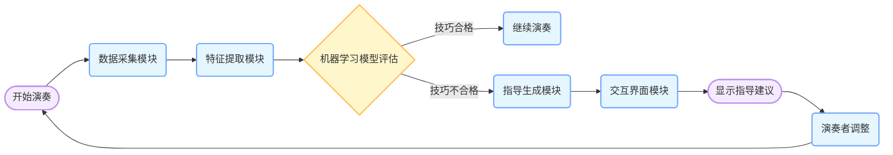

# 智能钢琴：AI Agent的演奏技巧指导

> 关键词：智能钢琴、AI Agent、演奏技巧、音乐教学、人工智能

> 摘要：本文围绕智能钢琴中AI Agent的演奏技巧指导展开深入探讨。首先介绍了智能钢琴及AI Agent在音乐领域应用的背景，阐述了相关核心概念和联系。详细讲解了AI Agent用于演奏技巧指导的核心算法原理，并结合Python代码进行说明，同时给出了相关数学模型和公式。通过项目实战，展示了智能钢琴演奏技巧指导系统的开发过程和代码实现。探讨了其实际应用场景，推荐了相关学习资源、开发工具和论文著作。最后总结了智能钢琴及AI Agent演奏技巧指导的未来发展趋势与挑战，并对常见问题进行了解答。

## 1. 背景介绍 
### 1.1 目的和范围
智能钢琴结合AI Agent进行演奏技巧指导的目的在于为钢琴学习者提供更加个性化、高效且丰富多样的学习体验。传统的钢琴教学往往受到时间、空间和教师资源的限制，而智能钢琴借助AI Agent可以突破这些限制，随时随地为学习者提供指导。本文章的范围涵盖了智能钢琴和AI Agent的基本概念、核心算法、数学模型、项目实战、实际应用场景等多个方面，旨在全面深入地介绍智能钢琴中AI Agent的演奏技巧指导这一技术。

### 1.2 预期读者
本文预期读者包括钢琴学习者、音乐教育工作者、对人工智能在音乐领域应用感兴趣的技术爱好者、从事智能钢琴相关产品研发的工程师以及相关领域的研究人员等。

### 1.3 文档结构概述
本文首先介绍智能钢琴和AI Agent的背景知识，包括目的、预期读者和术语表。接着阐述核心概念与联系，通过文本示意图和Mermaid流程图展示其架构。然后详细讲解核心算法原理并给出Python代码实现，同时介绍相关数学模型和公式。之后通过项目实战展示系统的开发过程和代码解读。再探讨实际应用场景，推荐相关工具和资源。最后总结未来发展趋势与挑战，解答常见问题并提供扩展阅读和参考资料。

### 1.4 术语表
#### 1.4.1 核心术语定义
- **智能钢琴**：一种融合了传统钢琴的演奏功能和现代电子技术、信息技术的乐器，能够实现与计算机或其他设备的交互，具备多种智能功能，如演奏记录、回放、教学指导等。
- **AI Agent（人工智能代理）**：是一种能够感知环境、进行决策并采取行动以实现特定目标的人工智能实体。在智能钢琴中，AI Agent可以感知演奏者的演奏情况，分析演奏技巧，并提供相应的指导和反馈。
- **演奏技巧**：指钢琴演奏中所运用的各种技术和方法，包括指法、节奏、力度、音色控制等方面。

#### 1.4.2 相关概念解释
- **音乐特征提取**：从音频信号中提取出能够反映音乐特征的参数，如音高、节奏、音符持续时间等，用于后续的分析和处理。
- **机器学习模型**：一种基于数据进行学习和预测的模型，在智能钢琴中可以用于分析演奏者的演奏数据，识别演奏技巧的优劣，并提供相应的指导建议。

#### 1.4.3 缩略词列表
- **AI**：Artificial Intelligence（人工智能）
- **ML**：Machine Learning（机器学习）

## 2. 核心概念与联系 

### 核心概念原理
智能钢琴中的AI Agent演奏技巧指导系统主要基于以下几个核心概念原理。首先是音乐特征提取，通过对钢琴演奏音频信号的分析，提取出音高、节奏、力度等关键特征。这些特征是后续分析演奏技巧的基础。然后，利用机器学习模型对提取的特征进行学习和分析。机器学习模型可以根据大量的标准演奏数据进行训练，从而能够识别出不同演奏技巧的模式和特征。当演奏者进行演奏时，系统提取其演奏特征并与训练好的模型进行比对，判断演奏技巧的准确性和优劣。最后，AI Agent根据比对结果生成相应的指导建议，如指法调整、节奏控制提示等，帮助演奏者提高演奏技巧。

### 架构的文本示意图
智能钢琴的AI Agent演奏技巧指导系统主要由以下几个部分组成：
1. **数据采集模块**：负责采集演奏者的钢琴演奏音频信号。
2. **特征提取模块**：对采集到的音频信号进行处理，提取出音高、节奏、力度等音乐特征。
3. **机器学习模型模块**：使用训练好的机器学习模型对提取的特征进行分析和判断，评估演奏技巧的优劣。
4. **指导生成模块**：根据机器学习模型的评估结果，生成相应的演奏技巧指导建议。
5. **交互界面模块**：将指导建议呈现给演奏者，并接收演奏者的反馈信息。

### Mermaid流程图


## 3. 核心算法原理 & 具体操作步骤 

### 核心算法原理
在智能钢琴的AI Agent演奏技巧指导系统中，常用的核心算法包括音高检测算法、节奏分析算法和机器学习分类算法等。

#### 音高检测算法
音高检测是确定钢琴演奏中每个音符音高的过程。一种常用的音高检测算法是自相关函数法。自相关函数可以衡量信号在不同时间延迟下的相似性。对于周期性的音频信号（如钢琴音符），自相关函数会在周期的整数倍处出现峰值。通过找到自相关函数的第一个峰值对应的时间延迟，可以计算出信号的基频，从而得到音高。

#### 节奏分析算法
节奏分析主要是确定音符的持续时间和节拍信息。可以通过对音频信号的能量变化进行分析来实现。当音符开始演奏时，音频信号的能量会突然增加；当音符结束时，能量会突然下降。通过检测这些能量变化的时刻，可以确定音符的起始和结束时间，进而计算出音符的持续时间和节拍信息。

#### 机器学习分类算法
机器学习分类算法用于对演奏者的演奏技巧进行分类和评估。常用的机器学习算法包括支持向量机（SVM）、决策树、神经网络等。这些算法可以根据提取的音乐特征（如音高、节奏、力度等）对演奏技巧进行分类，判断其是否符合标准。

### 具体操作步骤
以下是使用Python实现音高检测和节奏分析的示例代码：

```python
import numpy as np
import librosa

# 加载音频文件
audio_file = 'piano_recording.wav'
y, sr = librosa.load(audio_file)

# 音高检测
pitches, magnitudes = librosa.piptrack(y=y, sr=sr)
pitch = np.nanmean(pitches, axis=1)

# 节奏分析
tempo, beat_frames = librosa.beat.beat_track(y=y, sr=sr)
beat_times = librosa.frames_to_time(beat_frames, sr=sr)

print("检测到的音高:", pitch)
print("检测到的节奏（每分钟节拍数）:", tempo)
print("节拍时间:", beat_times)
```

### 代码解释
1. **加载音频文件**：使用`librosa.load`函数加载钢琴演奏的音频文件。
2. **音高检测**：使用`librosa.piptrack`函数计算音频信号的音高和幅度。然后取音高的平均值作为最终的音高。
3. **节奏分析**：使用`librosa.beat.beat_track`函数计算音频信号的节奏（每分钟节拍数）和节拍帧。然后使用`librosa.frames_to_time`函数将节拍帧转换为时间。

## 4. 数学模型和公式 & 详细讲解 & 举例说明 

### 自相关函数
自相关函数是音高检测的核心数学模型。对于离散信号 $x[n]$，其自相关函数定义为：
$$
R_{xx}[k] = \sum_{n=0}^{N-1-k} x[n] x[n+k]
$$
其中，$N$ 是信号的长度，$k$ 是时间延迟。自相关函数 $R_{xx}[k]$ 表示信号 $x[n]$ 与自身延迟 $k$ 个样本后的信号的相关性。

### 基频计算
通过找到自相关函数的第一个峰值对应的时间延迟 $k_0$，可以计算出信号的基频 $f_0$：
$$
f_0 = \frac{sr}{k_0}
$$
其中，$sr$ 是音频信号的采样率。

### 举例说明
假设我们有一个音频信号 $x[n]$，其采样率为 $sr = 44100$ Hz。通过计算自相关函数 $R_{xx}[k]$，找到第一个峰值对应的时间延迟 $k_0 = 100$ 个样本。则该信号的基频为：
$$
f_0 = \frac{44100}{100} = 441 \text{ Hz}
$$

## 5. 项目实战：代码实际案例和详细解释说明 

### 5.1  开发环境搭建
- **安装Python**：确保你的系统中安装了Python 3.x版本。
- **安装依赖库**：使用以下命令安装所需的Python库：
```sh
pip install librosa numpy matplotlib
```
- **音频采集设备**：准备一个可以采集钢琴演奏音频的设备，如麦克风。

### 5.2  源代码详细实现和代码解读
以下是一个完整的智能钢琴演奏技巧指导系统的示例代码：

```python
import numpy as np
import librosa
import matplotlib.pyplot as plt

# 加载音频文件
def load_audio(file_path):
    y, sr = librosa.load(file_path)
    return y, sr

# 音高检测
def pitch_detection(y, sr):
    pitches, magnitudes = librosa.piptrack(y=y, sr=sr)
    pitch = np.nanmean(pitches, axis=1)
    return pitch

# 节奏分析
def rhythm_analysis(y, sr):
    tempo, beat_frames = librosa.beat.beat_track(y=y, sr=sr)
    beat_times = librosa.frames_to_time(beat_frames, sr=sr)
    return tempo, beat_times

# 显示音高和节奏信息
def display_info(pitch, tempo, beat_times):
    plt.figure(figsize=(10, 6))
    plt.subplot(2, 1, 1)
    plt.plot(pitch)
    plt.title('Pitch Detection')
    plt.xlabel('Time (frames)')
    plt.ylabel('Pitch (Hz)')

    plt.subplot(2, 1, 2)
    plt.plot(beat_times, np.ones_like(beat_times), 'ro')
    plt.title('Rhythm Analysis')
    plt.xlabel('Time (s)')
    plt.ylabel('Beat')

    plt.tight_layout()
    plt.show()

# 主函数
def main():
    audio_file = 'piano_recording.wav'
    y, sr = load_audio(audio_file)
    pitch = pitch_detection(y, sr)
    tempo, beat_times = rhythm_analysis(y, sr)
    display_info(pitch, tempo, beat_times)

if __name__ == "__main__":
    main()
```

### 5.3  代码解读与分析
1. **加载音频文件**：`load_audio`函数使用`librosa.load`函数加载音频文件，并返回音频信号和采样率。
2. **音高检测**：`pitch_detection`函数使用`librosa.piptrack`函数计算音频信号的音高和幅度，并取音高的平均值作为最终的音高。
3. **节奏分析**：`rhythm_analysis`函数使用`librosa.beat.beat_track`函数计算音频信号的节奏（每分钟节拍数）和节拍帧，并将节拍帧转换为时间。
4. **显示音高和节奏信息**：`display_info`函数使用`matplotlib`库绘制音高和节奏信息的图表，方便用户直观地观察。
5. **主函数**：`main`函数调用上述函数，完成音频文件的加载、音高检测、节奏分析和信息显示。

## 6. 实际应用场景 
### 个人学习
对于钢琴初学者来说，智能钢琴的AI Agent演奏技巧指导系统可以作为一个随时随地的私人教师。学习者可以通过智能钢琴录制自己的演奏，系统会自动分析演奏技巧，指出存在的问题并提供相应的指导建议。例如，当学习者在指法上出现错误时，系统可以提示正确的指法；当节奏不准确时，系统可以帮助学习者调整节奏。

### 音乐教学机构
在音乐教学机构中，智能钢琴的AI Agent演奏技巧指导系统可以辅助教师进行教学。教师可以利用系统的分析结果，更加有针对性地对学生进行指导，提高教学效率。同时，系统可以记录学生的学习进度和演奏情况，方便教师进行教学评估和跟踪。

### 舞台表演
在舞台表演中，智能钢琴的AI Agent演奏技巧指导系统可以帮助演奏者进行排练和准备。演奏者可以通过系统分析自己的演奏，发现潜在的问题并进行改进，从而提高表演的质量和稳定性。

## 7. 工具和资源推荐
### 7.1 学习资源推荐
#### 7.1.1 书籍推荐
- 《音乐信号处理与分析》：介绍了音乐信号处理的基本理论和方法，包括音高检测、节奏分析等内容。
- 《Python音乐数据分析》：详细讲解了如何使用Python进行音乐数据分析，对于智能钢琴的开发和研究有很大的帮助。

#### 7.1.2 在线课程
- Coursera上的“音乐信息检索”课程：提供了音乐信息检索的基础知识和实践经验，包括音乐特征提取、机器学习在音乐领域的应用等内容。
- edX上的“Python编程与音乐创作”课程：结合Python编程和音乐创作，让学习者了解如何使用Python进行音乐处理和创作。

#### 7.1.3 技术博客和网站
- Librosa官方文档：提供了Librosa库的详细文档和示例代码，对于使用Librosa进行音乐分析非常有帮助。
- Music21官方网站：介绍了Music21库的使用方法和应用案例，该库可以用于音乐理论分析和音乐创作。

### 7.2 开发工具框架推荐
#### 7.2.1 IDE和编辑器
- PyCharm：一款功能强大的Python集成开发环境，提供了代码编辑、调试、版本控制等功能。
- Visual Studio Code：一款轻量级的代码编辑器，支持多种编程语言，并且有丰富的插件可以扩展功能。

#### 7.2.2 调试和性能分析工具
- Py-Spy：一个用于Python代码性能分析的工具，可以帮助开发者找出代码中的性能瓶颈。
-pdb：Python自带的调试器，可以帮助开发者调试代码中的错误。

#### 7.2.3 相关框架和库
- Librosa：一个用于音乐和音频分析的Python库，提供了音高检测、节奏分析、特征提取等功能。
- Music21：一个用于音乐理论分析和音乐创作的Python库，可以处理音乐符号、音符、和弦等信息。

### 7.3 相关论文著作推荐
#### 7.3.1 经典论文
- “Mel Frequency Cepstral Coefficients for Music Genre Classification”：介绍了梅尔频率倒谱系数（MFCC）在音乐流派分类中的应用。
- “A Survey of Automatic Music Transcription”：对自动音乐转录技术进行了综述，包括音高检测、音符分割等内容。

#### 7.3.2 最新研究成果
- 关注IEEE Transactions on Audio, Speech, and Language Processing、ACM Transactions on Multimedia Computing, Communications, and Applications等学术期刊，了解智能钢琴和AI Agent在音乐领域的最新研究成果。

#### 7.3.3 应用案例分析
- 查阅相关的学术会议论文和行业报告，了解智能钢琴在实际应用中的案例和经验，如智能钢琴在音乐教育、舞台表演等领域的应用。

## 8. 总结：未来发展趋势与挑战
### 未来发展趋势
- **个性化学习**：未来的智能钢琴AI Agent将能够根据每个学习者的特点和需求，提供更加个性化的演奏技巧指导。例如，根据学习者的音乐水平、学习目标和演奏习惯，制定专属的学习计划和指导方案。
- **多模态交互**：智能钢琴将不仅仅局限于音频信号的分析和处理，还将结合视觉、触觉等多种模态信息，提供更加丰富和直观的交互体验。例如，通过摄像头捕捉演奏者的手势和表情，通过传感器感知演奏者的力度和动作，从而更好地理解演奏者的意图和状态。
- **音乐创作辅助**：智能钢琴的AI Agent将不仅仅是一个演奏技巧指导工具，还将成为音乐创作的辅助工具。例如，根据演奏者的演奏风格和创意，生成相应的音乐素材和建议，帮助演奏者进行音乐创作。

### 挑战
- **音乐理解的局限性**：虽然目前的AI技术在音乐特征提取和分析方面取得了很大的进展，但对于音乐的深层次理解仍然存在局限性。例如，对于音乐的情感表达、风格特点等方面的理解还不够准确和深入。
- **数据隐私和安全**：智能钢琴在使用过程中会收集大量的用户演奏数据，这些数据包含了用户的个人信息和音乐创作成果。因此，如何保障数据的隐私和安全是一个重要的挑战。
- **技术标准和规范**：目前智能钢琴和AI Agent在音乐领域的应用还缺乏统一的技术标准和规范，这给产品的研发、推广和应用带来了一定的困难。

## 9. 附录：常见问题与解答
### 1. 智能钢琴的AI Agent演奏技巧指导系统准确吗？
智能钢琴的AI Agent演奏技巧指导系统的准确性取决于多个因素，如音频采集设备的质量、特征提取算法的精度、机器学习模型的训练数据等。一般来说，随着技术的不断发展和完善，系统的准确性会不断提高。

### 2. 智能钢琴的AI Agent可以替代传统的钢琴教师吗？
智能钢琴的AI Agent不能完全替代传统的钢琴教师。虽然AI Agent可以提供个性化的演奏技巧指导，但钢琴学习不仅仅是技术层面的学习，还包括音乐情感的表达、艺术修养的培养等方面。传统的钢琴教师可以通过面对面的教学，给予学生更多的情感支持和艺术指导。

### 3. 智能钢琴的AI Agent系统需要联网吗？
这取决于具体的产品设计。一些智能钢琴的AI Agent系统可以在本地运行，不需要联网；而一些系统需要联网才能获取最新的训练数据和功能更新。

## 10. 扩展阅读 & 参考资料
- [Librosa官方文档](https://librosa.org/doc/latest/index.html)
- [Music21官方网站](http://web.mit.edu/music21/)
- 《Python数据分析实战》，作者：[美] Jake VanderPlas
- 《音乐信息检索：原理与应用》，作者：[美] 大卫·米尔纳（David M. Milner）

通过以上内容，我们对智能钢琴中AI Agent的演奏技巧指导有了全面深入的了解。从核心概念、算法原理到项目实战和实际应用场景，再到未来发展趋势和挑战，我们可以看到智能钢琴和AI Agent在音乐领域有着广阔的应用前景和发展空间。同时，我们也需要不断地研究和探索，解决其中存在的问题和挑战，推动智能钢琴和AI Agent技术的不断发展和完善。