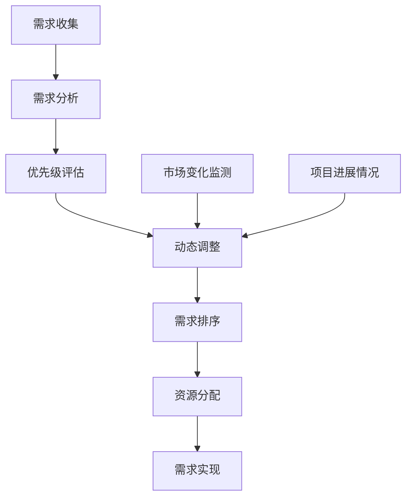

# 智能需求优先级动态调整：响应市场变化

> 关键词：智能需求、优先级动态调整、市场变化、需求管理、决策模型、自适应算法、敏捷开发

> 摘要：本文聚焦于智能需求优先级的动态调整，旨在探讨如何使企业能够及时响应市场变化。首先介绍了相关背景知识，包括目的范围、预期读者等内容。接着阐述了核心概念与联系，通过文本示意图和 Mermaid 流程图呈现其原理和架构。详细讲解了核心算法原理和具体操作步骤，并结合 Python 代码进行阐述。深入分析了数学模型和公式，辅以举例说明。通过项目实战展示了代码实际案例并进行详细解释。探讨了实际应用场景，推荐了相关的工具和资源。最后总结了未来发展趋势与挑战，提供了常见问题解答和扩展阅读参考资料，帮助读者全面理解和掌握智能需求优先级动态调整的方法和技术，以更好地应对市场变化。

## 1. 背景介绍 
### 1.1 目的和范围
在当今竞争激烈且变化迅速的市场环境中，企业面临着诸多挑战。市场需求不断变化，新技术层出不穷，竞争对手也在不断推出新的产品和服务。为了在这样的环境中生存和发展，企业需要能够快速响应市场变化，及时调整产品或服务的功能和特性。智能需求优先级动态调整的目的就是帮助企业实现这一目标，通过科学合理的方法对需求的优先级进行动态管理，确保企业资源能够得到最有效的利用，从而提高企业的竞争力和市场适应能力。

本文的范围涵盖了智能需求优先级动态调整的基本概念、核心算法、数学模型、实际应用以及相关的工具和资源推荐等方面。旨在为读者提供一个全面、系统的关于智能需求优先级动态调整的知识体系，帮助读者理解和掌握这一领域的关键技术和方法。

### 1.2 预期读者
本文的预期读者包括但不限于以下几类人群：
- **企业管理人员**：如产品经理、项目经理等，他们需要制定产品战略和项目计划，了解智能需求优先级动态调整可以帮助他们更好地做出决策，合理分配资源，提高产品的市场竞争力。
- **软件开发人员**：在软件开发过程中，需要根据需求的优先级进行开发工作。掌握智能需求优先级动态调整的方法可以使他们更高效地进行开发，避免资源浪费。
- **数据分析师**：智能需求优先级动态调整需要对大量的数据进行分析和处理，数据分析师可以从中了解如何运用数据分析技术来支持需求优先级的决策。
- **研究人员**：对需求工程、项目管理、人工智能等领域的研究人员，本文可以为他们提供相关的理论和实践参考，推动该领域的研究和发展。

### 1.3 文档结构概述
本文将按照以下结构进行组织：
- **核心概念与联系**：介绍智能需求优先级动态调整的核心概念，通过文本示意图和 Mermaid 流程图展示其原理和架构，帮助读者建立起整体的概念框架。
- **核心算法原理 & 具体操作步骤**：详细讲解用于智能需求优先级动态调整的核心算法，结合 Python 代码进行说明，使读者能够深入理解算法的实现细节。
- **数学模型和公式 & 详细讲解 & 举例说明**：阐述智能需求优先级动态调整所涉及的数学模型和公式，通过具体的例子帮助读者理解其应用。
- **项目实战：代码实际案例和详细解释说明**：通过一个实际的项目案例，展示智能需求优先级动态调整的具体实现过程，包括开发环境搭建、源代码实现和代码解读。
- **实际应用场景**：探讨智能需求优先级动态调整在不同领域和行业的实际应用场景，帮助读者了解其实际价值和作用。
- **工具和资源推荐**：推荐相关的学习资源、开发工具框架和论文著作，为读者提供进一步学习和实践的参考。
- **总结：未来发展趋势与挑战**：总结智能需求优先级动态调整的发展趋势，分析面临的挑战，为读者提供对该领域未来发展的展望。
- **附录：常见问题与解答**：解答读者在学习和实践过程中可能遇到的常见问题，帮助读者更好地理解和应用相关知识。
- **扩展阅读 & 参考资料**：提供相关的扩展阅读材料和参考资料，方便读者进行深入学习和研究。

### 1.4 术语表
#### 1.4.1 核心术语定义
- **智能需求**：指通过数据分析、人工智能等技术手段，对用户需求进行智能化的识别、分析和预测，以更好地满足用户的需求。
- **优先级动态调整**：根据市场变化、用户反馈、项目进展等因素，实时或定期对需求的优先级进行调整，确保资源能够优先分配到最重要的需求上。
- **市场变化**：包括市场需求的变化、竞争对手的动态、技术发展趋势等因素，这些因素会影响企业的产品或服务策略。
- **需求管理**：对需求的收集、分析、定义、验证、变更等过程进行管理，确保需求的合理性、完整性和一致性。
- **决策模型**：用于支持需求优先级决策的数学模型或算法，通过考虑多个因素来确定需求的优先级。

#### 1.4.2 相关概念解释
- **敏捷开发**：一种软件开发方法，强调快速响应变化，通过迭代的方式逐步交付产品。智能需求优先级动态调整与敏捷开发理念相契合，可以帮助敏捷团队更好地应对市场变化。
- **数据分析**：通过对大量数据的收集、整理、分析和挖掘，发现数据中的规律和价值。在智能需求优先级动态调整中，数据分析可以为决策提供依据。
- **人工智能**：利用计算机模拟人类智能的技术，包括机器学习、深度学习等。人工智能可以帮助实现智能需求的识别和优先级的预测。

#### 1.4.3 缩略词列表
- **AI**：Artificial Intelligence，人工智能
- **ML**：Machine Learning，机器学习
- **DL**：Deep Learning，深度学习
- **PM**：Product Manager，产品经理
- **SM**：Scrum Master，敏捷项目主管

## 2. 核心概念与联系 
### 核心概念原理
智能需求优先级动态调整的核心原理是基于对市场变化的实时监测和分析，结合企业的战略目标和资源状况，对需求的优先级进行动态评估和调整。其基本思想是将需求看作是企业的一种资源，通过合理分配这些资源，使企业能够在不断变化的市场环境中实现最大的价值。

具体来说，智能需求优先级动态调整包括以下几个关键步骤：
1. **需求收集**：通过各种渠道收集用户需求、市场反馈、竞争对手信息等，建立需求池。
2. **需求分析**：对收集到的需求进行分析，包括需求的功能、业务价值、技术难度、风险等方面。
3. **优先级评估**：根据需求分析的结果，结合市场变化和企业战略，对需求的优先级进行评估。评估方法可以采用定性和定量相结合的方式，如专家评估、层次分析法、模糊综合评价法等。
4. **动态调整**：根据市场变化和项目进展情况，实时或定期对需求的优先级进行调整。调整的依据可以包括市场需求的变化、竞争对手的动态、技术发展趋势、用户反馈等因素。

### 架构的文本示意图
智能需求优先级动态调整的架构可以分为以下几个层次：
- **数据层**：负责收集、存储和管理与需求相关的数据，包括用户需求、市场反馈、竞争对手信息、项目进展情况等。数据可以来自各种渠道，如用户调研、市场分析报告、系统日志等。
- **分析层**：对数据层收集到的数据进行分析和处理，包括需求分析、市场分析、风险评估等。分析方法可以采用数据分析、机器学习、人工智能等技术。
- **决策层**：根据分析层的结果，结合企业的战略目标和资源状况，对需求的优先级进行决策。决策方法可以采用决策模型、专家评估、群体决策等方式。
- **执行层**：根据决策层的决策结果，对需求进行排序和分配资源，确保需求能够按照优先级顺序得到实现。执行层可以采用敏捷开发、瀑布模型等项目管理方法。

### Mermaid 流程图


## 3. 核心算法原理 & 具体操作步骤 
### 核心算法原理
在智能需求优先级动态调整中，常用的算法包括层次分析法（AHP）、模糊综合评价法、机器学习算法等。这里我们以层次分析法为例，介绍其核心算法原理。

层次分析法（AHP）是一种将定性和定量分析相结合的决策方法，它通过将复杂的决策问题分解为多个层次，然后对每个层次的因素进行两两比较，确定其相对重要性，最后综合得出各个方案的优先级。

层次分析法的基本步骤如下：
1. **建立层次结构模型**：将决策问题分解为目标层、准则层和方案层。目标层是决策的最终目标，准则层是影响目标实现的因素，方案层是可供选择的方案。
2. **构造判断矩阵**：对准则层的因素进行两两比较，确定其相对重要性，构造判断矩阵。判断矩阵的元素表示两个因素之间的相对重要性程度，通常采用 1-9 标度法进行赋值。
3. **计算权重向量**：通过求解判断矩阵的特征值和特征向量，得到准则层因素的权重向量。
4. **一致性检验**：检验判断矩阵的一致性，确保判断矩阵的合理性。如果判断矩阵的一致性指标超过了规定的范围，则需要重新调整判断矩阵。
5. **计算方案层的优先级**：根据准则层因素的权重向量和方案层因素对准则层因素的相对重要性，计算方案层因素的优先级。

### 具体操作步骤及 Python 代码实现
以下是使用 Python 实现层次分析法的具体代码：
```python
import numpy as np

# 构造判断矩阵
def create_judgment_matrix():
    # 示例判断矩阵，根据实际情况修改
    matrix = np.array([[1, 3, 5],
                       [1/3, 1, 3],
                       [1/5, 1/3, 1]])
    return matrix

# 计算特征值和特征向量
def calculate_eigenvalues_and_eigenvectors(matrix):
    eigenvalues, eigenvectors = np.linalg.eig(matrix)
    max_eigenvalue = np.max(eigenvalues)
    max_index = np.argmax(eigenvalues)
    eigenvector = eigenvectors[:, max_index]
    eigenvector = np.real(eigenvector)
    eigenvector = eigenvector / np.sum(eigenvector)
    return max_eigenvalue, eigenvector

# 一致性检验
def consistency_check(max_eigenvalue, n):
    RI = [0, 0, 0.58, 0.90, 1.12, 1.24, 1.32, 1.41, 1.45]
    CI = (max_eigenvalue - n) / (n - 1)
    CR = CI / RI[n - 1]
    if CR < 0.1:
        print("判断矩阵具有满意的一致性")
    else:
        print("判断矩阵不具有满意的一致性，请重新调整")
    return CR

# 主函数
def main():
    matrix = create_judgment_matrix()
    n = matrix.shape[0]
    max_eigenvalue, eigenvector = calculate_eigenvalues_and_eigenvectors(matrix)
    CR = consistency_check(max_eigenvalue, n)
    print("权重向量:", eigenvector)

if __name__ == "__main__":
    main()
```
### 代码解释
1. **create_judgment_matrix 函数**：用于构造判断矩阵，这里给出了一个示例判断矩阵，实际应用中需要根据具体情况进行修改。
2. **calculate_eigenvalues_and_eigenvectors 函数**：用于计算判断矩阵的特征值和特征向量，取最大特征值对应的特征向量作为权重向量，并进行归一化处理。
3. **consistency_check 函数**：用于进行一致性检验，计算一致性指标 CI 和随机一致性比率 CR，如果 CR 小于 0.1，则认为判断矩阵具有满意的一致性。
4. **main 函数**：主函数，调用上述函数完成层次分析法的计算，并输出权重向量。

## 4. 数学模型和公式 & 详细讲解 & 举例说明 
### 层次分析法的数学模型和公式
#### 1. 判断矩阵
判断矩阵 $A=(a_{ij})_{n\times n}$ 是一个 $n$ 阶方阵，其中 $a_{ij}$ 表示因素 $i$ 相对于因素 $j$ 的相对重要性程度，通常采用 1-9 标度法进行赋值，具体含义如下：
- $a_{ij}=1$：表示因素 $i$ 与因素 $j$ 具有同等重要性。
- $a_{ij}=3$：表示因素 $i$ 比因素 $j$ 稍微重要。
- $a_{ij}=5$：表示因素 $i$ 比因素 $j$ 明显重要。
- $a_{ij}=7$：表示因素 $i$ 比因素 $j$ 强烈重要。
- $a_{ij}=9$：表示因素 $i$ 比因素 $j$ 极端重要。
- $a_{ij}=2,4,6,8$：表示上述相邻判断的中间值。
- $a_{ji}=\frac{1}{a_{ij}}$：表示因素 $j$ 相对于因素 $i$ 的相对重要性程度。

#### 2. 特征值和特征向量
判断矩阵 $A$ 的最大特征值 $\lambda_{max}$ 满足以下方程：
$$A\mathbf{w}=\lambda_{max}\mathbf{w}$$
其中 $\mathbf{w}$ 是对应的特征向量，经过归一化处理后，$\mathbf{w}$ 即为准则层因素的权重向量。

#### 3. 一致性指标
一致性指标 $CI$ 用于衡量判断矩阵的一致性程度，计算公式为：
$$CI=\frac{\lambda_{max}-n}{n - 1}$$
其中 $n$ 是判断矩阵的阶数。

#### 4. 随机一致性比率
随机一致性比率 $CR$ 用于判断判断矩阵是否具有满意的一致性，计算公式为：
$$CR=\frac{CI}{RI}$$
其中 $RI$ 是随机一致性指标，其值与判断矩阵的阶数有关，具体取值如下：
| 阶数 $n$ | 1 | 2 | 3 | 4 | 5 | 6 | 7 | 8 | 9 |
| --- | --- | --- | --- | --- | --- | --- | --- | --- | --- |
| $RI$ | 0 | 0 | 0.58 | 0.90 | 1.12 | 1.24 | 1.32 | 1.41 | 1.45 |

当 $CR<0.1$ 时，认为判断矩阵具有满意的一致性；否则，需要重新调整判断矩阵。

### 举例说明
假设我们要对三个需求 $D_1$、$D_2$、$D_3$ 的优先级进行评估，考虑的准则有业务价值、技术难度、风险三个方面。首先，我们对准则层的因素进行两两比较，构造判断矩阵 $A$：
$$A=\begin{bmatrix}
1 & 3 & 5 \\
\frac{1}{3} & 1 & 3 \\
\frac{1}{5} & \frac{1}{3} & 1
\end{bmatrix}$$
然后，计算判断矩阵的最大特征值 $\lambda_{max}$ 和对应的特征向量 $\mathbf{w}$：
$$\lambda_{max}=3.0385$$
$$\mathbf{w}=\begin{bmatrix}
0.6370 \\
0.2583 \\
0.1047
\end{bmatrix}$$
接着，进行一致性检验：
$$CI=\frac{3.0385 - 3}{3 - 1}=0.0192$$
$$RI = 0.58$$
$$CR=\frac{0.0192}{0.58}=0.0331<0.1$$
由于 $CR<0.1$，判断矩阵具有满意的一致性。因此，业务价值、技术难度、风险三个准则的权重分别为 0.6370、0.2583、0.1047。

接下来，我们需要对方案层的需求 $D_1$、$D_2$、$D_3$ 相对于每个准则的重要性进行评估，构造判断矩阵，并重复上述步骤，计算出每个需求相对于每个准则的权重，最后综合得出每个需求的优先级。

## 5. 项目实战：代码实际案例和详细解释说明 
### 5.1  开发环境搭建
#### 1. 安装 Python
首先，需要安装 Python 开发环境。可以从 Python 官方网站（https://www.python.org/downloads/） 下载适合自己操作系统的 Python 版本，并按照安装向导进行安装。

#### 2. 安装必要的库
在本项目中，我们需要使用 NumPy 库进行矩阵运算。可以使用以下命令安装 NumPy：
```sh
pip install numpy
```

### 5.2  源代码详细实现和代码解读
以下是一个完整的智能需求优先级动态调整的项目代码示例：
```python
import numpy as np

# 构造判断矩阵
def create_judgment_matrix():
    # 示例判断矩阵，根据实际情况修改
    matrix = np.array([[1, 3, 5],
                       [1/3, 1, 3],
                       [1/5, 1/3, 1]])
    return matrix

# 计算特征值和特征向量
def calculate_eigenvalues_and_eigenvectors(matrix):
    eigenvalues, eigenvectors = np.linalg.eig(matrix)
    max_eigenvalue = np.max(eigenvalues)
    max_index = np.argmax(eigenvalues)
    eigenvector = eigenvectors[:, max_index]
    eigenvector = np.real(eigenvector)
    eigenvector = eigenvector / np.sum(eigenvector)
    return max_eigenvalue, eigenvector

# 一致性检验
def consistency_check(max_eigenvalue, n):
    RI = [0, 0, 0.58, 0.90, 1.12, 1.24, 1.32, 1.41, 1.45]
    CI = (max_eigenvalue - n) / (n - 1)
    CR = CI / RI[n - 1]
    if CR < 0.1:
        print("判断矩阵具有满意的一致性")
    else:
        print("判断矩阵不具有满意的一致性，请重新调整")
    return CR

# 动态调整需求优先级
def dynamic_priority_adjustment():
    # 收集市场变化信息，这里简单模拟
    market_change = np.random.randint(1, 10)
    # 读取当前需求优先级权重向量
    matrix = create_judgment_matrix()
    n = matrix.shape[0]
    max_eigenvalue, eigenvector = calculate_eigenvalues_and_eigenvectors(matrix)
    CR = consistency_check(max_eigenvalue, n)
    if CR < 0.1:
        # 根据市场变化调整权重向量
        adjusted_eigenvector = eigenvector * market_change
        adjusted_eigenvector = adjusted_eigenvector / np.sum(adjusted_eigenvector)
        print("调整后的需求优先级权重向量:", adjusted_eigenvector)
    else:
        print("无法进行动态调整，请先调整判断矩阵")

# 主函数
def main():
    dynamic_priority_adjustment()

if __name__ == "__main__":
    main()
```
### 5.3  代码解读与分析
1. **create_judgment_matrix 函数**：用于构造判断矩阵，这里给出了一个示例判断矩阵，实际应用中需要根据具体情况进行修改。
2. **calculate_eigenvalues_and_eigenvectors 函数**：用于计算判断矩阵的特征值和特征向量，取最大特征值对应的特征向量作为权重向量，并进行归一化处理。
3. **consistency_check 函数**：用于进行一致性检验，计算一致性指标 CI 和随机一致性比率 CR，如果 CR 小于 0.1，则认为判断矩阵具有满意的一致性。
4. **dynamic_priority_adjustment 函数**：模拟了根据市场变化动态调整需求优先级的过程。首先收集市场变化信息，然后读取当前需求优先级权重向量，进行一致性检验，如果判断矩阵具有满意的一致性，则根据市场变化调整权重向量。
5. **main 函数**：主函数，调用 dynamic_priority_adjustment 函数完成需求优先级的动态调整。

## 6. 实际应用场景 
### 软件开发项目
在软件开发项目中，需求的优先级会随着市场变化和用户反馈不断调整。例如，当市场上出现新的竞争对手产品时，企业可能需要加快某些功能的开发，以提高产品的竞争力。通过智能需求优先级动态调整，可以及时对需求进行排序，确保开发团队能够优先处理最重要的需求，提高项目的成功率。

### 产品研发项目
在产品研发项目中，需要根据市场需求和技术发展趋势来确定产品的功能和特性。例如，随着消费者对环保和健康的关注度不断提高，企业可能需要调整产品的研发方向，增加一些环保和健康相关的功能。智能需求优先级动态调整可以帮助企业更好地把握市场变化，优化产品研发计划，提高产品的市场适应性。

### 市场营销活动
在市场营销活动中，需要根据市场变化和竞争对手的动态来调整营销策略。例如，当竞争对手推出新的促销活动时，企业可能需要及时调整自己的促销策略，以吸引更多的消费者。通过智能需求优先级动态调整，可以对市场营销活动的需求进行优先级排序，确保企业能够集中资源开展最有效的营销活动。

### 供应链管理
在供应链管理中，需要根据市场需求的变化来调整生产计划和采购计划。例如，当市场需求突然增加时，企业可能需要增加原材料的采购量，加快生产速度，以满足市场需求。智能需求优先级动态调整可以帮助企业更好地应对市场变化，优化供应链管理，提高企业的运营效率。

## 7. 工具和资源推荐
### 7.1 学习资源推荐
#### 7.1.1 书籍推荐
- 《需求工程——软件建模与分析》：这本书系统地介绍了需求工程的基本概念、方法和技术，包括需求收集、需求分析、需求规格说明、需求验证等方面的内容，对于理解智能需求优先级动态调整的相关概念和方法有很大的帮助。
- 《项目管理知识体系指南（PMBOK® 指南）》：该指南是项目管理领域的权威标准，涵盖了项目管理的各个方面，包括项目范围管理、项目时间管理、项目成本管理等。学习该指南可以帮助读者更好地理解需求优先级管理在项目管理中的重要性和应用方法。
- 《机器学习》：由周志华教授编写的这本书是机器学习领域的经典教材，全面介绍了机器学习的基本概念、算法和应用。对于想要深入了解智能需求优先级动态调整中机器学习算法应用的读者来说，是一本很好的学习资料。

#### 7.1.2 在线课程
- Coursera 上的“Data Science Specialization”：该课程由多所知名大学的教授联合授课，涵盖了数据科学的各个方面，包括数据分析、机器学习、数据可视化等。通过学习该课程，可以掌握智能需求优先级动态调整中所需的数据分析和机器学习技术。
- edX 上的“Agile Project Management”：这门课程介绍了敏捷项目管理的基本概念、方法和实践，对于理解如何在敏捷开发环境中进行需求优先级管理有很大的帮助。
- Udemy 上的“Python for Data Science and Machine Learning Bootcamp”：该课程以 Python 为工具，介绍了数据科学和机器学习的基本应用。通过学习该课程，可以掌握使用 Python 实现智能需求优先级动态调整的技术。

#### 7.1.3 技术博客和网站
- Medium：这是一个知名的技术博客平台，上面有很多关于需求工程、项目管理、人工智能等领域的文章。读者可以在上面找到最新的技术动态和实践经验。
- Stack Overflow：这是一个程序员社区，上面有很多关于编程和技术问题的讨论。读者可以在上面查找智能需求优先级动态调整相关的技术问题和解决方案。
- IEEE Xplore：这是电气和电子工程师协会（IEEE）的数字图书馆，上面有很多关于计算机科学、电子工程等领域的学术论文。读者可以在上面查找智能需求优先级动态调整相关的研究成果。

### 7.2 开发工具框架推荐
#### 7.2.1 IDE和编辑器
- PyCharm：这是一款专门为 Python 开发设计的集成开发环境（IDE），具有代码编辑、调试、版本控制等功能。它可以帮助开发者更高效地进行 Python 代码的开发和调试。
- Visual Studio Code：这是一款轻量级的代码编辑器，支持多种编程语言，包括 Python。它具有丰富的插件生态系统，可以根据自己的需求进行扩展。
- Jupyter Notebook：这是一个交互式的开发环境，适合进行数据分析和机器学习的实验和演示。它可以将代码、文本、图表等内容整合在一起，方便开发者进行数据探索和模型训练。

#### 7.2.2 调试和性能分析工具
- pdb：这是 Python 自带的调试工具，可以帮助开发者在代码中设置断点、单步执行、查看变量值等。通过使用 pdb，可以快速定位和解决代码中的问题。
- cProfile：这是 Python 自带的性能分析工具，可以帮助开发者分析代码的性能瓶颈。通过使用 cProfile，可以找出代码中执行时间较长的部分，进行优化。
- Py-Spy：这是一个轻量级的性能分析工具，可以实时监控 Python 程序的性能。它可以帮助开发者快速发现性能问题，并进行优化。

#### 7.2.3 相关框架和库
- NumPy：这是 Python 中用于科学计算的基础库，提供了高效的数组操作和数学函数。在智能需求优先级动态调整中，可以使用 NumPy 进行矩阵运算和数据处理。
- Pandas：这是 Python 中用于数据分析的库，提供了高效的数据结构和数据操作方法。在智能需求优先级动态调整中，可以使用 Pandas 进行数据清洗、数据分析和数据可视化。
- Scikit-learn：这是 Python 中用于机器学习的库，提供了丰富的机器学习算法和工具。在智能需求优先级动态调整中，可以使用 Scikit-learn 进行数据建模和预测。

### 7.3 相关论文著作推荐
#### 7.3.1 经典论文
- "A Hierarchical Approach for Prioritizing Requirements in Agile Software Development"：这篇论文提出了一种基于层次分析法的需求优先级排序方法，用于敏捷软件开发项目。该方法考虑了多个因素，如业务价值、技术难度、风险等，通过层次结构模型对需求的优先级进行评估。
- "Dynamic Requirement Prioritization in a Changing Environment"：这篇论文研究了在变化的环境中如何动态调整需求的优先级。提出了一种基于反馈机制的动态需求优先级调整方法，通过不断收集用户反馈和市场变化信息，实时调整需求的优先级。

#### 7.3.2 最新研究成果
- 近年来，随着人工智能和机器学习技术的发展，越来越多的研究开始将这些技术应用于需求优先级管理中。例如，一些研究使用深度学习算法对用户需求进行分类和预测，以提高需求优先级评估的准确性。
- 还有一些研究关注于多目标需求优先级管理问题，考虑了多个相互冲突的目标，如成本、时间、质量等，通过多目标优化算法来确定需求的优先级。

#### 7.3.3 应用案例分析
- 一些企业在实际项目中应用了智能需求优先级动态调整的方法，并取得了良好的效果。例如，某互联网公司通过实时监测市场变化和用户反馈，动态调整产品的需求优先级，提高了产品的用户满意度和市场竞争力。
- 某制造企业在产品研发项目中应用了需求优先级管理方法，优化了研发计划，缩短了产品上市时间，降低了研发成本。

## 8. 总结：未来发展趋势与挑战
### 未来发展趋势
#### 1. 智能化程度不断提高
随着人工智能和机器学习技术的不断发展，智能需求优先级动态调整的智能化程度将不断提高。未来，系统将能够自动收集、分析和处理大量的市场数据和用户反馈，实时预测市场变化趋势，自动调整需求的优先级，实现更加智能化的决策。

#### 2. 与其他技术的融合
智能需求优先级动态调整将与其他技术，如大数据、云计算、物联网等进行深度融合。通过大数据技术，可以收集和分析更多的市场数据和用户行为数据，为需求优先级决策提供更全面的依据；通过云计算技术，可以实现需求优先级管理系统的分布式部署和弹性扩展，提高系统的性能和可靠性；通过物联网技术，可以实时获取产品的使用数据和用户反馈，及时调整需求的优先级。

#### 3. 跨领域应用
智能需求优先级动态调整将不仅仅应用于软件开发、产品研发等领域，还将拓展到更多的领域，如医疗、教育、金融等。在医疗领域，可以根据患者的病情和需求，动态调整医疗资源的分配优先级；在教育领域，可以根据学生的学习情况和需求，动态调整教学内容和教学方法的优先级；在金融领域，可以根据市场变化和客户需求，动态调整金融产品和服务的优先级。

### 挑战
#### 1. 数据质量和安全问题
智能需求优先级动态调整需要大量的市场数据和用户反馈数据作为支撑，数据的质量和安全直接影响到决策的准确性和可靠性。然而，在实际应用中，数据可能存在不完整、不准确、不一致等问题，同时数据的安全和隐私也面临着严峻的挑战。

#### 2. 算法的可解释性和可靠性
虽然人工智能和机器学习算法在需求优先级决策中具有很高的准确性和效率，但这些算法往往是黑盒模型，缺乏可解释性。在实际应用中，决策者需要了解算法的决策过程和依据，以便做出合理的决策。此外，算法的可靠性也是一个重要的问题，算法可能会受到数据噪声、模型偏差等因素的影响，导致决策结果不准确。

#### 3. 组织文化和人员能力的挑战
智能需求优先级动态调整需要企业具备敏捷的组织文化和高素质的人员能力。然而，在实际应用中，一些企业的组织文化可能比较僵化，缺乏创新和变革的意识，难以适应市场变化的需求。同时，一些企业的人员可能缺乏相关的技术和管理能力，无法有效地实施智能需求优先级动态调整。

## 9. 附录：常见问题与解答
### 1. 如何确定判断矩阵的元素值？
判断矩阵的元素值通常采用 1-9 标度法进行赋值，具体含义可以参考前面的介绍。在实际应用中，可以通过专家评估、问卷调查等方式来确定判断矩阵的元素值。例如，可以邀请相关领域的专家对因素之间的相对重要性进行评估，然后根据专家的意见确定判断矩阵的元素值。

### 2. 如果判断矩阵不具有满意的一致性，应该怎么办？
如果判断矩阵不具有满意的一致性，需要重新调整判断矩阵。可以通过以下方法进行调整：
- 重新评估因素之间的相对重要性，检查是否存在判断错误。
- 邀请更多的专家进行评估，综合考虑不同专家的意见。
- 对判断矩阵进行修正，例如采用最小二乘法等方法对判断矩阵进行修正。

### 3. 如何收集和处理市场变化信息？
可以通过以下方式收集市场变化信息：
- 市场调研：通过问卷调查、访谈等方式收集用户需求和市场反馈。
- 竞争对手分析：关注竞争对手的产品动态、营销策略等信息。
- 行业报告：阅读行业研究报告，了解行业发展趋势和市场变化情况。
- 社交媒体监测：通过社交媒体平台监测用户的讨论和反馈。

收集到市场变化信息后，可以使用数据分析工具和技术对信息进行处理和分析，提取有用的信息，为需求优先级决策提供依据。

### 4. 智能需求优先级动态调整需要哪些技术和工具？
智能需求优先级动态调整需要以下技术和工具：
- 数据分析技术：如数据挖掘、机器学习等，用于对市场数据和用户反馈进行分析和处理。
- 决策模型和算法：如层次分析法、模糊综合评价法等，用于对需求的优先级进行评估和决策。
- 开发工具和框架：如 Python、NumPy、Pandas 等，用于实现智能需求优先级动态调整的系统。
- 数据存储和管理工具：如数据库管理系统，用于存储和管理市场数据和用户反馈数据。

### 5. 如何在实际项目中应用智能需求优先级动态调整？
在实际项目中应用智能需求优先级动态调整可以按照以下步骤进行：
- 需求收集：通过各种渠道收集用户需求、市场反馈、竞争对手信息等，建立需求池。
- 需求分析：对收集到的需求进行分析，包括需求的功能、业务价值、技术难度、风险等方面。
- 优先级评估：根据需求分析的结果，结合市场变化和企业战略，使用决策模型和算法对需求的优先级进行评估。
- 动态调整：根据市场变化和项目进展情况，实时或定期对需求的优先级进行调整。
- 执行和监控：根据调整后的需求优先级，对需求进行排序和分配资源，确保需求能够按照优先级顺序得到实现。同时，对项目进展情况进行监控，及时调整需求优先级。

## 10. 扩展阅读 & 参考资料
### 扩展阅读
- 《人工智能：现代方法》：这本书全面介绍了人工智能的基本概念、算法和应用，对于想要深入了解人工智能技术在需求优先级管理中应用的读者来说，是一本很好的扩展阅读资料。
- 《敏捷软件开发：原则、模式与实践》：该书籍详细介绍了敏捷软件开发的原则、方法和实践，对于理解如何在敏捷开发环境中进行需求优先级管理有很大的帮助。
- 《数据挖掘：概念与技术》：这本书系统地介绍了数据挖掘的基本概念、算法和应用，对于想要深入了解数据分析技术在需求优先级管理中应用的读者来说，是一本很好的扩展阅读资料。

### 参考资料
- 相关学术论文和研究报告，如在 IEEE Xplore、ACM Digital Library 等数据库中搜索到的关于需求优先级管理、人工智能、数据分析等方面的论文。
- 行业标准和规范，如 ISO 9000 质量管理体系标准、CMMI 软件能力成熟度模型集成等，这些标准和规范对于需求管理和项目管理具有重要的指导意义。
- 企业的实践经验和案例分析，如一些知名企业在需求优先级管理方面的成功案例和实践经验分享。