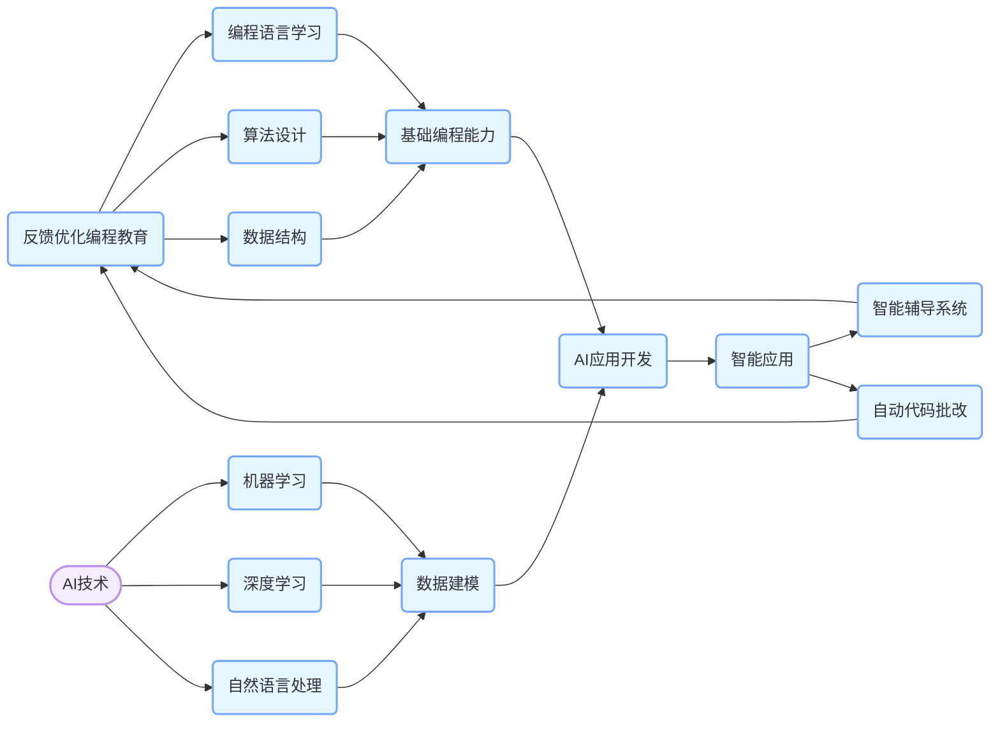

# 未来编程教育在AI时代的转型

> 关键词：编程教育、AI时代、教育转型、人工智能、教学方法、课程体系、未来趋势

> 摘要：随着AI时代的来临，编程教育面临着前所未有的变革与挑战。本文深入探讨了未来编程教育在AI时代的转型问题，首先介绍了编程教育在当前时代背景下的目的、范围以及预期读者等背景信息，接着阐述了编程教育与AI相关的核心概念及其联系，详细讲解了相关的核心算法原理和具体操作步骤，通过数学模型和公式进一步剖析其本质，结合项目实战案例展示代码实现与解读，分析了编程教育在实际中的应用场景，推荐了相关的学习资源、开发工具框架以及论文著作等，最后总结了未来编程教育的发展趋势与挑战，并提供常见问题解答和扩展阅读参考资料，旨在为编程教育在AI时代的转型提供全面且深入的指导。

## 1. 背景介绍 
### 1.1 目的和范围
在当今数字化和智能化飞速发展的时代，AI技术已经渗透到各个领域，对社会的发展和人们的生活产生了深远的影响。编程作为与AI技术紧密相关的基础技能，其教育的重要性日益凸显。本文的目的在于探讨未来编程教育在AI时代应如何进行转型，以适应时代的需求和发展。范围涵盖了编程教育的各个方面，包括教学理念、课程体系、教学方法、评价体系等，旨在为编程教育工作者、教育研究者以及对编程教育感兴趣的人士提供全面的参考和指导。

### 1.2 预期读者
本文的预期读者主要包括以下几类人群：
- **编程教育工作者**：包括中小学信息技术教师、高校计算机专业教师、培训机构编程讲师等，他们需要了解AI时代编程教育的新趋势和新方法，以便改进教学实践。
- **教育研究者**：关注教育发展动态，研究编程教育的理论和实践问题，希望从本文中获取有关编程教育转型的深入分析和研究思路。
- **教育政策制定者**：负责制定教育政策和规划，需要了解AI时代编程教育的需求和发展方向，为政策的制定提供参考依据。
- **学生和家长**：学生希望通过了解编程教育的转型，更好地规划自己的学习路径；家长则希望了解如何引导孩子在AI时代更好地学习编程。
- **科技爱好者和从业者**：对编程和AI技术感兴趣，想了解编程教育在AI时代的发展变化，以及如何通过教育培养更多适应时代需求的人才。

### 1.3 文档结构概述
本文将按照以下结构进行阐述：
- **核心概念与联系**：介绍编程教育和AI相关的核心概念，以及它们之间的内在联系，通过文本示意图和Mermaid流程图进行直观展示。
- **核心算法原理 & 具体操作步骤**：讲解与编程教育和AI相关的核心算法原理，并使用Python源代码详细阐述具体操作步骤。
- **数学模型和公式 & 详细讲解 & 举例说明**：运用数学模型和公式深入剖析编程教育和AI的本质，并通过具体例子进行说明。
- **项目实战：代码实际案例和详细解释说明**：通过实际项目案例，展示开发环境搭建、源代码实现和代码解读，帮助读者更好地理解和应用相关知识。
- **实际应用场景**：分析编程教育在AI时代的实际应用场景，展示其在不同领域的重要作用。
- **工具和资源推荐**：推荐学习资源、开发工具框架以及相关论文著作，为读者提供更多的学习和研究渠道。
- **总结：未来发展趋势与挑战**：总结未来编程教育在AI时代的发展趋势，并分析面临的挑战。
- **附录：常见问题与解答**：解答读者在编程教育和AI相关方面可能遇到的常见问题。
- **扩展阅读 & 参考资料**：提供相关的扩展阅读内容和参考资料，方便读者进一步深入研究。

### 1.4 术语表
#### 1.4.1 核心术语定义
- **编程教育**：是指教授人们如何使用计算机编程语言进行程序设计和开发的教育活动，旨在培养学生的计算思维、问题解决能力和创新能力。
- **AI（Artificial Intelligence）**：即人工智能，是指计算机系统能够执行通常需要人类智能才能完成的任务，如学习、推理、决策等。
- **计算思维**：是运用计算机科学的基础概念进行问题求解、系统设计以及人类行为理解等涵盖计算机科学之广度的一系列思维活动。
- **课程体系**：是指学校为实现培养目标而选择的教育内容及其进程的总和，包括课程设置、课程标准、教材等。
- **教学方法**：是指为了达到教学目的，实现教学内容，运用教学手段而进行的，由教学原则指导的一整套方式组成的，师生相互作用的活动。

#### 1.4.2 相关概念解释
- **AI编程**：是指利用AI技术和算法进行程序开发的过程，涉及到机器学习、深度学习、自然语言处理等领域的知识和技术。
- **编程思维**：与计算思维类似，但更侧重于编程过程中的逻辑思考和问题解决方法，包括如何设计算法、组织代码结构、调试程序等。
- **在线编程教育**：是指通过互联网平台进行的编程教育活动，具有不受时间和空间限制、资源丰富等特点。
- **项目式学习**：是一种以项目为导向的学习方法，学生通过完成实际项目来学习知识和技能，培养解决实际问题的能力。

#### 1.4.3 缩略词列表
- **AI**：Artificial Intelligence（人工智能）
- **ML**：Machine Learning（机器学习）
- **DL**：Deep Learning（深度学习）
- **NLP**：Natural Language Processing（自然语言处理）
- **IDE**：Integrated Development Environment（集成开发环境）

## 2. 核心概念与联系 

### 编程教育与AI的核心概念
编程教育的核心在于教授学生如何使用编程语言来表达自己的想法和解决问题。编程语言是人与计算机沟通的桥梁，通过编写代码，我们可以让计算机执行特定的任务。常见的编程语言包括Python、Java、C++等，每种语言都有其特点和应用场景。

AI则是计算机科学的一个重要分支，旨在让计算机模拟人类的智能行为。AI的核心技术包括机器学习、深度学习、自然语言处理等。机器学习是AI的基础，它通过让计算机从数据中学习模式和规律，从而实现对未知数据的预测和分类。深度学习是机器学习的一个子集，它通过构建深层神经网络来处理复杂的数据，在图像识别、语音识别等领域取得了巨大的成功。自然语言处理则是让计算机理解和处理人类语言的技术，包括文本分类、情感分析、机器翻译等。

### 编程教育与AI的内在联系
编程教育是AI发展的基础。要实现AI的各种应用，必须使用编程语言来编写算法和模型。例如，在机器学习中，我们可以使用Python语言结合相关的库（如Scikit-learn、TensorFlow等）来实现分类、回归、聚类等算法。同时，编程教育也可以培养学生的计算思维和问题解决能力，这对于理解和应用AI技术至关重要。

另一方面，AI技术也可以为编程教育带来新的机遇和挑战。AI可以提供个性化的学习体验，根据学生的学习进度和能力水平提供定制化的学习内容和指导。例如，智能辅导系统可以根据学生的答题情况实时调整教学策略，帮助学生更好地掌握知识和技能。此外，AI还可以自动批改代码、分析代码质量等，提高教学效率。

### 文本示意图
编程教育与AI的关系可以用以下文本示意图表示：

编程教育是基础，为AI的发展提供了技术支持和人才储备。通过编程教育，学生可以学习到编程语言、算法设计、数据结构等基础知识，这些知识是实现AI应用的前提。

AI技术则为编程教育带来了创新和变革。AI可以提供个性化的学习体验、智能的教学辅助工具等，提高编程教育的质量和效率。同时，AI的发展也对编程教育提出了更高的要求，需要培养学生具备跨学科的知识和技能，能够理解和应用AI技术。

### Mermaid流程图


这个流程图展示了编程教育和AI技术之间的相互关系。编程教育为AI应用开发提供基础，而AI技术又通过智能应用反馈优化编程教育。

## 3. 核心算法原理 & 具体操作步骤 

### 机器学习算法原理 - 线性回归
线性回归是一种简单而常用的机器学习算法，用于预测连续值的输出。其基本原理是通过找到一条最佳的直线（或超平面）来拟合输入数据和输出数据之间的关系。

#### 数学原理
假设我们有一组输入数据 $X = \{x_1, x_2, ..., x_n\}$ 和对应的输出数据 $y = \{y_1, y_2, ..., y_n\}$，线性回归模型的目标是找到一组参数 $\theta = \{\theta_0, \theta_1, ..., \theta_m\}$，使得预测值 $\hat{y}$ 与真实值 $y$ 之间的误差最小。线性回归模型的预测公式为：

$$\hat{y} = \theta_0 + \theta_1x_1 + \theta_2x_2 + ... + \theta_mx_m$$

为了衡量预测值与真实值之间的误差，我们通常使用均方误差（Mean Squared Error, MSE）作为损失函数：

$$MSE = \frac{1}{n}\sum_{i=1}^{n}(y_i - \hat{y}_i)^2$$

线性回归的目标就是找到一组参数 $\theta$，使得 MSE 最小。这可以通过最小二乘法或梯度下降法来实现。

#### Python 代码实现
```python
import numpy as np
import matplotlib.pyplot as plt

# 生成一些随机数据
np.random.seed(0)
X = 2 * np.random.rand(100, 1)
y = 4 + 3 * X + np.random.randn(100, 1)

# 添加偏置项
X_b = np.c_[np.ones((100, 1)), X]

# 使用最小二乘法计算参数
theta_best = np.linalg.inv(X_b.T.dot(X_b)).dot(X_b.T).dot(y)

# 打印参数
print("Theta:", theta_best)

# 生成测试数据
X_new = np.array([[0], [2]])
X_new_b = np.c_[np.ones((2, 1)), X_new]

# 进行预测
y_predict = X_new_b.dot(theta_best)

# 绘制数据和拟合直线
plt.plot(X_new, y_predict, "r-")
plt.plot(X, y, "b.")
plt.axis([0, 2, 0, 15])
plt.show()
```

#### 代码解释
1. **数据生成**：使用 `np.random.rand` 生成随机的输入数据 $X$，并根据线性关系 $y = 4 + 3X + \epsilon$ 生成对应的输出数据 $y$，其中 $\epsilon$ 是随机噪声。
2. **添加偏置项**：在输入数据 $X$ 中添加一列全为 1 的偏置项，得到 $X_b$，以便于计算截距项 $\theta_0$。
3. **最小二乘法计算参数**：使用 `np.linalg.inv` 计算矩阵的逆，通过最小二乘法公式 $\theta = (X^T X)^{-1} X^T y$ 计算参数 $\theta$。
4. **预测**：生成测试数据 $X_new$，并添加偏置项得到 $X_new_b$，然后使用计算得到的参数 $\theta$ 进行预测。
5. **绘制结果**：使用 `matplotlib` 绘制输入数据和拟合直线。

### 深度学习算法原理 - 简单的神经网络
神经网络是一种强大的深度学习模型，由多个神经元组成的层次结构。下面我们以一个简单的两层神经网络为例，介绍其原理和实现。

#### 数学原理
假设我们有一个输入层、一个隐藏层和一个输出层的神经网络。输入层接收输入数据 $X$，隐藏层的神经元对输入数据进行加权求和并通过激活函数进行非线性变换，输出层的神经元对隐藏层的输出进行加权求和得到最终的输出 $\hat{y}$。

隐藏层的输出 $h$ 可以表示为：

$$h = \sigma(W_1X + b_1)$$

其中 $W_1$ 是输入层到隐藏层的权重矩阵，$b_1$ 是隐藏层的偏置向量，$\sigma$ 是激活函数，常用的激活函数有 sigmoid 函数、ReLU 函数等。

输出层的输出 $\hat{y}$ 可以表示为：

$$\hat{y} = W_2h + b_2$$

其中 $W_2$ 是隐藏层到输出层的权重矩阵，$b_2$ 是输出层的偏置向量。

为了训练神经网络，我们需要定义一个损失函数，例如交叉熵损失函数，然后使用反向传播算法来更新权重和偏置，使得损失函数最小化。

#### Python 代码实现
```python
import numpy as np

# 定义激活函数 sigmoid
def sigmoid(x):
    return 1 / (1 + np.exp(-x))

# 定义 sigmoid 函数的导数
def sigmoid_derivative(x):
    return x * (1 - x)

# 输入数据
X = np.array([[0, 0, 1],
              [0, 1, 1],
              [1, 0, 1],
              [1, 1, 1]])

# 输出数据
y = np.array([[0], [1], [1], [0]])

# 设置随机种子
np.random.seed(1)

# 初始化权重
syn0 = 2 * np.random.random((3, 4)) - 1
syn1 = 2 * np.random.random((4, 1)) - 1

# 训练神经网络
for iter in range(60000):
    # 前向传播
    l0 = X
    l1 = sigmoid(np.dot(l0, syn0))
    l2 = sigmoid(np.dot(l1, syn1))

    # 计算误差
    l2_error = y - l2

    # 反向传播
    l2_delta = l2_error * sigmoid_derivative(l2)
    l1_error = l2_delta.dot(syn1.T)
    l1_delta = l1_error * sigmoid_derivative(l1)

    # 更新权重
    syn1 += l1.T.dot(l2_delta)
    syn0 += l0.T.dot(l1_delta)

# 打印最终输出
print("Output after training:")
print(l2)
```

#### 代码解释
1. **激活函数定义**：定义了 sigmoid 函数及其导数，用于神经网络的非线性变换和反向传播计算。
2. **数据准备**：定义了输入数据 $X$ 和输出数据 $y$。
3. **权重初始化**：随机初始化输入层到隐藏层的权重矩阵 $syn0$ 和隐藏层到输出层的权重矩阵 $syn1$。
4. **训练过程**：进行 60000 次迭代训练，每次迭代包括前向传播、误差计算、反向传播和权重更新。
5. **输出结果**：打印训练后的最终输出。

## 4. 数学模型和公式 & 详细讲解 & 举例说明 

### 线性回归的数学模型和公式
#### 最小二乘法原理
线性回归的目标是找到一组参数 $\theta$，使得预测值 $\hat{y}$ 与真实值 $y$ 之间的误差最小。在最小二乘法中，我们使用均方误差（MSE）作为损失函数：

$$MSE = \frac{1}{n}\sum_{i=1}^{n}(y_i - \hat{y}_i)^2$$

将 $\hat{y}_i = \theta_0 + \theta_1x_{i1} + \theta_2x_{i2} + ... + \theta_mx_{im}$ 代入上式，得到：

$$MSE = \frac{1}{n}\sum_{i=1}^{n}(y_i - (\theta_0 + \theta_1x_{i1} + \theta_2x_{i2} + ... + \theta_mx_{im}))^2$$

为了找到使 MSE 最小的参数 $\theta$，我们对 MSE 关于 $\theta$ 求偏导数，并令偏导数等于 0：

$$\frac{\partial MSE}{\partial \theta_j} = 0, j = 0, 1, ..., m$$

通过求解上述方程组，可以得到参数 $\theta$ 的最优解。在矩阵形式下，最小二乘法的解可以表示为：

$$\theta = (X^T X)^{-1} X^T y$$

其中 $X$ 是输入数据矩阵，$y$ 是输出数据向量。

#### 举例说明
假设我们有以下一组数据：

| $x$ | $y$ |
| --- | --- |
| 1 | 3 |
| 2 | 5 |
| 3 | 7 |
| 4 | 9 |

我们可以使用最小二乘法来拟合一条直线 $y = \theta_0 + \theta_1x$。首先，将数据表示为矩阵形式：

$$X = \begin{bmatrix} 1 & 1 \\ 1 & 2 \\ 1 & 3 \\ 1 & 4 \end{bmatrix}, y = \begin{bmatrix} 3 \\ 5 \\ 7 \\ 9 \end{bmatrix}$$

然后，计算 $X^T X$ 和 $X^T y$：

$$X^T X = \begin{bmatrix} 4 & 10 \\ 10 & 30 \end{bmatrix}, X^T y = \begin{bmatrix} 24 \\ 70 \end{bmatrix}$$

接着，计算 $(X^T X)^{-1}$：

$$(X^T X)^{-1} = \frac{1}{4 \times 30 - 10 \times 10} \begin{bmatrix} 30 & -10 \\ -10 & 4 \end{bmatrix} = \begin{bmatrix} 1.5 & -0.5 \\ -0.5 & 0.2 \end{bmatrix}$$

最后，计算参数 $\theta$：

$$\theta = (X^T X)^{-1} X^T y = \begin{bmatrix} 1.5 & -0.5 \\ -0.5 & 0.2 \end{bmatrix} \begin{bmatrix} 24 \\ 70 \end{bmatrix} = \begin{bmatrix} 1 \\ 2 \end{bmatrix}$$

所以，拟合的直线方程为 $y = 1 + 2x$。

### 神经网络的数学模型和公式
#### 前向传播
神经网络的前向传播过程是从输入层到输出层的计算过程。假设我们有一个输入层、一个隐藏层和一个输出层的神经网络，输入层有 $n$ 个神经元，隐藏层有 $h$ 个神经元，输出层有 $m$ 个神经元。

输入层的输入数据为 $X = [x_1, x_2, ..., x_n]^T$，输入层到隐藏层的权重矩阵为 $W_1 = [w_{11}, w_{12}, ..., w_{1h}; w_{21}, w_{22}, ..., w_{2h}; ...; w_{n1}, w_{n2}, ..., w_{nh}]$，隐藏层的偏置向量为 $b_1 = [b_{11}, b_{12}, ..., b_{1h}]^T$。

隐藏层的输入 $z_1$ 为：

$$z_1 = W_1^T X + b_1$$

隐藏层的输出 $h$ 为：

$$h = \sigma(z_1)$$

其中 $\sigma$ 是激活函数。

隐藏层到输出层的权重矩阵为 $W_2 = [w_{21}, w_{22}, ..., w_{2m}; w_{31}, w_{32}, ..., w_{3m}; ...; w_{h1}, w_{h2}, ..., w_{hm}]$，输出层的偏置向量为 $b_2 = [b_{21}, b_{22}, ..., b_{2m}]^T$。

输出层的输入 $z_2$ 为：

$$z_2 = W_2^T h + b_2$$

输出层的输出 $\hat{y}$ 为：

$$\hat{y} = \sigma(z_2)$$

#### 反向传播
反向传播算法是用于训练神经网络的核心算法，其目的是通过计算损失函数对权重和偏置的梯度，来更新权重和偏置，使得损失函数最小化。

假设我们使用交叉熵损失函数 $L$ 来衡量预测值 $\hat{y}$ 与真实值 $y$ 之间的误差：

$$L = -\sum_{i=1}^{m} y_i \log(\hat{y}_i) + (1 - y_i) \log(1 - \hat{y}_i)$$

首先，计算输出层的误差 $\delta_2$：

$$\delta_2 = \frac{\partial L}{\partial z_2} = \hat{y} - y$$

然后，计算隐藏层的误差 $\delta_1$：

$$\delta_1 = \frac{\partial L}{\partial z_1} = W_2 \delta_2 \odot \sigma'(z_1)$$

其中 $\odot$ 表示逐元素相乘，$\sigma'(z_1)$ 是激活函数的导数。

最后，更新权重和偏置：

$$\Delta W_2 = \eta \delta_2 h^T$$
$$\Delta b_2 = \eta \delta_2$$
$$\Delta W_1 = \eta \delta_1 X^T$$
$$\Delta b_1 = \eta \delta_1$$

其中 $\eta$ 是学习率。

#### 举例说明
假设我们有一个简单的神经网络，输入层有 2 个神经元，隐藏层有 3 个神经元，输出层有 1 个神经元。输入数据 $X = [0.5, 0.3]^T$，真实输出 $y = 1$。

输入层到隐藏层的权重矩阵 $W_1$ 和偏置向量 $b_1$ 初始化为：

$$W_1 = \begin{bmatrix} 0.1 & 0.2 & 0.3 \\ 0.4 & 0.5 & 0.6 \end{bmatrix}, b_1 = \begin{bmatrix} 0.1 \\ 0.2 \\ 0.3 \end{bmatrix}$$

隐藏层到输出层的权重矩阵 $W_2$ 和偏置向量 $b_2$ 初始化为：

$$W_2 = \begin{bmatrix} 0.7 \\ 0.8 \\ 0.9 \end{bmatrix}, b_2 = [0.1]$$

使用 sigmoid 函数作为激活函数，前向传播计算隐藏层的输入 $z_1$ 和输出 $h$：

$$z_1 = W_1^T X + b_1 = \begin{bmatrix} 0.1 \times 0.5 + 0.4 \times 0.3 + 0.1 \\ 0.2 \times 0.5 + 0.5 \times 0.3 + 0.2 \\ 0.3 \times 0.5 + 0.6 \times 0.3 + 0.3 \end{bmatrix} = \begin{bmatrix} 0.27 \\ 0.35 \\ 0.43 \end{bmatrix}$$

$$h = \sigma(z_1) = \begin{bmatrix} \frac{1}{1 + e^{-0.27}} \\ \frac{1}{1 + e^{-0.35}} \\ \frac{1}{1 + e^{-0.43}} \end{bmatrix} = \begin{bmatrix} 0.567 \\ 0.587 \\ 0.606 \end{bmatrix}$$

输出层的输入 $z_2$ 和输出 $\hat{y}$：

$$z_2 = W_2^T h + b_2 = 0.7 \times 0.567 + 0.8 \times 0.587 + 0.9 \times 0.606 + 0.1 = 1.47$$

$$\hat{y} = \sigma(z_2) = \frac{1}{1 + e^{-1.47}} = 0.81$$

使用交叉熵损失函数计算损失：

$$L = -y \log(\hat{y}) - (1 - y) \log(1 - \hat{y}) = -1 \times \log(0.81) - (1 - 1) \log(1 - 0.81) = 0.21$$

反向传播计算误差和更新权重偏置的过程类似上述公式，这里不再详细计算。

## 5. 项目实战：代码实际案例和详细解释说明 

### 5.1  开发环境搭建
#### 安装 Python
Python 是一种广泛使用的编程语言，在编程教育和 AI 领域都有重要的应用。我们可以从 Python 官方网站（https://www.python.org/downloads/） 下载并安装适合自己操作系统的 Python 版本。安装过程中，建议勾选“Add Python to PATH”选项，这样可以在命令行中直接使用 Python 命令。

#### 安装开发工具
- **PyCharm**：是一款专业的 Python 集成开发环境（IDE），提供了代码编辑、调试、自动补全、版本控制等功能。可以从 JetBrains 官方网站（https://www.jetbrains.com/pycharm/download/） 下载并安装。
- **Jupyter Notebook**：是一个开源的 Web 应用程序，允许用户创建和共享包含代码、文本、图像等的交互式文档。可以使用 `pip install jupyter` 命令进行安装。

#### 安装必要的库
在 AI 编程中，我们通常需要使用一些第三方库来简化开发过程。以下是一些常用的库及其安装命令：
- **NumPy**：用于科学计算和数组操作，安装命令：`pip install numpy`
- **Pandas**：用于数据处理和分析，安装命令：`pip install pandas`
- **Matplotlib**：用于数据可视化，安装命令：`pip install matplotlib`
- **Scikit-learn**：用于机器学习，安装命令：`pip install scikit-learn`
- **TensorFlow**：用于深度学习，安装命令：`pip install tensorflow`

### 5.2  源代码详细实现和代码解读
#### 项目背景
我们将实现一个简单的手写数字识别项目，使用 Python 和 TensorFlow 库。手写数字识别是一个经典的机器学习问题，通过训练模型来识别手写数字的图像。

#### 源代码实现
```python
import tensorflow as tf
from tensorflow.keras.datasets import mnist
from tensorflow.keras.models import Sequential
from tensorflow.keras.layers import Flatten, Dense
from tensorflow.keras.utils import to_categorical
import matplotlib.pyplot as plt

# 加载数据集
(train_images, train_labels), (test_images, test_labels) = mnist.load_data()

# 数据预处理
train_images = train_images / 255.0
test_images = test_images / 255.0

train_labels = to_categorical(train_labels)
test_labels = to_categorical(test_labels)

# 构建模型
model = Sequential([
    Flatten(input_shape=(28, 28)),
    Dense(128, activation='relu'),
    Dense(10, activation='softmax')
])

# 编译模型
model.compile(optimizer='adam',
              loss='categorical_crossentropy',
              metrics=['accuracy'])

# 训练模型
history = model.fit(train_images, train_labels, epochs=5, batch_size=64, validation_data=(test_images, test_labels))

# 评估模型
test_loss, test_acc = model.evaluate(test_images, test_labels)
print(f"Test accuracy: {test_acc}")

# 绘制训练过程中的损失和准确率曲线
plt.plot(history.history['accuracy'])
plt.plot(history.history['val_accuracy'])
plt.title('Model accuracy')
plt.ylabel('Accuracy')
plt.xlabel('Epoch')
plt.legend(['Train', 'Test'], loc='upper left')
plt.show()

plt.plot(history.history['loss'])
plt.plot(history.history['val_loss'])
plt.title('Model loss')
plt.ylabel('Loss')
plt.xlabel('Epoch')
plt.legend(['Train', 'Test'], loc='upper left')
plt.show()
```

#### 代码解读
1. **数据加载**：使用 `mnist.load_data()` 函数加载手写数字识别数据集，该数据集包含 60000 个训练样本和 10000 个测试样本。
2. **数据预处理**：将图像数据的像素值归一化到 0 到 1 之间，同时将标签数据进行 one-hot 编码，以便于模型训练。
3. **模型构建**：使用 `Sequential` 模型构建一个简单的神经网络，包含一个 `Flatten` 层将 2D 图像数据转换为 1D 向量，一个 `Dense` 层作为隐藏层，使用 ReLU 激活函数，一个 `Dense` 层作为输出层，使用 softmax 激活函数输出每个数字的概率。
4. **模型编译**：使用 `adam` 优化器、`categorical_crossentropy` 损失函数和 `accuracy` 指标来编译模型。
5. **模型训练**：使用 `fit` 方法对模型进行训练，指定训练数据、训练轮数、批次大小和验证数据。
6. **模型评估**：使用 `evaluate` 方法对模型在测试数据上的性能进行评估，输出测试准确率。
7. **可视化**：使用 `matplotlib` 库绘制训练过程中的损失和准确率曲线，以便于观察模型的训练情况。

### 5.3  代码解读与分析
#### 模型结构分析
- **Flatten 层**：将输入的 28x28 图像数据转换为 784 维的向量，方便后续的全连接层处理。
- **Dense 层（隐藏层）**：包含 128 个神经元，使用 ReLU 激活函数引入非线性，增加模型的表达能力。
- **Dense 层（输出层）**：包含 10 个神经元，对应 0 到 9 这 10 个数字，使用 softmax 激活函数输出每个数字的概率。

#### 训练过程分析
- **优化器**：使用 `adam` 优化器，它结合了 AdaGrad 和 RMSProp 的优点，能够自适应地调整学习率，加快模型的收敛速度。
- **损失函数**：使用 `categorical_crossentropy` 损失函数，适用于多分类问题，能够衡量模型预测结果与真实标签之间的差异。
- **指标**：使用 `accuracy` 指标来评估模型的性能，即模型预测正确的样本数占总样本数的比例。

#### 可视化结果分析
通过绘制训练过程中的损失和准确率曲线，我们可以观察模型的训练情况。如果训练集和验证集的准确率都不断上升，损失都不断下降，说明模型训练效果良好。如果出现过拟合现象，即训练集准确率很高，而验证集准确率较低，损失较高，我们可以采取一些措施，如增加正则化项、减少模型复杂度等。

## 6. 实际应用场景 
### 教育领域
- **个性化学习**：AI 技术可以根据学生的学习进度、知识掌握情况和学习习惯等，为学生提供个性化的学习路径和学习资源。例如，智能辅导系统可以实时监测学生的学习情况，当学生遇到困难时，自动提供针对性的辅导和提示。
- **智能评估**：利用 AI 技术可以实现对学生编程作品的自动评估和反馈。例如，自动代码批改系统可以检查代码的语法错误、逻辑错误，并给出改进建议，提高教学效率。
- **虚拟实验室**：通过虚拟现实（VR）和增强现实（AR）技术，创建虚拟的编程实验室，让学生在虚拟环境中进行实践操作，提高学习的趣味性和体验感。

### 工业领域
- **自动化生产**：编程和 AI 技术在工业自动化生产中发挥着重要作用。例如，机器人可以通过编程实现自动化的装配、焊接、搬运等任务，提高生产效率和质量。
- **质量检测**：利用计算机视觉和机器学习技术，可以实现对产品质量的自动检测。例如，通过对产品图像的分析，识别产品表面的缺陷和瑕疵，及时进行筛选和处理。
- **供应链管理**：AI 技术可以优化供应链管理，通过对物流数据的分析和预测，实现库存的合理管理、运输路线的优化等，降低成本和提高效率。

### 医疗领域
- **疾病诊断**：利用机器学习和深度学习技术，可以对医学图像（如 X 光、CT 等）进行分析和诊断，辅助医生进行疾病的早期发现和诊断。例如，通过对肺部 CT 图像的分析，识别肺癌的早期病变。
- **药物研发**：AI 技术可以加速药物研发的过程，通过对大量的生物数据和化学数据的分析，预测药物的疗效和副作用，筛选出有潜力的药物候选物。
- **健康管理**：通过可穿戴设备和移动应用收集用户的健康数据，利用 AI 技术进行分析和预测，为用户提供个性化的健康建议和干预措施。

### 金融领域
- **风险评估**：利用机器学习算法对金融数据进行分析和建模，评估客户的信用风险和市场风险，为金融机构的决策提供支持。例如，通过对客户的信用历史、收入情况等数据的分析，预测客户的违约概率。
- **投资决策**：AI 技术可以分析大量的金融市场数据，包括股票价格、宏观经济指标等，为投资者提供投资建议和决策支持。例如，通过对股票市场的趋势分析，预测股票的涨跌情况。
- **客户服务**：智能客服系统可以利用自然语言处理技术，自动回答客户的问题和解决客户的需求，提高客户服务的效率和质量。

## 7. 工具和资源推荐
### 7.1 学习资源推荐
#### 7.1.1 书籍推荐
- 《Python 编程：从入门到实践》：这本书适合初学者，通过大量的实例和项目，帮助读者快速掌握 Python 编程的基础知识和技能。
- 《机器学习》（周志华著）：也被称为“西瓜书”，是机器学习领域的经典教材，系统地介绍了机器学习的基本概念、算法和应用。
- 《深度学习》（Ian Goodfellow 等著）：由深度学习领域的三位顶尖专家撰写，全面介绍了深度学习的理论和实践，是深度学习领域的权威著作。
- 《算法导论》（Thomas H. Cormen 等著）：是算法领域的经典教材，深入讲解了各种算法的原理、分析和实现，适合有一定编程基础的读者。

#### 7.1.2 在线课程
- **Coursera**：提供了丰富的在线课程，包括机器学习、深度学习、人工智能等领域的课程，由全球知名高校和机构的教授授课。
- **EdX**：也是一个知名的在线学习平台，提供了许多高质量的编程和 AI 相关课程，部分课程还提供证书。
- **Udemy**：有大量的编程和 AI 课程可供选择，课程价格相对较为灵活，用户可以根据自己的需求和预算进行选择。
- **中国大学 MOOC**：是国内知名的在线学习平台，提供了许多国内高校的优质编程和 AI 课程，适合国内学生学习。

#### 7.1.3 技术博客和网站
- **Medium**：是一个开放的技术博客平台，有许多知名的技术专家和开发者在上面分享自己的经验和见解，包括编程、AI 等领域的内容。
- **Towards Data Science**：专注于数据科学和机器学习领域，提供了大量的技术文章、案例分析和教程，是学习数据科学和 AI 的重要资源。
- **GitHub**：是全球最大的代码托管平台，上面有许多开源的编程和 AI 项目，通过学习这些项目的代码，可以提高自己的编程水平和实践能力。
- **Stack Overflow**：是一个程序员社区，用户可以在上面提问、回答问题，解决编程过程中遇到的各种问题。

### 7.2 开发工具框架推荐
#### 7.2.1 IDE和编辑器
- **PyCharm**：前面已经介绍过，是一款功能强大的 Python 集成开发环境，适合专业的 Python 开发者。
- **Visual Studio Code**：是一个轻量级的代码编辑器，支持多种编程语言，通过安装插件可以实现丰富的功能，如代码调试、版本控制等。
- **Jupyter Notebook**：前面也有介绍，是一个交互式的编程环境，适合数据科学和机器学习领域的开发和实验。

#### 7.2.2 调试和性能分析工具
- **pdb**：是 Python 自带的调试工具，可以在代码中设置断点，逐步执行代码，查看变量的值和程序的执行流程。
- **TensorBoard**：是 TensorFlow 提供的可视化工具，可以用于可视化模型的训练过程、网络结构、损失和准确率曲线等，帮助开发者分析模型的性能。
- **Profiling 工具**：如 `cProfile` 和 `line_profiler` 等，可以对 Python 代码进行性能分析，找出代码中的瓶颈和性能问题。

#### 7.2.3 相关框架和库
- **NumPy**：是 Python 中用于科学计算的基础库，提供了高效的数组操作和数学函数。
- **Pandas**：用于数据处理和分析，提供了数据结构（如 DataFrame）和数据操作方法，方便对数据进行清洗、转换和分析。
- **Matplotlib**：用于数据可视化，提供了丰富的绘图函数和工具，能够绘制各种类型的图表。
- **Scikit-learn**：是一个简单易用的机器学习库，提供了各种机器学习算法和工具，如分类、回归、聚类等。
- **TensorFlow**：是一个开源的深度学习框架，提供了高效的计算引擎和丰富的深度学习模型和工具，广泛应用于图像识别、语音识别、自然语言处理等领域。
- **PyTorch**：也是一个流行的深度学习框架，具有动态图的特点，易于使用和调试，在学术界和工业界都有广泛的应用。

### 7.3 相关论文著作推荐
#### 7.3.1 经典论文
- **《Gradient-Based Learning Applied to Document Recognition》**：由 Yann LeCun 等人发表，介绍了卷积神经网络（CNN）在手写数字识别中的应用，是 CNN 领域的经典论文。
- **《ImageNet Classification with Deep Convolutional Neural Networks》**：由 Alex Krizhevsky 等人发表，提出了 AlexNet 模型，在 ImageNet 图像分类竞赛中取得了巨大的成功，开启了深度学习在计算机视觉领域的热潮。
- **《Attention Is All You Need》**：由 Google 团队发表，提出了 Transformer 模型，在自然语言处理领域取得了重要的突破，成为了许多语言模型的基础架构。

#### 7.3.2 最新研究成果
- 可以通过学术数据库（如 IEEE Xplore、ACM Digital Library、arXiv 等）查找最新的编程和 AI 领域的研究论文，了解最新的技术进展和研究方向。
- 关注顶级学术会议（如 NeurIPS、ICML、CVPR、ACL 等）的论文，这些会议汇聚了全球最优秀的研究者和最新的研究成果。

#### 7.3.3 应用案例分析
- 可以参考一些行业报告和案例分析，了解编程和 AI 技术在不同领域的实际应用案例和经验教训。例如，麦肯锡、波士顿咨询等咨询公司会发布一些关于 AI 应用的研究报告。
- 关注一些知名企业的技术博客和案例分享，如 Google、Microsoft、Facebook 等，了解他们在编程和 AI 领域的实践经验和创新成果。

## 8. 总结：未来发展趋势与挑战
### 未来发展趋势
- **融合化**：编程教育将与更多的学科进行融合，如数学、科学、艺术等，培养学生的跨学科思维和综合能力。例如，通过编程与艺术的结合，学生可以创作交互式的艺术作品，实现创意的表达。
- **个性化**：随着 AI 技术的发展，编程教育将更加注重个性化。智能教育系统可以根据学生的学习情况和特点，提供定制化的学习内容和教学方法，满足不同学生的需求。
- **实践化**：编程教育将更加注重实践和项目式学习。学生通过参与实际项目，解决实际问题，提高自己的编程能力和实践经验。例如，开展编程竞赛、创新创业项目等，激发学生的学习兴趣和创造力。
- **国际化**：编程教育将越来越国际化，不同国家和地区的学生可以通过在线平台进行交流和合作。国际间的编程教育资源共享和交流将更加频繁，促进编程教育的发展和进步。

### 面临的挑战
- **教师培训**：AI 时代的编程教育需要教师具备更高的技术水平和教学能力。然而，目前很多教师缺乏相关的知识和技能，需要加强教师培训，提高教师的专业素养。
- **课程体系更新**：随着 AI 技术的快速发展，编程教育的课程体系需要不断更新和完善。如何将最新的技术和理念融入到课程中，是一个亟待解决的问题。
- **教育资源不均衡**：不同地区和学校之间的教育资源存在较大的差距，一些地区和学校缺乏先进的教学设备和优质的教育资源。如何缩小教育资源的差距，实现教育公平，是编程教育面临的一个重要挑战。
- **伦理和法律问题**：AI 技术的发展也带来了一些伦理和法律问题，如数据隐私、算法偏见等。在编程教育中，需要引导学生树立正确的伦理和法律观念，培养学生的社会责任感。

## 9. 附录：常见问题与解答
### 1. 编程教育适合所有年龄段的学生吗？
编程教育可以根据不同年龄段学生的认知水平和能力特点进行设计和实施。对于低年龄段的学生，可以通过游戏化、可视化的编程工具，如 Scratch 等，培养他们的编程兴趣和初步的计算思维。对于高年龄段的学生，可以学习更复杂的编程语言和算法，进行实际项目的开发。因此，编程教育适合不同年龄段的学生。

### 2. AI 技术在编程教育中的应用安全吗？
AI 技术在编程教育中的应用存在一定的安全风险，如数据隐私问题、算法偏见等。为了确保安全，需要采取一系列的措施，如加强数据保护、进行算法审计、建立安全机制等。同时，也需要加强对学生的安全教育，提高学生的安全意识。

### 3. 如何选择适合自己的编程语言？
选择适合自己的编程语言需要考虑多个因素，如学习目的、应用场景、个人兴趣等。如果是初学者，建议选择 Python 语言，因为它语法简单、易于学习，并且有丰富的库和工具，适用于数据科学、机器学习等领域。如果是从事 Web 开发，可以选择 JavaScript、Java 等语言。

### 4. 编程教育需要具备哪些基础知识？
编程教育需要具备一定的数学基础和逻辑思维能力。数学知识包括基本的代数、几何、概率统计等，这些知识在算法设计