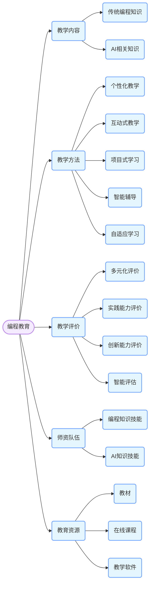

# 未来编程教育在AI时代的转型与创新路径规划

> 关键词：编程教育、AI时代、转型、创新路径、教育改革

> 摘要：随着AI时代的到来，编程教育面临着前所未有的挑战与机遇。传统的编程教育模式已难以适应时代发展的需求，亟需进行转型与创新。本文旨在深入探讨未来编程教育在AI时代的转型与创新路径，通过分析背景、核心概念、算法原理、数学模型等多方面内容，结合项目实战和实际应用场景，为编程教育的发展提供全面且具有前瞻性的规划，助力编程教育在AI时代实现质的飞跃。

## 1. 背景介绍 
### 1.1 目的和范围
在AI时代，人工智能技术的快速发展深刻改变了各个领域的工作方式和社会结构。编程作为实现人工智能的重要手段，其教育的重要性日益凸显。本文章的目的在于研究如何使编程教育更好地适应AI时代的需求，通过探索转型与创新路径，提高编程教育的质量和效果，培养出更多符合时代需求的编程人才。范围涵盖了编程教育的各个层面，包括教学内容、教学方法、教学评价等，以及与AI技术结合的相关领域。

### 1.2 预期读者
本文预期读者包括从事编程教育的教师、教育机构的管理者、相关教育政策的制定者、对编程教育和AI技术发展感兴趣的研究人员，以及希望了解编程教育未来发展趋势的学生和家长。

### 1.3 文档结构概述
本文首先介绍编程教育在AI时代转型与创新的背景信息，包括目的、预期读者和文档结构。接着阐述核心概念与联系，明确相关概念的原理和架构。然后详细讲解核心算法原理和具体操作步骤，通过Python代码进行说明。再介绍数学模型和公式，并举例说明。之后通过项目实战展示代码实际案例并进行详细解释。随后探讨实际应用场景，推荐相关的工具和资源。最后总结未来发展趋势与挑战，提供常见问题与解答以及扩展阅读和参考资料。

### 1.4 术语表
#### 1.4.1 核心术语定义
- **编程教育**：指教授学生编程知识和技能，培养其逻辑思维、问题解决能力和创新能力的教育活动。
- **AI时代**：以人工智能技术为核心驱动力，在各个领域广泛应用人工智能技术，深刻改变社会生产生活方式的时代。
- **转型**：编程教育从传统模式向适应AI时代需求的新模式转变的过程。
- **创新路径**：为实现编程教育在AI时代的发展目标而采取的具有创新性的方法和策略。

#### 1.4.2 相关概念解释
- **人工智能**：研究、开发用于模拟、延伸和扩展人的智能的理论、方法、技术及应用系统的一门新的技术科学。
- **机器学习**：人工智能的一个分支领域，它使计算机能够从数据中学习模式和规律，而无需明确的编程指令。
- **深度学习**：一种基于人工神经网络的机器学习技术，通过构建多层神经网络来学习数据的复杂表示。

#### 1.4.3 缩略词列表
- **AI**：Artificial Intelligence（人工智能）
- **ML**：Machine Learning（机器学习）
- **DL**：Deep Learning（深度学习）

## 2. 核心概念与联系 

### 编程教育与AI时代的关系
在AI时代，编程教育的重要性愈发凸显。AI技术的实现离不开编程，而编程教育为AI的发展提供了人才支持。编程教育可以培养学生的逻辑思维和计算思维能力，这些能力是理解和应用AI技术的基础。同时，AI技术的发展也为编程教育带来了新的机遇和挑战，促使编程教育不断转型与创新。

### 编程教育转型与创新的核心概念原理
编程教育的转型与创新核心在于以学生为中心，结合AI技术的特点和需求，调整教学内容、教学方法和教学评价。教学内容应增加与AI相关的知识和技能，如机器学习、深度学习等；教学方法应采用更加个性化、互动式的教学方式，利用AI技术实现智能辅导和自适应学习；教学评价应更加注重学生的实践能力和创新能力的评价。

### 核心概念架构的文本示意图
编程教育在AI时代的转型与创新是一个系统工程，涉及多个方面的相互作用。以下是其核心概念架构的文本示意图：

- **教学内容**：传统编程知识与AI相关知识融合，包括编程语言、算法、数据结构、机器学习、深度学习等。
- **教学方法**：个性化教学、互动式教学、项目式学习等，借助AI技术实现智能辅导和自适应学习。
- **教学评价**：多元化评价体系，注重实践能力和创新能力的评价，利用AI技术进行智能评估。
- **师资队伍**：教师具备编程和AI相关知识与技能，能够适应新的教学模式。
- **教育资源**：丰富的教材、在线课程、教学软件等，与AI技术紧密结合。

### Mermaid流程图


## 3. 核心算法原理 & 具体操作步骤 

### 自适应学习算法原理
自适应学习是编程教育在AI时代转型与创新的重要教学方法之一，其核心算法可以基于机器学习的分类算法和推荐算法。以下是一个简单的自适应学习算法的Python实现示例：

```python
import numpy as np
from sklearn.tree import DecisionTreeClassifier
from sklearn.model_selection import train_test_split
from sklearn.metrics import accuracy_score

# 模拟学生的学习数据
# 特征包括学生的学习时间、作业完成率、测试成绩等
X = np.array([[2, 0.8, 80], [3, 0.9, 90], [1, 0.6, 60], [4, 0.95, 95]])
# 标签表示学生的学习水平，0表示初级，1表示中级，2表示高级
y = np.array([0, 1, 0, 2])

# 划分训练集和测试集
X_train, X_test, y_train, y_test = train_test_split(X, y, test_size=0.2, random_state=42)

# 构建决策树分类器
clf = DecisionTreeClassifier()

# 训练模型
clf.fit(X_train, y_train)

# 预测测试集
y_pred = clf.predict(X_test)

# 计算准确率
accuracy = accuracy_score(y_test, y_pred)
print(f"模型准确率: {accuracy}")

# 根据学生的学习数据进行学习水平预测
new_student = np.array([[3, 0.85, 85]])
predicted_level = clf.predict(new_student)
print(f"新学生的预测学习水平: {predicted_level}")
```

### 具体操作步骤
1. **数据收集**：收集学生的学习数据，包括学习时间、作业完成率、测试成绩等。
2. **数据预处理**：对收集到的数据进行清洗、归一化等处理，以便模型能够更好地学习。
3. **模型选择**：根据数据的特点和任务的需求，选择合适的机器学习模型，如决策树、神经网络等。
4. **模型训练**：使用训练数据对模型进行训练，调整模型的参数，使其能够准确地预测学生的学习水平。
5. **模型评估**：使用测试数据对训练好的模型进行评估，计算模型的准确率、召回率等指标，评估模型的性能。
6. **自适应学习**：根据学生的学习数据，使用训练好的模型预测学生的学习水平，然后为学生推荐适合其水平的学习内容和学习方法。

## 4. 数学模型和公式 & 详细讲解 & 举例说明 

### 决策树分类算法的数学模型和公式
决策树是一种常用的机器学习算法，用于分类和回归任务。决策树的数学模型可以表示为一个树形结构，每个内部节点表示一个特征上的测试，每个分支表示一个测试输出，每个叶节点表示一个类别或值。

决策树的构建过程基于信息增益、信息增益率、基尼指数等指标来选择最优的划分特征。以信息增益为例，信息增益的计算公式为：

$$
IG(D, A) = H(D) - \sum_{v=1}^{V} \frac{|D^v|}{|D|} H(D^v)
$$

其中，$IG(D, A)$ 表示特征 $A$ 对数据集 $D$ 的信息增益，$H(D)$ 表示数据集 $D$ 的信息熵，$D^v$ 表示数据集 $D$ 中特征 $A$ 取值为 $v$ 的子集，$V$ 表示特征 $A$ 的取值个数。

信息熵的计算公式为：

$$
H(D) = - \sum_{k=1}^{K} p_k \log_2 p_k
$$

其中，$p_k$ 表示数据集 $D$ 中第 $k$ 类样本所占的比例，$K$ 表示类别个数。

### 详细讲解
信息增益的本质是衡量特征对数据集的分类能力。信息熵表示数据集的不确定性，信息增益越大，说明特征对数据集的分类能力越强，越适合作为划分特征。

### 举例说明
假设有一个数据集 $D$ 包含 10 个样本，分为两类，其中第一类有 6 个样本，第二类有 4 个样本。则数据集 $D$ 的信息熵为：

$$
H(D) = - \frac{6}{10} \log_2 \frac{6}{10} - \frac{4}{10} \log_2 \frac{4}{10} \approx 0.971
$$

假设有一个特征 $A$，其取值有两个，$A_1$ 和 $A_2$。在 $A_1$ 取值下的子集 $D_1$ 有 4 个样本，其中第一类有 3 个，第二类有 1 个；在 $A_2$ 取值下的子集 $D_2$ 有 6 个样本，其中第一类有 3 个，第二类有 3 个。则子集 $D_1$ 和 $D_2$ 的信息熵分别为：

$$
H(D_1) = - \frac{3}{4} \log_2 \frac{3}{4} - \frac{1}{4} \log_2 \frac{1}{4} \approx 0.811
$$

$$
H(D_2) = - \frac{3}{6} \log_2 \frac{3}{6} - \frac{3}{6} \log_2 \frac{3}{6} = 1
$$

特征 $A$ 对数据集 $D$ 的信息增益为：

$$
IG(D, A) = H(D) - \frac{4}{10} H(D_1) - \frac{6}{10} H(D_2) \approx 0.971 - \frac{4}{10} \times 0.811 - \frac{6}{10} \times 1 \approx 0.135
$$

## 5. 项目实战：代码实际案例和详细解释说明 

### 5.1  开发环境搭建
本项目实战使用Python语言进行开发，需要安装以下库：
- **scikit-learn**：用于机器学习算法的实现。
- **numpy**：用于数值计算。
- **pandas**：用于数据处理和分析。

可以使用以下命令进行安装：

```sh
pip install scikit-learn numpy pandas
```

### 5.2  源代码详细实现和代码解读
以下是一个简单的编程教育自适应学习系统的代码示例：

```python
import pandas as pd
from sklearn.tree import DecisionTreeClassifier
from sklearn.model_selection import train_test_split
from sklearn.metrics import accuracy_score

# 读取学生学习数据
data = pd.read_csv('student_data.csv')

# 提取特征和标签
X = data[['study_time', 'assignment_completion_rate', 'test_score']]
y = data['learning_level']

# 划分训练集和测试集
X_train, X_test, y_train, y_test = train_test_split(X, y, test_size=0.2, random_state=42)

# 构建决策树分类器
clf = DecisionTreeClassifier()

# 训练模型
clf.fit(X_train, y_train)

# 预测测试集
y_pred = clf.predict(X_test)

# 计算准确率
accuracy = accuracy_score(y_test, y_pred)
print(f"模型准确率: {accuracy}")

# 根据新学生的学习数据进行学习水平预测
new_student_data = pd.DataFrame({'study_time': [3], 'assignment_completion_rate': [0.85], 'test_score': [85]})
predicted_level = clf.predict(new_student_data)
print(f"新学生的预测学习水平: {predicted_level}")
```

### 5.3  代码解读与分析
1. **数据读取**：使用 `pandas` 库的 `read_csv` 函数读取学生的学习数据，存储在 `data` 变量中。
2. **特征提取**：从数据中提取特征 `study_time`（学习时间）、`assignment_completion_rate`（作业完成率）、`test_score`（测试成绩）作为输入特征 `X`，提取 `learning_level`（学习水平）作为标签 `y`。
3. **数据集划分**：使用 `train_test_split` 函数将数据集划分为训练集和测试集，测试集占比为 20%。
4. **模型构建**：使用 `DecisionTreeClassifier` 构建决策树分类器。
5. **模型训练**：使用训练集数据对模型进行训练。
6. **模型预测**：使用训练好的模型对测试集数据进行预测，得到预测结果 `y_pred`。
7. **模型评估**：使用 `accuracy_score` 函数计算模型的准确率。
8. **新学生预测**：创建一个新学生的学习数据 `new_student_data`，使用训练好的模型对其学习水平进行预测。

## 6. 实际应用场景 
### 学校编程教育
在学校的编程教育中，自适应学习系统可以根据学生的学习情况为其提供个性化的学习内容和学习方法。例如，对于学习能力较强的学生，可以提供更具挑战性的编程项目；对于学习能力较弱的学生，可以提供更多的基础知识讲解和练习。同时，教师可以通过系统了解学生的学习进度和困难，及时进行辅导和指导。

### 在线编程教育平台
在线编程教育平台可以利用AI技术实现智能辅导和自适应学习。学生在学习过程中，系统可以实时监测学生的学习行为和表现，根据学生的情况提供及时的反馈和建议。例如，当学生在编写代码时出现错误，系统可以自动提示错误类型和解决方法；当学生完成一个项目后，系统可以根据项目的质量和难度为学生提供相应的评价和建议。

### 企业编程培训
企业在进行编程培训时，可以使用AI技术对员工的编程能力进行评估和分析，根据员工的能力水平制定个性化的培训计划。例如，对于新入职的员工，可以提供基础的编程知识培训；对于有一定经验的员工，可以提供高级的编程技术和项目管理培训。同时，企业可以利用AI技术对培训效果进行评估和跟踪，及时调整培训内容和方法。

## 7. 工具和资源推荐
### 7.1 学习资源推荐
#### 7.1.1 书籍推荐
- 《Python编程从入门到实践》：适合初学者，通过实际项目介绍Python编程的基础知识和应用。
- 《机器学习》（周志华著）：全面介绍机器学习的基本概念、算法和应用，是机器学习领域的经典教材。
- 《深度学习》（Ian Goodfellow等著）：深度学习领域的权威著作，深入介绍深度学习的原理、算法和应用。

#### 7.1.2 在线课程
- Coursera上的“机器学习”课程（Andrew Ng教授主讲）：经典的机器学习课程，内容全面，讲解详细。
- edX上的“Python基础”课程：适合初学者，系统介绍Python编程的基础知识。
- 中国大学MOOC上的“人工智能基础”课程：介绍人工智能的基本概念、算法和应用。

#### 7.1.3 技术博客和网站
- 博客园：汇聚了众多技术开发者的博客，提供丰富的编程技术文章和经验分享。
- 开源中国：关注开源技术和开源项目，提供最新的技术资讯和开源项目介绍。
- Kaggle：全球知名的数据科学竞赛平台，提供大量的数据集和竞赛项目，适合学习和实践机器学习和数据科学。

### 7.2 开发工具框架推荐
#### 7.2.1 IDE和编辑器
- PyCharm：专业的Python集成开发环境，提供丰富的功能和插件，适合Python开发。
- Visual Studio Code：轻量级的代码编辑器，支持多种编程语言，具有丰富的插件生态系统。
- Jupyter Notebook：交互式的编程环境，适合数据科学和机器学习的开发和实验。

#### 7.2.2 调试和性能分析工具
- PDB：Python自带的调试工具，用于调试Python代码。
- Py-Spy：用于分析Python代码的性能，找出性能瓶颈。
- TensorBoard：TensorFlow的可视化工具，用于可视化训练过程和模型结构。

#### 7.2.3 相关框架和库
- TensorFlow：Google开发的深度学习框架，具有强大的功能和广泛的应用。
- PyTorch：Facebook开发的深度学习框架，易于使用和调试，适合科研和开发。
- Scikit-learn：用于机器学习的Python库，提供了丰富的机器学习算法和工具。

### 7.3 相关论文著作推荐
#### 7.3.1 经典论文
- “A Logical Calculus of the Ideas Immanent in Nervous Activity”（Warren S. McCulloch和Walter Pitts著）：提出了神经元模型，是神经网络领域的开创性论文。
- “Learning Representations by Back-propagating Errors”（David E. Rumelhart等著）：介绍了反向传播算法，是深度学习领域的重要论文。

#### 7.3.2 最新研究成果
- 关注顶级学术会议如NeurIPS、ICML、CVPR等的最新论文，了解人工智能和机器学习领域的最新研究成果。
- 查阅相关学术期刊如Journal of Artificial Intelligence Research、Artificial Intelligence等的最新文章。

#### 7.3.3 应用案例分析
- 研究一些成功的人工智能应用案例，如AlphaGo、自动驾驶汽车等，了解人工智能技术在实际应用中的实现方法和挑战。

## 8. 总结：未来发展趋势与挑战
### 未来发展趋势
- **个性化教育**：随着AI技术的不断发展，编程教育将更加注重个性化，根据学生的学习能力、兴趣爱好和学习目标提供个性化的学习方案。
- **跨学科融合**：编程教育将与其他学科如数学、物理、艺术等进行更深入的融合，培养学生的综合素养和创新能力。
- **实践与创新能力培养**：更加注重学生的实践能力和创新能力的培养，通过项目式学习、竞赛等方式提高学生的实际编程能力和解决问题的能力。
- **终身学习**：编程教育将不再局限于学校教育，而是贯穿于人们的整个职业生涯，成为一种终身学习的需求。

### 挑战
- **师资队伍建设**：培养具备编程和AI相关知识与技能的教师队伍是编程教育转型与创新的关键，但目前师资短缺是一个普遍存在的问题。
- **教育资源整合**：如何整合丰富的教育资源，为学生提供优质、高效的学习资源是一个挑战。
- **技术更新换代快**：AI技术发展迅速，编程教育需要及时跟上技术的更新换代，调整教学内容和方法。
- **教育公平性**：如何确保不同地区、不同阶层的学生都能享受到优质的编程教育，是实现教育公平的重要问题。

## 9. 附录：常见问题与解答
### 问题1：编程教育在AI时代有哪些重要性？
编程教育在AI时代具有重要意义。首先，编程是实现AI技术的基础，通过编程教育可以培养学生的计算思维和逻辑思维能力，为他们理解和应用AI技术打下坚实的基础。其次，编程教育可以培养学生的创新能力和解决问题的能力，使他们能够适应未来社会的发展需求。最后，编程教育可以为AI产业的发展提供人才支持，促进AI技术的广泛应用和发展。

### 问题2：如何选择适合的编程教育课程？
选择适合的编程教育课程需要考虑以下几个方面：
- **学生的年龄和基础**：根据学生的年龄和编程基础选择合适难度的课程。
- **课程内容**：课程内容应涵盖编程的基础知识和技能，同时结合AI技术的应用。
- **教学方法**：选择采用个性化、互动式教学方法的课程，能够提高学生的学习兴趣和学习效果。
- **师资力量**：了解教师的教学经验和专业背景，确保教师能够提供优质的教学服务。
- **学习评价**：选择有完善学习评价体系的课程，能够及时了解学生的学习情况和进步。

### 问题3：编程教育与传统教育有哪些不同？
编程教育与传统教育有以下几个方面的不同：
- **教学内容**：编程教育注重培养学生的编程知识和技能，以及计算思维和逻辑思维能力；传统教育更注重学科知识的传授。
- **教学方法**：编程教育采用更加个性化、互动式的教学方法，如项目式学习、实践操作等；传统教育主要采用课堂讲授的方式。
- **学习评价**：编程教育更注重学生的实践能力和创新能力的评价；传统教育主要以考试成绩作为评价标准。
- **教育目标**：编程教育的目标是培养学生的编程能力和创新能力，使他们能够适应未来社会的发展需求；传统教育的目标是传授知识，培养学生的综合素质。

## 10. 扩展阅读 & 参考资料
### 扩展阅读
- 《人工智能时代的教育革命》：探讨了人工智能时代教育面临的挑战和机遇，以及教育改革的方向和策略。
- 《未来简史：从智人到神人》：从宏观的角度探讨了未来社会的发展趋势和人类的命运，对理解编程教育在AI时代的重要性有一定的启发。

### 参考资料
- 相关学术论文和研究报告，如《人工智能教育发展白皮书》等。
- 在线教育平台和教育机构的官方网站，获取最新的编程教育资讯和课程信息。
- 相关行业标准和规范，如《信息技术课程标准》等。