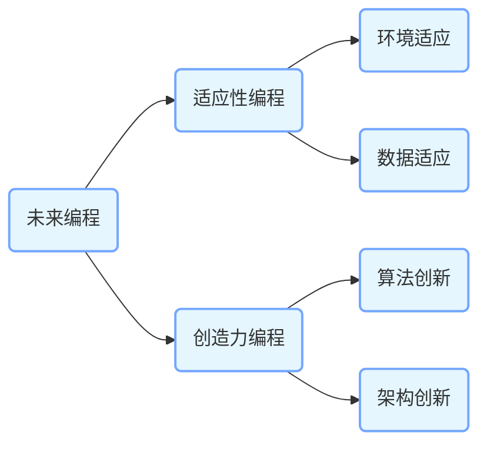

# 未来编程的核心：适应性与创造力

> 关键词：未来编程、适应性、创造力、编程范式、人工智能融合

> 摘要：本文深入探讨了未来编程的核心要素——适应性与创造力。在科技飞速发展的当下，编程领域正经历着前所未有的变革。适应性使得程序能够在不同的环境和需求下灵活运行，而创造力则推动着新的编程思路和解决方案的诞生。文章首先介绍了相关背景，包括目的、预期读者等内容。接着阐述了适应性与创造力的核心概念及其联系，详细讲解了支撑它们的核心算法原理与操作步骤，通过数学模型和公式进一步剖析其本质。结合项目实战案例，展示了适应性与创造力在实际编程中的应用。分析了它们在不同场景下的实际应用，并推荐了一系列学习资源、开发工具和相关论文著作。最后总结了未来发展趋势与挑战，解答了常见问题，并提供了扩展阅读和参考资料，旨在为读者全面呈现未来编程中适应性与创造力的重要性和应用方式。

## 1. 背景介绍 
### 1.1 目的和范围
本文章的目的在于深入探究未来编程中适应性与创造力的重要性及其具体应用。随着计算机技术的迅猛发展，编程领域不断涌现新的需求和挑战。传统的编程方法在面对复杂多变的环境时，往往显得力不从心。因此，理解和掌握适应性与创造力这两个核心要素，对于程序员、软件架构师以及相关领域的从业者来说至关重要。

文章的范围涵盖了适应性与创造力在编程中的基本概念、算法原理、数学模型、实际应用案例等多个方面。通过对这些内容的详细阐述，帮助读者全面了解未来编程的发展趋势，以及如何在实际工作中运用适应性与创造力来提升编程水平和解决问题的能力。

### 1.2 预期读者
本文预期读者包括但不限于以下几类人群：
- **程序员**：希望提升自身编程技能，适应未来编程发展趋势的专业人员。
- **软件架构师**：负责设计和规划软件系统架构，需要在设计过程中融入适应性与创造力的专业人士。
- **计算机科学相关专业的学生**：对编程领域感兴趣，希望了解未来编程核心要素的学生群体。
- **技术管理者**：负责团队的技术方向和项目管理，需要了解未来编程趋势以做出合理决策的管理人员。
- **对编程领域发展趋势感兴趣的爱好者**：希望了解未来编程发展方向的普通读者。

### 1.3 文档结构概述
本文将按照以下结构进行组织：
- **核心概念与联系**：介绍适应性与创造力在编程中的核心概念，通过文本示意图和 Mermaid 流程图展示它们之间的联系。
- **核心算法原理 & 具体操作步骤**：详细讲解支撑适应性与创造力的核心算法原理，并使用 Python 源代码进行阐述。
- **数学模型和公式 & 详细讲解 & 举例说明**：通过数学模型和公式进一步剖析适应性与创造力的本质，并给出具体的例子进行说明。
- **项目实战：代码实际案例和详细解释说明**：结合实际项目案例，展示适应性与创造力在编程中的具体应用，包括开发环境搭建、源代码实现和代码解读。
- **实际应用场景**：分析适应性与创造力在不同场景下的实际应用。
- **工具和资源推荐**：推荐一系列学习资源、开发工具和相关论文著作，帮助读者进一步深入学习。
- **总结：未来发展趋势与挑战**：总结未来编程中适应性与创造力的发展趋势，并分析可能面临的挑战。
- **附录：常见问题与解答**：解答读者在阅读过程中可能遇到的常见问题。
- **扩展阅读 & 参考资料**：提供相关的扩展阅读材料和参考资料，方便读者进一步深入研究。

### 1.4 术语表
#### 1.4.1 核心术语定义
- **适应性编程**：指程序能够根据不同的环境、输入数据和需求，自动调整自身的行为和结构，以达到最优的运行效果。
- **创造力编程**：指程序员在编程过程中，运用创新思维和独特的方法，提出新的编程思路、算法和解决方案，以解决复杂的问题或实现新的功能。
- **编程范式**：是指编程的基本风格和方法，常见的编程范式包括面向对象编程、函数式编程、过程式编程等。
- **人工智能融合**：指将人工智能技术与传统编程技术相结合，使程序能够具备智能决策、学习和自适应的能力。

#### 1.4.2 相关概念解释
- **动态适应性**：程序在运行过程中，能够实时感知环境的变化，并根据变化自动调整自身的行为。例如，一个智能推荐系统能够根据用户的行为和偏好，实时调整推荐内容。
- **静态适应性**：程序在设计和开发阶段，就考虑到不同的环境和需求，通过合理的架构设计和参数配置，使程序能够在多种情况下正常运行。例如，一个跨平台的应用程序，在不同的操作系统上都能稳定运行。
- **创造性思维**：是指突破传统思维的束缚，从不同的角度思考问题，提出新颖、独特的解决方案的思维方式。在编程中，创造性思维可以体现在算法设计、架构设计、用户界面设计等多个方面。

#### 1.4.3 缩略词列表
- **OOP**：Object-Oriented Programming，面向对象编程
- **FP**：Functional Programming，函数式编程
- **AI**：Artificial Intelligence，人工智能

## 2. 核心概念与联系 

### 适应性编程的核心概念
适应性编程的核心在于程序能够根据不同的情况做出相应的调整。这涉及到多个方面，例如对不同输入数据的处理、对不同运行环境的适应等。在现代编程中，软件可能会在各种不同的设备和操作系统上运行，这就要求程序具备良好的适应性。

### 创造力编程的核心概念
创造力编程强调的是在编程过程中发挥创新思维，提出独特的解决方案。这可能包括设计新的算法、采用新颖的架构设计或者创造出独特的用户体验。创造力是推动编程领域不断发展的重要动力。

### 两者的联系
适应性和创造力并不是相互独立的，而是相互促进的关系。创造力可以帮助程序员设计出更具适应性的程序。例如，通过创新的算法设计，可以使程序在处理不同类型的数据时更加灵活。而适应性的需求也会激发程序员的创造力，促使他们寻找更好的解决方案来应对各种变化。

### 文本示意图
适应性与创造力在编程中相互交织，共同构成了未来编程的核心。可以用一个简单的示意图来表示：

```plaintext
          未来编程
         /         \
  适应性编程     创造力编程
    /   \           /   \
环境适应 数据适应 算法创新 架构创新
```

### Mermaid 流程图


## 3. 核心算法原理 & 具体操作步骤 

### 适应性编程的核心算法原理
适应性编程的一个重要算法原理是基于反馈机制的自适应调整。以一个简单的温度控制程序为例，我们可以使用 Python 来实现这个算法。

```python
class TemperatureController:
    def __init__(self, target_temperature):
        self.target_temperature = target_temperature
        self.current_temperature = 0
        self.adjustment_factor = 0.1

    def sense_temperature(self, new_temperature):
        self.current_temperature = new_temperature

    def adjust_heating(self):
        temperature_difference = self.target_temperature - self.current_temperature
        adjustment = temperature_difference * self.adjustment_factor
        return adjustment
```

### 具体操作步骤
1. **初始化**：创建 `TemperatureController` 类的实例，并设置目标温度。
```python
controller = TemperatureController(25)
```
2. **感知温度**：模拟传感器读取当前温度，并更新控制器的当前温度值。
```python
controller.sense_temperature(20)
```
3. **调整加热**：根据当前温度和目标温度的差值，计算需要调整的加热量。
```python
adjustment = controller.adjust_heating()
print(f"需要调整的加热量: {adjustment}")
```

### 创造力编程的核心算法原理
创造力编程的核心在于突破传统思维，设计出新颖的算法。以一个简单的图像处理算法为例，我们可以实现一个独特的图像模糊算法。

```python
import numpy as np
from PIL import Image

def creative_blur(image, radius):
    width, height = image.size
    result = np.array(image)
    for x in range(width):
        for y in range(height):
            neighborhood = []
            for i in range(max(0, x - radius), min(width, x + radius + 1)):
                for j in range(max(0, y - radius), min(height, y + radius + 1)):
                    neighborhood.append(result[j, i])
            neighborhood = np.array(neighborhood)
            average_color = np.mean(neighborhood, axis=0)
            result[y, x] = average_color
    return Image.fromarray(result.astype(np.uint8))
```

### 具体操作步骤
1. **打开图像**：使用 `PIL` 库打开需要处理的图像。
```python
image = Image.open("example.jpg")
```
2. **应用创造性模糊算法**：调用 `creative_blur` 函数，设置模糊半径。
```python
blurred_image = creative_blur(image, 5)
```
3. **保存处理后的图像**：将处理后的图像保存到文件中。
```python
blurred_image.save("blurred_example.jpg")
```

## 4. 数学模型和公式 & 详细讲解 & 举例说明 

### 适应性编程的数学模型和公式
在适应性编程中，常见的数学模型是基于反馈控制理论的模型。以之前的温度控制程序为例，我们可以用以下公式来描述：

设 $T_t$ 为目标温度，$T_c$ 为当前温度，$\Delta T$ 为温度差值，$A$ 为调整量，$k$ 为调整因子。

则有：
$$\Delta T = T_t - T_c$$
$$A = k \times \Delta T$$

详细讲解：温度差值 $\Delta T$ 表示当前温度与目标温度之间的差距。调整因子 $k$ 控制着每次调整的幅度。通过将温度差值乘以调整因子，得到需要调整的加热量 $A$。

举例说明：假设目标温度 $T_t = 25^{\circ}C$，当前温度 $T_c = 20^{\circ}C$，调整因子 $k = 0.1$。

则温度差值 $\Delta T = 25 - 20 = 5^{\circ}C$，调整量 $A = 0.1 \times 5 = 0.5$。

### 创造力编程的数学模型和公式
在创造力编程中，数学模型和公式往往更加多样化，取决于具体的创新算法。以之前的图像模糊算法为例，我们可以用以下公式来描述像素点的模糊过程。

设 $(x, y)$ 为图像中的一个像素点，$N(x, y, r)$ 为以 $(x, y)$ 为中心，半径为 $r$ 的邻域像素集合，$C_{avg}$ 为邻域像素的平均颜色值。

则有：
$$C_{avg} = \frac{1}{|N(x, y, r)|} \sum_{(i, j) \in N(x, y, r)} C(i, j)$$

详细讲解：$|N(x, y, r)|$ 表示邻域像素集合的大小，$C(i, j)$ 表示邻域中每个像素的颜色值。通过对邻域中所有像素的颜色值求和，并除以邻域像素的数量，得到平均颜色值 $C_{avg}$。将这个平均颜色值赋给当前像素点 $(x, y)$，就实现了图像的模糊效果。

举例说明：假设在一个简单的灰度图像中，以像素点 $(x, y)$ 为中心，半径 $r = 1$ 的邻域像素集合为 $\{(x - 1, y - 1), (x - 1, y), (x - 1, y + 1), (x, y - 1), (x, y), (x, y + 1), (x + 1, y - 1), (x + 1, y), (x + 1, y + 1)\}$。

设这些像素的灰度值分别为 $[100, 110, 120, 90, 105, 115, 80, 95, 100]$。

则邻域像素集合的大小 $|N(x, y, 1)| = 9$，平均灰度值 $C_{avg} = \frac{1}{9} \times (100 + 110 + 120 + 90 + 105 + 115 + 80 + 95 + 100) = \frac{915}{9} \approx 101.67$。

将这个平均灰度值赋给像素点 $(x, y)$，就完成了该像素点的模糊处理。

## 5. 项目实战：代码实际案例和详细解释说明 

### 5.1  开发环境搭建
本次项目实战将使用 Python 语言进行开发，需要安装以下开发环境和库：
- **Python**：建议安装 Python 3.7 及以上版本。可以从 Python 官方网站（https://www.python.org/downloads/） 下载并安装。
- **Pillow**：用于图像处理，可通过以下命令进行安装：
```sh
pip install pillow
```

### 5.2  源代码详细实现和代码解读
我们将实现一个简单的智能推荐系统，结合适应性和创造力，根据用户的历史行为和偏好，推荐个性化的内容。

```python
import random

# 用户类
class User:
    def __init__(self, user_id, preferences):
        self.user_id = user_id
        self.preferences = preferences
        self.history = []

    def add_history(self, item):
        self.history.append(item)

    def get_preferences(self):
        return self.preferences

# 内容类
class Content:
    def __init__(self, content_id, category):
        self.content_id = content_id
        self.category = category

# 智能推荐系统类
class SmartRecommendationSystem:
    def __init__(self, users, contents):
        self.users = users
        self.contents = contents

    def recommend(self, user_id):
        user = next((u for u in self.users if u.user_id == user_id), None)
        if user is None:
            return []
        preferences = user.get_preferences()
        history = user.history
        # 适应性部分：根据用户历史行为调整推荐权重
        category_weights = {category: 1 for category in preferences}
        for item in history:
            item_category = next((c.category for c in self.contents if c.content_id == item), None)
            if item_category in category_weights:
                category_weights[item_category] += 1
        # 创造力部分：随机引入一些不同类别的内容
        random_content = random.choice(self.contents)
        recommendations = []
        for content in self.contents:
            if content.category in preferences:
                weight = category_weights[content.category]
                if random.random() < weight / sum(category_weights.values()):
                    recommendations.append(content.content_id)
        if random_content.content_id not in recommendations:
            recommendations.append(random_content.content_id)
        return recommendations
```

### 5.3  代码解读与分析
- **用户类（User）**：用于表示系统中的用户，包含用户的 ID、偏好和历史行为记录。`add_history` 方法用于添加用户的历史行为，`get_preferences` 方法用于获取用户的偏好。
- **内容类（Content）**：用于表示系统中的内容，包含内容的 ID 和类别。
- **智能推荐系统类（SmartRecommendationSystem）**：核心类，实现了智能推荐的功能。`recommend` 方法根据用户的 ID 进行推荐。
    - **适应性部分**：通过统计用户历史行为中不同类别的内容出现的次数，调整不同类别的推荐权重。出现次数越多的类别，推荐权重越高。
    - **创造力部分**：随机选择一个内容添加到推荐列表中，引入一些不同类别的内容，增加推荐的多样性。

## 6. 实际应用场景 

### 智能物联网设备
在智能物联网设备中，适应性与创造力编程发挥着重要作用。例如，智能家居系统中的智能温度控制器，需要根据不同的环境温度、用户的习惯和需求，自动调整室内温度。这就要求程序具备良好的适应性，能够实时感知环境变化并做出相应的调整。同时，创造力编程可以用于设计新颖的用户交互界面和智能控制算法，提升用户体验。

### 金融科技领域
在金融科技领域，适应性与创造力编程也有广泛的应用。例如，风险评估模型需要根据市场情况、客户的信用记录等因素，实时调整评估结果。这就需要程序具备适应性，能够处理不同类型的数据和变化的市场环境。创造力编程可以用于开发新的金融产品和服务，例如个性化的投资组合推荐系统，通过创新的算法和模型，为客户提供更加精准的投资建议。

### 医疗保健行业
在医疗保健行业，适应性与创造力编程可以用于开发智能医疗设备和医疗信息系统。例如，智能可穿戴设备可以实时监测患者的生命体征，并根据患者的健康状况自动调整监测频率和报警阈值。这就要求程序具备适应性，能够根据不同患者的情况做出相应的调整。创造力编程可以用于开发新的医疗诊断算法和治疗方案，例如基于人工智能的疾病预测模型，通过创新的算法和数据挖掘技术，提高疾病的早期诊断率和治疗效果。

### 游戏开发
在游戏开发中，适应性与创造力编程是实现高质量游戏的关键。例如，游戏中的人工智能角色需要根据玩家的行为和游戏场景，自动调整自己的行为和策略。这就要求程序具备适应性，能够实时感知玩家的行为并做出相应的反应。创造力编程可以用于设计新颖的游戏玩法、关卡设计和角色设定，提升游戏的趣味性和吸引力。

## 7. 工具和资源推荐
### 7.1 学习资源推荐
#### 7.1.1 书籍推荐
- 《Python 编程从入门到实践》：适合初学者学习 Python 编程的基础知识和实践技巧。
- 《代码大全》：全面介绍了软件开发的各个方面，包括编程实践、软件设计、项目管理等。
- 《人工智能：一种现代的方法》：经典的人工智能教材，涵盖了人工智能的各个领域，包括机器学习、自然语言处理、计算机视觉等。

#### 7.1.2 在线课程
- Coursera 上的“Python for Everybody”：由密歇根大学提供的 Python 编程课程，适合初学者。
- edX 上的“Artificial Intelligence”：由伯克利大学提供的人工智能课程，涵盖了人工智能的核心概念和算法。
- Udemy 上的“Full Stack Web Development with Python and Django”：学习使用 Python 和 Django 进行全栈 Web 开发的课程。

#### 7.1.3 技术博客和网站
- Medium：一个技术博客平台，有很多关于编程、人工智能、机器学习等领域的优秀文章。
- Stack Overflow：一个程序员社区，提供了大量的编程问题解答和技术交流。
- Hacker News：一个科技新闻和技术讨论网站，关注最新的科技动态和技术趋势。

### 7.2 开发工具框架推荐
#### 7.2.1 IDE和编辑器
- PyCharm：专业的 Python 集成开发环境，提供了丰富的代码编辑、调试和版本控制功能。
- Visual Studio Code：轻量级的代码编辑器，支持多种编程语言，有丰富的插件生态系统。
- Jupyter Notebook：交互式的开发环境，适合进行数据分析、机器学习和科学计算。

#### 7.2.2 调试和性能分析工具
- PDB：Python 自带的调试器，用于调试 Python 代码。
- cProfile：Python 自带的性能分析工具，用于分析 Python 代码的性能瓶颈。
- Py-Spy：一个轻量级的 Python 性能分析工具，无需修改代码即可进行性能分析。

#### 7.2.3 相关框架和库
- TensorFlow：开源的机器学习框架，用于开发深度学习模型。
- PyTorch：另一个流行的深度学习框架，提供了动态图和静态图两种编程模式。
- Django：Python 的 Web 开发框架，适合快速开发 Web 应用程序。

### 7.3 相关论文著作推荐
#### 7.3.1 经典论文
- “A Mathematical Theory of Communication”：香农的经典论文，奠定了信息论的基础。
- “Perceptrons: An Introduction to Computational Geometry”：罗森布拉特的经典论文，介绍了感知机模型，是神经网络的早期研究成果。
- “ImageNet Classification with Deep Convolutional Neural Networks”：AlexNet 的论文，开启了深度学习在计算机视觉领域的革命。

#### 7.3.2 最新研究成果
- arXiv 上关于人工智能、机器学习、编程范式等领域的最新研究论文。
- 顶级学术会议（如 NeurIPS、ICML、CVPR 等）上的最新研究成果。

#### 7.3.3 应用案例分析
- 《AI in Practice: How 50 Successful Companies Used Artificial Intelligence to Solve Problems》：介绍了 50 家成功应用人工智能解决问题的公司案例。
- 《Lean Software Development: An Agile Toolkit》：介绍了精益软件开发的理念和方法，包含了很多实际项目的案例分析。

## 8. 总结：未来发展趋势与挑战
### 未来发展趋势
- **人工智能与编程的深度融合**：未来，人工智能技术将与编程更加紧密地结合。适应性编程将借助人工智能的学习和推理能力，实现更加智能的自适应调整。创造力编程将通过人工智能的启发式搜索和生成模型，激发更多的创新思路和解决方案。
- **低代码和无代码编程的兴起**：随着编程技术的普及和需求的增加，低代码和无代码编程将成为未来的发展趋势。这将降低编程的门槛，使更多非专业程序员能够参与到软件开发中来。适应性与创造力将在低代码和无代码编程平台的设计和应用中发挥重要作用，帮助用户快速创建出适应不同需求的应用程序。
- **跨学科编程的发展**：未来的编程将不再局限于计算机科学领域，而是与其他学科（如生物学、物理学、经济学等）深度融合。适应性与创造力将帮助程序员在跨学科的环境中，更好地理解和解决复杂的问题，开发出具有创新性的应用程序。

### 挑战
- **技术更新换代快**：编程领域的技术更新换代非常快，新的编程语言、框架和算法不断涌现。程序员需要不断学习和掌握新的技术，以适应未来编程的发展需求。这对程序员的学习能力和适应能力提出了很高的要求。
- **数据隐私和安全问题**：随着适应性编程对数据的依赖程度越来越高，数据隐私和安全问题将成为一个重要的挑战。程序员需要在保证程序适应性的同时，确保数据的安全性和隐私性，防止数据泄露和滥用。
- **伦理和社会问题**：创造力编程可能会带来一些伦理和社会问题。例如，人工智能算法的决策过程可能存在偏见和不公平性，这可能会对社会造成负面影响。程序员需要在开发过程中考虑这些伦理和社会问题，确保程序的设计和应用符合道德和法律要求。

## 9. 附录：常见问题与解答
### 如何培养编程中的适应性和创造力？
- **学习多种编程范式**：掌握不同的编程范式（如面向对象编程、函数式编程等），可以拓宽编程思路，提高适应性和创造力。
- **参与开源项目**：参与开源项目可以接触到不同的代码风格和编程思路，学习其他开发者的经验和技巧，从而提升自己的编程能力。
- **实践创新**：在日常编程中，尝试用不同的方法解决问题，不断挑战自己，培养创新思维。

### 适应性编程和传统编程有什么区别？
- **灵活性**：适应性编程更加灵活，能够根据不同的环境和需求自动调整程序的行为，而传统编程通常是按照预设的逻辑执行。
- **动态性**：适应性编程强调程序的动态调整能力，能够实时感知环境变化并做出相应的反应，而传统编程的逻辑相对固定。

### 创造力编程是否只适用于高级程序员？
不是的。创造力编程并不是高级程序员的专属技能。每个程序员都可以通过不断学习和实践，培养自己的创新思维和创造力。即使是初学者，也可以在简单的编程任务中尝试提出新颖的解决方案。

## 10. 扩展阅读 & 参考资料
### 扩展阅读
- 《编程珠玑》：通过实际案例介绍了编程中的技巧和方法，启发读者的编程思维。
- 《重构：改善既有代码的设计》：介绍了如何对现有代码进行重构，提高代码的可维护性和可扩展性。
- 《设计模式：可复用面向对象软件的基础》：经典的设计模式著作，介绍了 23 种常见的设计模式，帮助程序员提高软件设计能力。

### 参考资料
- Python 官方文档（https://docs.python.org/）
- TensorFlow 官方文档（https://www.tensorflow.org/）
- PyTorch 官方文档（https://pytorch.org/）
- 相关学术期刊和会议论文（如 ACM Transactions on Programming Languages and Systems、NeurIPS 等）